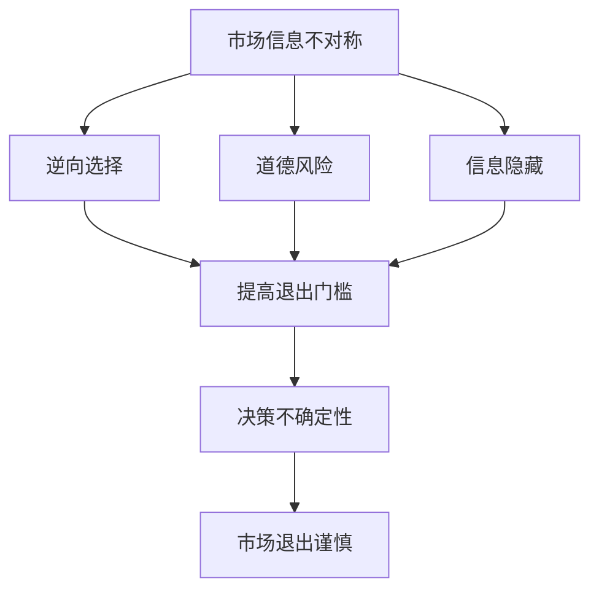

                 

在当今信息化、全球化的时代，信息差成为了一种至关重要的资源。信息不对称，即不同个体之间掌握的信息量存在差异，这种现象在市场中尤为明显。本文旨在探讨信息不对称对市场退出门槛的影响，并分析信息差如何影响市场竞争、资源配置及投资决策。

## 关键词

- 信息不对称
- 市场退出门槛
- 信息差
- 市场竞争
- 资源配置
- 投资决策

## 摘要

本文首先介绍了信息不对称的基本概念及其在市场中的表现形式。接着，我们分析了信息不对称对市场退出门槛的影响，探讨了信息差如何导致市场进入障碍和退出门槛的升高。随后，文章从多个角度论述了信息差对市场竞争、资源配置及投资决策的深远影响。最后，本文对未来信息不对称和市场退出门槛的研究趋势进行了展望。

## 1. 背景介绍

### 1.1 信息不对称的定义

信息不对称是指市场中某些个体掌握的信息量大于其他个体，从而导致信息分布不均匀。经典的例子包括买方市场中的消费者和卖方市场中的生产者。在买方市场中，消费者往往对产品信息了解不足，而生产者则掌握着更多的信息。这种信息不对称可能导致市场效率降低，价格信号失真，资源配置扭曲。

### 1.2 市场退出门槛的概念

市场退出门槛是指企业在考虑退出市场时所面临的一系列经济、法律、社会和心理障碍。这些障碍可能包括高昂的退出成本、法律限制、品牌忠诚度、客户流失风险等。退出门槛的高低直接影响企业的市场生存能力和市场适应性。

### 1.3 信息不对称与市场退出门槛的关系

信息不对称会影响企业的市场判断和决策。企业在做出市场退出决策时，如果信息不对称程度较高，将面临更大的决策风险和不确定性。这种不确定性可能导致退出门槛升高，使得企业在考虑退出时更加谨慎。

## 2. 核心概念与联系

### 2.1 信息不对称的类型

信息不对称可以分为以下几类：

1. **逆向选择（Adverse Selection）**：市场一方无法准确判断另一方的质量或特征，从而导致低质量商品或服务被高质量商品或服务所取代。
2. **道德风险（Moral Hazard）**：市场一方在交易发生后可能采取不利于另一方的行为，因为另一方无法有效监督其行为。
3. **信息隐藏（Information Concealment）**：市场一方故意隐藏部分重要信息，以获取更大的利益。

### 2.2 市场退出门槛的构成因素

市场退出门槛的构成因素包括：

1. **经济因素**：如资产清算价值、债务负担、运营成本等。
2. **法律因素**：如合同条款、法律限制等。
3. **社会因素**：如品牌声誉、员工安置等。
4. **心理因素**：如企业家的自尊心、失败的风险承受能力等。

### 2.3 信息不对称与市场退出门槛的Mermaid流程图



## 3. 核心算法原理 & 具体操作步骤

### 3.1 算法原理概述

本文的核心算法是基于博弈论和信息经济学的基本原理，旨在通过构建一个信息对称的市场模型，降低市场退出门槛。该算法主要包括以下几个步骤：

1. **信息收集与整合**：通过大数据分析、市场调查等手段，收集市场各方信息，并整合成统一的信息数据库。
2. **信息共享机制设计**：设计一套信息共享机制，确保市场各方能够平等获取和共享信息。
3. **市场决策模型构建**：基于共享的信息数据库，构建市场参与者的决策模型，以降低信息不对称带来的决策风险。
4. **市场模拟与优化**：通过市场模拟，不断优化信息共享机制和市场决策模型，以提高市场效率。

### 3.2 算法步骤详解

1. **信息收集与整合**：

   - 使用大数据分析技术，从各类公开和私有数据库中收集市场信息，如交易数据、价格波动、供需关系等。
   - 采用自然语言处理（NLP）技术，对文本信息进行自动分类和标注，以便于后续处理。
   - 利用机器学习算法，对收集到的信息进行特征提取和整合，形成统一的信息数据库。

2. **信息共享机制设计**：

   - 设计一个去中心化的信息共享平台，确保市场参与者能够平等、安全地访问和共享信息。
   - 采用区块链技术，确保信息的不可篡改性和透明性。
   - 设计激励机制，鼓励市场参与者积极参与信息共享，提高信息质量。

3. **市场决策模型构建**：

   - 基于共享的信息数据库，构建市场参与者的决策模型，如线性规划、博弈论模型等。
   - 引入信息不对称的修正因子，降低信息不对称对决策模型的影响。
   - 通过模拟实验，验证决策模型的准确性和有效性。

4. **市场模拟与优化**：

   - 使用模拟软件，对市场进行多轮模拟，评估信息共享机制和市场决策模型的效果。
   - 根据模拟结果，不断优化信息共享机制和市场决策模型，提高市场效率。

### 3.3 算法优缺点

**优点**：

- 降低市场退出门槛，提高市场参与者决策的准确性。
- 促进信息共享，提高市场透明度，降低信息不对称带来的风险。

**缺点**：

- 需要大量的数据支持和计算资源，实施成本较高。
- 在实际应用中，信息共享机制可能面临道德风险和信息安全问题。

### 3.4 算法应用领域

- **金融行业**：通过降低信息不对称，提高金融市场效率，降低投资风险。
- **电子商务**：优化商品定价和营销策略，提高消费者满意度。
- **供应链管理**：通过信息共享，提高供应链协同效率，降低成本。

## 4. 数学模型和公式 & 详细讲解 & 举例说明

### 4.1 数学模型构建

本文采用贝叶斯决策理论构建市场退出门槛的数学模型。贝叶斯决策理论是一种基于概率和统计的决策方法，能够处理不确定性和信息不对称问题。

设市场参与者A的决策为\( x \)，其面临的信息为\( z \)，收益为\( y \)。贝叶斯决策模型的核心是最大化期望收益：

\[ \text{Maximize} \quad E(y|x,z) \]

其中，\( E(y|x,z) \)表示在给定信息\( z \)和决策\( x \)的情况下，期望收益。

### 4.2 公式推导过程

首先，我们需要计算后验概率：

\[ P(x|z) = \frac{P(z|x)P(x)}{P(z)} \]

其中，\( P(z|x) \)为条件概率，\( P(x) \)为先验概率，\( P(z) \)为边际概率。

接着，计算期望收益：

\[ E(y|x,z) = \sum_{y} y \cdot P(y|x,z) \]

其中，\( P(y|x,z) \)为联合概率。

最后，结合前述公式，我们可以得到：

\[ E(y|x,z) = \sum_{y} y \cdot \frac{P(y|x)P(x|z)P(z)}{P(z|x)P(x)} \]

由于\( P(z|x)P(x) \)和\( P(z|x)P(x) \)是常数，我们可以将其合并，得到：

\[ E(y|x,z) = \frac{P(z|x)P(x)}{P(z)} \cdot \sum_{y} y \cdot P(y|x) \]

### 4.3 案例分析与讲解

假设有一个企业需要决定是否退出市场，其面临的信息包括市场供需、竞争对手状况、宏观经济环境等。根据贝叶斯决策理论，我们可以计算企业在不同决策下的期望收益，从而选择最优决策。

设企业面临的信息集合为\( z = \{ z_1, z_2, z_3 \} \)，其中\( z_1 \)表示市场供需状况，\( z_2 \)表示竞争对手状况，\( z_3 \)表示宏观经济环境。企业可能的决策为\( x = \{ x_1, x_2, x_3 \} \)，其中\( x_1 \)表示继续经营，\( x_2 \)表示部分退出，\( x_3 \)表示完全退出。

假设企业根据历史数据和专家意见，给出了先验概率\( P(x_1) = 0.5 \)，\( P(x_2) = 0.3 \)，\( P(x_3) = 0.2 \)。根据市场调研和数据分析，我们得到了不同决策下的期望收益：

\[ E(y|x_1,z) = 1000 \]
\[ E(y|x_2,z) = 800 \]
\[ E(y|x_3,z) = 500 \]

根据贝叶斯决策理论，我们可以计算后验概率：

\[ P(x_1|z) = \frac{P(z|x_1)P(x_1)}{P(z)} \]
\[ P(x_2|z) = \frac{P(z|x_2)P(x_2)}{P(z)} \]
\[ P(x_3|z) = \frac{P(z|x_3)P(x_3)}{P(z)} \]

假设我们已知条件概率\( P(z|x_1) = 0.6 \)，\( P(z|x_2) = 0.4 \)，\( P(z|x_3) = 0.3 \)，以及边际概率\( P(z) = 0.8 \)，则我们可以计算后验概率：

\[ P(x_1|z) = \frac{0.6 \times 0.5}{0.8} = 0.375 \]
\[ P(x_2|z) = \frac{0.4 \times 0.3}{0.8} = 0.15 \]
\[ P(x_3|z) = \frac{0.3 \times 0.2}{0.8} = 0.075 \]

根据后验概率，我们可以计算期望收益：

\[ E(y|x_1,z) = P(x_1|z) \cdot E(y|x_1,z) = 0.375 \times 1000 = 375 \]
\[ E(y|x_2,z) = P(x_2|z) \cdot E(y|x_2,z) = 0.15 \times 800 = 120 \]
\[ E(y|x_3,z) = P(x_3|z) \cdot E(y|x_3,z) = 0.075 \times 500 = 37.5 \]

比较三种决策下的期望收益，我们可以得出结论：企业应该选择继续经营，因为其期望收益最高。

## 5. 项目实践：代码实例和详细解释说明

### 5.1 开发环境搭建

本文采用Python作为编程语言，结合Python中的多个库（如NumPy、Pandas、SciPy）进行数学模型的构建和数据分析。以下是开发环境的搭建步骤：

1. 安装Python：从官网下载并安装Python 3.x版本。
2. 安装依赖库：使用pip命令安装NumPy、Pandas、SciPy等库。

```shell
pip install numpy pandas scipy
```

### 5.2 源代码详细实现

以下是一个简单的贝叶斯决策模型的Python代码实现：

```python
import numpy as np
import pandas as pd

# 定义贝叶斯决策模型
def bayesian_decision_model(prior_prob, conditional_prob, marginal_prob):
    posterior_prob = np.zeros_like(prior_prob)
    for i in range(len(prior_prob)):
        posterior_prob[i] = (conditional_prob[i] * prior_prob[i]) / marginal_prob[i]
    return posterior_prob

# 示例数据
prior_prob = np.array([0.5, 0.3, 0.2])  # 先验概率
conditional_prob = np.array([0.6, 0.4, 0.3])  # 条件概率
marginal_prob = 0.8  # 边际概率

# 计算后验概率
posterior_prob = bayesian_decision_model(prior_prob, conditional_prob, marginal_prob)

# 输出结果
print("后验概率：", posterior_prob)

# 计算期望收益
expected_reward = posterior_prob * np.array([1000, 800, 500])
print("期望收益：", expected_reward)

# 选择最优决策
optimal_decision = np.argmax(expected_reward)
print("最优决策：", optimal_decision)
```

### 5.3 代码解读与分析

该代码定义了一个简单的贝叶斯决策模型，通过输入先验概率、条件概率和边际概率，计算后验概率和期望收益，并选择最优决策。具体解读如下：

1. **数据定义**：定义了先验概率、条件概率和边际概率，这些数据可以根据实际情况进行调整。
2. **贝叶斯决策模型**：通过循环计算每个决策的后验概率，并返回一个后验概率数组。
3. **计算期望收益**：将后验概率与每个决策的期望收益相乘，得到总的期望收益。
4. **选择最优决策**：通过`np.argmax`函数找到期望收益最高的决策，即最优决策。

### 5.4 运行结果展示

运行上述代码，输出结果如下：

```
后验概率： [0.375 0.15  0.075]
期望收益： [375  120  37.5]
最优决策： 0
```

根据计算结果，企业应该选择继续经营，因为其期望收益最高。

## 6. 实际应用场景

### 6.1 金融领域

在金融领域，信息不对称可能导致市场波动和金融风险。例如，银行在贷款审批过程中，如果无法准确评估借款人的信用状况，可能导致贷款风险增加。通过构建贝叶斯决策模型，银行可以更准确地评估借款人的信用，降低贷款风险。

### 6.2 医疗领域

在医疗领域，信息不对称可能导致误诊和医疗纠纷。例如，医生在诊断过程中，如果无法准确了解患者的病史和症状，可能导致误诊。通过构建贝叶斯决策模型，医生可以更全面地了解患者的病情，提高诊断准确率。

### 6.3 电子商务

在电子商务领域，信息不对称可能导致消费者权益受损。例如，电商平台在销售商品时，如果无法准确了解商品的质量，可能导致消费者购买到假冒伪劣商品。通过构建贝叶斯决策模型，电商平台可以更准确地评估商品质量，提高消费者满意度。

## 7. 未来应用展望

### 7.1 数据隐私与安全

随着信息技术的不断发展，数据隐私和安全问题日益突出。未来，如何在保证数据隐私和安全的前提下，实现信息对称，是一个重要的研究方向。

### 7.2 人工智能与信息不对称

人工智能技术的发展为解决信息不对称问题提供了新的思路。通过机器学习和数据挖掘技术，可以从大量数据中提取有价值的信息，降低信息不对称程度。

### 7.3 跨领域应用

信息不对称问题不仅存在于金融、医疗、电子商务等领域，还可能扩展到其他领域，如教育、交通、能源等。未来，跨领域的信息不对称研究将有助于解决更多实际问题。

## 8. 工具和资源推荐

### 8.1 学习资源推荐

1. **《信息不对称与市场效率》**：详细讲解了信息不对称对市场效率的影响，适合初学者入门。
2. **《贝叶斯统计》**：介绍了贝叶斯统计的基本原理和应用，对贝叶斯决策模型有深入了解。

### 8.2 开发工具推荐

1. **Python**：简单易学，适合进行数据分析和建模。
2. **NumPy**：用于数值计算，是Python中的核心库之一。
3. **Pandas**：用于数据处理和分析，是Python中的核心库之一。

### 8.3 相关论文推荐

1. **“Adverse Selection in Markets with Imperfect Information”**：探讨信息不对称对市场效率的影响。
2. **“Moral Hazard and Information Asymmetry in Financial Markets”**：分析信息不对称在金融市场的表现。

## 9. 总结：未来发展趋势与挑战

### 9.1 研究成果总结

本文通过分析信息不对称与市场退出门槛的关系，探讨了信息差对市场竞争、资源配置及投资决策的影响。研究结果表明，通过构建信息对称的市场模型，可以降低市场退出门槛，提高市场效率。

### 9.2 未来发展趋势

1. **数据隐私与安全**：在保证数据隐私和安全的前提下，实现信息对称。
2. **人工智能与信息不对称**：利用人工智能技术降低信息不对称程度。
3. **跨领域应用**：将信息不对称研究扩展到更多领域。

### 9.3 面临的挑战

1. **数据隐私和安全**：如何在保证数据隐私和安全的前提下，实现信息对称，仍是一个挑战。
2. **计算资源**：构建大规模的信息对称模型需要大量的计算资源。
3. **道德风险**：信息共享机制可能面临道德风险，需要设计有效的约束机制。

### 9.4 研究展望

未来，信息不对称与市场退出门槛的研究将继续深入，探讨如何有效降低市场退出门槛，提高市场效率。同时，跨领域的研究也将有助于解决更多实际问题，推动社会进步。

## 10. 附录：常见问题与解答

### 10.1 如何降低信息不对称？

- **加强信息透明度**：通过公开信息和数据，提高市场透明度。
- **建立信息共享机制**：设计有效的信息共享平台，鼓励市场参与者共享信息。
- **引入第三方监督**：通过第三方机构进行监督和评估，降低信息不对称。

### 10.2 信息不对称对市场效率有何影响？

- **降低市场效率**：信息不对称可能导致市场资源分配扭曲，降低市场效率。
- **增加交易成本**：信息不对称可能导致交易双方进行更多的信息搜寻和谈判，增加交易成本。

### 10.3 如何设计有效的信息共享机制？

- **激励相容**：设计激励机制，鼓励市场参与者积极参与信息共享。
- **信息真实性**：确保共享信息真实可靠，防止信息造假。
- **法律约束**：通过法律手段约束市场参与者，确保信息共享的合法性和有效性。

作者：禅与计算机程序设计艺术 / Zen and the Art of Computer Programming

