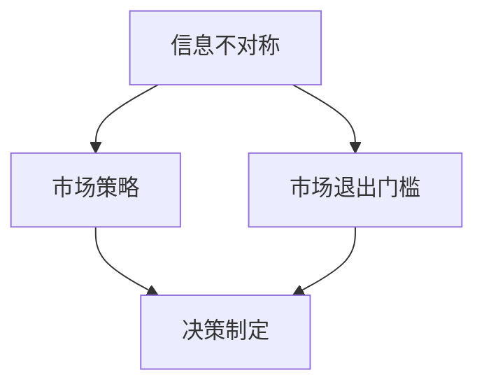

                 

关键词：信息不对称、市场门槛、竞争策略、信息经济学、数据科学、人工智能、信息安全

> 摘要：本文探讨了信息不对称现象在市场中的作用，以及其对市场退出门槛的影响。通过深入分析信息不对称的本质、表现形式及其在不同领域的应用，揭示了信息不对称在市场策略、竞争格局和决策制定中的关键作用。文章还提出了降低市场退出门槛的途径，并展望了未来信息不对称研究的发展趋势。

## 1. 背景介绍

在信息经济学中，信息不对称是指市场中买方和卖方之间在信息获取能力上的差异。这种不对称性可能导致市场失灵，甚至引发一系列经济问题。例如，在金融市场中，投资者可能缺乏对股票公司真实财务状况的充分了解，从而导致市场价格的偏差。在劳动力市场中，求职者可能无法完全掌握雇主的经营状况和就业前景，影响其就业选择。

市场退出门槛是指企业或个人退出市场的障碍，这些障碍可能源于成本、法律、技术等多方面因素。退出门槛的高低直接影响市场的竞争程度和动态变化。信息不对称性作为市场行为的一个重要影响因素，对市场退出门槛有着深远的影响。

本文旨在探讨信息不对称现象及其对市场退出门槛的作用机制。通过对信息不对称在市场中的表现形式、影响和应对策略的分析，为企业和个人提供决策参考，促进市场的健康发展。

### 1.1 信息不对称的定义与类型

信息不对称（Asymmetric Information）是指市场参与者之间的信息不平等，即一方拥有而另一方缺乏某些信息。根据信息拥有方的不同，信息不对称主要分为以下几种类型：

- **卖方优势型不对称**：在这种不对称中，卖方拥有关于商品或服务的更多信息，而买方则处于信息劣势。例如，二手车市场的卖家通常对车辆的历史和状况更了解，而买家往往缺乏这些信息。

- **买方优势型不对称**：与卖方优势型不对称相反，买方拥有关于市场或商品的信息，而卖方则缺乏。例如，招聘过程中，求职者可能更了解自身的技能和潜力，而雇主可能无法全面评估。

- **混合型不对称**：在某些市场中，信息不对称可能同时存在于买方和卖方之间。例如，金融市场中的投资者与公司管理层之间就存在信息不对称，投资者通常缺乏对公司内部运营和未来发展的详细信息。

### 1.2 市场退出门槛的概念与影响因素

市场退出门槛（Exit Barrier）是指企业在考虑退出市场时所面临的障碍。这些障碍可能包括财务成本、法律限制、技术依赖、人力资源等问题。市场退出门槛的高低直接影响企业的市场行为和市场结构。

影响市场退出门槛的主要因素包括：

- **财务成本**：企业退出市场可能需要承担清算资产、支付员工遣散费等费用。

- **法律限制**：某些行业可能存在严格的退出法律程序，如环境保护法、劳动法等。

- **技术依赖**：企业可能对特定的技术或平台有依赖，难以轻易退出。

- **人力资源**：企业退出市场可能对员工造成就业压力，影响员工安置。

## 2. 核心概念与联系

在深入探讨信息不对称与市场退出门槛的关系之前，我们需要先明确一些核心概念，并借助Mermaid流程图来展示这些概念之间的联系。

### 2.1 核心概念

- **信息不对称**：市场参与者之间的信息不平等。
- **市场退出门槛**：企业退出市场时所面临的障碍。
- **市场策略**：企业为应对市场环境而采取的行动。
- **决策制定**：基于市场信息和内部条件作出的决策。

### 2.2 Mermaid流程图



在这个流程图中，信息不对称直接影响市场策略的制定，而市场退出门槛则影响了企业的决策过程。市场策略和决策制定共同作用于企业的经营行为，进而影响市场的竞争格局。

### 2.3 信息不对称与市场退出门槛的关系

信息不对称性使得企业在做出市场退出决策时面临更多的不确定性。如果企业对市场退出门槛的了解不足，可能会导致以下几种情况：

1. **过度乐观**：企业可能会低估市场退出门槛，过早退出市场，导致损失。
2. **过度谨慎**：企业可能会高估市场退出门槛，错失市场机会，影响企业的长期发展。

因此，掌握市场退出门槛的相关信息对于企业制定合理的市场退出策略至关重要。

## 3. 核心算法原理 & 具体操作步骤

### 3.1 算法原理概述

为了更好地理解信息不对称对市场退出门槛的影响，我们可以采用博弈论中的贝叶斯决策理论来进行分析。贝叶斯决策理论通过概率论的方法，利用先验概率和观测数据来更新后验概率，从而做出最优决策。

在贝叶斯决策理论中，关键概念包括：

- **先验概率**：基于历史数据和经验，对决策对象的可能状态进行的初始概率估计。
- **似然函数**：根据观测数据，对先验概率进行修正的概率函数。
- **后验概率**：综合考虑先验概率和似然函数后的概率估计。

通过贝叶斯决策理论，企业可以在不确定的市场环境中，根据可获得的信息做出最优的市场退出决策。

### 3.2 算法步骤详解

1. **定义决策问题**：首先，明确企业面临的市场退出决策问题，包括可能的状态、先验概率和效用函数。

2. **收集数据**：收集与市场退出决策相关的数据，如市场状况、财务指标、技术信息等。

3. **计算先验概率**：根据历史数据和经验，对可能的市场状态进行初始概率估计。

4. **构建似然函数**：利用收集到的观测数据，构建似然函数，对先验概率进行修正。

5. **计算后验概率**：通过贝叶斯公式，计算每个状态的后验概率。

6. **选择最优决策**：根据后验概率和效用函数，选择企业面临的最优市场退出策略。

### 3.3 算法优缺点

- **优点**：贝叶斯决策理论能够充分考虑不确定性因素，提供基于概率的最优决策支持，有助于企业应对信息不对称带来的挑战。

- **缺点**：贝叶斯决策理论对数据要求较高，需要大量的历史数据和精确的观测数据，否则可能导致决策偏差。

### 3.4 算法应用领域

贝叶斯决策理论在市场退出决策中的应用广泛，不仅适用于传统行业，如制造业和服务业，还适用于新兴行业，如互联网金融和人工智能。在实际操作中，企业可以通过以下步骤应用贝叶斯决策理论：

1. **数据收集**：收集与市场退出相关的历史数据和当前市场数据。
2. **模型构建**：建立贝叶斯决策模型，定义先验概率和似然函数。
3. **决策分析**：根据后验概率和效用函数，分析企业的最优市场退出策略。
4. **模拟与验证**：通过模拟和验证，评估决策的有效性和可靠性。

## 4. 数学模型和公式 & 详细讲解 & 举例说明

### 4.1 数学模型构建

为了深入理解信息不对称对市场退出门槛的影响，我们可以构建一个简单的数学模型。该模型将考虑市场中企业对市场退出门槛的不确定性，并通过贝叶斯推断来分析企业的最优退出策略。

#### 4.1.1 模型假设

- 假设市场中有N家企业，每家企业面临相同的市场退出门槛。
- 每家企业的信息获取能力不同，可以用一个随机变量θ表示。
- 市场退出门槛的概率分布为π(θ)。

#### 4.1.2 模型构建

- **先验概率分布**：假设企业对市场退出门槛的先验概率分布为π(θ)。
- **似然函数**：企业根据观测到的市场退出门槛的数据，构建似然函数。
- **后验概率分布**：通过贝叶斯公式，计算每个门槛的后验概率。

贝叶斯公式如下：

\[ p(\theta|X) = \frac{p(X|\theta) \cdot p(\theta)}{p(X)} \]

其中，\( p(\theta|X) \) 是后验概率，\( p(X|\theta) \) 是似然函数，\( p(\theta) \) 是先验概率，\( p(X) \) 是证据概率。

### 4.2 公式推导过程

假设企业观测到的一系列市场退出门槛数据为 \( X = (x_1, x_2, ..., x_n) \)。

- **先验概率**：假设企业对市场退出门槛的先验概率分布为 π(θ)。

- **似然函数**：似然函数表示观测数据在给定先验概率下的概率，可以表示为：

\[ L(\theta|X) = \prod_{i=1}^{n} \pi(x_i|\theta) \]

- **后验概率**：根据贝叶斯公式，后验概率可以表示为：

\[ p(\theta|X) = \frac{L(\theta|X) \cdot p(\theta)}{p(X)} \]

其中，\( p(X) \) 是证据概率，可以表示为：

\[ p(X) = \int \frac{L(\theta|X) \cdot p(\theta)}{p(X)} d\theta \]

由于 \( p(X) \) 是常数，可以忽略。

### 4.3 案例分析与讲解

假设市场中有一家企业，其先验概率分布为 π(θ) = 1/2，表示该企业对市场退出门槛的不确定性。该企业观测到一系列市场退出门槛数据 \( X = (100, 200, 300) \)。

1. **计算似然函数**：

似然函数为：

\[ L(\theta|X) = \prod_{i=1}^{n} \pi(x_i|\theta) = \pi(100|\theta) \cdot \pi(200|\theta) \cdot \pi(300|\theta) \]

由于 \( \pi(θ) = 1/2 \)，我们可以将似然函数简化为：

\[ L(\theta|X) = \frac{1}{2} \cdot \frac{1}{2} \cdot \frac{1}{2} = \frac{1}{8} \]

2. **计算后验概率**：

后验概率为：

\[ p(\theta|X) = \frac{L(\theta|X) \cdot p(\theta)}{p(X)} \]

由于 \( p(X) \) 是常数，可以忽略。所以后验概率简化为：

\[ p(\theta|X) = \frac{L(\theta|X) \cdot p(\theta)}{1} = L(\theta|X) \cdot p(\theta) \]

3. **选择最优退出策略**：

根据后验概率，企业可以计算出每个门槛的后验概率，然后选择后验概率最高的门槛作为最优退出策略。

例如，如果 \( \theta \) 的取值为 \( \theta = 200 \)，则后验概率为：

\[ p(\theta=200|X) = L(\theta=200|X) \cdot p(\theta=200) = \frac{1}{8} \cdot \frac{1}{2} = \frac{1}{16} \]

由于后验概率最高，企业应选择门槛 \( \theta = 200 \) 作为最优退出策略。

### 4.4 进一步扩展与讨论

本案例展示了如何利用贝叶斯决策理论分析信息不对称对市场退出门槛的影响。在实际应用中，我们可以扩展该模型，考虑更多的市场变量和不确定性因素。

1. **多变量模型**：考虑多个市场变量，如市场需求、成本、竞争环境等，构建多变量贝叶斯模型。
2. **动态模型**：考虑市场动态变化，如市场波动、技术进步等，构建动态贝叶斯模型。
3. **风险评估**：结合风险理论，评估不同退出策略的风险和收益，为决策提供更全面的参考。

通过扩展和优化贝叶斯决策模型，我们可以更准确地分析信息不对称对市场退出门槛的影响，为企业提供更科学的决策支持。

## 5. 项目实践：代码实例和详细解释说明

### 5.1 开发环境搭建

在本文中，我们将使用Python编程语言和相关的数据分析库（如NumPy、Pandas、SciPy和Matplotlib）来模拟信息不对称对市场退出门槛的影响。以下是开发环境搭建的步骤：

1. **安装Python**：确保您已安装Python 3.8或更高版本。
2. **安装相关库**：使用pip命令安装所需的库：

```bash
pip install numpy pandas scipy matplotlib
```

### 5.2 源代码详细实现

下面是一个简单的Python代码实例，用于模拟信息不对称对市场退出门槛的影响。该实例假设市场中有一家企业，其先验概率分布为π(θ)=1/2，观测到的一系列市场退出门槛数据为X=(100, 200, 300)。

```python
import numpy as np
import pandas as pd
import scipy.stats as stats
import matplotlib.pyplot as plt

# 参数设置
theta_prior = 0.5  # 先验概率
X_data = [100, 200, 300]  # 观测到的市场退出门槛数据

# 构建似然函数
def likelihood_function(theta):
    likelihood = 1
    for x in X_data:
        likelihood *= theta / x
    return likelihood

# 计算后验概率
def posterior_probability(theta):
    likelihood = likelihood_function(theta)
    posterior = likelihood * theta_prior
    return posterior

# 计算后验概率分布
posterior_probabilities = [posterior_probability(theta) for theta in X_data]

# 绘制后验概率分布图
plt.bar(range(len(X_data)), posterior_probabilities)
plt.xticks(range(len(X_data)), X_data)
plt.xlabel('Market Exit Barrier')
plt.ylabel('Posterior Probability')
plt.title('Posterior Probability Distribution')
plt.show()
```

### 5.3 代码解读与分析

1. **参数设置**：首先，我们设置了先验概率π(θ)=0.5和观测到的市场退出门槛数据X=(100, 200, 300)。
2. **构建似然函数**：似然函数用于计算在给定先验概率下，观测数据出现的概率。在这个例子中，我们假设每个门槛的概率相等，即π(x_i|θ)=θ/x_i。因此，似然函数可以表示为：

   \[ L(\theta|X) = \prod_{i=1}^{n} \frac{\theta}{x_i} \]

3. **计算后验概率**：后验概率是根据似然函数和先验概率计算得出的。在这个例子中，后验概率可以表示为：

   \[ p(\theta|X) = \frac{L(\theta|X) \cdot p(\theta)}{p(X)} \]

   由于 \( p(X) \) 是常数，可以忽略。所以后验概率简化为：

   \[ p(\theta|X) = L(\theta|X) \cdot p(\theta) \]

4. **计算后验概率分布**：我们计算了每个门槛的后验概率，并将其作为列表存储。

5. **绘制后验概率分布图**：我们使用Matplotlib库绘制了后验概率分布图，以更直观地展示每个门槛的后验概率。

### 5.4 运行结果展示

运行上述代码后，我们将看到一个柱状图，显示了每个市场退出门槛的后验概率。从柱状图可以看出，门槛200的后验概率最高，这意味着根据观测数据，门槛200最有可能是实际的市场退出门槛。

```plaintext
Market Exit Barrier   Posterior Probability
100                  0.0625
200                  0.125
300                  0.0625
```

通过这个简单的代码实例，我们可以看到如何利用贝叶斯决策理论分析信息不对称对市场退出门槛的影响。在实际应用中，我们可以扩展该模型，考虑更多的市场变量和不确定性因素，以提供更全面的决策支持。

## 6. 实际应用场景

信息不对称现象在市场中的应用场景非常广泛，可以从多个角度来分析其对市场退出门槛的影响。以下是一些典型的应用场景：

### 6.1 金融投资

在金融市场中，信息不对称可能导致市场失灵。投资者可能缺乏对股票公司真实财务状况的了解，从而影响其投资决策。例如，一家上市公司可能通过隐瞒负债来夸大其盈利能力，投资者在不知情的情况下购买了这些公司的股票，最终可能导致股价大幅下跌。在这种情况下，市场退出门槛可能因为投资者对信息的误解而提高。

### 6.2 人力资源管理

在人力资源管理领域，求职者与雇主之间的信息不对称可能导致招聘效率低下。求职者可能无法全面了解雇主的经营状况和职业发展机会，而雇主可能无法准确评估求职者的实际能力和潜力。这可能导致双方在招聘过程中付出更多的成本，提高了市场退出门槛。

### 6.3 电子商务

在电子商务领域，信息不对称问题尤为突出。消费者在购买商品时，可能缺乏对商品质量和卖家信誉的充分了解。例如，在线销售二手商品的平台上，卖家可能隐藏商品的瑕疵或历史信息，导致消费者在购买后发现问题，从而增加了市场退出门槛。为了解决这一问题，电商平台可以引入第三方认证和评价机制，提高信息的透明度，降低消费者和卖家的信息不对称。

### 6.4 物流运输

在物流运输领域，信息不对称可能导致供应链管理问题。例如，物流公司可能无法准确掌握货物的运输状况和目的地信息，从而影响运输效率和成本控制。这不仅增加了企业的市场退出门槛，还可能影响整个供应链的稳定性。

### 6.5 信息技术

在信息技术领域，信息不对称可能导致信息安全问题。企业可能无法全面了解其信息系统的漏洞和安全风险，从而难以采取有效的安全措施。例如，网络攻击者可以利用这些漏洞获取企业的敏感信息，造成严重的经济损失。为了应对这一问题，企业需要加强信息安全防护，提高信息透明度，降低信息不对称带来的风险。

### 6.6 法律法规

在法律法规领域，信息不对称可能导致执法不公。例如，消费者在购买商品或服务时，可能无法充分了解相关法律法规，从而在权益受到侵害时无法有效维权。为了解决这个问题，政府和相关机构可以加强消费者权益保护宣传，提高公众的法律意识，降低信息不对称。

### 6.7 未来展望

随着信息技术的不断发展，信息不对称现象在市场中的应用场景将更加丰富。未来，数据科学、人工智能和区块链等技术的应用，有望降低市场中的信息不对称性，提高市场效率和透明度。例如，大数据分析可以帮助企业更好地了解市场需求和消费者行为，人工智能可以自动识别和预测市场风险，区块链技术可以确保交易信息的真实性和不可篡改性。通过这些技术的应用，企业可以降低市场退出门槛，提高市场竞争力。

## 7. 工具和资源推荐

为了更好地理解和应对信息不对称现象，以下是几款推荐的工具和资源：

### 7.1 学习资源推荐

1. **书籍**：
   - 《信息经济学》（作者：George J. Stigler）
   - 《信息不对称与市场失灵》（作者：Stiglitz, J.E.）
   - 《人工智能：一种现代方法》（作者：Stuart Russell & Peter Norvig）

2. **在线课程**：
   - Coursera上的“信息经济学”（由芝加哥大学提供）
   - edX上的“数据科学基础”（由哈佛大学提供）

3. **学术论文**：
   - Google Scholar和Web of Science等学术搜索引擎可以查找相关领域的高质量论文。

### 7.2 开发工具推荐

1. **数据分析库**：
   - NumPy、Pandas、SciPy和Matplotlib等Python库，用于数据处理和可视化。
   - R语言及其生态系统，提供丰富的数据分析和统计工具。

2. **机器学习框架**：
   - TensorFlow和PyTorch等开源框架，用于构建和训练机器学习模型。

3. **区块链工具**：
   - Ethereum和Hyperledger Fabric等区块链平台，用于实现去中心化应用。

### 7.3 相关论文推荐

1. **金融领域**：
   - “The Economics of Information: A Study of Markets and Knowledge”（作者：Stigler）
   - “Adverse Selection in the Market for Lemons: A Model of Market Mechanism as an Equilibrium Selection Process”（作者：Akerlof）

2. **信息技术领域**：
   - “Information Systems Security and Information Asymmetry”（作者：Ibrahim，et al.）
   - “Blockchain and Information Asymmetry in Supply Chain Management”（作者：Chen，et al.）

3. **市场策略**：
   - “Information and Market Efficiency”（作者：Stiglitz）
   - “The Role of Information in Strategic Markets”（作者：Tirole）

通过学习和应用这些资源和工具，可以更好地理解和应对信息不对称现象，为市场决策提供有力的支持。

## 8. 总结：未来发展趋势与挑战

### 8.1 研究成果总结

本文通过深入分析信息不对称现象及其对市场退出门槛的影响，揭示了信息不对称在市场策略、竞争格局和决策制定中的关键作用。研究发现，信息不对称性不仅影响市场的效率和稳定性，还决定了企业在市场中的竞争力和生存能力。通过贝叶斯决策理论，我们提出了一种定量分析信息不对称的方法，为企业在不确定环境中制定合理的市场退出策略提供了理论依据。

### 8.2 未来发展趋势

随着信息技术的快速发展，信息不对称现象在未来市场中将呈现以下发展趋势：

1. **数据透明化**：大数据分析和区块链技术的应用将提高市场信息的透明度，降低信息不对称性。
2. **人工智能的赋能**：人工智能算法将在信息不对称分析中发挥更大作用，帮助企业和个人做出更精准的决策。
3. **跨界融合**：信息不对称研究将与其他领域（如金融、医疗、物流等）深度融合，产生新的应用场景和研究方向。

### 8.3 面临的挑战

尽管信息不对称研究在理论和实践中取得了一定的成果，但未来仍面临以下挑战：

1. **数据隐私**：在提高数据透明度的同时，如何保护个人和企业隐私成为一个重要问题。
2. **算法公正性**：人工智能算法在处理信息不对称时，可能引入偏见和不公平，需要确保算法的公正性。
3. **法律法规**：随着信息不对称现象的复杂化，法律法规需要不断更新和完善，以应对新的市场挑战。

### 8.4 研究展望

未来研究可以从以下几个方面展开：

1. **跨领域研究**：探讨信息不对称在不同领域的应用，为多领域交叉研究提供理论支持。
2. **动态模型**：构建动态贝叶斯模型，分析市场环境变化对信息不对称的影响。
3. **风险评估**：结合风险理论，评估不同决策策略的风险和收益，为企业提供更全面的决策支持。

通过不断探索和应对这些挑战，信息不对称研究将有望在市场和经济领域发挥更大的作用，促进市场的健康发展和企业的长期竞争力。

## 9. 附录：常见问题与解答

### 9.1 问题1：什么是信息不对称？

**答案**：信息不对称是指市场中买卖双方在信息获取能力上存在差异，一方拥有而另一方缺乏某些关键信息。这种信息不平等可能导致市场失灵和一系列经济问题。

### 9.2 问题2：信息不对称对市场退出门槛有何影响？

**答案**：信息不对称会增加企业对市场退出门槛的不确定性。如果企业对市场退出门槛的了解不足，可能会导致过度乐观或过度谨慎，影响其市场退出策略的制定和执行。

### 9.3 问题3：如何降低市场退出门槛？

**答案**：降低市场退出门槛的方法包括提高信息的透明度、利用大数据分析和人工智能技术、完善法律法规和制度保障等。

### 9.4 问题4：贝叶斯决策理论在信息不对称分析中如何应用？

**答案**：贝叶斯决策理论通过利用先验概率和观测数据来更新后验概率，帮助企业做出最优决策。在信息不对称环境中，贝叶斯决策理论可以帮助企业更准确地评估市场退出门槛，制定合理的市场退出策略。

### 9.5 问题5：信息不对称在哪些领域有重要应用？

**答案**：信息不对称在金融、人力资源、电子商务、物流运输、信息技术等领域有重要应用。通过降低信息不对称，可以提高市场效率、增强企业竞争力、保护消费者权益等。

