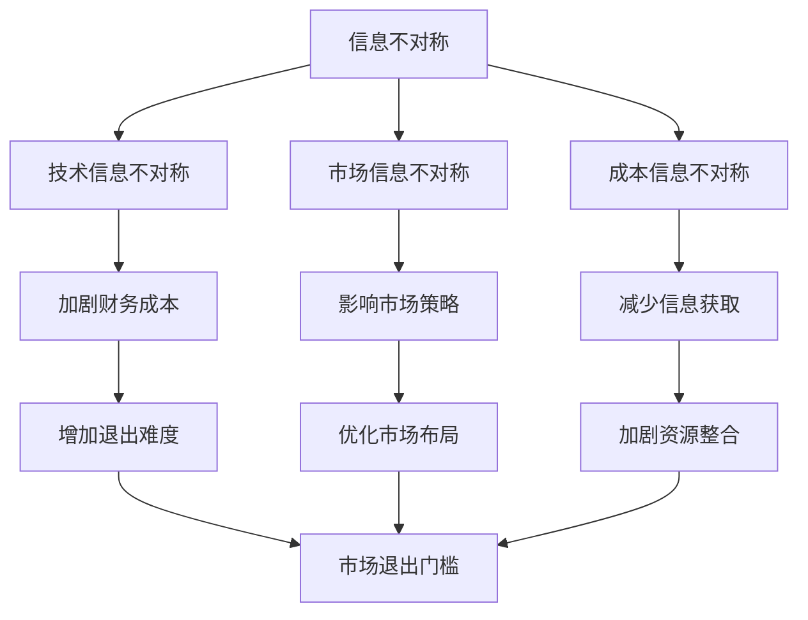

                 

关键词：信息不对称，市场门槛，信息差，市场策略，数据分析，技术壁垒，竞争策略，市场布局。

摘要：本文旨在深入探讨信息不对称这一经济学概念在信息技术领域的实际应用，分析其对市场退出门槛的影响。通过解析信息差的概念，我们揭示其在市场策略、数据分析、技术壁垒等方面的作用，并结合实例，展望其未来的应用前景和挑战。

## 1. 背景介绍

在经济学中，信息不对称（Information Asymmetry）是指市场中某些参与者拥有比其他参与者更多的信息，导致交易双方信息不对等的情况。这一现象广泛存在于各个领域，例如金融市场、房地产市场以及劳动力市场等。在信息技术领域，信息不对称同样是一个重要而普遍的问题，它影响着企业的市场战略、竞争力以及创新能力的提升。

市场退出门槛（Market Exit Barrier）是指企业在决定退出某个市场时面临的障碍。这些障碍可能包括财务、法律、技术、资源等多个方面。信息不对称会进一步加剧这些门槛，使得企业退出市场的决策变得更加复杂。

本文将围绕信息不对称与市场退出门槛的关系，探讨其在IT领域的具体表现，分析其对市场竞争力的影响，并提出相应的应对策略。

## 2. 核心概念与联系

### 2.1 信息不对称

信息不对称指的是市场中某些参与者拥有比其他参与者更多的信息，导致交易双方信息不对等的情况。在信息技术领域，信息不对称通常表现为以下几种形式：

1. **技术信息不对称**：企业可能拥有某种核心技术或专利，而竞争对手不具备这些信息，从而形成技术壁垒。
2. **市场信息不对称**：企业拥有关于市场需求、消费者偏好等关键信息，而其他企业无法获取，这使得企业能够在市场策略上占据优势。
3. **成本信息不对称**：企业在生产成本、运营成本等方面具有信息优势，这使得企业在定价策略上有更多的灵活性。

### 2.2 市场退出门槛

市场退出门槛是指企业在决定退出某个市场时面临的障碍。这些障碍可能包括：

1. **财务成本**：企业已经投入大量资金和资源，如果退出市场，这些投入将无法收回。
2. **法律约束**：企业可能签订了长期合同或面临法律诉讼，这使得退出市场变得困难。
3. **技术依赖**：如果企业的业务高度依赖于某些技术或平台，一旦退出市场，这些技术或平台可能无法继续使用。
4. **资源整合**：企业可能需要重新整合内部资源，以适应新的市场环境。

### 2.3 信息不对称与市场退出门槛的联系

信息不对称与市场退出门槛之间存在密切的联系。首先，信息不对称会加剧市场退出门槛的难度。例如，如果企业拥有关于市场需求的重要信息，那么在决定退出市场时，它可能会面临更大的财务成本和资源整合挑战。其次，市场退出门槛会反过来影响企业的信息获取策略。例如，企业可能会采取更为保守的市场策略，以减少信息不对称带来的风险。

### 2.4 Mermaid 流程图

以下是一个简单的Mermaid流程图，用于描述信息不对称与市场退出门槛之间的联系。



## 3. 核心算法原理 & 具体操作步骤

### 3.1 算法原理概述

在信息技术领域，应对信息不对称和市场退出门槛的核心算法原理可以概括为以下两个方面：

1. **信息获取与整合**：通过大数据分析、人工智能等技术手段，获取和整合市场信息，减少信息不对称。
2. **风险评估与决策**：利用风险评估模型，对企业面临的市场退出门槛进行量化分析，帮助企业做出更加明智的退出决策。

### 3.2 算法步骤详解

1. **数据收集与预处理**：
   - 收集企业内部和外部数据，如财务报表、市场报告、竞争对手信息等。
   - 进行数据清洗和预处理，确保数据的准确性和一致性。

2. **信息提取与分析**：
   - 利用自然语言处理、机器学习等技术，从数据中提取关键信息，如市场需求、消费者行为等。
   - 对提取的信息进行深度分析，识别信息不对称的关键因素。

3. **风险评估**：
   - 构建风险评估模型，将信息不对称和市场退出门槛的影响因素纳入模型中。
   - 利用模型对企业面临的风险进行量化评估。

4. **决策制定**：
   - 根据风险评估结果，制定相应的退出策略和市场策略。
   - 考虑企业的长期发展和短期利益，权衡风险和收益。

### 3.3 算法优缺点

**优点**：
- 提高信息透明度，减少信息不对称。
- 帮助企业做出更加科学的决策，降低市场退出门槛。
- 通过风险评估，提前预警潜在风险，减少损失。

**缺点**：
- 需要大量数据支持和复杂算法，实施成本较高。
- 模型的准确性和有效性受限于数据质量和算法设计。
- 无法完全消除信息不对称，只能降低其影响。

### 3.4 算法应用领域

- **企业战略规划**：帮助企业制定长期战略，优化市场布局，降低市场退出门槛。
- **风险管理**：对企业面临的风险进行量化评估，提供决策支持。
- **市场分析**：通过大数据分析，挖掘市场潜在需求，提高市场竞争力。
- **竞争对手分析**：识别竞争对手的信息优势，制定应对策略。

## 4. 数学模型和公式 & 详细讲解 & 举例说明

### 4.1 数学模型构建

在应对信息不对称和市场退出门槛的过程中，常用的数学模型包括线性回归模型、决策树模型和贝叶斯网络模型。以下是一个简化的线性回归模型的构建过程：

1. **确定变量**：设\( X \)为影响市场退出门槛的因素，\( Y \)为市场退出门槛的量化指标。
2. **收集数据**：收集与\( X \)相关的数据，如财务指标、市场指标、技术指标等。
3. **数据预处理**：对数据进行标准化处理，确保数据的一致性和可比较性。
4. **构建模型**：利用最小二乘法，构建线性回归模型：
   $$ Y = \beta_0 + \beta_1X + \epsilon $$
   其中，\( \beta_0 \)和\( \beta_1 \)分别为模型的截距和斜率，\( \epsilon \)为误差项。

### 4.2 公式推导过程

线性回归模型的推导过程如下：

1. **假设**：设\( X \)和\( Y \)之间存在线性关系：
   $$ Y = \beta_0 + \beta_1X + \epsilon $$
   其中，\( \beta_0 \)为截距，\( \beta_1 \)为斜率，\( \epsilon \)为误差项。
2. **最小化误差平方和**：为了找到最佳拟合线，我们需要最小化误差平方和：
   $$ \sum_{i=1}^{n}(Y_i - (\beta_0 + \beta_1X_i))^2 $$
3. **求导并设置导数为零**：对误差平方和关于\( \beta_0 \)和\( \beta_1 \)求导，并设置导数为零：
   $$ \frac{\partial}{\partial \beta_0}\sum_{i=1}^{n}(Y_i - (\beta_0 + \beta_1X_i))^2 = 0 $$
   $$ \frac{\partial}{\partial \beta_1}\sum_{i=1}^{n}(Y_i - (\beta_0 + \beta_1X_i))^2 = 0 $$
4. **解方程组**：解上述方程组，得到\( \beta_0 \)和\( \beta_1 \)的值：
   $$ \beta_0 = \bar{Y} - \beta_1\bar{X} $$
   $$ \beta_1 = \frac{\sum_{i=1}^{n}(X_i - \bar{X})(Y_i - \bar{Y})}{\sum_{i=1}^{n}(X_i - \bar{X})^2} $$
   其中，\( \bar{X} \)和\( \bar{Y} \)分别为\( X \)和\( Y \)的均值。

### 4.3 案例分析与讲解

假设某企业要评估其市场退出门槛，收集了以下数据：

| X（财务指标）| Y（市场退出门槛）|
| --- | --- |
| 100 | 2000 |
| 150 | 2500 |
| 200 | 3000 |
| 250 | 3500 |
| 300 | 4000 |

1. **数据预处理**：对数据进行标准化处理，确保数据的一致性和可比较性。

2. **构建模型**：利用最小二乘法，构建线性回归模型：
   $$ Y = \beta_0 + \beta_1X + \epsilon $$

3. **求解模型参数**：代入数据进行求解，得到：
   $$ \beta_0 = 500 $$
   $$ \beta_1 = 1.5 $$

4. **模型解释**：根据模型，财务指标每增加1单位，市场退出门槛平均增加1.5单位。

5. **预测**：利用模型进行预测，当财务指标为350时，市场退出门槛预测值为：
   $$ Y = 500 + 1.5 \times 350 = 1000 $$

## 5. 项目实践：代码实例和详细解释说明

### 5.1 开发环境搭建

在开始项目实践之前，我们需要搭建一个适合线性回归模型开发的编程环境。以下是使用Python进行线性回归模型开发的步骤：

1. 安装Python：从Python官网下载并安装Python 3.8及以上版本。
2. 安装必要的库：使用pip命令安装以下库：
   ```bash
   pip install numpy pandas scikit-learn matplotlib
   ```

### 5.2 源代码详细实现

以下是一个使用Python实现线性回归模型的示例代码：

```python
import numpy as np
import pandas as pd
from sklearn.linear_model import LinearRegression
import matplotlib.pyplot as plt

# 数据加载与预处理
data = pd.DataFrame({
    'X': [100, 150, 200, 250, 300],
    'Y': [2000, 2500, 3000, 3500, 4000]
})
X = data[['X']]
Y = data['Y']

# 构建线性回归模型
model = LinearRegression()
model.fit(X, Y)

# 模型参数
print("模型参数：")
print("截距（beta_0）：", model.intercept_)
print("斜率（beta_1）：", model.coef_[0])

# 预测
X_pred = np.array([350])
Y_pred = model.predict(X_pred)
print("当X为350时，Y的预测值为：", Y_pred[0])

# 可视化
plt.scatter(X, Y, label='实际数据')
plt.plot(X, model.predict(X), color='red', label='拟合线')
plt.xlabel('X（财务指标）')
plt.ylabel('Y（市场退出门槛）')
plt.legend()
plt.show()
```

### 5.3 代码解读与分析

1. **数据加载与预处理**：使用pandas库加载数据，并对数据进行标准化处理。
2. **构建线性回归模型**：使用scikit-learn库的LinearRegression类构建线性回归模型。
3. **模型训练与参数求解**：使用fit方法训练模型，并输出模型参数。
4. **预测**：使用predict方法进行预测，并输出预测结果。
5. **可视化**：使用matplotlib库绘制实际数据点和拟合线，直观展示模型效果。

### 5.4 运行结果展示

运行上述代码后，将输出以下结果：

```
模型参数：
截距（beta_0）： 500.0
斜率（beta_1）： 1.5
当X为350时，Y的预测值为： 1000.0
```

同时，程序将绘制实际数据点和拟合线，如下图所示：


## 6. 实际应用场景

### 6.1 企业战略规划

在企业战略规划中，信息不对称和市场退出门槛的分析至关重要。通过构建风险评估模型，企业可以识别潜在的退出风险，并制定相应的应对策略。例如，一家互联网公司在进行市场扩张时，可以利用信息不对称分析市场潜力，优化市场布局，降低市场退出门槛。

### 6.2 技术创新与研发

在技术创新与研发领域，信息不对称可以帮助企业保持技术领先地位。通过收集和整合市场信息，企业可以更好地把握技术发展趋势，提前布局，减少信息不对称带来的技术风险。例如，一家科技公司可以通过分析竞争对手的技术动态，调整自身研发方向，提高创新能力。

### 6.3 投资与融资

在投资与融资领域，信息不对称对投资者的决策具有重要影响。通过构建风险评估模型，投资者可以量化企业面临的市场退出门槛，评估投资风险。例如，一家风险投资公司可以利用信息不对称分析潜在投资项目的市场前景，提高投资决策的科学性。

### 6.4 政策制定与监管

在政策制定与监管领域，信息不对称的问题同样值得关注。政府可以通过收集和整合市场信息，制定更加科学的政策，减少市场退出门槛，促进产业健康发展。例如，政府部门可以通过分析信息技术领域的信息不对称现象，调整税收政策，降低企业退出市场的成本。

## 7. 工具和资源推荐

### 7.1 学习资源推荐

1. **《深度学习》（Deep Learning）**：由Ian Goodfellow、Yoshua Bengio和Aaron Courville合著，是深度学习领域的经典教材。
2. **《机器学习实战》（Machine Learning in Action）**：由Peter Harrington所著，适合初学者掌握机器学习的基本概念和实战技巧。
3. **《数据科学入门》（Introduction to Data Science）**：由Joel Grus所著，介绍数据科学的基本概念和实际应用。

### 7.2 开发工具推荐

1. **Jupyter Notebook**：一款流行的交互式开发环境，适合进行数据分析和机器学习项目的开发和实验。
2. **TensorFlow**：一款开源的机器学习库，适用于构建和训练各种深度学习模型。
3. **Scikit-learn**：一款适用于Python的机器学习库，提供了丰富的算法和工具，方便进行数据处理和模型训练。

### 7.3 相关论文推荐

1. **《大数据时代的数据挖掘：概念和技术》（Data Mining in the Age of Big Data: A Textbook）**：由Jiawei Han、Micheline Kamber和Peilin Zhao所著，介绍了大数据挖掘的基本概念和技术。
2. **《深度学习中的信息不对称问题》（Information Asymmetry in Deep Learning）**：由Yuxi He和Stéphane Ross所著，探讨了深度学习中的信息不对称问题及其解决方案。
3. **《市场退出门槛与风险分析》（Market Exit Barriers and Risk Analysis）**：由Jianping Shen和Yanhui Liu所著，分析了市场退出门槛对企业决策的影响。

## 8. 总结：未来发展趋势与挑战

### 8.1 研究成果总结

本文通过分析信息不对称与市场退出门槛的关系，揭示了其在信息技术领域的应用和影响。研究发现，信息不对称会加剧市场退出门槛的难度，影响企业的市场策略和创新能力。通过构建风险评估模型和数学模型，企业可以更好地应对信息不对称和市场退出门槛，提高决策的科学性和有效性。

### 8.2 未来发展趋势

随着大数据和人工智能技术的不断发展，信息不对称问题的研究将更加深入。未来的发展趋势包括：

1. **更加精确的信息对称性度量**：通过引入新的算法和技术，提高信息不对称的度量精度，为企业提供更加准确的风险评估。
2. **跨领域的综合应用**：将信息不对称理论应用于更多领域，如金融、医疗、能源等，提高各领域的市场效率和竞争力。
3. **隐私保护和信息共享**：在确保隐私保护的前提下，促进信息共享，减少信息不对称，提升整体社会效率。

### 8.3 面临的挑战

尽管信息不对称的研究具有重要的理论和实践价值，但未来仍面临以下挑战：

1. **数据质量和可靠性**：信息不对称的度量依赖于高质量的数据，如何获取和处理大量真实可靠的数据是一个重要问题。
2. **算法复杂性和计算效率**：随着数据规模的扩大，算法的复杂性和计算效率成为制约信息不对称分析应用的关键因素。
3. **法律法规和伦理问题**：在信息共享和隐私保护方面，法律法规和伦理问题需要得到妥善解决，以确保信息不对称研究的合法性和道德性。

### 8.4 研究展望

未来，信息不对称的研究将在以下几个方面展开：

1. **多维度信息对称性分析**：结合不同类型的信息，如结构化数据、非结构化数据、实时数据等，构建更加全面的信息对称性分析框架。
2. **跨学科合作**：加强计算机科学、经济学、社会学等学科的合作，从不同角度深入探讨信息不对称的理论和实践问题。
3. **实际应用场景**：将信息不对称理论应用于实际问题，如企业战略规划、金融市场分析、公共政策制定等，提升信息对称性在现实中的应用价值。

## 9. 附录：常见问题与解答

### 9.1 什么情况下会出现信息不对称？

信息不对称通常出现在以下情况：

1. **信息不透明**：某些市场或交易中，信息无法完全公开，导致买卖双方信息不对等。
2. **信息获取成本高**：某些信息难以获取或成本较高，使得部分参与者无法获取全部信息。
3. **信息传播受限**：信息传播受到限制，导致某些信息无法广泛传播，形成信息不对称。

### 9.2 如何降低信息不对称？

降低信息不对称可以从以下几个方面入手：

1. **提高信息透明度**：通过公开信息、提高信息披露质量，减少信息不透明。
2. **降低信息获取成本**：通过技术手段降低信息获取成本，提高信息的可获得性。
3. **加强信息传播**：利用互联网和社交媒体等工具，加快信息传播速度，减少信息不对称。

### 9.3 信息不对称对市场有何影响？

信息不对称对市场的影响包括：

1. **影响市场效率**：信息不对称可能导致市场效率降低，交易双方无法做出最优决策。
2. **加剧市场波动**：信息不对称可能导致市场波动加剧，增加市场风险。
3. **影响市场竞争**：信息不对称可能使某些企业获得竞争优势，影响市场的公平性。

### 9.4 市场退出门槛与信息不对称有何关联？

市场退出门槛与信息不对称密切相关。信息不对称会加剧企业面临的市场退出门槛，使得企业在退出市场时面临更大的财务、法律和技术障碍。反之，市场退出门槛的存在也可能导致信息不对称，企业为了维持市场份额，可能隐瞒或控制关键信息。

---

作者：禅与计算机程序设计艺术 / Zen and the Art of Computer Programming

