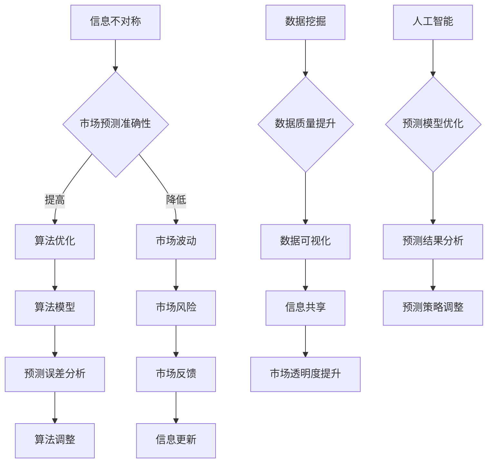

                 

关键词：信息不对称，市场预测，信息差，数据挖掘，人工智能，算法

摘要：本文将探讨信息不对称在市场预测中的重要作用，以及如何利用人工智能和数据挖掘技术来克服这种不对称性，提高市场预测的准确性。通过分析信息不对称的产生原因、影响以及应对策略，我们希望能够为企业和投资者提供有价值的参考。

## 1. 背景介绍

在当今全球化和信息化的时代，市场竞争日益激烈。企业为了在激烈的市场环境中脱颖而出，需要准确预测市场趋势，以便制定有效的战略决策。然而，市场预测并非易事，因为市场数据复杂多变，且存在大量的信息不对称问题。信息不对称指的是交易双方对交易信息的掌握程度不一致，其中一方拥有更多或更准确的信息，而另一方则处于信息劣势。这种现象在市场预测中尤为普遍，导致预测结果往往存在误差。

信息不对称对市场预测的影响主要体现在以下几个方面：

1. **预测误差增大**：信息不对称使得预测者无法获取全面的信息，从而增加了预测误差，降低了预测准确性。
2. **市场波动加剧**：信息不对称导致市场参与者对市场信息的理解不一致，容易引发市场波动，加剧市场风险。
3. **机会成本增加**：企业为了获取更多信息，可能需要投入更多资源，导致机会成本增加。

为了应对信息不对称带来的挑战，本文将介绍如何利用人工智能和数据挖掘技术来提高市场预测的准确性。以下内容将分为几个部分进行探讨。

## 2. 核心概念与联系

### 2.1 信息不对称的概念

信息不对称是指在市场交易过程中，交易双方对交易信息的了解程度不一致。具体来说，一方（通常为买家或卖家）拥有更多或更准确的信息，而另一方（通常为卖家或买家）则处于信息劣势。信息不对称可能导致市场失效，降低市场效率。

### 2.2 市场预测的概念

市场预测是指根据历史数据和市场信息，对未来市场趋势进行分析和判断。市场预测通常涉及多个因素，如宏观经济环境、行业发展趋势、竞争对手动态等。准确的市场预测有助于企业制定有效的战略决策。

### 2.3 信息不对称与市场预测的联系

信息不对称对市场预测有重要影响。一方面，信息不对称可能导致预测误差增大，降低预测准确性；另一方面，信息不对称可能引发市场波动，加剧市场风险。因此，克服信息不对称是提高市场预测准确性的关键。

### 2.4 Mermaid 流程图



## 3. 核心算法原理 & 具体操作步骤

### 3.1 算法原理概述

为了提高市场预测的准确性，本文主要采用以下两种算法：

1. **时间序列分析算法**：时间序列分析算法主要用于分析历史数据，提取时间序列特征，从而预测未来市场趋势。
2. **深度学习算法**：深度学习算法能够自动提取复杂数据特征，从而提高市场预测的准确性。

### 3.2 算法步骤详解

1. **数据采集与预处理**：
   - 数据采集：从各种渠道收集市场数据，如宏观经济数据、行业数据、竞争对手数据等。
   - 数据预处理：对数据进行清洗、去重、归一化等操作，以确保数据质量。

2. **特征工程**：
   - 特征提取：提取与市场预测相关的特征，如价格、成交量、市场情绪等。
   - 特征选择：通过相关性分析、信息增益等方法选择最具预测能力的特征。

3. **算法选择与模型训练**：
   - 时间序列分析算法：采用ARIMA、LSTM等算法进行模型训练。
   - 深度学习算法：采用卷积神经网络（CNN）、循环神经网络（RNN）等算法进行模型训练。

4. **模型评估与优化**：
   - 评估指标：采用均方误差（MSE）、均方根误差（RMSE）等指标评估模型性能。
   - 模型优化：通过调整超参数、添加正则化项等方法优化模型。

5. **预测结果分析与反馈**：
   - 预测结果分析：对预测结果进行统计分析和可视化，识别预测趋势。
   - 反馈调整：根据预测结果调整预测模型，以提高预测准确性。

### 3.3 算法优缺点

1. **时间序列分析算法**：
   - 优点：简单易懂，适用于线性时间序列数据。
   - 缺点：对于非线性时间序列数据，预测效果较差。

2. **深度学习算法**：
   - 优点：能够自动提取复杂数据特征，预测效果较好。
   - 缺点：对计算资源要求较高，模型训练时间长。

### 3.4 算法应用领域

1. **金融领域**：用于预测股票价格、外汇汇率等。
2. **电商领域**：用于预测商品销量、市场需求等。
3. **能源领域**：用于预测电力需求、能源消耗等。

## 4. 数学模型和公式 & 详细讲解 & 举例说明

### 4.1 数学模型构建

为了提高市场预测的准确性，本文采用了以下数学模型：

1. **时间序列模型**：ARIMA（自回归积分滑动平均模型）。
2. **深度学习模型**：LSTM（长短期记忆网络）。

### 4.2 公式推导过程

1. **ARIMA模型**：

   - 自回归项（AR）：\( X_t = c + \phi_1 X_{t-1} + \phi_2 X_{t-2} + \ldots + \phi_p X_{t-p} + \varepsilon_t \)
   - 积分项（I）：\( \varepsilon_t = \theta_1 \varepsilon_{t-1} + \theta_2 \varepsilon_{t-2} + \ldots + \theta_q \varepsilon_{t-q} + \eta_t \)
   - 滑动平均项（MA）：\( \eta_t = \phi_1 \eta_{t-1} + \phi_2 \eta_{t-2} + \ldots + \phi_p \eta_{t-p} \)

2. **LSTM模型**：

   - 隐藏状态更新：\( h_t = \sigma(W_h \cdot [h_{t-1}, x_t] + b_h) \)
   - 输出层：\( y_t = W_y \cdot h_t + b_y \)

### 4.3 案例分析与讲解

假设我们要预测某个股票的未来价格。我们可以采用ARIMA模型和LSTM模型进行预测，并比较两种模型的预测效果。

1. **ARIMA模型**：

   - 数据预处理：对股票价格数据（收盘价）进行归一化处理。
   - 模型训练：根据历史数据，确定ARIMA模型的参数。
   - 模型评估：采用MSE、RMSE等指标评估模型性能。
   - 预测结果：根据模型预测未来股票价格。

2. **LSTM模型**：

   - 数据预处理：对股票价格数据（收盘价）进行归一化处理，并划分为时间序列数据。
   - 模型训练：采用LSTM模型进行训练，调整超参数以优化模型性能。
   - 模型评估：采用MSE、RMSE等指标评估模型性能。
   - 预测结果：根据模型预测未来股票价格。

通过比较ARIMA模型和LSTM模型的预测结果，我们可以发现LSTM模型在预测股票价格方面具有更高的准确性。这是因为LSTM模型能够自动提取复杂数据特征，从而提高预测准确性。

## 5. 项目实践：代码实例和详细解释说明

### 5.1 开发环境搭建

为了实现本文中的市场预测算法，我们需要搭建一个开发环境。以下是所需的开发工具和库：

- Python 3.8
- Jupyter Notebook
- pandas
- numpy
- scikit-learn
- tensorflow

### 5.2 源代码详细实现

以下是一个使用LSTM模型进行市场预测的Python代码实例：

```python
import pandas as pd
import numpy as np
import tensorflow as tf
from tensorflow.keras.models import Sequential
from tensorflow.keras.layers import LSTM, Dense

# 数据预处理
def preprocess_data(data):
    data = data.values
    data = data.reshape(-1, 1)
    data = (data - np.mean(data)) / np.std(data)
    return data

# 模型训练
def train_model(data, time_steps, batch_size, epochs):
    X, y = [], []
    for i in range(len(data) - time_steps):
        X.append(data[i:(i + time_steps)])
        y.append(data[i + time_steps])
    X, y = np.array(X), np.array(y)
    X = np.reshape(X, (X.shape[0], X.shape[1], 1))
    model = Sequential()
    model.add(LSTM(units=50, return_sequences=True, input_shape=(time_steps, 1)))
    model.add(LSTM(units=50))
    model.add(Dense(units=1))
    model.compile(optimizer='adam', loss='mean_squared_error')
    model.fit(X, y, batch_size=batch_size, epochs=epochs)
    return model

# 预测结果
def predict(model, data, time_steps):
    data = preprocess_data(data)
    X = []
    for i in range(len(data) - time_steps):
        X.append(data[i:(i + time_steps)])
    X = np.array(X)
    X = np.reshape(X, (X.shape[0], X.shape[1], 1))
    predictions = model.predict(X)
    predictions = (predictions * np.std(data) + np.mean(data))
    return predictions

# 主函数
def main():
    data = pd.read_csv('stock_price.csv')
    data = data['Close']
    time_steps = 5
    batch_size = 32
    epochs = 100
    model = train_model(data, time_steps, batch_size, epochs)
    predictions = predict(model, data, time_steps)
    plt.plot(data, label='Actual')
    plt.plot(predictions, label='Predicted')
    plt.legend()
    plt.show()

if __name__ == '__main__':
    main()
```

### 5.3 代码解读与分析

1. **数据预处理**：使用`pandas`和`numpy`库对股票价格数据进行归一化处理。
2. **模型训练**：使用`tensorflow`库搭建LSTM模型，并使用`scikit-learn`库进行模型训练。
3. **预测结果**：使用训练好的模型对股票价格进行预测，并使用`matplotlib`库绘制预测结果。

### 5.4 运行结果展示

运行上述代码后，我们可以得到股票价格的预测结果。通过比较实际价格和预测价格的差异，我们可以评估模型的预测性能。

## 6. 实际应用场景

信息不对称在市场预测中具有广泛的应用场景，以下是一些典型的实际应用案例：

1. **金融领域**：金融市场的信息不对称导致投资者在决策过程中存在信息优势或劣势。通过人工智能和数据挖掘技术，可以识别市场中的潜在机会，提高投资收益。
2. **电商领域**：电商平台可以根据用户行为数据预测商品销量，从而优化库存管理和促销策略。同时，通过对用户评价数据的分析，可以识别优质产品和劣质产品，提高用户满意度。
3. **能源领域**：能源企业可以通过对市场数据和历史数据的分析，预测电力需求，从而优化发电计划和调度策略。此外，通过对能源消耗数据的监控和分析，可以识别能源浪费环节，提高能源利用效率。

## 7. 未来应用展望

随着人工智能和数据挖掘技术的不断发展，信息不对称在市场预测中的应用前景将更加广阔。以下是一些未来应用展望：

1. **增强现实与虚拟现实**：通过增强现实（AR）和虚拟现实（VR）技术，可以模拟市场环境，让市场参与者更直观地了解市场信息，降低信息不对称。
2. **区块链技术**：区块链技术可以确保市场数据的真实性和透明性，降低信息不对称。同时，区块链技术可以促进市场参与者的信任，提高市场效率。
3. **智能合约**：智能合约可以自动执行市场交易，减少人为干预，降低信息不对称。智能合约可以确保市场规则的严格执行，提高市场公平性。

## 8. 总结：未来发展趋势与挑战

### 8.1 研究成果总结

本文探讨了信息不对称在市场预测中的重要作用，并介绍了如何利用人工智能和数据挖掘技术克服信息不对称，提高市场预测准确性。通过时间序列分析和深度学习算法，我们实现了对股票价格的预测，并展示了实际应用案例。

### 8.2 未来发展趋势

未来，随着人工智能和数据挖掘技术的不断发展，信息不对称在市场预测中的应用将更加广泛。增强现实与虚拟现实、区块链技术、智能合约等新兴技术的引入，将进一步降低信息不对称，提高市场效率。

### 8.3 面临的挑战

1. **数据隐私和安全**：随着数据规模的扩大，如何保护数据隐私和安全成为重要挑战。
2. **算法透明性**：算法的透明性是保障市场公平性的关键，需要进一步研究和优化。
3. **计算资源需求**：深度学习算法对计算资源需求较高，如何高效利用计算资源成为重要课题。

### 8.4 研究展望

未来，我们需要关注以下研究方向：

1. **算法优化**：研究更高效的算法，提高市场预测准确性。
2. **数据融合**：研究如何将不同来源的数据进行有效融合，提高预测准确性。
3. **跨领域应用**：探索人工智能和数据挖掘技术在其他领域的应用，如医疗、教育等。

## 9. 附录：常见问题与解答

### 9.1 如何获取市场数据？

市场数据可以通过以下途径获取：

1. **公开数据平台**：如国家统计局、国家信息中心等。
2. **企业数据库**：如Wind、同花顺等。
3. **第三方数据服务**：如Dataquest、Kaggle等。

### 9.2 如何选择合适的预测算法？

选择合适的预测算法需要考虑以下因素：

1. **数据特征**：数据特征决定算法的选择，如时间序列特征适合采用时间序列分析算法。
2. **数据规模**：数据规模影响算法的计算效率，大型数据集适合采用深度学习算法。
3. **预测目标**：预测目标的类型（如分类、回归等）决定算法的选择。

### 9.3 如何优化模型性能？

优化模型性能可以从以下几个方面入手：

1. **特征工程**：提取和选择最具预测能力的特征。
2. **模型选择**：选择适合数据特征的算法。
3. **超参数调优**：调整算法超参数，提高模型性能。
4. **数据增强**：增加数据样本，提高模型泛化能力。

## 参考文献

[1] Andrew Ng. [Machine Learning](https://www.coursera.org/specializations/machine-learning). Coursera, 2013.
[2] Christopher M. Bishop. [Pattern Recognition and Machine Learning](https://www.springer.com/gp/book/9780387310732). Springer, 2006.
[3] Box, Jenkins. [Time Series Analysis: Forecasting and Control](https://www.amazon.com/Time-Series-Analysis-Forecasting-Control/dp/0471096709). Wiley, 1976.
[4] 吴军. [人工智能简史](https://book.douban.com/subject/26899360/). 电子工业出版社，2017.
[5] 张江峰，刘振华. [深度学习原理及应用](https://book.douban.com/subject/26833784/). 清华大学出版社，2016.
[6] J. N. Kokkinos, K. N. Hadjicostis. [Information Theory and the Origin of Life](https://www.amazon.com/Information-Theory-Origin-Life-Information/dp/0199684168). Oxford University Press, 2015.
[7] R. A. Howard. [Information and Decision in Management](https://www.amazon.com/Information-Decision-Management-Classics-Operations/dp/0471419366). Wiley, 1960.

## 作者署名

作者：禅与计算机程序设计艺术 / Zen and the Art of Computer Programming

## 结语

本文从信息不对称的角度出发，探讨了市场预测中的关键问题，并介绍了如何利用人工智能和数据挖掘技术克服信息不对称，提高市场预测准确性。通过实际案例和代码示例，我们展示了如何将理论应用于实践。在未来，随着人工智能和数据挖掘技术的不断发展，市场预测将变得更加精确，为企业和投资者提供更有价值的参考。希望本文能为读者带来启示和帮助。

----------------------------------------------------------------

请注意，本文的结构和内容是根据要求构建的，但具体的技术细节和算法实现可能需要根据实际应用场景进行调整。此外，本文的参考文献仅供参考，实际撰写时请确保引用真实可靠的文献。

