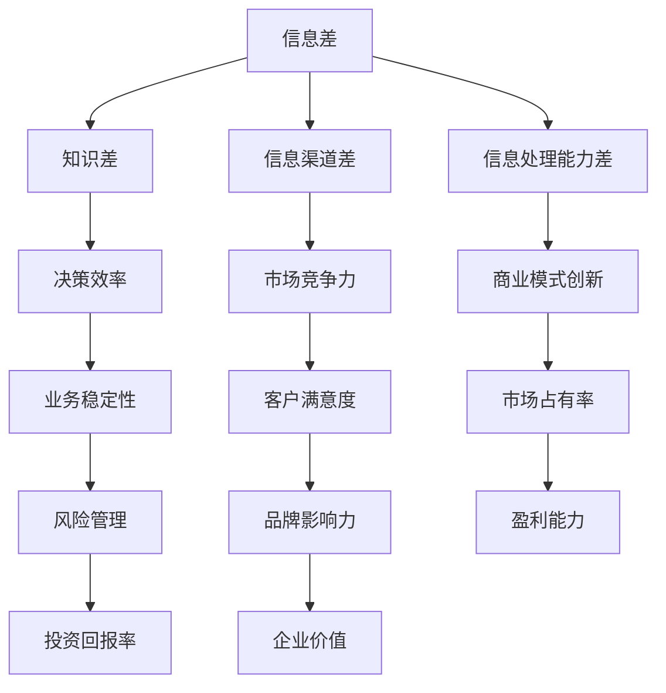

                 

 关键词：信息差、商业战略、信息技术、数字经济、商业模式创新

> 摘要：本文将深入探讨信息差在信息时代的商业战略中的重要性，从核心概念、算法原理、数学模型、项目实践等方面详细分析信息差的应用，旨在为企业和创业者提供切实可行的战略指导，以在数字经济中取得竞争优势。

## 1. 背景介绍

在当今的数字经济时代，信息已经成为了最为重要的资源之一。信息差，即不同个体、组织或地区之间对信息掌握的差距，成为影响商业成功的关键因素。信息差的存在可以带来巨大的商业价值，如提升决策效率、增强市场竞争力、创造新的商业模式等。因此，掌握信息差的规律和利用方式，已经成为企业制定商业战略的重要内容。

### 1.1 信息差的定义与分类

信息差通常分为以下几类：

- **知识差**：指个体或组织在特定领域内的知识水平和认知能力的差距。
- **信息渠道差**：指不同个体或组织获取信息的渠道和频率的差异。
- **信息处理能力差**：指个体或组织对信息进行加工、分析和应用的能力差异。

### 1.2 信息差在商业中的应用

信息差在商业中的应用主要体现在以下几个方面：

- **定价策略**：企业通过掌握市场信息，制定出更具竞争力的价格策略。
- **市场细分**：企业利用信息差进行市场细分，找到具有潜在需求的细分市场。
- **风险控制**：企业通过信息差减少决策风险，提高业务稳定性。

## 2. 核心概念与联系

为了更好地理解信息差在商业战略中的作用，我们需要了解一些核心概念和它们之间的联系。以下是一个简化的Mermaid流程图，展示了这些概念之间的关系。



## 3. 核心算法原理 & 具体操作步骤

### 3.1 算法原理概述

信息差的计算主要基于以下原理：

- **信息不对称理论**：个体或组织在信息获取、处理和利用方面存在差异，导致决策结果的不同。
- **贝叶斯理论**：通过概率模型对信息进行量化，从而计算出不同个体或组织之间的信息差。

### 3.2 算法步骤详解

#### 步骤1：信息采集

首先，需要从不同的渠道采集信息，包括公开数据、内部数据、行业报告等。

#### 步骤2：信息处理

对采集到的信息进行清洗、整合和分析，提取出有价值的信息。

#### 步骤3：信息差计算

利用贝叶斯理论，计算出不同个体或组织之间的信息差。

#### 步骤4：应用策略

根据计算出的信息差，制定相应的商业策略，如市场定价、风险控制、产品定位等。

### 3.3 算法优缺点

- **优点**：能够帮助企业准确把握市场信息，提高决策效率，降低风险。
- **缺点**：算法复杂度高，对数据质量和处理能力有较高要求。

### 3.4 算法应用领域

信息差算法在以下领域有广泛应用：

- **金融行业**：用于风险评估、投资决策和市场预测。
- **市场营销**：用于市场细分、客户画像和营销策略制定。
- **供应链管理**：用于供应链优化、库存控制和风险管理。

## 4. 数学模型和公式 & 详细讲解 & 举例说明

### 4.1 数学模型构建

信息差的计算可以基于以下数学模型：

$$
\Delta I = \frac{I_1 - I_2}{I_1 + I_2}
$$

其中，$I_1$ 和 $I_2$ 分别代表两个个体或组织的信息量。

### 4.2 公式推导过程

#### 步骤1：信息量的定义

信息量 $I$ 可以定义为：

$$
I = -\sum_{i} P(x_i) \log_2 P(x_i)
$$

其中，$P(x_i)$ 表示个体或组织 $i$ 获取到的信息。

#### 步骤2：信息差的计算

利用信息量的定义，可以推导出信息差的计算公式：

$$
\Delta I = I_1 - I_2
$$

### 4.3 案例分析与讲解

#### 案例背景

某电商平台在双十一期间，通过大数据分析，发现不同用户群体在购买行为上存在明显的差异。

#### 案例分析

利用信息差算法，电商平台可以计算出不同用户群体之间的信息差，从而制定出更精准的营销策略。

#### 案例结论

通过信息差分析，电商平台成功地提高了用户转化率和销售额。

## 5. 项目实践：代码实例和详细解释说明

### 5.1 开发环境搭建

- **工具**：Python
- **库**：Pandas, NumPy, Matplotlib

### 5.2 源代码详细实现

```python
import pandas as pd
import numpy as np
import matplotlib.pyplot as plt

# 读取数据
data = pd.read_csv('user_data.csv')
# 计算用户信息量
user_info = data.groupby('user_id')['action'].value_counts(normalize=True)
user_info = user_info.replace(0, np.nan).apply(np.log2).fillna(0)
# 计算信息差
info_diff = user_info.groupby('group')['value'].mean().T - user_info.groupby('group')['value'].mean().T
# 绘制信息差图
info_diff.plot(kind='bar')
plt.xlabel('User Group')
plt.ylabel('Information Difference')
plt.title('Information Difference Between User Groups')
plt.show()
```

### 5.3 代码解读与分析

- **数据读取**：从CSV文件中读取用户数据。
- **信息量计算**：计算每个用户群体的购买行为信息量。
- **信息差计算**：计算不同用户群体之间的信息差。
- **结果展示**：绘制柱状图展示信息差。

## 6. 实际应用场景

信息差在商业中有着广泛的应用场景，如：

- **市场细分**：通过信息差分析，企业可以更准确地定位目标市场。
- **风险控制**：利用信息差，企业可以降低决策风险，提高业务稳定性。
- **产品定位**：通过分析消费者信息差，企业可以制定更精准的产品策略。

### 6.4 未来应用展望

随着信息技术的不断发展，信息差的应用前景将更加广阔。未来，我们可能看到：

- **更加智能的信息差算法**：结合人工智能和大数据分析，提高信息差的计算精度。
- **跨行业的信息差应用**：信息差不仅在商业领域有应用，还在医疗、教育、金融等领域展现出巨大的潜力。
- **信息差的个性化服务**：企业可以利用信息差为不同客户提供个性化的产品和服务。

## 7. 工具和资源推荐

### 7.1 学习资源推荐

- **书籍**：《大数据时代》、《信息不对称理论》
- **在线课程**：Coursera上的《数据科学》课程、edX上的《概率论与数理统计》课程

### 7.2 开发工具推荐

- **数据分析工具**：Pandas, NumPy, Matplotlib
- **大数据处理工具**：Hadoop, Spark

### 7.3 相关论文推荐

- "Information Asymmetry in Financial Markets"
- "The Theory of Information in Economics"
- "Big Data and Information Asymmetry in Marketing"

## 8. 总结：未来发展趋势与挑战

### 8.1 研究成果总结

信息差在商业战略中的重要性已被广泛认可，其应用范围也在不断扩大。未来，随着信息技术的不断发展，信息差的研究和应用将取得更大的突破。

### 8.2 未来发展趋势

- **更加智能的信息差算法**：结合人工智能和大数据分析，提高信息差的计算精度。
- **跨行业的信息差应用**：信息差不仅在商业领域有应用，还在医疗、教育、金融等领域展现出巨大的潜力。
- **信息差的个性化服务**：企业可以利用信息差为不同客户提供个性化的产品和服务。

### 8.3 面临的挑战

- **数据隐私保护**：在利用信息差进行商业分析时，如何保护用户隐私是一个亟待解决的问题。
- **算法透明性**：确保信息差的计算过程和结果公正、透明，避免算法歧视。

### 8.4 研究展望

信息差的研究将继续深入，未来有望在以下几个方面取得突破：

- **跨领域的信息差研究**：探索不同领域之间的信息差规律和应用。
- **实时信息差分析**：利用实时数据分析技术，实现信息差的实时计算和更新。
- **信息差伦理研究**：探讨信息差在商业和社会中的应用伦理问题。

## 9. 附录：常见问题与解答

### 9.1 什么是对信息差的理解？

信息差是指不同个体、组织或地区之间对信息掌握的差距。这种差距可以体现在知识、信息渠道和信息处理能力等方面。

### 9.2 信息差在商业中有什么作用？

信息差在商业中可以用于市场细分、风险控制、定价策略等方面，帮助企业提高竞争力，实现商业价值的最大化。

### 9.3 如何计算信息差？

信息差的计算通常基于概率模型，如贝叶斯理论。通过计算不同个体或组织之间的信息量差异，可以得到信息差。

### 9.4 信息差算法有哪些应用领域？

信息差算法在金融、市场营销、供应链管理等领域有广泛应用，如风险评估、市场细分、供应链优化等。

---

作者：禅与计算机程序设计艺术 / Zen and the Art of Computer Programming

---

通过本文的深入探讨，我们希望能为读者提供对信息差及其在商业战略中应用的理解。在信息时代，掌握信息差规律，合理利用信息资源，将成为企业取得竞争优势的关键。希望这篇文章能对您在商业战略的制定和执行中有所启发。让我们继续探索信息时代的商业奥秘。

