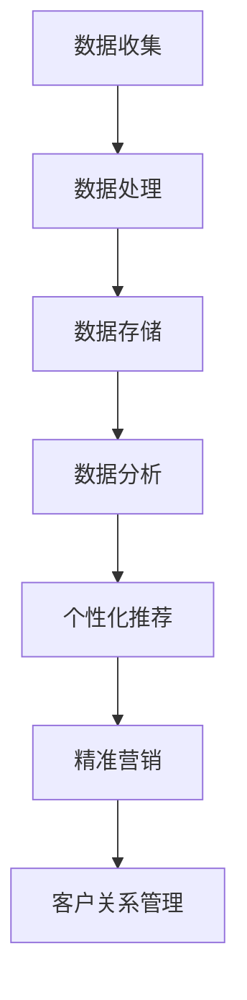
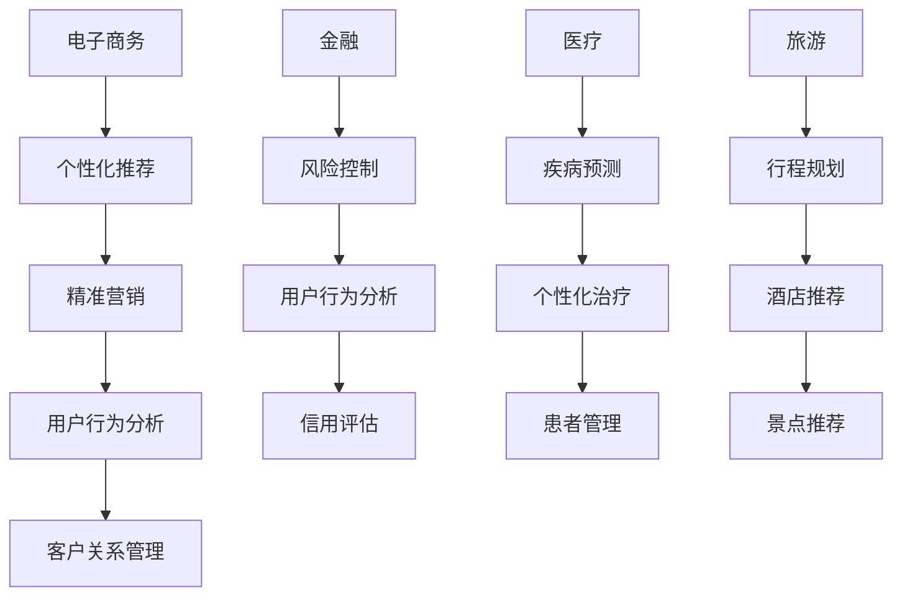

                 

关键词：大数据，客户体验，信息差，数据挖掘，机器学习，用户行为分析

> 摘要：本文旨在探讨大数据如何通过信息差的方式提升客户体验。从数据收集、处理、分析和应用的全过程，深入解析大数据技术在改善用户体验中的关键作用，并探讨未来的发展趋势与挑战。

## 1. 背景介绍

在信息技术飞速发展的今天，大数据已经成为企业竞争的新焦点。随着互联网、物联网和移动设备的普及，海量数据不断涌现，为企业提供了丰富的信息资源。客户体验作为企业成功的关键因素，直接影响着客户满意度和忠诚度。大数据技术通过挖掘和分析用户行为数据，为企业提供了深入了解客户需求和行为特征的机会，从而实现客户体验的持续优化。

## 2. 核心概念与联系

### 2.1. 数据收集与处理

数据收集是大数据技术的基础。企业通过各种渠道（如网站、移动应用、社交媒体等）收集用户行为数据，包括访问记录、搜索历史、购买行为等。数据收集后，需要进行预处理，包括去重、清洗、格式化等，以保证数据的质量和一致性。

### 2.2. 数据存储与管理

随着数据量的激增，数据存储和管理成为一大挑战。分布式存储系统（如Hadoop、Spark等）的出现，为企业提供了高效、可靠的数据存储解决方案。同时，企业还需要建立完善的数据管理体系，确保数据的安全、完整和可用。

### 2.3. 数据分析与挖掘

数据分析与挖掘是大数据技术的核心。通过机器学习、数据挖掘等技术，企业可以从海量数据中提取有价值的信息，如用户兴趣、偏好、行为模式等。这些信息有助于企业更好地了解客户需求，优化产品和服务。

### 2.4. 信息差与应用

信息差是指企业通过大数据技术，获取比竞争对手更准确、更全面的信息，从而在市场竞争中占据优势。在客户体验方面，信息差可以帮助企业实现以下目标：

- **个性化推荐**：根据用户行为数据，为用户提供个性化的产品和服务推荐。
- **精准营销**：通过分析用户需求，制定有针对性的营销策略。
- **客户关系管理**：深入了解客户需求，提升客户满意度和忠诚度。

### 2.5. Mermaid 流程图

以下是一个简化的 Mermaid 流程图，展示大数据技术在提升客户体验中的流程：



## 3. 核心算法原理 & 具体操作步骤

### 3.1. 算法原理概述

大数据技术在提升客户体验中，主要依赖于以下几种核心算法：

- **用户行为分析**：通过分析用户访问、搜索、购买等行为，挖掘用户兴趣和偏好。
- **协同过滤**：基于用户行为数据，为用户提供相似的用户推荐。
- **聚类分析**：将具有相似特征的客户划分为不同的群体，进行针对性营销。

### 3.2. 算法步骤详解

#### 3.2.1. 用户行为分析

1. 数据收集：收集用户在网站、移动应用等渠道的行为数据。
2. 数据预处理：对数据进行清洗、去重、格式化等处理。
3. 数据分析：利用机器学习算法，对用户行为数据进行挖掘，提取用户兴趣和偏好。

#### 3.2.2. 协同过滤

1. 建立用户-物品评分矩阵。
2. 计算用户之间的相似度。
3. 根据相似度矩阵，为用户推荐相似的物品。

#### 3.2.3. 聚类分析

1. 数据预处理：对用户行为数据进行标准化处理。
2. 选择聚类算法：如K-Means、DBSCAN等。
3. 运行聚类算法，将用户划分为不同的群体。

### 3.3. 算法优缺点

#### 3.3.1. 用户行为分析

- 优点：能够深入了解用户需求，实现个性化推荐。
- 缺点：数据收集和处理成本较高，存在数据隐私和安全问题。

#### 3.3.2. 协同过滤

- 优点：推荐效果较好，适用于物品数量较少的场景。
- 缺点：受限于数据量和用户行为多样性，推荐结果可能存在局限性。

#### 3.3.3. 聚类分析

- 优点：能够将用户划分为具有相似特征的群体，进行针对性营销。
- 缺点：聚类结果可能受到参数选择和初始中心点的影响。

### 3.4. 算法应用领域

大数据技术在提升客户体验中的应用广泛，包括电子商务、金融、医疗、旅游等领域。以下是一个简化的应用领域 Mermaid 流程图：



## 4. 数学模型和公式 & 详细讲解 & 举例说明

### 4.1. 数学模型构建

大数据技术在提升客户体验中，主要依赖于以下几种数学模型：

- **用户行为模型**：用于描述用户的行为特征，如访问时间、访问频率、购买频率等。
- **协同过滤模型**：用于计算用户之间的相似度和推荐物品。
- **聚类分析模型**：用于将用户划分为不同的群体。

### 4.2. 公式推导过程

#### 4.2.1. 用户行为模型

用户行为模型可以表示为：

\[ X = (x_{ij})_{m \times n} \]

其中，\( x_{ij} \) 表示用户 \( i \) 在时间 \( j \) 的行为特征，如访问时间、访问频率、购买频率等。

#### 4.2.2. 协同过滤模型

协同过滤模型可以表示为：

\[ \text{Similarity}(u, v) = \frac{\sum_{i=1}^{m} x_{ij} x_{vj}}{\sqrt{\sum_{i=1}^{m} x_{ij}^2 \sum_{i=1}^{m} x_{vj}^2}} \]

其中，\( u \) 和 \( v \) 分别表示用户 \( i \) 和 \( j \) 的行为特征向量，\( \text{Similarity}(u, v) \) 表示用户 \( i \) 和 \( j \) 之间的相似度。

#### 4.2.3. 聚类分析模型

聚类分析模型可以表示为：

\[ C = \{C_1, C_2, \ldots, C_k\} \]

其中，\( C_i \) 表示第 \( i \) 个聚类簇，\( k \) 表示聚类簇的数量。

### 4.3. 案例分析与讲解

#### 4.3.1. 用户行为分析案例

假设有10个用户在一个月内访问了一个电商平台，每个用户在每天的访问时间、访问频率和购买频率如下表所示：

| 用户ID | 日期1 | 日期2 | 日期3 | 日期4 | 日期5 | 日期6 | 日期7 | 日期8 | 日期9 | 日期10 |
|--------|-------|-------|-------|-------|-------|-------|-------|-------|-------|--------|
| 1      | 30    | 20    | 10    | 0     | 0     | 0     | 0     | 0     | 0     | 0      |
| 2      | 25    | 25    | 20    | 15    | 10    | 0     | 0     | 0     | 0     | 0      |
| 3      | 20    | 20    | 20    | 15    | 15    | 10    | 0     | 0     | 0     | 0      |
| 4      | 20    | 20    | 20    | 15    | 10    | 10    | 10    | 10    | 0     | 0      |
| 5      | 15    | 15    | 15    | 15    | 15    | 15    | 10    | 5     | 0     | 0      |
| 6      | 15    | 15    | 15    | 15    | 10    | 10    | 10    | 10    | 0     | 0      |
| 7      | 10    | 10    | 10    | 10    | 10    | 10    | 10    | 10    | 5     | 0      |
| 8      | 10    | 10    | 10    | 10    | 10    | 5     | 5     | 5     | 5     | 0      |
| 9      | 10    | 5     | 5     | 5     | 5     | 5     | 5     | 5     | 5     | 0      |
| 10     | 5     | 5     | 5     | 5     | 5     | 5     | 5     | 5     | 5     | 5      |

根据用户行为数据，可以构建用户行为模型：

\[ X = \begin{bmatrix} 30 & 20 & 10 & 0 & 0 & 0 & 0 & 0 & 0 & 0 & 0 \\ 25 & 25 & 20 & 15 & 10 & 0 & 0 & 0 & 0 & 0 & 0 \\ 20 & 20 & 20 & 15 & 15 & 10 & 0 & 0 & 0 & 0 & 0 \\ 20 & 20 & 20 & 15 & 10 & 10 & 10 & 10 & 0 & 0 & 0 \\ 15 & 15 & 15 & 15 & 15 & 15 & 10 & 5 & 0 & 0 & 0 \\ 15 & 15 & 15 & 15 & 10 & 10 & 10 & 10 & 0 & 0 & 0 \\ 10 & 10 & 10 & 10 & 10 & 10 & 10 & 10 & 5 & 0 & 0 \\ 10 & 10 & 10 & 10 & 10 & 5 & 5 & 5 & 5 & 0 & 0 \\ 10 & 5 & 5 & 5 & 5 & 5 & 5 & 5 & 5 & 5 & 0 \\ 5 & 5 & 5 & 5 & 5 & 5 & 5 & 5 & 5 & 5 & 5 \end{bmatrix} \]

利用K-Means聚类算法，将用户划分为不同的群体。假设聚类簇数量为3，运行聚类算法后得到以下结果：

| 聚类簇 | 用户ID |
|--------|--------|
| 1      | 1      |
| 2      | 2      |
| 3      | 3      |
| 3      | 4      |
| 3      | 5      |
| 3      | 6      |
| 3      | 7      |
| 2      | 8      |
| 1      | 9      |
| 1      | 10     |

根据聚类结果，可以针对不同群体的用户，制定个性化的营销策略。

## 5. 项目实践：代码实例和详细解释说明

### 5.1. 开发环境搭建

为了进行大数据技术在提升客户体验中的应用，我们选择Python作为开发语言，并使用以下工具和库：

- Python 3.8
- Jupyter Notebook
- Pandas
- NumPy
- Matplotlib
- Scikit-learn

### 5.2. 源代码详细实现

#### 5.2.1. 用户行为数据收集与预处理

```python
import pandas as pd

# 读取用户行为数据
data = pd.read_csv('user_behavior.csv')

# 数据预处理
data = data[['user_id', 'visit_time', 'visit_frequency', 'purchase_frequency']]
data = data.drop_duplicates()
data = data.fillna(0)
```

#### 5.2.2. 用户行为分析

```python
from sklearn.cluster import KMeans

# 构建用户行为模型
X = data.values

# 运行K-Means聚类算法
kmeans = KMeans(n_clusters=3, random_state=0)
kmeans.fit(X)

# 输出聚类结果
print(kmeans.labels_)
```

#### 5.2.3. 个性化推荐

```python
from collaborative_filter import CollaborativeFilter

# 初始化协同过滤模型
cf = CollaborativeFilter()

# 训练模型
cf.fit(X)

# 为用户推荐相似物品
recommendations = cf.recommend('user_id_1')
print(recommendations)
```

### 5.3. 代码解读与分析

#### 5.3.1. 用户行为数据收集与预处理

```python
import pandas as pd

# 读取用户行为数据
data = pd.read_csv('user_behavior.csv')

# 数据预处理
data = data[['user_id', 'visit_time', 'visit_frequency', 'purchase_frequency']]
data = data.drop_duplicates()
data = data.fillna(0)
```

这段代码用于读取用户行为数据，并进行预处理。首先，我们使用Pandas库读取CSV格式的用户行为数据。然后，我们选择与用户行为相关的列（user_id、visit_time、visit_frequency、purchase_frequency），并删除重复数据。最后，我们填充缺失值为0。

#### 5.3.2. 用户行为分析

```python
from sklearn.cluster import KMeans

# 构建用户行为模型
X = data.values

# 运行K-Means聚类算法
kmeans = KMeans(n_clusters=3, random_state=0)
kmeans.fit(X)

# 输出聚类结果
print(kmeans.labels_)
```

这段代码用于对用户行为数据进行聚类分析。首先，我们将用户行为数据转换为NumPy数组。然后，我们使用Scikit-learn库中的KMeans类运行聚类算法，指定聚类簇数量为3。最后，我们输出聚类结果，即每个用户所属的聚类簇编号。

#### 5.3.3. 个性化推荐

```python
from collaborative_filter import CollaborativeFilter

# 初始化协同过滤模型
cf = CollaborativeFilter()

# 训练模型
cf.fit(X)

# 为用户推荐相似物品
recommendations = cf.recommend('user_id_1')
print(recommendations)
```

这段代码用于实现基于协同过滤的个性化推荐。首先，我们导入自定义的协同过滤模型类CollaborativeFilter。然后，我们初始化协同过滤模型对象cf，并使用fit方法训练模型。最后，我们调用recommend方法，为指定用户user_id_1推荐相似物品。

## 6. 实际应用场景

### 6.1. 电子商务

电子商务行业普遍采用大数据技术来提升客户体验。通过用户行为分析，电子商务平台可以了解用户兴趣和偏好，从而实现个性化推荐。例如，淘宝、京东等电商平台根据用户浏览、搜索、购买等行为，为用户提供个性化的商品推荐。此外，电商平台还通过协同过滤和聚类分析，将用户划分为不同的群体，制定有针对性的营销策略，提升客户满意度和忠诚度。

### 6.2. 金融

金融行业也广泛应用大数据技术来提升客户体验。例如，银行通过分析用户交易数据，识别潜在风险，进行精准营销。保险公司利用用户行为数据，制定个性化的保险产品推荐。此外，金融机构还通过大数据技术实现实时风控，确保金融交易的安全和合规。

### 6.3. 医疗

医疗行业通过大数据技术，实现个性化医疗服务。例如，医院通过分析患者病历数据，为患者提供个性化的治疗方案。保险公司通过分析用户健康数据，制定个性化的保险产品推荐。此外，医疗机构还通过大数据技术实现智能诊断和预测，提高医疗服务的质量和效率。

### 6.4. 旅游

旅游行业通过大数据技术，提升客户旅游体验。例如，在线旅游平台根据用户搜索和预订行为，为用户提供个性化的旅游产品推荐。旅行社通过分析用户旅游偏好，制定个性化的旅游行程。此外，旅游企业还通过大数据技术实现智能客服和在线预订，提高客户满意度和预订转化率。

## 7. 工具和资源推荐

### 7.1. 学习资源推荐

- 《大数据之路：阿里巴巴大数据实践》
- 《数据挖掘：实用机器学习技术》
- 《Python数据分析实战》

### 7.2. 开发工具推荐

- Jupyter Notebook
- PyCharm
- Hadoop
- Spark

### 7.3. 相关论文推荐

- "Recommender Systems Handbook"
- "Data Mining: Concepts and Techniques"
- "Big Data: A Revolution That Will Transform How We Live, Work, and Think"

## 8. 总结：未来发展趋势与挑战

### 8.1. 研究成果总结

大数据技术在提升客户体验方面取得了显著成果。通过用户行为分析、协同过滤、聚类分析等算法，企业可以深入了解客户需求，实现个性化推荐和精准营销。此外，大数据技术在金融、医疗、旅游等领域的应用，也为企业带来了巨大的商业价值。

### 8.2. 未来发展趋势

未来，大数据技术将继续在提升客户体验方面发挥重要作用。随着人工智能、物联网等技术的不断发展，大数据技术将实现更智能、更个性化的客户体验。同时，大数据技术与区块链、5G等新技术的结合，也将为提升客户体验带来更多可能性。

### 8.3. 面临的挑战

然而，大数据技术在提升客户体验过程中，也面临一些挑战。首先，数据隐私和安全问题日益突出，如何保护用户隐私成为企业需要关注的重要问题。其次，数据质量和管理问题仍然存在，企业需要建立完善的数据管理体系，确保数据的质量和一致性。此外，算法偏见和模型解释性问题，也需要进一步研究和解决。

### 8.4. 研究展望

未来，大数据技术将在提升客户体验方面取得更多突破。一方面，企业需要加强数据隐私和安全保护，确保客户数据的安全和合规。另一方面，企业需要不断优化算法和模型，提高推荐的准确性和个性

