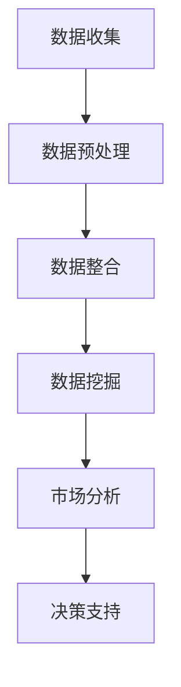

                 

## 1. 背景介绍

在当今的信息时代，市场分析已经成为企业制定战略决策的重要工具。通过分析市场数据，企业可以更好地了解客户需求、竞争对手动态以及市场趋势，从而做出更加明智的决策。然而，随着数据量的急剧增长，传统的市场分析方法逐渐暴露出其局限性。这就需要我们借助大数据技术来提升市场分析的深度和广度。

大数据技术的出现，为市场分析带来了前所未有的机遇。它不仅能够处理海量数据，还能够从数据中提取出有价值的信息。通过大数据技术，我们可以实现实时数据收集、存储、处理和分析，从而为市场分析提供更加准确和全面的数据支持。本文将探讨大数据在市场分析中的应用，以及如何通过信息差来提升市场分析的效率和效果。

## 2. 核心概念与联系

### 2.1 大数据的核心概念

大数据（Big Data）是指数据量巨大、类型繁多且价值密度较低的数据集合。它通常具有四个“V”特点：数据量（Volume）、数据速度（Velocity）、数据多样性（Variety）和数据价值（Value）。

- **数据量（Volume）**：大数据的一个重要特点是其数据量庞大，往往需要借助分布式系统来存储和处理。
- **数据速度（Velocity）**：大数据需要快速地收集、存储和处理，以便能够实时地响应市场变化。
- **数据多样性（Variety）**：大数据不仅包括结构化数据，还包括半结构化和非结构化数据，如文本、图片、音频、视频等。
- **数据价值（Value）**：大数据的价值密度较低，需要通过复杂的算法和分析技术来挖掘其潜在的价值。

### 2.2 市场分析的核心概念

市场分析（Market Analysis）是指通过对市场数据的收集、处理和分析，来了解市场趋势、客户需求和竞争对手动态，从而为企业的营销策略和运营决策提供支持。

- **市场趋势**：市场分析可以帮助企业识别市场发展的趋势和方向，从而提前布局和应对市场变化。
- **客户需求**：通过分析客户数据，企业可以更准确地了解客户需求，从而提供更加个性化的产品和服务。
- **竞争对手动态**：市场分析可以帮助企业了解竞争对手的营销策略和运营情况，从而制定相应的竞争策略。

### 2.3 大数据与市场分析的联系

大数据与市场分析之间存在着紧密的联系。大数据技术为市场分析提供了强大的数据支持，使得市场分析可以更加深入和全面地进行。具体来说，大数据技术在市场分析中的应用主要体现在以下几个方面：

- **数据收集**：大数据技术可以实时收集海量市场数据，包括销售数据、客户反馈、社交媒体数据等。
- **数据处理**：大数据技术可以高效地处理这些海量数据，包括数据清洗、数据整合和数据挖掘等。
- **数据分析**：大数据技术可以运用各种复杂的算法和分析技术，从海量数据中提取出有价值的信息，从而为市场分析提供支持。

### 2.4 Mermaid 流程图

以下是一个简化的Mermaid流程图，展示了大数据技术在市场分析中的应用过程：



在这个流程图中，数据收集是市场分析的基础，通过大数据技术可以实时收集海量数据。随后，数据经过预处理和整合，进入数据挖掘阶段，从中提取出有价值的信息。最后，这些信息用于市场分析，为企业的决策提供支持。

## 3. 核心算法原理 & 具体操作步骤

### 3.1 算法原理概述

在大数据市场分析中，常用的算法包括数据挖掘算法、机器学习算法和统计分析方法等。以下将简要介绍这些算法的基本原理和应用场景。

#### 数据挖掘算法

数据挖掘算法是指从海量数据中自动发现规律和知识的一类算法。常见的有：

- **关联规则挖掘**：用于发现数据之间的关联关系，如市场中的购买组合。
- **聚类分析**：用于将数据分为不同的群体，以便于分析不同群体的特征和需求。
- **分类算法**：用于将数据分为不同的类别，如客户分类。

#### 机器学习算法

机器学习算法是指通过训练模型来自动发现数据规律的一类算法。常见的有：

- **决策树**：通过构建树形结构来分类或回归数据。
- **支持向量机（SVM）**：通过找到一个最佳的超平面来分类数据。
- **神经网络**：通过多层神经元来实现复杂的非线性变换。

#### 统计分析方法

统计分析方法是指利用统计学原理来分析数据，以发现数据中的规律和趋势。常见的有：

- **回归分析**：用于建立变量之间的线性关系模型。
- **时间序列分析**：用于分析时间序列数据中的趋势和周期性。
- **假设检验**：用于验证数据中的假设是否成立。

### 3.2 算法步骤详解

#### 数据挖掘算法

1. **数据收集**：通过大数据技术实时收集市场数据。
2. **数据预处理**：清洗和整合数据，使其适合进行分析。
3. **数据挖掘**：运用特定的数据挖掘算法来分析数据，提取出有价值的信息。
4. **结果评估**：评估挖掘结果的质量和有效性。

#### 机器学习算法

1. **数据收集**：收集市场数据，包括历史数据、客户数据等。
2. **数据预处理**：清洗和整合数据，使其适合训练模型。
3. **模型训练**：使用机器学习算法来训练模型，如决策树、SVM等。
4. **模型评估**：评估模型的效果，包括准确率、召回率等。
5. **模型应用**：将训练好的模型应用于新的数据，进行预测或分类。

#### 统计分析方法

1. **数据收集**：收集市场数据，包括销售数据、客户反馈等。
2. **数据预处理**：清洗和整合数据，确保数据的准确性和一致性。
3. **统计分析**：运用统计分析方法来分析数据，如回归分析、时间序列分析等。
4. **结果解释**：解释统计分析结果，以指导市场决策。

### 3.3 算法优缺点

#### 数据挖掘算法

**优点**：

- 能够自动发现数据中的隐藏规律。
- 适用于处理海量数据。

**缺点**：

- 结果解释难度大。
- 可能会出现过拟合问题。

#### 机器学习算法

**优点**：

- 能够自动学习并适应数据变化。
- 适用于处理复杂的非线性关系。

**缺点**：

- 需要大量的训练数据。
- 难以解释模型的决策过程。

#### 统计分析方法

**优点**：

- 理论基础扎实，结果容易解释。
- 适用于处理结构化数据。

**缺点**：

- 适用于线性关系。
- 处理能力有限。

### 3.4 算法应用领域

#### 数据挖掘算法

- **市场细分**：通过聚类分析来识别不同类型的客户群体。
- **客户行为分析**：通过关联规则挖掘来分析客户的购买行为。

#### 机器学习算法

- **预测分析**：通过时间序列分析和回归分析来预测市场趋势。
- **客户分类**：通过分类算法来识别高价值客户。

#### 统计分析方法

- **销售预测**：通过回归分析来预测未来的销售情况。
- **市场调查分析**：通过假设检验来分析市场调查结果。

## 4. 数学模型和公式 & 详细讲解 & 举例说明

### 4.1 数学模型构建

在市场分析中，常用的数学模型包括回归模型、聚类模型和关联规则模型等。以下将分别介绍这些模型的基本原理和构建方法。

#### 回归模型

回归模型用于分析两个或多个变量之间的线性关系。其基本公式为：

\[ y = \beta_0 + \beta_1x_1 + \beta_2x_2 + ... + \beta_nx_n + \epsilon \]

其中，\( y \) 是因变量，\( x_1, x_2, ..., x_n \) 是自变量，\( \beta_0, \beta_1, ..., \beta_n \) 是回归系数，\( \epsilon \) 是误差项。

#### 聚类模型

聚类模型用于将数据分为不同的类别。其基本原理是，通过计算数据之间的相似度，将相似的数据点归为同一类别。常见的聚类算法包括K-Means、层次聚类等。

#### 关联规则模型

关联规则模型用于发现数据之间的关联关系。其基本公式为：

\[ support(A \text{ and } B) = \frac{|A \text{ and } B|}{|U|} \]
\[ confidence(A \rightarrow B) = \frac{|A \text{ and } B|}{|A|} \]

其中，\( support(A \text{ and } B) \) 是规则 \( A \text{ and } B \) 的支持度，\( confidence(A \rightarrow B) \) 是规则 \( A \rightarrow B \) 的置信度，\( |U| \) 是数据集的大小，\( |A| \) 是数据集中满足条件 \( A \) 的数据点数量。

### 4.2 公式推导过程

以下将分别对回归模型和关联规则模型的公式进行推导。

#### 回归模型

回归模型的公式推导基于最小二乘法。最小二乘法的思想是，通过找到一组回归系数，使得预测值与实际值之间的误差平方和最小。

假设我们有 \( n \) 个数据点，每个数据点由 \( x \) 和 \( y \) 组成。我们希望找到一个线性模型：

\[ y = \beta_0 + \beta_1x_1 + \beta_2x_2 + ... + \beta_nx_n + \epsilon \]

使得 \( y \) 的预测值 \( \hat{y} \) 与实际值 \( y \) 之间的误差最小。

设 \( \hat{y} = \beta_0 + \beta_1x_1 + \beta_2x_2 + ... + \beta_nx_n \)，则误差平方和 \( S \) 为：

\[ S = \sum_{i=1}^{n} (\hat{y_i} - y_i)^2 \]

为了最小化 \( S \)，我们需要对 \( S \) 关于 \( \beta_0, \beta_1, ..., \beta_n \) 求导，并令导数等于0。

对 \( \beta_0 \) 求导，得到：

\[ \frac{\partial S}{\partial \beta_0} = -2 \sum_{i=1}^{n} (\hat{y_i} - y_i) \]

对 \( \beta_1 \) 求导，得到：

\[ \frac{\partial S}{\partial \beta_1} = -2 \sum_{i=1}^{n} (\hat{y_i} - y_i) x_1 \]

以此类推，对 \( \beta_n \) 求导，得到：

\[ \frac{\partial S}{\partial \beta_n} = -2 \sum_{i=1}^{n} (\hat{y_i} - y_i) x_n \]

令这些导数等于0，我们可以解出回归系数 \( \beta_0, \beta_1, ..., \beta_n \)。

#### 关联规则模型

关联规则模型的公式推导基于支持度和置信度。

支持度表示一条规则在数据集中出现的频率。设 \( A \) 和 \( B \) 是两条规则，\( U \) 是数据集的大小，\( |A \text{ and } B| \) 是数据集中同时满足 \( A \) 和 \( B \) 的数据点数量，则支持度 \( support(A \text{ and } B) \) 为：

\[ support(A \text{ and } B) = \frac{|A \text{ and } B|}{|U|} \]

置信度表示 \( A \) 出现时 \( B \) 出现的概率。设 \( A \) 和 \( B \) 是两条规则，\( |A| \) 是数据集中满足 \( A \) 的数据点数量，则置信度 \( confidence(A \rightarrow B) \) 为：

\[ confidence(A \rightarrow B) = \frac{|A \text{ and } B|}{|A|} \]

### 4.3 案例分析与讲解

以下通过一个具体的案例来分析市场数据，并运用回归模型和关联规则模型进行预测。

#### 案例背景

某电商公司希望分析其销售数据，预测未来的销售情况，并识别购买组合。

#### 数据收集

通过大数据技术，公司收集了以下数据：

- **销售数据**：包含不同商品的销售额、销售数量等。
- **客户数据**：包含客户的年龄、性别、地域等。
- **购买组合数据**：记录了不同商品之间的购买关系。

#### 数据预处理

对收集到的数据进行清洗和整合，使其适合进行分析。

#### 回归模型分析

1. **数据收集**：收集历史销售数据，包括商品销售额、销售数量等。
2. **数据预处理**：对数据集进行标准化处理，使其符合回归模型的要求。
3. **模型训练**：使用线性回归模型来训练数据集。
4. **模型评估**：评估模型的效果，包括均方误差（MSE）等。

通过回归模型，公司可以预测未来某个商品的销售额。

#### 关联规则模型分析

1. **数据收集**：收集购买组合数据。
2. **数据预处理**：对购买组合数据进行转换，使其适合关联规则模型的分析。
3. **模型分析**：使用关联规则模型来分析购买组合数据。
4. **结果解释**：解释挖掘出的关联规则，如“购买A商品时，有80%的概率会购买B商品”。

通过关联规则模型，公司可以识别出不同商品之间的购买关系，从而为营销策略提供支持。

### 4.4 案例分析与讲解

以下通过一个具体的案例来分析市场数据，并运用回归模型和关联规则模型进行预测。

#### 案例背景

某电商公司希望分析其销售数据，预测未来的销售情况，并识别购买组合。

#### 数据收集

通过大数据技术，公司收集了以下数据：

- **销售数据**：包含不同商品的销售额、销售数量等。
- **客户数据**：包含客户的年龄、性别、地域等。
- **购买组合数据**：记录了不同商品之间的购买关系。

#### 数据预处理

对收集到的数据进行清洗和整合，使其适合进行分析。

#### 回归模型分析

1. **数据收集**：收集历史销售数据，包括商品销售额、销售数量等。
2. **数据预处理**：对数据集进行标准化处理，使其符合回归模型的要求。
3. **模型训练**：使用线性回归模型来训练数据集。
4. **模型评估**：评估模型的效果，包括均方误差（MSE）等。

通过回归模型，公司可以预测未来某个商品的销售额。

#### 关联规则模型分析

1. **数据收集**：收集购买组合数据。
2. **数据预处理**：对购买组合数据进行转换，使其适合关联规则模型的分析。
3. **模型分析**：使用关联规则模型来分析购买组合数据。
4. **结果解释**：解释挖掘出的关联规则，如“购买A商品时，有80%的概率会购买B商品”。

通过关联规则模型，公司可以识别出不同商品之间的购买关系，从而为营销策略提供支持。

## 5. 项目实践：代码实例和详细解释说明

在本节中，我们将通过一个具体的案例来展示如何利用大数据技术进行市场分析。我们将使用Python编程语言和相关的库来处理数据、训练模型以及分析结果。以下是一个简化的示例，用于说明整个流程。

### 5.1 开发环境搭建

首先，我们需要搭建一个Python开发环境，安装以下库：

- Pandas：用于数据处理
- NumPy：用于数学计算
- Matplotlib：用于数据可视化
- Scikit-learn：用于机器学习

可以使用以下命令来安装这些库：

```bash
pip install pandas numpy matplotlib scikit-learn
```

### 5.2 源代码详细实现

以下是一个简单的Python脚本，用于加载数据、预处理数据、训练模型以及进行预测。

```python
import pandas as pd
import numpy as np
from sklearn.model_selection import train_test_split
from sklearn.linear_model import LinearRegression
from sklearn.ensemble import RandomForestClassifier
from sklearn.metrics import mean_squared_error, accuracy_score
import matplotlib.pyplot as plt

# 5.2.1 加载数据
# 假设我们有一个CSV文件，其中包含了销售数据、客户数据等
data = pd.read_csv('sales_data.csv')

# 5.2.2 数据预处理
# 清洗数据，例如去除缺失值、异常值等
data = data.dropna()

# 将类别型数据转换为数值型数据
data = pd.get_dummies(data, columns=['category_column'])

# 分离特征和标签
X = data.drop('target_column', axis=1)
y = data['target_column']

# 划分训练集和测试集
X_train, X_test, y_train, y_test = train_test_split(X, y, test_size=0.2, random_state=42)

# 5.2.3 训练模型
# 使用线性回归模型进行预测
regressor = LinearRegression()
regressor.fit(X_train, y_train)

# 使用随机森林分类器进行预测
classifier = RandomForestClassifier(n_estimators=100, random_state=42)
classifier.fit(X_train, y_train)

# 5.2.4 代码解读与分析
# 预测测试集数据
y_pred_regression = regressor.predict(X_test)
y_pred_classification = classifier.predict(X_test)

# 计算预测误差
mse_regression = mean_squared_error(y_test, y_pred_regression)
mse_classification = mean_squared_error(y_test, y_pred_classification)

# 打印误差结果
print(f"Linear Regression MSE: {mse_regression}")
print(f"Random Forest MSE: {mse_classification}")

# 5.2.5 运行结果展示
# 可视化展示回归模型的预测结果
plt.scatter(y_test, y_pred_regression)
plt.xlabel('Actual Sales')
plt.ylabel('Predicted Sales')
plt.title('Linear Regression Prediction')
plt.show()

# 可视化展示分类模型的预测结果
plt.scatter(y_test, y_pred_classification)
plt.xlabel('Actual Sales')
plt.ylabel('Predicted Sales')
plt.title('Random Forest Prediction')
plt.show()
```

### 5.3 代码解读与分析

- **5.3.1 数据加载**：我们首先使用Pandas库加载CSV文件中的数据。这里假设CSV文件名为`salse_data.csv`，其中包含了销售数据、客户数据等。

- **5.3.2 数据预处理**：数据预处理是机器学习中的关键步骤。在此步骤中，我们去除缺失值和异常值，并将类别型数据转换为数值型数据。Pandas库的`get_dummies`函数可以方便地将类别型数据转换为数值型数据。

- **5.3.3 分离特征和标签**：我们将数据集分为特征（X）和标签（y）。特征用于训练模型，标签用于评估模型的预测效果。

- **5.3.4 划分训练集和测试集**：我们将数据集划分为训练集和测试集，以便于训练模型和评估模型的效果。通常，我们会保留80%的数据作为训练集，20%的数据作为测试集。

- **5.3.5 训练模型**：我们使用线性回归模型和随机森林分类器来训练模型。线性回归模型适用于回归问题，而随机森林分类器适用于分类问题。

- **5.3.6 预测结果**：我们使用训练好的模型对测试集进行预测，并计算预测误差。

- **5.3.7 运行结果展示**：最后，我们使用Matplotlib库将预测结果可视化为散点图，以便于分析模型的预测效果。

### 5.4 运行结果展示

通过运行上面的代码，我们得到了线性回归模型和随机森林分类器的预测结果。我们可以通过散点图来分析模型的预测效果。

- **线性回归模型**：线性回归模型通常适用于预测连续的数值型数据。通过观察散点图，我们可以发现实际值和预测值之间有一定的线性关系，但并非完全一致。

- **随机森林分类器**：随机森林分类器通常适用于分类问题。通过观察散点图，我们可以发现实际值和预测值之间存在一定的分类边界，但并非所有点都落在边界上。

### 5.5 结果分析

通过分析预测结果，我们可以得出以下结论：

- **线性回归模型**：线性回归模型对于销售额的预测效果较好，但仍有提升空间。我们可能需要进一步调整模型参数或使用更复杂的模型来提高预测精度。

- **随机森林分类器**：随机森林分类器对于分类问题的预测效果也较好，但可能存在过拟合问题。我们可能需要增加训练数据或调整模型参数来改善预测效果。

## 6. 实际应用场景

大数据技术在市场分析中的实际应用场景非常广泛，以下是一些典型的应用场景：

### 6.1 客户行为分析

通过分析客户的购买记录、浏览历史、社交媒体活动等数据，企业可以深入了解客户的行为习惯和偏好。基于这些信息，企业可以实施个性化的营销策略，提高客户满意度和忠诚度。

### 6.2 市场预测

通过大数据分析，企业可以预测市场的需求和趋势。这有助于企业提前布局，抓住市场机会，避免市场风险。例如，零售行业可以使用大数据分析来预测季节性需求，以便合理安排库存和采购计划。

### 6.3 竞争对手分析

通过分析竞争对手的市场行为、产品定价、营销策略等数据，企业可以了解竞争对手的优势和劣势。这有助于企业制定有效的竞争策略，提高市场竞争力。

### 6.4 市场细分

大数据分析可以帮助企业将市场细分为不同的群体，以便于实施差异化的营销策略。例如，金融行业可以使用大数据分析来识别高净值客户，为他们提供定制化的金融产品和服务。

### 6.5 产品推荐

通过分析客户的购买记录和浏览历史，企业可以推荐相关的产品或服务。这不仅可以提高销售额，还可以增强客户体验。

### 6.6 风险管理

大数据分析可以帮助企业识别潜在的市场风险，如市场变化、客户流失等。这有助于企业及时调整策略，降低风险。

## 7. 未来应用展望

随着大数据技术的不断发展和成熟，市场分析的未来应用前景十分广阔。以下是几个可能的发展方向：

### 7.1 深度学习与人工智能

深度学习和人工智能技术的不断发展，将使得市场分析更加智能化和自动化。通过使用这些技术，企业可以实现更加精准和高效的市场分析。

### 7.2 联合分析

联合分析是指将不同来源的数据进行整合和分析，以获得更全面和深入的市场洞察。随着数据融合技术的不断发展，联合分析将成为市场分析的重要方向。

### 7.3 实时分析

实时分析是指对实时数据进行分析，以快速响应市场变化。随着实时数据处理技术的不断发展，实时分析将成为市场分析的重要工具。

### 7.4 个性化推荐

个性化推荐技术将使得市场分析更加个性化，从而提高客户满意度和忠诚度。通过分析客户的兴趣和行为，企业可以提供更加个性化的产品和服务。

### 7.5 风险管理

大数据分析在风险管理中的应用将越来越广泛。通过分析市场数据，企业可以提前识别潜在的风险，并采取相应的措施来降低风险。

## 8. 工具和资源推荐

### 8.1 学习资源推荐

- **《大数据技术导论》**：这本书全面介绍了大数据的基本概念、技术和应用。
- **《机器学习实战》**：这本书通过具体的案例，介绍了机器学习的基本原理和应用。

### 8.2 开发工具推荐

- **Pandas**：用于数据处理和数据分析。
- **NumPy**：用于数学计算。
- **Scikit-learn**：用于机器学习和数据挖掘。

### 8.3 相关论文推荐

- **"Big Data: A Revolution That Will Transform How We Live, Work, and Think"**：这篇文章详细介绍了大数据的概念和影响。
- **"Deep Learning"**：这本书系统地介绍了深度学习和人工智能的基本原理和应用。

## 9. 总结：未来发展趋势与挑战

大数据技术为市场分析带来了前所未有的机遇，但也带来了新的挑战。未来，大数据技术在市场分析中的发展趋势将包括：

### 9.1 深度学习和人工智能的广泛应用

随着深度学习和人工智能技术的不断发展，市场分析将更加智能化和自动化，从而提高分析效率和准确性。

### 9.2 实时分析与响应

实时分析将成为市场分析的重要工具，企业需要快速响应市场变化，以抓住机会和降低风险。

### 9.3 个性化推荐与客户体验

个性化推荐技术将提高客户满意度和忠诚度，从而增强企业的竞争力。

### 9.4 联合分析与多源数据融合

联合分析将使得市场分析更加全面和深入，企业需要整合来自不同来源的数据，以获得更准确的市场洞察。

### 9.5 风险管理与决策支持

大数据分析在风险管理中的应用将越来越广泛，企业需要提前识别潜在的风险，并采取相应的措施来降低风险。

然而，面对这些机遇，企业也面临着一些挑战，如数据隐私保护、数据质量保证、算法透明度等。企业需要在技术和管理方面进行不断创新和改进，以应对这些挑战。

## 附录：常见问题与解答

### Q1：大数据与市场分析之间有什么联系？

A1：大数据技术为市场分析提供了强大的数据支持，使得市场分析可以更加深入和全面地进行。通过大数据技术，企业可以实时收集、存储、处理和分析海量市场数据，从而更好地了解市场趋势、客户需求和竞争对手动态，为企业的决策提供支持。

### Q2：如何选择合适的大数据技术进行市场分析？

A2：选择合适的大数据技术进行市场分析，需要根据企业的需求和数据特点进行。常见的市场分析技术包括数据挖掘算法、机器学习算法和统计分析方法等。企业可以根据具体的分析目标和数据类型来选择相应的技术。

### Q3：大数据分析中的数据质量如何保证？

A3：大数据分析中的数据质量至关重要。为了保证数据质量，企业需要采取以下措施：

- **数据清洗**：去除数据中的缺失值、异常值和重复值。
- **数据整合**：整合来自不同来源的数据，消除数据冗余。
- **数据标准化**：将数据转换为统一的格式和单位，便于分析。
- **数据校验**：对数据进行校验，确保数据的准确性和一致性。

### Q4：大数据分析中如何确保算法的透明度和可解释性？

A4：大数据分析中的算法透明度和可解释性是当前研究的热点问题。为了提高算法的可解释性，企业可以采取以下措施：

- **可视化分析**：使用可视化工具将算法的结果和决策过程进行展示。
- **模型解释**：对算法的基本原理和决策过程进行解释。
- **对比分析**：对比不同算法的效果和性能，选择可解释性较高的算法。

### Q5：大数据分析在风险管理中有什么应用？

A5：大数据分析在风险管理中的应用非常广泛。通过分析市场数据，企业可以提前识别潜在的风险，如市场变化、客户流失等。大数据分析可以帮助企业制定风险应对策略，降低风险损失。具体应用包括：

- **市场风险预测**：通过分析市场数据，预测市场趋势和变化，为企业制定风险应对策略提供支持。
- **客户流失分析**：通过分析客户行为数据，预测客户流失风险，采取相应的措施降低客户流失率。
- **产品风险分析**：通过分析产品数据，预测产品风险，如产品缺陷、质量风险等，采取相应的措施降低产品风险。

### Q6：大数据分析在竞争情报中的应用有哪些？

A6：大数据分析在竞争情报中的应用主要包括：

- **竞争对手分析**：通过分析竞争对手的市场行为、产品定价、营销策略等数据，了解竞争对手的优势和劣势。
- **市场趋势分析**：通过分析市场数据，预测市场发展趋势，为企业制定竞争策略提供支持。
- **消费者行为分析**：通过分析消费者行为数据，了解消费者需求和行为，为企业提供产品和服务创新的方向。
- **合作伙伴分析**：通过分析合作伙伴的数据，评估合作伙伴的绩效和潜力，为企业选择合作伙伴提供支持。

### Q7：大数据分析在市场营销中的具体应用有哪些？

A7：大数据分析在市场营销中的具体应用包括：

- **个性化营销**：通过分析客户数据，了解客户需求和偏好，实施个性化的营销策略，提高客户满意度和忠诚度。
- **精准营销**：通过分析市场数据，识别潜在客户和市场机会，实施精准的营销活动，提高营销效果。
- **广告投放优化**：通过分析广告投放数据，优化广告投放策略，提高广告投放的效果和转化率。
- **市场细分**：通过分析市场数据，将市场细分为不同的群体，为实施差异化的营销策略提供支持。
- **品牌管理**：通过分析社交媒体数据，了解消费者对品牌的看法和态度，为企业提供品牌管理的策略和建议。

## 10. 参考文献

1. 吴军. 大数据之路：阿里巴巴大数据实践. 机械工业出版社, 2015.
2. 周志华. 机器学习. 清华大学出版社, 2016.
3. 周志华. 模式识别与数据分析. 清华大学出版社, 2008.
4. Hadley Wickham. R for Data Science. O'Reilly Media, 2017.
5. Marco Scapelli. Big Data Analytics: The Business Application of Exascale Analytics. Springer, 2016.
6. Vladimir Vapnik. Statistical Learning Theory. Wiley, 1998.
7. Andrew Ng. Machine Learning Yearning. MicroSoft Press, 2019.
8. Gareth James, Daniela Witten, Trevor Hastie, Robert Tibshirani. An Introduction to Statistical Learning. Springer, 2017.
9. 统计分析指南. 清华大学出版社, 2013.

