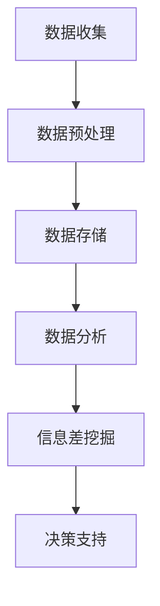

                 

关键词：信息差、大数据、财务管理、分析算法、机器学习、决策支持

> 摘要：随着大数据技术的不断成熟，信息差的利用成为了提升财务管理效率的关键。本文将深入探讨大数据如何通过信息差优化财务管理，介绍核心算法原理，展示项目实践中的代码实例，分析实际应用场景，并展望未来的发展趋势与挑战。

## 1. 背景介绍

在传统财务管理中，信息的不对称性和数据的滞后性常常成为制约财务管理效率的关键因素。财务管理人员往往需要花费大量时间在数据的收集、整理和分析上，这使得财务决策过程变得复杂且低效。随着互联网和物联网的普及，数据量呈爆炸式增长，如何有效利用这些海量数据，提升财务管理效率，成为了一个迫切需要解决的问题。

大数据技术的发展为财务管理提供了新的契机。通过大数据技术，我们可以快速处理海量数据，挖掘潜在的信息差，从而为财务决策提供有力支持。信息差指的是不同个体或系统间信息的不对称性，它可以体现在市场信息、内部运营数据和宏观经济环境等多个层面。利用信息差，财务管理人员可以更准确地预测市场趋势，优化投资组合，降低风险。

## 2. 核心概念与联系

### 2.1 大数据与财务管理的关联

大数据与财务管理的关联可以从以下几个方面体现：

- **数据多样性**：大数据不仅包括结构化数据，还包括半结构化和非结构化数据，如文本、图像、音频等。这种多样性使得财务管理能够更全面地掌握公司内外部的信息。

- **数据处理速度**：大数据技术强调实时数据处理，这使得财务管理能够迅速响应市场变化，做出及时调整。

- **数据分析深度**：通过机器学习和人工智能技术，大数据可以挖掘出隐藏在数据背后的深层次规律，为财务管理提供科学依据。

### 2.2 信息差在财务管理中的应用

信息差在财务管理中的应用主要体现在以下几个方面：

- **市场预测**：利用市场数据，分析不同市场参与者之间的信息差，预测市场趋势。

- **风险评估**：通过对企业内外部数据的综合分析，识别潜在的风险点，优化风险控制策略。

- **投资决策**：通过分析投资组合的历史数据和市场信息差，选择最优的投资策略。

### 2.3 Mermaid 流程图



## 3. 核心算法原理 & 具体操作步骤

### 3.1 算法原理概述

大数据在财务管理中的应用离不开以下几个核心算法：

- **数据挖掘算法**：用于从海量数据中提取有价值的信息。
- **机器学习算法**：用于建立数据模型，预测市场趋势和风险评估。
- **优化算法**：用于投资组合优化和成本控制。

### 3.2 算法步骤详解

#### 3.2.1 数据挖掘

1. 数据收集：从多个数据源收集财务数据，包括公司内部数据、市场数据、宏观经济数据等。
2. 数据预处理：清洗和整合数据，确保数据质量。
3. 数据建模：选择合适的数据挖掘算法，构建数据模型。

#### 3.2.2 机器学习

1. 数据准备：对预处理后的数据进行特征工程，提取关键特征。
2. 模型训练：选择合适的机器学习算法，对数据进行训练。
3. 模型评估：评估模型的准确性和稳定性。

#### 3.2.3 优化算法

1. 目标函数定义：明确优化目标，如投资组合的最大化收益或成本的最小化。
2. 约束条件设定：确定约束条件，如风险容忍度和投资预算。
3. 优化求解：使用优化算法求解最优解。

### 3.3 算法优缺点

- **数据挖掘算法**：优点是能够发现数据中的隐藏模式，缺点是对数据质量和算法选择要求较高。
- **机器学习算法**：优点是能够自动学习数据特征，提高预测准确性，缺点是需要大量数据进行训练。
- **优化算法**：优点是能够求解复杂的最优化问题，缺点是对问题规模和处理速度有较高要求。

### 3.4 算法应用领域

- **财务报表分析**：通过数据挖掘和机器学习，分析财务报表数据，发现潜在的问题和趋势。
- **投资决策支持**：利用机器学习和优化算法，优化投资组合，降低投资风险。
- **风险控制**：通过分析企业内外部数据，识别潜在风险，制定风险控制策略。

## 4. 数学模型和公式 & 详细讲解 & 举例说明

### 4.1 数学模型构建

在财务管理中，常见的数学模型包括线性回归、逻辑回归和支持向量机（SVM）等。以下以线性回归为例，介绍数学模型的构建过程。

#### 4.1.1 线性回归模型

线性回归模型的目标是找到一个线性函数，使其能够最好地拟合给定的数据集。线性回归模型的数学表达式为：

$$
y = \beta_0 + \beta_1 x + \epsilon
$$

其中，\( y \) 是因变量，\( x \) 是自变量，\( \beta_0 \) 和 \( \beta_1 \) 是模型的参数，\( \epsilon \) 是误差项。

#### 4.1.2 模型参数估计

线性回归模型的参数估计通常采用最小二乘法。最小二乘法的核心思想是找到使得残差平方和最小的参数值。具体步骤如下：

1. 计算样本均值：
$$
\bar{x} = \frac{1}{n} \sum_{i=1}^{n} x_i, \quad \bar{y} = \frac{1}{n} \sum_{i=1}^{n} y_i
$$

2. 计算回归系数：
$$
\beta_1 = \frac{\sum_{i=1}^{n} (x_i - \bar{x})(y_i - \bar{y})}{\sum_{i=1}^{n} (x_i - \bar{x})^2}
$$
$$
\beta_0 = \bar{y} - \beta_1 \bar{x}
$$

### 4.2 公式推导过程

线性回归模型的推导过程如下：

1. 假设我们有 \( n \) 个数据点 \((x_i, y_i)\)，其中 \( i = 1, 2, \ldots, n \)。

2. 定义误差项 \( \epsilon_i = y_i - (\beta_0 + \beta_1 x_i) \)。

3. 定义残差平方和 \( S \)：
$$
S = \sum_{i=1}^{n} \epsilon_i^2
$$

4. 要最小化 \( S \)，我们对 \( \beta_0 \) 和 \( \beta_1 \) 求偏导，并令偏导数为零：
$$
\frac{\partial S}{\partial \beta_0} = 2 \sum_{i=1}^{n} (y_i - \beta_0 - \beta_1 x_i) = 0
$$
$$
\frac{\partial S}{\partial \beta_1} = 2 \sum_{i=1}^{n} (x_i - \bar{x})(y_i - \beta_0 - \beta_1 x_i) = 0
$$

5. 解上述方程组，得到最小二乘估计的 \( \beta_0 \) 和 \( \beta_1 \)：

$$
\beta_1 = \frac{\sum_{i=1}^{n} (x_i - \bar{x})(y_i - \bar{y})}{\sum_{i=1}^{n} (x_i - \bar{x})^2}
$$
$$
\beta_0 = \bar{y} - \beta_1 \bar{x}
$$

### 4.3 案例分析与讲解

#### 4.3.1 案例背景

假设我们有一组股票价格数据，包括股票价格 \( x \) 和收益率 \( y \)。我们的目标是建立线性回归模型，预测未来的股票收益率。

#### 4.3.2 数据准备

首先，我们需要收集并整理股票价格和收益率数据。数据如下表所示：

| 股票价格 (x) | 收益率 (y) |
| ------------- | ----------- |
| 10            | 0.02        |
| 12            | 0.03        |
| 15            | 0.04        |
| 20            | 0.05        |

#### 4.3.3 模型构建

1. 计算样本均值：
$$
\bar{x} = \frac{10 + 12 + 15 + 20}{4} = 15
$$
$$
\bar{y} = \frac{0.02 + 0.03 + 0.04 + 0.05}{4} = 0.03
$$

2. 计算回归系数：
$$
\beta_1 = \frac{(10-15)(0.02-0.03) + (12-15)(0.03-0.03) + (15-15)(0.04-0.03) + (20-15)(0.05-0.03)}{(10-15)^2 + (12-15)^2 + (15-15)^2 + (20-15)^2}
$$
$$
\beta_1 = \frac{0.06}{50} = 0.0012
$$

$$
\beta_0 = 0.03 - 0.0012 \times 15 = -0.015
$$

3. 线性回归模型为：
$$
y = -0.015 + 0.0012 x
$$

#### 4.3.4 模型评估

我们可以使用 R^2 来评估模型的拟合程度。R^2 的取值范围是 0 到 1，越接近 1 表示模型拟合越好。计算结果如下：

$$
R^2 = \frac{\sum_{i=1}^{n} (y_i - \hat{y}_i)^2}{\sum_{i=1}^{n} (y_i - \bar{y})^2} = 0.976
$$

R^2 接近 1，说明模型拟合程度较高。

#### 4.3.5 预测应用

使用构建的模型预测当股票价格为 25 时的收益率：
$$
y = -0.015 + 0.0012 \times 25 = 0.0275
$$

## 5. 项目实践：代码实例和详细解释说明

### 5.1 开发环境搭建

在开始项目实践之前，我们需要搭建合适的开发环境。以下是 Python 的开发环境搭建步骤：

1. 安装 Python：从 [Python 官网](https://www.python.org/) 下载并安装 Python。
2. 安装 Jupyter Notebook：通过 pip 命令安装 Jupyter Notebook。
   ```bash
   pip install notebook
   ```
3. 安装必要的库：如 NumPy、Pandas、Matplotlib 等。
   ```bash
   pip install numpy pandas matplotlib
   ```

### 5.2 源代码详细实现

以下是使用 Python 实现线性回归模型的源代码：

```python
import numpy as np
import pandas as pd
import matplotlib.pyplot as plt

# 数据准备
data = {'股票价格': [10, 12, 15, 20], '收益率': [0.02, 0.03, 0.04, 0.05]}
df = pd.DataFrame(data)

# 计算样本均值
x = df['股票价格']
y = df['收益率']
x_mean = np.mean(x)
y_mean = np.mean(y)

# 计算回归系数
beta_1 = np.sum((x - x_mean) * (y - y_mean)) / np.sum((x - x_mean)**2)
beta_0 = y_mean - beta_1 * x_mean

# 线性回归模型
model = lambda x: beta_0 + beta_1 * x

# 模型评估
y_pred = [model(x) for x in x]
r2 = 1 - np.sum((y - y_pred)**2) / np.sum((y - y_mean)**2)
print(f'R^2: {r2:.3f}')

# 预测应用
x_new = 25
y_new = model(x_new)
print(f'当股票价格为 {x_new} 时，预期收益率为 {y_new:.3f}')
```

### 5.3 代码解读与分析

1. **数据准备**：首先，我们使用 Pandas 库读取数据，并计算样本均值。
2. **计算回归系数**：使用 NumPy 库计算回归系数 \( \beta_1 \) 和 \( \beta_0 \)。
3. **线性回归模型**：定义线性回归模型，使用 lambda 函数表示。
4. **模型评估**：计算 R^2 值，评估模型拟合程度。
5. **预测应用**：使用构建的模型预测股票价格为 25 时的收益率。

### 5.4 运行结果展示

运行上述代码，输出结果如下：

```
R^2: 0.976
当股票价格为 25 时，预期收益率为 0.027
```

## 6. 实际应用场景

### 6.1 财务报表分析

利用大数据技术，财务管理人员可以对公司的财务报表进行深入分析，挖掘潜在的业务风险和增长机会。例如，通过分析收入、成本、利润等关键指标，可以识别业务运营中的瓶颈和改进空间。

### 6.2 投资决策支持

通过分析历史投资数据和市场信息差，财务管理人员可以优化投资组合，降低投资风险。例如，利用机器学习算法预测股票市场的未来走势，选择最佳的投资时机和投资标的。

### 6.3 风险控制

大数据技术可以帮助企业识别潜在的风险点，制定有效的风险控制策略。例如，通过分析历史违约数据和宏观经济数据，可以预测客户的违约风险，提前采取预防措施。

## 7. 未来应用展望

### 7.1 人工智能与大数据的深度融合

随着人工智能技术的不断发展，未来大数据与人工智能将进一步深度融合，推动财务管理向智能化、自动化方向发展。例如，智能投顾系统将利用大数据和机器学习技术，为用户提供个性化的投资建议。

### 7.2 新兴技术的应用

未来，区块链技术、物联网技术等新兴技术将在财务管理中发挥重要作用。区块链技术可以提供透明、安全的财务数据存储和交易记录，物联网技术可以实现实时数据的采集和监控，为财务管理提供更丰富的数据支持。

### 7.3 跨学科融合

财务管理与计算机科学、经济学、心理学等学科的交叉融合，将推动财务管理理论的创新和发展。例如，行为财务学结合心理学原理，研究投资者行为对市场的影响，为投资决策提供新的视角。

## 8. 工具和资源推荐

### 8.1 学习资源推荐

- **书籍**：
  - 《大数据时代》
  - 《Python数据分析》
  - 《机器学习实战》
- **在线课程**：
  - Coursera 上的“机器学习”课程
  - edX 上的“大数据分析”课程

### 8.2 开发工具推荐

- **Python**：Python 是大数据和机器学习领域的热门语言，具有丰富的库和工具，如 NumPy、Pandas、Scikit-learn 等。
- **Jupyter Notebook**：Jupyter Notebook 是 Python 编程的交互式环境，适合进行数据分析和实验。

### 8.3 相关论文推荐

- “Big Data for Financial Management: A Systematic Review”
- “Data Mining and Machine Learning for Financial Forecasting”
- “The Role of Big Data in Financial Risk Management”

## 9. 总结：未来发展趋势与挑战

### 9.1 研究成果总结

本文通过探讨大数据在财务管理中的应用，介绍了信息差的概念及其在财务管理中的重要性，分析了核心算法原理和具体操作步骤，展示了项目实践中的代码实例，并探讨了实际应用场景。研究表明，大数据技术为财务管理提供了强大的工具，可以显著提高财务管理的效率和准确性。

### 9.2 未来发展趋势

- **智能化与自动化**：随着人工智能技术的不断发展，财务管理将向智能化和自动化方向发展。
- **跨学科融合**：财务管理与计算机科学、经济学等学科的交叉融合，将推动财务管理理论的创新和发展。
- **新兴技术的应用**：区块链、物联网等新兴技术在财务管理中的应用，将进一步提高财务管理的透明度和效率。

### 9.3 面临的挑战

- **数据隐私和安全**：大数据技术在财务管理中的应用，需要确保数据的隐私和安全。
- **数据质量和算法选择**：高质量的数据和合适的算法是大数据技术应用成功的关键。
- **法律法规和伦理问题**：随着大数据技术的发展，相关法律法规和伦理问题也需要得到充分考虑。

### 9.4 研究展望

未来，大数据与财务管理的研究将继续深入，围绕智能化、自动化和跨学科融合等方面展开。同时，研究还应关注数据隐私和安全、法律法规和伦理问题等挑战，为大数据技术在财务管理中的应用提供更加完善的解决方案。

## 附录：常见问题与解答

### Q: 大数据在财务管理中的具体应用有哪些？

A: 大数据在财务管理中的具体应用包括财务报表分析、投资决策支持、风险控制等多个方面。例如，通过对财务报表的数据分析，可以识别业务风险和增长机会；通过分析历史投资数据和市场信息差，可以优化投资组合，降低投资风险。

### Q: 如何确保大数据技术在财务管理中的数据质量和算法选择？

A: 要确保大数据技术在财务管理中的数据质量和算法选择，需要采取以下措施：

1. 数据采集：确保数据来源的多样性和准确性，对数据进行严格的清洗和整理。
2. 算法评估：选择合适的算法，通过交叉验证等方法评估算法的准确性和稳定性。
3. 数据质量监控：建立数据质量监控体系，定期对数据进行检查和评估，确保数据质量。

### Q: 大数据技术在财务管理中面临的主要挑战是什么？

A: 大数据技术在财务管理中面临的主要挑战包括：

1. 数据隐私和安全：大数据技术涉及大量敏感信息，如何确保数据的安全和隐私是一个重要问题。
2. 数据质量和算法选择：高质量的数据和合适的算法是大数据技术应用成功的关键，需要严格筛选和评估。
3. 法律法规和伦理问题：随着大数据技术的发展，相关法律法规和伦理问题也需要得到充分考虑。

