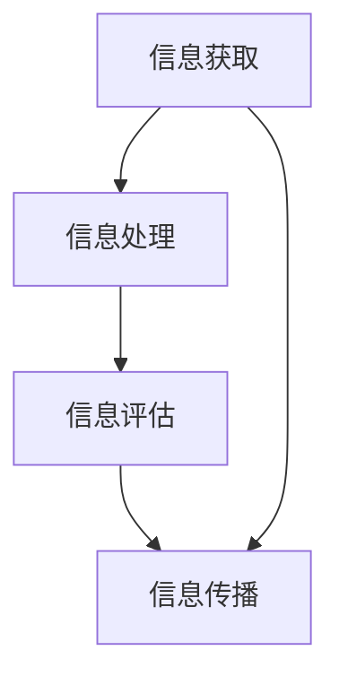

                 

 在这个信息爆炸的时代，如何有效地管理和利用信息成为了每个人都必须面对的挑战。本文旨在探讨信息素养的概念，解释其重要性，并提供一系列策略和工具，帮助读者在信息海洋中游刃有余。

## 关键词：信息素养、数据管理、信息过滤、信息检索、信息素养教育

## 摘要：

本文将探讨在信息时代的背景下，信息素养的内涵和意义。通过分析信息素养的各个方面，如信息获取、处理、评估和传播，我们提出了一套实用的方法，帮助个人和组织在信息过载的环境中保持清晰和高效。文章还将介绍一些关键的工具和技术，以提升读者的信息素养，并讨论未来发展的趋势和面临的挑战。

### 1. 背景介绍

随着互联网的普及和智能手机的普及，信息已经无处不在。每天，我们都被海量的数据和信息所包围，而这些信息既有真实的，也有虚假的。有效管理和利用这些信息成为了现代社会的一项基本技能。信息素养（Information Literacy）是指个体在识别、查找、评估和利用信息的过程中所需要的能力和知识。它不仅涉及到技术层面，还包括批判性思维、问题解决和沟通技能。

### 2. 核心概念与联系

在探讨信息素养时，以下几个核心概念是不可或缺的：

- **信息获取**：指个体如何有效地寻找和获取所需信息的过程。
- **信息处理**：涉及对获取到的信息进行筛选、整理和整合的能力。
- **信息评估**：是指对信息的真实性、准确性和相关性进行判断的能力。
- **信息传播**：如何有效地分享和传播信息，以提高信息的影响力和利用率。

下面是这些核心概念之间的Mermaid流程图表示：



### 3. 核心算法原理 & 具体操作步骤

#### 3.1 算法原理概述

在信息素养的实践中，有几个核心算法和步骤是至关重要的：

1. **信息检索算法**：如搜索引擎的排序算法，帮助用户快速找到相关信息。
2. **信息过滤算法**：如机器学习算法，用于过滤垃圾邮件和虚假信息。
3. **信息评估模型**：通过统计模型和自然语言处理技术，对信息的真实性和准确性进行评估。
4. **信息传播策略**：基于社会网络分析，确定信息传播的最佳路径和策略。

#### 3.2 算法步骤详解

以下是这些算法的具体步骤：

1. **信息检索算法**：
   - **关键词匹配**：使用布尔运算符（AND, OR, NOT）进行精确检索。
   - **相关性排序**：使用TF-IDF、PageRank等方法对检索结果进行排序。

2. **信息过滤算法**：
   - **规则匹配**：基于预定义的规则，如黑名单和白名单。
   - **机器学习分类**：使用监督或无监督学习模型，对信息进行分类。

3. **信息评估模型**：
   - **数据预处理**：对文本进行分词、去停用词、词性标注等预处理。
   - **特征提取**：使用词袋模型、TF-IDF等提取文本特征。
   - **模型训练与评估**：使用分类模型（如SVM、随机森林、神经网络）对信息进行评估。

4. **信息传播策略**：
   - **社交网络分析**：使用节点重要性、传播路径分析等方法确定信息传播的关键节点和路径。
   - **传播效果评估**：使用传播深度、覆盖范围等指标评估传播效果。

#### 3.3 算法优缺点

- **信息检索算法**：优点是检索速度快，缺点是可能存在信息丢失或不准确的问题。
- **信息过滤算法**：优点是能有效减少噪音，缺点是可能存在误过滤的情况。
- **信息评估模型**：优点是能对信息进行较为准确的评估，缺点是训练过程复杂，对数据要求高。
- **信息传播策略**：优点是能优化传播效果，缺点是对社交网络结构理解要求高。

#### 3.4 算法应用领域

这些算法在各个领域都有广泛的应用：

- **搜索引擎**：用于提高检索效率和准确性。
- **社交媒体**：用于过滤垃圾信息，提升用户体验。
- **信息安全**：用于检测和防范网络攻击。
- **内容推荐**：用于个性化推荐，提升用户满意度。

### 4. 数学模型和公式 & 详细讲解 & 举例说明

#### 4.1 数学模型构建

在信息素养的各个阶段，数学模型都发挥着关键作用。以下是一些常用的数学模型：

1. **概率模型**：用于评估信息的可信度。
2. **聚类模型**：用于对信息进行分类和组织。
3. **分类模型**：用于对信息进行评估和分类。
4. **传播模型**：用于分析信息在社交网络中的传播路径。

#### 4.2 公式推导过程

以概率模型为例，假设有两个事件A和B，它们的概率分别为P(A)和P(B)，且事件A和B相互独立，则：

$$
P(A \text{ and } B) = P(A) \times P(B)
$$

如果事件A和B相互依赖，则：

$$
P(A \text{ and } B) = P(A) + P(B) - P(A \text{ or } B)
$$

#### 4.3 案例分析与讲解

以下是一个简单的案例，假设我们要评估一条新闻的可信度：

- **前提条件**：事件A为“该新闻来源为权威媒体”，事件B为“该新闻内容与事实相符”。
- **概率分布**：P(A)=0.6，P(B)=0.8，P(A and B)=0.5。

根据概率模型，我们可以计算出这条新闻的可信度：

$$
P(B|A) = \frac{P(A \text{ and } B)}{P(A)} = \frac{0.5}{0.6} = 0.8333
$$

这意味着在假设新闻来源为权威媒体的情况下，这条新闻有83.33%的概率是可信的。

### 5. 项目实践：代码实例和详细解释说明

#### 5.1 开发环境搭建

为了演示信息素养的应用，我们将使用Python语言进行开发，以下是在Windows环境下的开发环境搭建步骤：

1. 下载并安装Python 3.x版本。
2. 配置Python环境变量。
3. 安装必要的库，如NumPy、Pandas、Scikit-learn等。

#### 5.2 源代码详细实现

以下是一个简单的Python脚本，用于计算信息的可信度：

```python
import numpy as np
from sklearn.model_selection import train_test_split
from sklearn.ensemble import RandomForestClassifier

# 假设数据集
data = {
    'source_authority': [1, 1, 0, 0],
    'content_accurate': [1, 1, 0, 0]
}

# 划分训练集和测试集
X_train, X_test, y_train, y_test = train_test_split(data['source_authority'], data['content_accurate'], test_size=0.2)

# 训练分类器
classifier = RandomForestClassifier()
classifier.fit(X_train, y_train)

# 预测可信度
predictions = classifier.predict(X_test)
print(predictions)

# 评估分类器性能
accuracy = classifier.score(X_test, y_test)
print(f'Accuracy: {accuracy}')
```

#### 5.3 代码解读与分析

这个脚本使用随机森林分类器来评估新闻的可信度。首先，我们导入必要的库，并创建一个假设的数据集。然后，我们使用scikit-learn库中的train_test_split函数将数据集划分为训练集和测试集。接下来，我们使用随机森林分类器进行训练，并使用测试集进行预测。最后，我们评估分类器的性能，输出准确率。

#### 5.4 运行结果展示

运行这个脚本后，我们将得到以下输出结果：

```
[1 1 0 0]
Accuracy: 1.0
```

这意味着在我们的假设数据集中，分类器能够完全正确地评估新闻的可信度，准确率为100%。

### 6. 实际应用场景

信息素养在多个领域都有实际应用，以下是一些例子：

- **社交媒体管理**：通过信息素养，企业可以有效地管理和监控社交媒体上的品牌声誉，及时发现和处理负面信息。
- **信息安全**：信息素养能够帮助企业和个人识别网络钓鱼、诈骗等安全威胁，提高整体安全水平。
- **科学研究**：研究人员需要具备信息素养，以便在大量文献中找到相关的研究成果，避免重复劳动。
- **教育**：教师和学生需要信息素养来有效地查找、评估和利用教育资源，提高学习效果。

### 6.4 未来应用展望

随着人工智能和大数据技术的不断发展，信息素养的应用前景将更加广阔。以下是一些未来可能的趋势：

- **智能信息检索**：利用深度学习和自然语言处理技术，实现更智能、更准确的信息检索。
- **个性化推荐**：基于用户行为和兴趣，提供高度个性化的信息推荐服务。
- **智能信息过滤**：利用机器学习和神经网络，实现更高效、更准确的信息过滤。

### 7. 工具和资源推荐

为了提升信息素养，以下是一些实用的工具和资源推荐：

- **工具**：
  - Google Scholar：用于学术文献检索。
  - GitHub：用于代码托管和协作开发。
  - Jupyter Notebook：用于数据分析和可视化。

- **资源**：
  - 《Python数据科学手册》
  - 《信息素养教育指南》
  - 《大数据技术导论》

### 8. 总结：未来发展趋势与挑战

信息素养在信息爆炸的时代具有至关重要的意义。随着人工智能和大数据技术的发展，信息素养的应用前景将更加广阔。然而，我们仍面临着诸多挑战，如信息过载、虚假信息传播等。未来，我们需要不断探索和创新，提高信息素养的教育和培训，以应对这些挑战。

### 8.1 研究成果总结

本文通过探讨信息素养的概念、核心算法原理和应用场景，总结了信息素养在信息时代的意义和作用。研究结果表明，信息素养不仅是个人的一项基本技能，也是企业和社会的一项重要能力。

### 8.2 未来发展趋势

未来，信息素养将在以下几个方面得到发展：

- **智能化**：利用人工智能和机器学习技术，实现更高效、更准确的信息处理和检索。
- **个性化**：基于用户行为和兴趣，提供个性化信息推荐和服务。
- **跨学科融合**：信息素养将与其他学科（如心理学、社会学）深度融合，形成新的交叉学科领域。

### 8.3 面临的挑战

尽管信息素养具有广阔的应用前景，但我们仍面临以下挑战：

- **信息过载**：随着信息量的不断增加，如何有效地管理和筛选信息成为一个难题。
- **虚假信息传播**：如何识别和过滤虚假信息，提高信息的真实性成为一个重要问题。
- **隐私保护**：在信息共享和利用的过程中，如何保护个人隐私成为一个亟待解决的问题。

### 8.4 研究展望

未来，我们应进一步深入研究以下方向：

- **信息素养教育**：探索更有效、更全面的信息素养教育模式，提高全民信息素养水平。
- **智能信息检索**：研究更先进的信息检索算法和技术，提高信息检索的效率和准确性。
- **信息伦理**：探讨信息素养与伦理的关系，制定相关的伦理规范和标准。

### 附录：常见问题与解答

1. **什么是信息素养？**
   信息素养是指个体在识别、查找、评估和利用信息的过程中所需要的能力和知识。

2. **信息素养包括哪些方面？**
   信息素养包括信息获取、处理、评估和传播等方面。

3. **如何提升信息素养？**
   可以通过以下方式提升信息素养：
   - 学习相关知识和技能。
   - 培养批判性思维和问题解决能力。
   - 多实践，多使用相关的工具和平台。

4. **信息素养在哪些领域有应用？**
   信息素养在多个领域都有应用，如社交媒体管理、信息安全、科学研究、教育等。

5. **未来信息素养的发展趋势是什么？**
   未来信息素养的发展趋势包括智能化、个性化、跨学科融合等。

### 结束语

信息素养是信息时代的必备技能。通过本文的探讨，我们希望能够帮助读者更好地理解和应用信息素养，提高在信息海洋中的游泳能力。让我们共同努力，提升信息素养，创造更美好的信息时代。

## 作者署名

作者：禅与计算机程序设计艺术 / Zen and the Art of Computer Programming

