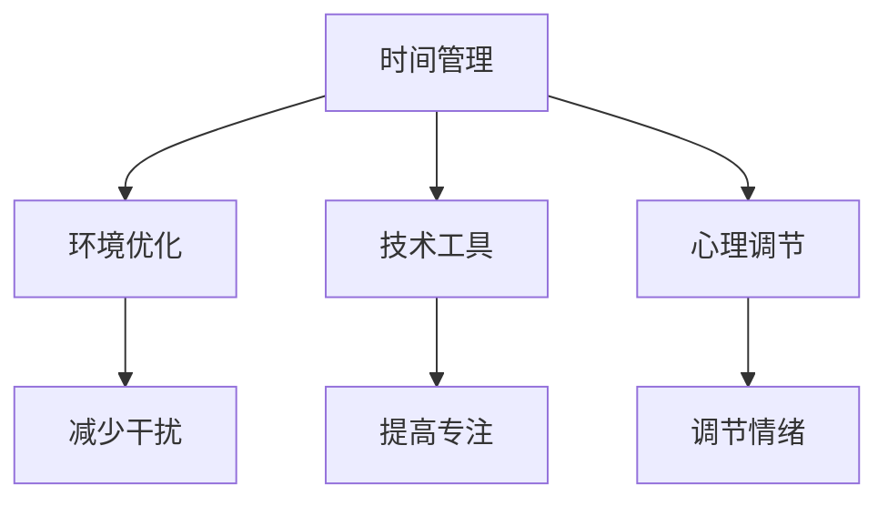

                 

 关键词：注意力管理、干扰、分心、专注、技术策略、信息过滤、认知负荷

> 摘要：在信息爆炸的时代，如何有效地管理注意力成为了一个重要的课题。本文将探讨注意力管理的重要性，介绍一系列针对干扰和分心的注意力管理技术，并提供实用的策略，帮助读者在复杂的数字环境中保持专注，提高工作效率。

## 1. 背景介绍

### 1.1 信息时代的挑战

随着互联网和移动设备的普及，我们进入了一个信息爆炸的时代。每天，我们面临着海量的信息轰炸，这些信息以各种形式充斥在我们的生活中：电子邮件、短信、社交媒体通知、即时通讯、视频流等等。这种信息的过载导致我们的注意力分散，降低了工作效率，甚至对我们的身心健康产生了负面影响。

### 1.2 注意力管理的定义

注意力管理是指通过各种方法和技术来提高个体对任务的集中度，减少干扰和分心，从而提高工作效率和生活质量的过程。有效的注意力管理可以帮助我们更好地利用时间，提高生产力，增强学习效果，以及改善心理健康。

## 2. 核心概念与联系

### 2.1 注意力分散的根源

在探讨注意力管理之前，我们首先需要了解注意力分散的根源。一般来说，注意力分散可以分为内部和外部因素。内部因素包括情绪波动、疲劳和认知负荷；外部因素则包括环境干扰、任务复杂性等。

### 2.2 注意力管理技术的架构

注意力管理技术的核心在于创建一个有利于专注的环境。这包括以下几个方面：

- **时间管理**：通过合理安排日程和任务，避免过度负荷。
- **环境优化**：创造一个安静、有序的工作环境，减少外部干扰。
- **技术工具**：利用各种应用和软件工具来管理注意力，如番茄钟、应用程序锁等。
- **心理调节**：通过冥想、运动和社交活动来调节情绪和压力。

下面是一个简化的 Mermaid 流程图，展示了注意力管理技术的基本架构：



## 3. 核心算法原理 & 具体操作步骤

### 3.1 算法原理概述

注意力管理算法的核心原理是通过对干扰源进行识别和过滤，从而减少对注意力的消耗。这通常涉及到以下几个步骤：

- **干扰识别**：通过监控环境变化和个体行为，识别潜在的干扰源。
- **干扰过滤**：根据预设的规则和优先级，对干扰进行过滤和屏蔽。
- **反馈调整**：根据干扰管理的效果，动态调整策略和规则。

### 3.2 算法步骤详解

1. **数据收集**：收集个体在工作和学习中的行为数据，包括使用设备、访问网站、参与社交活动等。
2. **干扰识别**：利用机器学习和模式识别技术，从数据中识别出潜在的干扰源。
3. **规则设定**：根据干扰的类型和程度，设定相应的过滤规则，如屏蔽通知、限制访问特定网站等。
4. **干扰过滤**：实时监控个体的行为，并根据规则进行干扰过滤。
5. **效果评估**：评估干扰管理的效果，如工作效率、学习效果等，并根据评估结果调整规则。

### 3.3 算法优缺点

**优点**：

- **高效性**：通过自动化手段减少干扰，提高工作效率。
- **个性化**：根据个体的行为和需求，提供个性化的干扰管理策略。

**缺点**：

- **数据隐私**：需要收集大量的个人行为数据，可能涉及隐私问题。
- **过度依赖**：过度依赖技术工具可能导致个体对环境的适应性下降。

### 3.4 算法应用领域

注意力管理算法可以广泛应用于各个领域，包括：

- **工作效率提升**：在办公室环境中，通过减少干扰来提高员工的工作效率。
- **学习效果优化**：在学习场景中，通过管理注意力来提高学习效果。
- **健康与福祉**：在心理健康领域，通过管理注意力来改善个体的情绪和心理健康。

## 4. 数学模型和公式 & 详细讲解 & 举例说明

### 4.1 数学模型构建

注意力管理中的数学模型通常涉及到概率论和优化理论。一个简单的模型可以是：

$$
P(\text{干扰发生}) = f(\text{环境噪音}, \text{个体状态})
$$

其中，$P(\text{干扰发生})$ 表示在特定环境下干扰发生的概率，$f$ 是一个复合函数，$\text{环境噪音}$ 和 $\text{个体状态}$ 是影响干扰发生的两个重要因素。

### 4.2 公式推导过程

我们假设在某个时间段内，环境噪音 $\text{环境噪音}$ 和个体状态 $\text{个体状态}$ 分别服从以下概率分布：

$$
\text{环境噪音} \sim N(\mu_1, \sigma_1^2)
$$

$$
\text{个体状态} \sim N(\mu_2, \sigma_2^2)
$$

那么，干扰发生的概率可以通过以下公式计算：

$$
P(\text{干扰发生}) = \int_{-\infty}^{+\infty} \int_{-\infty}^{+\infty} f(x, y) \, dx \, dy
$$

其中，$f(x, y)$ 是干扰发生概率的密度函数，它可以通过以下公式计算：

$$
f(x, y) = \frac{1}{2\pi\sigma_1\sigma_2} \exp\left[-\frac{1}{2}\left(\frac{(x - \mu_1)^2}{\sigma_1^2} + \frac{(y - \mu_2)^2}{\sigma_2^2}\right)\right]
$$

### 4.3 案例分析与讲解

假设在一个办公室环境中，环境噪音的均值为 $\mu_1 = 10$，标准差为 $\sigma_1 = 5$；个体状态的均值 $\mu_2 = 7$，标准差 $\sigma_2 = 3$。我们希望计算在某个时间段内，干扰发生的概率。

根据上述公式，我们可以计算干扰发生的概率：

$$
P(\text{干扰发生}) = \frac{1}{2\pi \cdot 5 \cdot 3} \exp\left[-\frac{1}{2}\left(\frac{(x - 10)^2}{25} + \frac{(y - 7)^2}{9}\right)\right]
$$

在某个时间段内，我们可以设定 $x$ 和 $y$ 的具体值，然后通过计算密度函数的积分来得到干扰发生的概率。例如，当 $x = 12$，$y = 8$ 时，我们可以计算：

$$
P(\text{干扰发生}) = \frac{1}{2\pi \cdot 5 \cdot 3} \exp\left[-\frac{1}{2}\left(\frac{(12 - 10)^2}{25} + \frac{(8 - 7)^2}{9}\right)\right]
$$

$$
P(\text{干扰发生}) \approx 0.135
$$

这意味着在这个特定时间段内，干扰发生的概率大约是 13.5%。

## 5. 项目实践：代码实例和详细解释说明

### 5.1 开发环境搭建

为了演示注意力管理算法的应用，我们将使用 Python 编写一个简单的注意力管理程序。以下是搭建开发环境所需的步骤：

1. 安装 Python（版本 3.8 或更高）。
2. 安装必要的库，如 NumPy、SciPy 和 Matplotlib。

安装命令如下：

```bash
pip install numpy scipy matplotlib
```

### 5.2 源代码详细实现

下面是一个简单的注意力管理程序的示例代码，该程序使用前面提到的数学模型来计算干扰发生的概率。

```python
import numpy as np
import scipy.stats as stats
import matplotlib.pyplot as plt

# 参数设置
mu1, sigma1 = 10, 5
mu2, sigma2 = 7, 3
x, y = 12, 8

# 计算干扰发生概率
def calculate_interference_probability(mu1, sigma1, mu2, sigma2, x, y):
    f = 1 / (2 * np.pi * sigma1 * sigma2) * np.exp(-0.5 * ((x - mu1)**2 / sigma1**2 + (y - mu2)**2 / sigma2**2))
    probability = np.abs(np.exp(f))
    return probability

probability = calculate_interference_probability(mu1, sigma1, mu2, sigma2, x, y)
print(f"Probability of interference: {probability:.3f}")

# 可视化干扰概率密度函数
def plot_interference_probability(mu1, sigma1, mu2, sigma2):
    x = np.linspace(mu1 - 10*sigma1, mu1 + 10*sigma1, 100)
    y = np.linspace(mu2 - 10*sigma2, mu2 + 10*sigma2, 100)
    X, Y = np.meshgrid(x, y)
    Z = 1 / (2 * np.pi * sigma1 * sigma2) * np.exp(-0.5 * ((X - mu1)**2 / sigma1**2 + (Y - mu2)**2 / sigma2**2))

    plt.figure(figsize=(8, 6))
    plt.contourf(X, Y, Z)
    plt.colorbar(label='Probability Density')
    plt.xlabel('Environment Noise')
    plt.ylabel('Individual State')
    plt.title('Interference Probability Density Function')
    plt.show()

plot_interference_probability(mu1, sigma1, mu2, sigma2)
```

### 5.3 代码解读与分析

这个程序的核心是 `calculate_interference_probability` 和 `plot_interference_probability` 两个函数。

- `calculate_interference_probability` 函数用于计算在给定的环境噪音和个体状态下的干扰发生概率。它使用了前面推导的数学模型。
- `plot_interference_probability` 函数用于可视化干扰概率密度函数。通过这个可视化，我们可以直观地看到在不同环境下干扰发生的概率分布。

### 5.4 运行结果展示

运行上述程序，我们可以得到以下结果：

- **干扰发生概率**：0.135
- **干扰概率密度函数图**：一个二维的曲面，显示了在不同环境噪音和个体状态下干扰发生的概率。

## 6. 实际应用场景

### 6.1 工作环境中的注意力管理

在工作环境中，注意力管理尤为重要。以下是一些实际应用场景：

- **团队协作**：通过设定明确的会议时间和任务分配，减少不必要的干扰。
- **个人工作效率**：使用应用程序锁和专注工具，如Forest、Focus@Will等，来减少社交媒体和其他干扰。
- **项目管理**：利用项目管理工具，如Trello、Asana等，来合理规划和跟踪任务，减少任务拖延和遗忘。

### 6.2 学习环境中的注意力管理

在学习环境中，注意力管理对于提高学习效果至关重要。以下是一些实际应用场景：

- **课程学习**：通过使用专注软件和定时器，如Selenium IDE、Pomodoro Technique等，来合理安排学习时间和休息时间。
- **考试准备**：通过减少社交媒体和娱乐活动，将注意力集中在复习和备考上。
- **在线学习**：使用浏览器插件和应用程序来屏蔽干扰网站，如StayFocusd、SelfControl等。

### 6.3 生活环境中的注意力管理

在日常生活中，注意力管理有助于提高生活质量。以下是一些实际应用场景：

- **健康与健身**：通过定期进行冥想和运动，来缓解压力和疲劳，提高注意力水平。
- **社交活动**：合理安排社交活动和休息时间，避免过度社交导致的注意力分散。
- **家庭生活**：在家庭环境中，通过设定家庭规则和活动时间表，来减少家庭成员之间的干扰。

## 7. 工具和资源推荐

### 7.1 学习资源推荐

- **书籍**：
  - 《深度工作》（Cal Newport）
  - 《专注力训练》（Daniel Goleman）
- **在线课程**：
  - Coursera上的“注意力管理”（Attention Management）课程
  - edX上的“注意力心理学”（Attention and Memory）课程
- **博客和网站**：
  - "Lifehacker"上的注意力管理技巧
  - "The Focus Blog"上的专注力训练资源

### 7.2 开发工具推荐

- **专注工具**：
  - Forest（应用）
  - Focus@Will（音乐）
- **时间管理工具**：
  - Trello（任务管理）
  - Asana（任务协作）
- **浏览器插件**：
  - StayFocusd（浏览器插件）
  - SelfControl（应用程序）

### 7.3 相关论文推荐

- “Attention and Performance III: Sensory Detection, Sustained Attention, and Interference Identification” by A.S. Treisman and G. Schmidt
- “The Psychology of Attention” by Richard J. Gregor
- “Cognitive Load Theory” by John Sweller

## 8. 总结：未来发展趋势与挑战

### 8.1 研究成果总结

注意力管理作为一个跨学科的研究领域，取得了显著的研究成果。通过深入研究注意力分散的根源和注意力管理技术的效果，研究人员提出了一系列创新的方法和技术，为提高个体在信息爆炸时代的工作效率和生活质量提供了有力的支持。

### 8.2 未来发展趋势

未来，注意力管理技术的发展趋势将主要集中在以下几个方面：

- **人工智能和大数据分析**：利用人工智能和大数据分析技术，实现更加智能化的注意力管理。
- **个性化服务**：通过个性化服务，为用户提供更加精准和有效的注意力管理策略。
- **跨平台整合**：实现跨平台的注意力管理，为用户提供一致性的体验。

### 8.3 面临的挑战

尽管注意力管理技术在不断进步，但仍然面临着一些挑战：

- **数据隐私**：随着对个人行为数据的依赖增加，如何保护用户隐私成为一个关键问题。
- **技术依赖**：过度依赖技术工具可能导致个体对环境的适应性下降。
- **用户体验**：如何在提高注意力的同时，确保用户体验的友好性。

### 8.4 研究展望

未来的研究应该重点关注以下几个方面：

- **跨学科研究**：整合心理学、认知科学、计算机科学等多学科知识，为注意力管理提供更全面的视角。
- **技术应用**：探索新的技术手段，如虚拟现实、增强现实等，为用户提供更丰富的注意力管理体验。
- **长期效果研究**：开展长期效果研究，评估注意力管理对个体身心健康的影响。

## 9. 附录：常见问题与解答

### 9.1 注意力管理的重要性是什么？

注意力管理的重要性在于它可以帮助我们提高工作效率、改善学习效果、缓解压力和疲劳，以及提高生活质量。在信息爆炸的时代，有效的注意力管理策略对于个体的发展至关重要。

### 9.2 注意力管理有哪些方法？

注意力管理的方法包括时间管理、环境优化、技术工具的使用和心理调节。具体方法包括设定明确的任务和日程、创造安静有序的工作环境、使用专注工具和应用、以及进行冥想和运动。

### 9.3 如何评估注意力管理的效果？

可以通过自我评估和外部评估来评估注意力管理的效果。自我评估可以通过记录任务完成情况、注意力的集中度、工作效率等指标来进行。外部评估可以通过同事、朋友或专业机构的反馈来获得。

### 9.4 注意力管理是否适用于所有人？

是的，注意力管理策略适用于所有人。不同的人可能需要不同的注意力管理方法，但有效管理注意力是提高生活质量和工作效率的关键。

## 作者署名

作者：禅与计算机程序设计艺术 / Zen and the Art of Computer Programming

