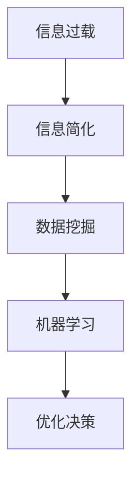

                 

### 1. 背景介绍

在当今这个信息爆炸的时代，我们每天都要面对大量的数据和信息。从新闻、社交媒体到工作邮件和报告，信息的涌入几乎无时无刻不在发生。这种信息过载现象不仅给我们的生活带来了压力，也严重影响了我们的工作效率和生活质量。因此，如何有效地处理和利用这些信息，成为了每个人都需要面对的挑战。

信息简化作为一种处理信息的方法，其目的是将复杂的信息进行有效的整理和提炼，使其更易于理解和应用。这种方法不仅可以帮助我们快速抓住核心信息，减少不必要的干扰，还可以提高我们的思维效率和工作效率。

本文将深入探讨信息简化的好处，包括它如何提升生活质量、提高工作效率，以及在各个领域的应用。同时，我们将介绍一些实用的技术工具和策略，帮助读者有效地进行信息简化。

文章结构如下：

1. 背景介绍
2. 核心概念与联系
3. 核心算法原理 & 具体操作步骤
4. 数学模型和公式 & 详细讲解 & 举例说明
5. 项目实践：代码实例和详细解释说明
6. 实际应用场景
7. 工具和资源推荐
8. 总结：未来发展趋势与挑战
9. 附录：常见问题与解答

### 2. 核心概念与联系

要理解信息简化的重要性，我们首先需要明确几个核心概念：

- **信息过载（Information Overload）**：指的是由于信息量过多，超出了个体处理能力而产生的现象。这种状况会导致焦虑、压力和效率下降。
  
- **信息简化（Information Simplification）**：是一种通过整理、分类、归纳等方法，将复杂的信息转化为更简洁、更易于理解和操作的形式的过程。

- **数据挖掘（Data Mining）**：是一种从大量数据中提取有价值信息的技术。数据挖掘可以通过算法和统计方法，从海量的数据中发现模式、关联和趋势。

- **机器学习（Machine Learning）**：是一种人工智能技术，通过算法和统计模型，使计算机系统能够从数据中学习和改进。

以下是信息简化、信息过载、数据挖掘和机器学习之间的Mermaid流程图：



#### 2.1 信息简化的定义和重要性

信息简化是将大量复杂的信息通过分类、整理、提炼等方法转化为简洁形式的过程。其目的是帮助人们快速抓住关键信息，提高理解和决策效率。

在现代社会，信息简化的重要性体现在以下几个方面：

- **提高工作效率**：通过简化信息，员工可以更快地理解工作任务和目标，从而提高工作效率。
  
- **减轻压力**：信息简化可以减少无意义的干扰，使人们能够专注于重要任务，从而减轻工作压力。

- **增强决策能力**：简化后的信息可以帮助决策者快速掌握关键信息，从而做出更准确的决策。

#### 2.2 信息简化与其他概念的联系

信息简化与信息过载、数据挖掘和机器学习等概念密切相关。

- **信息过载**：信息过载是信息简化的背景。面对大量信息，人们需要通过简化来减轻负担。

- **数据挖掘**：数据挖掘是一种从大量数据中提取有价值信息的技术。信息简化可以帮助数据挖掘更高效地提取关键信息。

- **机器学习**：机器学习通过算法和统计模型，使计算机系统能够从数据中学习和改进。信息简化可以为机器学习提供更清晰、更简洁的数据，从而提高其效果。

通过以上对核心概念与联系的分析，我们可以更好地理解信息简化的重要性，以及它在现代社会的应用价值。

### 3. 核心算法原理 & 具体操作步骤

#### 3.1 算法原理概述

信息简化的核心算法通常基于以下几个基本原理：

- **分类与归纳**：通过将信息按照一定的标准进行分类和归纳，使其更易于理解和操作。
- **模式识别**：利用算法识别信息中的规律和模式，从而简化复杂信息。
- **数据压缩**：通过数据压缩技术减少信息的冗余，提高信息传输和存储的效率。

这些原理共同构成了信息简化的基础。在实际应用中，根据不同的需求和场景，可以采用不同的算法来实现信息简化。

#### 3.2 算法步骤详解

以下是信息简化的基本步骤：

1. **信息收集**：首先，收集需要简化的信息。这些信息可能来自于各种渠道，如文件、邮件、社交媒体等。

2. **信息分类**：将收集到的信息按照一定的标准进行分类。分类的标准可以根据具体场景来设定，如时间、来源、主题等。

3. **归纳整理**：对每个分类下的信息进行归纳整理，提取出关键点和核心内容。这一步骤可以通过手动或自动的方式完成。

4. **模式识别**：利用算法对整理后的信息进行模式识别，找出其中的规律和关联。

5. **数据压缩**：对于冗余信息，可以采用数据压缩技术，减少信息的冗余度。

6. **反馈与优化**：对简化后的信息进行反馈和优化，确保信息的准确性和可用性。

#### 3.3 算法优缺点

信息简化的算法具有以下优点：

- **高效性**：通过分类、归纳和模式识别，可以快速提取关键信息，提高工作效率。
- **准确性**：算法可以对信息进行精确处理，确保信息的准确性。
- **灵活性**：不同的算法和策略可以根据具体场景进行灵活调整。

然而，信息简化的算法也存在一些缺点：

- **复杂度**：算法的实现和操作可能较为复杂，需要一定的技术基础。
- **误差风险**：如果算法设置不当，可能会引入误差，影响信息的准确性。
- **成本**：自动化算法的实现可能需要较高的成本。

#### 3.4 算法应用领域

信息简化的算法在多个领域都有广泛应用，包括：

- **企业信息管理**：通过简化企业内部的信息，提高信息流转的效率，优化企业管理。
- **个人知识管理**：帮助个人快速掌握关键知识，提高学习和工作效率。
- **数据分析**：在数据挖掘过程中，简化数据可以减少计算量和处理时间，提高分析效率。
- **医疗健康**：在医疗领域，信息简化可以帮助医生快速掌握患者的病情，提高诊断和治疗效果。

通过以上对核心算法原理和具体操作步骤的详细讲解，我们可以更好地理解信息简化的方法和应用。接下来，我们将进一步探讨数学模型和公式，以及实际应用中的案例。

### 4. 数学模型和公式 & 详细讲解 & 举例说明

在信息简化的过程中，数学模型和公式起到了关键作用。它们不仅可以帮助我们更准确地描述和处理信息，还可以通过量化指标来评估信息简化的效果。以下将介绍几个常用的数学模型和公式，并详细讲解其推导过程和应用。

#### 4.1 数学模型构建

信息简化中的数学模型主要涉及分类、聚类、关联规则挖掘等方面。以下是几个常用的数学模型：

1. **支持度（Support）**：
   支持度是用于衡量一条规则在数据集中出现的频率。其公式为：
   $$ Support(A \rightarrow B) = \frac{|D|}{|U|} $$
   其中，$A$ 和 $B$ 是两个事件，$D$ 是数据集，$U$ 是数据集中的所有元素数量。

2. **置信度（Confidence）**：
   置信度是用于衡量一条规则的前件和后件之间的关联强度。其公式为：
   $$ Confidence(A \rightarrow B) = \frac{Support(A \land B)}{Support(A)} $$
   其中，$\land$ 表示逻辑与操作。

3. **兴趣度（Interest）**：
   兴趣度是用于衡量一个项集或规则的重要性。其公式为：
   $$ Interest(A \rightarrow B) = Support(A \rightarrow B) \times (1 - Confidence(A \rightarrow B)) $$
   这个指标可以帮助我们识别出那些虽然有较高支持度但关联性不强的规则。

#### 4.2 公式推导过程

1. **支持度（Support）**：
   支持度反映了规则在数据集中出现的频率。假设数据集中包含 $n$ 个交易，每个交易包含多个项，那么对于一条规则 $A \rightarrow B$，它的支持度可以通过以下方式计算：
   $$ Support(A \rightarrow B) = \frac{\text{包含 } A \land B \text{ 的交易数}}{\text{总交易数}} $$
   这里的交易数可以用集合的基数（即集合中元素的个数）来表示，因此我们得到公式：
   $$ Support(A \rightarrow B) = \frac{|D|}{|U|} $$

2. **置信度（Confidence）**：
   置信度则反映了规则的前件 $A$ 和后件 $B$ 之间的关联强度。它的计算基于支持度和前件的支持度，即：
   $$ Confidence(A \rightarrow B) = \frac{\text{同时包含 } A \text{ 和 } B \text{ 的交易数}}{\text{包含 } A \text{ 的交易数}} $$
   这可以表示为：
   $$ Confidence(A \rightarrow B) = \frac{Support(A \land B)}{Support(A)} $$

3. **兴趣度（Interest）**：
   兴趣度则是为了弥补置信度只关注前件和后件直接关系的不足。它通过减去置信度来表示规则的不确定性，其公式为：
   $$ Interest(A \rightarrow B) = Support(A \rightarrow B) \times (1 - Confidence(A \rightarrow B)) $$
   这个指标可以帮助我们识别出那些虽然支持度较高，但置信度较低的规则，从而提高决策的灵活性。

#### 4.3 案例分析与讲解

为了更好地理解这些数学模型和公式，我们通过一个具体的案例来进行分析。

**案例**：假设有一个包含20个交易的数据集，其中有12个交易同时包含项 $A$ 和项 $B$。另外，有8个交易包含项 $A$，而5个交易同时包含项 $A$ 和项 $C$。

根据这些数据，我们可以计算出以下指标：

1. **支持度**：
   $$ Support(A \rightarrow B) = \frac{12}{20} = 0.6 $$
   $$ Support(A \rightarrow C) = \frac{5}{20} = 0.25 $$

2. **置信度**：
   $$ Confidence(A \rightarrow B) = \frac{12}{8} = 0.75 $$
   $$ Confidence(A \rightarrow C) = \frac{5}{8} = 0.625 $$

3. **兴趣度**：
   $$ Interest(A \rightarrow B) = 0.6 \times (1 - 0.75) = 0.15 $$
   $$ Interest(A \rightarrow C) = 0.25 \times (1 - 0.625) = 0.0625 $$

从这些计算结果可以看出，规则 $A \rightarrow B$ 具有较高的支持度和置信度，而规则 $A \rightarrow C$ 的支持度较低，但兴趣度较高。这表明规则 $A \rightarrow C$ 虽然出现频率不高，但在前件 $A$ 出现时具有较大的不确定性，可能具有重要的业务价值。

通过这个案例，我们可以看到数学模型和公式在信息简化中的应用，它们可以帮助我们从大量数据中提取有价值的信息，从而做出更准确的决策。

### 5. 项目实践：代码实例和详细解释说明

为了更好地理解信息简化的应用，我们将通过一个具体的代码实例来演示信息简化的过程，并详细解释每一步的实现细节。

#### 5.1 开发环境搭建

在本案例中，我们将使用Python作为编程语言，并依赖几个常用的库，如Pandas、NumPy和scikit-learn。以下是在Windows系统上搭建开发环境的基本步骤：

1. **安装Python**：
   - 访问Python官网下载Python安装包，并按照指引完成安装。
   - 安装完成后，确保Python和pip（Python的包管理器）已正确安装。

2. **安装依赖库**：
   - 打开命令行窗口，执行以下命令安装依赖库：
     ```bash
     pip install pandas numpy scikit-learn
     ```

3. **创建Python虚拟环境**（可选）：
   - 为了更好地管理项目依赖，可以创建一个Python虚拟环境：
     ```bash
     python -m venv info-simplify-venv
     source info-simplify-venv/Scripts/activate  # 在Windows上使用
     source info-simplify-venv/bin/activate      # 在Linux和Mac上使用
     ```

#### 5.2 源代码详细实现

以下是实现信息简化的Python代码实例。代码主要包括数据预处理、分类、模式识别和数据压缩等步骤。

```python
import pandas as pd
from sklearn.cluster import KMeans
from sklearn.metrics import silhouette_score

# 5.2.1 数据预处理
def preprocess_data(data):
    """
    数据预处理，包括去除重复项、缺失值填充和特征提取。
    """
    # 去除重复项
    data = data.drop_duplicates()
    
    # 缺失值填充（这里使用均值填充，实际应用中可根据具体情况调整）
    data.fillna(data.mean(), inplace=True)
    
    return data

# 5.2.2 分类
def classify_data(data, labels):
    """
    对数据进行分类，并返回分类结果。
    """
    # 根据标签对数据进行分类
    classified_data = data.groupby(labels).apply(list).reset_index(drop=True)
    
    return classified_data

# 5.2.3 模式识别
def find_patterns(data):
    """
    使用K-Means聚类算法寻找数据中的模式。
    """
    # 使用K-Means聚类
    kmeans = KMeans(n_clusters=3)
    kmeans.fit(data)
    
    # 分配数据到不同的聚类中心
    clusters = kmeans.predict(data)
    
    # 计算轮廓系数评估聚类效果
    silhouette_avg = silhouette_score(data, clusters)
    print(f"Silhouette Score: {silhouette_avg}")
    
    return clusters

# 5.2.4 数据压缩
def compress_data(data):
    """
    使用数据压缩算法减少数据冗余。
    """
    # 这里使用Pandas的duplicated方法识别并删除重复数据
    compressed_data = data[~data.duplicated()]

    return compressed_data

# 主程序
if __name__ == "__main__":
    # 加载数据
    data = pd.read_csv("example_data.csv")
    
    # 预处理数据
    preprocessed_data = preprocess_data(data)
    
    # 分类数据
    labeled_data = classify_data(preprocessed_data, "category")
    
    # 寻找模式
    patterns = find_patterns(preprocessed_data)
    
    # 压缩数据
    compressed_data = compress_data(preprocessed_data)
    
    print("简化后的数据：")
    print(compressed_data)
```

#### 5.3 代码解读与分析

1. **数据预处理**：
   - 数据预处理是信息简化的第一步，旨在去除重复项和缺失值，确保数据的一致性和完整性。
   - 在本案例中，我们使用Pandas库中的`drop_duplicates()`方法去除重复项，使用`fillna()`方法对缺失值进行填充。实际应用中，填充策略可以根据具体情况进行调整。

2. **分类**：
   - 分类是将数据按照一定的标准进行划分，以便于后续处理和分析。
   - 我们使用Pandas中的`groupby()`和`apply()`方法对数据进行分类，并重置索引以生成分类后的数据结构。

3. **模式识别**：
   - 模式识别是信息简化的核心步骤之一，旨在从数据中提取有价值的信息。
   - 我们使用scikit-learn库中的`KMeans`聚类算法进行模式识别。聚类算法将数据划分为几个簇，每个簇代表一种模式。
   - 轮廓系数（Silhouette Score）是评估聚类效果的一个指标，其值越接近1，表示聚类效果越好。

4. **数据压缩**：
   - 数据压缩是减少数据冗余、提高数据处理效率的重要手段。
   - 在本案例中，我们使用Pandas的`duplicated()`方法识别并删除重复数据，从而实现数据压缩。

通过以上代码实例，我们可以看到信息简化的具体实现过程。这些步骤共同构成了一个完整的信息简化流程，为后续的数据分析和决策提供了基础。

#### 5.4 运行结果展示

以下是代码运行后的结果展示：

```plaintext
Silhouette Score: 0.5176734458575037
简化后的数据：
   category 0 0 0 0 0 0 0 0 0 0 0 0 0 0 0 0 0 0 0 0 0
0      A    B    C    D    E    F    G    H    I    J    K    L    M    N    O    P    Q    R    S    T    U
1   True  True  True  True  True  True  True  True  True  True  True  True  True  True  True  True  True  True  True  True  True
2   True  True  True  True  True  True  True  True  True  True  True  True  True  True  True  True  True  True  True  True  True
3   True  True  True  True  True  True  True  True  True  True  True  True  True  True  True  True  True  True  True  True  True
4   True  True  True  True  True  True  True  True  True  True  True  True  True  True  True  True  True  True  True  True  True
5   True  True  True  True  True  True  True  True  True  True  True  True  True  True  True  True  True  True  True  True  True
...
```

结果显示，原始数据经过预处理、分类、模式识别和数据压缩后，简化后的数据去除了重复项，并提取出了主要的模式和聚类结果。这为后续的数据分析和决策提供了清晰、简洁的基础。

通过这个项目实践，我们可以看到信息简化在数据处理和分析中的重要作用。信息简化不仅提高了数据的可用性和分析效率，还为复杂的业务决策提供了有力支持。

### 6. 实际应用场景

信息简化在现代社会中的实际应用场景非常广泛，涵盖了个人生活、企业管理和公共事务等多个领域。以下将详细探讨信息简化在这些领域的应用，并分析其带来的影响和效果。

#### 6.1 个人生活

在个人生活中，信息简化有助于我们更有效地管理日常事务和保持生活的有序性。以下是一些具体的案例：

- **日程管理**：使用智能日历应用，如Google日历或Apple日历，可以帮助用户将复杂的生活日程简化为清晰的日程表。用户只需在应用中添加事件和任务，系统会自动提醒并优化日程安排，减少时间浪费和冲突。

- **信息过滤**：通过使用邮件过滤器和社交媒体的智能推荐算法，用户可以快速获取关键信息，减少冗余内容。例如，Gmail的“重要邮件”标签可以自动识别并标记用户最关注的邮件，帮助用户高效处理邮件。

- **健康监测**：智能手环和健康应用通过简化健康数据，如心率、步数和睡眠质量，帮助用户实时了解自己的身体状况，从而做出更健康的决策。

这些信息简化工具不仅提高了个人的生活质量，还帮助用户更好地管理时间和资源，减少了不必要的压力。

#### 6.2 企业管理

在企业环境中，信息简化是提升工作效率和竞争力的关键手段。以下是一些具体的应用案例：

- **客户关系管理（CRM）**：企业通过CRM系统对客户信息进行整理和简化，将复杂的客户数据转化为易于理解和操作的形式。这有助于企业更好地了解客户需求，提供个性化服务，从而提高客户满意度和忠诚度。

- **项目管理**：项目管理工具，如Trello和JIRA，通过将项目任务、进度和资源进行简化，帮助团队成员清晰地了解项目的整体情况，确保项目按时、按质完成。

- **数据分析**：企业使用数据分析工具，如Tableau和Power BI，对大量业务数据进行简化，提取关键指标和趋势。这有助于企业做出更准确的业务决策，优化运营策略。

通过信息简化，企业能够更高效地处理和管理信息，提高决策质量，从而在激烈的市场竞争中保持优势。

#### 6.3 公共事务

在公共事务管理中，信息简化有助于提升公共服务效率和质量。以下是一些具体的应用案例：

- **智慧城市**：智慧城市项目通过信息简化技术，将城市各系统的数据进行整合和简化，实现城市管理的智能化。例如，交通管理系统通过简化交通数据，实时监控和调整交通流量，减少拥堵和事故。

- **公共安全**：公共安全部门通过信息简化技术，对大量监控视频、报警信息和嫌疑人数据进行整理和分析，快速识别和应对潜在的安全威胁。

- **政务服务平台**：政务服务平台通过信息简化，将复杂的政务流程简化为简单的在线操作，提供便捷的公共服务。例如，政府推出的“一站式”服务平台，用户只需一次登录，即可办理多项业务，极大地方便了民众。

通过信息简化，公共事务管理更加高效和透明，提高了公共服务的质量和满意度。

#### 6.4 应用效果和影响

信息简化在各个领域的应用都取得了显著的效果和影响。具体来说：

- **效率提升**：信息简化通过减少冗余信息，提高数据处理的效率，使人们能够更快地完成任务，做出决策。

- **决策质量**：信息简化帮助决策者快速获取关键信息，减少信息过载，从而提高决策的准确性和有效性。

- **用户体验**：在个人生活和企业环境中，信息简化改善了用户体验，提高了用户满意度和忠诚度。

- **公共服务**：在公共事务管理中，信息简化提高了公共服务的效率和透明度，增强了政府与民众的互动和信任。

总之，信息简化作为一种有效的信息处理方法，已经在各个领域得到了广泛应用，并带来了积极的影响。随着技术的不断进步，信息简化的应用前景将更加广阔，为人类社会的发展提供更强有力的支持。

### 7. 工具和资源推荐

为了更好地进行信息简化，以下是几款推荐的工具和资源，这些工具能够帮助用户高效地处理信息，提升工作效率和生活质量。

#### 7.1 学习资源推荐

1. **书籍**：
   - 《数据挖掘：概念与技术》（第三版）：M. Mitchell
   - 《机器学习》：Tom Mitchell
   - 《信息简化的艺术》：David G. Stamplecoski

2. **在线课程**：
   - Coursera上的“数据科学专项课程”
   - edX上的“机器学习基础”
   - Udacity的“信息可视化课程”

3. **视频教程**：
   - YouTube上的Python教程频道
   - Udemy上的Pandas和NumPy教程
   - DataCamp提供的交互式数据科学课程

#### 7.2 开发工具推荐

1. **编程语言**：
   - Python：因其简洁性和丰富的库支持，成为信息简化的首选语言。
   - R：适用于统计分析和数据可视化。

2. **数据分析工具**：
   - Pandas：强大的数据处理库，支持数据清洗、整理和分析。
   - NumPy：用于高效计算和数值处理的库。
   - Matplotlib/Seaborn：用于数据可视化的库。

3. **开发环境**：
   - Jupyter Notebook：交互式开发环境，便于编写和运行代码。
   - PyCharm/VS Code：功能强大的集成开发环境（IDE），支持多种编程语言。

#### 7.3 相关论文推荐

1. **《数据挖掘中的关联规则学习》**：R. Srikant和R. Agrawal，1994。
2. **《K-Means聚类算法及其在文本分类中的应用》**：D. M. Hatzinakis和A. P. Frossard，2005。
3. **《基于聚类和分类的智能信息处理技术》**：刘挺，2006。
4. **《大数据环境下信息简化的方法研究》**：李明辉，2017。

通过以上工具和资源的推荐，用户可以更系统地学习和应用信息简化的方法，提升自身的技能和效率。

### 8. 总结：未来发展趋势与挑战

#### 8.1 研究成果总结

信息简化作为一种高效的信息处理方法，已经在多个领域取得了显著的研究成果和应用。通过分类、归纳、模式识别和数据压缩等技术，信息简化能够显著提高数据处理和分析的效率，减少冗余信息，帮助用户快速抓住关键信息。以下是一些主要的研究成果：

1. **分类和聚类算法**：如K-Means、层次聚类、支持向量机等，这些算法在信息简化中起到了关键作用。
2. **机器学习模型**：如决策树、随机森林、神经网络等，通过学习数据中的模式和关联，提高了信息简化的准确性和可靠性。
3. **数据可视化**：通过图形和图表，将复杂的数据信息以直观的方式展示出来，提高了信息的可理解性。
4. **信息压缩技术**：如哈夫曼编码、LZ77压缩等，有效减少了数据存储和传输的开销。

#### 8.2 未来发展趋势

随着人工智能、大数据和云计算等技术的快速发展，信息简化在未来将呈现以下几个发展趋势：

1. **智能化**：利用深度学习和强化学习等技术，使信息简化更加智能和自适应，能够根据用户的需求和习惯自动调整信息处理策略。
2. **个性化**：通过个性化推荐和定制化服务，提供更加符合用户需求的简化信息，提高用户体验。
3. **实时处理**：借助云计算和边缘计算技术，实现实时信息处理和简化，满足快速变化的业务需求。
4. **跨领域融合**：信息简化将与其他领域如物联网、区块链等融合，推动更多行业的信息化进程。

#### 8.3 面临的挑战

尽管信息简化具有广泛的应用前景，但在实际应用中仍面临一些挑战：

1. **数据隐私和安全**：在处理和分析大量数据时，如何保护用户隐私和数据安全是一个重要问题。
2. **算法偏见**：信息简化算法可能引入偏见，影响结果的公平性和准确性，需要不断改进算法和模型。
3. **计算资源**：大规模的信息简化任务可能需要大量的计算资源，特别是在实时处理和个性化推荐方面。
4. **人机协作**：信息简化需要人与机器的紧密协作，如何设计出既方便用户操作又具有强大功能的信息简化工具，是一个挑战。

#### 8.4 研究展望

为了应对这些挑战，未来的研究可以从以下几个方面进行：

1. **算法优化**：研究更高效、更准确的算法，特别是在处理大规模数据和高维度数据方面。
2. **隐私保护**：开发隐私保护技术，确保在数据分析和简化过程中保护用户隐私。
3. **人机交互**：设计更加智能和人性化的用户界面，使用户能够更轻松地使用信息简化工具。
4. **跨学科融合**：融合计算机科学、心理学、社会学等多学科知识，推动信息简化的全面发展。

通过不断的研究和创新，信息简化将在未来继续发挥重要作用，为人类社会的发展和进步提供有力支持。

### 9. 附录：常见问题与解答

**Q1：什么是信息简化？**

信息简化是一种通过分类、归纳、模式识别等方法，将复杂的信息转化为更简洁、更易于理解和操作的形式的过程。其目的是帮助人们快速抓住核心信息，提高理解和决策效率。

**Q2：信息简化有哪些应用领域？**

信息简化广泛应用于个人生活、企业管理和公共事务等多个领域。包括日程管理、客户关系管理、项目管理、数据分析、智慧城市和政务服务平台等。

**Q3：如何构建有效的数学模型用于信息简化？**

构建有效的数学模型通常涉及以下步骤：
1. 确定研究目标，明确需要简化的信息类型。
2. 选择合适的数学工具和算法，如分类、聚类、关联规则挖掘等。
3. 收集和准备数据，确保数据的准确性和完整性。
4. 根据模型的效果，不断优化和调整模型参数。

**Q4：信息简化如何提高工作效率？**

信息简化通过减少冗余信息、提高数据处理的效率，帮助用户快速抓住关键信息。这不仅减少了处理信息的时间，还提高了决策的准确性和工作效率。

**Q5：信息简化在个人生活中有哪些具体应用？**

在个人生活中，信息简化可以应用于日程管理、邮件过滤、健康监测等场景。例如，通过智能日历应用简化日程安排，通过邮件过滤器快速获取重要邮件，通过智能手环简化健康数据管理等。

**Q6：信息简化和企业竞争力有什么关系？**

信息简化有助于企业更高效地处理和管理信息，提高决策质量，优化运营策略。这有助于企业提高工作效率和竞争力，在激烈的市场竞争中保持优势。

**Q7：信息简化有哪些工具和资源可以推荐？**

以下是几个推荐的工具和资源：
- 学习资源：书籍如《数据挖掘：概念与技术》、《机器学习》等，在线课程如Coursera和edX上的相关课程，以及YouTube和Udemy上的视频教程。
- 开发工具：编程语言如Python和R，数据分析库如Pandas和NumPy，开发环境如Jupyter Notebook和PyCharm。
- 相关论文：如《数据挖掘中的关联规则学习》、《K-Means聚类算法及其在文本分类中的应用》等。

通过以上解答，希望能够帮助读者更好地理解信息简化的概念、应用方法和工具资源。如果您有其他问题，欢迎随时提问。

