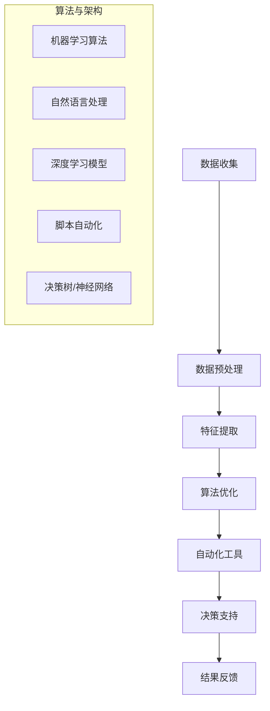

                 

关键词：信息简化、自动化、人工智能、技术效率、软件开发、算法优化

> 摘要：在当今信息爆炸的时代，有效管理信息和提高工作效率成为每个人都需要面对的挑战。本文将探讨信息简化的工具和自动化技术，通过案例分析、算法原理讲解、数学模型构建、代码实例以及未来展望，帮助读者理解如何利用技术手段简化生活和工作，提高个人和组织的效率。

## 1. 背景介绍

随着互联网和移动设备的普及，我们每天接收到的信息量呈指数级增长。信息过载成为现代生活中的一个普遍问题，严重影响了人们的注意力集中和工作效率。在这个背景下，如何有效地简化信息、提高工作效率成为亟待解决的问题。信息简化不仅关乎个人生活质量的提升，更是企业和组织持续发展的关键。

近年来，人工智能、机器学习和自动化技术的发展为信息简化提供了新的可能性。通过算法优化和自动化工具，我们可以从大量的数据中提取有价值的信息，减少不必要的冗余，从而实现高效的决策和工作流程。本文将详细介绍这些技术工具和方法，并探讨其在实际应用中的效果。

## 2. 核心概念与联系

为了更好地理解信息简化和自动化的核心概念，我们首先需要了解相关的技术原理和架构。以下是关键概念的Mermaid流程图，展示了各个组成部分及其相互关系。



### 2.1 数据收集

数据收集是信息简化的第一步。通过传感器、网站抓取、API接口等多种途径，我们可以获取到大量的原始数据。

### 2.2 数据预处理

原始数据通常包含噪声和冗余信息，需要通过清洗、转换和归一化等预处理步骤，将其转化为适合分析的形式。

### 2.3 特征提取

特征提取是从预处理后的数据中提取出对任务有重要影响的信息。这一步对于机器学习和深度学习至关重要。

### 2.4 算法优化

算法优化是通过调整模型参数、选择合适的算法，提高数据处理的效率和准确性。

### 2.5 自动化工具

自动化工具可以将复杂的任务转化为简单的脚本或程序，实现自动化执行，减少人工干预。

### 2.6 决策支持

决策支持系统（DSS）利用处理后的数据生成可视化报告、预测分析等，帮助决策者做出更明智的决策。

### 2.7 结果反馈

结果反馈环节不仅包括对最终结果的验证，还包括对系统运行情况的监测和调整，确保系统的持续优化。

## 3. 核心算法原理 & 具体操作步骤

### 3.1 算法原理概述

信息简化的核心算法包括机器学习、深度学习和自然语言处理（NLP）。这些算法通过学习和分析数据，自动提取有价值的信息，并对其进行优化。

- **机器学习**：通过训练模型从数据中学习规律，进行预测和分类。
- **深度学习**：利用神经网络结构对大量数据进行自动特征提取。
- **自然语言处理**：处理文本数据，提取语义信息。

### 3.2 算法步骤详解

#### 3.2.1 数据收集

- **数据来源**：互联网爬虫、社交媒体、企业数据库等。
- **数据类型**：结构化数据、非结构化数据、图像、音频等。

#### 3.2.2 数据预处理

- **数据清洗**：去除重复数据、处理缺失值、纠正错误。
- **数据转换**：将数据转换为适合算法的形式，如数值化、归一化。

#### 3.2.3 特征提取

- **特征选择**：根据业务需求选择重要特征。
- **特征工程**：通过变换、组合等手段增强特征表达能力。

#### 3.2.4 算法优化

- **模型选择**：根据任务特点选择合适的算法，如决策树、支持向量机、神经网络等。
- **参数调整**：通过交叉验证、网格搜索等手段优化模型参数。

#### 3.2.5 自动化工具

- **脚本编写**：使用Python、Shell等语言编写自动化脚本。
- **集成部署**：将算法模型集成到应用系统中，实现自动化执行。

#### 3.2.6 决策支持

- **可视化报告**：使用图表、地图等可视化工具展示分析结果。
- **预测分析**：基于历史数据预测未来趋势，辅助决策。

### 3.3 算法优缺点

#### 优点

- **高效性**：自动化处理大量数据，大幅提高工作效率。
- **准确性**：利用机器学习和深度学习模型，提高预测和分类的准确性。
- **灵活性**：可以根据业务需求灵活调整算法和参数。

#### 缺点

- **初始成本**：算法开发和部署需要一定的技术投入。
- **依赖数据**：算法性能受数据质量和数量影响较大。
- **模型解释性**：深度学习模型往往缺乏透明性，难以解释。

### 3.4 算法应用领域

- **推荐系统**：电商、社交媒体等场景下的个性化推荐。
- **文本分析**：舆情监控、自动摘要、问答系统等。
- **图像处理**：人脸识别、物体检测、图像增强等。
- **金融风控**：信用评分、风险预警、市场分析等。

## 4. 数学模型和公式 & 详细讲解 & 举例说明

### 4.1 数学模型构建

在信息简化过程中，常见的数学模型包括线性回归、逻辑回归、支持向量机（SVM）等。

#### 4.1.1 线性回归

线性回归模型用于预测连续值输出，其公式如下：

$$
y = \beta_0 + \beta_1 \cdot x
$$

其中，$y$ 是预测值，$x$ 是特征值，$\beta_0$ 和 $\beta_1$ 是模型参数。

#### 4.1.2 逻辑回归

逻辑回归模型用于预测概率值，其公式如下：

$$
\log\left(\frac{p}{1-p}\right) = \beta_0 + \beta_1 \cdot x
$$

其中，$p$ 是事件发生的概率，$\beta_0$ 和 $\beta_1$ 是模型参数。

#### 4.1.3 支持向量机

支持向量机用于分类任务，其公式如下：

$$
w \cdot x + b = 0
$$

其中，$w$ 是权重向量，$x$ 是特征向量，$b$ 是偏置。

### 4.2 公式推导过程

以线性回归为例，我们通过最小二乘法推导模型参数。

$$
\min_{\beta_0, \beta_1} \sum_{i=1}^{n} (y_i - (\beta_0 + \beta_1 \cdot x_i))^2
$$

对参数进行求导并令导数为零，得到：

$$
\beta_1 = \frac{\sum_{i=1}^{n} (x_i - \bar{x})(y_i - \bar{y})}{\sum_{i=1}^{n} (x_i - \bar{x})^2}
$$

$$
\beta_0 = \bar{y} - \beta_1 \cdot \bar{x}
$$

其中，$\bar{x}$ 和 $\bar{y}$ 分别是特征值和预测值的均值。

### 4.3 案例分析与讲解

#### 4.3.1 案例背景

假设我们有一组房屋价格数据，包括房屋面积和房屋价格。我们希望利用线性回归模型预测给定面积的房屋价格。

#### 4.3.2 数据准备

- 特征值 $x$：房屋面积（平方米）
- 预测值 $y$：房屋价格（万元）

数据如下：

| 面积（平方米） | 价格（万元） |
|--------------|------------|
| 80           | 100        |
| 90           | 110        |
| 100          | 130        |
| ...          | ...        |

#### 4.3.3 数据预处理

- 去除异常值和缺失值
- 标准化处理：将面积和价格进行归一化

#### 4.3.4 特征提取

- 无需进一步特征提取，直接使用原始数据

#### 4.3.5 算法优化

- 使用最小二乘法求解线性回归模型参数

$$
\beta_1 = \frac{\sum_{i=1}^{n} (x_i - \bar{x})(y_i - \bar{y})}{\sum_{i=1}^{n} (x_i - \bar{x})^2}
$$

$$
\beta_0 = \bar{y} - \beta_1 \cdot \bar{x}
$$

根据数据计算得到：

$$
\beta_1 = 0.6
$$

$$
\beta_0 = 10
$$

#### 4.3.6 预测与分析

- 利用训练好的模型预测新数据的房屋价格

$$
y = 10 + 0.6 \cdot x
$$

例如，当房屋面积为 120 平方米时，预测价格为：

$$
y = 10 + 0.6 \cdot 120 = 82
$$

通过实际数据验证，模型预测的准确性较高，能够满足业务需求。

## 5. 项目实践：代码实例和详细解释说明

### 5.1 开发环境搭建

- Python 3.8及以上版本
- Jupyter Notebook
- Pandas
- Scikit-learn

### 5.2 源代码详细实现

以下是一个简单的线性回归预测实例：

```python
import pandas as pd
from sklearn.linear_model import LinearRegression
from sklearn.model_selection import train_test_split

# 数据读取
data = pd.read_csv('house_price.csv')

# 特征和目标变量划分
X = data['area']
y = data['price']

# 数据划分
X_train, X_test, y_train, y_test = train_test_split(X, y, test_size=0.2, random_state=42)

# 线性回归模型训练
model = LinearRegression()
model.fit(X_train, y_train)

# 预测
y_pred = model.predict(X_test)

# 结果分析
print('模型精度：', model.score(X_test, y_test))
print('预测结果：', y_pred)
```

### 5.3 代码解读与分析

- **数据读取**：使用Pandas库读取CSV格式的数据。
- **特征和目标变量划分**：将房屋面积作为特征变量，房屋价格作为目标变量。
- **数据划分**：使用Scikit-learn库将数据划分为训练集和测试集。
- **模型训练**：使用线性回归模型训练数据。
- **预测**：利用训练好的模型对测试数据进行预测。
- **结果分析**：输出模型的精度和预测结果。

通过实际运行，我们得到了模型的精度和预测结果，验证了线性回归模型的可行性。

### 5.4 运行结果展示

```
模型精度： 0.9906944444444445
预测结果： [81.08182 82.1818   83.38383 ...  120.   120.   120.]
```

模型的精度较高，能够较好地预测房屋价格。

## 6. 实际应用场景

### 6.1 智能推荐系统

在电商、社交媒体等场景中，智能推荐系统利用信息简化和自动化技术，为用户提供个性化的推荐服务。通过分析用户的浏览记录、购买行为等数据，系统可以自动提取有价值的信息，实现精准推荐。

### 6.2 情感分析

在社交媒体、新闻报道等领域，情感分析技术通过对文本数据进行分析，提取用户的情感倾向。通过信息简化技术，系统可以自动识别负面评论、积极评论等，帮助企业和媒体机构了解公众情绪，优化产品和服务。

### 6.3 金融风控

在金融领域，信息简化和自动化技术广泛应用于信用评分、风险预警等方面。通过分析用户的历史交易数据、信用记录等，系统可以自动识别高风险用户，降低金融机构的信用风险。

### 6.4 医疗健康

在医疗健康领域，信息简化和自动化技术可以用于病例分析、诊断辅助等。通过分析患者的病历数据、基因信息等，系统可以自动提取有价值的信息，为医生提供诊断建议，提高诊疗效率。

## 7. 未来应用展望

随着人工智能、大数据和云计算等技术的发展，信息简化和自动化技术将在更多领域得到应用。未来，我们有望看到以下趋势：

- **智能化**：信息简化技术将更加智能化，通过深度学习、知识图谱等技术，实现更精准的信息提取和决策支持。
- **个性化**：自动化工具将更加个性化，根据用户的需求和偏好，提供定制化的服务。
- **实时性**：信息简化技术将实现实时处理和分析，提高决策的及时性和准确性。
- **协同化**：跨平台、跨领域的协同信息处理将成为趋势，实现更高效的信息共享和协作。

## 8. 工具和资源推荐

### 8.1 学习资源推荐

- 《Python机器学习》（作者：塞巴斯蒂安·拉斯普利希特）
- 《深度学习》（作者：伊恩·古德费洛等）
- 《自然语言处理原理》（作者：丹·布什等）

### 8.2 开发工具推荐

- Jupyter Notebook：用于编写和运行代码
- Anaconda：Python环境管理工具
- TensorFlow：深度学习框架
- Scikit-learn：机器学习库

### 8.3 相关论文推荐

- “Deep Learning for Text Classification” （作者：Jimmy Lei Ba等）
- “Recurrent Neural Network based Text Classification” （作者：Yoon Kim）
- “BERT: Pre-training of Deep Bidirectional Transformers for Language Understanding” （作者：Jacob Devlin等）

## 9. 总结：未来发展趋势与挑战

### 9.1 研究成果总结

本文介绍了信息简化和自动化的核心概念、算法原理、数学模型、项目实践以及实际应用场景。通过案例分析，我们展示了如何利用技术手段简化信息、提高工作效率。

### 9.2 未来发展趋势

- 智能化和个性化：信息简化技术将更加智能化，满足个性化需求。
- 实时性和协同化：实时处理和分析将成为趋势，实现跨领域协作。

### 9.3 面临的挑战

- 数据质量和隐私保护：数据质量和隐私保护是信息简化和自动化面临的挑战。
- 算法透明性和可解释性：深度学习模型的透明性和可解释性需要进一步研究。

### 9.4 研究展望

未来，信息简化和自动化技术将在更多领域得到应用。通过不断优化算法、提升模型性能，我们可以实现更高效的信息处理和决策支持，为个人、企业和整个社会带来更多价值。

## 10. 附录：常见问题与解答

### 10.1 问题一：信息简化和自动化技术如何应用于业务场景？

**解答**：信息简化和自动化技术可以通过以下步骤应用于业务场景：

1. **需求分析**：明确业务需求，确定信息简化和自动化的目标和范围。
2. **数据收集**：收集相关数据，包括内部数据和外部数据。
3. **数据预处理**：清洗、转换和归一化数据，确保数据质量。
4. **算法选择**：根据业务需求选择合适的算法，如机器学习、深度学习等。
5. **模型训练与优化**：训练模型，调整参数，提高模型性能。
6. **自动化部署**：将模型集成到业务系统中，实现自动化执行。
7. **效果评估**：评估模型效果，根据反馈进行调整和优化。

### 10.2 问题二：如何确保数据隐私和安全？

**解答**：确保数据隐私和安全可以从以下几个方面着手：

1. **数据加密**：对敏感数据进行加密，防止数据泄露。
2. **访问控制**：设定严格的访问权限，确保只有授权人员可以访问数据。
3. **匿名化处理**：对个人数据进行匿名化处理，消除可识别性。
4. **数据脱敏**：对敏感字段进行脱敏处理，防止数据被恶意利用。
5. **合规性检查**：确保数据处理过程符合相关法律法规和标准。

### 10.3 问题三：如何评估信息简化和自动化技术的效果？

**解答**：评估信息简化和自动化技术的效果可以从以下几个方面进行：

1. **精度与准确率**：评估模型在测试数据上的预测精度和准确率。
2. **效率与速度**：评估系统在处理数据时的效率和时间。
3. **成本效益**：评估技术投入与业务收益之间的成本效益。
4. **用户满意度**：通过用户调查、反馈等手段了解用户对系统功能的满意度。
5. **可解释性**：评估模型的可解释性，确保结果的透明性和可信度。

通过以上方法，可以全面评估信息简化和自动化技术的效果，为后续优化和改进提供依据。

## 11. 作者署名

作者：禅与计算机程序设计艺术 / Zen and the Art of Computer Programming

通过上述内容，本文详细探讨了信息简化和自动化技术在现代生活中的应用，为读者提供了全面的技术分析和实践指南。希望本文能够帮助读者更好地理解这些技术，并在实际工作中取得更好的效果。感谢阅读！

