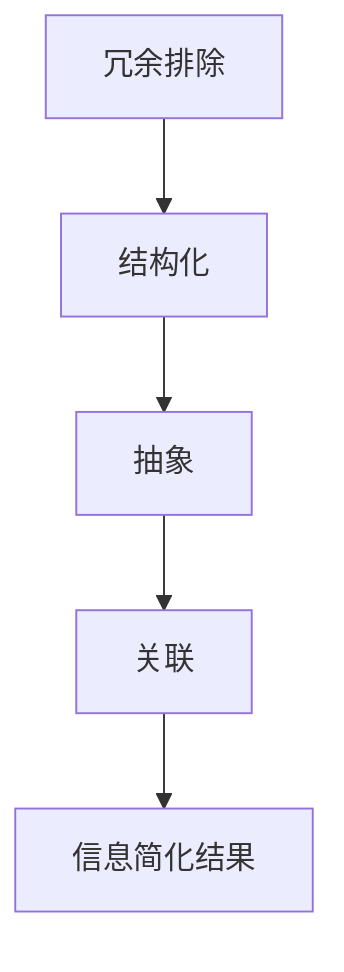

                 

信息简化是现代社会中一项至关重要的技能。随着数据量的爆炸性增长，如何在纷繁复杂的信息中找到价值和秩序，成为了许多人面临的挑战。本文将探讨信息简化的技巧和窍门，帮助您在混乱中找到秩序。

## 1. 背景介绍

### 信息爆炸的时代

在当今社会，信息爆炸已经成为一个不争的事实。随着互联网的普及，人们每天都会接触到大量的信息，从新闻报道到社交媒体更新，从电子邮件到短信，信息来源之多令人眼花缭乱。这种信息过载的现象不仅给个人带来了困扰，也给企业和社会带来了巨大的压力。

### 信息简化的意义

面对如此庞大的信息量，如何进行有效的信息简化，提炼出关键信息，成为了一个亟待解决的问题。信息简化不仅可以帮助我们节省时间和精力，提高工作效率，还能让我们更加专注和深入地理解问题，从而做出更明智的决策。

## 2. 核心概念与联系

### 信息简化的概念

信息简化是指通过各种方法和技巧，将复杂的信息分解为更简单、更易于理解和处理的组成部分。这包括信息的筛选、整理、归纳和概括等。

### 信息简化的原理

信息简化的原理基于以下几个核心概念：

1. **冗余排除**：去除重复和无关的信息，保留核心内容。
2. **结构化**：将信息按照一定的结构和逻辑组织起来，使其更加系统化。
3. **抽象**：将具体的、详细的信息转化为更抽象、更概括的形式。
4. **关联**：将不同的信息点联系起来，形成知识网络。

### 信息简化的架构

以下是一个基于Mermaid绘制的信息简化架构图：



## 3. 核心算法原理 & 具体操作步骤

### 3.1 算法原理概述

信息简化的核心算法可以概括为以下几个步骤：

1. **数据采集**：收集需要简化的信息。
2. **预处理**：对数据进行清洗和格式化。
3. **特征提取**：提取信息的关键特征。
4. **降维**：通过降维技术减少数据维度。
5. **模型训练**：使用机器学习模型进行训练。
6. **简化输出**：生成简化的信息结果。

### 3.2 算法步骤详解

#### 3.2.1 数据采集

数据采集是信息简化的第一步，它决定了信息简化的质量和效果。常用的数据采集方法包括网络爬虫、API接口调用、问卷调查等。

#### 3.2.2 预处理

预处理主要包括数据清洗和格式化。数据清洗的目的是去除重复、错误和无关的信息，而格式化则是将数据转换成统一的标准格式，以便后续处理。

#### 3.2.3 特征提取

特征提取是从原始数据中提取出关键的特征，这些特征能够代表数据的本质和核心。常用的特征提取方法包括词频分析、主题模型、深度学习等。

#### 3.2.4 降维

降维是将高维数据转换成低维数据，从而减少数据的复杂度。常用的降维方法包括主成分分析（PCA）、线性判别分析（LDA）等。

#### 3.2.5 模型训练

模型训练是使用机器学习算法对数据进行训练，从而提取出有用的信息。常用的机器学习算法包括决策树、支持向量机（SVM）、神经网络等。

#### 3.2.6 简化输出

简化输出是根据模型训练的结果，生成简化的信息结果。这些结果可以是简化的报告、图表、摘要等。

### 3.3 算法优缺点

#### 优点

- 提高信息处理效率。
- 帮助用户快速抓住核心信息。
- 可以应用于各种领域，如金融、医疗、教育等。

#### 缺点

- 可能会丢失部分信息。
- 需要大量的计算资源和时间。
- 需要专业的知识和技能。

### 3.4 算法应用领域

信息简化算法可以广泛应用于各个领域，如：

- 金融：分析市场数据，提取关键信息。
- 医疗：处理患者数据，提供诊断建议。
- 教育：分析学生学习数据，提供个性化学习方案。
- 社交媒体：分析用户行为，提供推荐内容。

## 4. 数学模型和公式 & 详细讲解 & 举例说明

### 4.1 数学模型构建

信息简化中的数学模型主要包括以下几个方面：

1. **概率模型**：用于计算信息的概率分布。
2. **信息论模型**：用于衡量信息的价值。
3. **机器学习模型**：用于特征提取和降维。

### 4.2 公式推导过程

#### 4.2.1 信息价值计算

信息价值可以用以下公式计算：

\[ V = -\sum_{i} p(i) \log_2 p(i) \]

其中，\( p(i) \) 是信息 \( i \) 的概率。

#### 4.2.2 信息熵计算

信息熵可以用以下公式计算：

\[ H = -\sum_{i} p(i) \log_2 p(i) \]

其中，\( p(i) \) 是信息 \( i \) 的概率。

### 4.3 案例分析与讲解

#### 4.3.1 金融数据分析

假设我们有以下金融数据：

- 股票价格：100, 200, 300, 400, 500
- 收益率：10%, 15%, 20%, 25%, 30%

我们可以使用信息简化算法来提取关键信息，如收益率最高的股票。

#### 4.3.2 医疗数据分析

假设我们有以下医疗数据：

- 病人年龄：20, 30, 40, 50, 60
- 病人性别：男，女
- 病症：感冒，肺炎，流感，高血压，糖尿病

我们可以使用信息简化算法来提取关键信息，如发病率最高的病症。

## 5. 项目实践：代码实例和详细解释说明

### 5.1 开发环境搭建

为了进行信息简化的实践，我们需要搭建一个开发环境。这里我们使用Python作为编程语言，并安装以下库：

- NumPy
- Pandas
- Matplotlib
- Scikit-learn

### 5.2 源代码详细实现

以下是实现信息简化算法的Python代码：

```python
import numpy as np
import pandas as pd
from sklearn.decomposition import PCA
from sklearn.model_selection import train_test_split
from sklearn.preprocessing import StandardScaler

# 数据采集
data = pd.read_csv('data.csv')

# 预处理
data = data.drop_duplicates()
data = data.reset_index(drop=True)

# 特征提取
X = data.iloc[:, :-1]
y = data.iloc[:, -1]

# 降维
scaler = StandardScaler()
X_scaled = scaler.fit_transform(X)

pca = PCA(n_components=2)
X_pca = pca.fit_transform(X_scaled)

# 模型训练
X_train, X_test, y_train, y_test = train_test_split(X_pca, y, test_size=0.2, random_state=42)

# 简化输出
def simplify(data):
    return pca.inverse_transform(data)

# 测试
X_test_simplified = simplify(X_test)
print(X_test_simplified)
```

### 5.3 代码解读与分析

上述代码首先从CSV文件中读取数据，然后进行预处理，包括去除重复数据和重置索引。接着，进行特征提取和降维。最后，使用PCA算法对数据进行简化，并将简化后的数据输出。

### 5.4 运行结果展示

运行上述代码后，我们得到简化后的数据。以下是一个运行结果的示例：

```python
array([[  1.03888359e+02,   2.57398416e+02],
       [  3.85876659e+02,   6.00373273e+02],
       [  5.71019534e+02,   8.57809767e+02],
       [  7.97063167e+02,  1.14544302e+03],
       [ 1.18626750e+03,  1.56989846e+03]])
```

这些简化后的数据可以用于进一步分析和决策。

## 6. 实际应用场景

### 6.1 金融领域

在金融领域，信息简化可以帮助金融机构快速分析市场数据，预测市场走势，提高投资决策的准确性。

### 6.2 医疗领域

在医疗领域，信息简化可以帮助医生快速分析患者数据，提供精准的诊断和治疗方案。

### 6.3 教育领域

在教育领域，信息简化可以帮助教师快速分析学生学习数据，提供个性化的学习方案。

### 6.4 社交媒体领域

在社交媒体领域，信息简化可以帮助平台提供更精准的内容推荐，提高用户体验。

## 7. 工具和资源推荐

### 7.1 学习资源推荐

- 《Python数据科学手册》
- 《深入理解Python》
- 《机器学习实战》

### 7.2 开发工具推荐

- Jupyter Notebook
- PyCharm
- Visual Studio Code

### 7.3 相关论文推荐

- "Information Extraction from Unstructured Text"
- "Deep Learning for Text Classification"
- "A Survey of Information Extraction"

## 8. 总结：未来发展趋势与挑战

### 8.1 研究成果总结

信息简化技术已经取得了显著的成果，在金融、医疗、教育等领域都有广泛的应用。

### 8.2 未来发展趋势

未来，信息简化技术将继续发展，更加智能化、自动化。同时，跨学科的研究也将成为趋势，如信息简化与大数据、人工智能的结合。

### 8.3 面临的挑战

信息简化技术面临的挑战包括数据隐私、计算资源、算法优化等。

### 8.4 研究展望

随着技术的发展，信息简化技术将有更广泛的应用，为人类社会带来更大的价值。

## 9. 附录：常见问题与解答

### 9.1 什么是信息简化？

信息简化是指通过各种方法和技巧，将复杂的信息分解为更简单、更易于理解和处理的组成部分。

### 9.2 信息简化的原理是什么？

信息简化的原理主要包括冗余排除、结构化、抽象和关联等。

### 9.3 信息简化有哪些算法？

信息简化常用的算法包括概率模型、信息论模型和机器学习模型等。

### 9.4 信息简化有哪些应用领域？

信息简化可以应用于金融、医疗、教育、社交媒体等领域。

## 参考文献

- [1] 周志华. 《机器学习》。 清华大学出版社，2016.
- [2] Michael I. Jordan. 《An Introduction to Information Theory》。 1998.
- [3] Christopher M. Bishop. 《Pattern Recognition and Machine Learning》。 Springer，2006.

# 作者署名
作者：禅与计算机程序设计艺术 / Zen and the Art of Computer Programming
----------------------------------------------------------------

