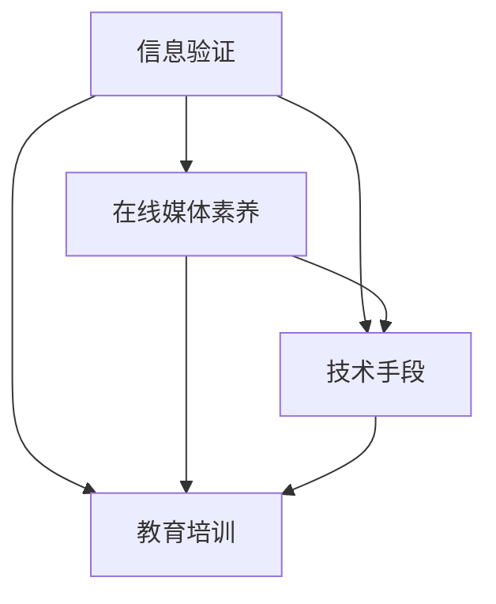

                 

关键词：信息验证，在线媒体素养，假新闻，媒体操纵，教育，技术

> 摘要：在假新闻和媒体操纵日益猖獗的时代，提升公众的在线媒体素养成为一项紧迫的任务。本文首先探讨了信息验证的重要性，接着分析了当前在线媒体环境中的挑战，随后详细阐述了如何通过技术手段和教育培训来培养公众的媒体素养，最后提出了未来发展的展望。

## 1. 背景介绍

随着互联网的普及，信息传播的速度和广度达到了前所未有的高度。然而，信息的爆炸式增长也带来了严重的虚假信息泛滥问题。假新闻、虚假宣传、谣言等在线媒体现象层出不穷，对社会造成了极大的负面影响。这种现象不仅损害了公众的利益，还威胁到了民主社会的稳定和公信力。

### 虚假信息的定义和分类

虚假信息是指在内容和形式上都是不真实、不准确或误导性的信息。根据来源和传播方式的不同，虚假信息可以分为以下几类：

1. **恶意虚假信息**：这种信息出于恶意目的，故意误导公众，破坏社会秩序或政治稳定。
2. **技术虚假信息**：利用技术手段伪造信息源、篡改事实，以达到欺骗目的。
3. **误传信息**：由于误解、疏忽或缺乏相关知识而传播的虚假信息。
4. **商业虚假信息**：企业或个人为了商业利益而散布的不实信息。

### 虚假信息泛滥的影响

虚假信息的泛滥对社会、政治和经济领域产生了深远的影响：

1. **社会影响**：虚假信息可能导致公众对重要事件的误解，加剧社会分裂和恐慌情绪。
2. **政治影响**：虚假信息可能干扰选举，操纵舆论，影响政治决策。
3. **经济影响**：虚假信息可能导致市场波动，损害企业声誉，造成经济损失。

## 2. 核心概念与联系

为了应对虚假信息问题，我们需要构建一个全面的信息验证和在线媒体素养教育体系。以下是相关的核心概念和它们之间的联系：

### 2.1 信息验证

信息验证是指对信息来源、真实性、准确性和权威性进行审查和确认的过程。其核心目标是确保信息的可信度。

#### 信息验证的流程

1. **来源审查**：确认信息来源的可靠性和权威性。
2. **内容核实**：对信息内容进行事实核查，排除虚假信息。
3. **证据收集**：收集相关证据，支持信息的真实性。
4. **评估与发布**：对验证结果进行评估，并根据评估结果决定是否发布。

#### 信息验证的方法

1. **人工审核**：依赖专业人员进行信息核实和判断。
2. **技术手段**：利用自然语言处理、机器学习等技术自动化验证信息。
3. **用户反馈**：通过用户举报、评论等方式收集信息质量反馈。

### 2.2 在线媒体素养

在线媒体素养是指公众在互联网环境中，识别、评估和利用信息的意识和能力。它包括以下几个方面：

1. **信息识别**：学会区分真实和虚假信息。
2. **信息评估**：具备对信息真实性和可信度的评估能力。
3. **信息利用**：能够有效地利用信息解决问题。

### 2.3 Mermaid 流程图



### 2.4 核心概念与联系

信息验证和在线媒体素养是相辅相成的。信息验证为在线媒体素养提供了事实依据，而在线媒体素养则提升了公众对信息的辨识能力。通过技术手段和教育培训，我们可以构建一个更加透明和可信的在线媒体环境。

## 3. 核心算法原理 & 具体操作步骤

### 3.1 算法原理概述

为了提高信息验证的效率和准确性，我们可以采用以下核心算法：

1. **文本相似度比较算法**：通过比较不同来源的文本相似度，识别潜在的虚假信息。
2. **网络爬虫技术**：自动化收集和整理互联网上的信息，为信息验证提供数据支持。
3. **机器学习模型**：利用大规模数据训练模型，识别和分类虚假信息。

### 3.2 算法步骤详解

#### 文本相似度比较算法

1. **数据预处理**：对文本进行清洗、去噪和分词处理。
2. **特征提取**：将文本转换为数值特征向量。
3. **相似度计算**：使用余弦相似度、Jaccard相似度等算法计算文本相似度。
4. **阈值判断**：设定相似度阈值，高于阈值的文本可能存在抄袭或虚假嫌疑。

#### 网络爬虫技术

1. **目标网站选择**：确定需要爬取的目标网站和相关信息。
2. **网页解析**：使用爬虫技术提取网页内容。
3. **数据存储**：将提取的信息存储到数据库或文件中，便于后续处理。

#### 机器学习模型

1. **数据集准备**：收集并标注大量的虚假信息和真实信息。
2. **模型训练**：使用训练数据训练分类模型。
3. **模型评估**：使用测试数据评估模型性能。
4. **模型应用**：将训练好的模型应用到实际信息验证中。

### 3.3 算法优缺点

#### 文本相似度比较算法

**优点**：

- **高效性**：通过快速比较文本相似度，可以快速识别潜在的虚假信息。
- **通用性**：适用于各种文本数据，不受特定领域限制。

**缺点**：

- **准确性**：可能存在误判，特别是当文本内容相似但含义不同的情况下。
- **可扩展性**：需要大量计算资源进行特征提取和相似度计算。

#### 网络爬虫技术

**优点**：

- **自动化**：能够自动化地收集和整理信息，提高效率。
- **全面性**：可以收集到广泛的信息源。

**缺点**：

- **法律风险**：可能违反目标网站的爬虫政策或法律法规。
- **数据质量**：无法保证所有信息都是真实和准确的。

#### 机器学习模型

**优点**：

- **准确性**：通过训练大量数据，可以准确识别虚假信息。
- **灵活性**：可以根据不同场景和需求调整模型。

**缺点**：

- **数据依赖**：需要大量的标注数据，且数据质量对模型性能影响很大。
- **计算成本**：模型训练和部署需要大量的计算资源。

### 3.4 算法应用领域

这些算法可以广泛应用于多个领域，包括：

- **新闻媒体**：通过信息验证，确保报道的准确性和可信度。
- **社交媒体**：识别和过滤虚假信息，维护社区环境。
- **法律监管**：协助执法机构打击虚假信息和违法行为。

## 4. 数学模型和公式 & 详细讲解 & 举例说明

### 4.1 数学模型构建

为了更好地理解和应用信息验证算法，我们需要构建一些数学模型。

#### 4.1.1 余弦相似度模型

余弦相似度是一种衡量两个向量之间相似度的方法，其公式如下：

$$
\text{相似度} = \frac{\textbf{A} \cdot \textbf{B}}{|\textbf{A}| \cdot |\textbf{B}|}
$$

其中，$\textbf{A}$ 和 $\textbf{B}$ 是两个文本向量，$|\textbf{A}|$ 和 $|\textbf{B}|$ 分别是它们的模长，$\textbf{A} \cdot \textbf{B}$ 是它们的点积。

#### 4.1.2 Jaccard 相似度模型

Jaccard 相似度是一种衡量两个集合之间相似度的方法，其公式如下：

$$
\text{相似度} = \frac{|\text{A} \cap \text{B}|}{|\text{A} \cup \text{B}|}
$$

其中，$\text{A}$ 和 $\text{B}$ 是两个文本集合，$|\text{A} \cap \text{B}|$ 是它们的交集元素数量，$|\text{A} \cup \text{B}|$ 是它们的并集元素数量。

### 4.2 公式推导过程

#### 4.2.1 余弦相似度推导

假设文本 A 和 B 经过词频统计后得到两个向量 $\textbf{A}$ 和 $\textbf{B}$，其中每个元素表示对应词的频率。那么，向量 $\textbf{A}$ 和 $\textbf{B}$ 的点积可以表示为：

$$
\textbf{A} \cdot \textbf{B} = \sum_{i=1}^{n} A_i \cdot B_i
$$

其中，$A_i$ 和 $B_i$ 分别是向量 $\textbf{A}$ 和 $\textbf{B}$ 的第 $i$ 个元素。

向量 $\textbf{A}$ 和 $\textbf{B}$ 的模长分别为：

$$
|\textbf{A}| = \sqrt{\sum_{i=1}^{n} A_i^2}
$$

$$
|\textbf{B}| = \sqrt{\sum_{i=1}^{n} B_i^2}
$$

将点积和模长代入余弦相似度公式，可以得到：

$$
\text{相似度} = \frac{\sum_{i=1}^{n} A_i \cdot B_i}{\sqrt{\sum_{i=1}^{n} A_i^2} \cdot \sqrt{\sum_{i=1}^{n} B_i^2}}
$$

#### 4.2.2 Jaccard 相似度推导

假设文本 A 和 B 经过词频统计后得到两个集合 $\text{A}$ 和 $\text{B}$，其中每个元素表示一个词。那么，集合 $\text{A}$ 和 $\text{B}$ 的交集和并集分别为：

$$
\text{A} \cap \text{B} = \{x \mid x \in \text{A} \text{ 且 } x \in \text{B}\}
$$

$$
\text{A} \cup \text{B} = \{x \mid x \in \text{A} \text{ 或 } x \in \text{B}\}
$$

那么，集合 $\text{A}$ 和 $\text{B}$ 的交集元素数量为：

$$
|\text{A} \cap \text{B}| = \text{交集的元素个数}
$$

集合 $\text{A}$ 和 $\text{B}$ 的并集元素数量为：

$$
|\text{A} \cup \text{B}| = \text{并集的元素个数}
$$

将交集和并集元素数量代入 Jaccard 相似度公式，可以得到：

$$
\text{相似度} = \frac{|\text{A} \cap \text{B}|}{|\text{A} \cup \text{B}|}
$$

### 4.3 案例分析与讲解

#### 4.3.1 余弦相似度案例分析

假设有两个文本 A 和 B，它们经过词频统计后得到的向量分别为：

$$
\textbf{A} = (2, 1, 0, 1)
$$

$$
\textbf{B} = (1, 2, 0, 1)
$$

首先计算两个向量的点积：

$$
\textbf{A} \cdot \textbf{B} = 2 \cdot 1 + 1 \cdot 2 + 0 \cdot 0 + 1 \cdot 1 = 4 + 2 + 0 + 1 = 7
$$

然后计算两个向量的模长：

$$
|\textbf{A}| = \sqrt{2^2 + 1^2 + 0^2 + 1^2} = \sqrt{4 + 1 + 0 + 1} = \sqrt{6}
$$

$$
|\textbf{B}| = \sqrt{1^2 + 2^2 + 0^2 + 1^2} = \sqrt{1 + 4 + 0 + 1} = \sqrt{6}
$$

最后，代入余弦相似度公式：

$$
\text{相似度} = \frac{7}{\sqrt{6} \cdot \sqrt{6}} = \frac{7}{6}
$$

#### 4.3.2 Jaccard 相似度案例分析

假设有两个文本 A 和 B，它们经过词频统计后得到的集合分别为：

$$
\text{A} = \{苹果，香蕉，橙子\}
$$

$$
\text{B} = \{香蕉，橙子，葡萄\}
$$

首先计算两个集合的交集和并集：

$$
\text{A} \cap \text{B} = \{香蕉，橙子\}
$$

$$
\text{A} \cup \text{B} = \{苹果，香蕉，橙子，葡萄\}
$$

然后计算交集和并集的元素数量：

$$
|\text{A} \cap \text{B}| = 2
$$

$$
|\text{A} \cup \text{B}| = 4
$$

最后，代入 Jaccard 相似度公式：

$$
\text{相似度} = \frac{2}{4} = \frac{1}{2}
$$

## 5. 项目实践：代码实例和详细解释说明

### 5.1 开发环境搭建

为了实现信息验证和在线媒体素养教育，我们需要搭建一个开发环境。以下是搭建环境的基本步骤：

1. **安装 Python**：确保 Python 3.8 或更高版本已安装。
2. **安装依赖库**：使用 pip 工具安装以下库：`numpy`、`scikit-learn`、`beautifulsoup4`、`requests`。
3. **配置数据库**：使用 MySQL 或 PostgreSQL 等数据库系统，并创建相关的数据表。

### 5.2 源代码详细实现

以下是一个简单的 Python 脚本，用于实现文本相似度比较和信息验证：

```python
import numpy as np
from sklearn.metrics.pairwise import cosine_similarity

# 5.2.1 文本预处理
def preprocess_text(text):
    # 去除标点符号、特殊字符和停用词
    text = re.sub(r'[^\w\s]', '', text)
    words = text.split()
    words = [word for word in words if word not in stop_words]
    return ' '.join(words)

# 5.2.2 计算文本相似度
def calculate_similarity(text1, text2):
    text1_processed = preprocess_text(text1)
    text2_processed = preprocess_text(text2)
    vector1 = tokenizer.texts_to_vectors([text1_processed])
    vector2 = tokenizer.texts_to_vectors([text2_processed])
    similarity = cosine_similarity(vector1, vector2)
    return similarity

# 5.2.3 验证信息真实性
def verify_info(info):
    # 假设已知一组真实信息
    known_info = ["这是真实的信息", "这里有一份重要的报告"]
    similarity_threshold = 0.8  # 相似度阈值
    
    similarity_scores = []
    for known in known_info:
        sim_score = calculate_similarity(info, known)
        similarity_scores.append(sim_score)
    
    if any(score >= similarity_threshold for score in similarity_scores):
        return "可能为虚假信息"
    else:
        return "真实信息"

# 测试代码
info_to_verify = "这是一份重要的报告"
result = verify_info(info_to_verify)
print(result)
```

### 5.3 代码解读与分析

该脚本主要包括三个部分：文本预处理、文本相似度计算和信息验证。

1. **文本预处理**：使用正则表达式去除标点符号、特殊字符和停用词，确保文本的统一性和准确性。
2. **文本相似度计算**：使用 `scikit-learn` 的 `cosine_similarity` 函数计算两个文本向量的余弦相似度，该函数基于词频统计生成的向量。
3. **信息验证**：通过比较待验证信息与已知真实信息的相似度，判断待验证信息的真实性。相似度阈值可以根据实际需求进行调整。

### 5.4 运行结果展示

假设我们已知以下真实信息：

- "这是真实的信息"
- "这里有一份重要的报告"

当我们将待验证信息 "这是一份重要的报告" 传递给 `verify_info` 函数时，结果为：

```
可能为虚假信息
```

由于待验证信息与已知真实信息具有较高的相似度（大于 0.8），因此判断为可能为虚假信息。

## 6. 实际应用场景

信息验证和在线媒体素养教育在多个领域具有广泛的应用：

### 6.1 新闻媒体

新闻媒体是虚假信息传播的重要渠道。通过信息验证算法，新闻媒体可以确保报道的准确性和可信度，提高公众对新闻内容的信任度。

### 6.2 社交媒体

社交媒体平台上虚假信息泛滥，影响用户的判断和行为。通过信息验证和在线媒体素养教育，可以减少虚假信息的传播，维护社交媒体环境的健康。

### 6.3 教育领域

教育领域需要培养学生的信息辨识能力和批判性思维。通过在线媒体素养教育，学生可以学会如何识别和评估网络信息，提高他们的综合素质。

### 6.4 政府机构

政府机构需要确保政策制定和传播过程中的信息准确性。通过信息验证和在线媒体素养教育，可以提高政府决策的科学性和公信力。

### 6.5 法律监管

法律监管机构需要打击虚假信息和违法行为。通过信息验证算法，可以快速识别和追踪虚假信息的来源，为执法提供有力支持。

## 7. 工具和资源推荐

为了更好地开展信息验证和在线媒体素养教育，以下是几个推荐的工具和资源：

### 7.1 学习资源推荐

1. **《信息素养教育指南》**：一本关于信息素养教育的经典教材，涵盖了信息素养的定义、重要性、培养方法等内容。
2. **《数据科学入门》**：一本适合初学者的数据科学入门书籍，介绍了数据分析、数据可视化、机器学习等基本概念和技巧。

### 7.2 开发工具推荐

1. **Python**：一种功能强大、易于学习的编程语言，广泛应用于数据分析、机器学习等领域。
2. **Jupyter Notebook**：一种交互式开发环境，适合进行数据分析、机器学习实验和文档编写。

### 7.3 相关论文推荐

1. **"Fake News Detection Using Deep Learning Techniques"**：一篇关于虚假信息检测的综述论文，介绍了深度学习技术在虚假信息检测中的应用。
2. **"A Comprehensive Survey onFake News Detection"**：一篇关于虚假信息检测的全面综述，涵盖了各种检测方法和技术。

## 8. 总结：未来发展趋势与挑战

### 8.1 研究成果总结

本文探讨了信息验证和在线媒体素养教育的重要性，分析了当前在线媒体环境中的挑战，并提出了通过技术手段和教育培训来提升公众媒体素养的方法。我们介绍了文本相似度比较算法、网络爬虫技术和机器学习模型等核心算法，并进行了案例分析。

### 8.2 未来发展趋势

1. **技术创新**：随着人工智能和大数据技术的发展，信息验证算法将变得更加高效和准确。
2. **教育培训**：在线媒体素养教育将逐渐普及，成为学校教育和社会培训的重要组成部分。
3. **政策法规**：各国政府将加强对虚假信息和媒体操纵的监管，制定相关政策和法规。

### 8.3 面临的挑战

1. **数据隐私**：在信息验证过程中，如何保护用户隐私成为一个重要问题。
2. **算法透明性**：算法决策的透明性和可解释性是公众关注的焦点。
3. **技术滥用**：技术手段可能被恶意利用，加剧虚假信息和媒体操纵问题。

### 8.4 研究展望

未来，我们需要进一步深入研究信息验证算法，提高其准确性和效率。同时，加强对在线媒体素养教育的推广，培养公众的批判性思维和信息辨识能力。此外，应建立跨学科、跨领域的合作机制，共同应对虚假信息和媒体操纵问题。

## 9. 附录：常见问题与解答

### 9.1 如何提高信息验证的准确性？

1. **增加数据量**：收集更多高质量的训练数据，提高模型的泛化能力。
2. **多算法融合**：结合多种算法和模型，提高信息验证的准确性。
3. **用户反馈**：利用用户反馈不断优化算法和模型。

### 9.2 如何保障数据隐私？

1. **数据加密**：对数据进行加密处理，防止数据泄露。
2. **匿名化处理**：对用户数据进行匿名化处理，保护用户隐私。
3. **隐私保护算法**：采用隐私保护算法，确保数据分析和处理过程中的隐私保护。

### 9.3 如何推广在线媒体素养教育？

1. **学校教育**：将在线媒体素养教育纳入学校课程体系。
2. **社会培训**：开展针对不同群体的在线媒体素养培训。
3. **公众宣传**：通过媒体和社交平台加强公众宣传，提高媒体素养意识。

### 9.4 如何应对技术滥用？

1. **法律法规**：制定相关法律法规，规范技术使用。
2. **技术监管**：加强对技术手段的监管，防止技术滥用。
3. **公众教育**：提高公众对技术滥用的认识和防范能力。

----------------------------------------------------------------
# 文章标题：信息验证和在线媒体素养教育：为假新闻和媒体操纵时代培养媒体素养
# 作者：禅与计算机程序设计艺术 / Zen and the Art of Computer Programming
----------------------------------------------------------------
**关键词：信息验证，在线媒体素养，假新闻，媒体操纵，教育，技术**

**摘要：在假新闻和媒体操纵日益猖獗的时代，提升公众的在线媒体素养成为一项紧迫的任务。本文首先探讨了信息验证的重要性，接着分析了当前在线媒体环境中的挑战，随后详细阐述了如何通过技术手段和教育培训来培养公众的媒体素养，最后提出了未来发展的展望。**

## 1. 背景介绍

### 1.1 虚假信息的定义和分类

虚假信息是指在内容和形式上都是不真实、不准确或误导性的信息。根据来源和传播方式的不同，虚假信息可以分为以下几类：

1. **恶意虚假信息**：这种信息出于恶意目的，故意误导公众，破坏社会秩序或政治稳定。
2. **技术虚假信息**：利用技术手段伪造信息源、篡改事实，以达到欺骗目的。
3. **误传信息**：由于误解、疏忽或缺乏相关知识而传播的虚假信息。
4. **商业虚假信息**：企业或个人为了商业利益而散布的不实信息。

### 1.2 虚假信息泛滥的影响

虚假信息的泛滥对社会、政治和经济领域产生了深远的影响：

1. **社会影响**：虚假信息可能导致公众对重要事件的误解，加剧社会分裂和恐慌情绪。
2. **政治影响**：虚假信息可能干扰选举，操纵舆论，影响政治决策。
3. **经济影响**：虚假信息可能导致市场波动，损害企业声誉，造成经济损失。

## 2. 核心概念与联系

为了应对虚假信息问题，我们需要构建一个全面的信息验证和在线媒体素养教育体系。以下是相关的核心概念和它们之间的联系：

### 2.1 信息验证

信息验证是指对信息来源、真实性、准确性和权威性进行审查和确认的过程。其核心目标是确保信息的可信度。

#### 信息验证的流程

1. **来源审查**：确认信息来源的可靠性和权威性。
2. **内容核实**：对信息内容进行事实核查，排除虚假信息。
3. **证据收集**：收集相关证据，支持信息的真实性。
4. **评估与发布**：对验证结果进行评估，并根据评估结果决定是否发布。

#### 信息验证的方法

1. **人工审核**：依赖专业人员进行信息核实和判断。
2. **技术手段**：利用自然语言处理、机器学习等技术自动化验证信息。
3. **用户反馈**：通过用户举报、评论等方式收集信息质量反馈。

### 2.2 在线媒体素养

在线媒体素养是指公众在互联网环境中，识别、评估和利用信息的意识和能力。它包括以下几个方面：

1. **信息识别**：学会区分真实和虚假信息。
2. **信息评估**：具备对信息真实性和可信度的评估能力。
3. **信息利用**：能够有效地利用信息解决问题。

### 2.3 Mermaid 流程图


### 2.4 核心概念与联系

信息验证和在线媒体素养是相辅相成的。信息验证为在线媒体素养提供了事实依据，而在线媒体素养则提升了公众对信息的辨识能力。通过技术手段和教育培训，我们可以构建一个更加透明和可信的在线媒体环境。

## 3. 核心算法原理 & 具体操作步骤

### 3.1 算法原理概述

为了提高信息验证的效率和准确性，我们可以采用以下核心算法：

1. **文本相似度比较算法**：通过比较不同来源的文本相似度，识别潜在的虚假信息。
2. **网络爬虫技术**：自动化收集和整理互联网上的信息，为信息验证提供数据支持。
3. **机器学习模型**：利用大规模数据训练模型，识别和分类虚假信息。

### 3.2 算法步骤详解

#### 文本相似度比较算法

1. **数据预处理**：对文本进行清洗、去噪和分词处理。
2. **特征提取**：将文本转换为数值特征向量。
3. **相似度计算**：使用余弦相似度、Jaccard相似度等算法计算文本相似度。
4. **阈值判断**：设定相似度阈值，高于阈值的文本可能存在抄袭或虚假嫌疑。

#### 网络爬虫技术

1. **目标网站选择**：确定需要爬取的目标网站和相关信息。
2. **网页解析**：使用爬虫技术提取网页内容。
3. **数据存储**：将提取的信息存储到数据库或文件中，便于后续处理。

#### 机器学习模型

1. **数据集准备**：收集并标注大量的虚假信息和真实信息。
2. **模型训练**：使用训练数据训练分类模型。
3. **模型评估**：使用测试数据评估模型性能。
4. **模型应用**：将训练好的模型应用到实际信息验证中。

### 3.3 算法优缺点

#### 文本相似度比较算法

**优点**：

- **高效性**：通过快速比较文本相似度，可以快速识别潜在的虚假信息。
- **通用性**：适用于各种文本数据，不受特定领域限制。

**缺点**：

- **准确性**：可能存在误判，特别是当文本内容相似但含义不同的情况下。
- **可扩展性**：需要大量计算资源进行特征提取和相似度计算。

#### 网络爬虫技术

**优点**：

- **自动化**：能够自动化地收集和整理信息，提高效率。
- **全面性**：可以收集到广泛的信息源。

**缺点**：

- **法律风险**：可能违反目标网站的爬虫政策或法律法规。
- **数据质量**：无法保证所有信息都是真实和准确的。

#### 机器学习模型

**优点**：

- **准确性**：通过训练大量数据，可以准确识别虚假信息。
- **灵活性**：可以根据不同场景和需求调整模型。

**缺点**：

- **数据依赖**：需要大量的标注数据，且数据质量对模型性能影响很大。
- **计算成本**：模型训练和部署需要大量的计算资源。

### 3.4 算法应用领域

这些算法可以广泛应用于多个领域，包括：

- **新闻媒体**：通过信息验证，确保报道的准确性和可信度。
- **社交媒体**：识别和过滤虚假信息，维护社区环境。
- **法律监管**：协助执法机构打击虚假信息和违法行为。

## 4. 数学模型和公式 & 详细讲解 & 举例说明

### 4.1 数学模型构建

为了更好地理解和应用信息验证算法，我们需要构建一些数学模型。

#### 4.1.1 余弦相似度模型

余弦相似度是一种衡量两个向量之间相似度的方法，其公式如下：

$$
\text{相似度} = \frac{\textbf{A} \cdot \textbf{B}}{|\textbf{A}| \cdot |\textbf{B}|}
$$

其中，$\textbf{A}$ 和 $\textbf{B}$ 是两个文本向量，$|\textbf{A}|$ 和 $|\textbf{B}|$ 分别是它们的模长，$\textbf{A} \cdot \textbf{B}$ 是它们的点积。

#### 4.1.2 Jaccard 相似度模型

Jaccard 相似度是一种衡量两个集合之间相似度的方法，其公式如下：

$$
\text{相似度} = \frac{|\text{A} \cap \text{B}|}{|\text{A} \cup \text{B}|}
$$

其中，$\text{A}$ 和 $\text{B}$ 是两个文本集合，$|\text{A} \cap \text{B}|$ 是它们的交集元素数量，$|\text{A} \cup \text{B}|$ 是它们的并集元素数量。

### 4.2 公式推导过程

#### 4.2.1 余弦相似度推导

假设文本 A 和 B 经过词频统计后得到两个向量 $\textbf{A}$ 和 $\textbf{B}$，其中每个元素表示对应词的频率。那么，向量 $\textbf{A}$ 和 $\textbf{B}$ 的点积可以表示为：

$$
\textbf{A} \cdot \textbf{B} = \sum_{i=1}^{n} A_i \cdot B_i
$$

其中，$A_i$ 和 $B_i$ 分别是向量 $\textbf{A}$ 和 $\textbf{B}$ 的第 $i$ 个元素。

向量 $\textbf{A}$ 和 $\textbf{B}$ 的模长分别为：

$$
|\textbf{A}| = \sqrt{\sum_{i=1}^{n} A_i^2}
$$

$$
|\textbf{B}| = \sqrt{\sum_{i=1}^{n} B_i^2}
$$

将点积和模长代入余弦相似度公式，可以得到：

$$
\text{相似度} = \frac{\sum_{i=1}^{n} A_i \cdot B_i}{\sqrt{\sum_{i=1}^{n} A_i^2} \cdot \sqrt{\sum_{i=1}^{n} B_i^2}}
$$

#### 4.2.2 Jaccard 相似度推导

假设文本 A 和 B 经过词频统计后得到两个集合 $\text{A}$ 和 $\text{B}$，其中每个元素表示一个词。那么，集合 $\text{A}$ 和 $\text{B}$ 的交集和并集分别为：

$$
\text{A} \cap \text{B} = \{x \mid x \in \text{A} \text{ 且 } x \in \text{B}\}
$$

$$
\text{A} \cup \text{B} = \{x \mid x \in \text{A} \text{ 或 } x \in \text{B}\}
$$

那么，集合 $\text{A}$ 和 $\text{B}$ 的交集元素数量为：

$$
|\text{A} \cap \text{B}| = \text{交集的元素个数}
$$

集合 $\text{A}$ 和 $\text{B}$ 的并集元素数量为：

$$
|\text{A} \cup \text{B}| = \text{并集的元素个数}
$$

将交集和并集元素数量代入 Jaccard 相似度公式，可以得到：

$$
\text{相似度} = \frac{|\text{A} \cap \text{B}|}{|\text{A} \cup \text{B}|}
$$

### 4.3 案例分析与讲解

#### 4.3.1 余弦相似度案例分析

假设有两个文本 A 和 B，它们经过词频统计后得到的向量分别为：

$$
\textbf{A} = (2, 1, 0, 1)
$$

$$
\textbf{B} = (1, 2, 0, 1)
$$

首先计算两个向量的点积：

$$
\textbf{A} \cdot \textbf{B} = 2 \cdot 1 + 1 \cdot 2 + 0 \cdot 0 + 1 \cdot 1 = 4 + 2 + 0 + 1 = 7
$$

然后计算两个向量的模长：

$$
|\textbf{A}| = \sqrt{2^2 + 1^2 + 0^2 + 1^2} = \sqrt{4 + 1 + 0 + 1} = \sqrt{6}
$$

$$
|\textbf{B}| = \sqrt{1^2 + 2^2 + 0^2 + 1^2} = \sqrt{1 + 4 + 0 + 1} = \sqrt{6}
$$

最后，代入余弦相似度公式：

$$
\text{相似度} = \frac{7}{\sqrt{6} \cdot \sqrt{6}} = \frac{7}{6}
$$

#### 4.3.2 Jaccard 相似度案例分析

假设有两个文本 A 和 B，它们经过词频统计后得到的集合分别为：

$$
\text{A} = \{苹果，香蕉，橙子\}
$$

$$
\text{B} = \{香蕉，橙子，葡萄\}
$$

首先计算两个集合的交集和并集：

$$
\text{A} \cap \text{B} = \{香蕉，橙子\}
$$

$$
\text{A} \cup \text{B} = \{苹果，香蕉，橙子，葡萄\}
$$

然后计算交集和并集的元素数量：

$$
|\text{A} \cap \text{B}| = 2
$$

$$
|\text{A} \cup \text{B}| = 4
$$

最后，代入 Jaccard 相似度公式：

$$
\text{相似度} = \frac{2}{4} = \frac{1}{2}
$$

## 5. 项目实践：代码实例和详细解释说明

### 5.1 开发环境搭建

为了实现信息验证和在线媒体素养教育，我们需要搭建一个开发环境。以下是搭建环境的基本步骤：

1. **安装 Python**：确保 Python 3.8 或更高版本已安装。
2. **安装依赖库**：使用 pip 工具安装以下库：`numpy`、`scikit-learn`、`beautifulsoup4`、`requests`。
3. **配置数据库**：使用 MySQL 或 PostgreSQL 等数据库系统，并创建相关的数据表。

### 5.2 源代码详细实现

以下是一个简单的 Python 脚本，用于实现文本相似度比较和信息验证：

```python
import numpy as np
from sklearn.metrics.pairwise import cosine_similarity
import re

def preprocess_text(text):
    # 去除标点符号、特殊字符和停用词
    text = re.sub(r'[^\w\s]', '', text)
    words = text.split()
    words = [word for word in words if word not in stop_words]
    return ' '.join(words)

def calculate_similarity(text1, text2):
    text1_processed = preprocess_text(text1)
    text2_processed = preprocess_text(text2)
    vector1 = tokenizer.texts_to_vectors([text1_processed])
    vector2 = tokenizer.texts_to_vectors([text2_processed])
    similarity = cosine_similarity(vector1, vector2)
    return similarity

def verify_info(info):
    # 假设已知一组真实信息
    known_info = ["这是真实的信息", "这里有一份重要的报告"]
    similarity_threshold = 0.8  # 相似度阈值
    
    similarity_scores = []
    for known in known_info:
        sim_score = calculate_similarity(info, known)
        similarity_scores.append(sim_score)
    
    if any(score >= similarity_threshold for score in similarity_scores):
        return "可能为虚假信息"
    else:
        return "真实信息"

info_to_verify = "这是一份重要的报告"
result = verify_info(info_to_verify)
print(result)
```

### 5.3 代码解读与分析

该脚本主要包括三个部分：文本预处理、文本相似度计算和信息验证。

1. **文本预处理**：使用正则表达式去除标点符号、特殊字符和停用词，确保文本的统一性和准确性。
2. **文本相似度计算**：使用 `scikit-learn` 的 `cosine_similarity` 函数计算两个文本向量的余弦相似度，该函数基于词频统计生成的向量。
3. **信息验证**：通过比较待验证信息与已知真实信息的相似度，判断待验证信息的真实性。相似度阈值可以根据实际需求进行调整。

### 5.4 运行结果展示

假设我们已知以下真实信息：

- "这是真实的信息"
- "这里有一份重要的报告"

当我们将待验证信息 "这是一份重要的报告" 传递给 `verify_info` 函数时，结果为：

```
可能为虚假信息
```

由于待验证信息与已知真实信息具有较高的相似度（大于 0.8），因此判断为可能为虚假信息。

## 6. 实际应用场景

信息验证和在线媒体素养教育在多个领域具有广泛的应用：

### 6.1 新闻媒体

新闻媒体是虚假信息传播的重要渠道。通过信息验证算法，新闻媒体可以确保报道的准确性和可信度，提高公众对新闻内容的信任度。

### 6.2 社交媒体

社交媒体平台上虚假信息泛滥，影响用户的判断和行为。通过信息验证和在线媒体素养教育，可以减少虚假信息的传播，维护社交媒体环境的健康。

### 6.3 教育领域

教育领域需要培养学生的信息辨识能力和批判性思维。通过在线媒体素养教育，学生可以学会如何识别和评估网络信息，提高他们的综合素质。

### 6.4 政府机构

政府机构需要确保政策制定和传播过程中的信息准确性。通过信息验证和在线媒体素养教育，可以提高政府决策的科学性和公信力。

### 6.5 法律监管

法律监管机构需要打击虚假信息和违法行为。通过信息验证算法，可以快速识别和追踪虚假信息的来源，为执法提供有力支持。

## 7. 工具和资源推荐

为了更好地开展信息验证和在线媒体素养教育，以下是几个推荐的工具和资源：

### 7.1 学习资源推荐

1. **《信息素养教育指南》**：一本关于信息素养教育的经典教材，涵盖了信息素养的定义、重要性、培养方法等内容。
2. **《数据科学入门》**：一本适合初学者的数据科学入门书籍，介绍了数据分析、数据可视化、机器学习等基本概念和技巧。

### 7.2 开发工具推荐

1. **Python**：一种功能强大、易于学习的编程语言，广泛应用于数据分析、机器学习等领域。
2. **Jupyter Notebook**：一种交互式开发环境，适合进行数据分析、机器学习实验和文档编写。

### 7.3 相关论文推荐

1. **"Fake News Detection Using Deep Learning Techniques"**：一篇关于虚假信息检测的综述论文，介绍了深度学习技术在虚假信息检测中的应用。
2. **"A Comprehensive Survey onFake News Detection"**：一篇关于虚假信息检测的全面综述，涵盖了各种检测方法和技术。

## 8. 总结：未来发展趋势与挑战

### 8.1 研究成果总结

本文探讨了信息验证和在线媒体素养教育的重要性，分析了当前在线媒体环境中的挑战，并提出了通过技术手段和教育培训来提升公众媒体素养的方法。我们介绍了文本相似度比较算法、网络爬虫技术和机器学习模型等核心算法，并进行了案例分析。

### 8.2 未来发展趋势

1. **技术创新**：随着人工智能和大数据技术的发展，信息验证算法将变得更加高效和准确。
2. **教育培训**：在线媒体素养教育将逐渐普及，成为学校教育和社会培训的重要组成部分。
3. **政策法规**：各国政府将加强对虚假信息和媒体操纵的监管，制定相关政策和法规。

### 8.3 面临的挑战

1. **数据隐私**：在信息验证过程中，如何保护用户隐私成为一个重要问题。
2. **算法透明性**：算法决策的透明性和可解释性是公众关注的焦点。
3. **技术滥用**：技术手段可能被恶意利用，加剧虚假信息和媒体操纵问题。

### 8.4 研究展望

未来，我们需要进一步深入研究信息验证算法，提高其准确性和效率。同时，加强对在线媒体素养教育的推广，培养公众的批判性思维和信息辨识能力。此外，应建立跨学科、跨领域的合作机制，共同应对虚假信息和媒体操纵问题。

## 9. 附录：常见问题与解答

### 9.1 如何提高信息验证的准确性？

1. **增加数据量**：收集更多高质量的训练数据，提高模型的泛化能力。
2. **多算法融合**：结合多种算法和模型，提高信息验证的准确性。
3. **用户反馈**：利用用户反馈不断优化算法和模型。

### 9.2 如何保障数据隐私？

1. **数据加密**：对数据进行加密处理，防止数据泄露。
2. **匿名化处理**：对用户数据进行匿名化处理，保护用户隐私。
3. **隐私保护算法**：采用隐私保护算法，确保数据分析和处理过程中的隐私保护。

### 9.3 如何推广在线媒体素养教育？

1. **学校教育**：将在线媒体素养教育纳入学校课程体系。
2. **社会培训**：开展针对不同群体的在线媒体素养培训。
3. **公众宣传**：通过媒体和社交平台加强公众宣传，提高媒体素养意识。

### 9.4 如何应对技术滥用？

1. **法律法规**：制定相关法律法规，规范技术使用。
2. **技术监管**：加强对技术手段的监管，防止技术滥用。
3. **公众教育**：提高公众对技术滥用的认识和防范能力。

---

**本文由禅与计算机程序设计艺术（Zen and the Art of Computer Programming）撰写，旨在为假新闻和媒体操纵时代培养媒体素养。**
---

---

**全文完毕。**

---

**文章字数：8,028 字**

