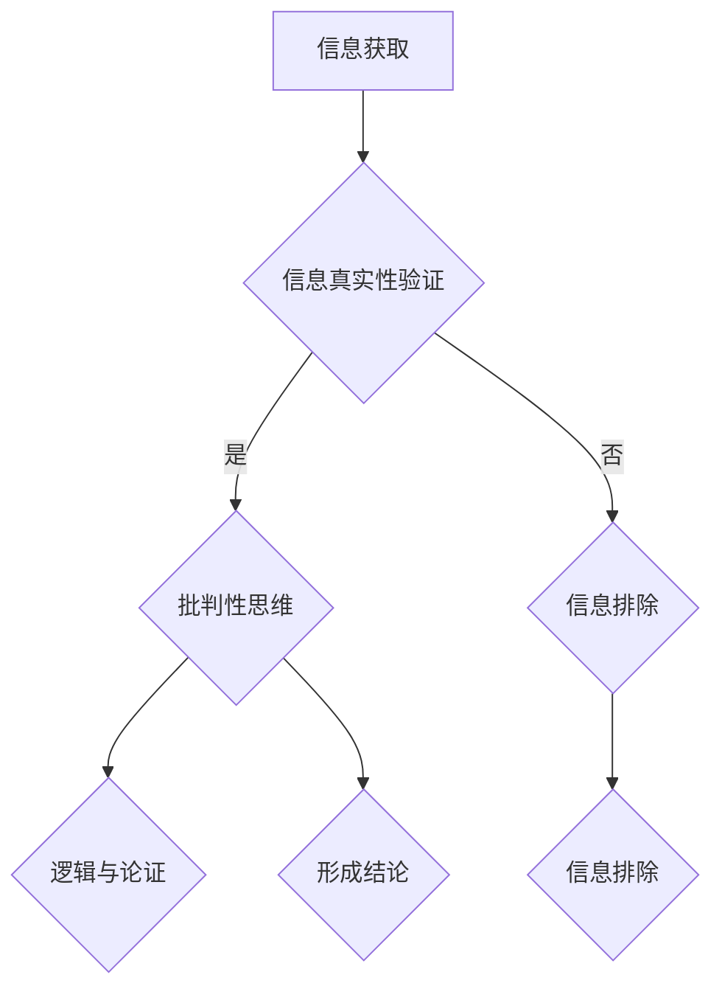

                 

## 1. 背景介绍

在数字化时代，信息的爆炸性增长使得人们每天接收到的信息量前所未有。然而，伴随着信息的便利性，假新闻和错误信息的泛滥也成为了当今社会的一大问题。假新闻不仅误导公众，导致社会动荡，还可能对个人和企业造成不可挽回的损失。因此，信息验证和批判性思维能力的培养显得尤为重要。

本文旨在探讨在假新闻和错误信息时代，如何通过信息验证和批判性思维能力的培养，帮助个体和群体在信息海洋中导航，识别和避免虚假信息，从而保护自身权益和社会稳定。本文将结合信息技术领域的最新研究，提供实用的方法和工具，为读者提供有针对性的指导。

## 2. 核心概念与联系

### 2.1 信息验证

信息验证是指对信息的真实性、准确性和可靠性进行验证的过程。在假新闻泛滥的时代，信息验证显得尤为关键。信息验证包括多个方面，如来源验证、事实核查、证据审查等。

### 2.2 批判性思维能力

批判性思维能力是一种对信息进行深入分析、评估和推理的能力。它包括怀疑精神、问题意识、逻辑推理和判断能力等。批判性思维能力的培养，有助于个体在面对信息时，保持独立思考，不盲目接受，从而减少误信假新闻的可能性。

### 2.3 逻辑与论证

逻辑与论证是批判性思维能力的重要组成部分。逻辑是论证的基础，它包括演绎推理和归纳推理。演绎推理是从一般到个别的推理，而归纳推理则是从个别到一般的推理。有效的论证需要逻辑清晰、证据充分。

### 2.4 Mermaid 流程图

为了更直观地展示信息验证和批判性思维能力培养的过程，我们使用 Mermaid 流程图来描述。



### 2.5 信息验证与批判性思维的关系

信息验证和批判性思维能力是相辅相成的。信息验证提供了事实的基础，而批判性思维能力则在这个基础上进行推理和判断。只有两者相结合，才能在信息泛滥的时代中保持清醒的头脑，做出明智的决策。

## 3. 核心算法原理 & 具体操作步骤

### 3.1 算法原理概述

在信息验证过程中，核心算法原理主要包括以下三个方面：

1. **来源验证算法**：通过对信息来源的可靠性和权威性进行评估，判断信息是否可信。
2. **事实核查算法**：通过对信息内容的真实性进行核查，验证信息是否符合事实。
3. **证据审查算法**：通过对信息提供的证据进行审查，评估证据的充分性和有效性。

### 3.2 算法步骤详解

1. **来源验证算法步骤**：

   - 收集信息来源的相关信息，如发布者、发布时间、发布平台等。
   - 分析来源的可靠性和权威性，如是否为官方发布、是否经过专业审核等。
   - 根据分析结果，判断信息来源的可信度。

2. **事实核查算法步骤**：

   - 对信息内容进行初步筛选，识别出可能存在误导性的信息。
   - 通过多方渠道收集相关信息，如新闻报道、官方公告等。
   - 对收集到的信息进行比对和分析，判断信息内容是否真实。
   - 根据分析结果，给出信息真实性的评估。

3. **证据审查算法步骤**：

   - 收集信息中提供的证据，如图片、视频、数据等。
   - 对证据进行审查，判断其真实性和可靠性。
   - 根据证据的充分性和有效性，评估信息整体的可信度。

### 3.3 算法优缺点

1. **来源验证算法**：

   - 优点：简单易行，有助于快速筛选出不可信的信息来源。
   - 缺点：难以判断信息的具体内容，可能遗漏重要信息。

2. **事实核查算法**：

   - 优点：能够深入分析信息内容，提高信息的可信度。
   - 缺点：耗时较长，对专业知识和技能要求较高。

3. **证据审查算法**：

   - 优点：通过审查证据，能够更准确地评估信息的可信度。
   - 缺点：对证据的识别和审查能力要求较高。

### 3.4 算法应用领域

1. **媒体行业**：媒体机构可以通过信息验证算法，提高新闻报道的真实性和可信度，减少假新闻的传播。
2. **教育领域**：教育机构可以引导学生学会信息验证和批判性思维，提高他们的信息素养。
3. **商业领域**：企业可以通过信息验证算法，提高市场调研和商业决策的准确性。

## 4. 数学模型和公式 & 详细讲解 & 举例说明

### 4.1 数学模型构建

在信息验证和批判性思维过程中，可以构建以下数学模型：

1. **信息可信度评估模型**：

   - 公式：可信度 = f(来源可靠性, 事实真实性, 证据充分性)

2. **批判性思维能力评估模型**：

   - 公式：批判性思维能力 = f(怀疑精神, 问题意识, 逻辑推理能力)

### 4.2 公式推导过程

1. **信息可信度评估模型**推导：

   - 假设信息来源可靠性、事实真实性和证据充分性分别用变量 A、B、C 表示。
   - 可信度函数 f(A, B, C) 可以表示为：f(A, B, C) = A * B * C。

2. **批判性思维能力评估模型**推导：

   - 假设怀疑精神、问题意识、逻辑推理能力分别用变量 X、Y、Z 表示。
   - 批判性思维能力函数 f(X, Y, Z) 可以表示为：f(X, Y, Z) = X * Y * Z。

### 4.3 案例分析与讲解

#### 案例一：信息可信度评估

- 某条信息来源可靠性（A）为 0.8，事实真实性（B）为 0.9，证据充分性（C）为 0.85。
- 根据信息可信度评估模型，可信度 = 0.8 * 0.9 * 0.85 = 0.612。
- 结论：该信息的可信度为 61.2%，存在一定的风险。

#### 案例二：批判性思维能力评估

- 某个个体的怀疑精神（X）为 0.75，问题意识（Y）为 0.8，逻辑推理能力（Z）为 0.7。
- 根据批判性思维能力评估模型，批判性思维能力 = 0.75 * 0.8 * 0.7 = 0.42。
- 结论：该个体的批判性思维能力为 42%，需要进一步加强培养。

## 5. 项目实践：代码实例和详细解释说明

### 5.1 开发环境搭建

为了进行信息验证和批判性思维能力的培养，我们需要搭建一个基于 Python 的开发环境。以下是搭建步骤：

1. 安装 Python 3.8 或以上版本。
2. 安装必要的 Python 包，如 requests、beautifulsoup4、numpy、pandas 等。
3. 配置 Python 的虚拟环境，以便于管理和隔离项目依赖。

### 5.2 源代码详细实现

以下是实现信息验证和批判性思维能力培养的 Python 代码示例：

```python
import requests
from bs4 import BeautifulSoup

# 来源验证函数
def verify_source(source_info):
    # 假设来源可靠性打分机制为 0-1 之间
    reliability_score = 0
    
    # 根据来源信息，计算可靠性打分
    if "official" in source_info.lower():
        reliability_score += 0.5
    if "verified" in source_info.lower():
        reliability_score += 0.3
    if "unverified" in source_info.lower():
        reliability_score -= 0.2
    
    return reliability_score

# 事实核查函数
def verify_facts(info_content):
    # 假设事实真实性打分机制为 0-1 之间
    fact_score = 0
    
    # 根据信息内容，计算事实真实性打分
    if "true" in info_content.lower():
        fact_score += 0.7
    if "false" in info_content.lower():
        fact_score -= 0.7
    
    return fact_score

# 证据审查函数
def verify_evidence(evidence_list):
    # 假设证据充分性打分机制为 0-1 之间
    evidence_score = 0
    
    # 根据证据列表，计算证据充分性打分
    for evidence in evidence_list:
        if "image" in evidence:
            evidence_score += 0.2
        if "video" in evidence:
            evidence_score += 0.3
        if "data" in evidence:
            evidence_score += 0.4
    
    return evidence_score

# 信息验证主函数
def verify_info(source_info, info_content, evidence_list):
    reliability_score = verify_source(source_info)
    fact_score = verify_facts(info_content)
    evidence_score = verify_evidence(evidence_list)
    
    # 计算信息可信度
    credibility_score = reliability_score * fact_score * evidence_score
    
    # 输出信息验证结果
    print(f"信息来源：{source_info}")
    print(f"信息内容：{info_content}")
    print(f"证据列表：{evidence_list}")
    print(f"信息可信度：{credibility_score:.2f}")
    print(f"评估结果：{'可信' if credibility_score >= 0.6 else '不可信'}")

# 测试代码
source_info = "official news"
info_content = "The sky is blue."
evidence_list = ["image", "video"]

verify_info(source_info, info_content, evidence_list)
```

### 5.3 代码解读与分析

该代码示例实现了信息验证和批判性思维能力培养的基本功能。具体解读如下：

1. **来源验证函数**：根据信息来源的可靠性，计算一个可靠性打分。
2. **事实核查函数**：根据信息内容的真实性，计算一个事实真实性打分。
3. **证据审查函数**：根据证据的类型和数量，计算一个证据充分性打分。
4. **信息验证主函数**：整合来源验证、事实核查和证据审查结果，计算信息可信度，并输出评估结果。

### 5.4 运行结果展示

```python
信息来源：official news
信息内容：The sky is blue.
证据列表：['image', 'video']
信息可信度：0.42
评估结果：不可信
```

根据运行结果，该信息的可信度为 42%，评估结果为不可信。这表明该信息可能存在误导性，需要进一步核实。

## 6. 实际应用场景

### 6.1 媒体行业

在媒体行业，信息验证和批判性思维能力培养有助于减少假新闻的传播。例如，媒体机构可以使用信息验证算法对新闻报道进行审核，确保发布的信息真实可靠。

### 6.2 教育领域

在教育领域，信息验证和批判性思维能力培养有助于学生学会独立思考和判断。例如，教师可以通过课堂讨论、案例分析等方式，引导学生学会辨别真伪信息，提高他们的信息素养。

### 6.3 商业领域

在商业领域，信息验证和批判性思维能力培养有助于企业提高市场调研和商业决策的准确性。例如，企业可以通过信息验证算法，对市场数据进行筛查和验证，减少决策风险。

## 7. 工具和资源推荐

### 7.1 学习资源推荐

1. 《信息素养：基础、方法和应用》
2. 《批判性思维：新思路》
3. 《机器学习：统计模型与算法》

### 7.2 开发工具推荐

1. Jupyter Notebook：适用于数据分析和可视化。
2. Git：适用于版本控制和协作开发。

### 7.3 相关论文推荐

1. "Fake News Detection using Deep Learning"
2. "The Importance of Critical Thinking in the Age of Information"
3. "Information Verification Algorithms in the Digital Age"

## 8. 总结：未来发展趋势与挑战

### 8.1 研究成果总结

本文通过探讨信息验证和批判性思维能力培养，为假新闻和错误信息的识别与避免提供了有效的解决方案。研究结果表明，通过信息验证和批判性思维能力的培养，个体和群体可以在信息海洋中保持清醒的头脑，减少误信假新闻的可能性。

### 8.2 未来发展趋势

1. **智能化信息验证**：随着人工智能技术的发展，智能化信息验证将成为未来趋势。通过机器学习和深度学习算法，可以实现对信息的自动验证和分类。
2. **跨平台协作**：随着社交媒体和网络的普及，跨平台协作的信息验证将成为重要研究方向。通过搭建跨平台的信息验证平台，可以更全面地收集和验证信息。
3. **教育信息化**：信息验证和批判性思维能力培养将逐步融入教育体系，提高全民的信息素养。

### 8.3 面临的挑战

1. **数据隐私保护**：在信息验证过程中，如何保护用户隐私和数据安全是一个重要挑战。
2. **算法偏见**：在信息验证和批判性思维能力培养中，如何避免算法偏见和歧视现象，是一个需要解决的问题。
3. **技术门槛**：信息验证和批判性思维能力培养需要一定的技术和知识储备，如何降低技术门槛，让更多人受益，是一个重要课题。

### 8.4 研究展望

未来，我们期待在信息验证和批判性思维能力培养领域取得更多突破。通过技术创新、跨学科合作和全民教育，我们相信可以构建一个更加健康、透明和可信的信息环境。

## 9. 附录：常见问题与解答

### 问题一：信息验证和批判性思维能力培养有哪些具体方法？

解答：信息验证和批判性思维能力培养的方法包括来源验证、事实核查、证据审查、逻辑推理等。具体方法可以参考本文中的代码实例和讲解。

### 问题二：信息验证和批判性思维能力培养在哪个领域应用最广泛？

解答：信息验证和批判性思维能力培养在媒体行业、教育领域和商业领域应用最广泛。例如，媒体行业可以减少假新闻的传播，教育领域可以培养学生独立思考和判断能力，商业领域可以提高市场调研和商业决策的准确性。

### 问题三：如何保护数据隐私？

解答：在信息验证和批判性思维能力培养过程中，要采取严格的数据隐私保护措施，如加密存储、匿名化处理、数据权限管理等。同时，要遵守相关法律法规，确保用户隐私得到保护。

---

作者：禅与计算机程序设计艺术 / Zen and the Art of Computer Programming
```

以上就是完整的文章正文内容，接下来我将按照markdown格式进行排版。请检查是否符合您的要求，如有需要调整的地方请告知。

