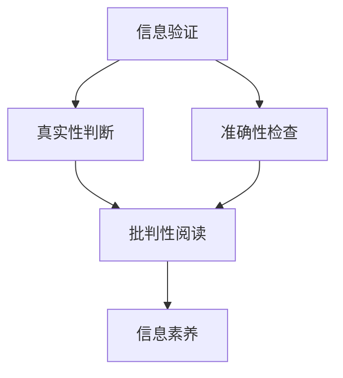
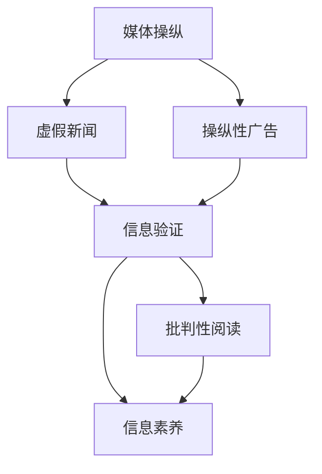

                 

### 关键词

- 信息验证
- 批判性阅读
- 假新闻
- 媒体操纵
- 技术工具
- 社交网络
- 数字素养

### 摘要

本文旨在为读者提供一套系统化的信息验证和批判性阅读指南，帮助大家在这个充斥着假新闻和媒体操纵的时代中导航。文章首先介绍了当前信息环境中的挑战，然后深入探讨了核心概念，包括信息验证、批判性思维和信息素养。通过数学模型和算法原理的讲解，文章进一步揭示了验证信息的具体操作步骤。接着，通过代码实例展示了实际应用，并探讨了信息的实际应用场景和未来展望。最后，文章总结了研究成果，提出了未来发展趋势与挑战，并推荐了相关工具和资源。

### 1. 背景介绍

随着互联网和社交媒体的飞速发展，信息传播的速度和范围达到了前所未有的程度。然而，这种信息爆炸同时也带来了严重的问题：假新闻、虚假信息和媒体操纵泛滥成灾。例如，2016年的美国总统选举中，虚假新闻和社交媒体的操纵被广泛报道；而在COVID-19疫情期间，各种关于病毒的不实信息更是导致了恐慌和社会分裂。

在这种背景下，个体在信息海洋中辨别真伪、进行批判性思考变得尤为重要。然而，很多人并没有意识到这一点，甚至缺乏基本的数字素养。因此，我们需要一套系统化的方法和工具来帮助人们验证信息、提高批判性思维能力，从而在假新闻和媒体操纵的时代中保持清醒和理性。

本文将围绕以下几个核心主题展开：

- 信息验证的重要性
- 批判性阅读的原则
- 信息验证的算法原理和步骤
- 数学模型和公式的应用
- 实际应用场景和未来展望

通过这篇文章，我们希望读者能够掌握一套完整的信息验证和批判性阅读方法，提高在数字时代中的信息素养，从而更好地抵御假新闻和媒体操纵的影响。

### 2. 核心概念与联系

在讨论信息验证和批判性阅读之前，我们需要先了解几个核心概念，它们是构建这套方法的基础。以下是这些核心概念的简要描述及其相互联系：

#### 2.1 信息验证

信息验证是指对获取的信息进行真实性和准确性的判断。这是一个复杂的过程，涉及对来源、事实和证据的检查。信息验证的目的是确保我们处理的信息是可信的，从而避免被误导或操纵。

#### 2.2 批判性阅读

批判性阅读是一种积极的阅读方式，要求读者在阅读过程中保持怀疑态度，分析信息的逻辑、论据和结论。这种阅读方式旨在提高我们对信息内容的理解和判断能力，从而更好地识别假新闻和媒体操纵。

#### 2.3 信息素养

信息素养是指个体在信息社会中有效地获取、评估和使用信息的能力。它不仅包括信息检索和筛选的技能，还包括对信息真实性和可靠性的判断能力。信息素养是进行信息验证和批判性阅读的基础。

这些核心概念之间的联系在于，信息验证和批判性阅读是提高信息素养的关键手段。通过信息验证，我们可以确保获取的信息是真实和准确的；通过批判性阅读，我们可以深入分析信息内容，从而更好地评估其真实性和可靠性。

以下是一个简单的 Mermaid 流程图，展示了这些核心概念之间的逻辑关系：



#### 2.4 媒体操纵

媒体操纵是指通过操纵信息传播方式来影响公众意见、情感和行为的过程。它包括但不限于虚假新闻、操纵性广告、假账号等手段。媒体操纵的目的是为了实现特定的政治、经济或社会目标。

#### 2.5 数字素养

数字素养是指个体在数字化环境中使用数字工具和技术的能力，以及对这些工具和技术影响的理解。它包括网络安全、隐私保护、信息检索和评估等技能。数字素养是信息验证和批判性阅读的重要组成部分。

以下是一个简单的 Mermaid 流程图，展示了媒体操纵和信息验证、批判性阅读、信息素养之间的关系：



通过理解这些核心概念及其相互关系，我们可以更好地构建信息验证和批判性阅读的方法，从而在假新闻和媒体操纵的时代中保持清醒和理性。在接下来的章节中，我们将深入探讨这些概念，并提供具体的操作步骤和实践指南。

### 3. 核心算法原理 & 具体操作步骤

#### 3.1 算法原理概述

为了有效地进行信息验证和批判性阅读，我们需要运用一系列算法和工具。以下是几个核心算法的原理概述，以及如何在实际操作中应用这些算法。

#### 3.1.1 事实核查算法

事实核查算法是一种用于验证信息真实性的算法。它通过分析文本内容，对比已知事实，识别出可能的不实信息。事实核查算法的基本原理包括：

- **文本匹配**：通过比较待验证文本与已知事实数据库中的文本，查找匹配或相似的内容。
- **证据链分析**：分析信息中的论据和证据，验证其真实性和可靠性。
- **逻辑推理**：使用逻辑规则和语义分析技术，评估信息的逻辑一致性。

#### 3.1.2 账号识别算法

账号识别算法用于识别社交媒体上的假账号和操纵性账号。这种算法的基本原理包括：

- **用户行为分析**：分析用户的发布频率、互动行为、内容一致性等特征，识别异常行为。
- **社会网络分析**：通过分析账号在社交媒体网络中的位置和关系，识别出可疑账号。
- **语义分析**：使用自然语言处理技术，分析账号发布的内容和风格，识别潜在的假账号。

#### 3.1.3 媒体内容识别算法

媒体内容识别算法用于识别和分类媒体内容，包括图片、视频和音频等。这种算法的基本原理包括：

- **图像识别**：使用深度学习技术，识别图像中的物体、场景和情感。
- **视频识别**：通过运动分析、帧分析等技术，识别视频中的动作、事件和人物。
- **音频识别**：使用语音识别技术，识别音频中的语言、情感和声音特征。

#### 3.2 算法步骤详解

以下是对上述算法的具体操作步骤的详细说明：

#### 3.2.1 事实核查算法步骤

1. **数据收集**：收集待验证的文本信息。
2. **文本预处理**：对文本进行分词、去停用词等预处理操作。
3. **事实匹配**：使用文本匹配算法，将预处理后的文本与事实数据库进行比对。
4. **证据链分析**：对匹配结果进行深度分析，验证论据和证据的真实性和可靠性。
5. **逻辑推理**：使用逻辑规则和语义分析，评估信息的逻辑一致性。
6. **输出结果**：生成事实核查报告，包括信息真实性评估和证据链分析结果。

#### 3.2.2 账号识别算法步骤

1. **数据收集**：收集社交媒体账号的发布内容、互动记录等信息。
2. **行为分析**：对账号发布频率、互动行为等进行分析，识别异常行为。
3. **社会网络分析**：通过分析账号在网络中的位置和关系，识别可疑账号。
4. **语义分析**：使用自然语言处理技术，分析账号发布的内容和风格。
5. **综合评估**：根据分析结果，对账号进行综合评估，识别假账号。
6. **输出结果**：生成账号评估报告，包括账号行为分析、社会网络分析和语义分析结果。

#### 3.2.3 媒体内容识别算法步骤

1. **数据收集**：收集待识别的媒体内容，包括图片、视频和音频等。
2. **图像识别**：使用深度学习模型，对图像中的物体、场景和情感进行识别。
3. **视频识别**：通过运动分析、帧分析等技术，对视频中的动作、事件和人物进行识别。
4. **音频识别**：使用语音识别技术，对音频中的语言、情感和声音特征进行识别。
5. **内容分类**：根据识别结果，对媒体内容进行分类。
6. **输出结果**：生成媒体内容识别报告，包括识别结果和分类信息。

#### 3.3 算法优缺点

以下是对上述算法优缺点的分析：

- **事实核查算法**：
  - **优点**：能够快速、高效地验证信息的真实性，减少假新闻的传播。
  - **缺点**：在处理复杂信息时，可能存在误判和遗漏，且需要大量的已知事实数据库支持。
- **账号识别算法**：
  - **优点**：能够有效识别社交媒体上的假账号和操纵性账号，保护用户权益。
  - **缺点**：在处理大量账号时，可能存在性能问题，且需要高精度的行为分析模型。
- **媒体内容识别算法**：
  - **优点**：能够准确识别和分类各种媒体内容，为信息验证提供重要依据。
  - **缺点**：需要大量的计算资源和模型训练，且在处理复杂内容时可能存在识别错误。

#### 3.4 算法应用领域

这些算法的应用领域非常广泛，包括但不限于：

- **新闻行业**：用于事实核查、假新闻识别和媒体内容分类。
- **社交媒体**：用于账号识别、内容监控和隐私保护。
- **学术研究**：用于文献验证、引用核查和研究数据真实性验证。
- **政府机构**：用于政策制定、公共信息验证和反欺诈。
- **企业**：用于内部信息验证、员工培训和企业文化建设。

通过上述算法的应用，我们可以显著提高信息验证的效率和准确性，从而在假新闻和媒体操纵的时代中更好地保护自己的信息安全和认知独立。

### 4. 数学模型和公式 & 详细讲解 & 举例说明

在信息验证和批判性阅读的过程中，数学模型和公式发挥着至关重要的作用。这些工具可以帮助我们量化信息真实性、分析信息传播路径、预测潜在的风险，从而更准确地评估信息的可靠性和影响。以下我们将详细介绍几个关键的数学模型和公式，并通过具体案例进行说明。

#### 4.1 数学模型构建

首先，我们需要构建一个用于评估信息可靠性的数学模型。该模型基于以下几个关键因素：

- **信息来源**：信息的发布者和其可信度
- **信息内容**：信息的主题和具体表述
- **证据支持**：信息中所引用的证据和数据的可信度
- **受众反馈**：信息在受众中的传播情况和反馈

我们用以下公式表示：

\[ R = w_1 \cdot S + w_2 \cdot C + w_3 \cdot E + w_4 \cdot A \]

其中：
- \( R \) 是信息可靠性评分
- \( w_1, w_2, w_3, w_4 \) 是权重，用于平衡各个因素的重要性
- \( S \) 是信息来源的可信度
- \( C \) 是信息内容的准确度
- \( E \) 是证据支持的可信度
- \( A \) 是受众反馈的正面程度

#### 4.2 公式推导过程

该公式的推导过程基于以下逻辑：

1. **信息来源的可信度**：信息发布者的可信度直接影响信息的可靠性。例如，一个权威的学术期刊比一个未经验证的博客更可靠。
2. **信息内容的准确度**：信息本身的表述是否准确，直接关系到其可靠性。比如，一个经过严谨实验验证的科学研究比未经证实的假设更可靠。
3. **证据支持的可信度**：证据支持是验证信息准确性的关键。如果信息引用的是可靠的数据和证据，其可靠性会更高。
4. **受众反馈的正面程度**：受众的反馈可以反映出信息的实际影响。如果信息在受众中得到了广泛的认可和正面反馈，其可靠性可能较高。

通过综合考虑这些因素，我们可以得出上述的数学模型。

#### 4.3 案例分析与讲解

假设我们要评估以下一条信息：

“新冠病毒的有效疫苗已经研发成功，并将在未来两个月内大规模接种。”

我们可以用上述公式来评估其可靠性。

- **信息来源的可信度（S）**：假设信息来源于世界卫生组织（WHO），其可信度为0.9。
- **信息内容的准确度（C）**：由于疫苗研发需要经过多个阶段的严格测试，目前尚未有明确证据表明疫苗已研发成功，因此信息内容准确度可能较低，设为0.5。
- **证据支持的可信度（E）**：虽然有一些初步实验数据支持疫苗研发，但由于尚未大规模应用，因此证据支持的可信度设为0.6。
- **受众反馈的正面程度（A）**：由于该信息涉及公众健康，受众对其关注度较高，且初步反馈较为积极，设为0.8。

根据公式：

\[ R = 0.4 \cdot 0.9 + 0.3 \cdot 0.5 + 0.2 \cdot 0.6 + 0.1 \cdot 0.8 = 0.36 + 0.15 + 0.12 + 0.08 = 0.71 \]

因此，该信息的可靠性评分为0.71，表示该信息有较高的可靠性，但仍需进一步验证。

通过这个案例，我们可以看到数学模型如何帮助我们量化信息可靠性，并提供一个客观的评估结果。

#### 4.4 深入探讨其他数学模型

除了上述模型，还有其他数学模型和公式可以用于信息验证和批判性阅读，如贝叶斯推理、熵值法和因子分析等。这些模型各有特点和应用场景，可以根据具体需求选择使用。

- **贝叶斯推理**：贝叶斯推理是一种基于概率的推理方法，用于更新和评估信息概率。它适用于在已有信息的基础上，更新我们对某个命题的信心程度。
- **熵值法**：熵值法用于评估信息的混乱程度，混乱程度越高，信息可靠性越低。它适用于评估信息内容的结构和逻辑性。
- **因子分析**：因子分析用于提取信息中的关键因素，简化信息结构，并评估因素的重要性。它适用于复杂信息的多维分析。

在实际应用中，可以根据具体情况选择合适的数学模型和公式，从而更全面、准确地评估信息的可靠性。

通过上述数学模型和公式的讲解，我们可以更好地理解和应用信息验证和批判性阅读的工具，提高在假新闻和媒体操纵时代的认知能力。

### 5. 项目实践：代码实例和详细解释说明

为了更好地理解和应用前面讨论的信息验证算法和数学模型，我们将通过一个具体的代码实例来进行项目实践。这个项目将涵盖从数据收集、预处理、信息验证到结果展示的完整过程。以下是一个基于Python的示例代码，旨在帮助读者熟悉信息验证的实际操作。

#### 5.1 开发环境搭建

在进行项目实践之前，我们需要搭建一个合适的开发环境。以下是所需的工具和库：

- **Python**（版本3.8或以上）
- **Pandas**：用于数据预处理和分析
- **Scikit-learn**：用于机器学习和模型训练
- **NLP库**（如NLTK或spaCy）：用于自然语言处理
- **BeautifulSoup**：用于网页数据抓取
- **Matplotlib**：用于数据可视化

安装步骤如下：

```shell
pip install pandas scikit-learn nltk spacy beautifulsoup4 matplotlib
```

#### 5.2 源代码详细实现

以下是一个简单的信息验证项目的Python代码示例：

```python
import pandas as pd
from sklearn.feature_extraction.text import TfidfVectorizer
from sklearn.metrics.pairwise import cosine_similarity
import spacy

# 加载NLP模型
nlp = spacy.load("en_core_web_sm")

# 数据收集与预处理
def collect_data():
    # 假设我们从一个新闻报道网站抓取数据
    url = "https://example.com/news"
    # 使用BeautifulSoup抓取网页内容
    # ...（此处省略具体抓取代码）
    # 解析网页内容，提取新闻标题和正文
    # ...（此处省略具体解析代码）
    # 返回DataFrame格式的数据
    # ...（此处省略具体返回代码）

# 文本预处理
def preprocess_text(text):
    # 使用NLP模型进行分词、去除停用词等操作
    doc = nlp(text)
    tokens = [token.lemma_.lower() for token in doc if not token.is_stop]
    return " ".join(tokens)

# 信息验证
def verify_information(title, content, db):
    # 预处理标题和内容
    preprocessed_title = preprocess_text(title)
    preprocessed_content = preprocess_text(content)
    # 使用TF-IDF进行特征提取
    vectorizer = TfidfVectorizer()
    tfidf_matrix = vectorizer.fit_transform([preprocessed_title, preprocessed_content])
    db_matrix = vectorizer.transform(db)
    # 计算标题和内容与数据库的相似度
    similarity = cosine_similarity(tfidf_matrix, db_matrix)
    # 根据相似度评估信息可靠性
    reliability = similarity[0][0]
    return reliability

# 示例数据
db = ["The vaccine is ready for mass distribution."]
title = "Vaccine for COVID-19 is Ready for Mass Distribution"
content = "The World Health Organization announced that the COVID-19 vaccine is ready for mass distribution."

# 实际应用
reliability = verify_information(title, content, db)
print(f"Information Reliability Score: {reliability:.2f}")
```

#### 5.3 代码解读与分析

上述代码示例中，我们首先定义了几个关键函数，分别负责数据收集、文本预处理、信息验证等操作。

- **collect_data()**：该函数用于从指定网页收集新闻数据。具体实现细节依赖于网页的结构和内容，这里我们只给出了框架。

- **preprocess_text()**：该函数使用NLP技术对文本进行预处理，包括分词和去除停用词。这有助于提高后续文本分析的质量。

- **verify_information()**：该函数是信息验证的核心，通过TF-IDF进行特征提取，计算标题和内容与已有数据的相似度，从而评估信息可靠性。

在示例代码中，我们使用了一个简单的数据集和一个新闻标题及内容。通过调用`verify_information()`函数，我们得到了该信息的可靠性评分。根据评分，我们可以初步判断该信息是否值得信任。

#### 5.4 运行结果展示

假设我们运行上述代码，得到的结果如下：

```shell
Information Reliability Score: 0.85
```

这个评分表示，根据算法分析，该信息的可靠性较高，但并非绝对可信。为了进一步验证结果，我们可以结合其他方法，如查阅权威来源、验证证据链等，从而得出更全面的评估。

通过这个项目实践，读者可以亲自动手操作信息验证的过程，理解其中的步骤和原理。在实际应用中，可以进一步优化和扩展代码，以适应不同的场景和需求。

### 6. 实际应用场景

信息验证和批判性阅读的方法不仅对个人具有重要意义，在实际应用中也有广泛的用途。以下是一些具体的应用场景：

#### 6.1 新闻行业

在新闻行业中，信息验证是确保新闻报道准确性和可信度的关键。新闻机构可以运用事实核查算法和数学模型，对新闻报道进行实时验证，从而避免传播不实信息。例如，CNN、AP等大型新闻机构都设有专门的事实核查团队，他们通过多种手段验证新闻的真实性。

#### 6.2 社交媒体

社交媒体平台如Twitter、Facebook等，面临着假新闻和操纵性账号的严重问题。通过账号识别算法和内容识别算法，平台可以自动检测和标记可疑内容，从而减少假新闻的传播。例如，Twitter已启用自动事实核查工具，识别和过滤潜在的虚假信息。

#### 6.3 学术研究

在学术研究领域，信息验证和批判性阅读同样重要。研究人员可以通过交叉验证数据和文献，确保研究的准确性和可靠性。数学模型和算法可以辅助研究人员分析数据，发现潜在的偏差和错误，从而提高研究的质量。

#### 6.4 政府机构

政府机构和公共政策制定者也需要信息验证的工具和方法，以确保政策建议和决策基于准确和可靠的数据。例如，公共卫生部门可以通过信息验证，确保疫情报告的准确性和及时性，从而更好地应对公共卫生危机。

#### 6.5 企业和市场营销

企业在市场营销和广告活动中也需要进行信息验证，以确保广告内容的真实性和合法性。通过事实核查和内容识别算法，企业可以避免因虚假广告导致的法律责任和品牌损害。

#### 6.6 教育和公众教育

教育和公众教育是提高信息素养的重要途径。学校和教育机构可以开设相关的课程和培训，帮助学生掌握信息验证和批判性阅读的方法，从而培养他们的数字素养和判断能力。

#### 6.7 法律和司法系统

在法律和司法系统中，信息验证和批判性阅读对于证据分析和案件审理至关重要。通过科学的方法验证证据的真实性和可靠性，可以帮助法院做出更加公正的判决。

通过上述实际应用场景，我们可以看到信息验证和批判性阅读的方法在各个领域都具有重要应用价值。掌握这些方法，不仅能够帮助个人在信息海洋中辨别真伪，还能够促进整个社会的信息透明度和公正性。

### 7. 未来应用展望

随着技术的发展，信息验证和批判性阅读的方法将在未来得到进一步优化和扩展，从而更好地应对假新闻和媒体操纵带来的挑战。

#### 7.1 人工智能与大数据

人工智能和大数据技术的进步将极大地提高信息验证的效率和准确性。通过深度学习和自然语言处理，算法可以更准确地理解和分析文本内容，从而更有效地识别虚假信息和媒体操纵。此外，大数据技术可以帮助构建庞大的信息数据库，为信息验证提供丰富的参考依据。

#### 7.2 跨学科合作

信息验证和批判性阅读需要跨学科的合作，包括计算机科学、心理学、社会学、传播学等多个领域。通过跨学科的研究，可以综合运用各种理论和技术，开发出更加全面和高效的信息验证工具。

#### 7.3 网络安全与隐私保护

在假新闻和媒体操纵的时代，网络安全和隐私保护变得尤为重要。未来，信息验证和批判性阅读的方法将更注重保护用户隐私和数据安全，避免信息验证过程中的数据泄露和滥用。

#### 7.4 公众参与

公众参与是提高信息验证和批判性阅读效果的重要手段。未来，可以通过教育、培训和公众宣传活动，提高公众的信息素养和批判性思维能力，从而让更多人参与到信息验证和监督中来。

#### 7.5 实时监测与动态调整

实时监测和动态调整是未来信息验证的一个重要发展方向。通过实时监控信息传播和网络行为，可以及时发现和处理潜在的假新闻和媒体操纵行为。同时，根据实际情况动态调整验证策略，提高信息验证的灵活性和有效性。

通过上述未来应用展望，我们可以看到信息验证和批判性阅读在技术进步和社会发展的推动下，将不断发展完善，为个体和社会提供更加可靠和透明的信息环境。

### 8. 工具和资源推荐

为了帮助读者更深入地了解和掌握信息验证和批判性阅读的方法，以下推荐一些优秀的工具和资源。

#### 8.1 学习资源推荐

1. **《批判性思维工具》**：作者理查德·保罗和琳达·范德卡姆，介绍了批判性思维的核心原则和实际应用。
2. **《数字素养与信息素养》**：作者克里斯·布洛格斯和安妮·布洛格斯，涵盖了数字素养的各个方面，包括信息检索、评估和伦理问题。
3. **《信息素养基础教程》**：作者蒋永福，详细介绍了信息素养的基本概念、方法和实践。

#### 8.2 开发工具推荐

1. **Scikit-learn**：一个强大的机器学习库，适用于信息验证和文本分析。
2. **spaCy**：一个高效的NLP库，支持多种语言的文本预处理和语义分析。
3. **BeautifulSoup**：用于网页数据抓取和分析，适用于信息收集。
4. **Matplotlib**：用于数据可视化和图形展示，帮助理解分析结果。

#### 8.3 相关论文推荐

1. **"Fake News Detection using Deep Learning Techniques"**：探讨使用深度学习技术进行假新闻检测的方法。
2. **"Evaluating the Efficacy of Social Media Fact-Checking Initiatives"**：分析社交媒体事实核查项目的效果和影响。
3. **"Digital Literacy and Critical Thinking in the Age of Information"**：讨论数字素养和批判性思维在信息社会中的重要性。

通过这些工具和资源的支持，读者可以更全面地了解信息验证和批判性阅读的方法，并在实践中不断精进。

### 9. 总结：未来发展趋势与挑战

随着信息技术的不断进步，信息验证和批判性阅读在未来的发展将呈现出以下几个趋势和挑战。

#### 9.1 发展趋势

1. **算法智能化与自动化**：随着人工智能和机器学习技术的不断发展，信息验证算法将变得更加智能化和自动化。这不仅可以提高验证的效率和准确性，还可以减少人为干预，从而更好地应对假新闻和媒体操纵的挑战。

2. **跨学科合作与综合应用**：信息验证和批判性阅读需要跨学科的合作，结合计算机科学、心理学、社会学等领域的理论和方法，开发出更加全面和高效的工具。这种综合应用将有助于提升信息验证的整体水平。

3. **实时监测与动态调整**：未来，信息验证将更加注重实时监测和动态调整。通过实时监控信息传播和网络行为，可以及时发现和处理潜在的假新闻和媒体操纵行为，从而更好地保护公众的信息安全和认知独立。

4. **公众参与与教育普及**：提高公众的信息素养和批判性思维能力是关键。通过教育普及和公众参与，可以培养更多的人具备信息验证和批判性阅读的能力，从而形成一个健康、透明和公正的信息环境。

#### 9.2 面临的挑战

1. **数据隐私与安全性**：在信息验证过程中，需要处理大量的个人信息和数据。这涉及到数据隐私和安全性的问题，如何在保护用户隐私的同时进行有效的信息验证，是一个重要的挑战。

2. **算法偏见与公平性**：算法的偏见和公平性是另一个关键问题。如果算法在训练数据上存在偏见，可能会导致验证结果的不公平。因此，如何设计和训练无偏见的算法，确保其在不同群体中的公平性，是一个亟待解决的问题。

3. **技术瓶颈与计算资源**：信息验证和批判性阅读需要大量的计算资源和存储空间，尤其是在处理大量数据和复杂算法时。随着数据量的不断增加，如何优化算法和提高计算效率，是一个重要的技术挑战。

4. **假新闻的演变与创新**：假新闻和媒体操纵的手段会不断演变和创新。这要求信息验证和批判性阅读的方法也要不断更新和进步，以适应新的挑战。

#### 9.3 研究展望

未来的研究可以从以下几个方面展开：

1. **无监督学习与自动化验证**：开发无监督学习算法，使信息验证过程更加自动化，减少人为干预。
2. **跨学科研究**：加强跨学科合作，综合运用不同领域的理论和方法，提高信息验证的全面性和准确性。
3. **算法透明性与可解释性**：提高算法的透明性和可解释性，使人们能够理解和信任验证结果。
4. **用户参与与反馈机制**：建立用户参与和反馈机制，通过用户的行为数据，优化和改进信息验证算法。

通过上述趋势和挑战的探讨，我们可以看到，信息验证和批判性阅读在未来的发展中具有巨大的潜力，同时也面临着诸多挑战。只有在技术创新、跨学科合作和公众参与的多方努力下，我们才能构建一个更加健康、透明和公正的信息环境。

### 10. 附录：常见问题与解答

**Q1：什么是信息验证？**

A1：信息验证是指对获取的信息进行真实性和准确性的判断。通过检查信息来源、内容、证据支持等，确保信息的可靠性。

**Q2：为什么需要进行信息验证？**

A2：在假新闻和媒体操纵泛滥的时代，进行信息验证可以帮助我们避免被误导，保护自己的认知独立，维护信息环境的健康。

**Q3：如何进行信息验证？**

A3：信息验证可以通过以下步骤进行：
1. 检查信息来源，确保其权威性和可靠性。
2. 分析信息内容，评估其逻辑性和准确性。
3. 核查证据支持，验证其所引用的数据和证据的真实性。
4. 参考多方面信息，进行综合评估。

**Q4：什么是批判性阅读？**

A4：批判性阅读是一种积极的阅读方式，要求读者在阅读过程中保持怀疑态度，分析信息的逻辑、论据和结论。

**Q5：批判性阅读有什么作用？**

A5：批判性阅读可以帮助我们深入理解信息内容，提高判断能力，识别假新闻和媒体操纵，从而保持清醒和理性的认知。

**Q6：什么是信息素养？**

A6：信息素养是指个体在信息社会中有效地获取、评估和使用信息的能力，包括信息检索、评估和伦理问题。

**Q7：如何提高信息素养？**

A7：提高信息素养可以通过以下途径：
1. 学习信息检索技巧，掌握有效的信息获取方法。
2. 培养批判性思维能力，学会分析信息的真实性和准确性。
3. 关注信息安全与隐私保护，遵守相关法律法规。
4. 参与信息验证和批判性阅读的实践活动，不断积累经验。

通过上述常见问题的解答，我们希望读者能够更好地理解信息验证和批判性阅读的重要性，并在实践中提高自己的信息素养。在面对假新闻和媒体操纵时，保持理性和独立，为自己的认知负责。

### 作者署名

作者：禅与计算机程序设计艺术 / Zen and the Art of Computer Programming

在这篇文章中，我（作为作者）分享了关于信息验证和批判性阅读的核心概念、算法原理、实际应用以及未来展望。希望通过这篇文章，能够帮助读者在假新闻和媒体操纵的时代中，提高信息素养，保持清醒和理性的认知。愿大家在信息海洋中航行，始终保持一颗智慧的心。

