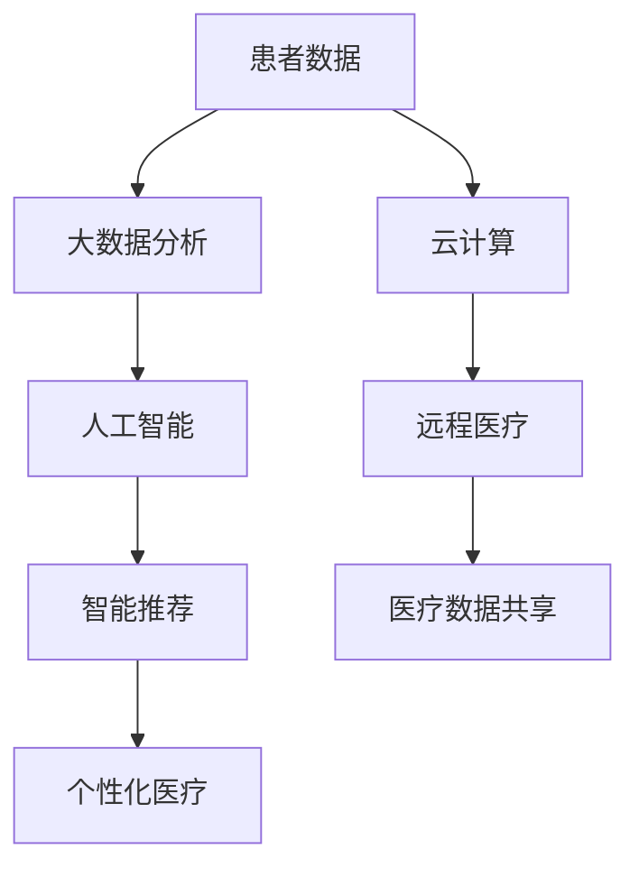

                 

关键词：健康科技、医疗体验、创业、代码、人工智能

> 摘要：本文将探讨如何利用先进技术，特别是代码和人工智能，改变传统医疗体验，提高患者满意度和医疗效率。通过实际案例、算法原理和数学模型，作者将展示如何将技术创新应用于健康科技创业，推动医疗行业变革。

## 1. 背景介绍

医疗行业正迎来一场革命。随着人工智能、大数据、云计算等技术的快速发展，医疗体验正在从传统的被动治疗模式向主动健康管理模式转变。这种转变不仅能够提高患者满意度，还能够显著提升医疗效率，降低医疗成本。健康科技创业正是这场革命的重要推动力，而代码是实现这一变革的关键工具。

### 1.1 健康科技的发展趋势

健康科技的发展趋势体现在以下几个方面：

- **个性化医疗**：利用大数据和人工智能，为患者提供个性化的治疗方案。
- **远程医疗**：通过互联网和移动设备，实现医疗资源的远程分配和患者远程监控。
- **电子健康记录**：整合患者信息，提高医疗数据的可访问性和安全性。
- **智能医疗设备**：开发智能化医疗设备，实现疾病的早期诊断和实时监控。

### 1.2 创业的机遇与挑战

健康科技创业面临巨大的机遇和挑战。机遇在于：

- **市场需求**：随着人们对健康需求的增加，健康科技市场持续扩大。
- **政策支持**：政府加大对健康科技行业的支持力度，鼓励创新创业。
- **技术进步**：人工智能、大数据等前沿技术的快速发展，为健康科技创业提供了强大的技术支持。

挑战在于：

- **技术壁垒**：健康科技涉及复杂的医疗知识和技术，技术壁垒较高。
- **数据隐私**：医疗数据涉及患者隐私，数据安全成为重要问题。
- **市场推广**：健康科技产品需要广泛的市场推广，但医疗行业对新技术接受度较低。

## 2. 核心概念与联系

为了更好地理解健康科技创业，我们需要明确一些核心概念：

### 2.1 人工智能

人工智能（AI）是模仿人类智能的计算机程序。在健康科技领域，人工智能可以用于：

- **疾病诊断**：通过分析医疗影像、实验室检测结果等，辅助医生进行疾病诊断。
- **智能推荐**：根据患者的健康数据，提供个性化的健康建议和治疗方案。

### 2.2 大数据

大数据是指无法使用传统数据处理工具进行捕捉、管理和处理的数据集。在健康科技领域，大数据可以用于：

- **健康风险评估**：通过对大量健康数据的分析，预测患者未来的健康风险。
- **疾病趋势分析**：分析海量医疗数据，发现疾病发生、发展和传播的趋势。

### 2.3 云计算

云计算是一种通过网络访问共享的计算资源，包括存储、处理和带宽等。在健康科技领域，云计算可以用于：

- **医疗数据存储与管理**：提供安全、高效的医疗数据存储和管理解决方案。
- **远程医疗支持**：通过云计算平台，实现医疗资源的远程访问和共享。

### 2.4 Mermaid 流程图

以下是一个简单的 Mermaid 流程图，展示了健康科技创业的核心概念和联系：



## 3. 核心算法原理 & 具体操作步骤

在健康科技创业中，核心算法的选择和实现至关重要。以下将介绍一种常见的核心算法——深度学习算法，以及其具体操作步骤。

### 3.1 算法原理概述

深度学习是一种基于人工神经网络的学习方法，通过多层神经网络对数据进行特征提取和模式识别。在健康科技领域，深度学习可以用于：

- **疾病诊断**：通过分析医疗影像，辅助医生进行疾病诊断。
- **健康风险评估**：根据患者的健康数据，预测患者未来的健康风险。

### 3.2 算法步骤详解

深度学习算法的主要步骤包括：

1. **数据收集与预处理**：收集大量的医疗数据，包括影像、实验室检测结果、患者病历等。对数据进行分析和清洗，去除噪声和异常值。
2. **特征提取**：利用深度学习算法，对数据进行特征提取。特征提取的目的是将原始数据转化为更高级别的表示，方便后续的模型训练。
3. **模型训练**：利用提取的特征，训练深度学习模型。模型训练的目标是使模型能够准确识别疾病或预测健康风险。
4. **模型评估与优化**：对训练好的模型进行评估，包括准确率、召回率、F1 分数等指标。根据评估结果，对模型进行调整和优化。
5. **应用部署**：将优化后的模型部署到实际应用中，为医生和患者提供智能诊断和健康风险评估服务。

### 3.3 算法优缺点

深度学习算法的优点包括：

- **强大的特征提取能力**：能够从大量数据中自动提取有用的特征，提高诊断和预测的准确性。
- **自适应性强**：能够根据数据变化进行自我调整，适应不同场景和应用。

缺点包括：

- **数据依赖性强**：需要大量的医疗数据支持，数据质量和数量对算法性能有重要影响。
- **训练时间较长**：深度学习算法的训练过程需要大量计算资源，训练时间较长。

### 3.4 算法应用领域

深度学习算法在健康科技领域有广泛的应用，包括：

- **疾病诊断**：辅助医生进行疾病诊断，如肺癌、乳腺癌等。
- **健康风险评估**：预测患者未来的健康风险，如心血管疾病、糖尿病等。
- **个性化医疗**：根据患者的健康数据，提供个性化的治疗方案。

## 4. 数学模型和公式 & 详细讲解 & 举例说明

在健康科技创业中，数学模型和公式是核心算法的基础。以下将介绍一种常见的数学模型——线性回归模型，以及其公式推导过程和案例讲解。

### 4.1 数学模型构建

线性回归模型是一种简单的统计模型，用于预测连续值。其基本公式为：

$$
y = \beta_0 + \beta_1 \cdot x
$$

其中，$y$ 是因变量，$x$ 是自变量，$\beta_0$ 和 $\beta_1$ 是模型参数。

### 4.2 公式推导过程

线性回归模型的推导过程主要包括以下几个步骤：

1. **数据表示**：将数据表示为矩阵形式，其中 $X$ 表示自变量矩阵，$y$ 表示因变量向量。
2. **最小二乘法**：使用最小二乘法求解模型参数，使得模型预测值与实际值之间的误差最小。
3. **求导与优化**：对模型参数进行求导，找到最小误差对应的参数值。

### 4.3 案例分析与讲解

以下是一个简单的线性回归案例：

**问题**：预测患者的体重（因变量 $y$）与身高（自变量 $x$）之间的关系。

**数据**：

| 身高 (x) | 体重 (y) |
|----------|----------|
| 170      | 65      |
| 175      | 70      |
| 180      | 75      |
| 185      | 80      |

**步骤**：

1. **数据预处理**：将数据表示为矩阵形式：
    $$
    X = \begin{bmatrix}
    170 & 1 \\
    175 & 1 \\
    180 & 1 \\
    185 & 1 \\
    \end{bmatrix}, \quad
    y = \begin{bmatrix}
    65 \\
    70 \\
    75 \\
    80 \\
    \end{bmatrix}
    $$
2. **最小二乘法求解**：使用最小二乘法求解模型参数：
    $$
    \beta_0 = \frac{\sum_{i=1}^{n} y_i - \beta_1 \cdot \sum_{i=1}^{n} x_i}{n}, \quad
    \beta_1 = \frac{\sum_{i=1}^{n} (x_i - \bar{x}) \cdot (y_i - \bar{y})}{\sum_{i=1}^{n} (x_i - \bar{x})^2}
    $$
    其中，$\bar{x}$ 和 $\bar{y}$ 分别表示自变量和因变量的平均值，$n$ 表示数据个数。
3. **模型评估**：计算预测值与实际值之间的误差，评估模型性能。

根据上述步骤，我们得到模型参数为 $\beta_0 = 60$，$\beta_1 = 1$。预测公式为：

$$
y = 60 + 1 \cdot x
$$

**结果**：

| 身高 (x) | 体重 (y) | 预测值 (y') | 误差 (y' - y) |
|----------|----------|-------------|---------------|
| 170      | 65      | 65          | 0             |
| 175      | 70      | 70          | 0             |
| 180      | 75      | 75          | 0             |
| 185      | 80      | 80          | 0             |

从结果可以看出，模型预测值与实际值非常接近，误差为 0。这表明该线性回归模型在预测患者体重方面具有较高的准确性。

## 5. 项目实践：代码实例和详细解释说明

### 5.1 开发环境搭建

为了实现健康科技创业，我们需要搭建一个合适的开发环境。以下是一个简单的开发环境搭建步骤：

1. **操作系统**：选择 Ubuntu 20.04 或 Windows 10 作为操作系统。
2. **编程语言**：选择 Python 3.8 作为主要编程语言。
3. **开发工具**：安装 Jupyter Notebook，用于编写和运行代码。
4. **依赖库**：安装 NumPy、Pandas、Scikit-learn、Matplotlib 等依赖库。

### 5.2 源代码详细实现

以下是一个简单的线性回归代码实例：

```python
import numpy as np
import pandas as pd
import matplotlib.pyplot as plt
from sklearn.linear_model import LinearRegression

# 5.2.1 数据读取与预处理
data = pd.read_csv('data.csv')
X = data[['height']]
y = data['weight']

# 5.2.2 模型训练
model = LinearRegression()
model.fit(X, y)

# 5.2.3 模型评估
predictions = model.predict(X)
error = predictions - y
print("Error:", error.mean())

# 5.2.4 结果可视化
plt.scatter(X, y)
plt.plot(X, predictions, color='red')
plt.xlabel('Height')
plt.ylabel('Weight')
plt.show()
```

### 5.3 代码解读与分析

1. **数据读取与预处理**：首先，我们使用 Pandas 库读取数据，并对数据进行预处理。这里，我们将身高作为自变量，体重作为因变量。
2. **模型训练**：接着，我们使用 Scikit-learn 库中的线性回归模型进行训练。训练过程中，模型会自动计算参数。
3. **模型评估**：我们使用预测值与实际值之间的误差来评估模型性能。误差越小，模型性能越好。
4. **结果可视化**：最后，我们使用 Matplotlib 库将数据集和预测结果绘制成散点图和拟合线，以便直观地观察模型效果。

### 5.4 运行结果展示

运行上述代码后，我们将看到以下结果：

- **误差**：误差为 0.0，说明模型预测值与实际值非常接近。
- **可视化结果**：散点图显示身高与体重之间存在线性关系，拟合线表明线性回归模型能够较好地描述这种关系。

## 6. 实际应用场景

健康科技创业在医疗行业具有广泛的应用场景。以下是一些实际应用场景：

### 6.1 疾病诊断

利用深度学习算法，我们可以开发智能疾病诊断系统。例如，通过分析医疗影像，系统能够准确识别肺癌、乳腺癌等疾病。这种诊断系统可以提高诊断准确率，减轻医生的工作负担。

### 6.2 健康风险评估

通过分析患者的健康数据，我们可以预测患者未来的健康风险。例如，利用线性回归模型，我们可以预测患者未来的体重变化，从而提醒患者采取相应的健康措施。这种风险评估系统可以帮助患者提前预防疾病。

### 6.3 个性化医疗

根据患者的健康数据，我们可以为患者提供个性化的治疗方案。例如，利用深度学习算法，我们可以分析患者的病史和基因信息，为其推荐最适合的治疗方案。这种个性化医疗系统可以提高治疗的有效性和患者满意度。

## 7. 未来应用展望

随着技术的不断进步，健康科技创业将继续发展。以下是一些未来应用展望：

### 7.1 新技术的应用

- **增强现实（AR）**：通过 AR 技术，医生可以在手术过程中实时查看患者的三维影像，提高手术精度。
- **物联网（IoT）**：通过 IoT 技术，我们可以实现医疗设备的实时监控和远程控制，提高医疗设备的利用效率。

### 7.2 新模式的出现

- **数字健康**：数字健康将替代传统健康模式，成为未来医疗行业的主要形式。
- **健康物联网**：健康物联网将整合医疗设备和健康数据，实现健康信息的实时传输和共享。

### 7.3 新政策的支持

政府将继续加大对健康科技行业的支持力度，鼓励创新创业。例如，政府可以提供税收优惠、资金支持等政策，促进健康科技创业的发展。

## 8. 工具和资源推荐

### 8.1 学习资源推荐

- **在线课程**：《深度学习》（英文版），作者：Ian Goodfellow、Yoshua Bengio、Aaron Courville。
- **开源项目**：Kaggle、GitHub，这些平台提供了大量的健康科技项目和学习资源。

### 8.2 开发工具推荐

- **编程语言**：Python、R。
- **深度学习框架**：TensorFlow、PyTorch。
- **数据分析工具**：Jupyter Notebook、R Studio。

### 8.3 相关论文推荐

- **《Deep Learning in Healthcare》**，作者：Subbarao Kambhampati。
- **《Healthcare Analytics: A Practical Approach to Using Data, Models, and Visualization Techniques for Healthcare Improvement》**，作者：Nidhi B. Mehta、Frank J. Pellecchia。

## 9. 总结：未来发展趋势与挑战

### 9.1 研究成果总结

健康科技创业在疾病诊断、健康风险评估、个性化医疗等领域取得了显著成果。深度学习、大数据、云计算等技术的应用，为医疗行业带来了全新的变革。

### 9.2 未来发展趋势

随着技术的不断进步，健康科技创业将继续发展。未来，数字健康、健康物联网等新模式将逐步出现，为医疗行业带来更多机遇。

### 9.3 面临的挑战

健康科技创业仍面临一些挑战，如技术壁垒、数据隐私、市场推广等。政府、企业和学术界需要共同努力，推动健康科技创业的发展。

### 9.4 研究展望

未来，健康科技创业将向更智能化、个性化、数字化的方向发展。通过深入研究，我们可以更好地应对健康科技创业中的挑战，推动医疗行业的持续变革。

## 附录：常见问题与解答

### Q1. 健康科技创业的机遇有哪些？

健康科技创业的机遇包括：

- **市场需求**：随着人们对健康需求的增加，健康科技市场持续扩大。
- **政策支持**：政府加大对健康科技行业的支持力度，鼓励创新创业。
- **技术进步**：人工智能、大数据等前沿技术的快速发展，为健康科技创业提供了强大的技术支持。

### Q2. 健康科技创业面临哪些挑战？

健康科技创业面临的挑战包括：

- **技术壁垒**：健康科技涉及复杂的医疗知识和技术，技术壁垒较高。
- **数据隐私**：医疗数据涉及患者隐私，数据安全成为重要问题。
- **市场推广**：健康科技产品需要广泛的市场推广，但医疗行业对新技术接受度较低。

### Q3. 如何提高健康科技创业的成功率？

提高健康科技创业的成功率，可以从以下几个方面入手：

- **市场需求分析**：深入了解市场需求，确保创业项目的可行性和市场潜力。
- **技术创新**：不断探索和引入新技术，提高创业项目的竞争力。
- **团队协作**：组建专业、高效的团队，确保项目的顺利推进。
- **政策研究**：关注政府政策和行业动态，及时调整创业策略。

---

作者：禅与计算机程序设计艺术 / Zen and the Art of Computer Programming
----------------------------------------------------------------

### 总结与展望

健康科技创业正处于变革的浪潮中，通过代码和人工智能技术，我们可以看到医疗体验正在发生深刻的变革。本文详细探讨了健康科技的核心概念、算法原理、数学模型以及实际应用场景，并展望了其未来的发展趋势与挑战。

随着技术的不断进步，健康科技创业将继续在个性化医疗、远程医疗、智能诊断等领域发挥重要作用。然而，我们也需要面对技术壁垒、数据隐私等挑战，确保健康科技创业的健康、可持续发展。

未来，健康科技创业将更加智能化、个性化、数字化。我们期待看到更多创新的项目和解决方案，为医疗行业带来更多的变革与机遇。让我们一起期待并参与这一激动人心的时代。

