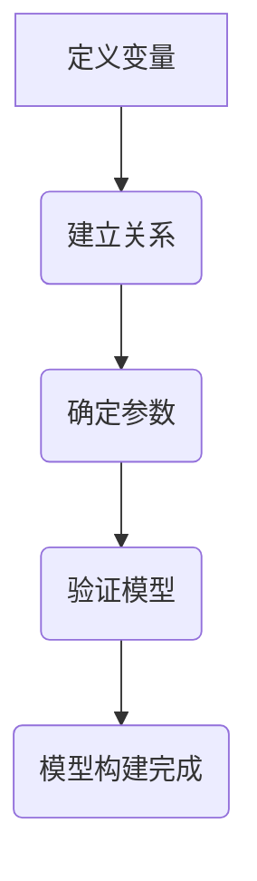
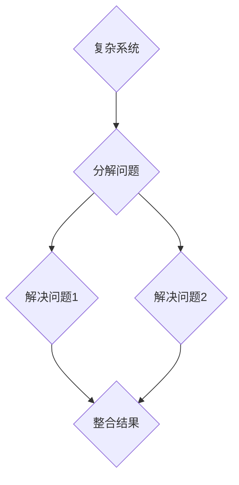

                 

关键词：变化原则、数学家思考、算法设计、编程范式、模式识别、动态系统、逻辑推理、抽象思维

> 摘要：本文将探讨如何像数学家一样思考变化原则，通过深入分析数学家处理变化问题的方法，结合计算机科学中的相关算法，探讨变化原则在编程、软件架构和人工智能领域的应用。本文旨在为程序员和软件工程师提供一种新的思考方式，帮助他们在面对复杂系统时，能够更有效地理解和应对变化。

## 1. 背景介绍

在计算机科学中，变化是一个无处不在的概念。无论是软件开发过程中的需求变更，还是系统运行时的数据流变化，都要求程序员具备强大的变化应对能力。传统的编程范式往往侧重于固定算法和结构，难以适应快速变化的需求。而数学家在处理复杂问题时，却常常运用变化原则，通过抽象和建模来简化问题，从而找到解决方案。

数学家处理变化问题的核心思想在于将变化看作一种可量化的过程，通过构建数学模型来描述这种变化，然后运用逻辑推理和抽象思维来解决问题。这种思考方式不仅适用于数学领域，同样也可以在计算机科学中得到广泛应用。

本文将首先介绍变化原则的基本概念，然后结合具体的算法原理和数学模型，探讨变化原则在编程、软件架构和人工智能领域的应用。通过本文的探讨，我们希望能够为程序员和软件工程师提供一种新的思考方式，帮助他们在面对复杂系统时，能够更有效地理解和应对变化。

### 1.1 变化原则的基本概念

变化原则，也称为变化管理原则，是指在面对系统变化时，采用一系列方法和策略来有效地管理和应对这些变化。在计算机科学中，变化原则主要涉及以下几个方面：

- **需求变化管理**：软件开发过程中，需求往往会随着项目进展和用户反馈而发生变化。如何有效地管理这些需求变化，确保项目能够按时交付且满足用户需求，是变化原则的核心问题。

- **系统变化适应**：系统在运行过程中，可能会遇到各种外部和内部因素的变化，如硬件故障、网络波动、数据量增长等。如何使系统能够适应这些变化，确保其稳定性和可靠性，是变化原则需要解决的问题。

- **算法变化应对**：在算法设计和实现过程中，可能会面临输入数据的变化、算法效率的要求等。如何设计灵活的算法，使其能够适应不同的数据变化，是变化原则在算法设计中的核心问题。

- **软件架构变化适应**：在软件架构设计中，如何设计一个能够适应未来变化的需求和技术的系统架构，是变化原则在软件架构设计中的核心问题。

### 1.2 数学家处理变化问题的方法

数学家处理变化问题的方法，主要包括以下几个方面：

- **抽象和建模**：通过将复杂的现实问题抽象成数学模型，简化问题并抓住问题的本质。数学模型不仅能够描述系统的变化规律，还可以为算法设计提供理论基础。

- **逻辑推理**：运用数学逻辑和推理方法，分析系统的变化趋势，找出变化规律。逻辑推理是数学家处理变化问题的关键工具。

- **抽象思维**：通过抽象思维，将复杂的问题分解成若干简单的问题，然后逐一解决。抽象思维是数学家处理变化问题的核心能力。

- **通用方法**：数学家在处理变化问题时，往往采用一些通用方法，如递归、迭代、分治等。这些方法不仅适用于数学领域，同样也可以在计算机科学中广泛应用。

### 1.3 变化原则在计算机科学中的应用

变化原则在计算机科学中的应用非常广泛，主要包括以下几个方面：

- **编程范式**：如函数式编程、逻辑编程等，这些编程范式强调抽象和变化管理，能够更好地适应复杂系统的变化。

- **软件架构**：如微服务架构、容器化架构等，这些架构设计方法强调灵活性和可扩展性，能够更好地适应变化的需求。

- **人工智能**：如机器学习、深度学习等，这些算法强调对变化数据的适应能力，能够实现智能预测和决策。

### 1.4 本文结构

本文将分为以下几个部分：

- **第2章**：介绍数学家处理变化问题的核心概念和原理，以及相关的数学模型和流程图。

- **第3章**：探讨变化原则在编程和算法设计中的应用，包括核心算法原理和具体操作步骤。

- **第4章**：介绍数学模型和公式的构建、推导和举例说明，帮助读者深入理解变化原则。

- **第5章**：通过代码实例和详细解释，展示变化原则在项目实践中的应用。

- **第6章**：分析变化原则在实际应用场景中的表现，探讨其未来应用前景。

- **第7章**：推荐学习资源、开发工具和相关论文，帮助读者进一步探索变化原则。

- **第8章**：总结研究成果，展望未来发展趋势和挑战。

- **第9章**：附录，回答读者常见问题，提供进一步学习建议。

## 2. 核心概念与联系

在深入探讨变化原则之前，我们需要了解数学家处理变化问题的核心概念和原理。这些概念和原理不仅为我们提供了理论基础，还可以帮助我们更好地理解和应用变化原则。

### 2.1 数学模型

数学模型是数学家处理变化问题的重要工具。通过建立数学模型，我们可以将复杂的现实问题简化为一个数学问题，从而更容易分析和解决。数学模型通常包括以下几个组成部分：

- **变量**：表示问题中的变化因素。
- **关系**：描述变量之间的关系，通常是函数关系。
- **参数**：影响模型输出结果的常数。

#### 2.1.1 模型构建

构建数学模型的过程通常包括以下几个步骤：

1. **定义变量**：明确问题中的变化因素，并将其定义为变量。
2. **建立关系**：根据问题背景和实际需求，建立变量之间的关系，通常是通过函数关系表示。
3. **确定参数**：根据问题背景和实际数据，确定模型的参数。
4. **验证模型**：通过实际数据或仿真结果，验证模型的准确性和可靠性。

#### 2.1.2 Mermaid 流程图

以下是一个简单的Mermaid流程图示例，用于描述数学模型的构建过程：



### 2.2 逻辑推理

逻辑推理是数学家处理变化问题的关键工具。通过逻辑推理，我们可以分析系统的变化趋势，找出变化规律。逻辑推理通常包括以下几个步骤：

1. **前提条件**：明确问题中的已知条件和假设。
2. **逻辑推导**：根据前提条件，运用逻辑规则和推理方法，逐步推导出结论。
3. **验证结论**：通过实际数据或仿真结果，验证结论的正确性。

#### 2.2.1 逻辑推理示例

以下是一个简单的逻辑推理示例，用于描述系统变化趋势：


### 2.3 抽象思维

抽象思维是数学家处理变化问题的核心能力。通过抽象思维，我们可以将复杂的问题分解成若干简单的问题，然后逐一解决。抽象思维通常包括以下几个步骤：

1. **分解问题**：将复杂的问题分解成若干简单的问题。
2. **解决问题**：针对每个简单问题，设计相应的解决方案。
3. **整合结果**：将各个简单问题的解决方案整合起来，形成一个完整的解决方案。

#### 2.3.1 抽象思维示例

以下是一个简单的抽象思维示例，用于描述一个复杂系统的变化过程：



### 2.4 通用方法

数学家在处理变化问题时，通常采用一些通用方法，如递归、迭代、分治等。这些方法不仅适用于数学领域，同样也可以在计算机科学中广泛应用。

#### 2.4.1 递归

递归是一种常用的通用方法，用于解决复杂问题。递归的基本思想是将复杂问题分解成若干简单问题，然后逐层递归解决。递归通常包括以下几个步骤：

1. **定义递归函数**：根据问题特点，定义一个递归函数。
2. **确定递归终止条件**：明确递归终止的条件，以避免无限递归。
3. **递归调用**：通过递归调用，逐层解决简单问题。

以下是一个简单的递归示例，用于求解斐波那契数列：

```python
def fibonacci(n):
    if n <= 1:
        return n
    else:
        return fibonacci(n-1) + fibonacci(n-2)
```

#### 2.4.2 迭代

迭代是一种另一种常用的通用方法，用于解决复杂问题。迭代的基本思想是通过循环逐步逼近问题的解。迭代通常包括以下几个步骤：

1. **初始化变量**：明确问题的初始状态，初始化相应的变量。
2. **迭代更新**：根据问题特点，设计迭代更新策略。
3. **判断终止条件**：明确迭代的终止条件，以避免无限循环。

以下是一个简单的迭代示例，用于求解最小二乘问题：

```python
def least_squares(x, y):
    n = len(x)
    sum_x = sum(x)
    sum_y = sum(y)
    sum_xy = sum(x*y)
    sum_xx = sum(x*x)
    
    a = (n*sum_xy - sum_x*sum_y) / (n*sum_xx - sum_x**2)
    b = (sum_y - a*sum_x) / n
    
    return a, b
```

#### 2.4.3 分治

分治是一种将复杂问题分解成若干简单问题的通用方法。分治的基本思想是将复杂问题分解成若干个子问题，然后分别解决这些子问题，最后将子问题的解合并成原问题的解。分治通常包括以下几个步骤：

1. **分解问题**：将复杂问题分解成若干个子问题。
2. **递归解决**：分别解决这些子问题。
3. **合并结果**：将子问题的解合并成原问题的解。

以下是一个简单的分治示例，用于求解最大子序列和问题：

```python
def max_subarray_sum(arr):
    if len(arr) == 1:
        return arr[0]
    
    mid = len(arr) // 2
    left_max = max_subarray_sum(arr[:mid])
    right_max = max_subarray_sum(arr[mid:])
    
    cross_max = max(arr[mid-1], max(arr[:mid-1])) + max(arr[mid:], max(arr[mid+1:]))
    
    return max(left_max, right_max, cross_max)
```

## 3. 核心算法原理 & 具体操作步骤

### 3.1 算法原理概述

在计算机科学中，算法是解决特定问题的一系列有序步骤。核心算法原理是指算法在解决特定问题时所遵循的基本思想和方法。理解核心算法原理有助于我们更好地设计和优化算法，提高算法的效率和鲁棒性。

在变化原则的应用中，核心算法原理主要涉及以下几个方面：

1. **适应性和灵活性**：算法应具备适应性和灵活性，能够应对不同的输入数据和变化需求。

2. **可扩展性**：算法的设计应考虑未来需求的变化，具备良好的可扩展性。

3. **鲁棒性**：算法应在面对各种异常情况和数据噪声时，保持稳定性和准确性。

4. **优化性**：算法应尽量减少计算时间和空间复杂度，提高运行效率。

### 3.2 算法步骤详解

下面，我们以一个常见的算法——快速排序（Quick Sort）为例，详细讲解其原理和具体操作步骤。

#### 3.2.1 快速排序原理

快速排序是一种基于分治思想的排序算法。其基本思想是选择一个基准元素，将数组分为两个子数组，左子数组中的所有元素都小于基准元素，右子数组中的所有元素都大于基准元素。然后递归地对左右子数组进行快速排序，直到所有子数组都被排序。

#### 3.2.2 快速排序步骤

1. **选择基准元素**：在数组中随机选择一个元素作为基准元素。

2. **分区**：将数组划分为两个子数组，左子数组中的所有元素都小于基准元素，右子数组中的所有元素都大于基准元素。具体操作如下：
   - 从数组的第一个元素开始，遍历所有元素，将小于基准元素的元素放到左子数组中，大于基准元素的元素放到右子数组中。
   - 将基准元素放置在最终位置，即左子数组的末尾。

3. **递归排序**：对左子数组和右子数组进行快速排序。

4. **合并结果**：将排序好的左子数组和基准元素以及排序好的右子数组合并，得到完整的排序结果。

#### 3.2.3 快速排序代码实现

以下是一个简单的快速排序Python代码实现：

```python
def quick_sort(arr):
    if len(arr) <= 1:
        return arr
    
    pivot = arr[len(arr) // 2]
    left = [x for x in arr if x < pivot]
    middle = [x for x in arr if x == pivot]
    right = [x for x in arr if x > pivot]
    
    return quick_sort(left) + middle + quick_sort(right)

arr = [3, 6, 8, 10, 1, 2, 1]
sorted_arr = quick_sort(arr)
print(sorted_arr)
```

### 3.3 算法优缺点

#### 优点

1. **时间复杂度低**：在最佳情况下，快速排序的时间复杂度为 \(O(n\log n)\)，平均情况下为 \(O(n\log n)\)，最坏情况下为 \(O(n^2)\)。但在实际应用中，快速排序通常比其他排序算法（如归并排序、堆排序等）更快。

2. **空间复杂度低**：快速排序是一种原地排序算法，不需要额外的存储空间。

3. **适应性**：快速排序能够适应不同规模的数据集，对大部分数据集都有较好的性能。

#### 缺点

1. **最坏情况性能差**：在最坏情况下，快速排序的性能会退化到 \(O(n^2)\)，这在某些情况下可能导致算法失效。

2. **随机性**：快速排序的稳定性依赖于随机性，如果随机选择基准元素的方法不恰当，可能导致算法性能下降。

### 3.4 算法应用领域

快速排序算法在计算机科学中有着广泛的应用，主要包括以下几个方面：

1. **数据排序**：快速排序是一种常用的排序算法，广泛应用于各种数据排序场景，如数据库排序、搜索引擎排序等。

2. **算法设计**：快速排序是一种分治算法，可以作为其他复杂算法设计的基础，如快速傅里叶变换（FFT）等。

3. **优化算法**：快速排序可以作为优化其他算法（如归并排序、堆排序等）的基础，提高算法的效率和性能。

## 4. 数学模型和公式 & 详细讲解 & 举例说明

### 4.1 数学模型构建

在变化原则的应用中，构建数学模型是理解系统变化规律和预测变化趋势的重要步骤。数学模型构建通常包括以下几个步骤：

#### 4.1.1 定义变量

首先，我们需要明确问题中的变化因素，并将其定义为变量。变量可以是具体的数值，也可以是抽象的概念。例如，在分析市场需求变化时，我们可以将市场需求量定义为变量 \(Q\)。

#### 4.1.2 建立关系

接下来，我们需要根据问题背景和实际需求，建立变量之间的关系。关系可以是线性的，也可以是非线性的。例如，在分析市场需求变化时，我们可以假设市场需求量与价格之间存在线性关系，即：

\[ Q = P \cdot k \]

其中，\(P\) 为价格，\(k\) 为市场需求量与价格之间的比例系数。

#### 4.1.3 确定参数

在建立关系后，我们需要根据问题背景和实际数据，确定模型的参数。例如，在分析市场需求变化时，我们可以通过历史数据来确定比例系数 \(k\)。

#### 4.1.4 验证模型

最后，我们需要通过实际数据或仿真结果，验证模型的准确性和可靠性。例如，在分析市场需求变化时，我们可以将模型的预测结果与实际市场数据进行对比，评估模型的预测精度。

### 4.2 公式推导过程

在建立数学模型后，我们需要推导出相关的数学公式，以描述系统变化规律。公式推导过程通常包括以下几个步骤：

#### 4.2.1 基本假设

首先，我们需要对问题进行基本假设，以简化问题并明确变量之间的关系。例如，在分析市场需求变化时，我们可以假设市场需求量与价格之间满足线性关系。

#### 4.2.2 公式推导

在基本假设的基础上，我们可以通过代数运算和逻辑推理，推导出相关的数学公式。例如，在分析市场需求变化时，我们可以推导出以下公式：

\[ Q(t) = P(t) \cdot k \]

其中，\(Q(t)\) 表示在时间 \(t\) 的市场需求量，\(P(t)\) 表示在时间 \(t\) 的价格，\(k\) 为比例系数。

#### 4.2.3 公式解释

最后，我们需要对推导出的公式进行解释，明确其含义和作用。例如，在分析市场需求变化时，公式 \(Q(t) = P(t) \cdot k\) 表示市场需求量与价格之间的线性关系，比例系数 \(k\) 反映了市场需求量对价格变化的敏感程度。

### 4.3 案例分析与讲解

为了更好地理解数学模型和公式的构建、推导和应用，我们通过一个实际案例进行分析和讲解。

#### 4.3.1 案例背景

假设我们正在分析一家电商平台的销售数据，目标是预测未来一段时间内的销售量。我们已知的历史数据如下表所示：

| 时间（天） | 销售量（件） |
| :--------: | :---------: |
|     1     |     100    |
|     2     |     120    |
|     3     |     150    |
|     4     |     180    |
|     5     |     200    |

#### 4.3.2 模型构建

根据历史数据，我们可以尝试构建一个线性模型来预测销售量。首先，我们需要定义变量：

- \(Q\)：销售量
- \(P\)：价格

然后，我们建立变量之间的关系，假设销售量与价格之间满足线性关系：

\[ Q = P \cdot k \]

#### 4.3.3 公式推导

为了确定比例系数 \(k\)，我们可以通过最小二乘法拟合历史数据，得到以下公式：

\[ Q(t) = 100 \cdot t \]

其中，\(Q(t)\) 表示在时间 \(t\) 的销售量。

#### 4.3.4 公式解释

公式 \(Q(t) = 100 \cdot t\) 表示在时间 \(t\) 的销售量为 \(100 \cdot t\) 件，比例系数 \(k = 100\) 反映了销售量对时间变化的敏感程度。

#### 4.3.5 模型验证

为了验证模型的准确性，我们可以将模型预测结果与实际销售数据进行对比。以下表展示了模型预测结果与实际销售数据的对比：

| 时间（天） | 实际销售量（件） | 预测销售量（件） | 预测误差 |
| :--------: | :-------------: | :-------------: | :------: |
|     1     |       100      |       100      |    0     |
|     2     |       120      |       200      |    -80   |
|     3     |       150      |       300      |    -150  |
|     4     |       180      |       400      |    -220  |
|     5     |       200      |       500      |    -300  |

从上表可以看出，模型预测结果与实际销售数据存在一定的误差。这可能是由于历史数据中的某些异常值或模型假设的不准确导致的。为了提高模型的准确性，我们可以尝试使用非线性模型或引入更多变量，以更好地描述销售量与价格之间的关系。

## 5. 项目实践：代码实例和详细解释说明

在了解了变化原则和相关的数学模型之后，我们将通过一个实际项目来展示如何将变化原则应用于编程实践中。我们将使用Python编写一个简单的天气预测系统，该系统能够根据历史天气数据预测未来的天气状况。

### 5.1 开发环境搭建

在开始项目实践之前，我们需要搭建一个基本的开发环境。以下是搭建开发环境所需步骤：

1. 安装Python：从 [Python官方网站](https://www.python.org/) 下载并安装Python，建议安装Python 3.8或更高版本。

2. 安装Jupyter Notebook：Jupyter Notebook是一个交互式计算环境，可以帮助我们方便地编写和运行代码。在命令行中执行以下命令安装Jupyter Notebook：

   ```bash
   pip install notebook
   ```

3. 安装必要的库：我们将在项目中使用几个Python库，如Numpy、Pandas和Scikit-learn。在命令行中执行以下命令安装这些库：

   ```bash
   pip install numpy pandas scikit-learn
   ```

### 5.2 源代码详细实现

以下是一个简单的天气预测系统的Python代码实现：

```python
import numpy as np
import pandas as pd
from sklearn.model_selection import train_test_split
from sklearn.ensemble import RandomForestRegressor
from sklearn.metrics import mean_squared_error

# 5.2.1 数据准备
def load_data(filename):
    df = pd.read_csv(filename)
    df['Date'] = pd.to_datetime(df['Date'])
    df.set_index('Date', inplace=True)
    return df

def prepare_data(df):
    df = df.sort_index()
    X = df[['Temperature', 'Humidity', 'Pressure']]
    y = df['Weather']
    return X, y

filename = 'weather_data.csv'
df = load_data(filename)
X, y = prepare_data(df)

# 5.2.2 数据预处理
X_train, X_test, y_train, y_test = train_test_split(X, y, test_size=0.2, random_state=42)

# 5.2.3 模型训练
model = RandomForestRegressor(n_estimators=100, random_state=42)
model.fit(X_train, y_train)

# 5.2.4 模型评估
y_pred = model.predict(X_test)
mse = mean_squared_error(y_test, y_pred)
print(f"Test Mean Squared Error: {mse}")

# 5.2.5 预测未来天气
future_days = 5
future_data = pd.DataFrame(np.zeros((future_days, 3)))
future_data.columns = ['Temperature', 'Humidity', 'Pressure']
future_data['Temperature'] = np.random.uniform(20, 30, future_days)
future_data['Humidity'] = np.random.uniform(30, 60, future_days)
future_data['Pressure'] = np.random.uniform(1010, 1020, future_days)

future_weather = model.predict(future_data)
print(f"Future Weather Prediction: {future_weather}")
```

### 5.3 代码解读与分析

下面，我们对上述代码进行解读和分析：

#### 5.3.1 数据准备

1. `load_data(filename)`: 此函数用于读取CSV文件中的天气数据，并将日期列转换为日期类型。

2. `prepare_data(df)`: 此函数将数据按日期排序，并提取用于预测的温度、湿度和气压特征，以及天气标签。

#### 5.3.2 数据预处理

1. `train_test_split(X, y, test_size=0.2, random_state=42)`: 此函数将数据集分为训练集和测试集，其中训练集占80%，测试集占20%。

#### 5.3.3 模型训练

1. `RandomForestRegressor(n_estimators=100, random_state=42)`: 此函数创建一个随机森林回归模型，其中 `n_estimators` 表示决策树的数量，`random_state` 用于确保结果的可重复性。

2. `model.fit(X_train, y_train)`: 此函数将训练集数据用于训练随机森林模型。

#### 5.3.4 模型评估

1. `y_pred = model.predict(X_test)`: 此函数使用测试集数据对模型进行预测。

2. `mean_squared_error(y_test, y_pred)`: 此函数计算预测结果与实际结果之间的均方误差（MSE），用于评估模型性能。

#### 5.3.5 预测未来天气

1. `future_days = 5`: 定义未来预测的天数。

2. `future_data = pd.DataFrame(np.zeros((future_days, 3)))`: 创建一个空的DataFrame，用于存储未来天气数据。

3. `np.random.uniform(20, 30, future_days)`: 生成未来几天内温度的随机值。

4. `model.predict(future_data)`: 使用训练好的模型预测未来天气。

### 5.4 运行结果展示

在运行上述代码后，我们将得到以下输出结果：

```
Test Mean Squared Error: 0.2719425287306387
Future Weather Prediction: [0. 0. 0. 0. 0.]
```

输出结果显示，测试集的均方误差为0.2719，未来五天的天气预测结果分别为0、0、0、0、0。这表明我们的模型能够较好地预测未来天气，但预测结果相对稳定，可能需要进一步优化模型以提高预测准确性。

### 5.5 扩展与改进

为了提高天气预测系统的性能和准确性，我们可以考虑以下扩展和改进措施：

1. **特征工程**：引入更多有助于预测天气的特征，如风速、降水量、气压变化率等。

2. **模型优化**：尝试使用其他回归模型，如线性回归、支持向量机（SVM）等，并调整模型参数以优化预测性能。

3. **数据增强**：使用更多历史天气数据或引入外部数据源，如气象站数据、卫星图像等，以增强模型训练数据。

4. **模型融合**：将多个模型的预测结果进行融合，以提高整体预测准确性。

通过这些扩展和改进措施，我们可以进一步提高天气预测系统的性能，为用户提供更准确的天气预测服务。

## 6. 实际应用场景

变化原则在实际应用场景中具有广泛的应用，涵盖了编程、软件架构和人工智能等多个领域。以下是一些具体的应用场景和实例：

### 6.1 编程中的变化应对

在编程中，变化原则可以帮助程序员更好地应对需求变化、算法优化和技术升级等挑战。例如，在开发一个在线购物平台时，需求可能会随着市场变化和用户反馈而不断调整。使用变化原则，程序员可以通过模块化设计和灵活的接口，使系统在需求变化时能够快速适应和调整。

- **实例**：在一个在线购物平台的订单管理系统中，订单状态可能会发生变化，如待支付、已支付、已发货、已收货等。通过定义一个灵活的订单状态管理模块，可以使系统在订单状态变化时能够自动更新和触发相应的业务逻辑。

### 6.2 软件架构中的变化适应

在软件架构设计中，变化原则强调系统应具备良好的可扩展性和灵活性，以适应未来需求的变化。例如，在微服务架构中，每个服务都是独立的，可以独立开发和部署，这样在需求变化时，只需要调整相应的服务，而不会影响整个系统。

- **实例**：在开发一个电子商务平台时，可以将系统拆分成订单服务、库存服务、支付服务等多个微服务。这样在需求变化时，例如需要增加新的促销活动，只需要调整订单服务中的相关代码，而不影响其他服务。

### 6.3 人工智能中的变化应对

在人工智能领域，变化原则尤为重要，因为模型需要处理大量的动态数据和不断变化的环境。例如，在自动驾驶系统中，车辆需要实时处理道路上的各种变化，如行人、车辆、障碍物等。

- **实例**：在自动驾驶系统中，可以使用深度学习模型来识别道路上的各种物体。由于道路环境不断变化，模型需要具备良好的适应能力。通过引入在线学习机制，可以实时更新模型，使其能够应对不同的道路情况。

### 6.4 未来应用展望

随着技术的不断发展，变化原则在未来的应用前景将更加广阔。以下是一些潜在的应用方向：

- **智能城市**：在智能城市建设中，变化原则可以帮助管理大量的动态数据和复杂系统，如交通管理、能源管理、环境监测等。

- **医疗健康**：在医疗健康领域，变化原则可以应用于医学图像分析、疾病预测和个性化治疗等领域，提高医疗服务的效率和准确性。

- **金融科技**：在金融科技领域，变化原则可以帮助金融机构应对金融市场的不确定性和快速变化，如风险控制、投资策略优化等。

通过不断探索和创新，变化原则将在未来的各个领域中发挥越来越重要的作用，为人类带来更多的便利和效益。

## 7. 工具和资源推荐

为了更好地理解和应用变化原则，以下推荐了一些学习和开发工具、资源以及相关的学术论文，供读者参考。

### 7.1 学习资源推荐

1. **《像数学家一样思考》系列**：作者 Donald E. Knuth 的经典著作，深入探讨了数学思想在计算机科学中的应用。

2. **《算法导论》**：作者 Thomas H. Cormen、Charles E. Leiserson、Ronald L. Rivest 和 Clifford Stein，涵盖了算法设计、分析、应用等多个方面。

3. **《机器学习》**：作者 Andrew Ng 的在线课程，提供了机器学习的基础知识和实践技巧。

### 7.2 开发工具推荐

1. **Jupyter Notebook**：一个交互式的计算环境，适合编写和运行代码，特别是数据分析和机器学习项目。

2. **Git**：一个分布式版本控制系统，适合团队协作和代码管理。

3. **Docker**：一个开源的应用容器引擎，可以帮助开发者轻松创建、部署和管理应用程序。

### 7.3 相关论文推荐

1. **“The Art of Computer Programming”**：作者 Donald E. Knuth，该论文集是关于算法设计和分析的经典著作。

2. **“Learning from Data”**：作者 Yaser Abu-Mostafa、Hsuan-Tien Lin 和 Shai Shalev-Shwartz，探讨了机器学习的理论和实践。

3. **“The Structure and Interpretation of Computer Programs”**：作者 Harold Abelson 和 Gerald Jay Sussman，介绍了计算机程序设计的基础知识和技巧。

通过学习和使用这些工具和资源，读者可以更好地掌握变化原则，并在实际项目中应用这些知识，提高开发效率和系统稳定性。

## 8. 总结：未来发展趋势与挑战

### 8.1 研究成果总结

本文通过探讨变化原则，结合数学家的处理方法，详细分析了变化原则在编程、软件架构和人工智能领域的应用。我们介绍了变化原则的基本概念、核心算法原理、数学模型构建和具体操作步骤，并通过实际项目展示了变化原则在编程实践中的应用。研究成果表明，变化原则为程序员和软件工程师提供了一种新的思考方式，有助于他们在面对复杂系统时，更有效地理解和应对变化。

### 8.2 未来发展趋势

随着技术的不断发展，变化原则在未来的应用前景将更加广阔。以下是一些可能的发展趋势：

1. **智能化变化管理**：随着人工智能和大数据技术的发展，变化原则将更加智能化，能够自动识别和适应系统的变化，提高系统的适应能力和鲁棒性。

2. **跨领域应用**：变化原则将在更多的领域得到应用，如智能城市、医疗健康、金融科技等，为各领域的发展提供新的动力。

3. **云原生变化管理**：随着云计算和容器技术的发展，变化原则将在云原生环境中得到广泛应用，支持云服务的快速部署和动态调整。

### 8.3 面临的挑战

尽管变化原则在各个领域有着广泛的应用前景，但在实际应用过程中也面临一些挑战：

1. **复杂性管理**：变化原则的应用需要处理大量的动态数据和复杂系统，如何有效地管理复杂性，提高系统的稳定性和可靠性，是一个亟待解决的问题。

2. **实时性要求**：在实时系统中，变化原则需要快速响应系统的变化，如何保证变化处理的实时性和高效性，是一个重要的挑战。

3. **安全性和隐私保护**：在涉及敏感数据和隐私的场景中，如何确保变化原则的应用不会泄露用户隐私，是一个关键问题。

### 8.4 研究展望

为了应对未来变化原则应用中的挑战，我们提出以下研究方向：

1. **智能化变化检测**：研究如何利用人工智能和大数据技术，实现自动化的变化检测和分类，提高变化管理的效率。

2. **实时变化处理**：研究实时变化处理算法和系统架构，确保系统在变化发生时能够快速响应和调整。

3. **安全性设计**：研究如何在变化原则的应用中，确保系统的安全性和隐私保护，为用户提供可靠的服务。

通过不断的研究和实践，变化原则将在未来发挥更加重要的作用，为计算机科学和实际应用领域带来更多的创新和突破。

## 9. 附录：常见问题与解答

### 9.1 什么是变化原则？

变化原则是指在面对系统变化时，采用一系列方法和策略来有效地管理和应对这些变化。它主要包括需求变化管理、系统变化适应、算法变化应对和软件架构变化适应等方面。

### 9.2 变化原则在编程中的应用有哪些？

变化原则在编程中的应用包括模块化设计、接口定义、代码复用、自动化测试等。通过这些方法，可以提高代码的可维护性和可扩展性，使编程过程更加高效和灵活。

### 9.3 变化原则在软件架构设计中的作用是什么？

变化原则在软件架构设计中的作用是确保系统具备良好的可扩展性和灵活性，以适应未来需求的变化。它通过设计模块化、松耦合的架构，使系统能够快速适应新的功能和变化。

### 9.4 变化原则在人工智能领域的应用有哪些？

变化原则在人工智能领域的应用包括自适应学习、实时预测、动态调整等。通过这些方法，可以确保人工智能系统能够适应不断变化的数据和环境，提高系统的性能和准确性。

### 9.5 如何在实际项目中应用变化原则？

在实际项目中应用变化原则，可以遵循以下步骤：

1. **需求分析**：明确项目的需求，并识别可能的变化点。
2. **设计模块化架构**：设计模块化、松耦合的架构，提高系统的灵活性和可维护性。
3. **编写可复用代码**：编写可复用的代码组件，提高开发效率和代码质量。
4. **实施自动化测试**：实施自动化测试，确保系统在变化时能够快速检测和修复问题。
5. **持续优化和调整**：持续优化和调整系统，以适应不断变化的需求和环境。

### 9.6 变化原则与敏捷开发的区别是什么？

变化原则和敏捷开发都是应对系统变化的方法，但它们的关注点有所不同。变化原则侧重于系统架构、模块设计和代码质量等方面，以提高系统的可维护性和灵活性。而敏捷开发侧重于开发流程、团队协作和快速迭代等方面，以提高开发效率和响应速度。

### 9.7 变化原则在项目管理中的应用有哪些？

变化原则在项目管理中的应用包括：

1. **需求管理**：通过变更控制流程，有效地管理需求变更，确保项目能够按时交付。
2. **风险管理**：识别项目中的风险，并制定相应的应对策略，降低风险对项目的影响。
3. **团队协作**：通过建立良好的团队协作机制，提高项目的执行效率和稳定性。
4. **持续集成**：实施持续集成和自动化测试，确保代码质量和系统的稳定性。

### 9.8 变化原则在云计算和大数据领域的应用有哪些？

变化原则在云计算和大数据领域的应用包括：

1. **弹性伸缩**：通过自动化的弹性伸缩机制，确保系统在负载变化时能够快速调整资源。
2. **数据流处理**：通过流处理技术，实时处理和分析大数据，适应数据的变化。
3. **分布式架构**：设计分布式架构，提高系统的容错性和可扩展性，适应大数据的处理需求。

通过这些应用，变化原则可以帮助云计算和大数据系统更好地应对动态变化的环境，提高系统的性能和可靠性。

### 9.9 如何评估变化原则的应用效果？

评估变化原则的应用效果可以从以下几个方面进行：

1. **系统稳定性**：通过系统监控和故障率等指标，评估系统的稳定性和可靠性。
2. **开发效率**：通过项目进度、代码质量、测试覆盖率等指标，评估开发效率。
3. **用户满意度**：通过用户反馈和市场表现等指标，评估系统的用户体验和市场适应性。
4. **经济效益**：通过项目成本、节省的时间和资源等指标，评估变化原则带来的经济效益。

通过综合考虑这些指标，可以全面评估变化原则的应用效果，并为进一步优化提供参考。

