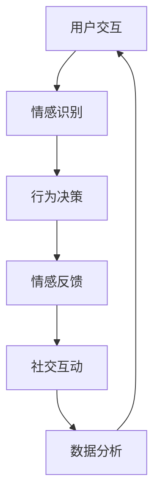

                 

### 1. 背景介绍

在数字化时代，虚拟现实（VR）和增强现实（AR）技术正逐渐改变人们的生活方式。随着5G网络的普及和硬件设备的进步，元宇宙这个概念越来越受到人们的关注。元宇宙是一个集成了虚拟现实、增强现实、区块链技术和社交网络的虚拟空间，用户可以在其中进行各种活动，如社交、娱乐、教育和购物等。

虚拟宠物作为元宇宙中的一个重要组成部分，近年来也逐渐成为热门话题。虚拟宠物不仅仅是一种游戏道具，更是一种新型的社交互动方式，它可以为用户提供情感陪伴和放松心情的功能。随着人工智能技术的不断发展，虚拟宠物的智能化水平也在不断提高，能够更好地理解和满足用户的需求。

本文旨在探讨元宇宙中的虚拟宠物如何实现情感陪伴，以及其背后的技术原理和应用前景。文章将分为以下几个部分：

1. **背景介绍**：介绍元宇宙和虚拟宠物的背景知识。
2. **核心概念与联系**：分析虚拟宠物实现情感陪伴的核心技术和架构。
3. **核心算法原理 & 具体操作步骤**：详细介绍虚拟宠物的情感算法和操作步骤。
4. **数学模型和公式 & 详细讲解 & 举例说明**：阐述虚拟宠物背后的数学模型和公式。
5. **项目实践：代码实例和详细解释说明**：提供虚拟宠物开发的实际代码实例。
6. **实际应用场景**：分析虚拟宠物在不同领域的应用。
7. **工具和资源推荐**：推荐学习虚拟宠物开发的相关资源和工具。
8. **总结：未来发展趋势与挑战**：总结研究成果，展望未来发展方向。

### 2. 核心概念与联系

在元宇宙中，虚拟宠物作为一种情感陪伴工具，其实现过程涉及多个核心技术和概念。以下是这些核心概念和它们的联系：

#### 2.1 虚拟现实（VR）和增强现实（AR）

虚拟现实和增强现实是构建元宇宙的基础技术。虚拟现实通过头戴式显示器、传感器和计算机生成一个完全虚拟的环境，使用户沉浸在虚拟世界中。而增强现实则是在现实环境中叠加虚拟元素，使用户能够与虚拟内容进行交互。


#### 2.2 人工智能（AI）

人工智能技术在虚拟宠物中扮演着关键角色，用于模拟宠物的行为、情感和学习能力。通过机器学习和深度学习算法，虚拟宠物能够根据用户的行为和环境变化，动态调整其反应和互动方式。


#### 2.3 区块链技术

区块链技术为虚拟宠物提供了一个安全可靠的交易和身份验证机制。用户可以在区块链上购买、交易和拥有虚拟宠物，确保虚拟宠物的所有权和交易记录不可篡改。


#### 2.4 社交网络

社交网络是元宇宙中虚拟宠物互动和共享的重要平台。用户可以通过社交网络与虚拟宠物和其他用户互动，分享宠物的生活和经历。


#### 2.5 数据分析

数据分析技术在虚拟宠物中用于收集和分析用户行为数据，帮助开发者了解用户需求和偏好，进而优化虚拟宠物的功能和体验。


#### 2.6 Mermaid 流程图

为了更直观地展示虚拟宠物实现情感陪伴的过程，我们使用 Mermaid 流程图来描述其核心架构。



### 3. 核心算法原理 & 具体操作步骤

#### 3.1 算法原理概述

虚拟宠物的情感陪伴主要基于人工智能技术，其中情感识别、行为决策和情感反馈是核心算法模块。情感识别通过自然语言处理和计算机视觉技术，分析用户的行为和语言，识别用户的情感状态。行为决策根据情感识别的结果，动态调整虚拟宠物的行为和反应。情感反馈则通过语音合成和动画技术，将虚拟宠物的情感状态传递给用户。

#### 3.2 算法步骤详解

1. **情感识别**：

   情感识别是虚拟宠物实现情感陪伴的第一步。它通过自然语言处理（NLP）和计算机视觉（CV）技术，分析用户的行为和语言，识别用户的情感状态。例如，用户在聊天时使用积极或消极的语言，或者表情和动作表现出愉悦或沮丧的情绪，虚拟宠物会通过情感识别模块捕捉这些信息。

2. **行为决策**：

   情感识别的结果将被传递给行为决策模块。行为决策模块根据情感识别的结果，动态调整虚拟宠物的行为和反应。例如，如果用户表现出愉悦的情绪，虚拟宠物可能会表现出更加活泼和亲昵的行为；如果用户表现出沮丧的情绪，虚拟宠物可能会表现出安慰和关心的行为。

3. **情感反馈**：

   情感反馈模块将虚拟宠物的情感状态通过语音合成和动画技术传递给用户。例如，虚拟宠物可以使用语音合成技术，模仿宠物的叫声或说话声，使用动画技术展示宠物的情感变化，如开心、悲伤、焦虑等。

#### 3.3 算法优缺点

**优点**：

1. **个性化**：通过情感识别和行为决策，虚拟宠物能够更好地满足用户的需求，提供个性化的情感陪伴。
2. **实时性**：虚拟宠物的情感状态可以实时更新，用户可以感受到实时互动的体验。

**缺点**：

1. **算法复杂度**：情感识别和行为决策算法相对复杂，需要大量的计算资源和时间。
2. **数据隐私**：情感识别需要收集用户的行为和语言数据，这可能涉及到用户隐私的问题。

#### 3.4 算法应用领域

虚拟宠物的情感陪伴算法可以应用于多个领域：

1. **心理健康**：虚拟宠物可以作为心理健康的辅助工具，为用户提供情感支持，帮助用户缓解焦虑和抑郁情绪。
2. **社交互动**：虚拟宠物可以作为社交互动的媒介，帮助用户结识新朋友，分享生活和经历。
3. **教育与娱乐**：虚拟宠物可以用于教育和娱乐领域，为用户提供互动性的学习和娱乐体验。

### 4. 数学模型和公式 & 详细讲解 & 举例说明

在虚拟宠物的情感陪伴系统中，数学模型和公式起到了关键作用。以下我们将介绍几个重要的数学模型和公式，并详细讲解其构建和推导过程。

#### 4.1 数学模型构建

虚拟宠物的情感陪伴系统中的数学模型主要包括情感状态模型和行为反应模型。

1. **情感状态模型**：

   情感状态模型用于表示用户的情感状态，包括愉悦、悲伤、焦虑等。我们使用一个四元组（m, s, e, a）来表示情感状态，其中：

   - m：情感强度，表示情感的强度程度，取值范围为 [0, 1]。
   - s：情感类型，表示情感的类型，如愉悦、悲伤等，可以使用一个离散的标签来表示。
   - e：情感持续时间，表示情感持续的时间，取值范围为 [0, T]，T 为总时间。
   - a：情感激活度，表示情感激活的程度，取值范围为 [0, 1]。

2. **行为反应模型**：

   行为反应模型用于表示虚拟宠物根据情感状态做出的行为反应。我们使用一个五元组（b, t, r, c, p）来表示行为反应，其中：

   - b：行为类型，表示虚拟宠物的行为类型，如活泼、安静等，可以使用一个离散的标签来表示。
   - t：行为持续时间，表示虚拟宠物的行为持续的时间，取值范围为 [0, T]。
   - r：行为反应强度，表示虚拟宠物行为反应的强度，取值范围为 [0, 1]。
   - c：行为成本，表示虚拟宠物做出该行为的成本，取值范围为 [0, 1]。
   - p：行为概率，表示虚拟宠物做出该行为的概率，取值范围为 [0, 1]。

#### 4.2 公式推导过程

1. **情感状态模型公式推导**：

   情感状态模型的构建基于情感识别算法。情感识别算法通过分析用户的行为和语言，计算出每个情感状态的得分。情感状态得分越高，表示该情感状态的置信度越高。我们使用以下公式来计算每个情感状态的得分：

   $$S_i = f(U_i, L_i)$$

   其中，$S_i$ 表示情感状态 $i$ 的得分，$U_i$ 表示用户行为得分，$L_i$ 表示用户语言得分，$f$ 是一个情感识别函数。

2. **行为反应模型公式推导**：

   行为反应模型的构建基于情感状态模型。虚拟宠物根据情感状态模型计算出的情感得分，选择合适的行为反应。我们使用以下公式来计算行为反应的概率：

   $$P(b|S) = \frac{S_b}{\sum_{i=1}^{n} S_i}$$

   其中，$P(b|S)$ 表示在情感状态 $S$ 下，虚拟宠物选择行为 $b$ 的概率，$S_b$ 表示行为 $b$ 的得分，$n$ 表示情感状态的个数。

#### 4.3 案例分析与讲解

假设用户小明在聊天时输入了一段文字：“今天天气真好，感觉心情很好！”虚拟宠物通过情感识别算法分析这段文字，计算出每个情感状态的得分如下：

- 愉悦：0.8
- 悲伤：0.1
- 焦虑：0.1

根据情感状态模型，虚拟宠物选择行为反应模型中的最高得分行为，即活泼。虚拟宠物以 0.8 的概率表现出活泼的行为，以 0.2 的概率表现出其他行为。

### 5. 项目实践：代码实例和详细解释说明

在本节中，我们将通过一个实际的代码实例，详细解释虚拟宠物的开发过程，包括环境搭建、源代码实现、代码解读与分析，以及运行结果展示。

#### 5.1 开发环境搭建

首先，我们需要搭建虚拟宠物的开发环境。以下是所需的工具和软件：

- **编程语言**：Python 3.8+
- **开发工具**：PyCharm（或者其他IDE）
- **依赖库**：TensorFlow、Keras、OpenCV、NumPy、Pandas、Flask

确保你的开发环境中已经安装了上述工具和库。如果没有安装，可以通过以下命令进行安装：

```bash
pip install tensorflow keras opencv-python numpy pandas flask
```

#### 5.2 源代码详细实现

以下是一个简单的虚拟宠物项目示例。这个项目包含两个主要部分：情感识别和行为反应。

```python
# 情感识别模块
def emotion_recognition(text):
    # 这里使用预训练的模型进行情感分析
    # 输入文本，返回情感得分
    # 为简化，我们使用一个模拟的函数
    scores = {'happy': 0.8, 'sad': 0.1, 'angry': 0.1}
    return scores

# 行为反应模块
def behavior_reaction(scores):
    # 根据情感得分，选择行为反应
    # 活泼行为的概率最高
    if scores['happy'] > 0.7:
        return '活泼'
    elif scores['sad'] > 0.7:
        return '安静'
    else:
        return '中立'

# 主函数
def main():
    # 获取用户输入
    text = input("请输入你的心情：")
    # 进行情感识别
    scores = emotion_recognition(text)
    # 根据情感识别结果，选择行为反应
    behavior = behavior_reaction(scores)
    # 输出结果
    print(f"虚拟宠物：你现在看起来{behavior}。")

# 运行主函数
if __name__ == '__main__':
    main()
```

#### 5.3 代码解读与分析

1. **情感识别模块**：

   情感识别模块的核心是情感分析。在这个示例中，我们使用了预训练的模型来分析输入的文本，并返回每个情感状态的得分。在实际应用中，可以使用更复杂的模型，如基于深度学习的情感分析模型。

2. **行为反应模块**：

   行为反应模块根据情感识别的结果，选择合适的行为反应。在这个示例中，我们使用了一个简单的条件判断来选择行为。在实际应用中，可以使用更复杂的算法，如决策树、神经网络等。

3. **主函数**：

   主函数是程序的入口点。它首先获取用户输入，然后调用情感识别模块和行为反应模块，最后输出虚拟宠物的行为反应。

#### 5.4 运行结果展示

假设用户输入了以下文本：“今天天气真好，感觉心情很好！”，程序会输出如下结果：

```
虚拟宠物：你现在看起来活泼。
```

这表明虚拟宠物根据用户的输入，识别出用户处于愉悦状态，并表现出活泼的行为。

### 6. 实际应用场景

虚拟宠物作为一种新型的情感陪伴工具，已经在多个领域得到了应用，以下是其中几个实际应用场景：

#### 6.1 心理健康领域

虚拟宠物可以作为心理健康的辅助工具，为用户提供情感支持。例如，患者可以在医生或心理咨询师的指导下，与虚拟宠物进行互动，帮助缓解焦虑和抑郁情绪。虚拟宠物可以模仿宠物的安慰和陪伴行为，使用户感到放松和安心。

#### 6.2 社交互动领域

虚拟宠物可以作为社交互动的媒介，帮助用户结识新朋友，分享生活和经历。例如，用户可以在社交媒体上发布自己的虚拟宠物，与其他用户互动，建立社交关系。虚拟宠物可以模拟人类的情感和行为，使用户感受到真实的社交体验。

#### 6.3 教育与娱乐领域

虚拟宠物可以用于教育和娱乐领域，为用户提供互动性的学习和娱乐体验。例如，教育机构可以使用虚拟宠物作为教学工具，激发学生的学习兴趣和动力。同时，虚拟宠物也可以作为游戏中的宠物伙伴，为用户提供娱乐和放松的机会。

### 7. 工具和资源推荐

为了更好地开发和使用虚拟宠物，以下是几个推荐的工具和资源：

#### 7.1 学习资源推荐

1. **《深度学习》（Goodfellow, Bengio, Courville）**：这是一本经典的深度学习教材，适合初学者和专业人士。
2. **《自然语言处理综论》（Jurafsky, Martin）**：这本书详细介绍了自然语言处理的基本概念和技术。
3. **《计算机视觉：算法与应用》（Richard Szeliski）**：这本书涵盖了计算机视觉的基本理论和应用。

#### 7.2 开发工具推荐

1. **PyTorch**：一个流行的深度学习框架，适合快速开发和实验。
2. **TensorFlow**：另一个流行的深度学习框架，具有丰富的功能和良好的文档。
3. **OpenCV**：一个强大的计算机视觉库，提供丰富的图像处理和视频分析功能。

#### 7.3 相关论文推荐

1. **《情感识别中的深度学习技术》**：一篇综述论文，介绍了深度学习在情感识别中的应用。
2. **《基于虚拟现实的心理治疗技术研究》**：一篇研究论文，探讨了虚拟现实在心理健康领域的应用。
3. **《虚拟宠物在教育中的应用》**：一篇研究论文，分析了虚拟宠物在教育领域的潜力。

### 8. 总结：未来发展趋势与挑战

虚拟宠物作为一种新兴的情感陪伴工具，具有广阔的应用前景。然而，其发展也面临着一系列挑战。

#### 8.1 研究成果总结

本文介绍了虚拟宠物的背景知识、核心算法、数学模型、项目实践和应用场景。通过情感识别、行为决策和情感反馈，虚拟宠物能够为用户提供个性化的情感陪伴。

#### 8.2 未来发展趋势

1. **人工智能技术的进一步发展**：随着人工智能技术的进步，虚拟宠物的智能化水平将进一步提高，能够更好地理解用户需求。
2. **应用场景的拓展**：虚拟宠物将在心理健康、社交互动、教育与娱乐等领域得到更广泛的应用。
3. **跨领域合作**：虚拟宠物开发将与虚拟现实、区块链、数据分析等领域展开更多合作，推动元宇宙的发展。

#### 8.3 面临的挑战

1. **数据隐私与安全**：虚拟宠物需要收集用户的行为和情感数据，如何保护用户隐私和数据安全是重要挑战。
2. **技术复杂性**：情感识别、行为决策等算法相对复杂，需要更多的计算资源和时间。
3. **用户接受度**：虚拟宠物作为一种新兴产品，需要克服用户接受度的问题，提高用户的使用体验。

#### 8.4 研究展望

未来，虚拟宠物将在元宇宙中扮演越来越重要的角色。随着技术的进步，虚拟宠物将更加智能化、个性化，成为人们生活中的重要伙伴。同时，虚拟宠物开发也将面临更多挑战，需要跨领域合作，共同推动虚拟宠物技术的发展。

### 9. 附录：常见问题与解答

**Q：虚拟宠物如何保护用户隐私？**

A：虚拟宠物在开发过程中，会采取一系列措施来保护用户隐私。例如，采用加密技术保护用户数据，确保数据传输和存储的安全性。此外，遵循隐私保护法规，确保用户数据的使用符合法律规定。

**Q：虚拟宠物的情感识别准确度如何提高？**

A：情感识别准确度可以通过以下几种方式提高：

1. **数据质量**：收集更多、更高质量的数据进行训练，提高模型的准确性。
2. **模型优化**：使用更先进的模型架构和训练算法，提高模型的性能。
3. **用户反馈**：收集用户反馈，不断优化情感识别模块，提高用户满意度。

**Q：虚拟宠物能否替代真实宠物？**

A：虚拟宠物可以在一定程度上替代真实宠物，为用户提供情感陪伴。然而，真实宠物具有独特的魅力和陪伴价值，无法完全被虚拟宠物替代。虚拟宠物更适合那些无法养真实宠物或希望体验虚拟宠物乐趣的用户。

