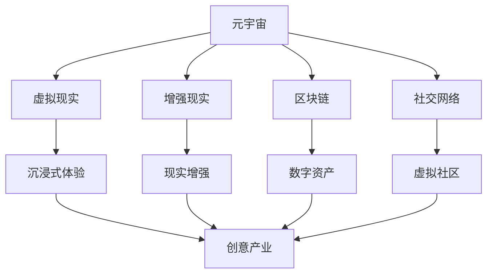

                 

关键词：元宇宙，创意产业，想象力，数字艺术，虚拟现实，技术融合，创新应用

> 摘要：本文将深入探讨元宇宙创意产业如何通过创新技术激发人类想象力，构建一个前所未有的虚拟世界，带动文化、艺术、娱乐等多个领域的发展。我们将从核心概念、算法原理、数学模型、项目实践等多个角度，分析元宇宙创意产业的现状、潜力以及未来发展方向。

## 1. 背景介绍

随着互联网技术的飞速发展，人类社会逐渐迈入了数字化的新时代。而元宇宙（Metaverse）作为当前最热门的概念之一，正日益受到各界的关注。元宇宙，可以被理解为“增强的互联网”，它不仅包含了虚拟现实（VR）、增强现实（AR）、区块链等前沿技术，还涉及社交、娱乐、教育、艺术等多个领域。创意产业，则是指以创意为核心，通过创造性活动产生经济价值的行业。从电影、音乐、设计到游戏、虚拟商品等，创意产业无处不在。

近年来，随着技术的不断进步，元宇宙创意产业逐渐崛起，成为推动经济发展的重要引擎。据相关报告显示，全球元宇宙市场规模预计将在未来几年内达到万亿美元级别。这一市场规模的扩大，不仅带来了巨大的经济利益，还激发了人类无尽的想象力，为各行各业带来了无限的可能性。

## 2. 核心概念与联系

### 2.1. 元宇宙的基本概念

元宇宙，可以被理解为“虚拟的互联网”，它是一个由虚拟世界、现实世界和数字世界相互交织而成的生态系统。在这个生态系统中，人们可以通过虚拟现实头盔、智能设备等工具，进入一个全新的虚拟世界，进行社交、娱乐、购物、学习等活动。

### 2.2. 虚拟现实与增强现实

虚拟现实（VR）和增强现实（AR）是元宇宙中不可或缺的技术。VR通过模拟技术，将用户带入一个完全虚拟的世界，使用户获得身临其境的感受。而AR则通过将虚拟元素叠加到现实世界中，使用户在现实环境中感受到虚拟元素的存在。

### 2.3. 区块链与数字资产

区块链技术是元宇宙的基石，它通过去中心化的方式，确保数据的真实性和安全性。在元宇宙中，数字资产成为一种新的财富形式，如虚拟货币、数字商品等。这些资产可以在元宇宙中自由交易，推动了数字经济的发展。

### 2.4. 社交网络与虚拟社区

社交网络是元宇宙中最重要的组成部分之一。通过社交网络，用户可以与其他用户互动，分享经验，建立关系。虚拟社区则为用户提供了一个全新的社交平台，使人们可以跨越地域和文化的限制，进行深入交流。

### 2.5. Mermaid 流程图

以下是元宇宙创意产业的核心概念与联系 Mermaid 流程图：



## 3. 核心算法原理 & 具体操作步骤

### 3.1. 算法原理概述

元宇宙创意产业的核心算法主要涉及以下几个方面：

1. **图像处理算法**：用于生成高质量的虚拟场景，实现虚拟现实和增强现实的效果。
2. **加密算法**：确保区块链中数据的真实性和安全性。
3. **机器学习算法**：用于分析和预测用户行为，提供个性化服务。
4. **社交网络算法**：用于构建虚拟社区，促进用户互动。

### 3.2. 算法步骤详解

1. **图像处理算法**：

   - **场景建模**：根据用户需求，构建虚拟场景的三维模型。
   - **纹理映射**：将真实世界的纹理映射到虚拟场景上，提高场景的真实感。
   - **光照处理**：模拟真实世界的光照效果，使虚拟场景更加逼真。

2. **加密算法**：

   - **哈希算法**：用于生成区块链中的唯一标识符。
   - **数字签名**：确保区块链中数据的真实性。
   - **加密通信**：保护用户在元宇宙中的隐私。

3. **机器学习算法**：

   - **数据收集**：收集用户在元宇宙中的行为数据。
   - **特征提取**：从数据中提取有用的特征。
   - **预测模型**：使用特征进行用户行为的预测。

4. **社交网络算法**：

   - **推荐系统**：根据用户兴趣，推荐相关的虚拟社区和活动。
   - **社交图谱**：构建用户之间的关系网络，促进用户互动。

### 3.3. 算法优缺点

1. **图像处理算法**：

   - **优点**：能生成高质量的虚拟场景，提供沉浸式的体验。
   - **缺点**：计算资源需求高，处理时间长。

2. **加密算法**：

   - **优点**：确保数据的安全性和真实性。
   - **缺点**：加密过程复杂，可能影响性能。

3. **机器学习算法**：

   - **优点**：能根据用户行为提供个性化服务。
   - **缺点**：对数据量和计算资源有较高要求。

4. **社交网络算法**：

   - **优点**：能促进用户互动，构建虚拟社区。
   - **缺点**：可能存在隐私泄露的风险。

### 3.4. 算法应用领域

1. **虚拟现实和增强现实**：应用于游戏、娱乐、教育、医疗等领域。
2. **区块链**：应用于数字资产交易、身份验证、供应链管理等。
3. **机器学习**：应用于推荐系统、个性化服务、预测分析等。
4. **社交网络**：应用于虚拟社区、社交互动、内容推荐等。

## 4. 数学模型和公式

### 4.1. 数学模型构建

在元宇宙创意产业中，常用的数学模型包括：

1. **三维空间建模模型**：用于构建虚拟场景的三维模型。
2. **加密算法模型**：用于确保区块链中数据的安全性和真实性。
3. **机器学习模型**：用于预测用户行为，提供个性化服务。
4. **社交网络模型**：用于构建用户之间的关系网络。

### 4.2. 公式推导过程

以下是三维空间建模模型中的一个基本公式：

$$
P = (x, y, z)
$$

其中，$P$ 表示三维空间中的一个点，$x$、$y$、$z$ 分别表示该点在三个坐标轴上的坐标。

### 4.3. 案例分析与讲解

以虚拟现实游戏《Minecraft》为例，该游戏使用了三维空间建模模型，构建了一个充满无限可能的虚拟世界。玩家可以在游戏中自由探索、建造和创造，充分发挥自己的想象力。以下是一个简单的案例：

- **场景建模**：游戏开发者使用三维建模软件，创建了一个虚拟的沙漠场景。
- **纹理映射**：将真实的沙漠纹理映射到虚拟场景上，提高了场景的真实感。
- **光照处理**：模拟真实世界的光照效果，使沙漠场景更加逼真。

## 5. 项目实践：代码实例和详细解释说明

### 5.1. 开发环境搭建

1. 安装 Unity 游戏引擎，作为虚拟现实游戏的开发平台。
2. 安装 Unity WebGL 插件，用于将游戏发布到网页上。
3. 安装必要的开发工具和软件，如 Visual Studio、Unity Hub、Unity Editor 等。

### 5.2. 源代码详细实现

以下是《Minecraft》游戏中一个简单的场景建模代码实例：

```csharp
using UnityEngine;

public class SceneBuilder : MonoBehaviour
{
    public Material groundMaterial;
    public Material skyboxMaterial;

    void Start()
    {
        // 创建地面
        GameObject ground = new GameObject("Ground");
        MeshFilter meshFilter = ground.AddComponent<MeshFilter>();
        Mesh mesh = new Mesh();
        meshFilter.mesh = mesh;

        // 设置地面网格
        Vector3[] vertices = new Vector3[4];
        vertices[0] = new Vector3(-50, 0, -50);
        vertices[1] = new Vector3(50, 0, -50);
        vertices[2] = new Vector3(50, 0, 50);
        vertices[3] = new Vector3(-50, 0, 50);
        mesh.vertices = vertices;

        int[] triangles = new int[6];
        triangles[0] = 0;
        triangles[1] = 1;
        triangles[2] = 2;
        triangles[3] = 0;
        triangles[4] = 2;
        triangles[5] = 3;
        mesh.triangles = triangles;

        // 设置地面材质
        mesh.materials = new Material[] { groundMaterial };

        // 创建天空盒
        GameObject skybox = new GameObject("Skybox");
        MeshFilter skyboxFilter = skybox.AddComponent<MeshFilter>();
        Mesh skyboxMesh = new Mesh();
        skyboxFilter.mesh = skyboxMesh;

        // 设置天空盒网格
        Vector3[] skyboxVertices = new Vector3[4];
        skyboxVertices[0] = new Vector3(-1, -1, -1);
        skyboxVertices[1] = new Vector3(1, -1, -1);
        skyboxVertices[2] = new Vector3(1, 1, -1);
        skyboxVertices[3] = new Vector3(-1, 1, -1);
        skyboxMesh.vertices = skyboxVertices;

        int[] skyboxTriangles = new int[6];
        skyboxTriangles[0] = 0;
        skyboxTriangles[1] = 1;
        skyboxTriangles[2] = 2;
        skyboxTriangles[3] = 0;
        skyboxTriangles[4] = 2;
        skyboxTriangles[5] = 3;
        skyboxMesh.triangles = skyboxTriangles;

        // 设置天空盒材质
        skyboxMesh.materials = new Material[] { skyboxMaterial };

        // 设置相机
        Camera camera = Camera.main;
        camera.backgroundColor = Color.cyan;
        camera.transform.position = new Vector3(0, 10, -20);
        camera.transform.rotation = Quaternion.Euler(30, 0, 0);
    }
}
```

### 5.3. 代码解读与分析

以上代码实现了《Minecraft》游戏中的简单场景建模。具体解读如下：

- **创建地面**：使用 GameObject 和 MeshFilter 组件创建地面，并设置顶点和三角形的索引。
- **设置地面材质**：将 groundMaterial 材质应用到地面上。
- **创建天空盒**：使用 GameObject 和 MeshFilter 组件创建天空盒，并设置顶点和三角形的索引。
- **设置天空盒材质**：将 skyboxMaterial 材质应用到天空盒上。
- **设置相机**：设置主相机的背景颜色、位置和旋转，使玩家能够从合适的角度观察场景。

### 5.4. 运行结果展示

在 Unity 编辑器中运行以上代码，可以看到一个简单的虚拟场景，包括地面和天空盒。玩家可以通过鼠标和键盘在场景中移动和旋转，体验虚拟现实带来的沉浸感。

## 6. 实际应用场景

元宇宙创意产业已经在多个领域取得了显著的应用成果。以下是一些典型的应用场景：

1. **游戏**：元宇宙创意产业为游戏开发者提供了丰富的创作工具和平台，使游戏变得更加真实、有趣和具有互动性。
2. **艺术**：艺术家可以在元宇宙中自由创作和展示自己的作品，吸引观众和粉丝。
3. **教育**：元宇宙创意产业为教育提供了全新的教学方式和互动平台，使学生能够更好地理解和掌握知识。
4. **医疗**：元宇宙创意产业在医疗领域的应用包括虚拟手术、医学培训、心理治疗等，为医生和患者提供了更加高效和安全的解决方案。
5. **房地产**：元宇宙创意产业为房地产开发商提供了一个全新的展示和营销平台，使潜在买家能够更好地了解和体验房屋。
6. **旅游**：元宇宙创意产业为旅游行业带来了全新的体验方式，使人们可以在虚拟世界中参观各种名胜古迹和景点。

## 7. 未来应用展望

随着元宇宙创意产业的不断发展，未来将有更多的领域受到其影响。以下是一些可能的未来应用方向：

1. **社交**：元宇宙将成为人们主要的社交平台，人们可以在虚拟世界中建立深厚的社交关系。
2. **经济**：元宇宙将创造一个全新的数字资产市场，推动数字经济的发展。
3. **文化**：元宇宙将促进不同文化之间的交流和融合，推动全球文化的繁荣。
4. **科技**：元宇宙创意产业将推动人工智能、区块链、虚拟现实等前沿技术的发展。
5. **教育**：元宇宙将改变传统的教育模式，提供更加个性化和互动的学习体验。

## 8. 工具和资源推荐

为了更好地了解和参与元宇宙创意产业，以下是一些建议的工具和资源：

### 8.1. 学习资源推荐

1. **书籍**：《元宇宙：概念、技术和应用》
2. **在线课程**：网易云课堂、慕课网、Coursera 等
3. **学术论文**：IEEE Xplore、Google Scholar 等

### 8.2. 开发工具推荐

1. **游戏引擎**：Unity、Unreal Engine、Cocos2d-x 等
2. **虚拟现实头盔**：Oculus Rift、HTC Vive、Pico 等
3. **区块链平台**：Ethereum、Hyperledger、EOS 等

### 8.3. 相关论文推荐

1. **《元宇宙：虚拟现实与区块链的融合》**
2. **《元宇宙创意产业的发展现状与趋势》**
3. **《元宇宙中的社交网络与虚拟社区构建》**

## 9. 总结：未来发展趋势与挑战

### 9.1. 研究成果总结

元宇宙创意产业已经在多个领域取得了显著的成果，如游戏、艺术、教育、医疗等。未来，随着技术的不断进步，元宇宙创意产业将迎来更加广阔的发展空间。

### 9.2. 未来发展趋势

1. **技术融合**：虚拟现实、增强现实、区块链、人工智能等技术的融合，将推动元宇宙创意产业的快速发展。
2. **市场规模扩大**：随着用户需求的增加，元宇宙创意产业的市场规模将不断扩大。
3. **应用领域拓展**：元宇宙创意产业将在更多领域得到应用，如金融、物流、旅游等。

### 9.3. 面临的挑战

1. **技术瓶颈**：虚拟现实、区块链等技术的性能和稳定性仍需提高。
2. **隐私和安全**：元宇宙中的隐私和安全问题亟待解决。
3. **法律法规**：元宇宙创意产业需要相应的法律法规进行规范。

### 9.4. 研究展望

元宇宙创意产业具有巨大的发展潜力，未来将在各个领域发挥重要作用。我们需要不断推动技术创新，解决面临的挑战，为元宇宙创意产业的发展奠定坚实基础。

## 附录：常见问题与解答

1. **什么是元宇宙？**

   元宇宙（Metaverse）是指一个由虚拟世界、现实世界和数字世界相互交织而成的生态系统，人们可以通过虚拟现实头盔、智能设备等工具，进入这个生态系统，进行社交、娱乐、购物、学习等活动。

2. **元宇宙创意产业的核心技术有哪些？**

   元宇宙创意产业的核心技术包括虚拟现实（VR）、增强现实（AR）、区块链、人工智能等。这些技术相互融合，共同构建了元宇宙的基础架构。

3. **元宇宙创意产业有哪些实际应用场景？**

   元宇宙创意产业已经在游戏、艺术、教育、医疗、房地产、旅游等领域取得了显著的应用成果。未来，元宇宙创意产业将在更多领域得到应用，如金融、物流、文化等。

4. **元宇宙创意产业面临哪些挑战？**

   元宇宙创意产业面临的主要挑战包括技术瓶颈、隐私和安全、法律法规等。我们需要不断推动技术创新，解决面临的挑战，为元宇宙创意产业的发展奠定坚实基础。

### 作者署名

作者：禅与计算机程序设计艺术 / Zen and the Art of Computer Programming

----------------------------------------------------------------
以上便是本文的完整内容。希望这篇文章能够帮助您更深入地了解元宇宙创意产业，激发您的想象力，推动您在相关领域取得更大的成就。

