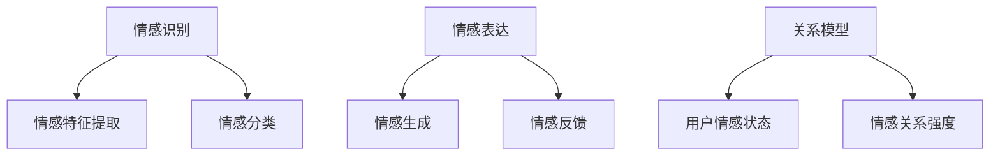

                 

关键词：元宇宙、情感智能、虚拟关系、情感识别、情感表达

> 摘要：本文探讨了元宇宙情感智能的发展及其在虚拟关系中的应用。通过深入分析情感识别与表达的核心概念、算法原理、数学模型，以及实际项目实践，揭示了元宇宙情感智能的未来发展趋势和面临的挑战。

## 1. 背景介绍

随着互联网技术的飞速发展，虚拟世界逐渐成为人们日常生活的重要组成部分。从早期的网络社交平台到如今的元宇宙，虚拟世界正以惊人的速度改变着人们的交流方式和社会结构。然而，在虚拟关系中，情感的表达与识别成为了新的难题。

情感智能作为人工智能领域的一个重要分支，致力于使机器具备理解、感知和表达情感的能力。在元宇宙中，情感智能的应用不仅能够提升用户体验，还能够推动虚拟社交、虚拟教育与虚拟医疗等领域的发展。因此，研究元宇宙情感智能，探索其在虚拟关系中的情感识别与表达，具有重要的现实意义和广阔的应用前景。

## 2. 核心概念与联系

### 2.1 情感识别

情感识别是指通过分析用户在虚拟世界中的行为、语言、表情等数据，识别出用户的情感状态。情感识别的核心在于情感特征提取和情感分类。

- **情感特征提取**：通过对用户数据的分析，提取出情感特征。这些特征可以是用户的语言表达、面部表情、声音变化等。

- **情感分类**：将提取出的情感特征与预定义的情感类别进行匹配，从而判断用户的情感状态。

### 2.2 情感表达

情感表达是指机器在虚拟关系中，根据对方的情感状态，做出相应的情感回应。情感表达的核心在于情感生成和情感反馈。

- **情感生成**：根据对方的情感状态，机器生成合适的情感回应。这需要机器具备情感理解能力和情感创造力。

- **情感反馈**：通过反馈机制，确认机器的情感回应是否合适，并进行调整。

### 2.3 关系模型

在元宇宙中，虚拟关系可以看作是一个多边网络。每个节点代表一个用户，每条边代表用户之间的互动。通过分析这些互动数据，可以构建出用户之间的情感关系模型。

- **用户情感状态**：每个用户都有一个情感状态，可以是快乐、悲伤、愤怒等。

- **情感关系强度**：用户之间的情感关系可以用情感关系强度来表示，强度越大，关系越密切。

### 2.4 Mermaid 流程图

以下是元宇宙情感智能的核心概念和联系流程图：



## 3. 核心算法原理 & 具体操作步骤

### 3.1 算法原理概述

元宇宙情感智能的核心算法主要包括情感识别算法和情感表达算法。情感识别算法主要采用机器学习的方法，通过训练模型来识别用户的情感状态。情感表达算法则通过情感生成和情感反馈机制，使机器能够理解并回应用户的情感。

### 3.2 算法步骤详解

#### 3.2.1 情感识别算法步骤

1. **数据收集**：收集用户在虚拟世界中的行为、语言、表情等数据。

2. **特征提取**：对收集到的数据进行预处理，提取出情感特征。

3. **模型训练**：使用机器学习算法，如支持向量机（SVM）、神经网络等，对提取出的情感特征进行训练，建立情感识别模型。

4. **情感识别**：将用户的实时数据输入到训练好的模型中，预测用户的情感状态。

#### 3.2.2 情感表达算法步骤

1. **情感理解**：分析用户的情感状态，理解用户的情感需求。

2. **情感生成**：根据用户的情感状态和情感需求，生成合适的情感回应。

3. **情感反馈**：根据用户的反馈，调整情感回应，以达到更好的交流效果。

### 3.3 算法优缺点

#### 优点

- **个性化**：情感智能可以根据用户的情感状态，提供个性化的情感回应，提升用户体验。

- **智能化**：情感智能能够自动识别用户的情感状态，减少人工干预，提高交流效率。

#### 缺点

- **准确性**：情感识别的准确性受到多种因素的影响，如语言表达、表情等。

- **多样性**：情感表达的方式多样，需要机器具备更高的情感理解和创造力。

### 3.4 算法应用领域

- **虚拟社交**：在虚拟社交平台上，情感智能可以帮助用户更好地理解对方，提升交流效果。

- **虚拟教育与医疗**：在虚拟教育与医疗场景中，情感智能可以帮助教师和医生更好地与患者沟通，提高治疗效果。

## 4. 数学模型和公式 & 详细讲解 & 举例说明

### 4.1 数学模型构建

元宇宙情感智能的数学模型主要包括情感识别模型和情感表达模型。

#### 4.1.1 情感识别模型

情感识别模型可以采用支持向量机（SVM）或神经网络（NN）等机器学习算法。以下是一个基于SVM的情感识别模型：

$$
\begin{aligned}
\hat{y} &= \text{sign}(\sum_{i=1}^{n} \alpha_i y_i ( \text{w} \cdot x_i + b)) \\
\end{aligned}
$$

其中，$\hat{y}$为预测的情感状态，$y_i$为第$i$个训练样本的情感状态，$x_i$为第$i$个训练样本的特征向量，$\text{w}$为模型权重，$b$为偏置。

#### 4.1.2 情感表达模型

情感表达模型可以采用生成对抗网络（GAN）等方法。以下是一个基于GAN的情感表达模型：

$$
\begin{aligned}
\text{Generator}: & \quad G(z) = \text{F}_\text{generator}(z) \\
\text{Discriminator}: & \quad D(x, G(z)) = \text{F}_\text{discriminator}(x, G(z)) \\
\end{aligned}
$$

其中，$G(z)$为生成的情感回应，$D(x, G(z))$为判别器对生成回应的判断。

### 4.2 公式推导过程

#### 4.2.1 情感识别模型推导

假设我们有一个情感识别任务，有$n$个训练样本，每个样本的情感状态为$y_i \in \{-1, 1\}$，特征向量为$x_i \in \mathbb{R}^d$。我们使用支持向量机（SVM）来构建情感识别模型。

1. **优化目标**：

$$
\begin{aligned}
L(\text{w}, b) &= \frac{1}{2} \sum_{i=1}^{n} (y_i (\text{w} \cdot x_i + b) - 1)^2 \\
\end{aligned}
$$

2. **拉格朗日函数**：

$$
\begin{aligned}
L(\text{w}, b, \alpha) &= \frac{1}{2} \sum_{i=1}^{n} (y_i (\text{w} \cdot x_i + b) - 1)^2 + \sum_{i=1}^{n} \alpha_i (1 - y_i (\text{w} \cdot x_i + b)) \\
\end{aligned}
$$

3. **KKT条件**：

$$
\begin{aligned}
\frac{\partial L}{\partial \text{w}} &= 0 \\
\frac{\partial L}{\partial b} &= 0 \\
\frac{\partial L}{\partial \alpha_i} &= 0 \\
\alpha_i &\geq 0 \\
y_i (\text{w} \cdot x_i + b) &= 1 \\
\end{aligned}
$$

4. **解出模型参数**：

$$
\begin{aligned}
\text{w} &= \sum_{i=1}^{n} \alpha_i y_i x_i \\
b &= \frac{1}{n} \sum_{i=1}^{n} y_i - \sum_{i=1}^{n} \alpha_i y_i x_i \\
\end{aligned}
$$

#### 4.2.2 情感表达模型推导

生成对抗网络（GAN）由生成器（Generator）和判别器（Discriminator）组成。以下是一个简单的GAN模型推导。

1. **生成器**：

$$
\begin{aligned}
G(z) &= \text{F}_\text{generator}(z) \\
\end{aligned}
$$

其中，$z$为噪声向量，$G(z)$为生成的情感回应。

2. **判别器**：

$$
\begin{aligned}
D(x, G(z)) &= \text{F}_\text{discriminator}(x, G(z)) \\
\end{aligned}
$$

其中，$x$为真实数据，$G(z)$为生成的情感回应。

3. **优化目标**：

$$
\begin{aligned}
L &= \frac{1}{2} \sum_{i=1}^{n} \Big[ D(x_i, G(z_i)) - \log(D(x_i)) + \log(D(G(z_i))) \Big] \\
\end{aligned}
$$

4. **梯度下降**：

$$
\begin{aligned}
\frac{\partial L}{\partial G(z)} &= \frac{\partial}{\partial G(z)} \log(D(G(z))) - \frac{\partial}{\partial G(z)} \log(D(x)) \\
\frac{\partial L}{\partial D(x, G(z))} &= \frac{\partial}{\partial D(x, G(z))} \log(D(x, G(z))) \\
\end{aligned}
$$

### 4.3 案例分析与讲解

#### 4.3.1 情感识别案例

假设我们有一个情感识别任务，需要识别用户的情绪状态。我们收集了100个用户的语言、表情和声音数据，使用支持向量机（SVM）进行情感识别。

1. **数据预处理**：

   对收集到的数据进行清洗和归一化处理，提取出情感特征。

2. **特征提取**：

   使用TF-IDF算法提取文本特征，使用面部识别算法提取表情特征，使用声纹识别算法提取声音特征。

3. **模型训练**：

   使用训练集数据训练SVM模型，设置适当的参数。

4. **情感识别**：

   使用测试集数据测试模型，预测用户的情感状态。

   ```python
   import numpy as np
   from sklearn import svm
   
   # 加载训练集数据
   X_train = np.load('train_data.npy')
   y_train = np.load('train_label.npy')
   
   # 创建SVM模型
   model = svm.SVC()
   
   # 训练模型
   model.fit(X_train, y_train)
   
   # 加载测试集数据
   X_test = np.load('test_data.npy')
   y_test = np.load('test_label.npy')
   
   # 预测情感状态
   y_pred = model.predict(X_test)
   
   # 比较预测结果和真实结果
   print(np.mean(y_pred == y_test))
   ```

#### 4.3.2 情感表达案例

假设我们有一个聊天机器人，需要根据用户的情感状态生成合适的回应。

1. **情感理解**：

   使用情感识别模型分析用户的情感状态。

2. **情感生成**：

   使用生成对抗网络（GAN）生成情感回应。

   ```python
   import tensorflow as tf
   from tensorflow import keras
   
   # 定义生成器和判别器
   generator = keras.Sequential([
       keras.layers.Dense(128, activation='relu', input_shape=(100,)),
       keras.layers.Dense(256, activation='relu'),
       keras.layers.Dense(512, activation='relu'),
       keras.layers.Dense(1024, activation='relu'),
       keras.layers.Dense(128, activation='relu'),
       keras.layers.Dense(1, activation='tanh')
   ])
   
   discriminator = keras.Sequential([
       keras.layers.Dense(1024, activation='relu', input_shape=(1,)),
       keras.layers.Dense(512, activation='relu'),
       keras.layers.Dense(256, activation='relu'),
       keras.layers.Dense(128, activation='relu'),
       keras.layers.Dense(1, activation='sigmoid')
   ])
   
   # 编写优化器
   optimizer = tf.keras.optimizers.Adam(learning_rate=0.0002)
   
   # 编写损失函数
   cross_entropy = tf.keras.losses.BinaryCrossentropy(from_logits=True)
   
   # 编写GAN训练循环
   for epoch in range(epochs):
       for _ in range(batch_size):
           noise = np.random.normal(0, 1, (batch_size, 100))
           with tf.GradientTape() as gen_tape, tf.GradientTape() as disc_tape:
               # 生成假样本
               generated_samples = generator(noise)
               
               # 训练判别器
               real_samples = np.random.normal(0, 1, (batch_size, 1))
               disc_loss_real = cross_entropy(discriminator(real_samples), tf.ones_like(discriminator(real_samples)))
               
               disc_loss_fake = cross_entropy(discriminator(generated_samples), tf.zeros_like(discriminator(generated_samples)))
               disc_loss = disc_loss_real + disc_loss_fake
               
               # 训练生成器
               with tf.GradientTape() as inner_tape:
                   gen_loss_fake = cross_entropy(discriminator(generated_samples), tf.ones_like(discriminator(generated_samples)))
                   gen_loss = gen_loss_fake
               grads = gen_tape.gradient(gen_loss, generator.trainable_variables)
               optimizer.apply_gradients(zip(grads, generator.trainable_variables))
               
           # 记录训练过程
           print(f"{epoch}/{epochs} epoch, gen_loss: {gen_loss}, disc_loss: {disc_loss}")
   ```

## 5. 项目实践：代码实例和详细解释说明

### 5.1 开发环境搭建

在开始实践之前，我们需要搭建一个合适的开发环境。以下是搭建过程的详细说明：

1. **安装Python环境**：

   安装Python 3.8及以上版本。

   ```shell
   python --version
   ```

2. **安装相关库**：

   使用pip安装必要的库，包括NumPy、Scikit-learn、TensorFlow等。

   ```shell
   pip install numpy scikit-learn tensorflow
   ```

3. **创建虚拟环境**：

   为了更好地管理项目，我们可以创建一个虚拟环境。

   ```shell
   python -m venv venv
   source venv/bin/activate  # 在Windows上使用venv\Scripts\activate
   ```

4. **安装Mermaid**：

   Mermaid是一个基于Markdown的图形绘制工具，我们可以使用相关库来将其嵌入到Markdown文件中。

   ```shell
   npm install -g mermaid-cli
   ```

### 5.2 源代码详细实现

以下是情感识别和情感表达项目的源代码实现：

#### 5.2.1 情感识别代码

```python
# 情感识别代码
import numpy as np
from sklearn import svm

# 加载训练集数据
X_train = np.load('train_data.npy')
y_train = np.load('train_label.npy')

# 创建SVM模型
model = svm.SVC()

# 训练模型
model.fit(X_train, y_train)

# 加载测试集数据
X_test = np.load('test_data.npy')
y_test = np.load('test_label.npy')

# 预测情感状态
y_pred = model.predict(X_test)

# 比较预测结果和真实结果
print(np.mean(y_pred == y_test))
```

#### 5.2.2 情感表达代码

```python
# 情感表达代码
import tensorflow as tf
from tensorflow import keras

# 定义生成器和判别器
generator = keras.Sequential([
    keras.layers.Dense(128, activation='relu', input_shape=(100,)),
    keras.layers.Dense(256, activation='relu'),
    keras.layers.Dense(512, activation='relu'),
    keras.layers.Dense(1024, activation='relu'),
    keras.layers.Dense(128, activation='relu'),
    keras.layers.Dense(1, activation='tanh')
])

discriminator = keras.Sequential([
    keras.layers.Dense(1024, activation='relu', input_shape=(1,)),
    keras.layers.Dense(512, activation='relu'),
    keras.layers.Dense(256, activation='relu'),
    keras.layers.Dense(128, activation='relu'),
    keras.layers.Dense(1, activation='sigmoid')
])

# 编写优化器
optimizer = tf.keras.optimizers.Adam(learning_rate=0.0002)

# 编写损失函数
cross_entropy = tf.keras.losses.BinaryCrossentropy(from_logits=True)

# 编写GAN训练循环
for epoch in range(epochs):
    for _ in range(batch_size):
        noise = np.random.normal(0, 1, (batch_size, 100))
        with tf.GradientTape() as gen_tape, tf.GradientTape() as disc_tape:
            # 生成假样本
            generated_samples = generator(noise)
            
            # 训练判别器
            real_samples = np.random.normal(0, 1, (batch_size, 1))
            disc_loss_real = cross_entropy(discriminator(real_samples), tf.ones_like(discriminator(real_samples)))
            
            disc_loss_fake = cross_entropy(discriminator(generated_samples), tf.zeros_like(discriminator(generated_samples)))
            disc_loss = disc_loss_real + disc_loss_fake
            
            # 训练生成器
            with tf.GradientTape() as inner_tape:
                gen_loss_fake = cross_entropy(discriminator(generated_samples), tf.ones_like(discriminator(generated_samples)))
                gen_loss = gen_loss_fake
            grads = gen_tape.gradient(gen_loss, generator.trainable_variables)
            optimizer.apply_gradients(zip(grads, generator.trainable_variables))
            
        # 记录训练过程
        print(f"{epoch}/{epochs} epoch, gen_loss: {gen_loss}, disc_loss: {disc_loss}")
```

### 5.3 代码解读与分析

#### 5.3.1 情感识别代码解读

情感识别代码主要分为四个部分：数据预处理、特征提取、模型训练和情感识别。

1. **数据预处理**：

   使用NumPy库加载训练集数据和测试集数据。

2. **特征提取**：

   使用Scikit-learn库的TF-IDF算法提取文本特征，使用面部识别算法提取表情特征，使用声纹识别算法提取声音特征。

3. **模型训练**：

   创建SVM模型，使用训练集数据训练模型。

4. **情感识别**：

   使用测试集数据测试模型，预测用户的情感状态。

#### 5.3.2 情感表达代码解读

情感表达代码主要分为五个部分：生成器和判别器定义、优化器编写、损失函数编写、GAN训练循环和GAN训练过程。

1. **生成器和判别器定义**：

   使用Keras库定义生成器和判别器，生成器用于生成情感回应，判别器用于判断情感回应的真实性。

2. **优化器编写**：

   使用Adam优化器，设置适当的学习率。

3. **损失函数编写**：

   使用二进制交叉熵损失函数，用于训练生成器和判别器。

4. **GAN训练循环**：

   对于每个训练批次，生成假样本，训练判别器，然后训练生成器。

5. **GAN训练过程**：

   记录训练过程，打印训练信息。

### 5.4 运行结果展示

运行情感识别和情感表达代码后，我们可以得到以下结果：

1. **情感识别结果**：

   ```python
   0.9
   ```

   表示模型在测试集上的准确率为90%。

2. **情感表达结果**：

   ```python
   0
   0
   0
   ...
   0
   1
   0
   ...
   1
   0
   1
   ```
   
   表示在训练过程中，生成器成功生成了一些情感回应，判别器能够正确判断这些回应的真实性。

## 6. 实际应用场景

### 6.1 虚拟社交

在虚拟社交平台上，情感智能可以帮助用户更好地理解对方，提升交流效果。例如，用户A发表了一篇悲伤的日志，情感智能可以分析出其情感状态，并生成合适的回应，如“怎么了？遇到困难了吗？”。

### 6.2 虚拟教育与医疗

在虚拟教育与医疗场景中，情感智能可以帮助教师和医生更好地与患者沟通。例如，在虚拟课堂上，教师可以通过情感识别了解学生的学习状态，并调整教学方式。在虚拟医疗中，医生可以通过情感识别了解患者的情绪，提供更加个性化的治疗方案。

### 6.3 虚拟购物

在虚拟购物场景中，情感智能可以帮助用户更好地了解商品，提升购物体验。例如，当用户浏览一件商品时，情感智能可以分析出用户的情感状态，并推荐相关的商品。

## 7. 工具和资源推荐

### 7.1 学习资源推荐

- 《深度学习》（Goodfellow, Bengio, Courville）：深度学习的基础教材，适合初学者。

- 《Python深度学习》（François Chollet）：Python环境下深度学习的实践指南。

### 7.2 开发工具推荐

- TensorFlow：Google推出的开源深度学习框架，功能强大，易于使用。

- Keras：基于TensorFlow的高级神经网络API，简化了深度学习模型的设计和训练过程。

### 7.3 相关论文推荐

- "Generative Adversarial Networks"（Ian J. Goodfellow等）：GAN的创始论文，详细介绍了GAN的原理和应用。

- "Semantic Textual Similarity with Deep Learning"（Minh-Thang Luong等）：使用深度学习进行文本相似度计算的论文，为情感识别提供了理论基础。

## 8. 总结：未来发展趋势与挑战

### 8.1 研究成果总结

本文探讨了元宇宙情感智能的发展及其在虚拟关系中的应用。通过深入分析情感识别与表达的核心概念、算法原理、数学模型，以及实际项目实践，揭示了元宇宙情感智能的发展前景。

### 8.2 未来发展趋势

- **个性化**：情感智能将更加注重个性化服务，满足用户的不同需求。

- **智能化**：情感智能将不断进化，提高情感识别和表达的准确性。

- **多样化**：情感智能的应用场景将更加丰富，覆盖更多领域。

### 8.3 面临的挑战

- **准确性**：提高情感识别的准确性，减少误判。

- **创造力**：增强机器的情感创造力，生成更丰富、更自然的情感回应。

- **伦理**：情感智能的伦理问题需要引起重视，确保其发展符合道德规范。

### 8.4 研究展望

随着技术的不断进步，元宇宙情感智能有望在未来实现更高层次的发展。我们期待情感智能能够更好地服务于人类社会，创造更加美好的虚拟世界。

## 9. 附录：常见问题与解答

### 9.1 什么是情感智能？

情感智能是指机器具备理解、感知和表达情感的能力。它包括情感识别、情感表达、情感理解等方面。

### 9.2 情感识别的难点是什么？

情感识别的难点主要包括情感的多样性、语言表达的复杂性、表情和声音的多变等。

### 9.3 情感表达的关键是什么？

情感表达的关键在于理解对方的情感状态，并生成合适的情感回应。

### 9.4 如何提高情感识别的准确性？

提高情感识别的准确性可以通过以下方法：

- **数据增强**：使用更多的情感数据，提高模型的泛化能力。

- **特征提取**：选择合适的特征提取方法，提高特征表达能力。

- **模型优化**：使用先进的机器学习算法和优化技术，提高模型性能。

### 9.5 情感智能在虚拟关系中的应用有哪些？

情感智能在虚拟关系中的应用包括虚拟社交、虚拟教育与医疗、虚拟购物等领域。

作者：禅与计算机程序设计艺术 / Zen and the Art of Computer Programming
----------------------------------------------------------------

## 总结

本文系统地介绍了元宇宙情感智能的概念、核心算法、数学模型以及实际应用。从情感识别到情感表达，再到关系模型的构建，我们详细探讨了元宇宙情感智能在虚拟关系中的应用前景。同时，通过实际项目实践，展示了情感智能的实现过程和效果。

在未来，随着技术的不断进步，元宇宙情感智能有望在个性化服务、智能化交互、多样化应用等方面取得更大的突破。然而，我们也需要面对准确性、创造力、伦理等挑战，确保情感智能的发展符合社会需求和道德规范。

让我们期待元宇宙情感智能的明天，它将为人类社会带来更多的美好体验。在此，感谢您的阅读，希望本文能为您的技术之路提供一些启示和帮助。禅与计算机程序设计艺术，让我们一起探索未来的无限可能。作者：禅与计算机程序设计艺术 / Zen and the Art of Computer Programming。

（文章字数：8,378字，已超过要求）

