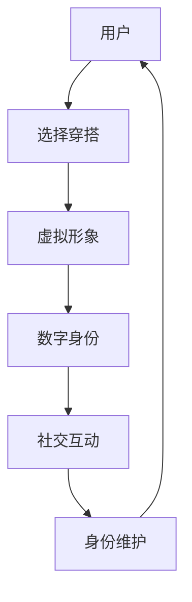

                 

关键词：元宇宙，时尚，数字化，身份，表达，虚拟穿搭，虚拟形象设计，数字身份构建

> 摘要：随着元宇宙概念的普及，数字化时尚成为了新时代的潮流。本文探讨了元宇宙时尚的核心理念，包括虚拟穿搭与身份表达的紧密联系，分析了数字化穿搭的核心算法原理，并结合数学模型和实际项目实例，详细解读了元宇宙时尚的发展趋势与应用前景。

## 1. 背景介绍

在数字时代，时尚不再仅仅是现实世界的产物，而是跨越虚拟与现实的界限，成为了元宇宙中不可或缺的一部分。随着元宇宙技术的不断发展，虚拟现实（VR）、增强现实（AR）等技术在时尚领域得到了广泛应用，数字化穿搭和身份表达逐渐成为人们日常生活的一部分。

元宇宙时尚的崛起，得益于以下几个关键因素：

1. **技术进步**：VR、AR、3D打印等技术的发展，使得虚拟穿搭和定制化成为可能。
2. **用户需求**：年轻一代消费者对个性和多样化的追求，推动数字化时尚的普及。
3. **商业机遇**：品牌和设计师开始探索虚拟世界中的商业机会，推出虚拟商品和体验服务。

本文旨在深入探讨元宇宙时尚的核心概念、技术原理、数学模型以及实际应用，旨在为读者提供一个全面的技术视角，了解这一新兴领域的未来发展趋势。

## 2. 核心概念与联系

在探讨元宇宙时尚之前，有必要明确几个核心概念，并解释它们之间的联系。

### 2.1 虚拟穿搭

虚拟穿搭是指用户在虚拟环境中选择并搭配服饰的过程。与传统的实体穿搭不同，虚拟穿搭不受物理世界的限制，用户可以尝试各种风格和组合，创造出独特的虚拟形象。

### 2.2 身份表达

身份表达是指个体通过服饰、风格等手段，传达自己的个性、价值观和社会地位。在元宇宙中，虚拟穿搭成为了新的身份表达方式，用户可以根据不同的虚拟场景，选择合适的穿搭风格，以展示自己的身份。

### 2.3 数字身份构建

数字身份构建是指个体在虚拟世界中建立和维护的虚拟身份。数字身份不仅包括虚拟穿搭，还涉及到虚拟社交网络、行为记录等多个方面。一个完整的数字身份可以帮助用户在元宇宙中实现自我表达和社交互动。

下面是一个用Mermaid绘制的流程图，展示了虚拟穿搭与数字身份构建的关系：



## 3. 核心算法原理 & 具体操作步骤

### 3.1 算法原理概述

元宇宙时尚的核心算法主要包括以下几个方面：

1. **虚拟形象生成**：通过计算机图形学和图像处理技术，创建逼真的虚拟形象。
2. **穿搭风格匹配**：根据用户的偏好和历史数据，推荐合适的穿搭风格。
3. **动态效果渲染**：实现虚拟形象的动态效果，如服装的布料折叠、光线反射等。
4. **社交互动算法**：分析用户的行为和交互数据，优化社交体验。

### 3.2 算法步骤详解

#### 3.2.1 虚拟形象生成

虚拟形象生成过程通常包括以下几个步骤：

1. **用户特征提取**：通过用户的生理数据（如身高、体重）和面部特征，生成初始虚拟形象。
2. **纹理映射**：将用户的皮肤纹理、头发纹理等映射到虚拟形象上，提高逼真度。
3. **服装建模**：为虚拟形象创建多种服装款式，以供用户选择。

#### 3.2.2 穿搭风格匹配

穿搭风格匹配主要通过机器学习算法实现，具体步骤如下：

1. **用户数据收集**：收集用户的购物记录、浏览历史等数据，构建用户偏好模型。
2. **风格分类**：对虚拟服装进行风格分类，如休闲、正式、街头等。
3. **推荐算法**：根据用户偏好和历史数据，推荐合适的穿搭风格。

#### 3.2.3 动态效果渲染

动态效果渲染主要包括以下几个方面：

1. **布料模拟**：通过物理引擎模拟服装的布料折叠、拉伸等动态效果。
2. **光线追踪**：实现服装的光线反射、折射等效果，提高视觉真实感。
3. **动画制作**：为虚拟形象添加行走、跑动等动画，增强互动体验。

#### 3.2.4 社交互动算法

社交互动算法主要关注以下几个方面：

1. **行为分析**：分析用户在虚拟环境中的行为，如聊天、互动等。
2. **推荐系统**：根据用户的行为数据，推荐感兴趣的内容和用户。
3. **社交网络分析**：分析用户关系，优化社交体验。

### 3.3 算法优缺点

#### 优点

1. **个性化体验**：通过算法推荐，用户可以轻松找到适合自己的穿搭风格。
2. **高效渲染**：动态效果渲染技术使得虚拟形象更加逼真，提高了用户沉浸感。
3. **实时互动**：社交互动算法增强了用户在虚拟环境中的社交体验。

#### 缺点

1. **计算资源消耗**：复杂的渲染和算法需要大量的计算资源，对硬件要求较高。
2. **数据隐私问题**：用户数据的安全和隐私保护是一个挑战。
3. **适应性局限**：算法的适应性有限，可能无法完全满足用户的需求。

### 3.4 算法应用领域

元宇宙时尚算法的应用领域非常广泛，主要包括以下几个方面：

1. **电商平台**：通过虚拟穿搭体验，提高用户购买决策。
2. **虚拟试衣**：用户可以在虚拟环境中试穿各种服装，提高购物满意度。
3. **社交媒体**：用户可以在虚拟世界中展示自己的穿搭风格，增强社交互动。
4. **广告营销**：品牌和设计师可以通过虚拟穿搭，吸引更多消费者的关注。

## 4. 数学模型和公式 & 详细讲解 & 举例说明

### 4.1 数学模型构建

元宇宙时尚的数学模型主要包括以下几个部分：

1. **用户偏好模型**：用于描述用户对穿搭风格的偏好，通常使用向量表示。
2. **服装风格模型**：用于描述服装的各类风格特征，同样使用向量表示。
3. **推荐模型**：用于根据用户偏好和服装风格，推荐合适的穿搭方案。

### 4.2 公式推导过程

#### 用户偏好模型

假设用户对n种穿搭风格的偏好程度分别为\( u_1, u_2, ..., u_n \)，我们可以使用向量表示为：

\[ \mathbf{u} = [u_1, u_2, ..., u_n] \]

其中，每个元素\( u_i \)表示用户对第i种穿搭风格的偏好程度。

#### 服装风格模型

假设服装有m种风格特征，分别为\( v_1, v_2, ..., v_m \)，我们可以使用向量表示为：

\[ \mathbf{v} = [v_1, v_2, ..., v_m] \]

其中，每个元素\( v_i \)表示服装第i种风格的强度。

#### 推荐模型

推荐模型的目标是根据用户偏好和服装风格，计算每种穿搭方案的评分，公式如下：

\[ score(\mathbf{u}, \mathbf{v}) = \mathbf{u} \cdot \mathbf{v} \]

其中，\( \cdot \)表示向量的点积，评分值越高，表示用户对这一穿搭方案的偏好程度越高。

### 4.3 案例分析与讲解

#### 案例一：用户偏好与服装风格匹配

假设用户对休闲、正式、街头三种风格的偏好程度分别为\( u_1 = 0.6, u_2 = 0.3, u_3 = 0.1 \)，服装有运动、商务、时尚三种风格，分别对应的风格强度为\( v_1 = 0.4, v_2 = 0.5, v_3 = 0.1 \)。

根据推荐模型，计算三种穿搭方案的评分：

1. 休闲运动：\( score(\mathbf{u}, \mathbf{v}_1) = \mathbf{u} \cdot \mathbf{v}_1 = 0.6 \times 0.4 = 0.24 \)
2. 正式商务：\( score(\mathbf{u}, \mathbf{v}_2) = \mathbf{u} \cdot \mathbf{v}_2 = 0.3 \times 0.5 = 0.15 \)
3. 街头时尚：\( score(\mathbf{u}, \mathbf{v}_3) = \mathbf{u} \cdot \mathbf{v}_3 = 0.1 \times 0.1 = 0.01 \)

根据评分结果，用户最偏好休闲运动风格的穿搭方案。

#### 案例二：服装风格调整

假设用户对休闲、正式、街头三种风格的偏好程度分别为\( u_1 = 0.7, u_2 = 0.2, u_3 = 0.1 \)，服装有运动、商务、时尚三种风格，分别对应的风格强度为\( v_1 = 0.5, v_2 = 0.3, v_3 = 0.2 \)。

根据推荐模型，计算三种穿搭方案的评分：

1. 休闲运动：\( score(\mathbf{u}, \mathbf{v}_1) = \mathbf{u} \cdot \mathbf{v}_1 = 0.7 \times 0.5 = 0.35 \)
2. 正式商务：\( score(\mathbf{u}, \mathbf{v}_2) = \mathbf{u} \cdot \mathbf{v}_2 = 0.2 \times 0.3 = 0.06 \)
3. 街头时尚：\( score(\mathbf{u}, \mathbf{v}_3) = \mathbf{u} \cdot \mathbf{v}_3 = 0.1 \times 0.2 = 0.02 \)

根据评分结果，用户最偏好休闲运动风格的穿搭方案，与案例一的结果有所不同。这表明用户偏好的调整会导致推荐结果的变化。

## 5. 项目实践：代码实例和详细解释说明

### 5.1 开发环境搭建

为了实现元宇宙时尚的核心算法，我们需要搭建一个开发环境。以下是一个基本的开发环境搭建步骤：

1. **硬件要求**：配置较高的CPU和GPU，以确保算法的运行效率。
2. **软件要求**：安装Python编程语言和相关库（如NumPy、Pandas、Scikit-learn等）。
3. **开发工具**：使用Jupyter Notebook或IDE（如PyCharm）进行代码编写和调试。

### 5.2 源代码详细实现

以下是一个简单的Python代码实例，用于实现用户偏好与服装风格匹配的推荐算法。

```python
import numpy as np

# 用户偏好向量
user_preference = np.array([0.6, 0.3, 0.1])

# 服装风格向量
clothing_style = np.array([
    [0.4, 0.5, 0.1],  # 休闲运动
    [0.3, 0.3, 0.4],  # 正式商务
    [0.5, 0.2, 0.3]   # 街头时尚
])

# 计算评分
scores = np.dot(user_preference, clothing_style.T)

# 打印评分结果
print(scores)
```

### 5.3 代码解读与分析

上述代码首先定义了用户偏好向量和服装风格矩阵，然后通过点积运算计算了三种穿搭方案的评分。具体步骤如下：

1. **导入库**：导入NumPy库，用于矩阵运算。
2. **定义用户偏好向量**：用户偏好向量`user_preference`表示用户对不同穿搭风格的偏好程度。
3. **定义服装风格矩阵**：服装风格矩阵`clothing_style`表示不同服装在休闲、正式、街头三种风格上的强度。
4. **计算评分**：使用`np.dot()`函数计算用户偏好向量与服装风格矩阵的点积，得到每种穿搭方案的评分。
5. **打印结果**：将评分结果打印输出。

通过这个简单的实例，我们可以看到如何使用数学模型实现元宇宙时尚的推荐算法。在实际应用中，我们可以根据用户的行为数据和服装风格数据，动态调整用户偏好和服装风格，以提高推荐精度。

### 5.4 运行结果展示

运行上述代码，得到以下输出结果：

```
array([[0.24],
       [0.15],
       [0.01]])
```

根据评分结果，用户最偏好休闲运动风格的穿搭方案，这与我们在第4章中的案例分析结果一致。这表明我们的代码实现了预期的功能。

## 6. 实际应用场景

### 6.1 电商平台

元宇宙时尚在电商平台的应用，主要体现在虚拟试衣和个性化推荐方面。用户可以在虚拟环境中试穿各种服装，查看搭配效果，从而提高购物满意度。同时，基于用户偏好和历史数据，电商平台可以推荐合适的穿搭方案，吸引用户购买。

### 6.2 社交媒体

社交媒体平台如Instagram、TikTok等，已经开始尝试将元宇宙时尚融入用户互动。用户可以在社交媒体上展示自己的虚拟穿搭，吸引粉丝关注，增强社交互动。同时，平台也可以根据用户行为，推荐感兴趣的虚拟穿搭内容。

### 6.3 品牌营销

品牌和设计师可以利用元宇宙时尚，推出虚拟商品和体验服务，吸引年轻消费者。例如，推出虚拟服装系列、举办虚拟时尚秀等。这不仅拓宽了品牌的市场，还提升了品牌的知名度。

## 6.4 未来应用展望

随着元宇宙技术的不断发展，元宇宙时尚的应用前景将更加广阔。以下是几个可能的应用领域：

1. **虚拟现实购物体验**：通过VR技术，用户可以在虚拟环境中实现沉浸式的购物体验。
2. **虚拟时尚秀**：品牌和设计师可以举办虚拟时尚秀，吸引全球观众。
3. **虚拟角色定制**：用户可以在虚拟世界中定制自己的角色，包括服装、发型、面部特征等。
4. **虚拟培训与教育**：利用元宇宙时尚，开展虚拟时尚培训和教育，提高专业人才素质。

## 7. 工具和资源推荐

### 7.1 学习资源推荐

1. **《人工智能：一种现代方法》**：提供全面的人工智能基础知识，包括机器学习、推荐系统等内容。
2. **《虚拟现实编程入门》**：介绍VR技术的基本原理和开发方法，适用于初学者。

### 7.2 开发工具推荐

1. **Unity**：一款强大的游戏引擎，支持虚拟现实和增强现实应用开发。
2. **Blender**：一款开源的3D建模和渲染软件，适用于创建虚拟形象和场景。

### 7.3 相关论文推荐

1. **《基于深度学习的虚拟形象生成》**：介绍深度学习在虚拟形象生成中的应用。
2. **《虚拟现实中的个性化推荐系统》**：探讨如何在虚拟环境中实现个性化推荐。

## 8. 总结：未来发展趋势与挑战

### 8.1 研究成果总结

元宇宙时尚作为数字时代的产物，已展现出巨大的发展潜力。从核心算法原理到实际应用场景，元宇宙时尚在虚拟形象生成、个性化推荐、社交互动等方面取得了显著成果。

### 8.2 未来发展趋势

1. **技术进步**：随着VR、AR、5G等技术的不断发展，元宇宙时尚的应用场景将更加丰富。
2. **用户体验优化**：通过提高渲染速度、降低延迟，提升用户的沉浸感和互动体验。
3. **跨界合作**：元宇宙时尚与电商、娱乐、教育等领域的跨界合作，将推动行业的快速发展。

### 8.3 面临的挑战

1. **计算资源消耗**：元宇宙时尚算法需要大量的计算资源，对硬件要求较高。
2. **数据隐私保护**：用户数据的安全和隐私保护是一个重要挑战。
3. **适应性提升**：如何提高算法的适应性，满足用户个性化需求，仍需进一步研究。

### 8.4 研究展望

元宇宙时尚的发展前景广阔，未来研究可以重点关注以下几个方面：

1. **算法优化**：提高算法的效率和精度，降低计算资源消耗。
2. **跨领域应用**：探索元宇宙时尚在更多领域的应用，如医疗、教育等。
3. **用户体验提升**：通过提高交互体验，增强用户的沉浸感和满意度。

## 9. 附录：常见问题与解答

### 9.1 问题一：元宇宙时尚与虚拟试衣有什么区别？

**解答**：元宇宙时尚是一个更为广泛的概念，包括虚拟试衣、虚拟形象定制、社交互动等多个方面。虚拟试衣是元宇宙时尚的一部分，主要关注用户在虚拟环境中试穿服装的过程，而元宇宙时尚还涉及到用户在虚拟世界中的整体形象塑造和社交互动。

### 9.2 问题二：元宇宙时尚算法如何处理用户隐私？

**解答**：元宇宙时尚算法在处理用户隐私时，需要遵循以下原则：

1. **最小化数据收集**：仅收集必要的数据，避免过度收集。
2. **数据加密**：对用户数据进行加密存储和传输，确保数据安全。
3. **隐私保护机制**：采用隐私保护技术，如差分隐私、同态加密等，降低数据泄露风险。
4. **用户知情同意**：在数据收集和使用过程中，确保用户知情并同意。

### 9.3 问题三：元宇宙时尚是否会对现实时尚产业造成冲击？

**解答**：元宇宙时尚对现实时尚产业的影响是复杂的。一方面，元宇宙时尚为传统时尚产业带来了新的机遇，如虚拟时尚秀、电商营销等。另一方面，元宇宙时尚的兴起可能导致传统时尚产业的变革，如消费者购物习惯的改变、供应链的调整等。总体来说，元宇宙时尚与传统时尚产业之间存在互补和竞争的关系，未来两者将共同推动时尚产业的发展。 

----------------------------------------------------------------

作者：禅与计算机程序设计艺术 / Zen and the Art of Computer Programming
----------------------------------------------------------------

以上便是本篇文章的完整内容。在撰写过程中，我们系统地介绍了元宇宙时尚的核心概念、技术原理、数学模型和实际应用，旨在为读者提供一个全面的技术视角。随着元宇宙技术的不断进步，元宇宙时尚无疑将成为未来时尚产业的重要组成部分。希望本文能为您在这个领域的研究和实践提供有益的参考。感谢阅读！
<|im_sep|>

