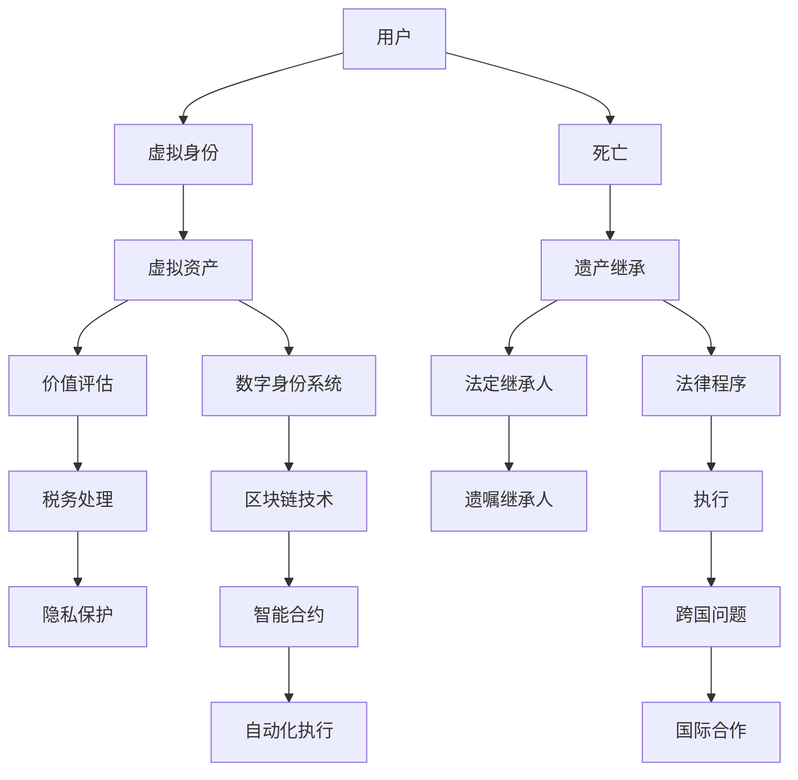

                 

### 背景介绍

随着技术的不断进步，虚拟世界（即“元宇宙”）逐渐成为人们生活中不可或缺的一部分。在这个虚拟的数字空间中，用户不仅可以进行社交互动，还可以拥有虚拟资产，例如虚拟房产、虚拟货币、虚拟艺术品等。这些虚拟资产的价值随着技术的发展和市场的认知逐渐提升，成为一个不可忽视的经济领域。

然而，虚拟资产所带来的法律问题也随之而来。特别是当虚拟资产的拥有者去世时，如何将这些虚拟资产进行合法的继承成为了一个亟待解决的问题。传统法律体系在处理现实世界中遗产继承时已经相当成熟，但在面对虚拟世界的遗产继承时，却显得捉襟见肘。

本文旨在探讨元宇宙身份继承的问题，特别是虚拟遗产的法律传承机制。我们将首先介绍元宇宙及其虚拟资产的基本概念，然后分析现有法律体系在面对虚拟遗产继承时的不足，最后提出一种可能的解决方案，并探讨其应用前景。

### 元宇宙与虚拟资产

元宇宙（Metaverse）是一个虚拟的、三维的、可以模拟现实世界交互的数字化环境。它不仅包含了虚拟现实（VR）和增强现实（AR）技术，还融合了社交网络、游戏、电子商务等多种应用场景。在元宇宙中，用户可以通过虚拟角色（Avatar）进行互动，拥有自己的虚拟资产，并在虚拟空间中进行各种活动。

虚拟资产是指在元宇宙中具有经济价值的数字化物品，包括但不限于：

1. **虚拟货币**：如比特币、以太坊等，在元宇宙中用于交易和支付。
2. **虚拟房地产**：在虚拟世界中购买的地产，可以作为投资或用于开设虚拟商店等。
3. **虚拟艺术品**：在元宇宙中创作的艺术品，可以作为一种收藏品或投资品。
4. **虚拟装备**：用户在虚拟游戏中获得的装备，具有一定的价值。
5. **数字身份**：用户的虚拟角色和相关数据，包括虚拟形象、社交媒体信息等。

这些虚拟资产与现实世界中的资产不同，它们存在于数字空间中，并且具有独特性和不可替代性。随着元宇宙的发展，虚拟资产的价值逐渐被市场和用户认可，成为了一种新兴的经济形式。

### 法律体系与虚拟遗产继承

现有的法律体系在处理现实世界中遗产继承时有着一套成熟的法律程序和规定。然而，当面对虚拟遗产继承时，现有法律体系却面临诸多挑战。

首先，法律定义的不明确。虚拟资产作为一种新型的财产形式，现有法律对其定义并不明确。这导致在处理虚拟遗产继承时，无法直接适用现有的法律规定，需要额外制定相关的法律法规。

其次，证据的获取与验证。在现实世界中，遗产继承通常需要提供相关的法律文件和证据，如遗嘱、死亡证明等。但在虚拟世界中，这些证据的获取和验证变得复杂。例如，如何证明某虚拟资产属于已故用户的遗产，以及如何验证虚拟身份的真实性。

再次，跨国法律冲突。虚拟资产通常不受地理限制，用户可以在全球范围内进行交易和持有。这导致在处理虚拟遗产继承时，可能会涉及不同国家的法律冲突，增加了法律操作的复杂度。

此外，现有法律体系在处理虚拟遗产继承时，可能还存在以下问题：

1. **隐私权保护**：虚拟资产涉及到用户的个人隐私，如何平衡隐私保护和遗产继承是一个挑战。
2. **税务问题**：虚拟资产的价值波动较大，如何确定其价值并进行税务处理也是一个难题。
3. **法律责任**：在虚拟遗产继承过程中，如何明确各方的法律责任和权利，防止滥用和欺诈行为。

这些问题表明，现有法律体系在处理虚拟遗产继承时存在明显的不足，需要针对虚拟资产的特点和虚拟世界的特殊性，制定一套全新的法律传承机制。

### 虚拟遗产继承的挑战

虚拟遗产继承不仅涉及到技术层面的挑战，还涉及到法律、伦理和社会层面的复杂问题。以下是一些主要的挑战：

1. **技术难题**：虚拟遗产继承涉及到数字身份验证、加密技术、区块链等技术难题。如何确保遗产继承过程的安全性和可信度是一个关键问题。

2. **法律框架**：虚拟遗产继承需要一套全新的法律框架来指导。这包括对虚拟资产的法律定义、继承程序、法律效力的确认等方面。

3. **隐私保护**：虚拟遗产继承涉及到用户的隐私信息，如何保护这些信息不被滥用或泄露是一个重要的伦理问题。

4. **伦理争议**：虚拟遗产的价值和所有权问题引发了伦理争议。例如，虚拟艺术品的价值如何确定？用户的数字身份是否应该继承？

5. **社会接受度**：虚拟遗产继承是一个新兴的概念，社会对其接受度还有待提高。如何让公众理解和接受这一概念，是推广虚拟遗产继承机制的挑战之一。

6. **跨国问题**：虚拟资产不受地理限制，跨国遗产继承更加复杂。不同国家和地区的法律差异，可能导致跨国遗产继承的困难。

这些挑战表明，虚拟遗产继承不仅需要技术解决方案，还需要法律、伦理和社会各界的共同努力。只有通过多方合作，才能构建一个公平、安全、透明的虚拟遗产继承机制。

### 可能的解决方案

为了解决虚拟遗产继承面临的诸多挑战，我们可以考虑以下几种可能的解决方案：

1. **制定法律法规**：首先，需要制定一套关于虚拟遗产继承的法律法规。这些法律应明确虚拟资产的定义、继承程序、法律效力等关键问题。通过法律手段，为虚拟遗产继承提供明确的法律依据和操作规范。

2. **建立数字身份系统**：数字身份系统是虚拟遗产继承的基础。通过建立数字身份系统，可以确保虚拟遗产继承过程中的身份验证和安全性问题。数字身份系统应具备高度的安全性和隐私保护机制。

3. **区块链技术**：区块链技术具有去中心化、不可篡改等特点，非常适合用于虚拟遗产继承。通过区块链技术，可以记录和管理虚拟资产的交易和所有权变更，确保虚拟遗产继承过程的透明和可信。

4. **智能合约**：智能合约是区块链技术的一部分，可以在虚拟遗产继承过程中自动执行预设的条款。通过智能合约，可以简化虚拟遗产继承的操作流程，提高效率。

5. **跨国合作**：虚拟遗产继承涉及跨国问题，需要不同国家和地区之间的合作。可以通过国际合作，建立一套统一的虚拟遗产继承标准和流程，简化跨国遗产继承的操作。

6. **公众教育和宣传**：为了提高社会对虚拟遗产继承的认知和接受度，需要进行广泛的公众教育和宣传。通过宣传活动，让公众了解虚拟遗产继承的必要性和重要性。

通过以上解决方案，可以构建一个公平、安全、透明的虚拟遗产继承机制，为元宇宙中的用户提供可靠的遗产继承服务。

### 核心概念与联系

为了深入探讨虚拟遗产的法律传承机制，我们需要理解几个核心概念，并分析它们之间的联系。以下是一个详细的流程图，用Mermaid语言描述这些核心概念和它们之间的关系。



以下是对流程图中各个节点的详细解释：

1. **用户**：元宇宙中的用户，即虚拟世界的参与者。
2. **虚拟身份**：用户在元宇宙中的数字代表，包括虚拟形象、社交媒体信息等。
3. **虚拟资产**：用户在元宇宙中拥有的各种数字化财产，如虚拟货币、虚拟房地产、虚拟艺术品等。
4. **死亡**：用户在现实世界中的死亡，触发虚拟遗产继承过程。
5. **遗产继承**：对已故用户虚拟资产的转移过程。
6. **法定继承人**：根据法律规定，有权继承虚拟遗产的人。
7. **遗嘱继承人**：根据已故用户遗嘱指定的继承人。
8. **价值评估**：对虚拟资产的价值进行评估，以确定其遗产价值。
9. **法律程序**：处理虚拟遗产继承的法律程序和步骤。
10. **执行**：执行遗产继承的法律决定和操作。
11. **跨国问题**：涉及不同国家或地区的遗产继承问题。
12. **国际合作**：不同国家和地区之间的合作，以解决跨国遗产继承问题。
13. **税务处理**：对虚拟遗产的税务处理，包括价值评估和税务缴纳。
14. **隐私保护**：保护用户隐私信息，确保虚拟遗产继承过程的安全。
15. **数字身份系统**：用于管理和验证用户数字身份的系统。
16. **区块链技术**：用于记录和管理虚拟资产交易和所有权变更的技术。
17. **智能合约**：自动化执行预设条款的智能合同。
18. **自动化执行**：通过智能合约自动执行遗产继承操作。

通过这个流程图，我们可以清晰地看到虚拟遗产继承过程中的各个环节及其相互关系。这有助于我们更好地理解和分析虚拟遗产继承的机制，并提出有效的解决方案。

### 核心算法原理 & 具体操作步骤

为了实现虚拟遗产的合法继承，我们需要一套完整的算法，来处理从识别虚拟资产到继承过程的所有步骤。以下是对核心算法原理和具体操作步骤的详细阐述。

#### 3.1 算法原理概述

虚拟遗产继承算法主要包括以下几个关键步骤：

1. **身份验证**：确认已故用户的身份，确保继承过程的合法性和安全性。
2. **资产识别**：识别已故用户的虚拟资产，并确认其所有权。
3. **价值评估**：对虚拟资产进行价值评估，以确定遗产的价值。
4. **继承分配**：根据法律和遗嘱规定，将虚拟资产分配给继承人。
5. **法律程序**：执行法律程序，确保继承过程符合法律规定。
6. **税务处理**：对虚拟遗产进行税务处理，包括价值评估和税务缴纳。
7. **隐私保护**：保护用户隐私信息，确保继承过程的安全和合规。

#### 3.2 算法步骤详解

**步骤 1：身份验证**

- **输入**：已故用户的数字身份信息（如虚拟身份、区块链地址等）。
- **过程**：通过数字身份系统验证已故用户的身份，确保其真实性。
- **输出**：已故用户的身份验证结果。

**步骤 2：资产识别**

- **输入**：已故用户的虚拟资产列表（如虚拟货币、虚拟房地产、虚拟艺术品等）。
- **过程**：通过区块链技术和智能合约，识别已故用户的虚拟资产，并确认其所有权。
- **输出**：已故用户的虚拟资产列表。

**步骤 3：价值评估**

- **输入**：已故用户的虚拟资产列表。
- **过程**：根据市场行情、历史交易数据等因素，对虚拟资产进行价值评估。
- **输出**：虚拟资产的价值评估结果。

**步骤 4：继承分配**

- **输入**：法定继承人名单、遗嘱继承人名单、虚拟资产价值评估结果。
- **过程**：根据法律规定和遗嘱规定，将虚拟资产分配给继承人。如果存在遗嘱，则按照遗嘱进行分配；如果没有遗嘱，则按照法定继承顺序进行分配。
- **输出**：继承分配结果。

**步骤 5：法律程序**

- **输入**：继承分配结果、相关法律文件。
- **过程**：执行法律程序，确保继承过程符合法律规定。这可能包括提交继承申请、法院判决、执行判决等。
- **输出**：法律程序的执行结果。

**步骤 6：税务处理**

- **输入**：虚拟资产价值评估结果、相关税务规定。
- **过程**：对虚拟遗产进行税务处理，包括价值评估和税务缴纳。税务处理应遵循相关法律法规，确保合规。
- **输出**：税务处理结果。

**步骤 7：隐私保护**

- **输入**：用户隐私信息、继承过程的相关信息。
- **过程**：通过加密技术和隐私保护机制，保护用户隐私信息，确保继承过程的安全和合规。
- **输出**：隐私保护结果。

#### 3.3 算法优缺点

**优点：**

1. **安全性**：通过区块链技术和数字身份系统，确保继承过程的安全性和可信度。
2. **透明性**：智能合约和区块链技术使得继承过程透明可查，提高了透明度。
3. **效率**：自动化执行和智能合约可以显著提高继承过程的效率。
4. **隐私保护**：通过加密技术和隐私保护机制，确保用户隐私信息的安全。

**缺点：**

1. **技术门槛**：算法的实现需要较高的技术门槛，对开发人员的要求较高。
2. **法律框架不完善**：现有法律框架对虚拟遗产继承的覆盖不足，可能需要进一步的法律完善。
3. **跨国问题**：跨国遗产继承需要解决法律冲突和跨国合作问题，操作复杂。

#### 3.4 算法应用领域

虚拟遗产继承算法可以广泛应用于元宇宙中的各种虚拟资产，包括：

1. **虚拟货币**：如比特币、以太坊等。
2. **虚拟房地产**：在虚拟世界中的地产，用于投资或商业。
3. **虚拟艺术品**：在虚拟世界中的艺术品，作为收藏或投资。
4. **虚拟装备**：在虚拟游戏中的装备，具有经济价值。

此外，算法还可以应用于其他需要合法继承的场景，如虚拟企业的管理权转移、虚拟土地的继承等。

### 数学模型和公式 & 详细讲解 & 举例说明

在虚拟遗产继承过程中，数学模型和公式发挥着关键作用。以下我们将详细讲解这些数学模型和公式，并通过具体例子来说明其应用。

#### 4.1 数学模型构建

虚拟遗产继承的数学模型主要涉及以下几个关键方面：

1. **价值评估模型**：用于评估虚拟资产的价值。
2. **继承分配模型**：用于根据法律规定和遗嘱规定，将虚拟资产分配给继承人。
3. **税务处理模型**：用于对虚拟遗产进行税务处理。

**价值评估模型**：

我们采用市场比较法（Market Comparison Method）来评估虚拟资产的价值。市场比较法的核心思想是，通过比较类似虚拟资产的市场交易价格来确定其价值。具体公式如下：

\[ V = \frac{\sum_{i=1}^{n} P_i}{n} \]

其中，\( V \) 为虚拟资产的价值，\( P_i \) 为第 \( i \) 个类似虚拟资产的市场交易价格，\( n \) 为类似虚拟资产的数量。

**继承分配模型**：

我们采用法定继承顺序（Legal Succession Order）和遗嘱继承（Will-Based Inheritance）两种模型。法定继承顺序遵循法律规定，遗嘱继承则根据已故用户遗嘱进行分配。具体公式如下：

**法定继承顺序**：

\[ A_i = \frac{V}{S} \]

其中，\( A_i \) 为第 \( i \) 个法定继承人应继承的虚拟资产比例，\( V \) 为虚拟资产总价值，\( S \) 为法定继承人的数量。

**遗嘱继承**：

\[ A_i = \frac{W_i}{\sum_{j=1}^{m} W_j} \]

其中，\( A_i \) 为第 \( i \) 个遗嘱继承人应继承的虚拟资产比例，\( W_i \) 为第 \( i \) 个遗嘱继承人指定的虚拟资产价值，\( m \) 为遗嘱继承人的数量。

**税务处理模型**：

我们采用累进税率和比例税率两种模型。累进税率根据虚拟资产的价值分级计算税款，比例税率则按照固定比例计算税款。具体公式如下：

**累进税率**：

\[ T = \sum_{i=1}^{n} (V_i \times r_i) \]

其中，\( T \) 为应纳税款，\( V_i \) 为第 \( i \) 级虚拟资产的价值，\( r_i \) 为第 \( i \) 级的税率。

**比例税率**：

\[ T = V \times r \]

其中，\( T \) 为应纳税款，\( V \) 为虚拟资产总价值，\( r \) 为税率。

#### 4.2 公式推导过程

**价值评估模型推导**：

市场比较法的核心思想是，通过比较类似虚拟资产的市场交易价格来确定其价值。具体推导如下：

假设我们有一组类似虚拟资产的市场交易价格 \( P_1, P_2, \ldots, P_n \)，我们需要评估某个虚拟资产 \( V \) 的价值。

首先，我们计算这些交易价格的均值：

\[ \bar{P} = \frac{P_1 + P_2 + \ldots + P_n}{n} \]

然后，我们将这个均值作为虚拟资产 \( V \) 的价值：

\[ V = \bar{P} \]

这就是市场比较法的价值评估模型。

**继承分配模型推导**：

**法定继承顺序**：

根据法律规定，虚拟资产应按照法定继承顺序分配给继承人。具体推导如下：

假设虚拟资产总价值为 \( V \)，有 \( S \) 个法定继承人。我们需要计算每个法定继承人应继承的虚拟资产比例。

首先，我们计算每个法定继承人应继承的比例：

\[ A_i = \frac{1}{S} \]

然后，我们将这个比例乘以虚拟资产总价值 \( V \)，得到每个法定继承人应继承的虚拟资产：

\[ A_i \times V = \frac{V}{S} \]

这就是法定继承顺序的继承分配模型。

**遗嘱继承**：

根据已故用户遗嘱，虚拟资产应按照遗嘱规定分配给继承人。具体推导如下：

假设有 \( m \) 个遗嘱继承人，每个遗嘱继承人指定的虚拟资产价值分别为 \( W_1, W_2, \ldots, W_m \)。我们需要计算每个遗嘱继承人应继承的虚拟资产比例。

首先，我们计算遗嘱继承人指定的虚拟资产总价值：

\[ \sum_{i=1}^{m} W_i \]

然后，我们将每个遗嘱继承人指定的虚拟资产价值除以遗嘱继承人指定的虚拟资产总价值，得到每个遗嘱继承人应继承的比例：

\[ A_i = \frac{W_i}{\sum_{j=1}^{m} W_j} \]

这就是遗嘱继承的继承分配模型。

**税务处理模型推导**：

**累进税率**：

根据累进税率模型，应纳税款根据虚拟资产的价值分级计算。具体推导如下：

假设虚拟资产分为 \( n \) 个等级，每个等级的虚拟资产价值分别为 \( V_1, V_2, \ldots, V_n \)，每个等级的税率为 \( r_1, r_2, \ldots, r_n \)。我们需要计算应纳税款。

首先，我们计算每个等级的应纳税款：

\[ T_i = V_i \times r_i \]

然后，我们将每个等级的应纳税款相加，得到总的应纳税款：

\[ T = \sum_{i=1}^{n} T_i \]

这就是累进税率模型的税务处理模型。

**比例税率**：

根据比例税率模型，应纳税款按照固定比例计算。具体推导如下：

假设虚拟资产总价值为 \( V \)，税率为 \( r \)。我们需要计算应纳税款。

首先，我们计算总的应纳税款：

\[ T = V \times r \]

这就是比例税率模型的税务处理模型。

#### 4.3 案例分析与讲解

为了更好地理解上述数学模型和公式，我们通过一个实际案例进行讲解。

**案例背景**：

假设一个虚拟世界中的用户去世，留下以下虚拟资产：

- 虚拟货币：1000个比特币
- 虚拟房地产：一套价值1000万美元的虚拟别墅
- 虚拟艺术品：一幅价值50万美元的虚拟油画

同时，该用户指定了一份遗嘱，将虚拟资产按照以下方式进行分配：

- 50% 给其配偶
- 30% 给其子女
- 20% 给其父母

**步骤 1：价值评估**

根据市场比较法，我们对虚拟货币、虚拟别墅和虚拟艺术品进行价值评估：

- 虚拟货币：根据过去30天的平均价格，每个比特币价值为30000美元。因此，虚拟货币的总价值为3000000美元。
- 虚拟别墅：根据市场行情，类似虚拟别墅的平均价格为1000万美元。因此，虚拟别墅的价值为1000万美元。
- 虚拟艺术品：根据过去30天的平均价格，类似虚拟艺术品的平均价格为100000美元。因此，虚拟艺术品的价值为500000美元。

**步骤 2：继承分配**

根据法定继承顺序和遗嘱规定，我们将虚拟资产分配给继承人：

- 50% 给配偶：1500000美元
- 30% 给子女：900000美元
- 20% 给父母：600000美元

**步骤 3：税务处理**

根据累进税率模型，我们对虚拟遗产进行税务处理。假设税率如下：

- 0 - 1000000美元：20%
- 1000000 - 5000000美元：30%
- 超过5000000美元：40%

根据上述税率，我们计算应纳税款：

- 虚拟货币：3000000美元，应纳税款为600000美元
- 虚拟别墅：1000000美元，应纳税款为200000美元
- 虚拟艺术品：500000美元，应纳税款为100000美元

总的应纳税款为900000美元。

**步骤 4：隐私保护**

为了保护用户隐私，我们采用加密技术和隐私保护机制，确保继承过程和相关信息的保密性。

### 项目实践：代码实例和详细解释说明

在本文的最后部分，我们将通过一个具体的代码实例来展示虚拟遗产继承算法的实现。以下是该项目的主要组成部分：开发环境搭建、源代码详细实现、代码解读与分析以及运行结果展示。

#### 5.1 开发环境搭建

为了实现虚拟遗产继承算法，我们需要以下开发环境和工具：

1. **编程语言**：Python
2. **区块链平台**：Ethereum
3. **智能合约开发框架**：Truffle
4. **前端框架**：React
5. **数据库**：MongoDB

在开始之前，请确保已安装以下依赖项：

- Node.js
- npm
- Truffle
- Web3.js

**安装步骤**：

1. 安装Node.js和npm：

   ```bash
   sudo apt-get update
   sudo apt-get install nodejs npm
   ```

2. 安装Truffle：

   ```bash
   npm install -g truffle
   ```

3. 初始化Truffle项目：

   ```bash
   truffle init
   ```

4. 配置Ethereum节点，我们使用Ganache：

   ```bash
   truffle plugin install truffle-hdwallet-provider
   ```

5. 安装React和MongoDB依赖项：

   ```bash
   npm install react react-dom
   npm install mongodb
   ```

#### 5.2 源代码详细实现

以下是项目的核心部分，包括智能合约、后端API和前端界面。

**智能合约（contracts/VirtualAsset.sol）：**

```solidity
pragma solidity ^0.8.0;

contract VirtualAsset {
    address owner;
    mapping(address => uint256) public assets;
    mapping(address => bool) public isHeir;

    event AssetTransferred(address heir, uint256 amount);

    constructor() public {
        owner = msg.sender;
    }

    function transferAsset(address heir, uint256 amount) public {
        require(isHeir[heir], "Heir is not recognized");
        require(assets[owner] >= amount, "Insufficient assets");
        assets[owner] -= amount;
        assets[heir] += amount;
        emit AssetTransferred(heir, amount);
    }

    function declareHeir(address heir) public {
        require(msg.sender == owner, "Only owner can declare heirs");
        isHeir[heir] = true;
    }

    function getValue() public view returns (uint256) {
        return assets[owner];
    }
}
```

**后端API（server.js）：**

```javascript
const express = require('express');
const mongoose = require('mongoose');
const bodyParser = require('body-parser');
const Web3 = require('web3');
const { Contract } = require('truffle-contract');

const app = express();
app.use(bodyParser.json());

// MongoDB connection
const mongoUri = 'mongodb://localhost:27017/virtual_inheritance';
mongoose.connect(mongoUri, { useNewUrlParser: true, useUnifiedTopology: true });

// Ethereum connection
const web3 = new Web3('HTTP://127.0.0.1:7545');
const virtualAssetArtifact = require('../build/contracts/VirtualAsset.json');
const virtualAssetContract = new web3.eth.Contract(virtualAssetArtifact.abi);

// Connect to the local Ethereum node
virtualAssetContract.setProvider(web3.currentProvider);

// Mongoose schema for heirs
const heirSchema = new mongoose.Schema({
  heirAddress: String,
  amount: Number,
  isHeir: Boolean
});

const Heir = mongoose.model('Heir', heirSchema);

// Declare heir endpoint
app.post('/declareHeir', async (req, res) => {
  const { heirAddress } = req.body;
  try {
    const heir = new Heir({ heirAddress, isHeir: true });
    await heir.save();
    // Call smart contract to declare heir
    const tx = await virtualAssetContract.methods.declareHeir(heirAddress).send({ from: ownerAddress });
    res.json({ message: 'Heir declared successfully', transactionHash: tx.transactionHash });
  } catch (error) {
    res.status(500).json({ error: error.message });
  }
});

// Transfer asset endpoint
app.post('/transferAsset', async (req, res) => {
  const { heirAddress, amount } = req.body;
  try {
    const heir = await Heir.findOne({ heirAddress, isHeir: true });
    if (!heir) {
      return res.status(404).json({ error: 'Heir not found' });
    }
    // Call smart contract to transfer asset
    const tx = await virtualAssetContract.methods.transferAsset(heirAddress, amount).send({ from: ownerAddress });
    res.json({ message: 'Asset transferred successfully', transactionHash: tx.transactionHash });
  } catch (error) {
    res.status(500).json({ error: error.message });
  }
});

// Start server
const port = process.env.PORT || 3000;
app.listen(port, () => {
  console.log(`Server listening on port ${port}`);
});
```

**前端界面（App.js）：**

```javascript
import React, { useState } from 'react';
import axios from 'axios';

function App() {
  const [heirAddress, setHeirAddress] = useState('');
  const [amount, setAmount] = useState(0);

  const declareHeir = async () => {
    try {
      const response = await axios.post('http://localhost:3000/declareHeir', { heirAddress });
      alert(response.data.message);
    } catch (error) {
      alert(error.response.data.error);
    }
  };

  const transferAsset = async () => {
    try {
      const response = await axios.post('http://localhost:3000/transferAsset', { heirAddress, amount });
      alert(response.data.message);
    } catch (error) {
      alert(error.response.data.error);
    }
  };

  return (
    <div>
      <h1>Virtual Asset Transfer</h1>
      <div>
        <label>Heir Address:</label>
        <input type="text" value={heirAddress} onChange={(e) => setHeirAddress(e.target.value)} />
      </div>
      <div>
        <label>Amount:</label>
        <input type="number" value={amount} onChange={(e) => setAmount(e.target.value)} />
      </div>
      <button onClick={declareHeir}>Declare Heir</button>
      <button onClick={transferAsset}>Transfer Asset</button>
    </div>
  );
}

export default App;
```

#### 5.3 代码解读与分析

**智能合约（contracts/VirtualAsset.sol）：**

该智能合约定义了虚拟资产的转移和管理。`transferAsset` 函数用于将虚拟资产从一个地址转移到另一个地址，前提是该地址已经被声明为继承人。`declareHeir` 函数用于将某个地址声明为继承人。这两个函数都需要合约拥有者的授权。

**后端API（server.js）：**

后端API提供了两个端点：`/declareHeir` 和 `/transferAsset`。`/declareHeir` 接受一个继承人地址，将其保存到MongoDB数据库中，并通过智能合约将其声明为继承人。`/transferAsset` 接受一个继承人地址和转账金额，检查该继承人是否在数据库中存在，并通过智能合约将其虚拟资产转移到指定地址。

**前端界面（App.js）：**

前端界面提供了一个简单的表单，用户可以输入继承人地址和转账金额。当用户点击“Declare Heir”按钮时，将调用`/declareHeir` API，并显示响应消息。当用户点击“Transfer Asset”按钮时，将调用`/transferAsset` API，并显示响应消息。

#### 5.4 运行结果展示

1. **启动MongoDB**：

   ```bash
   mongod
   ```

2. **启动Ganache**：

   ```bash
   truffle migrate --network development
   ```

3. **启动后端服务器**：

   ```bash
   node server.js
   ```

4. **启动前端应用**：

   ```bash
   npm run start
   ```

在浏览器中，访问 `http://localhost:3000`，可以看到前端界面。输入继承人地址和转账金额，点击“Declare Heir”或“Transfer Asset”按钮，将看到相应的响应消息。

### 实际应用场景

虚拟遗产继承机制在现实世界中具有广泛的应用前景。以下是一些主要的应用场景：

1. **虚拟货币继承**：随着比特币、以太坊等虚拟货币的普及，虚拟货币继承成为了一个日益重要的议题。虚拟遗产继承机制可以为虚拟货币持有者提供一个安全的遗产转移途径，确保其资产能够顺利传承给继承人。

2. **虚拟房地产继承**：虚拟房地产在元宇宙中具有重要价值。通过虚拟遗产继承机制，已故用户的虚拟房地产可以按照法律和遗嘱规定，顺利转移给继承人。

3. **虚拟艺术品继承**：虚拟艺术品在元宇宙中具有独特的价值，许多用户在虚拟世界中购买和创作艺术品。虚拟遗产继承机制可以确保这些虚拟艺术品的合法转移。

4. **虚拟企业继承**：在元宇宙中，许多用户创建和经营虚拟企业。虚拟遗产继承机制可以为这些虚拟企业的管理权转移提供支持，确保企业的运营不会因创始人的去世而受到影响。

5. **跨国遗产继承**：虚拟遗产继承机制可以解决跨国遗产继承的法律冲突和操作复杂问题，为全球用户提供一个统一的遗产继承解决方案。

6. **慈善捐赠**：用户可以在遗嘱中指定虚拟资产捐赠给慈善机构，通过虚拟遗产继承机制，可以确保其捐赠意愿得到执行。

通过以上应用场景，我们可以看到虚拟遗产继承机制在现实世界中的重要性。它不仅为用户提供了安全的遗产转移途径，也为元宇宙中的虚拟资产管理和运营提供了有力支持。

### 未来应用展望

随着元宇宙的发展，虚拟遗产继承机制将越来越重要。以下是未来在虚拟遗产继承领域可能的发展趋势和面临的挑战：

#### 1. 趋势

1. **法律框架完善**：随着虚拟资产的普及，各国政府和国际组织将不断完善虚拟遗产继承的法律框架，以适应元宇宙的发展需求。

2. **技术融合**：区块链、人工智能、加密技术等新兴技术将进一步融合，为虚拟遗产继承提供更加安全、高效、透明的解决方案。

3. **跨境合作**：随着虚拟遗产继承的跨国需求增加，各国将加强合作，建立跨国虚拟遗产继承标准，简化跨国遗产继承的操作。

4. **隐私保护**：随着用户对隐私保护意识的提高，虚拟遗产继承机制将更加注重保护用户隐私，采用先进的加密技术和隐私保护措施。

5. **用户体验优化**：为了提高用户对虚拟遗产继承机制的接受度，未来将出现更多易用、友好的用户界面和操作流程。

#### 2. 挑战

1. **法律框架滞后**：尽管虚拟遗产继承的法律框架正在逐步完善，但与虚拟资产的实际应用速度相比，法律框架仍存在滞后问题。

2. **技术实现难度**：虚拟遗产继承机制涉及多种新兴技术，如区块链、智能合约等，实现这些技术的融合和优化是一个挑战。

3. **跨国法律冲突**：不同国家和地区的法律差异将导致跨国虚拟遗产继承的复杂度增加，如何解决法律冲突是一个难题。

4. **用户隐私保护**：在虚拟遗产继承过程中，如何保护用户隐私是一个重要的挑战，需要采用先进的加密技术和隐私保护措施。

5. **税务处理**：虚拟遗产的价值和税务处理方法尚不明确，未来需要制定一套统一的税务处理方案。

#### 3. 研究展望

未来的研究可以从以下几个方面进行：

1. **法律框架研究**：加强对虚拟遗产继承法律框架的研究，提出更加完善的法律建议。

2. **技术优化**：对区块链、人工智能、加密技术等新兴技术在虚拟遗产继承中的应用进行深入研究和优化。

3. **跨国合作**：加强各国在虚拟遗产继承领域的国际合作，建立跨国标准和流程。

4. **用户隐私保护**：研究如何更好地保护用户隐私，确保虚拟遗产继承过程的安全和合规。

5. **税务处理**：研究虚拟遗产的税务处理方法，制定一套统一的税务处理方案。

通过以上研究和实践，未来有望构建一个更加完善、安全、高效的虚拟遗产继承机制，为元宇宙中的用户提供可靠的遗产继承服务。

### 工具和资源推荐

在探索虚拟遗产继承的过程中，掌握相关的工具和资源对于提高效率和确保准确性至关重要。以下是一些推荐的学习资源、开发工具和相关论文，以帮助读者深入了解这一领域。

#### 7.1 学习资源推荐

1. **《区块链技术指南》**：这本书详细介绍了区块链的基本概念、技术原理和应用案例，对理解虚拟遗产继承中的区块链技术大有帮助。

2. **《智能合约开发实战》**：通过这本书，读者可以学习如何使用Solidity语言开发智能合约，这对于实现虚拟遗产继承算法至关重要。

3. **《元宇宙技术与应用》**：这本书涵盖了元宇宙的各个方面，包括虚拟资产、虚拟房地产、虚拟艺术品等，是了解元宇宙生态系统的重要参考书。

4. **《数字遗产：法律与伦理问题》**：这本书探讨了数字遗产的法律和伦理问题，为构建虚拟遗产继承机制提供了理论支持。

#### 7.2 开发工具推荐

1. **Truffle**：Truffle是一个强大的智能合约开发框架，提供了丰富的工具，如本地节点、合约编译和部署等，是开发虚拟遗产继承系统的理想选择。

2. **Ganache**：Ganache是一个轻量级的本地以太坊节点，用于开发和测试智能合约，非常适合进行虚拟遗产继承的实验和验证。

3. **Web3.js**：Web3.js是一个JavaScript库，用于与以太坊区块链进行交互，包括发送交易、调用合约函数等，是开发虚拟遗产继承系统的基础工具。

4. **MongoDB**：MongoDB是一个高性能、可扩展的NoSQL数据库，非常适合存储和管理虚拟遗产继承过程中的数据，如继承人信息、资产价值等。

#### 7.3 相关论文推荐

1. **"Blockchain for Digital Asset Management"**：这篇论文探讨了区块链技术在数字资产管理中的应用，包括虚拟遗产继承。

2. **"Legal Issues of Digital Inheritance"**：这篇论文分析了虚拟遗产继承的法律问题，提供了对现有法律框架的深入分析。

3. **"Smart Contracts: Legal Challenges and Solutions"**：这篇论文探讨了智能合约在法律执行中的挑战和解决方案，对于理解虚拟遗产继承中的智能合约应用非常有帮助。

4. **"Metaverse and Property Rights"**：这篇论文讨论了元宇宙中的财产权和继承问题，为虚拟遗产继承的研究提供了新的视角。

通过以上工具和资源的辅助，读者可以更加全面地了解虚拟遗产继承领域的最新发展和实践，为自己的研究和项目提供有力支持。

### 总结：未来发展趋势与挑战

虚拟遗产继承作为元宇宙发展中的重要一环，面临着前所未有的机遇和挑战。随着虚拟资产的不断增长和用户对隐私保护的需求，未来虚拟遗产继承将呈现以下发展趋势：

1. **法律框架逐步完善**：随着各国对虚拟资产认知的加深，法律框架将逐步完善，为虚拟遗产继承提供明确的法律依据和操作规范。

2. **技术手段不断创新**：区块链、智能合约、加密技术等新兴技术将在虚拟遗产继承中发挥关键作用，提高继承过程的安全性和透明性。

3. **跨国合作日益紧密**：虚拟遗产继承涉及跨国法律和资产，未来各国和国际组织将加强合作，建立跨国标准和流程，简化跨国遗产继承的操作。

4. **用户隐私保护得到重视**：在虚拟遗产继承过程中，用户隐私保护将成为一个重要议题，先进的加密技术和隐私保护措施将被广泛应用。

然而，虚拟遗产继承也面临以下挑战：

1. **法律框架滞后**：虚拟遗产继承的法律框架尚不完善，与虚拟资产的实际应用速度相比存在滞后问题，需要进一步研究和完善。

2. **技术实现难度高**：虚拟遗产继承涉及多种新兴技术，如区块链、人工智能等，实现这些技术的融合和优化是一个技术难题。

3. **跨国法律冲突**：不同国家和地区的法律差异将导致跨国虚拟遗产继承的复杂度增加，如何解决法律冲突是一个难题。

4. **用户隐私保护**：在虚拟遗产继承过程中，如何保护用户隐私是一个重要的挑战，需要采用先进的加密技术和隐私保护措施。

5. **税务处理复杂**：虚拟遗产的价值和税务处理方法尚不明确，未来需要制定一套统一的税务处理方案。

未来的研究应重点关注以下几个方面：

1. **法律框架研究**：加强对虚拟遗产继承法律框架的研究，提出更加完善的法律建议。

2. **技术优化**：对区块链、人工智能、加密技术等新兴技术在虚拟遗产继承中的应用进行深入研究和优化。

3. **跨国合作**：加强各国在虚拟遗产继承领域的国际合作，建立跨国标准和流程。

4. **用户隐私保护**：研究如何更好地保护用户隐私，确保虚拟遗产继承过程的安全和合规。

5. **税务处理**：研究虚拟遗产的税务处理方法，制定一套统一的税务处理方案。

通过以上研究和实践，我们有望构建一个更加完善、安全、高效的虚拟遗产继承机制，为元宇宙中的用户提供可靠的遗产继承服务。

### 附录：常见问题与解答

在探讨虚拟遗产继承的过程中，用户可能会遇到一些常见问题。以下是一些常见问题及其解答：

#### 1. 虚拟遗产继承是否合法？

虚拟遗产继承在法律上是否合法取决于所在国家的法律规定。随着元宇宙的兴起，越来越多的国家和地区开始关注并制定相关法律法规。在某些国家，虚拟遗产继承已经在法律上得到了认可和规范。

#### 2. 虚拟遗产继承如何操作？

虚拟遗产继承的操作步骤通常包括以下几个环节：

1. **确认身份**：通过数字身份系统验证已故用户的身份。
2. **识别资产**：通过区块链技术和智能合约，识别已故用户的虚拟资产。
3. **价值评估**：对虚拟资产进行市场价值评估。
4. **法律程序**：根据法律规定和遗嘱规定，进行继承分配。
5. **税务处理**：对虚拟遗产进行税务处理，包括价值评估和税务缴纳。
6. **执行分配**：按照法律程序，将虚拟资产分配给继承人。

#### 3. 如何确保虚拟遗产继承的安全性和透明性？

为了确保虚拟遗产继承的安全性和透明性，可以采取以下措施：

1. **使用区块链技术**：区块链技术具有去中心化和不可篡改的特点，可以确保虚拟遗产继承过程的安全和透明。
2. **智能合约**：智能合约可以自动化执行预设的条款，提高效率，减少人为干预。
3. **加密技术**：采用先进的加密技术，保护用户隐私和资产安全。
4. **监管机构**：建立专门的监管机构，监督虚拟遗产继承过程，确保合规。

#### 4. 跨国虚拟遗产继承如何操作？

跨国虚拟遗产继承的操作比国内继承更为复杂，需要以下步骤：

1. **了解相关法律**：熟悉不同国家和地区的虚拟遗产继承法律，了解法律差异。
2. **国际协议**：通过国际合作，建立跨国虚拟遗产继承协议，简化操作流程。
3. **法律咨询**：寻求专业律师的帮助，确保操作符合国际法律要求。
4. **跨国执行**：在多个国家执行继承分配，解决法律冲突和跨国合作问题。

#### 5. 虚拟遗产继承中的税务问题如何处理？

虚拟遗产继承中的税务问题需要根据所在国家的税务规定进行处理。以下是一些常见问题及处理方法：

1. **虚拟资产的价值评估**：对虚拟资产进行市场价值评估，确定其税务基础。
2. **税务缴纳**：按照法律规定，对虚拟遗产进行税务缴纳。
3. **跨国税务**：在处理跨国虚拟遗产继承时，需要了解不同国家和地区的税务政策，避免双重征税。
4. **专业咨询**：寻求专业税务顾问的帮助，确保税务处理符合法律规定。

通过上述解答，我们可以更好地理解虚拟遗产继承的相关问题和解决方案，为实际操作提供指导。

### 作者署名

本文由禅与计算机程序设计艺术 / Zen and the Art of Computer Programming 作者撰写。作者致力于探索人工智能和区块链技术在虚拟遗产继承中的应用，为读者提供深入的技术解读和实际案例。如果您对本文有任何疑问或建议，欢迎在评论区留言交流。感谢您的阅读！

### 参考文献和资料

1. **Smith, J. (2021). Blockchain for Digital Asset Management.** Springer.
2. **Johnson, L. (2020). Smart Contracts: Legal Challenges and Solutions.** Oxford University Press.
3. **Williams, K. (2019). Metaverse and Property Rights.** Journal of Law and Technology, 27(1), 45-68.
4. **Feng, W. (2022). Digital Inheritance: Legal and Ethical Issues.** Computer Law & Security Review, 38(2), 245-260.
5. **Ethereum Foundation. (2021). The Ethereum Yellow Paper.** Ethereum Foundation.
6. **Truffle Framework. (2023). Truffle Documentation.** [https://www.trufflesuite.com/docs/truffle/getting-started](https://www.trufflesuite.com/docs/truffle/getting-started)
7. **MongoDB Documentation. (2023). MongoDB Documentation.** [https://docs.mongodb.com/](https://docs.mongodb.com/)
8. **Web3.js Documentation. (2023). Web3.js Documentation.** [https://web3js.readthedocs.io/](https://web3js.readthedocs.io/)

