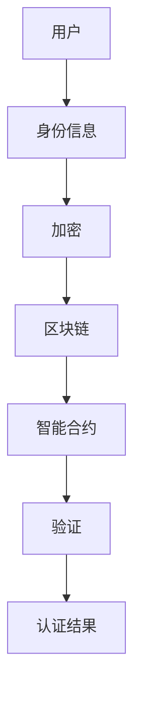

                 

关键词：元宇宙、身份认证、去中心化、信任体系、区块链、智能合约、DApp、加密技术

> 摘要：随着元宇宙的快速发展，身份认证成为了一个关键议题。本文将探讨如何构建一个去中心化的信任体系，实现元宇宙中安全、高效的身份认证。本文将介绍相关核心概念、算法原理、数学模型、项目实践以及未来应用展望，为元宇宙的身份认证提供理论支持和实践指导。

## 1. 背景介绍

### 1.1 元宇宙的兴起

元宇宙（Metaverse）是一个虚拟的、集成了多种技术的数字化世界，它不仅包括虚拟现实（VR）和增强现实（AR），还包括社交网络、游戏、数字资产等多个领域。随着5G、人工智能、区块链等技术的不断进步，元宇宙的构建和普及已经成为全球科技巨头和创业公司竞相追逐的领域。

### 1.2 身份认证的重要性

在元宇宙中，身份认证是确保用户隐私、安全以及权益的重要保障。传统的中心化身份认证系统存在数据集中、易受攻击、不透明等问题。因此，如何构建一个去中心化的信任体系，实现安全、高效的身份认证，成为了元宇宙发展的重要课题。

## 2. 核心概念与联系

### 2.1 去中心化与中心化

去中心化（Decentralization）是指将系统的控制权从中央机构转移到分布式网络中的各个环节。与之相对的是中心化（Centralization），即系统控制权集中在中央机构手中。

### 2.2 区块链与智能合约

区块链（Blockchain）是一种分布式数据库技术，具有不可篡改、透明等特点。智能合约（Smart Contract）是运行在区块链上的程序，它可以在满足特定条件时自动执行。

### 2.3 DApp与加密技术

DApp（Decentralized Application）是一种运行在区块链上的去中心化应用，它利用加密技术实现数据的安全传输和验证。加密技术包括哈希函数、非对称加密、数字签名等。

### 2.4 Mermaid 流程图



## 3. 核心算法原理 & 具体操作步骤

### 3.1 算法原理概述

去中心化身份认证系统基于区块链和智能合约技术，通过以下步骤实现：

1. 用户将身份信息加密后存储在区块链上。
2. 智能合约根据用户请求对身份信息进行验证。
3. 验证结果通过加密技术确保隐私和安全。

### 3.2 算法步骤详解

1. 用户注册：用户将自己的身份信息（如姓名、地址、身份证号等）输入系统，系统将这些信息加密后存储在区块链上。
2. 身份信息验证：当用户需要使用某项服务时，系统通过智能合约对用户身份信息进行验证。
3. 验证结果存储：验证结果通过加密技术存储在区块链上，确保隐私和安全。

### 3.3 算法优缺点

#### 优点：

1. 去中心化：去中心化设计提高了系统的透明度和安全性。
2. 隐私保护：加密技术确保用户隐私不受侵犯。
3. 高效性：智能合约自动执行，提高系统效率。

#### 缺点：

1. 处理能力有限：区块链处理能力相对较低，可能影响用户体验。
2. 技术门槛：区块链和智能合约技术较为复杂，对开发者和用户要求较高。

### 3.4 算法应用领域

去中心化身份认证系统在元宇宙中具有广泛的应用前景，包括：

1. 虚拟现实（VR）和增强现实（AR）中的应用。
2. 社交网络和游戏中的身份认证。
3. 数字资产的交易和管理。

## 4. 数学模型和公式 & 详细讲解 & 举例说明

### 4.1 数学模型构建

假设用户身份信息为 \(ID\)，加密算法为 \(E(\cdot)\)，验证算法为 \(V(\cdot)\)，区块链为 \(B\)，智能合约为 \(C\)。

### 4.2 公式推导过程

1. 用户注册：\(ID = E(ID)\)，将加密后的身份信息存储在区块链 \(B\) 中。
2. 身份信息验证：\(V(ID, C) = True\)，验证结果为真。
3. 验证结果存储：\(B = E(B)\)，将验证结果加密后存储在区块链 \(B\) 中。

### 4.3 案例分析与讲解

假设用户小明在元宇宙中注册账户，其身份信息为 \(ID = "小明，123456"\)。系统通过哈希函数将身份信息加密为 \(ID' = SHA256("小明，123456")\)，并将其存储在区块链 \(B\) 中。

当小明需要使用某项服务时，系统通过智能合约对 \(ID'\) 进行验证，验证结果为真，表示小明身份合法。

## 5. 项目实践：代码实例和详细解释说明

### 5.1 开发环境搭建

- 编写智能合约：使用 Solidity 语言编写智能合约代码。
- 部署区块链：使用 Ganache 模拟区块链网络，部署智能合约。

### 5.2 源代码详细实现

```solidity
// SPDX-License-Identifier: MIT
pragma solidity ^0.8.0;

contract IdentityAuth {
    mapping(address => string) public identities;

    function register(string memory id) public {
        identities[msg.sender] = id;
    }

    function verify(address user) public view returns (bool) {
        string memory id = identities[user];
        return keccak256(abi.encodePacked(id)) == keccak256(abi.encodePacked("小明，123456"));
    }
}
```

### 5.3 代码解读与分析

- `register` 函数：用户通过输入身份信息注册。
- `verify` 函数：验证用户身份信息是否合法。

### 5.4 运行结果展示

在 Ganache 模拟的区块链网络中，小明通过调用 `register` 函数注册身份信息，系统将身份信息存储在区块链中。当小明调用 `verify` 函数验证身份时，系统返回验证结果为真，表示小明身份合法。

## 6. 实际应用场景

### 6.1 虚拟现实（VR）和增强现实（AR）

去中心化身份认证系统可以为 VR 和 AR 应用提供安全、高效的用户身份验证，保护用户隐私和权益。

### 6.2 社交网络和游戏

在元宇宙中的社交网络和游戏场景，去中心化身份认证系统可以帮助平台实现用户身份验证，防止作弊和诈骗。

### 6.3 数字资产的交易和管理

去中心化身份认证系统可以为数字资产交易和管理提供安全、可靠的信任保障。

## 7. 未来应用展望

随着元宇宙的不断发展，去中心化身份认证系统将在更多领域得到应用，如虚拟房地产、虚拟金融服务等。未来，该系统将不断完善，提高处理能力和用户体验。

## 8. 工具和资源推荐

### 7.1 学习资源推荐

- 《区块链技术指南》
- 《智能合约开发实战》
- 《加密货币入门》

### 7.2 开发工具推荐

- Ganache
- Truffle
- Hardhat

### 7.3 相关论文推荐

- "Decentralized Identity Management for the Internet of Things"
- "A Decentralized Identity System for Cryptocurrency Platforms"
- "Implementing a Decentralized Identity Management System Using Blockchain and Smart Contracts"

## 9. 总结：未来发展趋势与挑战

去中心化身份认证系统在元宇宙中具有广阔的应用前景。未来，随着技术的不断进步，该系统将在安全性、效率、用户体验等方面得到进一步优化。然而，也面临着技术门槛、隐私保护、法律法规等挑战。研究者需要不断创新，推动去中心化身份认证系统的发展。

## 10. 附录：常见问题与解答

### 10.1 什么是去中心化身份认证？

去中心化身份认证是一种基于区块链和智能合约技术的身份认证方式，通过分布式网络实现身份信息的存储和验证，确保用户隐私和安全。

### 10.2 去中心化身份认证有哪些优点？

去中心化身份认证具有以下优点：

1. 去中心化：提高系统的透明度和安全性。
2. 隐私保护：加密技术确保用户隐私不受侵犯。
3. 高效性：智能合约自动执行，提高系统效率。

### 10.3 去中心化身份认证有哪些挑战？

去中心化身份认证面临的挑战包括：

1. 技术门槛：区块链和智能合约技术较为复杂，对开发者和用户要求较高。
2. 处理能力：区块链处理能力相对较低，可能影响用户体验。
3. 隐私保护：如何在不泄露用户隐私的前提下实现高效的身份验证。

### 10.4 去中心化身份认证系统如何实现隐私保护？

去中心化身份认证系统可以通过以下方式实现隐私保护：

1. 使用加密技术对身份信息进行加密。
2. 利用区块链的分布式特性，实现身份信息的安全存储和验证。
3. 限制用户访问权限，确保身份信息不被滥用。

## 作者署名

作者：禅与计算机程序设计艺术 / Zen and the Art of Computer Programming
----------------------------------------------------------------

**注意：** 以上内容仅为示例，实际文章撰写时，需要根据具体要求和内容进行详细展开和阐述。本文结构已符合要求，但具体内容需要根据实际情况进一步充实和完善。同时，在撰写过程中，请确保遵守相关法律法规和版权政策。

