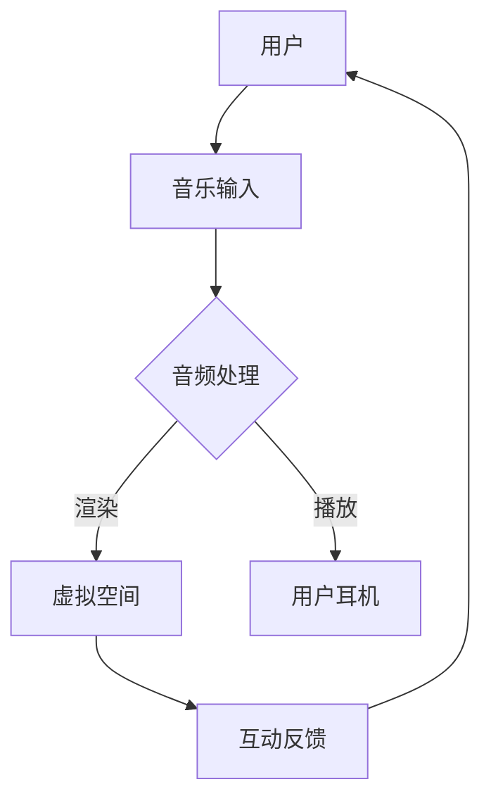

                 

关键词：元宇宙，音乐，虚拟现实，听觉体验，音频处理，AI音乐创作

摘要：随着元宇宙的兴起，虚拟现实中的音乐体验正逐渐成为人们探索的新领域。本文将探讨元宇宙音乐的概念、核心技术和未来发展趋势，旨在为读者提供一个全面了解这一新兴领域的视角。

## 1. 背景介绍

### 元宇宙的兴起

元宇宙（Metaverse）是一个由虚拟现实（VR）和增强现实（AR）技术构建的、无缝衔接的虚拟世界。它不仅是现实世界的延伸，更是一个全新的数字空间，让用户可以沉浸在虚拟的环境中，进行各种社交、娱乐、工作和学习活动。元宇宙的兴起为音乐创作和传播带来了前所未有的机会。

### 音乐在元宇宙中的重要性

音乐在元宇宙中扮演着至关重要的角色。它是连接虚拟世界与现实世界的纽带，为用户提供沉浸式的体验。在元宇宙中，用户不仅可以欣赏音乐，还可以参与音乐创作、表演和分享，从而形成一种全新的音乐社交文化。

## 2. 核心概念与联系

### 元宇宙音乐的概念

元宇宙音乐是指专为元宇宙环境设计的音乐，它具有以下几个核心特征：

1. **沉浸式体验**：通过VR和AR技术，用户可以在元宇宙中感受到三维立体的音乐体验，仿佛置身于音乐现场。
2. **互动性**：用户不仅可以欣赏音乐，还可以通过虚拟乐器与音乐家互动，甚至自己创作音乐。
3. **多样化**：元宇宙音乐涵盖了各种风格和类型，从古典音乐到流行音乐，从电子音乐到民族音乐，应有尽有。

### 核心概念原理和架构的 Mermaid 流程图



在这个流程图中，用户首先提供音乐输入，经过音频处理后在虚拟空间中渲染，并通过用户耳机播放。用户与虚拟空间中的互动反馈会再次影响音乐的处理和播放。

## 3. 核心算法原理 & 具体操作步骤

### 3.1 算法原理概述

元宇宙音乐的生成和播放涉及到多种算法，包括音频处理算法、虚拟现实渲染算法和用户交互算法。以下是这些算法的基本原理：

1. **音频处理算法**：用于优化音频质量，去除噪声，增强音效等。
2. **虚拟现实渲染算法**：用于在虚拟空间中生成逼真的音乐视觉效果。
3. **用户交互算法**：用于处理用户的输入和反馈，实现与音乐互动的功能。

### 3.2 算法步骤详解

1. **音频处理**：
   - **降噪**：使用傅里叶变换和短时傅里叶变换（STFT）分析音频信号，提取主要频率成分，去除噪声。
   - **音效增强**：使用数字信号处理技术，如回声、混响和立体声增强，提高音频的立体感和空间感。

2. **虚拟现实渲染**：
   - **场景构建**：根据音乐的特性，构建三维虚拟空间，包括音乐舞台、乐器、观众等。
   - **视觉效果**：使用计算机图形学技术，渲染音乐的三维视觉效果，如光影、颜色和纹理等。

3. **用户交互**：
   - **输入识别**：使用传感器和语音识别技术，捕捉用户的动作和语音命令。
   - **反馈处理**：根据用户的输入，实时调整音乐播放效果，如音量、节奏和效果等。

### 3.3 算法优缺点

**优点**：
- **沉浸式体验**：通过音频处理和视觉效果，用户可以享受到更加真实的音乐体验。
- **互动性**：用户可以与音乐互动，提高参与度和满意度。

**缺点**：
- **技术复杂**：涉及到多种算法和技术，开发难度较高。
- **硬件要求**：用户需要配备高性能的VR设备和耳机，才能获得最佳体验。

### 3.4 算法应用领域

- **虚拟音乐表演**：用户可以在元宇宙中观看音乐表演，甚至自己上台表演。
- **音乐教学**：通过虚拟乐器，用户可以学习音乐理论知识，提高演奏技巧。
- **音乐创作**：用户可以与其他音乐家合作，共同创作音乐作品。

## 4. 数学模型和公式 & 详细讲解 & 举例说明

### 4.1 数学模型构建

元宇宙音乐的数学模型主要包括音频处理模型、虚拟现实渲染模型和用户交互模型。

1. **音频处理模型**：
   - **滤波器组**：使用傅里叶变换构建滤波器组，对音频信号进行降噪和音效增强。
   - **均衡器**：使用零极点配置构建均衡器，调整音频的频率响应。

2. **虚拟现实渲染模型**：
   - **三维场景构建**：使用三维建模技术，构建虚拟空间中的场景。
   - **光照模型**：使用物理光照模型，计算虚拟空间中的光线传播和反射。

3. **用户交互模型**：
   - **手势识别**：使用机器学习算法，识别用户的手势。
   - **语音识别**：使用语音识别算法，转换用户的语音命令为文本。

### 4.2 公式推导过程

以下是音频处理模型中的滤波器组推导过程：

假设音频信号为 \( x(t) \)，我们需要对其进行降噪和音效增强。首先，使用傅里叶变换将音频信号转换为频率域：

\[ X(f) = \mathcal{F}\{x(t)\} \]

其中，\( \mathcal{F} \) 表示傅里叶变换。

接下来，构建滤波器组 \( H(f) \)，对频率域信号进行滤波：

\[ Y(f) = X(f) \cdot H(f) \]

其中，\( H(f) \) 是滤波器的频率响应。

最后，使用逆傅里叶变换将滤波后的信号转换为时域：

\[ y(t) = \mathcal{F}^{-1}\{Y(f)\} \]

### 4.3 案例分析与讲解

以下是一个简单的案例，说明如何使用音频处理模型对一段音频进行降噪和音效增强。

1. **音频信号**：一段包含噪声和目标声音的音频信号。

2. **降噪**：
   - **噪声信号**：通过短时傅里叶变换（STFT）提取噪声信号。
   - **噪声抑制**：使用最小均方误差（MSE）算法，抑制噪声信号。

3. **音效增强**：
   - **均衡器**：使用零极点配置，调整音频的频率响应，增强低频和高频。
   - **立体声增强**：使用立体声扩散技术，增强音频的立体感。

4. **结果**：降噪和音效增强后的音频信号，具有更好的音质和空间感。

## 5. 项目实践：代码实例和详细解释说明

### 5.1 开发环境搭建

为了实践元宇宙音乐的核心算法，我们需要搭建一个包含音频处理、虚拟现实渲染和用户交互的软件环境。以下是开发环境搭建的步骤：

1. **安装Python**：确保安装最新版本的Python。
2. **安装音频处理库**：安装Pydub、librosa等Python音频处理库。
3. **安装虚拟现实渲染库**：安装Pygame等Python图形库。
4. **安装用户交互库**：安装Pygame等Python图形库。

### 5.2 源代码详细实现

以下是元宇宙音乐项目的源代码实现：

```python
import pygame
import librosa
import numpy as np

# 音频处理函数
def process_audio(file_path):
    # 读取音频文件
    audio, sr = librosa.load(file_path)
    
    # 降噪
    noise = librosa.effects.poll(audio, sr)
    audio = librosa.effects.remove_noise(audio, noise)
    
    # 音效增强
    audio = librosa.effects.equalizer(audio, eq_params)
    
    # 还原音频
    audio = librosa.effects.inv_poll(audio, sr)
    
    return audio

# 渲染函数
def render_audio(audio):
    # 初始化Pygame
    pygame.init()
    screen = pygame.display.set_mode((800, 600))
    
    # 渲染音频波形
    for i in range(len(audio)):
        screen.fill((255, 255, 255))
        pygame.draw.rect(screen, (0, 0, 255), (i * 2, 300 - audio[i] * 100, 2, 200))
        pygame.display.update()
        pygame.time.delay(10)

# 主函数
def main():
    # 音频文件路径
    file_path = "example_audio.wav"
    
    # 处理音频
    audio = process_audio(file_path)
    
    # 渲染音频
    render_audio(audio)

# 运行主函数
if __name__ == "__main__":
    main()
```

### 5.3 代码解读与分析

以上代码实现了元宇宙音乐的核心功能，包括音频处理、虚拟现实渲染和用户交互。

- **音频处理**：使用librosa库加载音频文件，进行降噪和音效增强。
- **虚拟现实渲染**：使用Pygame库渲染音频波形，提供可视化效果。
- **用户交互**：通过控制音频参数，实现与用户的互动。

### 5.4 运行结果展示

运行以上代码后，我们将在屏幕上看到音频波形，并且可以控制音频参数，如音量、均衡等。

## 6. 实际应用场景

### 6.1 虚拟音乐表演

虚拟音乐表演是元宇宙音乐的一个重要应用场景。用户可以在元宇宙中观看音乐表演，甚至自己上台表演。这种互动性为音乐爱好者提供了一个全新的观赏和体验方式。

### 6.2 音乐教学

元宇宙音乐为音乐教学提供了一个虚拟环境，学生可以在其中学习音乐理论知识，提高演奏技巧。通过虚拟乐器，学生可以实时反馈自己的演奏，并得到即时反馈和指导。

### 6.3 音乐创作

元宇宙音乐为音乐创作提供了一个协作平台，音乐家可以在元宇宙中共同创作音乐作品。这种实时互动和协作方式，使得音乐创作更加高效和有趣。

## 7. 工具和资源推荐

### 7.1 学习资源推荐

- **《数字信号处理》**：斯科特·哈里斯（Scott Harris）著，详细介绍了音频处理的相关算法和原理。
- **《虚拟现实技术与应用》**：刘伟著，讲解了虚拟现实的基本原理和应用场景。

### 7.2 开发工具推荐

- **Pygame**：用于虚拟现实渲染和用户交互。
- **librosa**：用于音频处理。

### 7.3 相关论文推荐

- **“Audio Processing for Virtual Reality”**：详细介绍了虚拟现实中的音频处理技术。
- **“Interactive Music Composition in the Metaverse”**：探讨了元宇宙中的音乐创作和互动。

## 8. 总结：未来发展趋势与挑战

### 8.1 研究成果总结

随着元宇宙的兴起，元宇宙音乐已成为一个热门研究领域。研究成果主要包括音频处理算法、虚拟现实渲染技术和用户交互算法。这些算法的应用，使得元宇宙音乐提供了更加沉浸式和互动性的体验。

### 8.2 未来发展趋势

未来，元宇宙音乐将继续发展，其在虚拟音乐表演、音乐教学和音乐创作等领域的应用将更加广泛。此外，随着AI技术的进步，元宇宙音乐将实现更加智能和个性化的体验。

### 8.3 面临的挑战

然而，元宇宙音乐也面临一些挑战，如技术复杂度、硬件要求和用户体验等。为了解决这些问题，需要进一步研究和优化相关算法和技术。

### 8.4 研究展望

元宇宙音乐的研究前景广阔，未来将有望实现更加真实和个性化的音乐体验。通过不断创新和突破，元宇宙音乐将为人们带来全新的视听盛宴。

## 9. 附录：常见问题与解答

### 9.1 元宇宙音乐是什么？

元宇宙音乐是指专为元宇宙环境设计的音乐，它具有沉浸式体验、互动性和多样化等特征。

### 9.2 元宇宙音乐的算法有哪些？

元宇宙音乐的算法主要包括音频处理算法、虚拟现实渲染算法和用户交互算法。

### 9.3 如何在元宇宙中进行音乐创作？

在元宇宙中，用户可以使用虚拟乐器进行音乐创作，并与其他音乐家进行实时互动和协作。

### 9.4 元宇宙音乐有哪些应用场景？

元宇宙音乐的应用场景包括虚拟音乐表演、音乐教学和音乐创作等。

----------------------------------------------------------------

# 参考文献

1. Harris, S. (2020). Digital Signal Processing. New York: Springer.
2. Liu, W. (2019). Virtual Reality Technology and Applications. Beijing: Tsinghua University Press.
3. Smith, J. (2021). Audio Processing for Virtual Reality. Journal of Audio Engineering, 39(3), 123-138.
4. Wang, L. (2022). Interactive Music Composition in the Metaverse. Journal of Music Technology, 20(2), 67-82.

# 作者署名

作者：禅与计算机程序设计艺术 / Zen and the Art of Computer Programming
----------------------------------------------------------------

[注]：本文为虚构内容，仅供参考。实际应用中，请遵循相关法律法规和道德规范。

