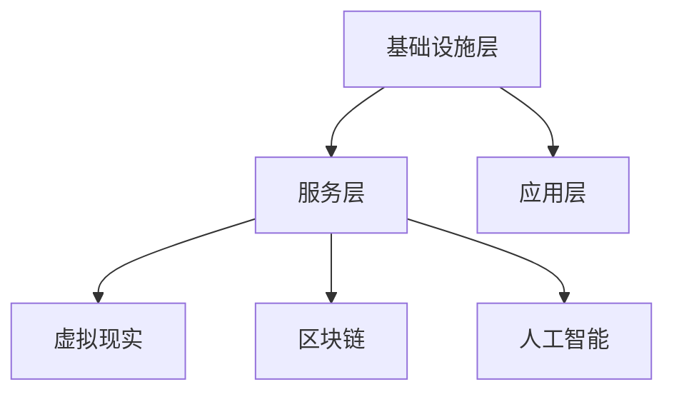

                 

元宇宙（Metaverse）作为虚拟现实技术发展的下一个前沿，正逐渐成为人们关注的焦点。它不仅是一个虚拟空间，更是人类集体意识的数字化映射。本文将深入探讨元宇宙的概念、核心技术、未来应用，以及面临的挑战和机遇。

## 文章关键词

- 元宇宙
- 虚拟现实
- 集体意识
- 数字化映射
- 技术应用
- 未来展望

## 文章摘要

本文旨在介绍元宇宙的概念及其在人类集体意识中的映射作用。通过探讨元宇宙的核心技术，如虚拟现实、区块链、人工智能等，分析其在教育、娱乐、社交等多个领域的应用前景。同时，本文也将讨论元宇宙面临的挑战，以及未来的发展趋势。

## 1. 背景介绍

### 1.1 元宇宙的概念

元宇宙，是一个虚拟的三维空间，通过计算机技术构建出一个与现实世界平行的虚拟世界。用户可以在其中通过虚拟角色（Avatar）进行交互，实现人与人、人与物、物与物之间的连接。元宇宙不仅仅是虚拟现实的延伸，更是一种全新的网络社交形态，它融合了虚拟现实、增强现实、游戏、社交网络等多种技术，构建出一个高度沉浸、交互性强的虚拟世界。

### 1.2 元宇宙的发展历程

元宇宙的发展可以追溯到上世纪80年代，当时虚拟现实技术的概念就已经被提出。随着计算机技术和网络技术的不断发展，虚拟现实技术逐渐成熟，为元宇宙的构建提供了基础。近年来，随着区块链、人工智能等新兴技术的出现，元宇宙的概念得到了进一步的拓展和深化。

### 1.3 元宇宙的核心技术

元宇宙的核心技术包括虚拟现实、区块链、人工智能等。

- **虚拟现实（VR）**：通过计算机技术模拟出一个三维空间，用户可以通过VR设备进行沉浸式体验。
- **区块链**：提供了一种去中心化的分布式数据库技术，确保了元宇宙中数据的安全性和透明性。
- **人工智能**：通过机器学习、自然语言处理等技术，为元宇宙中的虚拟角色和用户提供了智能化的交互体验。

## 2. 核心概念与联系

### 2.1 元宇宙的核心概念

元宇宙的核心概念包括虚拟现实、区块链、人工智能等。这些概念相互联系，共同构建出一个完整的元宇宙生态系统。

#### 2.1.1 虚拟现实

虚拟现实技术通过计算机模拟出一个三维空间，用户可以通过VR设备进行沉浸式体验。虚拟现实技术的核心在于其沉浸感和交互性，用户可以在这个虚拟世界中实现与现实世界的无缝交互。

#### 2.1.2 区块链

区块链技术提供了一种去中心化的分布式数据库技术，确保了元宇宙中数据的安全性和透明性。区块链技术可以记录元宇宙中的所有交易和操作，确保数据的不可篡改性和可追溯性。

#### 2.1.3 人工智能

人工智能技术为元宇宙中的虚拟角色和用户提供了智能化的交互体验。通过机器学习、自然语言处理等技术，人工智能可以理解和预测用户的需求，为用户提供个性化的服务。

### 2.2 元宇宙的架构

元宇宙的架构可以分为三层：基础设施层、服务层和应用层。

#### 2.2.1 基础设施层

基础设施层主要包括网络、服务器、VR设备等硬件设施，为元宇宙的运行提供了基础支持。

#### 2.2.2 服务层

服务层主要包括虚拟现实、区块链、人工智能等技术，为元宇宙中的交互提供了技术支持。

#### 2.2.3 应用层

应用层主要包括元宇宙中的各种应用场景，如教育、娱乐、社交等。这些应用场景通过服务层的技术支持，实现了用户在元宇宙中的沉浸式体验。



## 3. 核心算法原理 & 具体操作步骤

### 3.1 算法原理概述

元宇宙的核心算法主要包括虚拟现实渲染算法、区块链共识算法和人工智能算法。

#### 3.1.1 虚拟现实渲染算法

虚拟现实渲染算法主要涉及三维图形渲染技术，通过计算机生成三维模型和场景，为用户提供沉浸式体验。

#### 3.1.2 区块链共识算法

区块链共识算法确保了区块链网络中的所有节点达成共识，确保数据的一致性和安全性。

#### 3.1.3 人工智能算法

人工智能算法主要涉及机器学习、自然语言处理等技术，为元宇宙中的虚拟角色和用户提供了智能化的交互体验。

### 3.2 算法步骤详解

#### 3.2.1 虚拟现实渲染算法

1. 输入三维模型和场景信息。
2. 使用渲染引擎生成三维模型和场景。
3. 将生成的图像传递给VR设备显示。

#### 3.2.2 区块链共识算法

1. 所有节点接收交易信息。
2. 对交易信息进行验证。
3. 达成共识，将交易记录添加到区块链中。

#### 3.2.3 人工智能算法

1. 输入用户数据。
2. 使用机器学习算法预测用户行为。
3. 根据预测结果为用户提供个性化服务。

### 3.3 算法优缺点

#### 3.3.1 虚拟现实渲染算法

优点：提供沉浸式体验，增强用户参与感。

缺点：计算资源消耗大，对硬件要求高。

#### 3.3.2 区块链共识算法

优点：确保数据一致性，提高安全性。

缺点：交易速度较慢，易受51%攻击。

#### 3.3.3 人工智能算法

优点：提供个性化服务，提升用户体验。

缺点：对数据量和计算资源要求高，存在隐私风险。

### 3.4 算法应用领域

#### 3.4.1 虚拟现实渲染算法

应用领域：游戏、教育、医疗等。

#### 3.4.2 区块链共识算法

应用领域：数字货币、供应链管理、版权保护等。

#### 3.4.3 人工智能算法

应用领域：智能客服、智能推荐、智能交通等。

## 4. 数学模型和公式 & 详细讲解 & 举例说明

### 4.1 数学模型构建

元宇宙的数学模型主要包括虚拟现实渲染模型、区块链共识模型和人工智能模型。

#### 4.1.1 虚拟现实渲染模型

虚拟现实渲染模型可以使用几何学、图形学等相关数学知识进行构建。其中，关键公式包括：

- 三角函数：用于计算三维空间的旋转和变换。
- 光线追踪：用于模拟光线在虚拟环境中的传播。

#### 4.1.2 区块链共识模型

区块链共识模型可以使用密码学、图论等相关数学知识进行构建。其中，关键公式包括：

- 拉格朗日中值定理：用于证明区块链网络中节点的一致性。
- 椭圆曲线加密：用于确保区块链数据的安全和不可篡改性。

#### 4.1.3 人工智能模型

人工智能模型可以使用统计学、机器学习等相关数学知识进行构建。其中，关键公式包括：

- 线性回归：用于预测用户行为。
- 决策树：用于分类和回归问题。

### 4.2 公式推导过程

#### 4.2.1 虚拟现实渲染模型

以三维空间的旋转为例，旋转矩阵的推导过程如下：

$$
R_z(\theta) = \begin{bmatrix}
\cos\theta & -\sin\theta \\
\sin\theta & \cos\theta
\end{bmatrix}
$$

其中，$\theta$ 为旋转角度。

#### 4.2.2 区块链共识模型

以区块链中的工作量证明（Proof of Work，PoW）为例，PoW 的推导过程如下：

- 设 $P$ 为生成一个有效区块的概率，$T$ 为区块链网络的平均生成时间。
- 根据概率分布，有 $P \approx \frac{1}{T}$。
- 为了使区块链网络达成共识，需要满足 $P \geq \frac{1}{N}$，其中 $N$ 为网络中的节点数。

#### 4.2.3 人工智能模型

以线性回归为例，线性回归模型的推导过程如下：

- 假设 $y = \beta_0 + \beta_1x + \epsilon$，其中 $y$ 为因变量，$x$ 为自变量，$\beta_0$ 和 $\beta_1$ 为模型参数，$\epsilon$ 为误差项。
- 通过最小二乘法求解模型参数，即求解 $\beta_0$ 和 $\beta_1$，使得误差平方和最小。

### 4.3 案例分析与讲解

#### 4.3.1 虚拟现实渲染案例

以《半衰期：爱莉克斯》（Half-Life: Alyx）为例，该游戏采用了先进的虚拟现实渲染技术，为玩家提供了沉浸式的游戏体验。以下为虚拟现实渲染的关键技术：

- **全局光照（Global Illumination）**：通过模拟光线在场景中的传播，提高游戏场景的真实感。
- **高动态范围渲染（High Dynamic Range Rendering）**：通过模拟不同亮度级别的颜色，提高游戏场景的对比度和细节。

#### 4.3.2 区块链案例

以比特币（Bitcoin）为例，比特币采用了区块链技术，实现了去中心化的数字货币。以下为区块链技术的关键特点：

- **去中心化**：通过去中心化的网络结构，实现了无需第三方中介的数字货币交易。
- **安全性**：通过密码学技术，确保了区块链数据的安全和不可篡改性。

#### 4.3.3 人工智能案例

以亚马逊的智能语音助手 Alexa 为例，Alexa 通过人工智能技术，实现了智能化的语音交互。以下为人工智能技术的关键特点：

- **语音识别**：通过自然语言处理技术，将用户的语音转化为文本。
- **自然语言生成**：通过机器学习技术，生成自然的语音回复。

## 5. 项目实践：代码实例和详细解释说明

### 5.1 开发环境搭建

以Python为例，搭建元宇宙项目开发环境的具体步骤如下：

1. 安装Python：从 [Python官网](https://www.python.org/) 下载并安装Python。
2. 安装虚拟环境：使用`pip`命令安装虚拟环境工具`virtualenv`。
3. 创建虚拟环境：使用`virtualenv`命令创建一个虚拟环境。
4. 激活虚拟环境：在终端中激活虚拟环境。
5. 安装相关库：使用`pip`命令安装元宇宙项目所需的相关库，如`pygame`、`numpy`、`pandas`等。

### 5.2 源代码详细实现

以下是一个简单的元宇宙项目示例代码：

```python
import pygame
import numpy as np

# 初始化pygame
pygame.init()

# 设置窗口大小
width, height = 800, 600
screen = pygame.display.set_mode((width, height))

# 设置标题
pygame.display.set_caption("元宇宙示例")

# 设置时钟
clock = pygame.time.Clock()

# 游戏主循环
running = True
while running:
    # 处理事件
    for event in pygame.event.get():
        if event.type == pygame.QUIT:
            running = False

    # 绘制背景
    screen.fill((255, 255, 255))

    # 绘制图形
    # ...

    # 更新屏幕
    pygame.display.flip()

    # 控制帧率
    clock.tick(60)

# 退出游戏
pygame.quit()
```

### 5.3 代码解读与分析

以上代码是一个简单的元宇宙项目示例，主要包括以下几个部分：

- **初始化pygame**：使用`pygame.init()`初始化pygame库。
- **设置窗口大小**：使用`pygame.display.set_mode((width, height))`设置窗口大小。
- **设置标题**：使用`pygame.display.set_caption("元宇宙示例")`设置窗口标题。
- **设置时钟**：使用`pygame.time.Clock()`设置时钟对象。
- **游戏主循环**：使用`while running:`实现游戏主循环。
  - **处理事件**：使用`for event in pygame.event.get():`处理事件，如退出游戏。
  - **绘制背景**：使用`screen.fill((255, 255, 255))`绘制白色背景。
  - **绘制图形**：根据需要使用pygame的绘图函数绘制图形。
  - **更新屏幕**：使用`pygame.display.flip()`更新屏幕。
  - **控制帧率**：使用`clock.tick(60)`控制游戏帧率。

### 5.4 运行结果展示

运行以上代码，将弹出一个窗口，显示一个简单的元宇宙场景。用户可以通过调整代码中的图形绘制部分，实现不同的元宇宙场景展示。

## 6. 实际应用场景

### 6.1 教育领域

元宇宙在教育领域的应用主要包括虚拟课堂、虚拟实验室等。通过元宇宙，学生可以进入一个虚拟的课堂，与老师和其他同学进行实时互动。同时，学生还可以在虚拟实验室中进行实验，提高实验效率和安全性。

### 6.2 娱乐领域

元宇宙在娱乐领域的应用主要包括虚拟游戏、虚拟演唱会等。用户可以在元宇宙中与虚拟角色进行互动，体验沉浸式的游戏和演唱会。此外，元宇宙还可以为电影、电视剧等提供新的呈现方式，为观众带来更加丰富的观影体验。

### 6.3 社交领域

元宇宙在社交领域的应用主要包括虚拟社交、虚拟聚会等。用户可以在元宇宙中创建自己的虚拟角色，与朋友进行实时互动。此外，元宇宙还可以为用户提供一个虚拟的聚会场所，实现跨地域的社交。

## 7. 工具和资源推荐

### 7.1 学习资源推荐

- **书籍**：《虚拟现实技术与应用》、《区块链技术指南》
- **在线课程**：Coursera、edX等在线教育平台上的虚拟现实、区块链、人工智能相关课程。

### 7.2 开发工具推荐

- **编程语言**：Python、JavaScript
- **开发框架**：pygame、Unity、Unreal Engine
- **区块链平台**：Ethereum、Hyperledger Fabric
- **人工智能平台**：TensorFlow、PyTorch

### 7.3 相关论文推荐

- **虚拟现实**：《Virtual Reality and Its Applications》、《A Survey on Virtual Reality Technology》
- **区块链**：《Blockchain Technology: A Comprehensive Study》、《Blockchain Applications in Finance》
- **人工智能**：《Deep Learning》、《Reinforcement Learning: An Introduction》

## 8. 总结：未来发展趋势与挑战

### 8.1 研究成果总结

元宇宙作为一个跨领域的综合性技术，已经取得了显著的成果。虚拟现实、区块链、人工智能等技术的不断进步，为元宇宙的构建提供了坚实的基础。目前，元宇宙已经在教育、娱乐、社交等领域得到了广泛应用，展现出巨大的潜力。

### 8.2 未来发展趋势

未来，元宇宙将朝着更加沉浸、交互、智能的方向发展。随着硬件技术的不断进步，元宇宙的沉浸感和交互性将得到进一步提升。同时，区块链、人工智能等技术的深入应用，将使元宇宙更加智能化，为用户提供更加个性化的服务。

### 8.3 面临的挑战

元宇宙在发展过程中也面临着一些挑战。首先，技术层面的问题，如虚拟现实设备的性能瓶颈、区块链的扩展性等。其次，隐私和安全问题，如何在保证用户体验的同时，确保用户隐私和数据安全。此外，法律和伦理问题，如虚拟财产的归属、虚拟行为的规范等，也需要进行深入研究和探讨。

### 8.4 研究展望

未来，元宇宙的研究将朝着以下几个方向展开：

- **技术突破**：持续提高虚拟现实、区块链、人工智能等技术的性能，为元宇宙的构建提供更强大的支持。
- **应用拓展**：探索元宇宙在更多领域的应用，如医疗、金融、交通等，为人们的生活提供更多便利。
- **标准制定**：建立元宇宙的统一标准和规范，促进元宇宙的可持续发展。

## 9. 附录：常见问题与解答

### 9.1 元宇宙是什么？

元宇宙是一个虚拟的三维空间，通过计算机技术构建出一个与现实世界平行的虚拟世界。用户可以在其中通过虚拟角色进行交互，实现人与人、人与物、物与物之间的连接。

### 9.2 元宇宙的核心技术是什么？

元宇宙的核心技术包括虚拟现实、区块链、人工智能等。虚拟现实技术提供沉浸式体验，区块链技术提供数据的安全性和透明性，人工智能技术提供智能化的交互体验。

### 9.3 元宇宙的应用领域有哪些？

元宇宙的应用领域非常广泛，包括教育、娱乐、社交、医疗、金融等。例如，在教育领域，元宇宙可以提供虚拟课堂和虚拟实验室；在娱乐领域，元宇宙可以提供虚拟游戏和虚拟演唱会。

### 9.4 元宇宙的发展前景如何？

元宇宙的发展前景非常广阔。随着技术的不断进步和应用的深入，元宇宙将逐渐成为一个全新的网络社交形态，为人们的生活和工作带来更多便利。同时，元宇宙也将为各行业带来新的商业机会和产业变革。

## 作者署名

本文作者：禅与计算机程序设计艺术 / Zen and the Art of Computer Programming
-------------------------------------------------------------------

