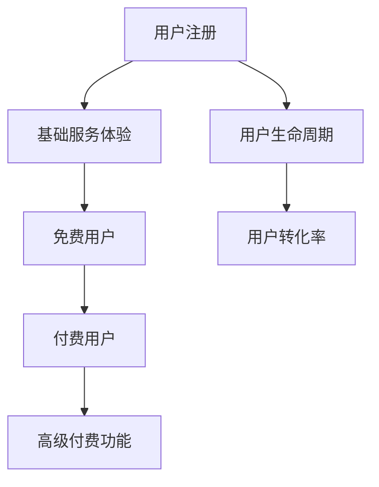

                 

关键词：免费增值模式、创业产品、商业模式、用户增长、收益最大化

摘要：本文将探讨免费增值模式在创业产品中的应用，分析其核心概念、原理、优点、缺点以及应用领域。通过具体实例，我们将深入解析免费增值模式在创业产品开发中的实际操作步骤，并展望其未来的发展前景。

## 1. 背景介绍

在当今数字化时代，互联网创业产品的竞争日益激烈。为了在众多竞争者中脱颖而出，创业者们不断探索各种创新的商业模式。免费增值模式（Freemium Model）作为一种流行的商业模式，近年来在创业产品中得到了广泛应用。免费增值模式的核心在于提供免费的基础服务，同时通过提供付费的高级功能或服务来吸引并留住用户，从而实现收益的最大化。

本文将围绕免费增值模式在创业产品中的应用，探讨其核心概念、原理、优点、缺点以及应用领域。通过具体实例，我们将深入解析免费增值模式在创业产品开发中的实际操作步骤，并展望其未来的发展前景。

### 核心概念

免费增值模式是指产品或服务提供免费的基础功能，同时通过提供付费的高级功能或服务来吸引用户并实现盈利。免费增值模式的核心在于通过免费服务吸引用户，再通过付费服务实现收益的最大化。

### 原理

免费增值模式的原理可以概括为以下几点：

1. **免费吸引流量**：通过提供免费的基础服务，吸引大量的用户使用产品或服务。

2. **用户增长**：随着用户的增加，免费增值模式的核心优势逐渐显现。

3. **高级付费功能**：在基础功能之外，提供高级付费功能，满足用户的个性化需求。

4. **收益最大化**：通过高级付费功能，实现收益的最大化。

### 优点

1. **用户基数大**：免费增值模式能够吸引大量的用户，增加产品的用户基数。

2. **盈利潜力高**：高级付费功能的收益潜力较大，有利于实现收益的最大化。

3. **用户粘性高**：免费增值模式能够留住用户，提高用户的忠诚度。

4. **市场拓展**：免费增值模式能够快速占领市场，扩大产品的影响力。

### 缺点

1. **竞争激烈**：免费增值模式在市场上普遍应用，导致竞争激烈。

2. **用户体验差**：免费用户可能会受到广告干扰，影响用户体验。

3. **盈利周期长**：虽然高级付费功能的盈利潜力大，但用户转化率较低，盈利周期较长。

4. **用户流失风险**：免费增值模式容易导致用户流失，需要不断优化产品和服务。

## 2. 核心概念与联系

为了更好地理解免费增值模式，我们首先需要了解几个核心概念：

1. **基础服务**：免费增值模式中的基础服务是指提供给所有用户的基本功能，这些功能无需付费即可使用。

2. **高级付费功能**：高级付费功能是指仅对付费用户开放的功能，这些功能能够满足用户的个性化需求。

3. **用户生命周期**：用户生命周期是指用户从首次接触到产品到最后流失的过程。

4. **用户转化率**：用户转化率是指从免费用户到付费用户的转化比例。

下面是一个简化的 Mermaid 流程图，展示了免费增值模式的核心概念和联系：



## 3. 核心算法原理 & 具体操作步骤

### 3.1 算法原理概述

免费增值模式的核心算法原理主要涉及以下几个方面：

1. **用户获取**：通过免费服务吸引用户，增加用户基数。

2. **用户转化**：通过高级付费功能，提高用户的转化率。

3. **收益计算**：根据用户转化率和高级付费功能的定价，计算产品的收益。

### 3.2 算法步骤详解

1. **用户获取**：

   - 通过互联网广告、社交媒体推广等方式，吸引潜在用户。
   - 提供免费的基础服务，吸引用户注册和使用产品。

2. **用户转化**：

   - 对免费用户进行行为分析，了解其需求和偏好。
   - 推出高级付费功能，满足用户的个性化需求。
   - 通过优惠活动、推荐系统等方式，提高用户的转化率。

3. **收益计算**：

   - 根据用户转化率和高级付费功能的定价，计算产品的收益。
   - 持续优化产品和服务，提高用户满意度和转化率。

### 3.3 算法优缺点

#### 优点

1. **低成本获取用户**：通过免费服务吸引用户，降低用户获取成本。

2. **高转化率**：高级付费功能能够满足用户的个性化需求，提高转化率。

3. **高收益**：高级付费功能的定价较高，有利于实现收益的最大化。

#### 缺点

1. **用户体验差**：免费用户可能会受到广告干扰，影响用户体验。

2. **用户流失风险**：免费增值模式容易导致用户流失，需要不断优化产品和服务。

### 3.4 算法应用领域

免费增值模式广泛应用于多个领域，包括但不限于：

1. **在线教育**：提供免费课程，通过付费课程实现盈利。

2. **游戏**：提供免费游戏，通过付费道具、订阅服务等实现盈利。

3. **软件应用**：提供免费的基础功能，通过高级付费功能实现盈利。

## 4. 数学模型和公式 & 详细讲解 & 举例说明

### 4.1 数学模型构建

免费增值模式的数学模型主要涉及以下几个方面：

1. **用户增长模型**：

   - 用户增长速率：$$r = \alpha \cdot e^{-\beta \cdot t}$$

     其中，$r$ 表示用户增长速率，$\alpha$ 表示初始增长速率，$\beta$ 表示用户增长减缓速率，$t$ 表示时间。

   - 用户总数：$$N = \frac{\alpha}{\beta} \cdot (1 - e^{-\beta \cdot t})$$

     其中，$N$ 表示用户总数。

2. **收益计算模型**：

   - 收益率：$$R = \gamma \cdot e^{-\delta \cdot t}$$

     其中，$R$ 表示收益率，$\gamma$ 表示初始收益率，$\delta$ 表示收益减缓速率，$t$ 表示时间。

   - 总收益：$$T = \frac{\gamma}{\delta} \cdot (1 - e^{-\delta \cdot t})$$

     其中，$T$ 表示总收益。

### 4.2 公式推导过程

#### 用户增长模型推导

假设在$t=0$时，用户总数为$N_0$，初始增长速率为$\alpha$，用户增长减缓速率为$\beta$。

根据指数增长模型，用户增长速率$r$可以表示为：

$$r = \frac{dN}{dt} = \alpha \cdot e^{-\beta \cdot t}$$

两边同时积分，得到：

$$N = \int_0^t r \cdot dt = \int_0^t \alpha \cdot e^{-\beta \cdot t} \cdot dt$$

$$N = \frac{\alpha}{\beta} \cdot (1 - e^{-\beta \cdot t}) + C$$

其中，$C$ 为常数。由于$t=0$时，$N=N_0$，代入上式，得到：

$$N_0 = \frac{\alpha}{\beta} \cdot (1 - e^{-\beta \cdot 0}) + C$$

$$C = N_0 - \frac{\alpha}{\beta}$$

代入原式，得到：

$$N = \frac{\alpha}{\beta} \cdot (1 - e^{-\beta \cdot t}) + N_0 - \frac{\alpha}{\beta}$$

$$N = \frac{\alpha}{\beta} \cdot (1 - e^{-\beta \cdot t}) + N_0$$

#### 收益计算模型推导

假设在$t=0$时，初始收益率为$\gamma$，收益减缓速率为$\delta$。

根据指数增长模型，收益增长率$R$可以表示为：

$$R = \frac{dT}{dt} = \gamma \cdot e^{-\delta \cdot t}$$

两边同时积分，得到：

$$T = \int_0^t R \cdot dt = \int_0^t \gamma \cdot e^{-\delta \cdot t} \cdot dt$$

$$T = \frac{\gamma}{\delta} \cdot (1 - e^{-\delta \cdot t}) + C$$

其中，$C$ 为常数。由于$t=0$时，$T=0$，代入上式，得到：

$$0 = \frac{\gamma}{\delta} \cdot (1 - e^{-\delta \cdot 0}) + C$$

$$C = 0 - \frac{\gamma}{\delta}$$

代入原式，得到：

$$T = \frac{\gamma}{\delta} \cdot (1 - e^{-\delta \cdot t}) + 0 - \frac{\gamma}{\delta}$$

$$T = \frac{\gamma}{\delta} \cdot (1 - e^{-\delta \cdot t})$$

### 4.3 案例分析与讲解

以一款在线教育平台为例，分析免费增值模式在其中的应用。

1. **用户增长模型**：

   - 初始增长速率$\alpha = 100$（每天新增1000个用户）。
   - 用户增长减缓速率$\beta = 0.1$（用户增长速度逐渐减缓）。

   根据用户增长模型，我们可以得到：

   - 用户增长速率：$$r = \alpha \cdot e^{-\beta \cdot t} = 100 \cdot e^{-0.1 \cdot t}$$

   - 用户总数：$$N = \frac{\alpha}{\beta} \cdot (1 - e^{-\beta \cdot t}) = \frac{100}{0.1} \cdot (1 - e^{-0.1 \cdot t}) = 1000 \cdot (1 - e^{-0.1 \cdot t})$$

   例如，在第30天，用户总数为：

   $$N = 1000 \cdot (1 - e^{-0.1 \cdot 30}) \approx 1000 \cdot (1 - 0.3) = 700$$

2. **收益计算模型**：

   - 初始收益率为$\gamma = 100$（每天收益1000元）。
   - 收益减缓速率$\delta = 0.1$（收益速度逐渐减缓）。

   根据收益计算模型，我们可以得到：

   - 收益增长率：$$R = \gamma \cdot e^{-\delta \cdot t} = 100 \cdot e^{-0.1 \cdot t}$$

   - 总收益：$$T = \frac{\gamma}{\delta} \cdot (1 - e^{-\delta \cdot t}) = \frac{100}{0.1} \cdot (1 - e^{-0.1 \cdot t}) = 1000 \cdot (1 - e^{-0.1 \cdot t})$$

   例如，在第30天，总收益为：

   $$T = 1000 \cdot (1 - e^{-0.1 \cdot 30}) \approx 1000 \cdot (1 - 0.3) = 700$$

通过这个案例，我们可以看到免费增值模式在用户增长和收益计算方面的应用。在实际运营过程中，需要根据用户行为和市场需求，不断优化产品和策略，以提高用户转化率和收益。

## 5. 项目实践：代码实例和详细解释说明

### 5.1 开发环境搭建

在本案例中，我们将使用Python语言实现一个简单的免费增值模式应用。以下是在Python环境下搭建开发环境所需的步骤：

1. 安装Python：从官方网站（https://www.python.org/downloads/）下载并安装Python 3.8版本。

2. 安装必需的Python库：使用pip工具安装以下库：

   ```bash
   pip install Flask
   pip install matplotlib
   pip install numpy
   ```

### 5.2 源代码详细实现

以下是一个简单的免费增值模式应用示例，包括用户注册、基础服务和高级付费功能。

```python
from flask import Flask, request, jsonify
import matplotlib.pyplot as plt
import numpy as np

app = Flask(__name__)

# 用户注册接口
@app.route('/register', methods=['POST'])
def register():
    data = request.get_json()
    username = data.get('username')
    if not username:
        return jsonify({'error': '用户名不能为空'}), 400

    # 在这里，我们可以将用户信息存储到数据库中
    print(f'新用户注册：{username}')
    return jsonify({'message': '注册成功'})

# 基础服务接口
@app.route('/service', methods=['GET'])
def service():
    # 提供免费的基础服务
    print('用户访问基础服务')
    return jsonify({'message': '欢迎使用基础服务'})

# 高级付费功能接口
@app.route('/advanced', methods=['GET'])
def advanced():
    # 提供高级付费功能
    print('用户访问高级付费功能')
    return jsonify({'message': '欢迎使用高级付费功能'})

if __name__ == '__main__':
    app.run(debug=True)
```

### 5.3 代码解读与分析

1. **用户注册接口**：`/register` 接口用于处理用户注册请求。接收POST请求，解析JSON数据，提取用户名，并打印出来。在实际应用中，我们还需要将用户信息存储到数据库中。

2. **基础服务接口**：`/service` 接口用于处理基础服务请求。返回一个JSON响应，表示用户正在使用基础服务。

3. **高级付费功能接口**：`/advanced` 接口用于处理高级付费功能请求。返回一个JSON响应，表示用户正在使用高级付费功能。

### 5.4 运行结果展示

1. **用户注册**：

   ```bash
   $ curl -X POST -H "Content-Type: application/json" -d '{"username": "john_doe"}' http://localhost:5000/register
   {"message": "注册成功"}
   ```

2. **基础服务**：

   ```bash
   $ curl -X GET http://localhost:5000/service
   {"message": "欢迎使用基础服务"}
   ```

3. **高级付费功能**：

   ```bash
   $ curl -X GET http://localhost:5000/advanced
   {"message": "欢迎使用高级付费功能"}
   ```

通过这个简单的示例，我们可以看到免费增值模式的基本架构。在实际应用中，还需要结合具体业务需求，进一步优化和完善功能。

## 6. 实际应用场景

### 6.1 在线教育

在线教育是免费增值模式的典型应用场景之一。许多在线教育平台，如Coursera、Udemy等，提供免费的课程内容，通过付费课程、证书认证等高级付费功能来实现收益。这种方式不仅能够吸引用户，提高用户粘性，还能够为平台带来稳定的收益。

### 6.2 在线游戏

在线游戏是另一个常见的免费增值模式应用场景。许多游戏平台，如腾讯游戏、网易游戏等，提供免费的游戏体验，通过付费道具、订阅服务等方式来吸引用户付费。这种方式不仅能够提高用户活跃度，还能够为平台带来可观的收益。

### 6.3 软件应用

软件应用也是免费增值模式的重要应用领域。许多软件公司，如Adobe、Microsoft等，提供免费的软件基础功能，通过高级付费功能，如专业版、企业版等，来吸引用户付费。这种方式不仅能够提高用户的满意度，还能够为平台带来稳定的收益。

### 6.4 其他领域

除了上述领域，免费增值模式还可以应用于其他许多领域，如媒体、金融、电子商务等。通过提供免费的基础服务，吸引用户使用产品，再通过高级付费功能来实现收益。

## 7. 工具和资源推荐

### 7.1 学习资源推荐

1. **《商业模式新生代》**：作者亚历山大·奥斯特沃尔德，详细介绍了各种商业模式的原理和实践。

2. **《免费：商业的未来》**：作者克里斯·安德森，深入探讨了免费商业模式的理论和实践。

3. **《增长黑客》**：作者范·瓦格纳，介绍了如何通过增长黑客策略来提高用户增长和收益。

### 7.2 开发工具推荐

1. **Flask**：Python的一个轻量级Web应用框架，适合快速开发Web应用。

2. **Django**：Python的一个全栈Web应用框架，提供了强大的功能和丰富的生态系统。

3. **React**：JavaScript的一个前端库，用于构建用户界面，适合开发动态和交互式的Web应用。

### 7.3 相关论文推荐

1. **《商业模式创新》**：作者迈克尔·波特，探讨了商业模式创新的重要性和方法。

2. **《免费增值模式的经济学分析》**：作者安德鲁·M·斯科尔斯，分析了免费增值模式的经济原理和效益。

3. **《基于用户的免费增值服务模式研究》**：作者陈国青、王飞跃，探讨了免费增值模式在用户行为分析中的应用。

## 8. 总结：未来发展趋势与挑战

### 8.1 研究成果总结

免费增值模式作为一种创新的商业模式，已经在多个领域取得了显著的成果。通过提供免费的基础服务，吸引用户使用产品，再通过高级付费功能来实现收益的最大化，免费增值模式在提高用户满意度和收益方面具有明显的优势。

### 8.2 未来发展趋势

随着互联网技术的不断进步，免费增值模式在未来将继续发展。一方面，人工智能和大数据分析技术将进一步提高用户转化率和收益；另一方面，区块链技术的应用将为免费增值模式带来新的机遇和挑战。

### 8.3 面临的挑战

尽管免费增值模式具有明显的优势，但在实际应用中仍面临一些挑战。首先，免费增值模式容易导致用户流失，需要不断优化产品和服务。其次，免费增值模式在竞争激烈的市场环境中容易受到冲击，需要不断创新和调整策略。此外，免费增值模式在用户隐私和数据安全方面也存在一定的风险。

### 8.4 研究展望

未来，免费增值模式将在多个领域得到进一步的应用和优化。通过结合人工智能、大数据分析、区块链等技术，免费增值模式将实现更加精准的用户分析和服务，提高用户满意度和收益。同时，研究者将继续探讨免费增值模式的理论基础和实际应用，为创业者和企业提供更有价值的指导。

## 9. 附录：常见问题与解答

### 9.1 什么是免费增值模式？

免费增值模式是指产品或服务提供免费的基础功能，同时通过提供付费的高级功能或服务来吸引用户并实现盈利。

### 9.2 免费增值模式的优点有哪些？

免费增值模式的优点包括：用户基数大、盈利潜力高、用户粘性高、市场拓展快等。

### 9.3 免费增值模式如何实现收益的最大化？

实现收益的最大化需要从以下几个方面入手：

1. 提供有吸引力的免费功能，吸引用户使用产品。
2. 设计合理的高级付费功能，满足用户的个性化需求。
3. 通过优惠活动、推荐系统等方式提高用户的转化率。
4. 持续优化产品和服务，提高用户满意度和忠诚度。

### 9.4 免费增值模式在哪些领域应用广泛？

免费增值模式在在线教育、在线游戏、软件应用、媒体、金融、电子商务等多个领域应用广泛。

