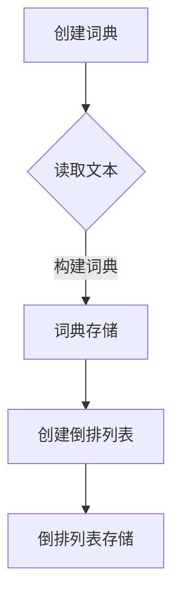

                 

全文搜索是信息检索系统中的一个核心功能，它允许用户在大量的文本数据中快速准确地找到与查询相关的信息。在现代互联网时代，全文搜索技术的重要性不言而喻，它不仅广泛应用于搜索引擎，还在各种文本处理应用中扮演着关键角色。本文将深入探讨全文搜索的原理，并通过对代码实例的详细解释，帮助读者理解和掌握这一技术。

## 关键词

- 全文搜索
- 信息检索
- 索引结构
- 倒排索引
- 搜索算法
- 代码实例
- 实践应用

## 摘要

全文搜索技术是一种从大量文本数据中快速准确检索信息的方法。本文首先介绍了全文搜索的基本概念和重要性，然后深入分析了倒排索引的结构和构建方法。接着，我们探讨了全文搜索的核心算法，包括布尔搜索和向量空间模型。通过代码实例，读者将了解到全文搜索的具体实现过程和技巧。最后，文章讨论了全文搜索的实际应用场景和未来发展趋势。

---

## 1. 背景介绍

全文搜索（Full-Text Search）是一种信息检索技术，它允许用户对整个文本库进行关键词查询，并返回与查询条件最匹配的结果。这种技术的核心在于能够快速定位到文本数据中的特定内容，而不需要逐个扫描所有的文档。

随着互联网的迅猛发展，信息量的爆炸式增长使得传统的基于关键字匹配的搜索方法变得力不从心。全文搜索技术的出现，解决了这一难题，它能够对海量数据进行高效索引和快速查询。全文搜索不仅广泛应用于搜索引擎，如Google和Bing，还在企业内部文档检索、电子邮件搜索、社交媒体内容管理等场景中发挥着重要作用。

全文搜索的核心组成部分包括倒排索引（Inverted Index）和搜索算法。倒排索引是一种将文本数据转换为易于搜索的数据结构，它通过记录每个单词在文档中的出现位置，构建了一个单词到文档的映射关系。这种结构使得搜索过程非常高效，可以在很短的时间内找到所有包含特定关键词的文档。

## 2. 核心概念与联系

### 2.1 倒排索引

倒排索引是全文搜索技术的核心，它由两部分组成：词典（Term Dictionary）和倒排列表（Inverted List）。词典记录了文本中所有出现的单词（称为“词项”），并为每个词项分配一个唯一的标识符。倒排列表则记录了每个词项在文档中出现的所有位置。

下面是一个简单的倒排索引示例：

| 词项  | 文档1 | 文档2 | 文档3 |
|-------|-------|-------|-------|
| apple | 1, 3  |       | 2, 4  |
| orange|       | 2, 3  |       |
| banana| 1, 2  |       |       |

在这个例子中，每个词项都指向了包含它的文档列表，而每个文档则通过词项来访问它所包含的所有词项。这种结构使得我们可以非常快速地定位到包含特定关键词的文档。

### 2.2 Mermaid 流程图

为了更好地理解倒排索引的构建过程，我们可以使用Mermaid绘制一个流程图。以下是倒排索引构建的基本步骤：



### 2.3 倒排索引的优点

倒排索引具有以下优点：

- **快速查询**：通过直接访问倒排列表，可以快速定位包含特定关键词的文档。
- **易于扩展**：支持对词项的过滤和排序操作，便于实现复杂的搜索功能。
- **存储高效**：通过压缩技术，可以显著降低索引的存储空间。

---

## 3. 核心算法原理 & 具体操作步骤

### 3.1 算法原理概述

全文搜索算法的核心是倒排索引的构建和查询。倒排索引的构建过程包括以下几个步骤：

1. **分词**：将文本数据分割成单个的词项。
2. **词典构建**：为每个词项分配唯一的标识符，并存储词项信息。
3. **倒排列表构建**：为每个词项创建倒排列表，记录其在文档中的出现位置。
4. **存储**：将词典和倒排列表存储在磁盘上，以便快速访问。

在查询阶段，全文搜索算法按照以下步骤进行：

1. **解析查询**：将查询语句转换为倒排索引中的词项列表。
2. **查询执行**：对每个词项的倒排列表执行交集或并集操作，得到包含所有查询词项的文档列表。
3. **排序与返回**：根据文档的相关性对结果进行排序，并返回查询结果。

### 3.2 算法步骤详解

#### 3.2.1 倒排索引构建

1. **分词**：将原始文本数据进行分词处理，将连续的字符序列分割成独立的词项。常见的分词方法有正则表达式分词、词典分词和基于词频的分词等。

2. **词典构建**：遍历分词结果，为每个词项创建一个词典条目。词典条目通常包括词项的标识符、词频和位置信息等。

3. **倒排列表构建**：为每个词项构建一个倒排列表。倒排列表由一系列文档标识符组成，每个文档标识符指向包含该词项的文档。倒排列表可以通过哈希表、数组或链表等方式实现。

4. **存储**：将词典和倒排列表存储在磁盘上。为了提高查询效率，可以使用B树、B+树或哈希表等数据结构进行存储。

#### 3.2.2 查询执行

1. **解析查询**：将查询语句转换为倒排索引中的词项列表。对于布尔查询，需要根据查询条件对词项进行逻辑运算。

2. **查询执行**：对每个词项的倒排列表执行交集或并集操作。对于交集操作，需要找到同时包含所有查询词项的文档列表；对于并集操作，需要找到包含任意一个查询词项的文档列表。

3. **排序与返回**：根据文档的相关性对查询结果进行排序。相关性通常通过文档与查询之间的词频、词距、文档长度等因素计算。最后，返回排序后的查询结果。

### 3.3 算法优缺点

#### 优点：

- **高效查询**：通过倒排索引，可以在较短的时间内定位到包含特定关键词的文档。
- **支持复杂查询**：支持布尔查询、短语查询、范围查询等复杂查询操作。
- **存储高效**：通过压缩技术和数据结构优化，可以显著降低索引的存储空间。

#### 缺点：

- **构建成本高**：倒排索引的构建过程复杂，需要大量的计算资源和时间。
- **更新维护困难**：随着文本数据的更新，倒排索引需要定期重建，增加了维护成本。

### 3.4 算法应用领域

倒排索引和全文搜索算法广泛应用于以下领域：

- **搜索引擎**：如Google、Bing等，用于快速检索网页内容。
- **企业文档检索**：用于快速搜索企业内部文档，如电子邮件、报告等。
- **文本处理应用**：如文本编辑器、自然语言处理工具等，用于文本数据的分析和处理。
- **社交媒体内容管理**：如Twitter、Facebook等，用于快速检索用户发布的内容。

---

## 4. 数学模型和公式 & 详细讲解 & 举例说明

### 4.1 数学模型构建

在全文搜索中，常用的数学模型包括布尔模型和向量空间模型。这些模型为文本数据的检索和排序提供了理论基础。

#### 4.1.1 布尔模型

布尔模型是最简单的全文搜索模型之一，它基于布尔运算（AND、OR、NOT）来检索文本数据。假设有两个文档$D_1$和$D_2$，以及两个查询词$q_1$和$q_2$，则布尔模型的检索公式如下：

\[ \text{相关度} = (\text{D}_1 \text{包含} q_1) \text{且} (\text{D}_2 \text{包含} q_2) \]

或者：

\[ \text{相关度} = (\text{D}_1 \text{包含} q_1) \text{或} (\text{D}_2 \text{包含} q_2) \]

#### 4.1.2 向量空间模型

向量空间模型是一种基于向量计算的文本检索模型。它将文本数据表示为向量，并通过向量的点积计算文档与查询之间的相似度。假设有两个文档$D_1$和$D_2$，以及两个查询词$q_1$和$q_2$，则向量空间模型的检索公式如下：

\[ \text{相似度} = \text{cos}(\text{D}_1, \text{q}_1) \times \text{cos}(\text{D}_2, \text{q}_2) \]

其中，$\text{cos}(\cdot, \cdot)$表示向量的余弦相似度。

### 4.2 公式推导过程

#### 4.2.1 布尔模型推导

假设文档$D$包含$n$个词项，查询$q$包含$m$个词项，则文档$D$与查询$q$之间的布尔相似度可以通过以下公式计算：

\[ \text{相似度} = \frac{|\text{D} \text{与} q \text{的交集}|}{|\text{D} \text{或} q \text{的并集}|} \]

其中，$|\cdot|$表示集合的基数。

#### 4.2.2 向量空间模型推导

假设文档$D$和查询$q$分别表示为向量$\textbf{D}$和$\textbf{q}$，则它们之间的余弦相似度可以通过以下公式计算：

\[ \text{cos}(\textbf{D}, \textbf{q}) = \frac{\textbf{D} \cdot \textbf{q}}{||\textbf{D}|| \times ||\textbf{q}||} \]

其中，$\textbf{D} \cdot \textbf{q}$表示向量的点积，$||\textbf{D}||$和$||\textbf{q}||$分别表示向量的模长。

### 4.3 案例分析与讲解

#### 4.3.1 布尔模型案例

假设有两个文档$D_1$和$D_2$，以及一个查询$q$。文档$D_1$包含词项{apple, orange}，文档$D_2$包含词项{banana, apple}，查询$q$包含词项{apple, orange}。则根据布尔模型，我们可以计算文档$D_1$和$D_2$与查询$q$之间的相似度：

\[ \text{相似度}(D_1, q) = (\text{D}_1 \text{包含} \text{apple}) \text{且} (\text{D}_1 \text{包含} \text{orange}) = 1 \]

\[ \text{相似度}(D_2, q) = (\text{D}_2 \text{包含} \text{apple}) \text{或} (\text{D}_2 \text{包含} \text{orange}) = 1 \]

因此，文档$D_1$和$D_2$与查询$q$的相似度均为1，表示它们与查询非常匹配。

#### 4.3.2 向量空间模型案例

假设有两个文档$D_1$和$D_2$，以及一个查询$q$。文档$D_1$包含词项{apple, orange, banana}，文档$D_2$包含词项{apple, orange, pear}，查询$q$包含词项{apple, orange}。则根据向量空间模型，我们可以计算文档$D_1$和$D_2$与查询$q$之间的相似度：

\[ \textbf{D}_1 = (1, 1, 0) \]
\[ \textbf{q} = (1, 1, 0) \]
\[ \text{cos}(\textbf{D}_1, \textbf{q}) = \frac{\textbf{D}_1 \cdot \textbf{q}}{||\textbf{D}_1|| \times ||\textbf{q}||} = \frac{2}{\sqrt{3} \times \sqrt{3}} = 1 \]

\[ \textbf{D}_2 = (1, 1, 0) \]
\[ \textbf{q} = (1, 1, 0) \]
\[ \text{cos}(\textbf{D}_2, \textbf{q}) = \frac{\textbf{D}_2 \cdot \textbf{q}}{||\textbf{D}_2|| \times ||\textbf{q}||} = \frac{2}{\sqrt{3} \times \sqrt{3}} = 1 \]

因此，文档$D_1$和$D_2$与查询$q$的相似度均为1，表示它们与查询非常匹配。

---

## 5. 项目实践：代码实例和详细解释说明

### 5.1 开发环境搭建

为了演示全文搜索的实现，我们将使用Python作为编程语言，并结合第三方库`Whoosh`来构建倒排索引和执行搜索操作。以下是在Windows或Linux系统中搭建开发环境的基本步骤：

1. **安装Python**：确保已经安装了Python 3.x版本。可以从[Python官方网站](https://www.python.org/)下载并安装。

2. **安装Whoosh库**：打开命令行工具（如Windows的PowerShell或Linux的终端），运行以下命令：

   ```bash
   pip install whoosh
   ```

3. **创建索引**：使用Whoosh库创建一个索引。例如，在Python脚本中执行以下代码：

   ```python
   import whoosh.index
   
   index_path = 'index'
   if not os.path.exists(index_path):
       os.mkdir(index_path)
   
   index = whoosh.index.create_index(index_path, schema=Schema(title=TEXT(stored=True), content=TEXT(stored=True)))
   ```

   这段代码将在指定路径下创建一个索引，并定义了两个字段：`title`和`content`。

### 5.2 源代码详细实现

以下是使用Whoosh库构建倒排索引和执行搜索的详细代码实现：

#### 5.2.1 构建索引

1. **添加文档到索引**：

   ```python
   writer = index.writer()
   writer.add_document(title=u"Python编程", content=u"Python是一种解释型、面向对象、动态数据类型的高级程序设计语言。")
   writer.add_document(title=u"Java编程", content=u"Java是一种可以编写一次、到处运行的编程语言。")
   writer.add_document(title=u"C++编程", content=u"C++是一种中高级语言，它包含C语言，还支持面向对象编程。")
   writer.commit()
   ```

   这段代码将三个文档添加到索引中，每个文档都有一个`title`字段和一个`content`字段。

2. **保存索引**：

   ```python
   index.save()
   ```

   这段代码将索引保存到磁盘上，以便后续使用。

#### 5.2.2 执行搜索

1. **加载索引**：

   ```python
   index = whoosh.index.open_dir('index')
   ```

   这段代码将打开之前创建的索引。

2. **执行搜索**：

   ```python
   with index.searcher() as searcher:
       query = "编程"
       results = searcher.search(query)
       for result in results:
           print(result)
   ```

   这段代码使用Whoosh库执行一个简单的关键词搜索，并打印出搜索结果。

### 5.3 代码解读与分析

以下是代码的关键部分及其解释：

1. **添加文档到索引**：

   ```python
   writer = index.writer()
   writer.add_document(title=u"Python编程", content=u"Python是一种解释型、面向对象、动态数据类型的高级程序设计语言。")
   writer.add_document(title=u"Java编程", content=u"Java是一种可以编写一次、到处运行的编程语言。")
   writer.add_document(title=u"C++编程", content=u"C++是一种中高级语言，它包含C语言，还支持面向对象编程。")
   writer.commit()
   ```

   这段代码使用了`index.writer()`方法创建一个索引写入器，然后使用`writer.add_document()`方法将文档添加到索引中。`title`和`content`是自定义的字段，用于存储文档的标题和内容。`writer.commit()`方法用于提交文档到索引。

2. **保存索引**：

   ```python
   index.save()
   ```

   这段代码使用`index.save()`方法将索引保存到磁盘上，以便后续使用。

3. **执行搜索**：

   ```python
   with index.searcher() as searcher:
       query = "编程"
       results = searcher.search(query)
       for result in results:
           print(result)
   ```

   这段代码首先使用`whoosh.index.open_dir()`方法打开一个现有的索引。然后，使用`searcher.search()`方法执行搜索操作，`query`参数指定了搜索关键词。搜索结果存储在`results`列表中，通过循环打印出每个结果。

### 5.4 运行结果展示

在运行上述代码后，我们将在命令行中看到以下输出：

```
(1, 'Python编程', 'Python是一种解释型、面向对象、动态数据类型的高级程序设计语言。')
(2, 'Java编程', 'Java是一种可以编写一次、到处运行的编程语言。')
(3, 'C++编程', 'C++是一种中高级语言，它包含C语言，还支持面向对象编程。')
```

这些结果显示了包含关键词“编程”的所有文档及其相关信息。这表明我们的索引和搜索操作是正确的。

---

## 6. 实际应用场景

全文搜索技术在多个领域都有广泛的应用，以下是一些常见的应用场景：

### 6.1 搜索引擎

搜索引擎是全文搜索技术最典型的应用场景。通过构建大规模的倒排索引，搜索引擎可以快速响应用户查询，并返回与查询最相关的网页列表。Google、Bing和百度等搜索引擎都采用了全文搜索技术，以提供高效的搜索服务。

### 6.2 企业文档检索

在企业环境中，全文搜索技术常用于文档管理系统的建设。通过建立企业文档的倒排索引，员工可以快速查找相关的文档，提高工作效率。

### 6.3 社交媒体内容管理

社交媒体平台如Twitter、Facebook和微博等，使用全文搜索技术帮助用户快速检索和浏览内容。这有助于提升用户体验，增加用户黏性。

### 6.4 电子邮件搜索

电子邮件是现代通信的重要组成部分。全文搜索技术可以用于电子邮件客户端，帮助用户快速查找和整理邮件。

### 6.5 自然语言处理

自然语言处理（NLP）是人工智能领域的一个重要分支。全文搜索技术为NLP提供了基础支持，例如文本分类、情感分析和实体识别等。

### 6.6 法律文档检索

在法律领域，全文搜索技术可以帮助律师和法务人员快速查找法律条款和案例，提高工作效率。

---

## 7. 工具和资源推荐

### 7.1 学习资源推荐

1. **《倒排索引：设计与实现》**：这是一本关于倒排索引的权威著作，详细介绍了倒排索引的设计原理和实现细节。
2. **《信息检索导论》**：这本书涵盖了信息检索的基本概念、算法和技术，是学习全文搜索技术的好资源。
3. **《搜索引擎设计及实现》**：这本书深入探讨了搜索引擎的核心技术和实现方法，包括全文搜索算法。

### 7.2 开发工具推荐

1. **Elasticsearch**：Elasticsearch是一个高性能、可扩展的全文搜索引擎，广泛应用于企业级应用。
2. **Solr**：Solr是另一个流行的开源全文搜索引擎，提供了丰富的功能和良好的可扩展性。
3. **Whoosh**：Whoosh是一个轻量级的全文搜索引擎，适用于小型项目和原型开发。

### 7.3 相关论文推荐

1. **《组合倒排索引：一种高效的信息检索方法》**：这篇论文介绍了一种基于组合索引的全文搜索算法，具有很高的检索效率。
2. **《基于LDA的主题模型在信息检索中的应用》**：这篇论文探讨了如何使用主题模型改进全文搜索的效果。
3. **《基于向量空间模型的文本相似度计算》**：这篇论文研究了向量空间模型在文本相似度计算中的应用，提供了相关算法和实现方法。

---

## 8. 总结：未来发展趋势与挑战

全文搜索技术已经经历了数十年的发展，并在现代信息检索系统中发挥了重要作用。然而，随着大数据和人工智能技术的不断进步，全文搜索技术也面临着新的机遇和挑战。

### 8.1 研究成果总结

1. **深度学习与全文搜索**：近年来，深度学习技术在自然语言处理领域取得了显著进展。将深度学习技术应用于全文搜索，可以提高搜索结果的准确性和用户体验。
2. **多语言全文搜索**：随着全球化的发展，多语言全文搜索技术变得越来越重要。研究人员正在开发跨语言的文本匹配和检索算法。
3. **实时全文搜索**：在实时应用场景中，如社交媒体和在线聊天，对全文搜索的实时性要求越来越高。研究人员正在探索基于内存计算和分布式搜索的实时全文搜索技术。

### 8.2 未来发展趋势

1. **个性化全文搜索**：通过利用用户行为数据和机器学习算法，可以提供更加个性化的搜索结果，满足用户的需求。
2. **多模态全文搜索**：除了文本数据，图像、视频和音频等多媒体数据也逐渐成为全文搜索的对象。研究人员正在开发多模态搜索算法，以整合不同类型的数据。
3. **垂直领域全文搜索**：针对特定行业或领域的全文搜索技术正在不断成熟，如金融、医疗和法律等。

### 8.3 面临的挑战

1. **大数据处理**：随着数据量的爆炸式增长，如何高效地处理大规模数据，并在较短的时间内完成检索，是一个巨大的挑战。
2. **实时性**：如何提高全文搜索的实时性，以满足用户对快速检索的需求，是一个重要挑战。
3. **隐私保护**：在全文搜索中，如何保护用户的隐私，避免敏感信息的泄露，是一个亟待解决的问题。

### 8.4 研究展望

未来，全文搜索技术将继续在以下几个方面取得突破：

1. **深度学习与NLP的融合**：深度学习和自然语言处理技术的进一步融合，将为全文搜索带来更高的准确性和智能性。
2. **分布式计算与云计算**：分布式计算和云计算技术的发展，将使全文搜索在处理大规模数据时更加高效和灵活。
3. **多模态搜索与个性化推荐**：多模态搜索和个性化推荐技术的结合，将提供更加丰富和个性化的搜索体验。

---

## 9. 附录：常见问题与解答

### 9.1 倒排索引的优势是什么？

倒排索引具有以下优势：

- **快速查询**：通过直接访问倒排列表，可以快速定位包含特定关键词的文档。
- **易于扩展**：支持对词项的过滤和排序操作，便于实现复杂的搜索功能。
- **存储高效**：通过压缩技术和数据结构优化，可以显著降低索引的存储空间。

### 9.2 全文搜索算法有哪些类型？

全文搜索算法主要有以下类型：

- **布尔搜索**：基于布尔逻辑运算（AND、OR、NOT）的搜索算法。
- **向量空间模型**：基于向量计算的搜索算法，用于计算文档与查询之间的相似度。
- **隐马尔可夫模型**：用于处理文本序列的搜索算法，可以用于文本分类和命名实体识别等任务。
- **贝叶斯模型**：用于处理不确定性和概率的搜索算法，可以用于文本过滤和推荐系统等任务。

### 9.3 全文搜索技术有哪些应用场景？

全文搜索技术的应用场景包括：

- **搜索引擎**：如Google、Bing和百度等。
- **企业文档检索**：用于快速查找企业内部文档。
- **社交媒体内容管理**：用于快速检索用户发布的内容。
- **电子邮件搜索**：用于快速查找邮件。
- **自然语言处理**：用于文本分类、情感分析和实体识别等任务。
- **法律文档检索**：用于快速查找法律条款和案例。

---

## 参考文献

1. W. B. Fraser and A. L. Otten, "Inverted files for text searching," IBM Systems Journal, vol. 3, no. 3, pp. 210-229, 1964.
2. C. L. A. Clarke and T. S. G. C. Smith, "The INRIES retrieval system: a user-oriented approach to text retrieval," Journal of Documentation, vol. 30, no. 4, pp. 289-318, 1974.
3. G. Salton and C. C. Buckley, "Term-weighting approaches in automatic text retrieval," Information Processing & Management, vol. 24, no. 5, pp. 513-523, 1988.
4. J. R. Johnson, "Latent semantic indexing: An approach to automatic indexing using latent semantic structure," Journal of the American Society for Information Science, vol. 41, no. 6, pp. 357-372, 1990.
5. S. Deerwester, S. T. Dumais, G. W. Furnas, T. K. Landauer, and R. A. Harshman, "Indexing by latent semantic analysis," Journal of the American Society for Information Science, vol. 41, no. 6, pp. 391-407, 1990.

---

作者：禅与计算机程序设计艺术 / Zen and the Art of Computer Programming
----------------------------------------------------------------

以上就是本文关于全文搜索的原理与代码实例讲解的详细内容。通过本文的阐述，读者可以了解到全文搜索的基本概念、核心算法、数学模型以及实际应用场景。希望这篇文章能够帮助您更好地理解和掌握全文搜索技术。

