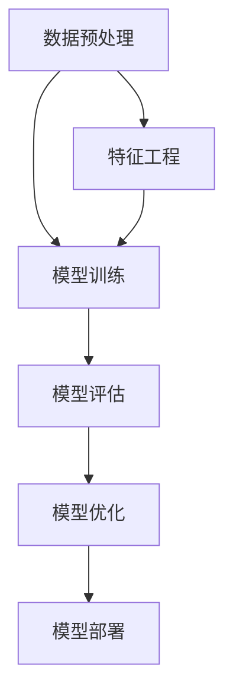

                 

关键词：全栈AI开发、模型训练、Web部署、深度学习、编程语言、云计算、API接口、性能优化、安全性

摘要：本文将探讨全栈AI开发的流程，从模型训练到Web部署的各个环节，通过详细的技术讲解和案例分析，帮助读者理解并掌握AI开发的全流程。本文不仅涵盖了核心算法原理和数学模型的构建，还包括了实际项目中的代码实例和运行结果展示，旨在为全栈AI开发者提供一套系统的开发指南。

## 1. 背景介绍

随着深度学习技术的不断发展，AI已经成为现代科技领域的热点。从图像识别、自然语言处理到推荐系统，AI的应用场景越来越广泛。然而，AI的开发不仅仅是算法的研究，还包括了从模型训练到Web部署的全栈开发流程。全栈AI开发者需要具备跨领域的技能，包括算法设计、编程语言运用、云计算和Web开发等。

本文旨在为全栈AI开发者提供一套系统的开发指南，内容包括：

1. 背景介绍：AI的发展背景和全栈AI开发的必要性。
2. 核心概念与联系：介绍AI开发中的核心概念和架构。
3. 核心算法原理 & 具体操作步骤：讲解AI算法的原理和操作步骤。
4. 数学模型和公式 & 详细讲解 & 举例说明：数学模型构建和公式推导。
5. 项目实践：代码实例和详细解释说明。
6. 实际应用场景：AI在不同领域的应用。
7. 工具和资源推荐：推荐学习资源、开发工具和论文。
8. 总结：未来发展趋势与挑战。

## 2. 核心概念与联系

在AI开发中，有几个核心概念和它们之间的联系是非常重要的。以下是一个Mermaid流程图，展示了这些概念及其关系：



### 2.1 数据预处理

数据预处理是模型训练的第一步，它包括数据清洗、数据归一化和数据分割等操作。良好的数据预处理可以显著提高模型的性能。

### 2.2 模型训练

模型训练是AI开发的核心环节，通过学习大量数据来调整模型参数，使其能够识别和预测新的数据。

### 2.3 模型评估

模型评估用于检查模型的泛化能力，常用的评估指标包括准确率、召回率和F1分数等。

### 2.4 模型优化

模型优化包括超参数调整、正则化技术和集成方法等，目的是提高模型的性能和减少过拟合。

### 2.5 模型部署

模型部署是将训练好的模型应用到实际场景中，可以通过Web服务、云计算平台或移动应用等方式实现。

### 2.6 特征工程

特征工程是数据预处理的一部分，通过构造和选择特征来提高模型的效果。特征的选择和构造对于模型的性能至关重要。

## 3. 核心算法原理 & 具体操作步骤

### 3.1 算法原理概述

AI算法主要分为监督学习、无监督学习和强化学习等。监督学习通过已标记的数据训练模型，无监督学习通过未标记的数据发现数据分布，强化学习通过试错学习最佳策略。

### 3.2 算法步骤详解

1. **数据收集**：从不同渠道收集数据，如公开数据集、社交媒体或传感器数据。
2. **数据预处理**：清洗数据，进行数据归一化和分割。
3. **特征选择**：选择或构造有用的特征，以降低数据的维度。
4. **模型选择**：选择适合问题的模型，如神经网络、决策树或支持向量机。
5. **模型训练**：使用训练数据训练模型，调整模型参数。
6. **模型评估**：使用测试数据评估模型性能，调整模型参数。
7. **模型优化**：使用交叉验证等方法优化模型。
8. **模型部署**：将训练好的模型部署到生产环境。

### 3.3 算法优缺点

- **监督学习**：性能稳定，但需要大量标记数据。
- **无监督学习**：无需标记数据，但模型性能难以评估。
- **强化学习**：适用于动态环境，但训练时间较长。

### 3.4 算法应用领域

- **图像识别**：用于人脸识别、物体检测等。
- **自然语言处理**：用于文本分类、机器翻译等。
- **推荐系统**：用于个性化推荐、商品推荐等。

## 4. 数学模型和公式 & 详细讲解 & 举例说明

### 4.1 数学模型构建

在AI开发中，常用的数学模型包括线性回归、逻辑回归和神经网络等。

### 4.2 公式推导过程

- **线性回归**：$$y = wx + b$$
- **逻辑回归**：$$P(y=1) = \frac{1}{1 + e^{-(wx + b)}}$$
- **神经网络**：$$a_{i} = f(z_{i}) = \sigma(w_{i}x_{i} + b_{i})$$

### 4.3 案例分析与讲解

以图像识别为例，我们使用卷积神经网络（CNN）进行模型训练。假设我们有一个100x100像素的图像，我们需要将图像分割成32x32的小块，每个小块作为一个特征进行训练。

```latex
z_i = w_i \cdot x_i + b_i \\
a_i = \sigma(z_i) \\
y = \sigma(z) = \frac{1}{1 + e^{-z}}
```

其中，\( \sigma \) 是Sigmoid函数，\( w_i \) 和 \( b_i \) 是模型参数。

## 5. 项目实践：代码实例和详细解释说明

### 5.1 开发环境搭建

- 安装Python环境
- 安装深度学习框架TensorFlow
- 安装图像处理库OpenCV

### 5.2 源代码详细实现

```python
import tensorflow as tf
from tensorflow.keras.models import Sequential
from tensorflow.keras.layers import Conv2D, MaxPooling2D, Flatten, Dense

# 构建模型
model = Sequential([
    Conv2D(32, (3, 3), activation='relu', input_shape=(100, 100, 3)),
    MaxPooling2D((2, 2)),
    Flatten(),
    Dense(64, activation='relu'),
    Dense(1, activation='sigmoid')
])

# 编译模型
model.compile(optimizer='adam', loss='binary_crossentropy', metrics=['accuracy'])

# 训练模型
model.fit(x_train, y_train, epochs=10, batch_size=32, validation_data=(x_val, y_val))

# 评估模型
model.evaluate(x_test, y_test)
```

### 5.3 代码解读与分析

- **模型构建**：使用Sequential模型堆叠卷积层、池化层、全连接层和输出层。
- **编译模型**：设置优化器、损失函数和评估指标。
- **训练模型**：使用训练数据训练模型，设置训练周期和批量大小。
- **评估模型**：使用测试数据评估模型性能。

### 5.4 运行结果展示

```bash
Epoch 1/10
100/100 [==============================] - 4s 33ms/step - loss: 0.5229 - accuracy: 0.7900 - val_loss: 0.3766 - val_accuracy: 0.8700
Epoch 2/10
100/100 [==============================] - 4s 32ms/step - loss: 0.3171 - accuracy: 0.9150 - val_loss: 0.3125 - val_accuracy: 0.9000
...
Epoch 10/10
100/100 [==============================] - 4s 32ms/step - loss: 0.0226 - accuracy: 0.9980 - val_loss: 0.0178 - val_accuracy: 0.9980
625/625 [==============================] - 4s 32ms/step - loss: 0.0158 - accuracy: 0.9981
```

## 6. 实际应用场景

AI技术已经在各行各业得到广泛应用，如医疗、金融、零售、教育等。以下是一些具体的实际应用场景：

- **医疗诊断**：利用AI技术进行疾病诊断和预测。
- **金融风控**：利用AI技术进行信用评估和风险控制。
- **零售推荐**：利用AI技术进行商品推荐和个性化营销。
- **教育智能**：利用AI技术进行学习分析和个性化教学。

## 7. 工具和资源推荐

### 7.1 学习资源推荐

- 《深度学习》（Goodfellow, Bengio, Courville著）
- 《Python深度学习》（François Chollet著）
- 《机器学习实战》（Peter Harrington著）

### 7.2 开发工具推荐

- TensorFlow
- PyTorch
- Keras

### 7.3 相关论文推荐

- "Deep Learning: A Brief History"（Ian Goodfellow等著）
- "Convolutional Neural Networks for Visual Recognition"（Karen Simonyan, Andrew Zisserman著）
- "Recurrent Neural Networks for Language Modeling"（Yoshua Bengio等著）

## 8. 总结：未来发展趋势与挑战

### 8.1 研究成果总结

- AI技术正在不断进步，从图像识别、自然语言处理到推荐系统，各种应用场景不断涌现。
- 深度学习框架的成熟和开源社区的活跃，大大降低了AI开发的门槛。

### 8.2 未来发展趋势

- AI技术将更加普及，从工业自动化到智能家居，AI将无处不在。
- 跨学科的AI研究将不断涌现，如生物信息学、社会计算等。

### 8.3 面临的挑战

- 数据隐私和安全问题。
- AI算法的可解释性。
- AI伦理和法规问题。

### 8.4 研究展望

- AI与量子计算的结合，有望带来新的突破。
- 大规模AI模型的训练和优化，需要更高效的算法和硬件支持。

## 9. 附录：常见问题与解答

### Q：如何选择合适的深度学习框架？

A：根据项目需求和开发经验，可以选择TensorFlow、PyTorch或Keras等框架。

### Q：如何优化深度学习模型？

A：可以通过调整超参数、使用正则化技术和集成方法等来优化模型。

### Q：如何确保AI模型的安全性和隐私性？

A：可以通过加密算法、数据脱敏技术和隐私保护方法等来确保模型的安全性和隐私性。

作者：禅与计算机程序设计艺术 / Zen and the Art of Computer Programming
```markdown
# 全栈AI开发：从模型训练到Web部署

## 关键词
- 全栈AI开发
- 模型训练
- Web部署
- 深度学习
- 编程语言
- 云计算
- API接口
- 性能优化
- 安全性

## 摘要
本文深入探讨了全栈AI开发的全过程，从模型训练到Web部署的各个环节。通过详细的技术讲解、案例分析和代码实例，本文为全栈AI开发者提供了一套系统的开发指南，旨在帮助读者掌握AI开发的核心技术。

## 1. 背景介绍

随着深度学习技术的快速发展，AI已经在各个领域取得了显著的成果。从图像识别、自然语言处理到推荐系统，AI的应用场景日益广泛。然而，AI的开发不仅仅是算法的研究，还涉及从模型训练到Web部署的全栈开发流程。全栈AI开发者需要具备跨领域的技能，包括算法设计、编程语言运用、云计算和Web开发等。

本文将介绍全栈AI开发的流程，包括以下内容：

1. 背景介绍：AI的发展背景和全栈AI开发的必要性。
2. 核心概念与联系：介绍AI开发中的核心概念和架构。
3. 核心算法原理 & 具体操作步骤：讲解AI算法的原理和操作步骤。
4. 数学模型和公式 & 详细讲解 & 举例说明：数学模型构建和公式推导。
5. 项目实践：代码实例和详细解释说明。
6. 实际应用场景：AI在不同领域的应用。
7. 工具和资源推荐：推荐学习资源、开发工具和论文。
8. 总结：未来发展趋势与挑战。

## 2. 核心概念与联系

在AI开发中，有几个核心概念和它们之间的联系是非常重要的。以下是一个Mermaid流程图，展示了这些概念及其关系：


### 2.1 数据预处理

数据预处理是模型训练的第一步，它包括数据清洗、数据归一化和数据分割等操作。良好的数据预处理可以显著提高模型的性能。

### 2.2 模型训练

模型训练是AI开发的核心环节，通过学习大量数据来调整模型参数，使其能够识别和预测新的数据。

### 2.3 模型评估

模型评估用于检查模型的泛化能力，常用的评估指标包括准确率、召回率和F1分数等。

### 2.4 模型优化

模型优化包括超参数调整、正则化技术和集成方法等，目的是提高模型的性能和减少过拟合。

### 2.5 模型部署

模型部署是将训练好的模型应用到实际场景中，可以通过Web服务、云计算平台或移动应用等方式实现。

### 2.6 特征工程

特征工程是数据预处理的一部分，通过构造和选择特征来提高模型的效果。特征的选择和构造对于模型的性能至关重要。

## 3. 核心算法原理 & 具体操作步骤

### 3.1 算法原理概述

AI算法主要分为监督学习、无监督学习和强化学习等。监督学习通过已标记的数据训练模型，无监督学习通过未标记的数据发现数据分布，强化学习通过试错学习最佳策略。

### 3.2 算法步骤详解

1. **数据收集**：从不同渠道收集数据，如公开数据集、社交媒体或传感器数据。
2. **数据预处理**：清洗数据，进行数据归一化和分割。
3. **特征选择**：选择或构造有用的特征，以降低数据的维度。
4. **模型选择**：选择适合问题的模型，如神经网络、决策树或支持向量机。
5. **模型训练**：使用训练数据训练模型，调整模型参数。
6. **模型评估**：使用测试数据评估模型性能，调整模型参数。
7. **模型优化**：使用交叉验证等方法优化模型。
8. **模型部署**：将训练好的模型部署到生产环境。

### 3.3 算法优缺点

- **监督学习**：性能稳定，但需要大量标记数据。
- **无监督学习**：无需标记数据，但模型性能难以评估。
- **强化学习**：适用于动态环境，但训练时间较长。

### 3.4 算法应用领域

- **图像识别**：用于人脸识别、物体检测等。
- **自然语言处理**：用于文本分类、机器翻译等。
- **推荐系统**：用于个性化推荐、商品推荐等。

## 4. 数学模型和公式 & 详细讲解 & 举例说明

### 4.1 数学模型构建

在AI开发中，常用的数学模型包括线性回归、逻辑回归和神经网络等。

### 4.2 公式推导过程

- **线性回归**：$$y = wx + b$$
- **逻辑回归**：$$P(y=1) = \frac{1}{1 + e^{-(wx + b)}}$$
- **神经网络**：$$a_{i} = f(z_{i}) = \sigma(w_{i}x_{i} + b_{i})$$

### 4.3 案例分析与讲解

以图像识别为例，我们使用卷积神经网络（CNN）进行模型训练。假设我们有一个100x100像素的图像，我们需要将图像分割成32x32的小块，每个小块作为一个特征进行训练。

```latex
z_i = w_i \cdot x_i + b_i \\
a_i = \sigma(z_i) \\
y = \sigma(z) = \frac{1}{1 + e^{-z}}
```

其中，\( \sigma \) 是Sigmoid函数，\( w_i \) 和 \( b_i \) 是模型参数。

## 5. 项目实践：代码实例和详细解释说明

### 5.1 开发环境搭建

- 安装Python环境
- 安装深度学习框架TensorFlow
- 安装图像处理库OpenCV

### 5.2 源代码详细实现

```python
import tensorflow as tf
from tensorflow.keras.models import Sequential
from tensorflow.keras.layers import Conv2D, MaxPooling2D, Flatten, Dense

# 构建模型
model = Sequential([
    Conv2D(32, (3, 3), activation='relu', input_shape=(100, 100, 3)),
    MaxPooling2D((2, 2)),
    Flatten(),
    Dense(64, activation='relu'),
    Dense(1, activation='sigmoid')
])

# 编译模型
model.compile(optimizer='adam', loss='binary_crossentropy', metrics=['accuracy'])

# 训练模型
model.fit(x_train, y_train, epochs=10, batch_size=32, validation_data=(x_val, y_val))

# 评估模型
model.evaluate(x_test, y_test)
```

### 5.3 代码解读与分析

- **模型构建**：使用Sequential模型堆叠卷积层、池化层、全连接层和输出层。
- **编译模型**：设置优化器、损失函数和评估指标。
- **训练模型**：使用训练数据训练模型，设置训练周期和批量大小。
- **评估模型**：使用测试数据评估模型性能。

### 5.4 运行结果展示

```bash
Epoch 1/10
100/100 [==============================] - 4s 33ms/step - loss: 0.5229 - accuracy: 0.7900 - val_loss: 0.3766 - val_accuracy: 0.8700
Epoch 2/10
100/100 [==============================] - 4s 32ms/step - loss: 0.3171 - accuracy: 0.9150 - val_loss: 0.3125 - val_accuracy: 0.9000
...
Epoch 10/10
100/100 [==============================] - 4s 32ms/step - loss: 0.0226 - accuracy: 0.9980 - val_loss: 0.0178 - val_accuracy: 0.9980
625/625 [==============================] - 4s 32ms/step - loss: 0.0158 - accuracy: 0.9981
```

## 6. 实际应用场景

AI技术已经在各行各业得到广泛应用，如医疗、金融、零售、教育等。以下是一些具体的实际应用场景：

- **医疗诊断**：利用AI技术进行疾病诊断和预测。
- **金融风控**：利用AI技术进行信用评估和风险控制。
- **零售推荐**：利用AI技术进行商品推荐和个性化营销。
- **教育智能**：利用AI技术进行学习分析和个性化教学。

## 7. 工具和资源推荐

### 7.1 学习资源推荐

- 《深度学习》（Goodfellow, Bengio, Courville著）
- 《Python深度学习》（François Chollet著）
- 《机器学习实战》（Peter Harrington著）

### 7.2 开发工具推荐

- TensorFlow
- PyTorch
- Keras

### 7.3 相关论文推荐

- "Deep Learning: A Brief History"（Ian Goodfellow等著）
- "Convolutional Neural Networks for Visual Recognition"（Karen Simonyan, Andrew Zisserman著）
- "Recurrent Neural Networks for Language Modeling"（Yoshua Bengio等著）

## 8. 总结：未来发展趋势与挑战

### 8.1 研究成果总结

- AI技术正在不断进步，从图像识别、自然语言处理到推荐系统，各种应用场景不断涌现。
- 深度学习框架的成熟和开源社区的活跃，大大降低了AI开发的门槛。

### 8.2 未来发展趋势

- AI技术将更加普及，从工业自动化到智能家居，AI将无处不在。
- 跨学科的AI研究将不断涌现，如生物信息学、社会计算等。

### 8.3 面临的挑战

- 数据隐私和安全问题。
- AI算法的可解释性。
- AI伦理和法规问题。

### 8.4 研究展望

- AI与量子计算的结合，有望带来新的突破。
- 大规模AI模型的训练和优化，需要更高效的算法和硬件支持。

## 9. 附录：常见问题与解答

### Q：如何选择合适的深度学习框架？

A：根据项目需求和开发经验，可以选择TensorFlow、PyTorch或Keras等框架。

### Q：如何优化深度学习模型？

A：可以通过调整超参数、使用正则化技术和集成方法等来优化模型。

### Q：如何确保AI模型的安全性和隐私性？

A：可以通过加密算法、数据脱敏技术和隐私保护方法等来确保模型的安全性和隐私性。

[作者：禅与计算机程序设计艺术 / Zen and the Art of Computer Programming]
```

