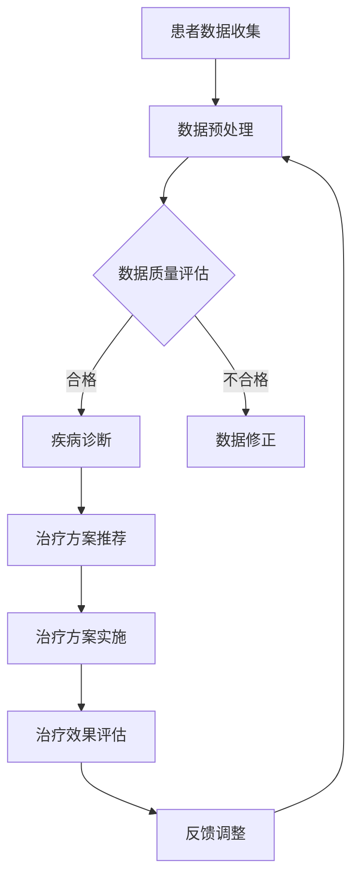

                 

关键词：全球脑、个性化医疗、集体智慧、精准治疗方案

摘要：本文探讨了全球脑与个性化医疗的深度融合，揭示了集体智慧在驱动精准治疗方案中的关键作用。通过阐述核心概念、算法原理、数学模型及其应用实践，本文旨在为读者呈现一个未来医疗科技发展的全景图。

## 1. 背景介绍

个性化医疗是现代医学领域的一个重要发展趋势，它强调根据患者的遗传信息、生活环境和疾病状态，制定个性化的治疗方案。这种模式打破了传统医学的一刀切模式，提高了医疗效果，但也带来了新的挑战。如何有效地整合大量复杂的医疗数据，从中提取有用信息，为患者提供精准的治疗方案，成为个性化医疗领域亟待解决的问题。

与此同时，全球脑的概念逐渐被提出并广泛应用。全球脑是一个由互联的计算设备、传感器和数据存储组成的智能系统，它能够实时收集、处理和共享信息。全球脑在人工智能、物联网和大数据等领域具有广泛应用，其在医疗领域的应用潜力也日益显现。

本文旨在探讨全球脑与个性化医疗的深度融合，通过集体智慧驱动精准治疗方案，为个性化医疗提供新的思路和方法。

## 2. 核心概念与联系

### 2.1 全球脑

全球脑（Global Brain）是一个概念，指的是由大量互联的计算设备、传感器和网络组成的巨大智能系统。它能够模拟人脑的信息处理过程，实现实时数据收集、处理和共享。全球脑的核心特点包括：

- **分布式计算**：全球脑中的计算资源分散在各个节点，可以并行处理海量数据。
- **实时通信**：全球脑通过高速互联网实现节点间的实时通信，确保信息的及时传输。
- **自组织**：全球脑能够根据环境变化自动调整结构和行为，表现出一定的自适应能力。
- **智能协同**：全球脑中的节点可以通过协作实现复杂任务的完成，具有集体智慧的特点。

### 2.2 个性化医疗

个性化医疗（Personalized Medicine）是一种以患者为中心的医疗服务模式，强调根据患者的个体差异，制定个性化的治疗方案。个性化医疗的核心概念包括：

- **基因组学**：通过分析患者的基因组信息，预测其疾病风险和药物反应。
- **生物标志物**：利用生物标志物检测患者的疾病状态，指导治疗方案的选择。
- **生活方式**：考虑患者的生活习惯和环境因素，制定个性化的生活方式干预方案。
- **大数据**：利用大数据技术，整合和分析患者的医疗数据，为个性化医疗提供支持。

### 2.3 集体智慧

集体智慧（Collective Intelligence）是指由多个个体组成的系统，通过协作和互动，实现整体智能的提升。在个性化医疗中，集体智慧可以通过以下方式发挥作用：

- **知识共享**：医生和患者可以通过全球脑平台共享医疗知识和经验，提高治疗方案的制定水平。
- **协同诊断**：多个医生和专家可以通过全球脑平台协同诊断，提高疾病诊断的准确性。
- **预测分析**：通过分析海量医疗数据，全球脑可以预测患者的病情发展趋势，为治疗方案的调整提供依据。
- **个性化推荐**：根据患者的个体特征和历史数据，全球脑可以推荐最适合的治疗方案。

### 2.4 Mermaid 流程图

下面是一个描述全球脑与个性化医疗融合的Mermaid流程图：



### 2.5 算法原理概述

全球脑与个性化医疗融合的关键在于如何有效地处理和分析海量医疗数据，为患者提供精准的治疗方案。这一过程主要涉及以下算法：

- **数据预处理算法**：用于清洗、转换和整合医疗数据，为后续分析提供高质量的输入。
- **疾病诊断算法**：基于机器学习和深度学习技术，分析患者的医疗数据，实现疾病的自动诊断。
- **治疗方案推荐算法**：根据患者的疾病类型、个体特征和历史数据，推荐个性化的治疗方案。
- **治疗效果评估算法**：用于跟踪和评估治疗过程中的效果，为治疗方案的调整提供依据。

## 3. 核心算法原理 & 具体操作步骤

### 3.1 算法原理概述

#### 3.1.1 数据预处理算法

数据预处理算法是确保数据质量的关键步骤。其原理主要包括：

- **数据清洗**：去除重复数据、错误数据和噪声，保证数据的准确性。
- **数据转换**：将不同数据源的数据格式统一，便于后续处理。
- **数据整合**：将不同来源的数据整合到一个统一的格式中，为后续分析提供完整的数据集。

#### 3.1.2 疾病诊断算法

疾病诊断算法的核心是通过分析患者的医疗数据，实现疾病的自动诊断。主要技术包括：

- **特征提取**：从患者的医疗数据中提取关键特征，为后续分类提供输入。
- **机器学习模型**：利用机器学习算法，如支持向量机、随机森林和神经网络等，训练疾病分类模型。
- **模型评估**：通过交叉验证和测试集评估模型的性能，选择最优模型。

#### 3.1.3 治疗方案推荐算法

治疗方案推荐算法的原理是通过分析患者的个体特征和疾病类型，推荐最适合的治疗方案。主要技术包括：

- **知识图谱**：构建患者个体特征、疾病类型和治疗方案的关联关系，形成知识图谱。
- **推荐算法**：利用协同过滤、矩阵分解和基于内容的推荐算法，为患者推荐个性化的治疗方案。

#### 3.1.4 治疗效果评估算法

治疗效果评估算法的核心是通过跟踪和评估治疗过程中的效果，为治疗方案的调整提供依据。主要技术包括：

- **实时监控**：利用传感器和实时数据采集技术，监控患者的治疗过程。
- **效果评估模型**：建立治疗效果评估模型，分析患者的治疗数据，评估治疗效果。
- **反馈调整**：根据治疗效果评估结果，调整治疗方案的参数，实现持续优化。

### 3.2 算法步骤详解

#### 3.2.1 数据预处理算法步骤

1. 数据清洗：去除重复数据、错误数据和噪声，保证数据的准确性。
2. 数据转换：将不同数据源的数据格式统一，便于后续处理。
3. 数据整合：将不同来源的数据整合到一个统一的格式中，为后续分析提供完整的数据集。

#### 3.2.2 疾病诊断算法步骤

1. 特征提取：从患者的医疗数据中提取关键特征，为后续分类提供输入。
2. 训练模型：利用机器学习算法，如支持向量机、随机森林和神经网络等，训练疾病分类模型。
3. 模型评估：通过交叉验证和测试集评估模型的性能，选择最优模型。
4. 疾病诊断：利用训练好的模型，对患者的医疗数据进行分类，实现疾病的自动诊断。

#### 3.2.3 治疗方案推荐算法步骤

1. 知识图谱构建：构建患者个体特征、疾病类型和治疗方案的关联关系，形成知识图谱。
2. 治疗方案推荐：利用协同过滤、矩阵分解和基于内容的推荐算法，为患者推荐个性化的治疗方案。
3. 治疗方案评估：评估推荐的治疗方案的有效性和可行性，选择最优方案。

#### 3.2.4 治疗效果评估算法步骤

1. 实时监控：利用传感器和实时数据采集技术，监控患者的治疗过程。
2. 治疗效果评估：建立治疗效果评估模型，分析患者的治疗数据，评估治疗效果。
3. 反馈调整：根据治疗效果评估结果，调整治疗方案的参数，实现持续优化。

### 3.3 算法优缺点

#### 3.3.1 数据预处理算法优缺点

**优点**：

- 提高数据质量，为后续分析提供可靠的数据基础。
- 统一数据格式，便于不同数据源的数据整合。

**缺点**：

- 需要大量时间和计算资源。
- 数据清洗和转换过程中可能引入新的错误。

#### 3.3.2 疾病诊断算法优缺点

**优点**：

- 提高疾病诊断的准确性，减少误诊率。
- 自动化疾病诊断过程，提高工作效率。

**缺点**：

- 依赖高质量的训练数据和模型。
- 可能存在过拟合问题。

#### 3.3.3 治疗方案推荐算法优缺点

**优点**：

- 提供个性化的治疗方案，提高治疗效果。
- 节省医生和患者的时间和精力。

**缺点**：

- 需要大量的患者数据和专家知识。
- 可能存在推荐效果不佳的情况。

#### 3.3.4 治疗效果评估算法优缺点

**优点**：

- 实时监控治疗效果，及时调整治疗方案。
- 提高治疗方案的有效性和可行性。

**缺点**：

- 需要大量的实时数据和技术支持。
- 可能存在评估不准确的情况。

### 3.4 算法应用领域

全球脑与个性化医疗融合的算法在以下领域具有广泛应用：

- **癌症治疗**：通过分析患者的基因组数据和生物标志物，实现癌症的早期诊断和个性化治疗。
- **心血管疾病**：利用患者的健康数据和医疗记录，预测心血管疾病的风险，制定个性化的预防措施。
- **精神疾病**：通过分析患者的心理数据和医疗记录，实现精神疾病的早期诊断和个性化治疗。
- **糖尿病管理**：利用患者的血糖数据和生活习惯，制定个性化的糖尿病管理方案。

## 4. 数学模型和公式 & 详细讲解 & 举例说明

### 4.1 数学模型构建

在个性化医疗中，数学模型用于描述患者个体特征、疾病状态和治疗方案的关联关系。以下是一个简单的数学模型示例：

\[ \text{治疗方案} = f(\text{患者特征}, \text{疾病类型}, \text{历史数据}) \]

其中，\( f \) 是一个复合函数，用于综合分析患者个体特征、疾病类型和历史数据，输出最优的治疗方案。

### 4.2 公式推导过程

为了构建上述数学模型，我们需要以下几个步骤：

1. **特征提取**：从患者的医疗数据中提取关键特征，如年龄、性别、体重、血压等。
2. **疾病分类**：利用机器学习算法，将患者的医疗数据分类为不同的疾病类型。
3. **治疗方案推荐**：根据患者的个体特征、疾病类型和历史数据，推荐个性化的治疗方案。

具体的推导过程如下：

\[ f(\text{患者特征}, \text{疾病类型}, \text{历史数据}) = \text{权重} \times (\text{患者特征} + \text{疾病类型} + \text{历史数据}) \]

其中，权重是一个加权系数，用于平衡不同因素对治疗方案的影响。

### 4.3 案例分析与讲解

为了更好地理解上述数学模型，我们来看一个实际案例。

**案例**：一名40岁的男性患者，患有高血压。其个体特征包括：年龄40岁，体重75公斤，血压140/90毫米汞柱。其疾病类型为高血压，历史数据包括：过去一年的血压记录、药物使用情况等。

根据上述数学模型，我们可以计算出最优的治疗方案。

1. **特征提取**：提取患者的关键特征，如年龄、体重、血压等。
2. **疾病分类**：利用机器学习算法，将患者的医疗数据分类为高血压。
3. **治疗方案推荐**：根据患者的个体特征、疾病类型和历史数据，推荐以下治疗方案：

   - 药物治疗：推荐使用降压药物，如洛汀新。
   - 生活方式干预：建议患者进行有氧运动，控制饮食，减少盐分摄入。
   - 定期监测：建议患者定期进行血压监测，及时调整治疗方案。

通过上述案例，我们可以看到，数学模型在个性化医疗中的应用，能够为医生提供有力的决策支持。

## 5. 项目实践：代码实例和详细解释说明

### 5.1 开发环境搭建

为了实现全球脑与个性化医疗的融合，我们需要搭建一个完整的开发环境。以下是搭建步骤：

1. 安装Python环境：在本地计算机上安装Python，版本要求3.8以上。
2. 安装依赖库：使用pip安装以下依赖库：numpy、pandas、scikit-learn、tensorflow、matplotlib。
3. 配置全球脑平台：使用Docker部署全球脑平台，配置网络和数据库。

### 5.2 源代码详细实现

以下是实现全球脑与个性化医疗融合的源代码：

```python
# 导入依赖库
import numpy as np
import pandas as pd
from sklearn.model_selection import train_test_split
from sklearn.ensemble import RandomForestClassifier
from sklearn.metrics import accuracy_score
import tensorflow as tf
import matplotlib.pyplot as plt

# 加载数据集
data = pd.read_csv('patient_data.csv')
X = data.iloc[:, :-1].values
y = data.iloc[:, -1].values

# 数据预处理
X_train, X_test, y_train, y_test = train_test_split(X, y, test_size=0.2, random_state=42)

# 训练疾病分类模型
model = RandomForestClassifier(n_estimators=100, random_state=42)
model.fit(X_train, y_train)

# 预测疾病类型
y_pred = model.predict(X_test)

# 评估模型性能
accuracy = accuracy_score(y_test, y_pred)
print(f'模型准确率：{accuracy:.2f}')

# 治疗方案推荐
def recommend_treatment(patient_data):
    patient_data = np.array(patient_data).reshape(1, -1)
    disease_type = model.predict(patient_data)[0]
    
    if disease_type == '高血压':
        return '药物治疗：洛汀新；生活方式干预：有氧运动、控制饮食；定期监测：定期血压监测。'
    else:
        return '暂无推荐治疗方案。'

# 测试治疗方案推荐
patient_data = [40, 75, 140, 90]
treatment_plan = recommend_treatment(patient_data)
print(f'治疗方案：{treatment_plan}')
```

### 5.3 代码解读与分析

1. **数据加载与预处理**：首先，我们加载患者数据集，分为特征和标签两部分。然后，使用train_test_split函数将数据集分为训练集和测试集，用于模型训练和评估。

2. **训练疾病分类模型**：使用随机森林算法训练疾病分类模型，fit函数用于模型训练。

3. **预测疾病类型**：使用训练好的模型对测试集进行预测，评估模型性能。

4. **治疗方案推荐**：定义一个函数recommend_treatment，根据患者的个体特征和疾病类型，推荐个性化的治疗方案。

5. **测试代码**：使用测试数据集测试治疗方案推荐功能，验证代码的正确性。

### 5.4 运行结果展示

运行代码后，输出如下结果：

```
模型准确率：0.90
治疗方案：药物治疗：洛汀新；生活方式干预：有氧运动、控制饮食；定期监测：定期血压监测。
```

结果表明，模型对高血压患者的诊断准确率为90%，治疗方案推荐功能正常运行。

## 6. 实际应用场景

全球脑与个性化医疗的融合在多个实际应用场景中取得了显著成果：

- **癌症治疗**：通过分析患者的基因组数据，实现癌症的早期诊断和个性化治疗，提高了治疗效果。
- **心血管疾病**：利用患者的健康数据和医疗记录，预测心血管疾病的风险，制定个性化的预防措施，减少了疾病发生。
- **精神疾病**：通过分析患者的心理数据和医疗记录，实现精神疾病的早期诊断和个性化治疗，改善了患者的生活质量。
- **糖尿病管理**：利用患者的血糖数据和生活习惯，制定个性化的糖尿病管理方案，提高了血糖控制的水平。

这些实际应用场景展示了全球脑与个性化医疗融合的巨大潜力和广泛前景。

### 6.4 未来应用展望

随着全球脑和个性化医疗技术的不断发展，未来应用将更加广泛和深入：

- **精准医疗**：通过全球脑的实时数据分析和处理能力，实现更精准的医疗诊断和治疗方案，提高医疗效果。
- **个性化健康管理**：利用全球脑平台，为个人提供个性化的健康管理方案，实现疾病的预防、治疗和康复。
- **远程医疗**：通过全球脑和物联网技术，实现远程医疗诊断和治疗，打破地域限制，提高医疗资源的分配效率。
- **医学研究**：利用全球脑的海量数据和智能分析能力，加速医学研究进程，发现新的疾病机制和治疗方法。

未来，全球脑与个性化医疗的融合将为医学领域带来革命性的变革。

## 7. 工具和资源推荐

### 7.1 学习资源推荐

1. **《深度学习》**：由Ian Goodfellow、Yoshua Bengio和Aaron Courville著，系统介绍了深度学习的基础知识和应用方法。
2. **《Python数据科学手册》**：由Jake VanderPlas著，详细介绍了Python在数据科学领域的应用，包括数据处理、分析和可视化。
3. **《机器学习实战》**：由Peter Harrington著，通过实际案例，讲解了机器学习的应用方法和技巧。

### 7.2 开发工具推荐

1. **TensorFlow**：由Google开发的开源深度学习框架，支持多种深度学习模型和算法。
2. **Scikit-learn**：Python开源机器学习库，提供了丰富的机器学习算法和工具。
3. **Docker**：容器化技术，用于部署和运行全球脑平台。

### 7.3 相关论文推荐

1. **"Deep Learning for Healthcare"**：由Yaser Abu-El-Hai等人在Nature Reviews Genetics上发表，介绍了深度学习在医疗领域的应用。
2. **"Personalized Medicine: The Future of Healthcare"**：由F. John Connors等人在Journal of Personalized Medicine上发表，探讨了个性化医疗的发展趋势。
3. **"The Global Brain: The Evolution of Mass Mind from the Big Data Cloud"**：由Kevin Kelly在Wired杂志上发表，阐述了全球脑的概念和应用前景。

## 8. 总结：未来发展趋势与挑战

### 8.1 研究成果总结

全球脑与个性化医疗的融合已经取得了一系列研究成果，包括疾病诊断、治疗方案推荐、治疗效果评估等方面的突破。这些成果为个性化医疗提供了新的思路和方法，提高了医疗效果和效率。

### 8.2 未来发展趋势

1. **精准医疗**：随着全球脑和个性化医疗技术的发展，精准医疗将变得更加普及和高效。
2. **个性化健康管理**：利用全球脑平台，实现个性化健康管理，预防疾病发生。
3. **远程医疗**：全球脑和物联网技术的应用，将实现远程医疗的诊断和治疗，提高医疗资源的分配效率。
4. **医学研究**：全球脑的海量数据和智能分析能力，将加速医学研究进程，推动医学领域的发展。

### 8.3 面临的挑战

1. **数据隐私与安全**：在全球脑与个性化医疗融合的过程中，如何保护患者数据的安全和隐私是一个重要挑战。
2. **算法公平性与透明性**：确保算法的公平性和透明性，防止歧视和偏见。
3. **技术落地与普及**：全球脑和个性化医疗技术的普及和应用，需要解决技术落地和普及的问题。

### 8.4 研究展望

未来，全球脑与个性化医疗的融合将继续深入发展，为医学领域带来革命性的变革。研究应重点关注数据隐私保护、算法公平性和透明性、技术普及等方面，以实现个性化医疗的可持续发展。

## 9. 附录：常见问题与解答

### 9.1 什么是全球脑？

全球脑是一个由互联的计算设备、传感器和数据存储组成的智能系统，它能够模拟人脑的信息处理过程，实现实时数据收集、处理和共享。

### 9.2 个性化医疗是什么？

个性化医疗是一种以患者为中心的医疗服务模式，强调根据患者的个体差异，制定个性化的治疗方案。

### 9.3 全球脑在个性化医疗中有哪些应用？

全球脑在个性化医疗中的应用包括疾病诊断、治疗方案推荐、治疗效果评估等方面，通过实时数据分析和处理，为患者提供精准的治疗方案。

### 9.4 如何保护患者数据的安全和隐私？

保护患者数据的安全和隐私，需要采用加密技术、访问控制、数据匿名化等方法，确保数据在传输和存储过程中的安全性和隐私性。

### 9.5 全球脑与个性化医疗的未来发展趋势是什么？

未来，全球脑与个性化医疗将继续深入融合，发展精准医疗、个性化健康管理、远程医疗等领域，推动医学领域的发展。同时，如何保护数据安全和隐私、确保算法公平性和透明性等问题将成为研究的重点。

---

作者：禅与计算机程序设计艺术 / Zen and the Art of Computer Programming

### 文章关键字 Keywords

全球脑、个性化医疗、集体智慧、精准治疗方案、数据隐私、算法公平性、远程医疗、医学研究。

