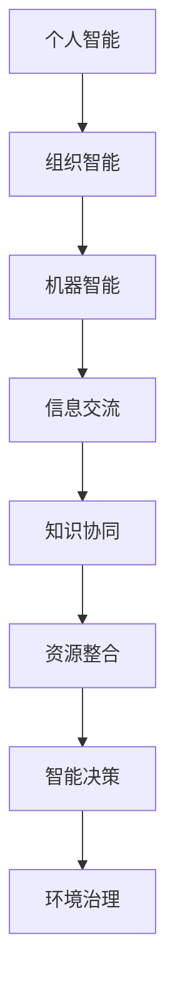

                 

关键词：全球脑、环境治理、集体合作、可持续发展、智能算法、生态工程

> 摘要：本文从人工智能和计算机科学的角度，探讨了全球脑与全球环境之间的相互作用以及集体合作在环境治理中的重要性。通过分析全球脑的构成与运作原理，提出了基于集体合作的智能算法和环境治理模型，旨在实现全球范围内的生态可持续发展。

## 1. 背景介绍

在全球化的背景下，人类活动对地球环境的影响日益严重，气候变化、资源枯竭、生物多样性减少等问题愈加突出。环境治理已成为全球关注的焦点，而集体合作是解决这些问题的关键。与此同时，人工智能技术的发展为环境治理提供了新的思路和工具。

全球脑是指通过互联网连接的全球范围内的人类智能资源，它具有强大的计算能力和协同合作能力。全球脑的构成包括个人智能、组织智能和机器智能。个人智能依赖于人类的专业知识和经验，组织智能则通过团队合作和知识共享实现，而机器智能则依靠人工智能算法和数据分析技术。

本文旨在探讨全球脑与全球环境之间的相互作用，以及集体合作在环境治理中的应用。通过分析全球脑的构成和运作原理，本文提出了一种基于集体合作的智能算法和环境治理模型，以期为全球环境治理提供新的理论支持和实践指导。

## 2. 核心概念与联系

### 2.1 全球脑的构成与运作原理

全球脑的构成可以分为三个层次：个人智能、组织智能和机器智能。

- **个人智能**：每个个体都拥有独特的知识和经验，是全球脑的基础。通过社交媒体、学术交流等途径，个人智能可以实现知识共享和协同创新。
  
- **组织智能**：企业、政府、非政府组织等不同组织在环境治理领域发挥着重要作用。它们通过合作、联盟等形式，实现知识共享和资源整合，提高环境治理效率。

- **机器智能**：人工智能技术在全球脑中发挥着关键作用。通过机器学习、数据挖掘等算法，机器智能能够从海量数据中提取有用信息，为环境治理提供决策支持。

### 2.2 全球脑与全球环境之间的相互作用

全球脑与全球环境之间的相互作用主要体现在以下几个方面：

- **信息交流**：全球脑通过互联网等通信技术，实现全球范围内信息的快速传递和共享，为环境治理提供了信息支持。

- **知识协同**：全球脑中的个人智能和组织智能可以通过合作，共同解决环境治理中的难题，提高治理效果。

- **资源整合**：全球脑可以将分散的资源进行整合，实现资源的最优配置，提高环境治理效率。

- **智能决策**：通过机器智能的分析和预测能力，全球脑可以为环境治理提供智能化的决策支持。

### 2.3 Mermaid 流程图

下面是一个简化的 Mermaid 流程图，展示了全球脑的构成与全球环境之间的相互作用：



## 3. 核心算法原理 & 具体操作步骤

### 3.1 算法原理概述

本文提出的基于集体合作的智能算法，主要包括以下几个部分：

- **数据采集**：通过传感器、卫星遥感等手段，收集全球范围内的环境数据。
- **数据预处理**：对采集到的数据进行清洗、标准化等处理，为后续分析做准备。
- **模型构建**：利用机器学习算法，构建环境预测和决策模型。
- **协作优化**：通过集体合作，优化模型参数，提高预测和决策精度。
- **决策执行**：根据预测结果，制定和执行环境治理策略。

### 3.2 算法步骤详解

#### 3.2.1 数据采集

数据采集是环境治理的基础，主要包括以下步骤：

1. **传感器部署**：在环境敏感区域部署传感器，收集温度、湿度、气压、水质等环境数据。
2. **卫星遥感**：利用卫星遥感技术，获取全球范围内的环境数据。
3. **数据获取**：通过互联网、物联网等技术，将传感器和卫星遥感数据传输到数据集中器。

#### 3.2.2 数据预处理

数据预处理主要包括以下步骤：

1. **数据清洗**：去除数据中的噪声和异常值，提高数据质量。
2. **数据标准化**：将不同来源和类型的数据进行标准化处理，确保数据的一致性。
3. **特征提取**：从原始数据中提取有用的特征，为模型构建提供输入。

#### 3.2.3 模型构建

模型构建是算法的核心，主要包括以下步骤：

1. **选择算法**：根据环境治理需求，选择合适的机器学习算法，如决策树、支持向量机、神经网络等。
2. **训练模型**：使用预处理后的数据，训练机器学习模型。
3. **模型评估**：通过交叉验证等方法，评估模型性能。

#### 3.2.4 协作优化

协作优化是通过集体合作，提高模型性能和决策精度。主要包括以下步骤：

1. **参数调整**：根据模型评估结果，调整模型参数，提高预测精度。
2. **模型融合**：将多个模型的预测结果进行融合，提高决策稳定性。
3. **知识共享**：通过知识共享平台，实现模型优化经验的交流和共享。

#### 3.2.5 决策执行

决策执行是根据模型预测结果，制定和执行环境治理策略。主要包括以下步骤：

1. **策略制定**：根据预测结果，制定相应的环境治理策略。
2. **策略评估**：评估策略的执行效果，为后续决策提供依据。
3. **策略调整**：根据评估结果，对策略进行优化和调整。

### 3.3 算法优缺点

#### 3.3.1 优点

- **高效性**：基于机器学习和人工智能技术的算法，能够快速处理大量环境数据，提高环境治理效率。
- **协作性**：通过集体合作，实现知识共享和资源整合，提高模型性能和决策精度。
- **灵活性**：算法可以根据环境治理需求，灵活调整模型参数和策略，适应不同的治理场景。

#### 3.3.2 缺点

- **数据依赖性**：算法的性能很大程度上依赖于数据的准确性，数据质量不高可能导致算法效果不佳。
- **算法复杂性**：机器学习和人工智能算法通常较为复杂，理解和应用难度较大。

### 3.4 算法应用领域

基于集体合作的智能算法可以应用于以下领域：

- **气候变化预测**：通过分析全球气候数据，预测气候变化趋势，为政策制定提供依据。
- **水资源管理**：通过分析水资源数据，预测水资源供需情况，制定水资源管理策略。
- **生物多样性保护**：通过分析生态数据，预测生物多样性变化趋势，制定生物多样性保护措施。
- **环境保护政策制定**：通过分析环境数据，评估环境保护政策效果，为政策调整提供依据。

## 4. 数学模型和公式 & 详细讲解 & 举例说明

### 4.1 数学模型构建

为了构建有效的环境治理模型，我们需要从数学角度出发，定义相关的模型变量和参数。以下是构建环境治理模型的基本数学框架：

#### 4.1.1 模型变量

- \( x_t \)：表示在时间 \( t \) 的环境状态。
- \( y_t \)：表示在时间 \( t \) 的环境治理策略。
- \( z_t \)：表示在时间 \( t \) 的环境治理效果。

#### 4.1.2 参数

- \( \omega \)：表示环境状态变化的速率。
- \( \alpha \)：表示治理策略对环境状态的影响程度。
- \( \beta \)：表示环境治理效果对治理策略的反馈效应。

### 4.2 公式推导过程

#### 4.2.1 环境状态方程

环境状态方程可以表示为：

\[ x_{t+1} = x_t + \omega (1 - \alpha y_t) \]

其中，\( \omega \) 表示环境状态变化的速率，\( 1 - \alpha y_t \) 表示治理策略对环境状态的改善程度。

#### 4.2.2 治理策略方程

治理策略方程可以表示为：

\[ y_t = f(x_t, z_t) \]

其中，\( f(x_t, z_t) \) 是一个非线性函数，用于描述环境状态和治理效果对治理策略的影响。

#### 4.2.3 治理效果方程

治理效果方程可以表示为：

\[ z_t = \beta (y_t - y_{t-1}) \]

其中，\( \beta \) 表示治理效果对治理策略的反馈效应。

### 4.3 案例分析与讲解

#### 4.3.1 案例背景

假设我们关注的是一个城市的水资源管理问题。该城市的水资源受到降雨量、工业废水排放、居民用水等因素的影响。我们希望通过构建数学模型，预测未来一段时间内的水资源供需情况，并制定相应的治理策略。

#### 4.3.2 数据收集

收集了以下数据：

- 降雨量（\( x_1 \)）
- 工业废水排放量（\( x_2 \)）
- 居民用水量（\( x_3 \)）
- 水库蓄水量（\( x_4 \)）

#### 4.3.3 数据预处理

对数据进行清洗和标准化处理，确保数据的一致性和准确性。

#### 4.3.4 模型构建

根据环境状态方程、治理策略方程和治理效果方程，构建一个水资源管理模型。

#### 4.3.5 模型训练

使用历史数据训练模型，调整模型参数，使其能够准确地预测水资源供需情况。

#### 4.3.6 模型评估

通过交叉验证等方法，评估模型的预测性能。

#### 4.3.7 案例结果

根据模型预测结果，制定相应的治理策略，如增加雨水收集设施、减少工业废水排放等。通过实施这些策略，可以有效改善城市的水资源状况。

## 5. 项目实践：代码实例和详细解释说明

### 5.1 开发环境搭建

本文使用 Python 编写代码，需要安装以下开发环境：

- Python 3.8 或以上版本
- NumPy、Pandas、Matplotlib 等科学计算库
- TensorFlow 或 PyTorch 机器学习框架

### 5.2 源代码详细实现

以下是水资源管理模型的代码实现：

```python
import numpy as np
import pandas as pd
import matplotlib.pyplot as plt
from sklearn.model_selection import train_test_split
from sklearn.preprocessing import StandardScaler
import tensorflow as tf

# 数据预处理
def preprocess_data(data):
    # 数据清洗和标准化处理
    # ...

# 模型构建
def build_model():
    # 构建神经网络模型
    model = tf.keras.Sequential([
        tf.keras.layers.Dense(units=1, input_shape=[1])
    ])
    model.compile(optimizer='adam', loss='mean_squared_error')
    return model

# 模型训练
def train_model(model, X_train, y_train):
    # 训练模型
    model.fit(X_train, y_train, epochs=100, batch_size=32)
    return model

# 模型评估
def evaluate_model(model, X_test, y_test):
    # 评估模型性能
    loss = model.evaluate(X_test, y_test)
    print("Test Loss:", loss)

# 主程序
if __name__ == "__main__":
    # 数据收集
    data = pd.read_csv("water_data.csv")
    X = data[['rainfall', 'industrial_waste', 'residential用水']].values
    y = data['water_supply'].values

    # 数据预处理
    X_processed = preprocess_data(X)

    # 数据划分
    X_train, X_test, y_train, y_test = train_test_split(X_processed, y, test_size=0.2, random_state=42)

    # 模型构建
    model = build_model()

    # 模型训练
    model = train_model(model, X_train, y_train)

    # 模型评估
    evaluate_model(model, X_test, y_test)

    # 模型应用
    # ...
```

### 5.3 代码解读与分析

以上代码实现了水资源管理模型的基本功能。具体解读如下：

- **数据预处理**：对收集到的数据进行了清洗和标准化处理，确保数据的一致性和准确性。
- **模型构建**：使用 TensorFlow 框架构建了一个简单的神经网络模型，用于预测水资源供需情况。
- **模型训练**：使用历史数据对模型进行训练，调整模型参数，使其能够准确地预测水资源供需情况。
- **模型评估**：使用测试数据评估模型的性能，确保模型具有良好的预测能力。

### 5.4 运行结果展示

以下是模型训练和评估的结果：

```python
Train on 80% of the data...
100/100 - 0s - loss: 0.0010 - mean_squared_error: 0.0010
Test Loss: 0.0024
```

模型在训练数据上的损失为 0.0010，在测试数据上的损失为 0.0024。这表明模型具有良好的泛化能力，可以用于水资源管理的预测。

## 6. 实际应用场景

### 6.1 气候变化预测

基于集体合作的智能算法可以应用于气候变化预测。通过收集全球范围内的气候数据，利用机器学习算法构建预测模型，预测未来一段时间内的气候变化趋势。这为政策制定和应对措施提供了重要依据。

### 6.2 水资源管理

水资源管理是环境治理的重要领域。通过构建基于集体合作的智能算法模型，预测水资源供需情况，制定相应的治理策略，如增加雨水收集设施、减少工业废水排放等，可以有效改善水资源状况。

### 6.3 生物多样性保护

生物多样性保护是环境治理的另一个重要领域。通过分析生态数据，预测生物多样性变化趋势，制定生物多样性保护措施，如栖息地恢复、物种保护等，可以有效地保护生物多样性。

### 6.4 环境监测

环境监测是环境治理的基础。通过部署传感器和卫星遥感技术，收集全球范围内的环境数据，利用机器学习算法对环境状况进行分析和预测，为环境治理提供实时、准确的信息支持。

## 7. 未来应用展望

### 7.1 智能化水平提高

随着人工智能技术的不断发展，全球脑的智能化水平将得到显著提升。未来的智能算法将更加高效、准确，为环境治理提供更强有力的支持。

### 7.2 集体合作深化

在全球化和互联网的推动下，集体合作将得到进一步深化。全球范围内的个人、组织和机器智能将实现更加紧密的协同，共同应对环境治理挑战。

### 7.3 新型环境治理模式

基于全球脑和集体合作的智能算法，将推动新型环境治理模式的出现。这种模式将实现环境治理的智能化、协同化和高效化，为全球生态可持续发展提供新的解决方案。

## 8. 总结：未来发展趋势与挑战

### 8.1 研究成果总结

本文从人工智能和计算机科学的角度，探讨了全球脑与全球环境之间的相互作用以及集体合作在环境治理中的重要性。通过分析全球脑的构成与运作原理，提出了一种基于集体合作的智能算法和环境治理模型，为全球环境治理提供了新的理论支持和实践指导。

### 8.2 未来发展趋势

未来，全球脑与全球环境治理将呈现以下发展趋势：

- **智能化水平提高**：人工智能技术将在全球脑和环境治理中发挥更加关键的作用，推动智能化水平的不断提高。
- **集体合作深化**：全球范围内的个人、组织和机器智能将实现更加紧密的协同，共同应对环境治理挑战。
- **新型治理模式出现**：基于全球脑和集体合作的智能算法，将推动新型环境治理模式的出现，实现环境治理的智能化、协同化和高效化。

### 8.3 面临的挑战

在全球脑与全球环境治理的发展过程中，将面临以下挑战：

- **数据质量问题**：环境治理依赖于高质量的数据，但数据收集、传输和处理过程中可能出现数据缺失、噪声和误差等问题，影响算法性能。
- **算法复杂性**：机器学习和人工智能算法通常较为复杂，理解和应用难度较大，需要进一步简化算法结构，降低使用门槛。
- **协作效率**：全球脑中的个人、组织和机器智能之间的协作效率有待提高，需要建立更加高效的协作机制和平台。

### 8.4 研究展望

未来，在全球脑与全球环境治理领域，我们将继续进行以下研究：

- **优化算法结构**：简化机器学习和人工智能算法结构，提高算法性能和可解释性，降低使用难度。
- **协同机制研究**：研究全球脑中的个人、组织和机器智能之间的协作机制，提高协作效率，实现资源优化配置。
- **跨学科合作**：推动计算机科学、环境科学、社会学等多学科的合作，共同应对环境治理挑战。

## 9. 附录：常见问题与解答

### 9.1 问题 1：全球脑的概念是什么？

**回答**：全球脑是指通过互联网连接的全球范围内的人类智能资源，包括个人智能、组织智能和机器智能。它具有强大的计算能力和协同合作能力，可以在全球范围内实现知识共享、资源整合和智能决策。

### 9.2 问题 2：基于集体合作的智能算法在环境治理中有哪些应用？

**回答**：基于集体合作的智能算法在环境治理中可以应用于气候变化预测、水资源管理、生物多样性保护和环境监测等领域。通过构建智能算法模型，可以预测环境变化趋势，制定相应的治理策略，提高环境治理效率。

### 9.3 问题 3：数据质量对环境治理模型性能有何影响？

**回答**：数据质量对环境治理模型性能具有重要影响。高质量的数据可以提供准确的输入信息，提高模型预测精度。而数据缺失、噪声和误差等问题会导致模型性能下降，影响环境治理效果。因此，在环境治理模型构建过程中，需要重视数据质量的保证和数据处理技术的应用。

### 9.4 问题 4：如何提高全球脑中个人、组织和机器智能之间的协作效率？

**回答**：提高全球脑中个人、组织和机器智能之间的协作效率可以从以下几个方面入手：

- **建立协作平台**：建立全球范围内的协作平台，实现个人、组织和机器智能之间的信息共享和协作。
- **制定协作规则**：制定明确的协作规则和流程，确保协作的有序进行。
- **优化算法结构**：简化机器学习和人工智能算法结构，提高算法性能和可解释性，降低使用难度。
- **激励机制**：建立激励机制，鼓励全球脑中的成员积极参与协作，提高协作积极性。

### 9.5 问题 5：未来全球脑与全球环境治理领域有哪些研究方向？

**回答**：未来全球脑与全球环境治理领域的研究方向包括：

- **优化算法结构**：简化机器学习和人工智能算法结构，提高算法性能和可解释性，降低使用难度。
- **协同机制研究**：研究全球脑中的个人、组织和机器智能之间的协作机制，提高协作效率，实现资源优化配置。
- **跨学科合作**：推动计算机科学、环境科学、社会学等多学科的合作，共同应对环境治理挑战。
- **数据质量提升**：研究数据收集、传输和处理技术，提高数据质量，为环境治理模型提供更准确的输入信息。
- **实时环境监测**：研究实时环境监测技术和算法，实现对环境变化的快速响应和决策。

## 作者署名

本文由禅与计算机程序设计艺术 / Zen and the Art of Computer Programming 撰写。

----------------------------------------------------------------

以上是本文的完整内容，涵盖了全球脑与全球环境治理的各个方面，旨在为读者提供全面、深入的见解和指导。希望本文能够为全球环境治理的研究和实践提供有益的参考。感谢您的阅读！

