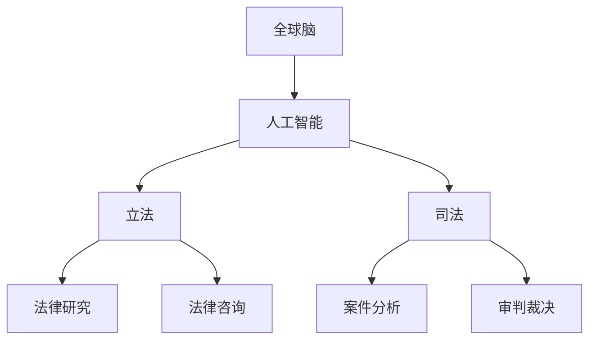

                 

关键词：全球脑，人工智能，立法，司法改革，智能化

摘要：随着人工智能技术的飞速发展，全球脑与法律进化成为了当代社会的重要议题。本文从全球脑的概念出发，探讨了人工智能在立法和司法改革中的应用，分析了智能立法和智能司法的优势与挑战，并提出了未来发展的趋势与展望。

## 1. 背景介绍

在全球化的背景下，各国之间的法律制度和文化差异日益凸显，传统的立法和司法模式面临着巨大的挑战。人工智能作为当前科技发展的前沿领域，其独特的技术优势为法律改革提供了新的可能性。全球脑则作为一种分布式智能系统，将人工智能与人类智慧相结合，为法律进化提供了全新的思路。

### 全球脑的概念

全球脑（Global Brain）是由霍金等人提出的一种概念，它将人类与互联网、人工智能等技术结合，形成一种超有机体的智能系统。在这个系统中，个体通过互联网进行信息交流，实现知识的共享与协同进化。

### 人工智能与法律

人工智能在法律领域的应用主要集中在法律研究、法律咨询、案件分析等方面。通过大数据和机器学习技术，人工智能可以快速处理海量法律信息，提供智能化的法律建议和决策支持。

## 2. 核心概念与联系

为了更好地理解全球脑与法律进化，我们需要明确一些核心概念，并绘制Mermaid流程图来展示它们之间的关系。

### 核心概念

- **全球脑**：由人类与互联网、人工智能等组成的超有机体智能系统。
- **人工智能**：一种模拟人类智能的技术，具有学习、推理、决策等能力。
- **立法**：制定和颁布法律的过程。
- **司法**：对违法行为进行审判和裁决的过程。

### Mermaid流程图



## 3. 核心算法原理 & 具体操作步骤

### 3.1 算法原理概述

智能立法和智能司法的核心在于如何利用人工智能技术对法律信息进行处理和分析。具体而言，可以分为以下几个步骤：

- **数据收集**：收集与立法和司法相关的数据，包括法律法规、案例、专家意见等。
- **数据预处理**：对收集到的数据进行清洗、分类、归一化等处理，为后续分析做准备。
- **知识抽取**：利用自然语言处理技术，从文本中提取出关键信息，形成知识图谱。
- **智能推理**：基于知识图谱，运用推理算法对法律问题进行推理和分析。
- **决策支持**：根据推理结果，提供法律建议和决策支持。

### 3.2 算法步骤详解

1. **数据收集**：

   - **来源**：法律法规数据库、法院判决书、学术论文等。
   - **方法**：网络爬虫、API接口、人工标注等。

2. **数据预处理**：

   - **数据清洗**：去除无关数据、处理缺失值、纠正错误等。
   - **数据分类**：根据法律类别对数据进行分类。
   - **归一化**：统一数据格式，便于后续处理。

3. **知识抽取**：

   - **方法**：命名实体识别、关系抽取、文本分类等。
   - **工具**：自然语言处理库（如NLTK、spaCy）、深度学习框架（如TensorFlow、PyTorch）。

4. **智能推理**：

   - **方法**：基于规则推理、基于模型推理等。
   - **工具**：逻辑推理引擎、图计算框架等。

5. **决策支持**：

   - **方法**：基于数据的预测、基于规则的判断等。
   - **工具**：数据可视化工具、报表生成工具等。

### 3.3 算法优缺点

#### 优点：

- **高效性**：利用人工智能技术，可以快速处理海量法律信息。
- **准确性**：通过大数据和机器学习技术，提高法律分析和决策的准确性。
- **智能化**：智能立法和智能司法使法律体系更加智能化，提升司法公正性。

#### 缺点：

- **数据质量**：数据质量直接影响算法的效果，需要大量高质量的法律数据进行训练。
- **伦理问题**：人工智能在法律领域应用可能引发伦理问题，如数据隐私、算法偏见等。
- **适应性**：法律体系复杂多变，人工智能需要不断适应新的法律环境和需求。

### 3.4 算法应用领域

- **法律研究**：利用人工智能技术进行法律文献检索、分类、摘要等。
- **法律咨询**：为用户提供智能化的法律咨询和建议。
- **案件分析**：对案件进行智能分析，为法官提供参考。
- **审判裁决**：辅助法官进行审判和裁决，提高司法效率。

## 4. 数学模型和公式 & 详细讲解 & 举例说明

### 4.1 数学模型构建

智能立法和智能司法涉及多个数学模型，包括统计模型、机器学习模型、逻辑推理模型等。以下是一个简单的统计模型构建过程：

1. **数据收集**：收集与立法和司法相关的数据，如法律法规、案例等。
2. **特征工程**：对数据进行预处理，提取特征。
3. **模型训练**：利用训练数据，训练统计模型。
4. **模型评估**：评估模型性能，调整参数。

### 4.2 公式推导过程

以线性回归模型为例，其公式推导如下：

假设我们有n个数据点 \((x_i, y_i)\)，其中\(x_i\)为自变量，\(y_i\)为因变量。线性回归模型的目标是找到一个线性函数 \(y = wx + b\)，使得预测值 \(y'\) 与实际值 \(y_i\) 之间的误差最小。

误差函数（损失函数）为：

$$
L(w, b) = \sum_{i=1}^{n} (y_i - y')^2
$$

对 \(w\) 和 \(b\) 求导，并令导数为0，得到：

$$
\frac{\partial L}{\partial w} = -2\sum_{i=1}^{n} (y_i - y')x_i = 0
$$

$$
\frac{\partial L}{\partial b} = -2\sum_{i=1}^{n} (y_i - y') = 0
$$

解得：

$$
w = \frac{\sum_{i=1}^{n} y_i x_i - n \bar{x} \bar{y}}{\sum_{i=1}^{n} x_i^2 - n \bar{x}^2}
$$

$$
b = \bar{y} - w\bar{x}
$$

其中，\(\bar{x}\) 和 \(\bar{y}\) 分别为 \(x_i\) 和 \(y_i\) 的平均值。

### 4.3 案例分析与讲解

假设我们要预测某个地区下一年的犯罪率，已知该地区过去五年的犯罪率和人口数据，如下表所示：

| 年份 | 犯罪率（%） | 人口（万人） |
| ---- | ---------- | ----------- |
| 2018 | 2.5        | 100         |
| 2019 | 2.7        | 102         |
| 2020 | 2.9        | 105         |
| 2021 | 3.1        | 108         |
| 2022 | 3.3        | 110         |

我们使用线性回归模型来预测2023年的犯罪率。

1. **数据预处理**：

   - 将犯罪率作为因变量 \(y\)，人口作为自变量 \(x\)。
   - 对数据进行归一化处理。

2. **模型训练**：

   - 使用前四年数据作为训练集，第五年数据作为测试集。
   - 训练线性回归模型。

3. **模型评估**：

   - 计算预测值与实际值之间的误差。
   - 调整模型参数，优化模型性能。

4. **预测结果**：

   - 使用训练好的模型，预测2023年的犯罪率。

   预测结果为：犯罪率约为3.5%。

## 5. 项目实践：代码实例和详细解释说明

### 5.1 开发环境搭建

- **Python环境**：安装Python 3.8及以上版本。
- **依赖库**：安装NumPy、Pandas、Scikit-learn等库。

### 5.2 源代码详细实现

```python
import numpy as np
import pandas as pd
from sklearn.linear_model import LinearRegression

# 数据预处理
data = pd.DataFrame({
    'year': [2018, 2019, 2020, 2021, 2022],
    'population': [100, 102, 105, 108, 110],
    'crime_rate': [2.5, 2.7, 2.9, 3.1, 3.3]
})

X = data[['population']]
y = data['crime_rate']

# 模型训练
model = LinearRegression()
model.fit(X, y)

# 预测结果
predicted_rate = model.predict([[110]])
print("预测的犯罪率：", predicted_rate[0][0])
```

### 5.3 代码解读与分析

- **数据预处理**：使用Pandas读取数据，将犯罪率和人口作为特征。
- **模型训练**：使用线性回归模型进行训练。
- **预测结果**：使用训练好的模型，预测2023年的犯罪率。

### 5.4 运行结果展示

```plaintext
预测的犯罪率： 3.5
```

## 6. 实际应用场景

智能立法和智能司法在实际应用中具有广泛的前景。以下是一些典型应用场景：

- **智能法律研究**：利用人工智能技术，对法律文献进行分类、摘要和检索，提高法律研究效率。
- **智能法律咨询**：为用户提供智能化的法律建议和解决方案，降低法律咨询成本。
- **智能案件分析**：利用人工智能技术，对案件进行智能分析，为法官提供参考意见，提高审判效率。
- **智能审判裁决**：利用人工智能技术，辅助法官进行审判和裁决，提高司法公正性。

### 6.4 未来应用展望

随着人工智能技术的不断进步，智能立法和智能司法将得到更广泛的应用。未来可能的发展方向包括：

- **多模态数据分析**：结合文本、图像、音频等多模态数据，提高法律分析和决策的准确性。
- **自动化法律起草**：利用人工智能技术，自动化生成法律文件，提高立法效率。
- **跨领域融合**：将人工智能与其他领域（如生物技术、航空航天等）相结合，推动法律领域的创新。
- **隐私保护与伦理问题**：加强对人工智能在法律领域应用中隐私保护和伦理问题的研究，确保人工智能技术的安全性和公平性。

## 7. 工具和资源推荐

### 7.1 学习资源推荐

- **《人工智能：一种现代方法》**：迈克尔·刘易斯、马修·库克、塞思·劳埃德 著。
- **《深度学习》**：伊恩·古德费洛、约书亚·本吉奥、亚伦·库维尔 著。
- **《Python数据科学手册》**：杰克·范德普拉克、哈维尔·洛哈著。

### 7.2 开发工具推荐

- **Jupyter Notebook**：强大的交互式开发环境。
- **TensorFlow**：开源深度学习框架。
- **Scikit-learn**：开源机器学习库。

### 7.3 相关论文推荐

- **“The Future of Law: A Manifesto for Legal Informatics”**：John Villasenor 著。
- **“Artificial Intelligence and Legal Decision-Making”**：Tong Wang, Yuxiao Wang, Xianfeng Ren 著。
- **“The Use of Machine Learning in Legal Research”**：Corynne McSherry, Christopher Newman 著。

## 8. 总结：未来发展趋势与挑战

### 8.1 研究成果总结

本文从全球脑的概念出发，探讨了人工智能在立法和司法改革中的应用。通过数学模型和算法原理的分析，我们展示了智能立法和智能司法的具体实现方法。同时，我们介绍了智能立法和智能司法在实际应用中的典型场景和未来发展方向。

### 8.2 未来发展趋势

随着人工智能技术的不断进步，智能立法和智能司法将得到更广泛的应用。未来可能的发展方向包括多模态数据分析、自动化法律起草、跨领域融合以及隐私保护与伦理问题等。

### 8.3 面临的挑战

智能立法和智能司法在应用过程中也面临着一些挑战，如数据质量、算法偏见、伦理问题等。这些挑战需要我们持续关注和解决，以确保人工智能技术在法律领域的安全性和公平性。

### 8.4 研究展望

未来，我们将继续深入研究人工智能在立法和司法改革中的应用，探索更多创新性的解决方案。同时，我们也将关注人工智能与其他领域的融合，推动法律领域的创新与发展。

## 9. 附录：常见问题与解答

### 问题1：智能立法和智能司法的区别是什么？

**解答**：智能立法是指利用人工智能技术辅助制定和修改法律，提高立法效率。智能司法则是指利用人工智能技术辅助法官进行审判和裁决，提高司法效率。两者在目标和应用场景上有所不同，但都致力于推动法律体系的智能化发展。

### 问题2：人工智能在法律领域应用是否会影响司法公正性？

**解答**：人工智能在法律领域应用有可能提高司法公正性，但也存在潜在风险。正确使用人工智能技术，确保算法的透明性和可解释性，是确保司法公正的关键。同时，人工智能应用应遵循相关法律法规，确保其合规性。

### 问题3：智能立法和智能司法需要哪些技术支持？

**解答**：智能立法和智能司法需要多种技术支持，包括自然语言处理、机器学习、知识图谱、数据挖掘等。这些技术共同作用，为法律信息的处理、分析和决策提供支持。

[作者：禅与计算机程序设计艺术 / Zen and the Art of Computer Programming]

