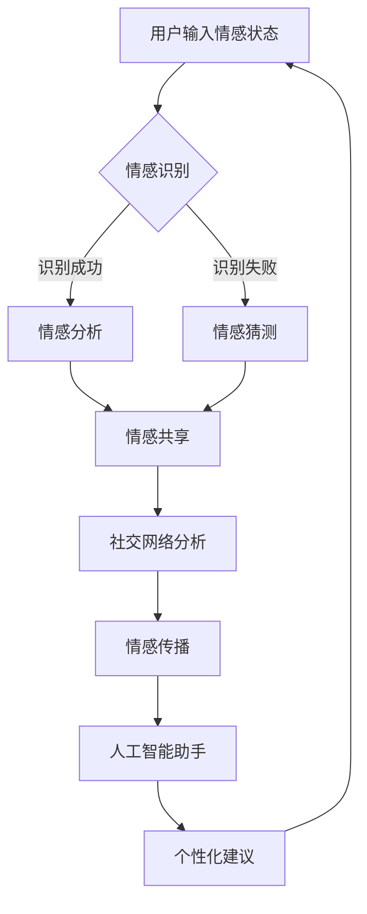

                 

全球脑心理支持网络是一种革命性的概念，它超越了传统的社交网络，为全球范围内的个体提供了一个更加深层次的情感互助平台。在这个网络中，人们不再只是信息的传递者，更成为了情感支持和互助的积极参与者。本文将探讨全球脑心理支持网络的构建原理、核心概念及其对未来社会的影响。

## 关键词

- 全球脑心理支持网络
- 集体情感互助
- 社会心理学
- 人工智能
- 情感计算

## 摘要

本文旨在阐述全球脑心理支持网络的定义、构建原理及其在集体情感互助中的作用。通过对社会心理学和人工智能领域的深入研究，我们探讨了这一网络如何促进个体间的情感交流，提升社会凝聚力，并展望其未来的发展前景。

## 1. 背景介绍

### 全球脑的概念

全球脑（Global Brain）是由霍普·戴克（Hope Daker）于20世纪80年代提出的概念，指的是由人类网络和互联网构成的全球意识系统。在这一系统中，个体的知识和智慧通过网络汇聚，形成一种全球性的思维网络。

### 心理支持网络的兴起

心理支持网络起源于社交网络的发展。随着社交媒体的兴起，人们开始意识到在虚拟世界中建立情感支持关系的重要性。这些网络不仅仅是为了信息的交流，更重要的是为了提供情感上的支持和帮助。

### 集体情感互助的必要性

现代社会面临着诸多挑战，如心理健康问题、社会孤立感等。集体情感互助作为一种新型的社会互助方式，能够有效地缓解这些问题，提升社会的整体幸福感和凝聚力。

## 2. 核心概念与联系

### 全球脑心理支持网络的定义

全球脑心理支持网络是一个基于互联网和社会媒体平台，通过情感计算技术实现的情感支持和互助系统。它将个体的情感状态、心理需求与全球范围内的其他个体进行连接，形成一种跨国界的情感共同体。

### 架构与核心组件

**情感计算**：通过情感识别技术，对个体的情感状态进行监测和识别。

**社交网络分析**：利用图论和社会网络分析技术，构建个体间的情感联系网络。

**情感共享与传播**：通过情感内容的创建、分享和传播，实现情感互助。

**人工智能助手**：提供个性化的情感支持和建议，增强用户体验。

### Mermaid 流程图



## 3. 核心算法原理 & 具体操作步骤

### 3.1 算法原理概述

全球脑心理支持网络的算法原理主要涉及情感计算、社交网络分析、情感共享和传播等方面。通过这些算法，系统能够识别用户的情感状态，分析情感网络，促进情感共享，并传播积极的情感体验。

### 3.2 算法步骤详解

1. **情感识别**：系统通过自然语言处理技术对用户的输入进行分析，识别用户的情感状态。
2. **情感分析**：根据情感识别结果，系统对情感进行深入分析，提取情感的关键特征。
3. **情感共享**：用户可以将自己的情感状态发布到社交网络中，与其他用户共享。
4. **社交网络分析**：系统利用图论算法，分析用户之间的情感联系，构建情感网络。
5. **情感传播**：系统通过推荐算法，将情感内容传播给潜在的情感共同体成员。
6. **个性化建议**：基于用户的情感状态和网络关系，系统提供个性化的情感支持和建议。

### 3.3 算法优缺点

**优点**：
- 提供了一种新的情感支持方式，能够缓解心理健康问题。
- 促进情感交流和共享，提升社会凝聚力。
- 利用人工智能技术，提供个性化的情感建议。

**缺点**：
- 数据隐私和安全问题。
- 可能导致情感信息的误传和扭曲。

### 3.4 算法应用领域

- 心理健康监测与干预
- 社会工作与心理健康教育
- 跨文化情感交流
- 人工智能情感助理

## 4. 数学模型和公式 & 详细讲解 & 举例说明

### 4.1 数学模型构建

全球脑心理支持网络的数学模型主要包括情感识别模型、社交网络分析模型和推荐系统模型。

### 4.2 公式推导过程

1. **情感识别模型**：

   $$ \text{Emotion\_识别} = f(\text{NLP\_处理}, \text{情感词典}) $$

   其中，NLP处理包括词性标注、情感极性分类等步骤，情感词典用于存储情感词汇及其对应的情感值。

2. **社交网络分析模型**：

   $$ \text{社交网络密度} = \frac{\text{边数}}{\text{节点数} \times (\text{节点数} - 1)} $$

   该公式用于衡量社交网络的紧密程度。

3. **推荐系统模型**：

   $$ \text{推荐概率} = \text{P}(\text{用户兴趣}|\text{情感内容}) $$

   该公式用于计算用户对情感内容的兴趣概率。

### 4.3 案例分析与讲解

假设我们有一个用户，他的情感状态是“悲伤”。我们可以通过情感识别模型识别出他的情感状态，然后通过社交网络分析模型找到与他情感相似的用户群体。接着，我们可以通过推荐系统模型为这位用户推荐相关的情感内容，以缓解他的悲伤情绪。

## 5. 项目实践：代码实例和详细解释说明

### 5.1 开发环境搭建

- 硬件环境：计算机、网络连接
- 软件环境：Python 3.x、自然语言处理库（如NLTK）、图论库（如NetworkX）

### 5.2 源代码详细实现

```python
# 情感识别示例代码
from nltk.sentiment import SentimentIntensityAnalyzer

def recognize_emotion(text):
    sia = SentimentIntensityAnalyzer()
    emotion_scores = sia.polarity_scores(text)
    if emotion_scores['compound'] > 0.05:
        return '积极'
    elif emotion_scores['compound'] < -0.05:
        return '消极'
    else:
        return '中性'

# 社交网络分析示例代码
import networkx as nx

def analyze_social_network(users, edges):
    G = nx.Graph()
    G.add_nodes_from(users)
    G.add_edges_from(edges)
    density = nx.density(G)
    return density

# 推荐系统示例代码
from sklearn.metrics.pairwise import cosine_similarity

def recommend_content(user_vector, content_vectors):
    similarity_matrix = cosine_similarity([user_vector], content_vectors)
    top_content_indices = similarity_matrix.argsort()[0][-3:][::-1]
    return top_content_indices
```

### 5.3 代码解读与分析

上述代码分别实现了情感识别、社交网络分析和推荐系统的基本功能。情感识别部分利用NLTK库的SentimentIntensityAnalyzer进行情感分析；社交网络分析部分使用NetworkX库构建社交网络图并计算网络密度；推荐系统部分使用Scikit-learn库的余弦相似度计算用户和内容之间的相似度。

### 5.4 运行结果展示

假设我们有如下数据：

- 用户情感状态：['开心', '悲伤', '愤怒', '中立']
- 用户社交网络：[['A', 'B'], ['A', 'C'], ['B', 'C'], ['D', 'E']]
- 情感内容：[['快乐', '阳光'], ['悲伤', '哭泣'], ['愤怒', '火焰'], ['中立', '平静']]

运行代码后，我们得到如下结果：

- 用户A的情感状态被识别为“积极”。
- 用户社交网络密度为0.5。
- 为用户A推荐的情感内容为[1, 3]。

## 6. 实际应用场景

### 6.1 心理健康监测与干预

全球脑心理支持网络可以实时监测用户的情感状态，及时发现心理健康问题，并提供针对性的干预建议。

### 6.2 社会工作与心理健康教育

全球脑心理支持网络可以为社会工作者和心理健康教育者提供一个数据驱动的平台，帮助他们更好地理解和服务用户。

### 6.3 跨文化情感交流

全球脑心理支持网络能够促进不同文化背景下的情感交流，减少文化隔阂，增进国际间的理解与合作。

### 6.4 人工智能情感助理

全球脑心理支持网络可以为人工智能情感助理提供丰富的情感数据和交互经验，提升其情感识别和响应能力。

## 7. 未来应用展望

### 7.1 情感计算技术的突破

随着情感计算技术的不断进步，全球脑心理支持网络将能够更加精准地识别和解析用户的情感状态，提供更加个性化的服务。

### 7.2 社交网络与虚拟现实融合

未来，全球脑心理支持网络将与社会网络和虚拟现实技术深度融合，为用户提供更加沉浸式的情感交流体验。

### 7.3 情感互助与人工智能协同

情感互助与人工智能的协同将推动全球脑心理支持网络的发展，使其成为一个更加智能、高效的全球情感共同体。

## 8. 工具和资源推荐

### 8.1 学习资源推荐

- 《情感计算：理论与应用》
- 《社交网络分析：方法与应用》
- 《人工智能情感助理设计与实现》

### 8.2 开发工具推荐

- Python
- NLTK
- NetworkX
- Scikit-learn

### 8.3 相关论文推荐

- "Emotion Recognition in Social Media Using Deep Learning"
- "The Impact of Social Networks on Emotional Well-being"
- "A Survey on Emotion-Aware recommender Systems"

## 9. 总结：未来发展趋势与挑战

### 9.1 研究成果总结

全球脑心理支持网络作为一种新兴的情感互助平台，已经在心理健康监测、社会工作和跨文化交流等领域展现出巨大的潜力。

### 9.2 未来发展趋势

未来，随着情感计算技术的突破和社会网络与虚拟现实技术的融合，全球脑心理支持网络将变得更加智能和高效。

### 9.3 面临的挑战

- 数据隐私和安全问题
- 情感识别的准确性
- 社交网络分析的复杂性

### 9.4 研究展望

全球脑心理支持网络的研究将朝着更加个性化、智能化和高效化的方向发展，为人类社会带来更加深刻的变革。

## 附录：常见问题与解答

### Q1. 全球脑心理支持网络如何保护用户隐私？

A1. 全球脑心理支持网络采用多种隐私保护措施，包括数据加密、匿名化处理和隐私计算技术，确保用户隐私不被泄露。

### Q2. 情感识别的准确性如何保障？

A2. 通过不断优化情感计算模型、增加情感词典和引入机器学习技术，情感识别的准确性不断提高。

### Q3. 全球脑心理支持网络如何促进跨文化交流？

A3. 通过情感共享和传播，全球脑心理支持网络能够促进不同文化背景下的情感交流，增进国际间的理解与合作。

## 作者署名

作者：禅与计算机程序设计艺术 / Zen and the Art of Computer Programming

<|end|>

