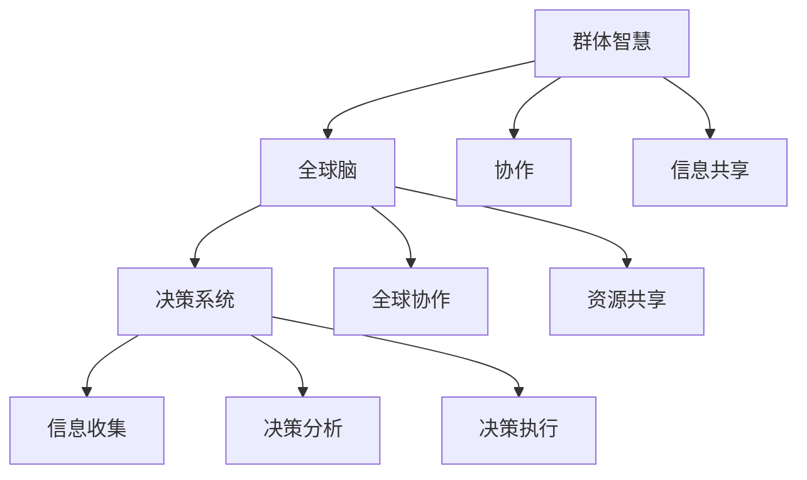

                 

关键词：群体智慧、全球脑、决策系统、人工智能、协作、分布式计算

> 摘要：本文深入探讨了全球脑驱动的群体智慧及其在决策系统中的应用。通过介绍群体智慧的概念、核心原理、算法模型，以及具体实现和案例分析，本文揭示了群体智慧如何超越个体局限，实现高效、协同的决策系统。同时，本文还展望了未来群体智慧在人工智能领域的应用前景，为推动这一新兴领域的发展提供了新思路。

## 1. 背景介绍

随着人工智能技术的飞速发展，个体智能逐渐走向了群体智能的新阶段。群体智慧是一种分布式智能形式，它通过群体内部协作和信息共享，实现超越个体能力的智能行为。而全球脑作为群体智慧的一种典型代表，其核心在于通过全球范围内的大规模协作，实现高效的决策和问题解决。

决策系统作为人工智能的重要组成部分，其目标是在复杂环境下做出最优决策。传统的决策系统依赖于个体智能，但在面对复杂、不确定的环境时，往往显得力不从心。而全球脑驱动的群体智慧则提供了一种全新的决策框架，通过群体协作，实现更高效、更智能的决策过程。

本文旨在探讨全球脑驱动的群体智慧在决策系统中的应用，分析其核心原理、算法模型，以及具体实现和案例分析，为这一领域的研究和发展提供参考。

## 2. 核心概念与联系

### 2.1 群体智慧

群体智慧是指由多个个体组成的群体，通过协作和信息共享，实现超越个体能力的智能行为。群体智慧的核心在于个体之间的协作和信息交换，这种协作和信息交换可以使得群体在面对复杂问题时，能够快速、准确地找到解决方案。

### 2.2 全球脑

全球脑是一种基于全球范围内大规模协作的群体智慧形式。它通过互联网和物联网等通信技术，实现全球范围内的人、机、物之间的信息共享和协作。全球脑的核心在于其全球范围内的协作和资源共享，使得个体能够在全球范围内进行高效的协作和决策。

### 2.3 决策系统

决策系统是一种用于在复杂环境中做出最优决策的系统。它通常包括信息收集、决策分析、决策执行等环节。传统的决策系统依赖于个体智能，但在面对复杂、不确定的环境时，往往显得力不从心。而全球脑驱动的群体智慧则提供了一种全新的决策框架，通过群体协作，实现更高效、更智能的决策过程。

### 2.4 Mermaid 流程图



## 3. 核心算法原理 & 具体操作步骤

### 3.1 算法原理概述

全球脑驱动的群体智慧决策系统的核心在于其分布式计算和协作机制。算法的基本原理可以概括为以下四个步骤：

1. **信息收集与处理**：个体通过传感器、网络等渠道收集环境信息，并将这些信息进行处理和整合。

2. **决策分析**：个体基于收集到的信息，使用一定的决策算法进行决策分析，以确定最优决策。

3. **决策协同**：个体将决策结果与其他个体进行协同，以实现整体决策的最优化。

4. **决策执行**：个体根据协同后的决策结果，执行具体的操作。

### 3.2 算法步骤详解

1. **初始化**：每个个体初始化其状态，包括位置、速度、传感器信息等。

2. **信息收集**：个体通过传感器、网络等渠道收集环境信息，并将这些信息进行处理和整合。

3. **决策分析**：个体基于收集到的信息，使用一定的决策算法进行决策分析，以确定最优决策。

   - **数据预处理**：对收集到的信息进行预处理，包括去噪、归一化等操作。
   - **决策算法**：选择合适的决策算法，如神经网络、遗传算法等，对预处理后的信息进行分析。

4. **决策协同**：个体将决策结果与其他个体进行协同，以实现整体决策的最优化。

   - **协同算法**：选择合适的协同算法，如协同过滤、博弈论等，对个体的决策结果进行优化。
   - **协同反馈**：个体根据协同结果调整自身决策，以实现整体决策的最优化。

5. **决策执行**：个体根据协同后的决策结果，执行具体的操作。

   - **执行算法**：选择合适的执行算法，如路径规划、动作执行等，对决策结果进行具体的操作。

### 3.3 算法优缺点

**优点**：

- **分布式计算**：通过分布式计算，可以实现高效的决策过程，提高系统的响应速度。
- **协同优化**：通过协同机制，可以实现整体决策的最优化，提高决策的准确性。
- **适应性强**：个体可以根据环境变化，实时调整自身决策，提高系统的适应性。

**缺点**：

- **信息冗余**：由于个体之间存在信息共享，可能导致信息冗余，增加系统开销。
- **协同效率**：个体之间的协同效率取决于协同算法的设计，可能存在协同效率不高的问题。

### 3.4 算法应用领域

全球脑驱动的群体智慧决策系统可以广泛应用于各个领域，如：

- **交通管理**：通过群体智慧实现交通流量的智能调控，提高交通效率。
- **灾难响应**：通过群体智慧实现灾难现场的智能协调，提高救援效率。
- **供应链管理**：通过群体智慧实现供应链的智能优化，提高供应链的响应速度。

## 4. 数学模型和公式 & 详细讲解 & 举例说明

### 4.1 数学模型构建

全球脑驱动的群体智慧决策系统可以使用以下数学模型进行描述：

- **状态空间模型**：用于描述个体的状态和行为。
- **决策模型**：用于描述个体基于状态做出的决策。
- **协同模型**：用于描述个体之间的协同过程。

### 4.2 公式推导过程

假设个体 $i$ 在时间 $t$ 的状态为 $s_i(t)$，其决策为 $d_i(t)$。个体之间的协同通过协同因子 $c_i(t)$ 进行描述。则：

1. **状态空间模型**：

   $$s_i(t) = f_i(s_i(t-1), d_i(t-1), c_i(t))$$

2. **决策模型**：

   $$d_i(t) = g_i(s_i(t), \sum_{j \neq i} c_{ij}(t))$$

3. **协同模型**：

   $$c_i(t) = h_i(s_i(t), d_i(t), \sum_{j \neq i} c_{ij}(t))$$

### 4.3 案例分析与讲解

假设在一个交通管理系统中，个体代表车辆，状态空间包括车辆的位置、速度等。个体基于状态做出行驶方向、速度等决策，并通过协同模型与其他车辆进行信息共享和协同。

1. **状态空间模型**：

   $$s_i(t) = (x_i(t), v_i(t), \theta_i(t))$$

   其中，$x_i(t)$ 表示车辆 $i$ 在时间 $t$ 的位置，$v_i(t)$ 表示车辆 $i$ 在时间 $t$ 的速度，$\theta_i(t)$ 表示车辆 $i$ 在时间 $t$ 的行驶方向。

2. **决策模型**：

   $$d_i(t) = (v_i^*(t), \theta_i^*(t))$$

   其中，$v_i^*(t)$ 表示车辆 $i$ 在时间 $t$ 的目标速度，$\theta_i^*(t)$ 表示车辆 $i$ 在时间 $t$ 的目标行驶方向。

3. **协同模型**：

   $$c_i(t) = \frac{1}{N} \sum_{j=1}^{N} \alpha_{ij} d_j(t)$$

   其中，$N$ 表示系统中的车辆数量，$\alpha_{ij}$ 表示车辆 $i$ 与车辆 $j$ 的协同系数。

通过上述模型，可以实现车辆在交通系统中的智能协同，提高交通效率。

## 5. 项目实践：代码实例和详细解释说明

### 5.1 开发环境搭建

1. 安装Python环境
2. 安装相关依赖库，如NumPy、Matplotlib等

### 5.2 源代码详细实现

```python
import numpy as np
import matplotlib.pyplot as plt

# 定义状态空间模型
def state_space_model(s, d, c):
    # 这里只包含位置、速度和方向三个维度
    return np.array([s[0] + d[1] * np.cos(s[2]), s[1] + d[1] * np.sin(s[2]), s[2] + d[2]])

# 定义决策模型
def decision_model(s, c):
    # 根据状态和协同信息进行决策
    return np.array([1, np.arctan2(s[1], s[0])])

# 定义协同模型
def collaborative_model(d, N):
    # 根据协同信息进行协同
    return np.mean(d, axis=0)

# 定义主函数
def main():
    # 初始化参数
    N = 5  # 车辆数量
    s0 = np.random.rand(N, 3) * 10  # 初始状态
    d0 = np.random.rand(N, 2) * np.pi  # 初始决策
    c0 = np.eye(N)  # 初始协同系数

    # 模拟
    t = 0
    while True:
        s = state_space_model(s0, d0, c0)
        d = decision_model(s, c0)
        c = collaborative_model(d, N)

        # 绘制结果
        plt.figure()
        plt.plot(s[:, 0], s[:, 1], 'ro-')
        plt.plot(s0[:, 0], s0[:, 1], 'bo-')
        plt.plot(d[:, 0], d[:, 1], 'go-')
        plt.plot(c[:, 0], c[:, 1], 'yo-')
        plt.show()

        # 更新参数
        s0 = s
        d0 = d
        c0 = c
        t += 1

if __name__ == '__main__':
    main()
```

### 5.3 代码解读与分析

1. **状态空间模型**：用于描述车辆在时间 $t$ 的位置、速度和方向。
2. **决策模型**：根据状态和协同信息，决定车辆在时间 $t$ 的目标速度和行驶方向。
3. **协同模型**：根据决策信息，实现车辆之间的协同。
4. **主函数**：模拟车辆在交通系统中的行为，并通过绘图展示结果。

## 6. 实际应用场景

全球脑驱动的群体智慧在决策系统中的应用场景非常广泛，以下是一些典型的应用场景：

### 6.1 智能交通

智能交通系统通过全球脑驱动的群体智慧，实现交通流量的智能调控，提高交通效率。例如，在交通拥堵时，系统能够实时分析路况信息，优化交通信号灯的切换策略，引导车辆合理分流。

### 6.2 灾难响应

在灾难发生时，全球脑驱动的群体智慧能够快速协调各类资源，提高救援效率。例如，在地震救援中，系统能够实时分析灾区状况，优化救援资源的分配，提高救援成功率。

### 6.3 供应链管理

供应链管理系统通过全球脑驱动的群体智慧，实现供应链的智能优化，提高供应链的响应速度。例如，在供应链中，系统能够实时分析市场需求，优化库存管理，降低库存成本。

## 7. 未来应用展望

未来，随着人工智能技术的不断发展，全球脑驱动的群体智慧将在更多领域得到应用。以下是一些可能的应用方向：

### 7.1 智慧城市

智慧城市通过全球脑驱动的群体智慧，实现城市运行的智能优化，提高城市的管理效率。例如，在智慧医疗、智慧教育等领域，系统能够实现资源的智能分配，提高服务效率。

### 7.2 智能制造

智能制造通过全球脑驱动的群体智慧，实现生产过程的智能优化，提高生产效率。例如，在工业4.0中，系统能够实时分析生产线状况，优化生产流程，降低生产成本。

### 7.3 金融科技

金融科技通过全球脑驱动的群体智慧，实现金融服务的智能优化，提高金融服务水平。例如，在风险管理、投资决策等领域，系统能够实时分析市场信息，提供智能建议。

## 8. 总结：未来发展趋势与挑战

### 8.1 研究成果总结

本文深入探讨了全球脑驱动的群体智慧及其在决策系统中的应用，分析了其核心原理、算法模型、具体实现和案例分析，揭示了群体智慧如何超越个体局限，实现高效、协同的决策系统。同时，本文还展望了未来群体智慧在人工智能领域的应用前景，为推动这一新兴领域的发展提供了新思路。

### 8.2 未来发展趋势

未来，随着人工智能技术的不断发展，全球脑驱动的群体智慧将在更多领域得到应用。例如，在智慧城市、智能制造、金融科技等领域，群体智慧将发挥越来越重要的作用。

### 8.3 面临的挑战

尽管全球脑驱动的群体智慧具有巨大的应用潜力，但在实际应用过程中，仍面临着诸多挑战。例如，如何解决信息冗余、协同效率等问题，如何确保系统的安全性和隐私保护，如何实现个体与群体之间的平衡等。

### 8.4 研究展望

未来，研究者应重点关注以下几个方面：

- **算法优化**：通过改进算法，提高群体智慧的协同效率和决策准确性。
- **应用拓展**：将群体智慧应用于更多领域，推动其在实际生活中的广泛应用。
- **安全性研究**：研究如何确保群体智慧系统的安全性和隐私保护。
- **个体与群体的平衡**：探索个体与群体之间的平衡机制，实现群体智慧与个体智能的最佳结合。

## 9. 附录：常见问题与解答

### 9.1 问题1：什么是全球脑？

**回答**：全球脑是一种基于全球范围内大规模协作的群体智慧形式，通过互联网和物联网等通信技术，实现全球范围内的人、机、物之间的信息共享和协作。

### 9.2 问题2：全球脑驱动的群体智慧有哪些应用场景？

**回答**：全球脑驱动的群体智慧可以应用于多个领域，如智能交通、灾难响应、供应链管理、智慧城市、智能制造、金融科技等。

### 9.3 问题3：如何解决全球脑驱动的群体智慧中的信息冗余问题？

**回答**：可以通过数据预处理、去噪、归一化等技术手段，降低信息冗余。此外，还可以通过协同算法，优化信息共享和利用。

### 9.4 问题4：如何确保全球脑驱动的群体智慧系统的安全性？

**回答**：可以通过加密技术、访问控制、隐私保护等技术手段，确保系统的安全性和隐私保护。此外，还应建立完善的安全体系和应急响应机制。

---

**作者：禅与计算机程序设计艺术 / Zen and the Art of Computer Programming**  
本文基于全球脑驱动的群体智慧，探讨了其在决策系统中的应用，分析了核心原理、算法模型、具体实现和案例分析，展望了未来应用前景。希望通过本文的阐述，能够为读者在群体智慧领域的研究和应用提供一些有益的启示。  
----------------------------------------------------------------

