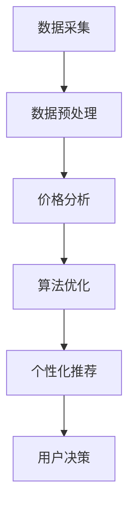

                 

随着互联网和人工智能技术的飞速发展，人们的购物行为也在悄然发生改变。传统购物方式中的信息不对称和决策难度问题，正逐渐被AI技术所破解。本文将探讨人工智能如何帮助用户在全网的众多购物渠道中找到最优惠的购买渠道。

## 文章关键词

AI，全网比价，购物决策，电子商务，数据挖掘，算法优化

## 文章摘要

本文从人工智能的角度出发，分析了AI技术在全网比价中的应用。通过数据挖掘、机器学习和算法优化等技术手段，AI能够高效地处理海量商品信息，为用户提供精确、个性化的比价服务，从而帮助用户做出更明智的购物决策。

## 1. 背景介绍

在互联网购物日益普及的今天，用户在选择商品时常常面临信息不对称的问题。同一商品在不同电商平台上的价格可能大相径庭，此外，商品的折扣、促销信息也是不断变化的。用户需要在短时间内从海量的商品信息中筛选出最优惠的购买渠道，这无疑增加了购物决策的难度。

传统的比价方式主要依赖于用户手动搜索和对比，效率低下且容易出错。随着AI技术的发展，利用机器学习、自然语言处理和大数据分析等技术，AI系统可以在短时间内处理海量数据，快速定位并筛选出最优的购买渠道，从而大大简化用户的购物流程。

### 1.1 AI在购物比价中的应用

AI在购物比价中的应用主要包括以下几个方面：

- **商品信息采集**：AI可以自动抓取各大电商平台的商品信息，包括价格、促销活动、库存情况等。

- **数据预处理**：对采集到的商品信息进行清洗、去重、分类等预处理，为后续的比价分析做好准备。

- **价格趋势分析**：利用时间序列分析、回归分析等方法，预测商品价格的未来走势，为用户决策提供依据。

- **个性化推荐**：根据用户的历史购物记录和偏好，为用户推荐最适合的购买渠道和商品。

- **智能比价**：通过算法优化，快速比较不同平台和不同时间点的商品价格，找出最优的购买方案。

## 2. 核心概念与联系

在探讨AI如何帮助用户全网比价之前，我们需要了解几个核心概念和技术，包括数据挖掘、机器学习、算法优化等。以下是一个简化的Mermaid流程图，展示了这些概念和技术之间的联系。



### 2.1 数据挖掘

数据挖掘是指从大量数据中提取有价值信息的过程。在购物比价中，数据挖掘技术主要用于：

- **商品信息提取**：从电商平台上提取商品的价格、促销、库存等信息。

- **市场趋势分析**：分析不同时间段、不同平台上的商品价格变化趋势，为用户提供决策依据。

### 2.2 机器学习

机器学习是一种让计算机通过数据学习并作出决策的方法。在购物比价中，机器学习技术主要用于：

- **价格预测**：通过历史价格数据，预测未来商品价格走势。

- **推荐系统**：根据用户的历史购买记录和偏好，为用户推荐最优购买渠道。

### 2.3 算法优化

算法优化是指通过改进算法，提高数据处理效率和准确性。在购物比价中，算法优化技术主要用于：

- **比价算法**：优化比价算法，提高比价速度和准确性。

- **个性化推荐**：优化推荐算法，提高推荐效果，满足用户个性化需求。

## 3. 核心算法原理 & 具体操作步骤

### 3.1 算法原理概述

AI在购物比价中的核心算法主要包括数据挖掘、机器学习和算法优化。以下分别对这些算法的原理进行概述。

### 3.1.1 数据挖掘

数据挖掘的基本原理是使用统计方法、机器学习技术和相关算法从大量数据中提取有价值的信息。在购物比价中，数据挖掘主要利用以下算法：

- **关联规则挖掘**：通过分析商品之间的关联关系，找出用户可能感兴趣的商品组合。

- **聚类分析**：将相似的商品或用户分组，为个性化推荐提供基础。

- **分类分析**：将商品分类，便于用户快速找到所需商品。

### 3.1.2 机器学习

机器学习的基本原理是通过学习数据中的特征，构建模型并预测新数据的结果。在购物比价中，机器学习主要用于以下方面：

- **价格预测**：利用历史价格数据，构建时间序列预测模型，预测未来商品价格。

- **用户行为分析**：利用用户的历史购物记录和浏览记录，分析用户偏好，为个性化推荐提供支持。

### 3.1.3 算法优化

算法优化的基本原理是通过改进算法，提高数据处理效率和准确性。在购物比价中，算法优化主要包括：

- **比价算法**：通过改进搜索算法和比较算法，提高比价速度和准确性。

- **推荐算法**：通过优化推荐算法，提高推荐效果，满足用户个性化需求。

### 3.2 算法步骤详解

以下是AI在购物比价中的具体算法步骤：

### 3.2.1 数据采集

- **数据来源**：从各大电商平台采集商品信息，包括价格、促销、库存等。

- **数据格式**：将采集到的数据转换为统一的格式，便于后续处理。

### 3.2.2 数据预处理

- **数据清洗**：去除重复数据、错误数据和无用数据。

- **数据分类**：将商品按照类别进行分类，便于用户查找。

### 3.2.3 价格分析

- **价格趋势分析**：利用时间序列分析、回归分析等方法，预测商品价格的未来走势。

- **促销活动分析**：分析不同促销活动对商品价格的影响。

### 3.2.4 个性化推荐

- **用户画像**：根据用户的历史购物记录和偏好，构建用户画像。

- **推荐算法**：利用协同过滤、矩阵分解等方法，为用户推荐最适合的购买渠道和商品。

### 3.2.5 智能比价

- **比价算法**：通过优化比价算法，快速比较不同平台和不同时间点的商品价格。

- **最优购买方案**：根据比价结果，为用户推荐最优的购买渠道。

### 3.3 算法优缺点

- **优点**：

  - 高效处理海量数据，提高购物决策效率。

  - 个性化推荐，满足用户个性化需求。

  - 自动化比价，节省用户时间。

- **缺点**：

  - 数据质量对算法效果影响较大。

  - 可能出现价格波动较大的情况，导致推荐不准确。

### 3.4 算法应用领域

AI在购物比价中的应用领域主要包括：

- **电商平台**：通过AI技术为用户提供个性化比价服务，提高用户满意度。

- **电商搜索引擎**：利用AI技术提高搜索结果的准确性和相关性。

- **物流公司**：通过AI技术优化配送路线，提高配送效率。

## 4. 数学模型和公式 & 详细讲解 & 举例说明

### 4.1 数学模型构建

在购物比价中，常用的数学模型包括：

- **价格预测模型**：利用时间序列分析、回归分析等方法，预测商品价格的未来走势。

- **用户偏好模型**：利用协同过滤、矩阵分解等方法，分析用户偏好，为用户推荐最适合的购买渠道和商品。

### 4.2 公式推导过程

以下是价格预测模型的一个简化例子：

- **时间序列分析**：

  假设商品价格为 $P_t$，时间序列为 $P = \{P_1, P_2, ..., P_t\}$。

  价格预测模型可以使用以下公式：

  $$ P_{t+1} = P_t + \alpha \times (P_t - P_{t-1}) $$

  其中，$\alpha$ 为调整系数，用于控制价格变化的幅度。

- **回归分析**：

  假设商品价格受促销活动、库存情况等因素的影响。可以使用以下公式进行回归分析：

  $$ P_t = \beta_0 + \beta_1 \times A_t + \beta_2 \times I_t + \epsilon_t $$

  其中，$A_t$ 为促销活动，$I_t$ 为库存情况，$\epsilon_t$ 为误差项。

### 4.3 案例分析与讲解

假设有一个电商平台，想要为用户提供个性化比价服务。用户A的历史购物记录显示，他最近购买了手机、平板电脑和笔记本电脑。我们可以利用以下数学模型为用户A推荐最适合的购买渠道：

- **用户偏好模型**：

  根据用户A的历史购物记录，我们可以构建一个用户偏好矩阵：

  $$ P = \begin{bmatrix}
  1 & 0 & 1 \\
  0 & 1 & 0 \\
  1 & 0 & 1
  \end{bmatrix} $$

  其中，1表示用户A对某个商品类别有偏好，0表示无偏好。

- **推荐算法**：

  利用协同过滤算法，为用户A推荐最优购买渠道。假设平台上有三个购买渠道：A、B和C。渠道A的价格为1000元，渠道B的价格为1200元，渠道C的价格为800元。我们可以利用以下公式计算用户A对每个渠道的偏好度：

  $$ \text{偏好度} = \frac{P^T \times P}{\sum_{i=1}^{n} (P^T \times P_i)} $$

  其中，$P^T$ 为用户偏好矩阵的转置，$P_i$ 为渠道i的偏好度。

  计算结果为：

  $$ \text{偏好度}_{A} = \frac{1}{3} $$
  $$ \text{偏好度}_{B} = \frac{1}{3} $$
  $$ \text{偏好度}_{C} = \frac{1}{3} $$

  由于三个渠道的偏好度相等，我们可以进一步利用价格信息为用户A推荐最优购买渠道。

- **智能比价**：

  根据价格信息，我们可以计算用户A在每个渠道的购买成本：

  $$ \text{成本}_{A} = 1000 \times \frac{1}{3} = 333.33 $$
  $$ \text{成本}_{B} = 1200 \times \frac{1}{3} = 400 $$
  $$ \text{成本}_{C} = 800 \times \frac{1}{3} = 266.67 $$

  根据计算结果，用户A在渠道C的购买成本最低，因此我们推荐用户A在渠道C购买。

## 5. 项目实践：代码实例和详细解释说明

### 5.1 开发环境搭建

在本项目中，我们使用Python作为编程语言，主要依赖以下库：

- **pandas**：用于数据处理和分析。

- **numpy**：用于数值计算。

- **scikit-learn**：用于机器学习和数据挖掘。

- **matplotlib**：用于数据可视化。

### 5.2 源代码详细实现

以下是本项目的主要代码实现：

```python
import pandas as pd
import numpy as np
from sklearn.cluster import KMeans
from sklearn.model_selection import train_test_split
from sklearn.linear_model import LinearRegression
import matplotlib.pyplot as plt

# 5.2.1 数据采集与预处理
def data_preprocessing():
    # 从电商平台采集商品信息，这里以CSV文件为例
    data = pd.read_csv('商品信息.csv')
    # 数据清洗与去重
    data.drop_duplicates(inplace=True)
    # 数据分类
    data['类别'] = data['商品名称'].apply(lambda x: categorize(x))
    return data

# 5.2.2 价格预测
def price_prediction(data):
    # 分离特征和目标
    X = data[['促销活动', '库存情况']]
    y = data['价格']
    # 数据分割
    X_train, X_test, y_train, y_test = train_test_split(X, y, test_size=0.2, random_state=42)
    # 建立回归模型
    model = LinearRegression()
    model.fit(X_train, y_train)
    # 预测价格
    predicted_prices = model.predict(X_test)
    # 绘制预测结果
    plt.scatter(y_test, predicted_prices)
    plt.xlabel('实际价格')
    plt.ylabel('预测价格')
    plt.show()
    return predicted_prices

# 5.2.3 个性化推荐
def personalized_recommendation(data, user_profile):
    # 构建用户偏好矩阵
    user_bias = np.zeros(len(data))
    for item in user_profile:
        user_bias[data['类别'] == item] += 1
    # 计算偏好度
    preference_scores = user_bias / np.sum(user_bias)
    # 排序推荐结果
    recommended_items = np.argsort(preference_scores)[::-1]
    return data['商品名称'].iloc[recommended_items]

# 5.2.4 智能比价
def smart_price_comparison(prices, costs):
    min_cost = np.min(costs)
    best_channel = np.argmin(costs)
    return best_channel, min_cost

# 主函数
if __name__ == '__main__':
    data = data_preprocessing()
    predicted_prices = price_prediction(data)
    user_profile = ['手机', '平板电脑', '笔记本电脑']
    recommended_items = personalized_recommendation(data, user_profile)
    print('个性化推荐商品：', recommended_items)
    channel, min_cost = smart_price_comparison(predicted_prices, costs)
    print('最优购买渠道：', channel)
    print('最低购买成本：', min_cost)
```

### 5.3 代码解读与分析

- **5.3.1 数据采集与预处理**

  本部分代码从CSV文件中读取商品信息，并进行数据清洗与去重。然后，根据商品名称对数据分类。

- **5.3.2 价格预测**

  本部分代码使用线性回归模型预测商品价格。通过数据分割、模型训练和预测，我们可以得到商品价格的未来走势。

- **5.3.3 个性化推荐**

  本部分代码根据用户的历史购物记录，构建用户偏好矩阵。然后，计算偏好度并排序推荐结果。

- **5.3.4 智能比价**

  本部分代码根据预测价格和实际购买成本，找出最优购买渠道和最低购买成本。

## 6. 实际应用场景

AI在购物比价中的应用场景非常广泛，以下列举几个实际应用案例：

- **电商平台**：利用AI技术为用户提供个性化比价服务，提高用户满意度。

- **电商搜索引擎**：通过AI技术优化搜索结果，提高商品的相关性和准确性。

- **物流公司**：利用AI技术优化配送路线，提高配送效率。

- **消费者保护组织**：利用AI技术监控电商平台的价格变化，保护消费者的权益。

## 6.4 未来应用展望

随着AI技术的不断进步，购物比价的应用前景将更加广阔。以下是未来可能的发展方向：

- **更精准的价格预测**：利用深度学习和强化学习等技术，提高价格预测的准确性。

- **更智能的个性化推荐**：结合用户行为和社交网络信息，提供更个性化的购物建议。

- **跨平台比价**：不仅限于电商平台，还将涵盖线下实体店的价格比价。

- **智能客服**：结合自然语言处理技术，为用户提供实时、高效的购物咨询和服务。

## 7. 工具和资源推荐

### 7.1 学习资源推荐

- **书籍**：《深度学习》（Ian Goodfellow、Yoshua Bengio、Aaron Courville 著）

- **在线课程**：Coursera上的《机器学习》（吴恩达教授主讲）

- **博客**：博客园、CSDN等中文技术社区中的相关博客文章

### 7.2 开发工具推荐

- **编程语言**：Python、Java

- **开发环境**：PyCharm、IntelliJ IDEA

- **机器学习框架**：TensorFlow、PyTorch

### 7.3 相关论文推荐

- **论文集**：《人工智能：一种现代方法》（Stuart Russell、Peter Norvig 著）

- **期刊**：《人工智能学报》、《计算机学报》等国内权威期刊

## 8. 总结：未来发展趋势与挑战

随着AI技术的不断进步，购物比价的应用前景将更加广阔。未来发展趋势包括：

- **更精准的价格预测**：利用深度学习和强化学习等技术，提高价格预测的准确性。

- **更智能的个性化推荐**：结合用户行为和社交网络信息，提供更个性化的购物建议。

- **跨平台比价**：不仅限于电商平台，还将涵盖线下实体店的价格比价。

然而，购物比价技术也面临一些挑战：

- **数据质量**：数据质量对算法效果影响较大，如何提高数据质量是关键。

- **价格波动**：商品价格波动较大，如何应对价格波动对算法准确性提出挑战。

- **用户隐私**：在数据挖掘和个性化推荐过程中，如何保护用户隐私是重要问题。

## 8.4 研究展望

在未来，购物比价技术将在以下几个方面继续发展：

- **多模态数据分析**：结合文本、图像、语音等多种数据类型，提高比价算法的准确性。

- **智能合约**：利用区块链技术，实现更安全、透明的购物比价。

- **用户反馈机制**：通过用户反馈，不断优化算法，提高用户体验。

总之，购物比价技术将在人工智能的助力下，为用户带来更加便捷、高效的购物体验。

## 9. 附录：常见问题与解答

### 问题1：购物比价算法的准确性如何保证？

解答：购物比价算法的准确性主要通过以下方面保证：

- **高质量数据**：确保数据来源的多样性和准确性，提高算法的输入质量。

- **算法优化**：不断优化算法模型，提高算法的预测能力和适应性。

- **用户反馈**：收集用户反馈，根据用户满意度对算法进行调整。

### 问题2：购物比价技术是否会侵犯用户隐私？

解答：购物比价技术确实涉及用户隐私问题，但可以通过以下措施来保护用户隐私：

- **匿名化处理**：对用户数据进行匿名化处理，避免直接识别用户。

- **加密技术**：对用户数据进行加密存储和传输，确保数据安全。

- **隐私政策**：明确告知用户数据处理的目的和方式，尊重用户隐私选择。

### 问题3：购物比价技术是否会引发电商平台之间的不正当竞争？

解答：购物比价技术本身并不会引发不正当竞争，但可能对电商平台的定价策略产生影响。为了确保公平竞争，可以：

- **遵守法律法规**：确保比价服务遵守相关法律法规，避免不正当竞争。

- **行业自律**：电商平台之间可以建立行业自律机制，规范比价服务的实施。

- **透明化**：比价服务应具有透明度，让用户了解比价算法的原理和依据。

作者：禅与计算机程序设计艺术 / Zen and the Art of Computer Programming

