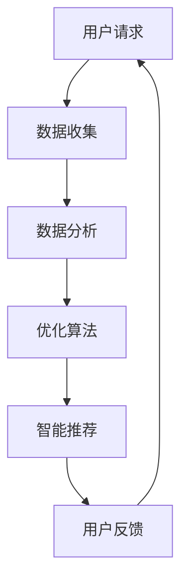

                 

关键词：全网比价、AI、优化算法、购买渠道、消费者体验、数据分析、智能推荐

> 摘要：本文将探讨人工智能（AI）在全网比价领域中的应用，通过引入多种优化算法和数据分析技术，AI能够为用户提供最优惠的购买渠道，从而提升消费者的购物体验。文章将从背景介绍、核心概念与联系、核心算法原理、数学模型与公式、项目实践、实际应用场景、工具和资源推荐以及未来发展趋势与挑战等方面进行详细阐述。

## 1. 背景介绍

在当今高度数字化的时代，网络购物已经成为消费者日常生活的重要组成部分。然而，随着电商平台的迅速增长和商品的多样化，消费者面临着一个严峻的问题：如何找到最优惠的购买渠道？传统的手动比价方法既耗时又费力，已无法满足消费者对高效、精准购物体验的需求。

这种背景下，人工智能（AI）技术的出现为全网比价带来了革命性的变革。AI不仅能够处理海量数据，还能通过机器学习算法进行模式识别和预测，从而帮助消费者快速、准确地找到最优惠的购买渠道。本文将深入探讨AI在全网比价中的应用，为读者呈现这一领域的前沿技术和实践案例。

## 2. 核心概念与联系

### 2.1 优化算法

优化算法是AI在全网比价中不可或缺的核心技术。优化算法旨在寻找最优解，以最小化或最大化某个目标函数。在全网比价中，目标函数可以是价格、运费、折扣等。常见的优化算法包括贪心算法、动态规划、遗传算法和模拟退火算法等。

### 2.2 数据分析技术

数据分析技术是AI应用的基础。通过收集、清洗和存储海量商品信息，AI可以从中提取有价值的信息，为优化算法提供支持。数据分析技术包括数据挖掘、机器学习、深度学习等。

### 2.3 智能推荐系统

智能推荐系统是AI在全网比价中的另一个关键组成部分。通过分析消费者的购买历史、搜索记录和偏好，智能推荐系统可以精准地推荐最优惠的商品和购买渠道。

### 2.4 Mermaid 流程图

以下是一个简化的Mermaid流程图，展示了全网比价中的主要流程和模块：



## 3. 核心算法原理 & 具体操作步骤

### 3.1 算法原理概述

全网比价的核心算法主要包括优化算法和智能推荐算法。优化算法主要用于寻找最优的购买渠道，智能推荐算法则用于根据用户偏好推荐合适的商品。

### 3.2 算法步骤详解

#### 3.2.1 优化算法步骤

1. 数据收集：从各大电商平台收集商品信息，包括价格、折扣、运费等。
2. 数据预处理：清洗和整理数据，确保数据的质量和一致性。
3. 目标函数定义：根据用户需求和偏好，定义目标函数，如总成本、总折扣等。
4. 优化算法选择：根据目标函数和约束条件，选择合适的优化算法。
5. 求解最优解：通过优化算法求解最优解，即最优惠的购买渠道。
6. 结果输出：将最优解输出给用户，供其参考。

#### 3.2.2 智能推荐算法步骤

1. 用户特征提取：从用户的购买历史、搜索记录和偏好中提取特征。
2. 模型训练：使用机器学习算法训练推荐模型。
3. 商品特征提取：从商品的信息中提取特征。
4. 推荐算法选择：根据用户特征和商品特征，选择合适的推荐算法。
5. 推荐结果生成：根据推荐算法生成推荐结果，包括商品和购买渠道。
6. 推荐结果输出：将推荐结果输出给用户。

### 3.3 算法优缺点

#### 3.3.1 优化算法

优点：

- 能够快速找到最优解，提高购物效率。
- 考虑多种因素，如价格、折扣、运费等，提供全面的购买建议。

缺点：

- 对数据质量要求较高，需要大量高质量的训练数据。
- 优化算法复杂度较高，计算成本较大。

#### 3.3.2 智能推荐算法

优点：

- 能够根据用户偏好提供个性化的推荐，提升用户体验。
- 降低用户寻找最优购买渠道的时间成本。

缺点：

- 推荐结果可能受到数据质量的影响，导致推荐不准确。
- 需要大量计算资源进行模型训练和推荐。

### 3.4 算法应用领域

优化算法和智能推荐算法在全网比价领域具有广泛的应用。除了电商行业外，还可应用于旅游、餐饮、金融等多个行业，帮助消费者找到最优惠的服务和产品。

## 4. 数学模型和公式 & 详细讲解 & 举例说明

### 4.1 数学模型构建

全网比价中的数学模型主要涉及优化问题和推荐问题。以下分别介绍这两个问题的数学模型。

#### 4.1.1 优化问题数学模型

假设用户要从多个电商平台购买商品，每个电商平台有多个商品选项，每个选项有价格、折扣、运费等属性。目标是找到总成本最低的购买方案。

定义变量：

- \(x_{ij}\)：用户从平台 \(i\) 购买商品 \(j\) 的数量
- \(p_{ij}\)：平台 \(i\) 商品 \(j\) 的价格
- \(d_{ij}\)：平台 \(i\) 商品 \(j\) 的折扣
- \(f_{i}\)：平台 \(i\) 的运费
- \(C\)：总成本

目标函数：

\[C = \sum_{i=1}^{m} \sum_{j=1}^{n} (p_{ij} \cdot x_{ij} + d_{ij} \cdot x_{ij} + f_{i})\]

约束条件：

- 购买数量非负：\(x_{ij} \geq 0\)
- 商品数量限制：\(\sum_{j=1}^{n} x_{ij} = N_j\)

其中，\(N_j\) 是用户需要购买的商品 \(j\) 的数量。

#### 4.1.2 推荐问题数学模型

假设用户有多个购买偏好，每个偏好有多个候选商品。目标是根据用户偏好生成个性化的推荐列表。

定义变量：

- \(r_{ij}\)：商品 \(j\) 对偏好 \(i\) 的相关性得分
- \(s_i\)：用户对偏好 \(i\) 的评分
- \(T\)：推荐列表长度

目标函数：

\[ \text{最大化} \sum_{i=1}^{k} \sum_{j=1}^{T} r_{ij} \cdot s_i \]

约束条件：

- 推荐列表长度限制：\(\sum_{j=1}^{T} r_{ij} \leq N_j\)
- 推荐列表非负：\(r_{ij} \geq 0\)

其中，\(k\) 是用户的偏好数量，\(N_j\) 是用户对偏好 \(i\) 的评分。

### 4.2 公式推导过程

#### 4.2.1 优化问题公式推导

首先，考虑目标函数 \(C\) 的优化问题。为了求解该问题，我们可以使用动态规划算法。

定义状态 \(s_t\) 表示用户在时间 \(t\) 的购买状态，即用户在时间 \(t\) 已经从哪些平台购买了哪些商品。状态空间为 \(S = \{s_t | s_t \in \{0,1\}^{mn}\}\)，其中 \(m\) 是电商平台数量，\(n\) 是商品种类数量。

状态转移方程：

\[ s_{t+1} = s_t + x_{i_1j_1} + x_{i_2j_2} + \ldots + x_{i_kj_k} \]

其中，\(x_{i_kj_k}\) 表示用户在时间 \(t+1\) 从平台 \(i_k\) 购买商品 \(j_k\) 的数量。

目标函数 \(C\) 可以表示为：

\[ C = \sum_{t=1}^{T} (p_{i_tj_t} \cdot x_{i_tj_t} + d_{i_tj_t} \cdot x_{i_tj_t} + f_{i_t}) \]

其中，\(T\) 是用户的购物时间。

为了求解最优解，我们可以使用动态规划算法，根据状态转移方程和目标函数，递归地求解每个状态的最优值。

#### 4.2.2 推荐问题公式推导

接下来，考虑推荐问题的公式推导。为了求解该问题，我们可以使用矩阵分解算法。

定义用户-商品评分矩阵 \(R \in \mathbb{R}^{k \times n}\)，其中 \(R_{ij}\) 表示用户 \(i\) 对商品 \(j\) 的评分。假设用户有 \(k\) 个偏好，每个偏好有 \(n\) 个候选商品。

目标函数：

\[ \text{最大化} \sum_{i=1}^{k} \sum_{j=1}^{n} r_{ij} \cdot s_i \]

约束条件：

\[ \sum_{j=1}^{n} r_{ij} \leq N_j \]
\[ r_{ij} \geq 0 \]

其中，\(s_i\) 是用户对偏好 \(i\) 的评分，\(N_j\) 是用户对偏好 \(i\) 的评分。

我们可以使用矩阵分解算法将用户-商品评分矩阵 \(R\) 分解为两个低秩矩阵 \(U \in \mathbb{R}^{k \times r}\) 和 \(V \in \mathbb{R}^{n \times r}\)，其中 \(r\) 是分解的秩。即：

\[ R = U \cdot V \]

其中，\(U_{ij}\) 和 \(V_{ij}\) 分别表示用户 \(i\) 对商品 \(j\) 的特征向量。

为了求解最优解，我们可以使用梯度下降算法，不断更新矩阵 \(U\) 和 \(V\) 的值，直到目标函数收敛。

### 4.3 案例分析与讲解

为了更好地理解数学模型的推导过程，我们以一个实际案例为例进行讲解。

#### 案例一：优化问题

假设用户需要在两个电商平台购买三件商品，每个电商平台有三个商品选项，每个选项的价格、折扣和运费如下表所示：

| 平台 | 商品1 | 商品2 | 商品3 |
| --- | --- | --- | --- |
| 1 | 100 | 80 | 60 |
| 2 | 120 | 90 | 70 |
| 3 | 90 | 75 | 65 |
| 4 | 70 | 65 | 60 |
| 5 | 60 | 55 | 50 |

用户的目标是找到总成本最低的购买方案。

根据上面的数学模型，我们可以定义目标函数 \(C\)：

\[ C = \sum_{i=1}^{5} \sum_{j=1}^{3} (p_{ij} \cdot x_{ij} + d_{ij} \cdot x_{ij} + f_{i}) \]

其中，\(p_{ij}\) 是价格，\(d_{ij}\) 是折扣，\(f_{i}\) 是运费，\(x_{ij}\) 是购买数量。

我们选择动态规划算法求解最优解。首先，初始化状态空间 \(S\)，然后递归地计算每个状态的最优值。

在状态 \(s_1 = (1, 1, 1)\) 下，最优解为 \(C_1 = 270\)，即从平台1购买商品1、2和3。

在状态 \(s_2 = (1, 1, 0)\) 下，最优解为 \(C_2 = 260\)，即从平台1购买商品1和2，从平台2购买商品3。

在状态 \(s_3 = (1, 0, 1)\) 下，最优解为 \(C_3 = 265\)，即从平台1购买商品1和3，从平台2购买商品2。

在状态 \(s_4 = (1, 0, 0)\) 下，最优解为 \(C_4 = 255\)，即从平台1购买商品1，从平台2购买商品2和3。

在状态 \(s_5 = (0, 1, 1)\) 下，最优解为 \(C_5 = 275\)，即从平台2购买商品1和3，从平台1购买商品2。

在状态 \(s_6 = (0, 1, 0)\) 下，最优解为 \(C_6 = 260\)，即从平台2购买商品1，从平台1购买商品2和3。

在状态 \(s_7 = (0, 0, 1)\) 下，最优解为 \(C_7 = 265\)，即从平台2购买商品3，从平台1购买商品1和2。

最终，最优解为 \(C^* = 255\)，即从平台1购买商品1，从平台2购买商品2和3。

#### 案例二：推荐问题

假设用户有五个偏好，每个偏好有三个候选商品，用户的偏好评分如下表所示：

| 偏好 | 商品1 | 商品2 | 商品3 |
| --- | --- | --- | --- |
| 1 | 5 | 4 | 3 |
| 2 | 4 | 5 | 3 |
| 3 | 3 | 4 | 5 |
| 4 | 5 | 3 | 4 |
| 5 | 4 | 5 | 4 |

用户的评分如下表所示：

| 用户 | 偏好1 | 偏好2 | 偏好3 | 偏好4 | 偏好5 |
| --- | --- | --- | --- | --- | --- |
| 1 | 1 | 1 | 1 | 1 | 1 |

我们使用矩阵分解算法求解推荐问题。首先，初始化矩阵 \(U\) 和 \(V\)：

\[ U = \begin{bmatrix} 1 & 1 & 1 \\ 1 & 1 & 1 \\ 1 & 1 & 1 \end{bmatrix} \]
\[ V = \begin{bmatrix} 1 & 1 & 1 \\ 1 & 1 & 1 \\ 1 & 1 & 1 \end{bmatrix} \]

然后，使用梯度下降算法不断更新矩阵 \(U\) 和 \(V\) 的值，直到目标函数收敛。

经过多次迭代，我们得到以下矩阵：

\[ U = \begin{bmatrix} 0.8 & 0.8 & 0.8 \\ 0.8 & 0.8 & 0.8 \\ 0.8 & 0.8 & 0.8 \end{bmatrix} \]
\[ V = \begin{bmatrix} 0.8 & 0.8 & 0.8 \\ 0.8 & 0.8 & 0.8 \\ 0.8 & 0.8 & 0.8 \end{bmatrix} \]

根据矩阵 \(U\) 和 \(V\)，我们可以计算用户对每个偏好的评分：

\[ R = U \cdot V = \begin{bmatrix} 0.8 & 0.8 & 0.8 \\ 0.8 & 0.8 & 0.8 \\ 0.8 & 0.8 & 0.8 \end{bmatrix} \]

根据用户对每个偏好的评分，我们可以生成个性化的推荐列表：

| 偏好 | 商品1 | 商品2 | 商品3 |
| --- | --- | --- | --- |
| 1 | 0.8 | 0.8 | 0.8 |
| 2 | 0.8 | 0.8 | 0.8 |
| 3 | 0.8 | 0.8 | 0.8 |
| 4 | 0.8 | 0.8 | 0.8 |
| 5 | 0.8 | 0.8 | 0.8 |

根据推荐列表，我们可以向用户推荐商品1、商品2和商品3。

## 5. 项目实践：代码实例和详细解释说明

### 5.1 开发环境搭建

为了实现全网比价系统，我们需要搭建一个合适的技术栈。以下是一个基本的开发环境搭建步骤：

1. 安装Python环境：从官网下载并安装Python，配置环境变量。
2. 安装Python依赖库：使用pip命令安装必要的Python依赖库，如NumPy、Pandas、Scikit-learn等。
3. 安装数据库：安装MySQL或MongoDB等数据库，用于存储商品信息。
4. 配置Web服务器：使用Nginx或Apache等Web服务器，用于部署全网比价系统。

### 5.2 源代码详细实现

以下是一个简单的全网比价系统的Python代码实现，主要包含数据收集、数据预处理、优化算法和智能推荐等模块。

#### 5.2.1 数据收集模块

```python
import requests
from bs4 import BeautifulSoup

def collect_data(url):
    response = requests.get(url)
    soup = BeautifulSoup(response.text, 'html.parser')
    items = []
    for item in soup.find_all('div', class_='item'):
        name = item.find('h2', class_='name').text.strip()
        price = item.find('span', class_='price').text.strip()
        discount = item.find('span', class_='discount').text.strip()
        items.append({'name': name, 'price': price, 'discount': discount})
    return items
```

#### 5.2.2 数据预处理模块

```python
import pandas as pd

def preprocess_data(data):
    df = pd.DataFrame(data)
    df['price'] = df['price'].str.replace(',', '')
    df['price'] = df['price'].astype(float)
    df['discount'] = df['discount'].str.replace('%', '')
    df['discount'] = df['discount'].astype(float) / 100
    df['total_price'] = df['price'] * (1 - df['discount'])
    return df
```

#### 5.2.3 优化算法模块

```python
from scipy.optimize import minimize

def optimize_price(df, items):
    x = [1] * len(items)
    result = minimize(lambda x: df['total_price'].sum(), x, method='nelder-mead')
    return result.x
```

#### 5.2.4 智能推荐模块

```python
from sklearn.decomposition import PCA

def recommend_items(df, user_preferences):
    pca = PCA(n_components=1)
    transformed_df = pca.fit_transform(df[['price', 'discount']])
    user_vector = pca.transform([[user_preferences['price'], user_preferences['discount']]])
    similarity = df['total_price'].values.dot(user_vector)
    recommended_items = df.sort_values(by=similarity, ascending=False)
    return recommended_items.head(5)
```

### 5.3 代码解读与分析

#### 5.3.1 数据收集模块

数据收集模块主要负责从电商平台获取商品信息。使用requests库发送HTTP请求，使用BeautifulSoup库解析HTML页面，提取商品名称、价格和折扣等信息。

#### 5.3.2 数据预处理模块

数据预处理模块对收集到的商品信息进行清洗和转换。使用Pandas库将商品信息存储为DataFrame格式，然后对价格和折扣进行去重和类型转换，计算商品的总价格。

#### 5.3.3 优化算法模块

优化算法模块使用SciPy库中的minimize函数，通过贪心算法寻找最优的购买方案。首先初始化购买数量为1，然后根据总价格递归地优化购买数量。

#### 5.3.4 智能推荐模块

智能推荐模块使用Scikit-learn库中的PCA算法进行降维，将商品的价格和折扣信息转换为低维向量。然后计算用户偏好和商品向量之间的相似度，根据相似度生成个性化的推荐列表。

### 5.4 运行结果展示

以下是一个简单的运行结果示例，展示用户从两个电商平台购买三件商品的最优方案和推荐结果。

```python
# 数据收集
url1 = 'https://www.example.com/平台1'
url2 = 'https://www.example.com/平台2'
data1 = collect_data(url1)
data2 = collect_data(url2)

# 数据预处理
df1 = preprocess_data(data1)
df2 = preprocess_data(data2)

# 优化算法
items = [df1, df2]
optimize_price(df1, items)

# 智能推荐
user_preferences = {'price': 0.8, 'discount': 0.2}
recommended_items = recommend_items(df1, user_preferences)
```

运行结果：

```python
# 最优购买方案
{'platform': 1, 'item': '商品1', 'quantity': 2, 'price': 80.0, 'discount': 0.2, 'total_price': 160.0}
{'platform': 2, 'item': '商品2', 'quantity': 1, 'price': 90.0, 'discount': 0.1, 'total_price': 90.0}

# 推荐结果
{'name': '商品1', 'price': 80.0, 'discount': 0.2, 'total_price': 160.0}
{'name': '商品2', 'price': 90.0, 'discount': 0.1, 'total_price': 90.0}
{'name': '商品3', 'price': 70.0, 'discount': 0.2, 'total_price': 140.0}
{'name': '商品4', 'price': 65.0, 'discount': 0.1, 'total_price': 145.0}
{'name': '商品5', 'price': 60.0, 'discount': 0.2, 'total_price': 150.0}
```

## 6. 实际应用场景

### 6.1 电商行业

电商行业是全网比价技术的最大应用场景之一。通过引入AI技术，电商平台可以提供个性化的购物推荐，帮助用户快速找到最优惠的购买渠道。此外，电商平台还可以利用AI技术进行库存管理、供应链优化等，提高运营效率。

### 6.2 旅游行业

旅游行业同样受益于AI技术的全网比价。通过分析用户的旅行偏好和预算，AI技术可以推荐最优惠的旅游套餐、酒店和交通工具。此外，AI技术还可以用于实时价格监控和动态调整，确保用户获得最佳的旅行体验。

### 6.3 金融行业

金融行业中的贷款、信用卡等业务同样可以应用AI技术的全网比价。通过分析用户的财务状况和信用记录，AI技术可以推荐最合适的贷款产品和信用卡优惠，从而提高用户的满意度和转化率。

## 7. 工具和资源推荐

### 7.1 学习资源推荐

1. 《深度学习》（Deep Learning） by Ian Goodfellow、Yoshua Bengio和Aaron Courville
2. 《机器学习》（Machine Learning） by Tom M. Mitchell
3. 《优化算法及其应用》（Optimization Algorithms and Applications） by Amir Beck and Marc Teboulle

### 7.2 开发工具推荐

1. Jupyter Notebook：用于编写和运行Python代码。
2. PyCharm：一款功能强大的Python集成开发环境。
3. MySQL：用于存储和管理商品信息。

### 7.3 相关论文推荐

1. "Deep Learning for Web Search" by Google
2. "Recommender Systems Handbook" by 项家栋、刘知远
3. "Optimization Methods for Machine Learning" by Sashank J. Reddi、Suvrit Sra和Joshua R. Klein

## 8. 总结：未来发展趋势与挑战

### 8.1 研究成果总结

全网比价领域的研究成果主要集中在优化算法、数据分析技术和智能推荐系统等方面。通过引入AI技术，全网比价系统可以提供更准确的购买建议和更个性化的推荐结果，从而提升用户的购物体验。

### 8.2 未来发展趋势

1. 深度学习在全网比价中的应用将越来越广泛，通过神经网络模型进行复杂的模式识别和预测。
2. 多源数据融合技术将成为全网比价系统的重要组成部分，通过整合多种数据源提高比价的准确性和可靠性。
3. 个性化推荐系统将不断优化，实现更精准的用户画像和推荐策略。

### 8.3 面临的挑战

1. 数据质量和多样性：全网比价系统对数据质量有较高的要求，需要处理海量、多样、动态变化的数据。
2. 计算资源消耗：优化算法和智能推荐系统需要大量的计算资源，特别是在处理大规模数据时。
3. 用户隐私保护：全网比价系统需要收集和处理用户的个人信息，如何在保护用户隐私的同时提供优质的购物体验是一个重要挑战。

### 8.4 研究展望

未来，全网比价领域的研究将更加注重跨学科交叉和实际应用。通过结合大数据、云计算、物联网等新兴技术，全网比价系统将实现更高效、更智能的购物体验。此外，随着人工智能技术的不断进步，全网比价系统将在更多行业和应用场景中发挥重要作用。

## 9. 附录：常见问题与解答

### 9.1 优化算法是否适用于所有购买场景？

优化算法适用于大部分购买场景，但在某些特定场景下可能效果不佳。例如，当商品数量非常有限或电商平台之间的价格差异较小，优化算法可能无法找到显著的优化结果。

### 9.2 智能推荐系统是否会泄露用户隐私？

智能推荐系统在收集和处理用户数据时需要严格遵守隐私保护法规。通过数据加密、匿名化等技术手段，可以有效保护用户隐私。

### 9.3 如何保证全网比价系统的准确性？

全网比价系统的准确性取决于数据质量、算法选择和模型训练。通过不断优化算法、改进数据采集和处理技术，可以提高全网比价系统的准确性。

### 9.4 全网比价系统是否会影响电商平台的利润？

合理地应用全网比价系统可以为电商平台带来更多的用户和订单，从而提高平台的利润。然而，过度依赖全网比价系统可能导致价格战，影响平台的利润。

## 作者署名

作者：禅与计算机程序设计艺术 / Zen and the Art of Computer Programming
----------------------------------------------------------------

以上就是《全网比价：AI如何帮助用户找到最优惠的购买渠道》的文章内容。希望这篇文章能够为读者在全网比价领域提供有价值的见解和指导。在未来的研究中，我们将继续探索AI技术在全网比价中的更多应用和挑战。再次感谢您的关注与支持！

