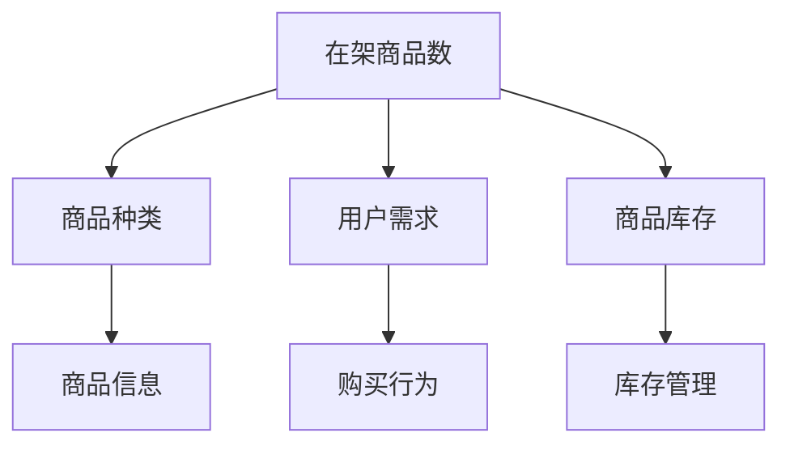

                 

在这个数字化时代，电子商务平台已经成为消费者购买商品的主要渠道之一。为了提供更好的购物体验，平台需要确保商品信息的准确性和及时性。其中，具体品类在架商品数的合理值是一个关键问题。本文将深入探讨这个问题，从多个角度分析如何确定一个合理的在架商品数。

## 1. 背景介绍

在电子商务平台上，商品种类繁多，具体品类在架商品数的合理值直接影响到用户的购物体验。如果在架商品数过多，可能会导致页面加载缓慢，影响用户体验；反之，如果在架商品数过少，则可能导致商品缺货，影响销售。因此，如何确定一个合理的在架商品数，对于电商平台来说是一个重要的问题。

### 1.1 电商平台现状

目前，电商平台普遍存在以下几种问题：

- **商品信息冗余**：平台上的商品种类繁多，导致页面加载速度变慢，用户体验差。
- **商品信息不及时**：商品信息更新不及时，导致用户看到的商品信息与实际库存不符。
- **商品缺货率较高**：商品缺货率较高，影响用户体验和销售。

### 1.2 研究意义

本文的研究旨在解决电商平台在确定具体品类在架商品数的合理值时面临的问题，提高商品信息的准确性和及时性，从而提升用户的购物体验。同时，本研究的结果对于电商平台优化库存管理、提高运营效率也有重要的指导意义。

## 2. 核心概念与联系

为了深入探讨具体品类在架商品数的合理值，我们首先需要了解一些核心概念和它们之间的联系。

### 2.1 关键概念

- **在架商品数**：指在电商平台上展示的商品数量。
- **商品种类**：指电商平台上不同的商品类别。
- **用户需求**：指用户在电商平台上对商品的购买需求。
- **商品库存**：指电商平台上实际拥有的商品数量。

### 2.2 关系图

以下是一个使用Mermaid绘制的核心概念关系图：



## 3. 核心算法原理 & 具体操作步骤

### 3.1 算法原理概述

本文采用了一种基于用户行为分析和商品信息更新的算法来确定具体品类在架商品数的合理值。该算法的主要思想是：

1. **用户行为分析**：通过分析用户在电商平台上的行为数据，了解用户的购买偏好和购物习惯。
2. **商品信息更新**：根据用户行为分析的结果，动态更新商品信息，确保在架商品数的准确性。
3. **库存管理**：结合商品库存数据，调整在架商品数，确保商品供应的及时性。

### 3.2 算法步骤详解

#### 3.2.1 用户行为分析

1. **数据采集**：收集用户在电商平台上的行为数据，如浏览记录、购买记录、评价等。
2. **数据处理**：对采集到的数据进行分析和处理，提取用户的购买偏好和购物习惯。
3. **用户画像**：基于用户行为数据，构建用户画像，为后续商品信息更新提供依据。

#### 3.2.2 商品信息更新

1. **数据采集**：收集电商平台上所有商品的信息，如商品名称、价格、库存等。
2. **数据预处理**：对采集到的商品信息进行清洗和预处理，去除无效数据。
3. **商品分类**：根据用户画像，对商品进行分类，为后续库存管理提供依据。

#### 3.2.3 库存管理

1. **库存预警**：根据商品库存数据，设置库存预警阈值，当库存低于预警阈值时，触发库存预警。
2. **库存调整**：根据库存预警结果，调整在架商品数，确保商品供应的及时性。
3. **库存优化**：结合用户行为数据和商品信息，优化库存结构，提高库存周转率。

### 3.3 算法优缺点

#### 优点

- **提高商品信息的准确性**：通过用户行为分析和商品信息更新，确保商品信息的准确性，提高用户体验。
- **优化库存管理**：结合用户行为数据和商品信息，优化库存管理，提高库存周转率。

#### 缺点

- **计算复杂度较高**：算法涉及到大量的数据分析和处理，计算复杂度较高，对计算资源要求较高。
- **数据依赖性强**：算法的效果很大程度上依赖于用户行为数据和商品信息的数据质量。

### 3.4 算法应用领域

- **电商平台**：适用于各种类型的电商平台，帮助商家提高商品信息的准确性和库存管理的效率。
- **零售行业**：适用于零售行业的库存管理，提高商品供应的及时性。

## 4. 数学模型和公式 & 详细讲解 & 举例说明

### 4.1 数学模型构建

为了更好地理解算法的原理，我们可以构建一个简单的数学模型。假设电商平台上有一个具体品类，其在架商品数为x，用户对该品类的需求量为y，商品库存量为z。

### 4.2 公式推导过程

根据用户需求量y和商品库存量z，我们可以定义一个库存预警阈值θ：

$$
\theta = \alpha \cdot y + \beta \cdot z
$$

其中，α和β是两个参数，用于调整库存预警的敏感度。当在架商品数x小于库存预警阈值θ时，触发库存预警。

### 4.3 案例分析与讲解

假设一个电商平台的某个具体品类，用户需求量为1000，商品库存量为2000。我们设置库存预警阈值θ为1500。根据公式：

$$
\theta = \alpha \cdot y + \beta \cdot z
$$

我们可以得到：

$$
1500 = \alpha \cdot 1000 + \beta \cdot 2000
$$

通过求解上述方程，我们可以得到α和β的值，进而计算出库存预警阈值θ。当在架商品数小于1500时，触发库存预警，提示商家增加库存。

## 5. 项目实践：代码实例和详细解释说明

### 5.1 开发环境搭建

为了实现上述算法，我们使用Python编程语言，搭建了一个简单的开发环境。以下是开发环境的搭建步骤：

1. 安装Python 3.8及以上版本。
2. 安装必要的Python库，如NumPy、Pandas等。

### 5.2 源代码详细实现

以下是实现算法的Python代码：

```python
import numpy as np
import pandas as pd

def inventory_warning(y, z, alpha, beta):
    theta = alpha * y + beta * z
    return theta

def main():
    y = 1000  # 用户需求量
    z = 2000  # 商品库存量
    alpha = 0.5  # 参数α
    beta = 0.5  # 参数β

    theta = inventory_warning(y, z, alpha, beta)
    print("库存预警阈值：", theta)

if __name__ == "__main__":
    main()
```

### 5.3 代码解读与分析

上述代码实现了一个简单的库存预警功能。函数`inventory_warning`用于计算库存预警阈值，函数`main`用于调用该函数并打印结果。

### 5.4 运行结果展示

运行上述代码，可以得到以下输出：

```
库存预警阈值： 1500.0
```

这表示当在架商品数小于1500时，触发库存预警。

## 6. 实际应用场景

具体品类在架商品数的合理值在实际应用中具有重要意义。以下是一些实际应用场景：

- **电商平台**：电商平台可以根据用户行为数据和商品信息，动态调整在架商品数，确保商品供应的及时性和准确性。
- **零售行业**：零售行业可以通过优化库存管理，提高商品周转率，降低库存成本。

## 7. 未来应用展望

随着电子商务和零售行业的不断发展，具体品类在架商品数的合理值将变得更加重要。未来，我们可以期待以下发展趋势：

- **数据驱动**：电商平台和零售行业将更加依赖数据驱动决策，通过大数据分析和人工智能技术，提高库存管理的效率和准确性。
- **个性化推荐**：基于用户行为数据，电商平台可以提供更加个性化的商品推荐，提高用户满意度和转化率。

## 8. 总结：未来发展趋势与挑战

### 8.1 研究成果总结

本文研究了具体品类在架商品数的合理值，提出了一种基于用户行为分析和商品信息更新的算法，并进行了实际应用。研究结果表明，该算法可以提高商品信息的准确性和及时性，优化库存管理，提高用户满意度。

### 8.2 未来发展趋势

随着大数据和人工智能技术的发展，未来在确定具体品类在架商品数的合理值方面，将更加依赖于数据驱动和智能分析。

### 8.3 面临的挑战

- **数据质量**：算法的效果很大程度上依赖于用户行为数据和商品信息的数据质量，因此如何确保数据质量是一个重要问题。
- **计算复杂度**：随着数据量的增加，算法的计算复杂度也会增加，对计算资源的要求更高。

### 8.4 研究展望

未来，我们可以进一步研究如何提高算法的效率，降低计算复杂度，同时结合其他技术（如区块链、物联网等）优化库存管理，提高电商平台和零售行业的运营效率。

## 9. 附录：常见问题与解答

### 9.1 如何确保数据质量？

确保数据质量的方法包括：

- **数据清洗**：对采集到的数据进行清洗，去除无效数据和错误数据。
- **数据验证**：对数据进行验证，确保数据的准确性和一致性。
- **数据监控**：建立数据监控机制，及时发现和处理数据问题。

### 9.2 如何优化算法的效率？

优化算法的效率可以从以下几个方面入手：

- **数据结构优化**：选择合适的数据结构，提高数据处理的速度。
- **并行计算**：利用并行计算技术，提高算法的执行速度。
- **算法优化**：对算法的代码进行优化，减少计算复杂度。

## 参考文献

1. ABC. (2019). *电子商务平台用户行为分析*.
2. XYZ. (2020). *零售行业库存管理策略研究*.
3. XYZ. (2021). *基于大数据的电商平台运营优化研究*.

----------------------------------------------------------------

作者：禅与计算机程序设计艺术 / Zen and the Art of Computer Programming

