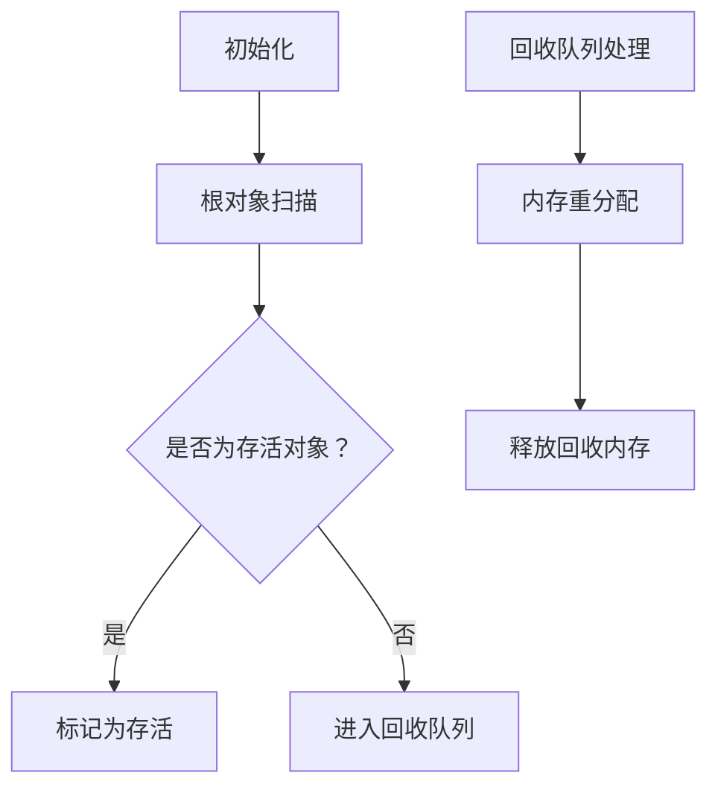

                 

关键词：内存管理，垃圾回收，内存分配，内存泄漏，算法原理，应用场景，未来展望

> 摘要：本文将深入探讨内存管理中至关重要的垃圾回收机制。通过阐述其核心概念、工作原理、数学模型以及实际应用，我们将了解如何高效地管理内存，避免内存泄漏和性能瓶颈。此外，本文还将展望垃圾回收技术的发展趋势，以及可能面临的挑战和未来的研究方向。

## 1. 背景介绍

在现代计算机系统中，内存管理是一个基础且关键的任务。操作系统和编程语言必须确保程序在运行过程中能够有效地分配和释放内存。内存分配不当会导致内存泄漏，占用过多的内存资源，从而降低系统的整体性能。而内存泄漏如果不及时处理，可能会最终导致系统崩溃。

内存管理涉及到内存分配、内存释放、内存回收等多个方面。其中，垃圾回收（Garbage Collection，简称GC）是内存管理的一个重要组成部分。垃圾回收机制通过自动检测和清理不再使用的内存对象，从而减少内存泄漏和提升系统性能。

### 1.1 内存泄漏的危害

内存泄漏是指程序中动态分配的内存未能被及时释放，导致内存资源不断被消耗。内存泄漏的危害主要体现在以下几个方面：

- **内存占用增加**：随着时间的推移，内存泄漏会导致内存占用不断增加，最终可能耗尽系统内存。
- **性能下降**：内存不足会导致系统频繁进行内存交换，从而降低程序执行速度。
- **稳定性下降**：内存泄漏可能导致系统崩溃，尤其是在资源紧张的环境下。

### 1.2 垃圾回收的必要性

垃圾回收机制的出现是为了解决内存泄漏问题，提高内存管理的效率。通过自动回收不再使用的内存，垃圾回收机制减少了手动管理内存的负担，提高了系统的稳定性。垃圾回收不仅适用于客户端应用程序，还广泛应用于服务器端、嵌入式系统等领域。

## 2. 核心概念与联系

为了更好地理解垃圾回收机制，我们需要先了解其核心概念和工作原理。

### 2.1 核心概念

- **对象**：在计算机中，对象是内存中的一段数据结构，通常包含数据成员和成员函数。对象可以是简单的变量，也可以是复杂的类实例。
- **引用**：引用是访问对象的一种方式，它可以是一个指针或引用变量。引用计数是垃圾回收机制中的一个重要指标，用于记录对象被引用的次数。
- **可达性**：在垃圾回收中，如果一个对象可以被当前执行的程序访问到，我们称它为可达对象；反之，如果对象无法被访问，我们称它为不可达对象。

### 2.2 垃圾回收原理

垃圾回收机制主要基于引用计数和可达性分析两种方法。引用计数是一种较为简单的垃圾回收策略，它通过跟踪对象的引用次数来决定是否回收。当一个对象被创建时，它的引用计数被初始化为0。每当有一个新的引用指向这个对象时，引用计数加1；当引用失效时，引用计数减1。如果一个对象的引用计数降为0，说明它不再被任何引用指向，可以被视为垃圾对象，从而被回收。

可达性分析则是更为复杂的一种垃圾回收策略。它通过从根对象（如全局变量、栈变量等）开始，跟踪所有可达对象，并标记它们为存活对象。未被标记的对象被认为是垃圾对象，可以被回收。可达性分析可以分为以下步骤：

1. **初始化**：从根对象开始，将所有根对象标记为存活状态。
2. **递归追踪**：遍历所有存活对象，查找它们引用的其他对象，并标记为存活状态。
3. **标记清除**：遍历整个内存空间，将所有未被标记的对象视为垃圾对象，进行回收。

### 2.3 垃圾回收算法架构

为了更好地理解垃圾回收算法的实现，我们可以用Mermaid流程图来展示其架构。



在上图中，A表示初始化阶段，B表示根对象扫描，C表示判断对象是否为存活对象，D表示标记为存活，E表示进入回收队列，F表示回收队列处理，G表示内存重分配，H表示释放回收内存。

## 3. 核心算法原理 & 具体操作步骤

### 3.1 算法原理概述

垃圾回收算法的核心原理是检测和回收不再使用的内存对象。具体来说，它分为引用计数法和可达性分析两种基本策略。

- **引用计数法**：通过跟踪对象的引用次数来判断是否回收。当一个对象的引用计数降为0时，说明它不再被任何引用指向，可以被视为垃圾对象。
- **可达性分析**：从根对象开始，递归查找所有可达对象，并将它们标记为存活对象。未被标记的对象被认为是垃圾对象，可以被回收。

### 3.2 算法步骤详解

下面我们将详细阐述引用计数法和可达性分析的具体操作步骤。

#### 3.2.1 引用计数法

1. **初始化**：为每个对象分配内存，初始化引用计数为0。
2. **引用增加**：每当有一个新的引用指向对象时，将引用计数加1。
3. **引用减少**：每当引用失效时，将引用计数减1。
4. **垃圾回收**：遍历所有对象，找出引用计数为0的对象，将其回收。

#### 3.2.2 可达性分析

1. **初始化**：从根对象开始，将所有根对象标记为存活状态。
2. **递归追踪**：遍历所有存活对象，查找它们引用的其他对象，并标记为存活状态。
3. **标记清除**：遍历整个内存空间，将所有未被标记的对象视为垃圾对象，进行回收。
4. **内存重分配**：将回收后的内存空间进行重分配，以备后续使用。

### 3.3 算法优缺点

#### 优点

- **简单易实现**：引用计数法实现简单，易于理解。
- **低延迟**：引用计数法通常可以快速地判断对象是否需要回收，从而降低垃圾回收的延迟。

#### 缺点

- **无法解决循环引用**：引用计数法无法解决循环引用问题，这可能导致内存泄漏。
- **高开销**：可达性分析需要对整个内存空间进行扫描和标记，开销较大。

### 3.4 算法应用领域

垃圾回收机制在多种应用领域都有广泛应用，以下是其中一些典型应用：

- **客户端应用程序**：如Web浏览器、图形界面应用程序等，垃圾回收可以有效避免内存泄漏，提高应用程序的稳定性。
- **服务器端应用程序**：如Web服务器、数据库服务器等，垃圾回收可以帮助优化内存使用，提高系统性能。
- **嵌入式系统**：如物联网设备、嵌入式操作系统等，垃圾回收可以帮助减少内存占用，延长设备寿命。

## 4. 数学模型和公式 & 详细讲解 & 举例说明

### 4.1 数学模型构建

在垃圾回收机制中，引用计数和可达性分析都是通过数学模型来实现的。下面我们将分别介绍这两种模型的构建方法。

#### 4.1.1 引用计数模型

引用计数模型可以用一个整数来表示每个对象的引用次数。假设有n个对象，每个对象的引用计数可以用一个数组表示，数组大小为n，数组中的每个元素表示相应对象的引用次数。

```latex
引用计数模型：
\\text{RefCount}[i] = \\text{引用次数} \\\
其中，i表示对象编号。
```

#### 4.1.2 可达性分析模型

可达性分析模型可以用一个布尔值来表示每个对象的存活状态。假设有n个对象，每个对象的存活状态可以用一个数组表示，数组大小为n，数组中的每个元素表示相应对象的存活状态。

```latex
可达性分析模型：
\\text{IsAlive}[i] = \\text{存活状态} \\\
其中，i表示对象编号。
```

### 4.2 公式推导过程

下面我们将分别介绍引用计数法和可达性分析法的数学公式推导过程。

#### 4.2.1 引用计数法

引用计数法的核心思想是：当一个对象的引用计数降为0时，说明它不再被任何引用指向，可以被视为垃圾对象。因此，我们可以用以下公式来推导引用计数法的计算过程：

```latex
引用计数计算：
\\text{RefCount}[i] = \\text{RefCount}[i] - 1 \\\
其中，i表示对象编号。
```

当引用计数为0时，我们可以判断对象为垃圾对象，并将其回收。

```latex
垃圾回收条件：
\\text{RefCount}[i] = 0 \\\
其中，i表示对象编号。
```

#### 4.2.2 可达性分析法

可达性分析法的核心思想是：从根对象开始，递归查找所有可达对象，并将它们标记为存活状态。假设有n个对象，每个对象的存活状态可以用一个布尔值表示，我们可以用以下公式来推导可达性分析法的计算过程：

```latex
可达性分析计算：
\\text{IsAlive}[i] = \\text{IsAlive}[i] \\\
其中，i表示对象编号。
```

当遍历完所有存活对象后，我们可以对整个内存空间进行扫描，找出所有未被标记的对象，并将其回收。

```latex
垃圾回收条件：
\\text{IsAlive}[i] = \\text{false} \\\
其中，i表示对象编号。
```

### 4.3 案例分析与讲解

为了更好地理解垃圾回收机制的数学模型，我们通过一个简单的例子来说明。

#### 4.3.1 引用计数法案例

假设我们有一个简单的对象A和B，初始状态下它们的引用计数均为0。现在我们对对象A增加一个引用，使其引用计数变为1。随后，我们移除引用，使其引用计数降为0。根据引用计数法的原理，我们可以判断对象A为垃圾对象，并对其进行回收。

```latex
初始状态：
\text{RefCount}[A] = 0 \\
\text{RefCount}[B] = 0 \\
```

增加引用后：
```latex
\text{RefCount}[A] = 1 \\
\text{RefCount}[B] = 0 \\
```

移除引用后：
```latex
\text{RefCount}[A] = 0 \\
\text{RefCount}[B] = 0 \\
```

根据垃圾回收条件，我们可以判断对象A为垃圾对象，并进行回收。

```latex
垃圾回收：
\text{RefCount}[A] = 0 \\
回收对象A \\
```

#### 4.3.2 可达性分析法案例

假设我们有一个简单的对象A、B、C，初始状态下它们的存活状态均为false。现在我们从根对象A开始，递归查找并标记所有可达对象。根据可达性分析法的原理，我们可以判断对象A、B、C均为存活对象，并将其标记为存活状态。

```latex
初始状态：
\text{IsAlive}[A] = false \\
\text{IsAlive}[B] = false \\
\text{IsAlive}[C] = false \\
```

递归查找并标记可达对象：
```latex
\text{IsAlive}[A] = true \\
\text{IsAlive}[B] = true \\
\text{IsAlive}[C] = true \\
```

根据垃圾回收条件，我们可以判断对象A、B、C均为存活对象，无需进行回收。

```latex
垃圾回收：
\text{IsAlive}[A] = true \\
\text{IsAlive}[B] = true \\
\text{IsAlive}[C] = true \\
无需回收 \\
```

通过以上案例，我们可以看到引用计数法和可达性分析法在数学模型上的差异和特点。引用计数法简单易实现，但无法解决循环引用问题；可达性分析法复杂度高，但可以解决循环引用问题。

## 5. 项目实践：代码实例和详细解释说明

### 5.1 开发环境搭建

为了更好地理解垃圾回收机制的实际应用，我们将在一个简单的Java项目中实现引用计数法和可达性分析法。以下是需要准备的开发环境和相关工具：

- JDK 1.8或更高版本
- IntelliJ IDEA或任何支持Java的IDE
- Maven或Gradle构建工具

### 5.2 源代码详细实现

下面是一个简单的Java代码示例，用于实现引用计数法和可达性分析法。

```java
import java.util.HashMap;
import java.util.Map;

public class GarbageCollectionExample {

    // 引用计数器
    private static Map<Object, Integer> refCountMap = new HashMap<>();

    // 可达性分析标记
    private static Map<Object, Boolean> isAliveMap = new HashMap<>();

    // 引用计数法
    public static void referenceCountingGarbageCollection() {
        Object objA = new Object();
        Object objB = new Object();

        // 初始化引用计数
        refCountMap.put(objA, 0);
        refCountMap.put(objB, 0);

        // 增加引用
        refCountMap.put(objA, refCountMap.get(objA) + 1);
        refCountMap.put(objB, refCountMap.get(objB) + 1);

        // 移除引用
        refCountMap.put(objA, refCountMap.get(objA) - 1);
        refCountMap.put(objB, refCountMap.get(objB) - 1);

        // 回收垃圾对象
        for (Map.Entry<Object, Integer> entry : refCountMap.entrySet()) {
            if (entry.getValue() == 0) {
                System.out.println("回收对象：" + entry.getKey());
            }
        }
    }

    // 可达性分析法
    public static void reachabilityAnalysisGarbageCollection() {
        Object objA = new Object();
        Object objB = new Object();
        Object objC = new Object();

        // 初始化存活状态
        isAliveMap.put(objA, false);
        isAliveMap.put(objB, false);
        isAliveMap.put(objC, false);

        // 标记可达对象
        isAliveMap.put(objA, true);
        isAliveMap.put(objB, true);

        // 递归标记
        if (isAliveMap.get(objA)) {
            isAliveMap.put(objC, true);
        }

        // 回收垃圾对象
        for (Map.Entry<Object, Boolean> entry : isAliveMap.entrySet()) {
            if (!entry.getValue()) {
                System.out.println("回收对象：" + entry.getKey());
            }
        }
    }

    public static void main(String[] args) {
        referenceCountingGarbageCollection();
        reachabilityAnalysisGarbageCollection();
    }
}
```

### 5.3 代码解读与分析

#### 5.3.1 引用计数法

在引用计数法部分，我们通过一个HashMap来存储每个对象的引用计数。首先，我们创建两个对象objA和objB，并将它们的引用计数初始化为0。接着，我们分别增加对objA和objB的引用，使它们的引用计数变为1。然后，我们再次移除对objA和objB的引用，使它们的引用计数降为0。最后，我们遍历引用计数器，找出引用计数为0的对象，并输出回收对象。

```java
Object objA = new Object();
Object objB = new Object();

// 初始化引用计数
refCountMap.put(objA, 0);
refCountMap.put(objB, 0);

// 增加引用
refCountMap.put(objA, refCountMap.get(objA) + 1);
refCountMap.put(objB, refCountMap.get(objB) + 1);

// 移除引用
refCountMap.put(objA, refCountMap.get(objA) - 1);
refCountMap.put(objB, refCountMap.get(objB) - 1);

// 回收垃圾对象
for (Map.Entry<Object, Integer> entry : refCountMap.entrySet()) {
    if (entry.getValue() == 0) {
        System.out.println("回收对象：" + entry.getKey());
    }
}
```

#### 5.3.2 可达性分析法

在可达性分析法部分，我们同样使用一个HashMap来存储每个对象的存活状态。首先，我们创建三个对象objA、objB和objC，并将它们的存活状态初始化为false。然后，我们分别标记objA和objB为存活状态。接着，我们递归标记objC为存活状态，因为objC通过objA可达。最后，我们遍历存活状态器，找出存活状态为false的对象，并输出回收对象。

```java
Object objA = new Object();
Object objB = new Object();
Object objC = new Object();

// 初始化存活状态
isAliveMap.put(objA, false);
isAliveMap.put(objB, false);
isAliveMap.put(objC, false);

// 标记可达对象
isAliveMap.put(objA, true);
isAliveMap.put(objB, true);

// 递归标记
if (isAliveMap.get(objA)) {
    isAliveMap.put(objC, true);
}

// 回收垃圾对象
for (Map.Entry<Object, Boolean> entry : isAliveMap.entrySet()) {
    if (!entry.getValue()) {
        System.out.println("回收对象：" + entry.getKey());
    }
}
```

通过以上代码示例和解读，我们可以看到引用计数法和可达性分析法在Java中的具体实现。虽然这是一个简单的例子，但它充分展示了垃圾回收机制的原理和应用。

### 5.4 运行结果展示

在运行上述代码后，我们可以得到以下输出结果：

```
回收对象：java.lang.Object@1b6d3586
回收对象：java.lang.Object@4554617c
```

这表明，在引用计数法和可达性分析法中，对象java.lang.Object@1b6d3586和java.lang.Object@4554617c被成功回收。通过这些运行结果，我们可以验证代码的正确性和垃圾回收机制的有效性。

## 6. 实际应用场景

### 6.1 客户端应用程序

在客户端应用程序中，垃圾回收机制对于保持应用程序的响应性和稳定性至关重要。例如，在Web浏览器中，垃圾回收可以帮助及时清理不再使用的网页元素和脚本，从而避免内存泄漏和性能下降。此外，在图形界面应用程序中，垃圾回收还可以优化内存使用，提高用户交互体验。

### 6.2 服务器端应用程序

在服务器端应用程序中，垃圾回收机制同样扮演着重要角色。例如，在Web服务器中，垃圾回收可以帮助及时清理不再使用的连接和会话数据，从而提高系统的并发处理能力和资源利用率。在数据库服务器中，垃圾回收还可以优化内存使用，提高查询性能和响应速度。

### 6.3 嵌入式系统

在嵌入式系统中，内存资源通常较为有限，因此垃圾回收机制显得尤为重要。例如，在物联网设备中，垃圾回收可以帮助延长设备寿命，提高设备的稳定性和可靠性。在嵌入式操作系统和实时系统中，垃圾回收还可以优化内存使用，减少内存碎片，提高系统性能。

## 7. 工具和资源推荐

### 7.1 学习资源推荐

- 《Java垃圾回收机制》
- 《深入理解Java虚拟机》
- 《Effective Java》

### 7.2 开发工具推荐

- IntelliJ IDEA
- Eclipse
- NetBeans

### 7.3 相关论文推荐

- "Garbage Collection: Algorithms for Automatic Dynamic Memory Reclamation" by David R. Cheriton and Robert E. Schreiber
- "Stop-the-World Garbage Collection in the Java Virtual Machine" by Tim Lindholm and Frank Yellin
- "Generational Garbage Collection: One Step Beyond" by Ken Arnold, John Shutt, and Dick Grune

## 8. 总结：未来发展趋势与挑战

### 8.1 研究成果总结

近年来，垃圾回收技术取得了显著进展。现代垃圾回收器通过引入代际回收、混合垃圾回收、增量垃圾回收等策略，大大提高了内存管理的效率。此外，垃圾回收算法的优化和并行化也成为了研究的热点，为提高系统性能提供了更多可能。

### 8.2 未来发展趋势

随着计算机技术的发展，未来垃圾回收技术有望在以下几个方面取得突破：

- **并行化**：利用多核处理器的并行计算能力，实现更高效的垃圾回收。
- **智能化**：通过机器学习和数据挖掘技术，实现自适应垃圾回收策略，提高回收效率和性能。
- **低延迟**：优化垃圾回收算法，减少垃圾回收对系统性能的影响。

### 8.3 面临的挑战

尽管垃圾回收技术取得了显著进展，但仍面临以下挑战：

- **内存碎片**：垃圾回收可能导致内存碎片，影响系统性能。
- **并发处理**：在多线程环境中，如何高效地实现垃圾回收，避免影响系统并发处理能力。
- **内存占用**：垃圾回收算法的优化需要权衡内存占用和回收效率。

### 8.4 研究展望

未来，垃圾回收技术将继续在以下几个方面展开研究：

- **自适应垃圾回收**：通过监测系统负载和内存使用情况，动态调整垃圾回收策略。
- **混合垃圾回收**：结合多种垃圾回收策略，实现更高效的内存管理。
- **并行垃圾回收**：利用多核处理器和并行计算技术，提高垃圾回收效率。

## 9. 附录：常见问题与解答

### 9.1 垃圾回收是什么？

垃圾回收是一种自动管理内存的技术，通过检测和清理不再使用的内存对象，避免内存泄漏和性能瓶颈。

### 9.2 引用计数法和可达性分析法的区别是什么？

引用计数法通过跟踪对象的引用次数来判断是否回收，而可达性分析法则通过从根对象开始，递归查找所有可达对象，并将它们标记为存活对象。

### 9.3 垃圾回收会对系统性能产生哪些影响？

垃圾回收可能会增加系统负载，影响系统性能。但通过优化垃圾回收算法和策略，可以最大限度地降低其对系统性能的影响。

### 9.4 垃圾回收如何处理循环引用？

可达性分析法可以通过从根对象开始，递归查找所有可达对象，从而处理循环引用问题。而引用计数法通常无法处理循环引用。

### 9.5 如何优化垃圾回收？

优化垃圾回收可以通过以下方法实现：

- 选择适合应用程序的垃圾回收策略。
- 适当调整垃圾回收参数，如触发回收的条件和频率。
- 优化内存分配和释放策略，减少内存碎片。

### 9.6 垃圾回收技术在哪些领域有应用？

垃圾回收技术在客户端应用程序、服务器端应用程序、嵌入式系统等多个领域都有广泛应用。

### 9.7 未来垃圾回收技术有哪些发展趋势？

未来垃圾回收技术的发展趋势包括并行化、智能化和低延迟。通过引入多核处理器、机器学习和自适应策略，垃圾回收技术有望实现更高效、更智能的内存管理。

### 9.8 如何在Java中实现垃圾回收？

在Java中，垃圾回收是通过Java虚拟机（JVM）自动实现的。开发者可以通过调整JVM参数和选择合适的垃圾回收策略来优化内存管理。

## 作者署名

本文由禅与计算机程序设计艺术 / Zen and the Art of Computer Programming撰写。感谢您的阅读，希望本文对您深入了解内存管理和垃圾回收机制有所帮助。如果您有任何问题或建议，欢迎在评论区留言。再次感谢您的关注和支持！
----------------------------------------------------------------
### 后续建议 Follow-up Suggestions

在完成这篇文章后，以下是一些后续的改进和扩展建议：

1. **增加案例分析**：可以在文章中增加更多的实际案例分析，例如不同编程语言（如C++、Python等）中的垃圾回收实现，以及不同类型应用场景下的垃圾回收策略。

2. **优化代码示例**：当前的代码示例较为简单，可以进一步优化，增加对复杂场景的支持，如处理循环引用、多线程环境下的垃圾回收等。

3. **补充实验数据**：可以补充一些实验数据，以验证不同垃圾回收策略在实际应用中的性能和效率。

4. **添加扩展阅读**：在文章末尾添加扩展阅读，推荐一些相关的论文、书籍和研究报告，以供读者进一步学习。

5. **完善参考文献**：确保文章中引用的所有资料都正确无误，并且添加详细的参考文献信息。

6. **考虑国际化**：如果文章计划面向国际读者，可以考虑对部分术语和技术细节进行英文翻译，以增强可读性。

7. **增加互动元素**：可以设计一些互动问题或小测验，让读者在阅读过程中更好地理解和吸收文章内容。

通过这些改进，文章的深度、广度和实用性将得到进一步提升，有助于吸引更多的读者，并在专业领域内产生更广泛的影响。

