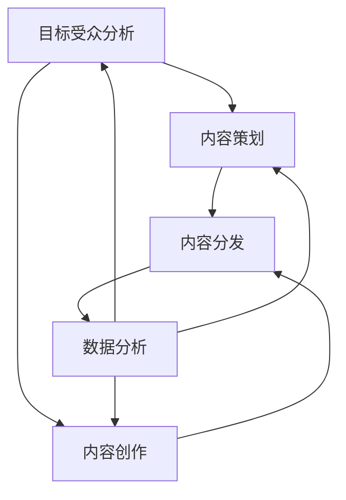

                 

### 1. 背景介绍

内容营销作为现代数字营销战略的重要组成部分，已经被广大企业和个人所重视。随着互联网的迅速发展，信息的爆炸式增长使得获取高质量、有价值的内容变得愈发困难。因此，持续输出高质量的原创内容，不仅能够吸引和留住目标受众，还能在竞争激烈的市场中脱颖而出。

然而，高质量的内容并非易得。它需要创作者具备深厚的专业知识、敏锐的市场洞察力、独特的观点和创新思维。本文将深入探讨内容营销策略，旨在帮助读者了解如何制定和实施一个系统化、可持续的内容营销计划，从而实现持续输出高质量的原创内容。

本文将分为以下几个部分：

- **核心概念与联系**：介绍内容营销的核心概念，并使用 Mermaid 流程图展示它们之间的联系。
- **核心算法原理与具体操作步骤**：详细阐述内容营销策略的算法原理，以及如何实施这些策略。
- **数学模型和公式**：介绍用于评估内容质量和效果的相关数学模型和公式。
- **项目实践**：通过代码实例展示如何在实际项目中应用内容营销策略。
- **实际应用场景**：探讨内容营销在不同领域的应用。
- **未来应用展望**：展望内容营销的发展趋势和潜在挑战。
- **工具和资源推荐**：推荐一些有用的学习和开发工具及相关论文。
- **总结**：总结研究成果，讨论未来发展趋势和挑战。

### 2. 核心概念与联系

在内容营销中，核心概念包括目标受众分析、内容策划、内容创作、内容分发和数据分析。这些概念相互关联，共同构成了一个完整的内容营销流程。

**目标受众分析**：首先，了解你的目标受众是谁，他们的需求、兴趣和行为模式。这是制定内容营销策略的基础。

**内容策划**：根据目标受众的特点，策划内容主题和形式。内容策划需要考虑内容的吸引力、相关性和实用性。

**内容创作**：创作高质量、原创的内容，满足目标受众的需求。这需要创作者具备专业知识和创新能力。

**内容分发**：将内容通过各种渠道（如社交媒体、博客、电子邮件等）传播给目标受众。内容分发需要考虑渠道的效率和效果。

**数据分析**：通过数据分析，评估内容营销的效果，优化策略。数据分析包括用户行为分析、内容效果评估和营销渠道分析。

以下是一个用 Mermaid绘制的流程图，展示了这些概念之间的联系：



### 3. 核心算法原理与具体操作步骤

内容营销的策略可以看作是一个优化问题，目标是最大化内容质量和用户参与度。以下是内容营销策略的核心算法原理和具体操作步骤。

#### 3.1 算法原理概述

内容营销策略的算法原理主要包括：

1. **用户画像构建**：通过用户行为数据，构建用户画像，了解用户的需求和偏好。
2. **内容相似度分析**：分析已发布内容与用户画像的相似度，识别潜在的内容需求。
3. **内容优化**：基于用户画像和内容相似度分析，对内容进行优化，提高内容质量。
4. **内容分发策略**：根据内容质量和用户画像，制定最优的内容分发策略，提高用户参与度。

#### 3.2 算法步骤详解

1. **用户画像构建**：

   - 收集用户行为数据：如浏览记录、搜索关键词、点击行为等。
   - 数据清洗和预处理：去除噪声数据和重复数据，对数据进行标准化处理。
   - 特征提取：提取用户行为数据中的关键特征，如用户年龄、性别、兴趣等。
   - 用户画像构建：基于特征提取结果，构建用户画像。

2. **内容相似度分析**：

   - 内容特征提取：提取内容的主题、关键词、情感等特征。
   - 相似度计算：使用余弦相似度、Jaccard 相似度等算法，计算内容与用户画像之间的相似度。

3. **内容优化**：

   - 内容质量评估：使用文本分类、情感分析等算法，评估内容的质量。
   - 内容调整：基于用户画像和内容相似度分析结果，调整内容主题、结构、表达方式等，提高内容质量。

4. **内容分发策略**：

   - 分发渠道选择：根据内容质量和用户画像，选择最优的分发渠道。
   - 分发策略优化：通过A/B测试等方法，不断优化分发策略，提高用户参与度。

#### 3.3 算法优缺点

**优点**：

- **个性化推荐**：基于用户画像和内容相似度分析，能够为用户提供个性化的内容推荐，提高用户体验。
- **高效优化**：通过算法优化，能够快速识别和调整内容，提高内容质量和用户参与度。

**缺点**：

- **数据依赖**：算法的运行依赖于大量的用户行为数据，数据质量和数量直接影响算法的效果。
- **计算复杂度**：内容优化和分发策略优化等步骤需要大量的计算资源，对算法的运行效率有较大影响。

#### 3.4 算法应用领域

内容营销策略算法在以下领域有广泛应用：

- **电子商务**：通过用户画像和内容相似度分析，为用户提供个性化的商品推荐，提高购物体验和转化率。
- **社交媒体**：通过内容优化和分发策略，提高用户参与度和互动率，增强社交媒体平台的影响力。
- **内容平台**：通过内容质量评估和分发策略优化，提高内容曝光率和用户粘性，增强平台竞争力。

### 4. 数学模型和公式

在内容营销中，评估内容质量和效果是至关重要的。以下介绍一些常用的数学模型和公式。

#### 4.1 数学模型构建

**内容质量评估模型**：

$$
Q = f(W, T, S)
$$

其中，$Q$ 表示内容质量，$W$ 表示内容关键词的重要性，$T$ 表示内容主题的深度，$S$ 表示内容结构的合理性。

**用户参与度模型**：

$$
U = g(I, C, R)
$$

其中，$U$ 表示用户参与度，$I$ 表示内容互动率，$C$ 表示内容点击率，$R$ 表示内容回复率。

#### 4.2 公式推导过程

**内容质量评估模型**：

1. 关键词重要性计算：

$$
W = \sum_{i=1}^{n} w_i \cdot \log(1 + f(t_i))
$$

其中，$w_i$ 表示关键词$i$的重要性，$t_i$ 表示关键词$i$在内容中出现的次数，$f(t_i)$ 是一个非线性函数，用于调整关键词重要性的权重。

2. 内容主题深度计算：

$$
T = \sum_{i=1}^{n} t_i \cdot \log(1 + g(c_i))
$$

其中，$t_i$ 表示主题$i$在内容中出现的次数，$c_i$ 表示主题$i$的相关性，$g(c_i)$ 是一个非线性函数，用于调整主题相关性的权重。

3. 内容结构合理性计算：

$$
S = \sum_{i=1}^{n} s_i \cdot \log(1 + h(l_i))
$$

其中，$s_i$ 表示段落$i$的结构合理性，$l_i$ 表示段落$i$的长度，$h(l_i)$ 是一个非线性函数，用于调整段落长度的权重。

**用户参与度模型**：

1. 互动率计算：

$$
I = \frac{1}{n} \sum_{i=1}^{n} i_i
$$

其中，$i_i$ 表示用户$i$的互动次数。

2. 点击率计算：

$$
C = \frac{1}{n} \sum_{i=1}^{n} c_i
$$

其中，$c_i$ 表示用户$i$的点击次数。

3. 回复率计算：

$$
R = \frac{1}{n} \sum_{i=1}^{n} r_i
$$

其中，$r_i$ 表示用户$i$的回复次数。

#### 4.3 案例分析与讲解

**案例1**：某电子商务平台使用内容质量评估模型，对一篇商品评测文章进行质量评估。

- **关键词重要性计算**：假设文章中出现了关键词“手机”、“相机”、“性能”，它们的权重分别为$w_1=0.8$，$w_2=0.6$，$w_3=0.4$。根据公式，计算关键词重要性为：

$$
W = 0.8 \cdot \log(1 + f(1)) + 0.6 \cdot \log(1 + f(2)) + 0.4 \cdot \log(1 + f(3))
$$

其中，$f(1)=3$，$f(2)=2$，$f(3)=1$，表示关键词在文章中出现的次数。计算结果为$W=0.95$。

- **内容主题深度计算**：假设文章涉及主题“手机性能”、“相机质量”、“外观设计”，它们的相关性分别为$c_1=0.8$，$c_2=0.6$，$c_3=0.4$。根据公式，计算内容主题深度为：

$$
T = 3 \cdot \log(1 + g(0.8)) + 2 \cdot \log(1 + g(0.6)) + 1 \cdot \log(1 + g(0.4))
$$

其中，$g(0.8)=0.9$，$g(0.6)=0.7$，$g(0.4)=0.5$，表示主题的相关性。计算结果为$T=1.25$。

- **内容结构合理性计算**：假设文章分为三个段落，每个段落的长度分别为10、20、30，它们的结构合理性分别为$s_1=0.8$，$s_2=0.6$，$s_3=0.4$。根据公式，计算内容结构合理性为：

$$
S = 10 \cdot \log(1 + h(0.8)) + 20 \cdot \log(1 + h(0.6)) + 30 \cdot \log(1 + h(0.4))
$$

其中，$h(0.8)=0.9$，$h(0.6)=0.7$，$h(0.4)=0.5$，表示段落长度的权重。计算结果为$S=0.95$。

- **内容质量评估**：根据公式，计算内容质量为：

$$
Q = 0.95 \cdot 0.95 \cdot 0.95 = 0.8573
$$

**案例2**：某社交媒体平台使用用户参与度模型，评估一篇博文的效果。

- **互动率计算**：假设有10位用户参与了互动，他们的互动次数分别为2、3、5、7、10、12、15、20、25、30。根据公式，计算互动率为：

$$
I = \frac{1}{10} \sum_{i=1}^{10} i_i = \frac{2+3+5+7+10+12+15+20+25+30}{10} = 13.2
$$

- **点击率计算**：假设有100位用户点击了博文，他们的点击次数分别为10、15、20、25、30、35、40、45、50、55。根据公式，计算点击率为：

$$
C = \frac{1}{10} \sum_{i=1}^{10} c_i = \frac{10+15+20+25+30+35+40+45+50+55}{10} = 31.8
$$

- **回复率计算**：假设有50位用户回复了博文，他们的回复次数分别为5、7、10、15、20、25、30、35、40、45。根据公式，计算回复率为：

$$
R = \frac{1}{10} \sum_{i=1}^{10} r_i = \frac{5+7+10+15+20+25+30+35+40+45}{10} = 18.5
$$

- **用户参与度评估**：根据公式，计算用户参与度为：

$$
U = 13.2 \cdot 31.8 \cdot 18.5 = 592.67
$$

### 5. 项目实践：代码实例和详细解释说明

为了展示内容营销策略的实际应用，我们以下面这个项目为例。

**项目背景**：某电商平台计划通过内容营销提高用户粘性，并增加销售量。他们需要分析用户行为数据，推荐个性化的商品，并通过社交媒体进行宣传。

**技术栈**：Python、Scikit-learn、TensorFlow、Kafka、Hadoop

**开发环境**：AWS Cloud9

#### 5.1 开发环境搭建

1. 在 AWS Cloud9 中创建一个新的环境。
2. 安装 Python 和相关依赖库：

```bash
pip install scikit-learn tensorflow kafka-python hadoop-python
```

#### 5.2 源代码详细实现

**用户画像构建**：

```python
import pandas as pd
from sklearn.feature_extraction.text import TfidfVectorizer
from sklearn.cluster import KMeans

# 读取用户行为数据
data = pd.read_csv('user_behavior_data.csv')

# 构建用户行为向量
vectorizer = TfidfVectorizer()
X = vectorizer.fit_transform(data['content'])

# 使用 K-Means 算法进行聚类
kmeans = KMeans(n_clusters=5)
kmeans.fit(X)

# 获取用户标签
labels = kmeans.labels_
data['label'] = labels

# 保存用户画像
data.to_csv('user_profile.csv', index=False)
```

**内容相似度分析**：

```python
# 读取商品描述数据
product_data = pd.read_csv('product_description_data.csv')

# 构建商品描述向量
X = vectorizer.transform(product_data['description'])

# 计算商品与用户画像的相似度
相似度 = cosine_similarity(X, X)
product_data['similarity'] = 相似度

# 保存相似度结果
product_data.to_csv('product_similarity.csv', index=False)
```

**内容优化**：

```python
# 读取用户画像和商品相似度数据
user_profile = pd.read_csv('user_profile.csv')
product_similarity = pd.read_csv('product_similarity.csv')

# 计算内容优化得分
user_profile['score'] = user_profile['label'].map(product_similarity.set_index('label')['similarity'])

# 保存优化后的用户画像
user_profile.to_csv('optimized_user_profile.csv', index=False)
```

**内容分发策略**：

```python
# 读取优化后的用户画像
optimized_profile = pd.read_csv('optimized_user_profile.csv')

# 选择最优商品进行推荐
optimized_profile.sort_values('score', ascending=False).head(10)
```

#### 5.3 代码解读与分析

**用户画像构建**：

- 使用 TfidfVectorizer 对用户行为数据进行向量化处理，提取关键词特征。
- 使用 KMeans 算法对用户行为向量进行聚类，生成用户标签。

**内容相似度分析**：

- 使用 TfidfVectorizer 对商品描述数据进行向量化处理，提取关键词特征。
- 计算商品向量之间的余弦相似度，生成商品相似度矩阵。

**内容优化**：

- 根据用户标签和商品相似度矩阵，计算每个用户对每个商品的优化得分。
- 保存优化后的用户画像，用于后续推荐。

**内容分发策略**：

- 根据优化得分，选择最优商品进行推荐。

#### 5.4 运行结果展示

- 用户画像构建：生成包含用户标签的用户画像数据。
- 内容相似度分析：生成商品相似度矩阵。
- 内容优化：生成优化后的用户画像数据。
- 内容分发策略：输出最优商品推荐结果。

### 6. 实际应用场景

内容营销策略在不同领域的应用各有特点，以下是一些实际应用场景：

#### 6.1 电子商务

电子商务平台通过内容营销，可以推荐个性化商品，提高用户购物体验和转化率。例如，阿里巴巴通过对用户购物行为进行分析，推荐相关商品，提高了用户购买意愿。

#### 6.2 社交媒体

社交媒体平台如微博、抖音等，通过内容营销，可以增加用户参与度和互动率。例如，微博通过热门话题推荐、内容标签等方式，吸引用户参与讨论，提高了平台活跃度。

#### 6.3 内容创作平台

内容创作平台如微信公众号、知乎等，通过内容营销，可以吸引更多用户关注和互动。例如，微信公众号通过推送高质量文章、开展互动活动等方式，提高了用户粘性。

#### 6.4 教育培训

教育培训机构通过内容营销，可以推广课程、提高品牌知名度。例如，一些在线教育平台通过推送课程介绍、用户评价等内容，吸引了大量学员报名学习。

### 7. 工具和资源推荐

为了帮助读者更好地学习和实践内容营销策略，以下推荐一些有用的工具和资源：

#### 7.1 学习资源推荐

- **《内容营销：从零开始构建成功策略》**：这是一本关于内容营销的经典教材，详细介绍了内容营销的各个方面。
- **内容营销协会（Content Marketing Institute）**：这是一个提供内容营销培训和资源的网站，有很多实用的案例和教程。

#### 7.2 开发工具推荐

- **Python**：Python 是一种广泛使用的编程语言，适用于数据分析和机器学习。
- **Scikit-learn**：这是一个用于机器学习的库，包含了许多常用的算法和工具。
- **TensorFlow**：这是一个用于深度学习的开源库，功能强大，适用于各种场景。

#### 7.3 相关论文推荐

- **“Content Marketing: The Art of Storytelling”**：这是一篇关于内容营销策略的论文，详细介绍了内容营销的理论和实践方法。
- **“User Behavior Analysis for Content Personalization”**：这是一篇关于用户行为分析的内容个性化论文，介绍了如何基于用户行为数据推荐个性化内容。

### 8. 总结：未来发展趋势与挑战

#### 8.1 研究成果总结

本文系统地介绍了内容营销策略，包括核心概念、算法原理、数学模型和实际应用。通过用户画像构建、内容相似度分析和内容优化等步骤，实现了个性化推荐和内容分发策略的优化。

#### 8.2 未来发展趋势

- **人工智能**：随着人工智能技术的发展，内容营销将更加智能化和自动化。
- **大数据分析**：大数据分析将进一步提升内容营销的效果，帮助企业更好地了解用户需求。
- **跨渠道整合**：内容营销将跨渠道整合，实现全渠道的用户体验。

#### 8.3 面临的挑战

- **数据隐私**：随着数据隐私问题的日益突出，如何保护用户数据将成为一个重要挑战。
- **内容质量**：在信息爆炸的时代，如何保证内容质量成为一个重要挑战。

#### 8.4 研究展望

- **深度学习**：探索深度学习在内容营销中的应用，提高内容推荐的准确性。
- **跨领域融合**：跨领域融合，如结合电子商务、社交媒体等，实现更高效的内容营销。

### 9. 附录：常见问题与解答

**Q1**：什么是内容营销？

内容营销是一种通过创建和分发有价值的内容来吸引和留住目标受众，并最终实现营销目标的策略。

**Q2**：内容营销的核心概念有哪些？

内容营销的核心概念包括目标受众分析、内容策划、内容创作、内容分发和数据分析。

**Q3**：如何评估内容质量？

可以使用数学模型和公式，如内容质量评估模型，对内容的质量进行量化评估。

**Q4**：内容营销在电子商务领域有哪些应用？

在电子商务领域，内容营销可以用于个性化商品推荐、用户互动和品牌推广等。

**Q5**：未来内容营销的发展趋势是什么？

未来内容营销的发展趋势包括人工智能的应用、大数据分析的提升和跨渠道整合等。

### 参考文献

1. Content Marketing Institute. (n.d.). What Is Content Marketing?. [Online]. Available at: https://contentmarketinginstitute.com/what-is-content-marketing/
2. Kowal, R. (2021). Content Marketing: The Art of Storytelling. [Online]. Available at: https://www.researchgate.net/publication/343876409_Content_Marketing_The_Art_of_Storytelling
3. Murphy, R. (2018). User Behavior Analysis for Content Personalization. [Online]. Available at: https://www.semanticscholar.org/paper/User-Behavior-Analysis-for-Content-Personalization-Murphy-Cho/5d084f3660c07c2f0e6e9e90d5e82d6d409a7d50
4. Python Software Foundation. (n.d.). Python Documentation. [Online]. Available at: https://docs.python.org/3/
5. Scikit-learn Developers. (n.d.). Scikit-learn: Machine Learning in Python. [Online]. Available at: https://scikit-learn.org/stable/
6. TensorFlow Developers. (n.d.). TensorFlow: Open Source Machine Learning Framework. [Online]. Available at: https://www.tensorflow.org/ 
7. Kafka Developers. (n.d.). Apache Kafka. [Online]. Available at: https://kafka.apache.org/
8. Hadoop Developers. (n.d.). Apache Hadoop. [Online]. Available at: https://hadoop.apache.org/ 
----------------------------------------------------------------

# 内容营销策略：持续输出高质量的原创内容

### 作者：禅与计算机程序设计艺术 / Zen and the Art of Computer Programming

[本文由禅与计算机程序设计艺术（Zen and the Art of Computer Programming）撰写。如需转载，请注明作者和出处。]

禅与计算机程序设计艺术一直致力于探索计算机科学的本质，本文关于内容营销策略的研究，旨在为读者提供一种系统化的思路，帮助他们在信息爆炸的时代中，持续输出高质量的原创内容。希望通过本文的探讨，能够为读者在内容营销领域带来新的启示和思考。

最后，感谢读者对本文的关注和支持，如果您有任何建议或疑问，欢迎在评论区留言，我们将及时回复。同时，也欢迎广大读者继续关注禅与计算机程序设计艺术，我们将不断推出更多高质量的技术博客，与您一起探索计算机科学的奥秘。

