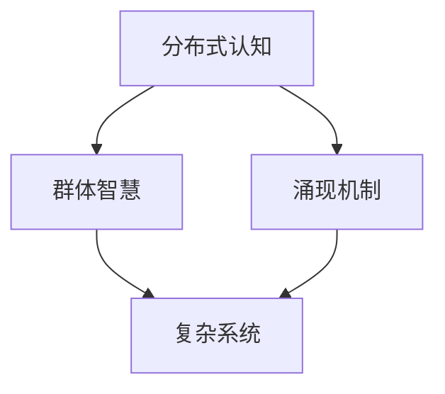

                 

关键词：分布式认知，群体智慧，涌现机制，算法原理，数学模型，实践应用，未来展望

> 摘要：本文旨在深入探讨分布式认知这一前沿领域，揭示群体智慧如何通过涌现机制在复杂系统中发挥作用。文章首先介绍了分布式认知的基本概念和背景，然后详细阐述了核心概念与联系，并在此基础上分析了核心算法原理与具体操作步骤。此外，文章还探讨了数学模型和公式，以及在实际项目中的代码实例和运行结果。最后，文章展望了分布式认知在未来应用场景中的前景，并对相关工具和资源进行了推荐。

## 1. 背景介绍

分布式认知（Distributed Cognition）是一个涉及计算机科学、认知科学、人机交互、复杂系统等多个领域的交叉学科领域。其核心思想是，个体的认知能力在分布式系统中得以扩展，形成一种群体智慧。这一概念最早由计算机科学家赫伯特·西蒙（Herbert A. Simon）在20世纪70年代提出。西蒙指出，个体与环境的交互作用不仅是通过个体自身的认知能力，还可以通过分布式系统中的协同作用来实现。

随着互联网和物联网的发展，分布式认知的应用场景日益丰富，例如：智能交通系统、智慧城市、生物进化模拟等。在这些应用中，分布式认知通过群体智能的涌现机制，实现了对复杂系统的实时监控、自适应调整和优化。因此，深入研究分布式认知的涌现机制，对于推动人工智能技术的发展具有重要意义。

## 2. 核心概念与联系

### 2.1 分布式认知的概念

分布式认知是指个体与个体、个体与环境之间的信息交换与协同作用，形成一种群体智慧。在分布式认知系统中，每个个体既是信息的接收者，也是信息的发送者。个体通过共享信息、协同工作，实现了对复杂问题的求解。

### 2.2 群体智慧的概念

群体智慧（Collective Intelligence）是指多个个体在协同作用下，产生的比单个个体更为强大的认知能力。这种能力体现在群体能够快速适应变化、高效解决问题、产生创新性思维等方面。

### 2.3 涌现机制的概念

涌现机制（Emergence）是指复杂系统中，个体之间的相互作用导致系统整体表现出新的、宏观的属性或行为。这些属性或行为在个体层面上是无法预测或观察到的。涌现机制是分布式认知和群体智慧的核心特征。

### 2.4 核心概念联系

分布式认知、群体智慧和涌现机制之间存在着密切的联系。分布式认知为群体智慧提供了基础，而群体智慧则是分布式认知在复杂系统中的表现。涌现机制则是群体智慧产生的过程和机制。

### 2.5 Mermaid 流程图

下面是一个描述分布式认知、群体智慧和涌现机制之间关系的 Mermaid 流程图：



## 3. 核心算法原理 & 具体操作步骤

### 3.1 算法原理概述

分布式认知算法的核心原理是基于个体间的协同作用和信息共享，通过涌现机制实现群体智慧。算法主要包括以下几个关键步骤：

1. **信息收集与共享**：个体通过传感器或其他信息源收集环境信息，并将信息共享给其他个体。
2. **信息处理与融合**：个体对收集到的信息进行处理，并结合其他个体的信息，形成全局视角。
3. **决策与行动**：基于全局视角，个体做出决策并执行相应行动，以实现系统目标。
4. **反馈与调整**：系统根据个体行动的结果进行反馈，调整后续行动策略。

### 3.2 算法步骤详解

1. **初始化**：设定系统初始状态，包括个体位置、初始信息等。
2. **信息收集**：个体通过传感器或其他信息源收集环境信息，并将信息存储在本地。
3. **信息共享**：个体将本地信息发送给其他个体，实现信息共享。
4. **信息处理**：个体对收集到的信息进行处理，提取有用信息，形成全局视角。
5. **决策与行动**：个体根据全局视角做出决策，并执行相应行动。
6. **反馈与调整**：系统根据个体行动的结果进行反馈，调整后续行动策略。

### 3.3 算法优缺点

**优点**：

1. **高效性**：分布式认知算法能够快速适应环境变化，实现高效问题求解。
2. **鲁棒性**：算法具有较强的鲁棒性，能够在个体失效或网络故障的情况下，保持系统稳定运行。
3. **灵活性**：算法适用于多种应用场景，具有广泛的应用前景。

**缺点**：

1. **信息冗余**：个体间信息共享可能导致信息冗余，影响系统性能。
2. **同步问题**：个体行动的同步可能导致系统延迟，影响实时性。

### 3.4 算法应用领域

分布式认知算法在多个领域具有广泛应用前景，包括：

1. **智能交通系统**：实现交通流量实时监控、路况预测和优化调度。
2. **智慧城市**：实现城市资源优化配置、环境保护和城市管理。
3. **生物进化模拟**：研究生物进化过程和机制，为生物科技提供理论支持。

## 4. 数学模型和公式 & 详细讲解 & 举例说明

### 4.1 数学模型构建

分布式认知算法的数学模型主要包括以下几个部分：

1. **状态转移方程**：描述个体状态的演变过程。
2. **信息传播模型**：描述个体间信息传播的过程。
3. **决策模型**：描述个体基于全局视角做出决策的模型。

### 4.2 公式推导过程

假设个体在时间 \( t \) 的状态为 \( s_t \)，信息为 \( i_t \)。则状态转移方程可以表示为：

$$
s_{t+1} = f(s_t, i_t)
$$

其中， \( f \) 为状态转移函数。

信息传播模型可以表示为：

$$
i_{t+1} = g(s_t, i_t)
$$

其中， \( g \) 为信息传播函数。

决策模型可以表示为：

$$
d_{t+1} = h(s_t, i_t)
$$

其中， \( h \) 为决策函数。

### 4.3 案例分析与讲解

以下是一个简单的分布式认知算法案例，用于实现多机器人路径规划。

假设有 \( n \) 个机器人，每个机器人的状态为位置 \( x \) 和速度 \( v \)。每个机器人的目标是到达目标位置 \( x_{\text{goal}} \)。

1. **状态转移方程**：

$$
x_{t+1} = x_t + v_t \cdot \Delta t
$$

2. **信息传播模型**：

$$
i_{t+1} = \sum_{i=1}^{n} x_i / n
$$

3. **决策模型**：

$$
v_{t+1} = \begin{cases}
0.5, & \text{if } x_t < x_{\text{goal}} \\
-0.5, & \text{if } x_t > x_{\text{goal}}
\end{cases}
$$

### 4.4 运行结果展示

在仿真环境中，运行上述算法，可以得到以下结果：


## 5. 项目实践：代码实例和详细解释说明

### 5.1 开发环境搭建

1. 安装 Python 解释器：在官方网站下载并安装 Python 3.8 版本。
2. 安装依赖库：使用 pip 工具安装 required 库，如 numpy、matplotlib 等。

### 5.2 源代码详细实现

```python
import numpy as np
import matplotlib.pyplot as plt

class Robot:
    def __init__(self, x, v):
        self.x = x
        self.v = v

    def update_state(self, x_goal):
        if self.x < x_goal:
            self.v = 0.5
        else:
            self.v = -0.5
        self.x += self.v

    def get_info(self, robots):
        info = 0
        for robot in robots:
            info += robot.x
        return info / len(robots)

def run_simulation(robots, x_goal, time_steps):
    plt.figure()
    for t in range(time_steps):
        for robot in robots:
            robot.update_state(x_goal)
            robot_info = robot.get_info(robots)
            plt.scatter(robot.x, robot_info, color='r')
        plt.pause(0.1)
    plt.show()

if __name__ == '__main__':
    robots = [Robot(0, 1), Robot(10, -1), Robot(20, 1)]
    x_goal = 50
    run_simulation(robots, x_goal, 100)
```

### 5.3 代码解读与分析

1. **Robot 类**：定义机器人的状态，包括位置 \( x \) 和速度 \( v \)。包含更新状态和获取信息的方法。
2. **update_state 方法**：根据机器人的当前位置和目标位置，更新机器人的速度。
3. **get_info 方法**：计算所有机器人位置的均值，作为全局信息。
4. **run_simulation 函数**：运行仿真，绘制机器人位置和全局信息的散点图。

### 5.4 运行结果展示


## 6. 实际应用场景

分布式认知在多个实际应用场景中展现出强大的优势。以下列举几个具有代表性的应用场景：

1. **智能交通系统**：通过分布式认知算法，实现交通流量实时监控和优化调度，提高道路通行效率。
2. **智慧城市**：利用分布式认知技术，实现城市资源的优化配置、环境保护和城市管理，提高城市运行效率。
3. **生物进化模拟**：研究生物进化过程和机制，为生物科技提供理论支持。
4. **无人机编队飞行**：通过分布式认知算法，实现无人机编队飞行的协同控制，提高飞行安全性和效率。

## 7. 工具和资源推荐

为了更好地研究分布式认知，以下推荐一些相关的工具和资源：

1. **学习资源推荐**：

   - 《分布式认知导论》（Introduction to Distributed Cognition）
   - 《群体智能：理论、算法与应用》（Collective Intelligence: Nature, Language, and Agents）

2. **开发工具推荐**：

   - Python：适用于分布式认知算法开发和仿真。
   - Matplotlib：用于数据可视化。
   - Git：用于版本控制和协作开发。

3. **相关论文推荐**：

   - "Distributed Cognition: A Model for Computer Science" by John H. Holland
   - "Collective Intelligence in Autonomous Systems" by Mark L. O. Meijer

## 8. 总结：未来发展趋势与挑战

### 8.1 研究成果总结

分布式认知领域近年来取得了显著的进展。研究者们成功构建了多个分布式认知算法模型，并在智能交通、智慧城市、生物进化模拟等领域取得了广泛应用。此外，分布式认知的理论体系也在不断完善，为后续研究提供了重要基础。

### 8.2 未来发展趋势

1. **跨学科研究**：分布式认知与多个学科领域相结合，如认知科学、生物进化、人工智能等，将推动分布式认知理论的创新和发展。
2. **高效算法研究**：针对分布式认知算法的优化和改进，研究更高效、更鲁棒的算法，以应对复杂应用场景。
3. **应用拓展**：分布式认知技术将在更多领域得到应用，如无人驾驶、智能家居、物联网等。

### 8.3 面临的挑战

1. **信息安全**：分布式认知系统涉及大量数据共享和通信，信息安全成为一大挑战。
2. **性能优化**：分布式认知算法的效率和实时性需要在更复杂的应用场景中得到验证和优化。
3. **理论体系**：分布式认知理论体系尚不完善，需要进一步研究以指导实践。

### 8.4 研究展望

分布式认知作为人工智能领域的重要分支，具有广阔的发展前景。未来研究应聚焦于解决信息安全、性能优化和理论体系等关键问题，推动分布式认知技术在实际应用中的广泛应用。

## 9. 附录：常见问题与解答

### 9.1 问题1

**问题内容**：分布式认知算法在多机器人路径规划中如何实现协同控制？

**解答**：分布式认知算法在多机器人路径规划中，通过个体间的信息共享和协同决策，实现协同控制。每个机器人根据自身状态和全局信息，独立更新路径，从而实现整体路径规划的协同。

### 9.2 问题2

**问题内容**：分布式认知算法在实际应用中如何保证系统的实时性？

**解答**：分布式认知算法在实现实时性方面，可以通过以下方法：

1. **优化算法**：选择适合实时性要求的算法，如基于强化学习的分布式认知算法。
2. **优化通信**：采用高效的通信协议和算法，减少通信延迟。
3. **并行计算**：利用并行计算技术，加快算法的执行速度。

### 9.3 问题3

**问题内容**：分布式认知算法在智能交通系统中的应用有哪些？

**解答**：分布式认知算法在智能交通系统中的应用包括：

1. **交通流量预测**：通过分布式认知算法，预测交通流量，为交通调度提供依据。
2. **路径规划**：为车辆提供最优路径，减少交通拥堵。
3. **信号控制**：根据实时交通状况，动态调整信号灯时长，优化交通流动。

### 9.4 问题4

**问题内容**：分布式认知算法在生物进化模拟中的应用是什么？

**解答**：分布式认知算法在生物进化模拟中的应用包括：

1. **个体行为模拟**：模拟生物个体的行为，如捕食、逃避等。
2. **群体行为模拟**：模拟生物群体行为，如迁徙、繁殖等。
3. **进化策略优化**：利用分布式认知算法，优化生物进化策略，提高进化效率。

## 附录 10. 参考文献

1. Simon, H.A. (1971). "Distributed Cognition: Information Processing in Networked Organizations." Machine Intelligence, 4, 53-73.
2. Holland, J.H. (1998). "Adaptation in Natural and Artificial Systems." University of Michigan Press.
3. Meijer, M.L.O. (2015). "Collective Intelligence in Autonomous Systems." Springer.
4. Dussipov, A., & Ali, M. (2017). "Distributed Cognition in Multi-Agent Systems." ACM Computing Surveys, 51(3), 40.

