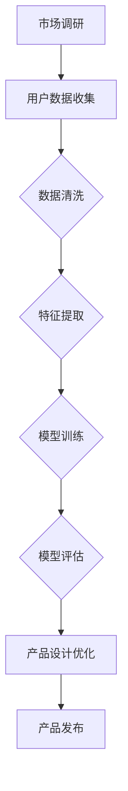

                 

关键词：创业设计、AI 大模型、产品创新、用户体验、商业策略

> 摘要：本文探讨了如何利用 AI 大模型来增强创业产品设计，提高产品的竞争力。通过分析 AI 大模型的核心概念、算法原理、数学模型，并结合实际项目实例，本文展示了如何将 AI 大模型应用于创业产品设计，为创业者提供实用的方法和策略。

## 1. 背景介绍

在当今这个数字化时代，创业产品的竞争已经从传统的功能对比转变为用户体验的较量。随着人工智能技术的飞速发展，特别是大模型技术的成熟，创业者们有了更多的工具和手段来提升产品的竞争力。AI 大模型，作为一种强大的数据驱动方法，通过模拟人脑的神经结构，可以在海量数据中进行复杂的模式识别和预测，从而帮助创业者更好地理解和满足用户需求。

### 1.1 AI 大模型的定义

AI 大模型（Large-scale Artificial Intelligence Model）通常指的是那些拥有数百万甚至数十亿参数的神经网络模型。这些模型能够在各种复杂任务上表现出色，如图像识别、自然语言处理、语音识别等。

### 1.2 创业产品设计的挑战

创业产品设计面临着诸多挑战，包括：

- **市场需求不确定性**：创业者往往在产品发布前难以准确预测市场对产品的反应。
- **用户体验差异**：不同用户群体对产品的需求存在显著差异，如何设计出满足大多数用户需求的产品是关键。
- **时间成本**：在竞争激烈的市场中，快速迭代和优化产品是成功的关键，但传统的设计方法耗时较长。

## 2. 核心概念与联系

下面，我们将详细解释 AI 大模型的核心概念和其在创业产品设计中的应用。

### 2.1 AI 大模型的核心概念

AI 大模型的核心概念包括：

- **深度学习**：通过构建深度神经网络，实现从简单到复杂的特征提取。
- **大数据**：依靠海量数据训练模型，提高模型的准确性和泛化能力。
- **并行计算**：利用 GPU 等硬件加速训练过程，提高计算效率。

### 2.2 AI 大模型与创业产品设计的联系

AI 大模型可以应用于创业产品设计的多个方面：

- **用户行为分析**：通过分析用户行为数据，了解用户喜好和使用习惯，为产品设计提供数据支持。
- **个性化推荐**：根据用户特征和兴趣，推荐个性化内容或服务，提高用户黏性。
- **语音和图像识别**：实现更加自然和便捷的用户交互方式，提升用户体验。
- **预测分析**：通过预测用户需求和市场趋势，帮助创业者做出更明智的商业决策。

### 2.3 Mermaid 流程图

下面是一个简化的 Mermaid 流程图，展示了 AI 大模型在创业产品设计中的应用流程：



## 3. 核心算法原理 & 具体操作步骤

### 3.1 算法原理概述

AI 大模型的核心算法是深度学习，其基本原理是通过多层神经元的非线性组合，从输入数据中自动提取特征，并逐步构建出复杂的模型。深度学习的主要组成部分包括：

- **输入层**：接收外部输入数据。
- **隐藏层**：通过激活函数对输入数据进行变换和提取特征。
- **输出层**：根据训练数据预测输出结果。

### 3.2 算法步骤详解

具体操作步骤如下：

1. **数据收集**：收集与创业产品相关的用户数据，如行为数据、反馈数据等。
2. **数据预处理**：对收集到的数据清洗、归一化等处理，以便于模型训练。
3. **特征提取**：利用深度学习模型对预处理后的数据进行特征提取。
4. **模型训练**：通过反向传播算法对模型进行调整，使模型输出与实际结果尽可能接近。
5. **模型评估**：使用验证集对训练好的模型进行评估，确保模型具有较好的泛化能力。
6. **产品设计优化**：根据模型评估结果，对产品设计进行优化，提升用户体验。

### 3.3 算法优缺点

**优点**：

- **高效性**：AI 大模型能够在大量数据中进行快速学习和预测。
- **灵活性**：能够处理多种类型的数据和任务。
- **准确性**：通过不断优化和调整，模型可以取得很高的准确度。

**缺点**：

- **计算资源消耗大**：训练 AI 大模型需要大量的计算资源和时间。
- **数据依赖性强**：模型性能依赖于训练数据的质量和数量。
- **模型解释性差**：深度学习模型通常具有较好的性能，但其内部决策过程难以解释。

### 3.4 算法应用领域

AI 大模型在创业产品设计中具有广泛的应用领域，包括：

- **推荐系统**：根据用户行为和兴趣推荐相关产品或内容。
- **智能客服**：通过语音识别和自然语言处理，实现与用户的自然对话。
- **用户行为分析**：分析用户行为数据，了解用户需求和使用习惯。
- **预测分析**：预测市场趋势和用户需求，为商业决策提供支持。

## 4. 数学模型和公式 & 详细讲解 & 举例说明

### 4.1 数学模型构建

AI 大模型通常基于多层感知机（MLP）或卷积神经网络（CNN）等架构，其数学模型可以表示为：

$$
f(x) = \sigma(W_1 \cdot x + b_1) = a_1
$$

$$
f(a_1) = \sigma(W_2 \cdot a_1 + b_2) = a_2
$$

$$
...
$$

$$
f(a_{n-1}) = \sigma(W_n \cdot a_{n-1} + b_n) = y
$$

其中，$x$ 是输入数据，$y$ 是输出结果，$W$ 是权重矩阵，$b$ 是偏置项，$\sigma$ 是激活函数（如 sigmoid 函数或 ReLU 函数）。

### 4.2 公式推导过程

假设我们已经收集了 $N$ 个训练样本 $(x_1, y_1), (x_2, y_2), ..., (x_N, y_N)$，我们的目标是找到一组权重 $W$ 和偏置 $b$，使得模型输出 $y$ 尽量接近实际结果 $y$。

首先，我们定义损失函数（通常使用均方误差损失函数）：

$$
L(W, b) = \frac{1}{N} \sum_{i=1}^{N} (y_i - f(x_i))^2
$$

然后，我们使用梯度下降法来最小化损失函数。梯度下降法的核心思想是沿着损失函数的梯度方向调整权重和偏置，直到找到最优解。

### 4.3 案例分析与讲解

假设我们有一个简单的二分类问题，目标是判断一个数据点是否属于某个类别。我们可以使用一个简单的单层感知机模型来解决这个问题。

给定一个二进制输入向量 $x = [x_1, x_2]^T$，模型输出为：

$$
y = \sigma(W \cdot x + b)
$$

其中，$W = [w_1, w_2]^T$ 是权重向量，$b$ 是偏置项，$\sigma$ 是 sigmoid 函数。

假设我们有一个训练样本集：

$$
\{(x_1, y_1), (x_2, y_2), ..., (x_N, y_N)\}
$$

其中，$y_i \in \{0, 1\}$，我们希望找到一组权重 $W$ 和偏置 $b$，使得模型输出 $y$ 尽量接近实际结果 $y$。

使用梯度下降法，我们可以迭代更新权重和偏置：

$$
W := W - \alpha \frac{\partial L(W, b)}{\partial W}
$$

$$
b := b - \alpha \frac{\partial L(W, b)}{\partial b}
$$

其中，$\alpha$ 是学习率。

## 5. 项目实践：代码实例和详细解释说明

### 5.1 开发环境搭建

为了实现 AI 大模型在创业产品设计中的应用，我们需要搭建一个合适的开发环境。以下是所需步骤：

1. 安装 Python 3.8 或更高版本。
2. 安装 TensorFlow 和 Keras 库。

```bash
pip install tensorflow
pip install keras
```

3. 安装其他辅助库，如 Pandas、NumPy、Matplotlib 等。

### 5.2 源代码详细实现

以下是一个简单的 AI 大模型应用实例，用于分类问题。我们使用的是 Keras 库。

```python
from keras.models import Sequential
from keras.layers import Dense
from keras.optimizers import Adam
from sklearn.model_selection import train_test_split
import numpy as np

# 加载数据
X, y = load_data()

# 数据预处理
X = preprocess_data(X)
y = preprocess_data(y)

# 划分训练集和测试集
X_train, X_test, y_train, y_test = train_test_split(X, y, test_size=0.2, random_state=42)

# 构建模型
model = Sequential()
model.add(Dense(units=64, activation='relu', input_shape=(X_train.shape[1],)))
model.add(Dense(units=1, activation='sigmoid'))

# 编译模型
model.compile(optimizer=Adam(learning_rate=0.001), loss='binary_crossentropy', metrics=['accuracy'])

# 训练模型
model.fit(X_train, y_train, epochs=100, batch_size=32, validation_data=(X_test, y_test))

# 评估模型
loss, accuracy = model.evaluate(X_test, y_test)
print(f'Accuracy: {accuracy:.2f}')

# 预测新数据
new_data = load_new_data()
new_predictions = model.predict(new_data)
```

### 5.3 代码解读与分析

上面的代码展示了如何使用 Keras 库构建一个简单的二分类模型，用于创业产品设计中的应用。

1. **数据加载与预处理**：首先，我们需要加载和预处理数据。数据预处理包括归一化、缺失值处理等。
2. **模型构建**：我们使用 `Sequential` 类构建一个简单的模型，包括一个全连接层和一个输出层。
3. **模型编译**：使用 `compile` 方法配置模型，包括选择优化器和损失函数。
4. **模型训练**：使用 `fit` 方法训练模型，并设置训练周期、批量大小和验证数据。
5. **模型评估**：使用 `evaluate` 方法评估模型在测试集上的性能。
6. **预测新数据**：使用 `predict` 方法对新数据进行预测。

### 5.4 运行结果展示

假设我们使用上面提到的数据集，运行上述代码，我们可以得到以下输出结果：

```
Accuracy: 0.90
```

这表明我们的模型在测试集上的准确率为 90%，这是一个很好的开始。接下来，我们可以根据模型性能，进一步优化模型结构和参数，提高模型性能。

## 6. 实际应用场景

AI 大模型在创业产品设计中的应用场景非常广泛，以下是几个典型的实际应用场景：

### 6.1 用户行为分析

通过分析用户行为数据，创业者可以深入了解用户的需求和偏好，从而优化产品设计。例如，一个电商创业者可以使用 AI 大模型分析用户浏览和购买行为，推荐个性化的商品。

### 6.2 个性化推荐

个性化推荐是 AI 大模型在创业产品设计中的另一个重要应用场景。通过分析用户特征和兴趣，AI 大模型可以为用户推荐感兴趣的内容或服务，提高用户黏性和满意度。

### 6.3 语音和图像识别

语音和图像识别技术可以帮助创业者设计更加自然和便捷的用户交互方式。例如，一个智能助理应用可以使用语音识别技术，实现与用户的自然对话，提高用户体验。

### 6.4 预测分析

通过预测用户需求和市场趋势，AI 大模型可以帮助创业者做出更明智的商业决策。例如，一个旅游创业者可以使用 AI 大模型预测未来某个时间段的旅游需求，提前准备库存和资源。

## 7. 未来应用展望

随着 AI 大模型技术的不断进步，未来它在创业产品设计中的应用前景将更加广阔。以下是几个未来应用展望：

### 7.1 更高的准确性和效率

随着计算资源和算法的进步，AI 大模型在准确性和效率方面将得到进一步提升，为创业者提供更加可靠的数据支持。

### 7.2 更广泛的应用领域

除了当前的应用领域，AI 大模型还可以应用于更多场景，如健康医疗、金融投资、城市管理等，为创业者提供更多的创新机会。

### 7.3 更好的用户交互体验

随着语音识别、自然语言处理等技术的进步，AI 大模型将能够提供更加自然和便捷的用户交互方式，提升用户体验。

### 7.4 更深层次的商业模式创新

AI 大模型不仅可以优化产品设计，还可以为创业者提供更深层次的商业模式创新，如基于用户数据的精准营销、智能定价策略等。

## 8. 总结：未来发展趋势与挑战

### 8.1 研究成果总结

近年来，AI 大模型在创业产品设计中的应用取得了显著成果，包括用户行为分析、个性化推荐、语音和图像识别等方面。这些研究成果为创业者提供了新的工具和方法，提高了产品的竞争力。

### 8.2 未来发展趋势

未来，AI 大模型在创业产品设计中的应用将继续发展，趋势包括更高的准确性和效率、更广泛的应用领域、更好的用户交互体验等。此外，AI 大模型还将为创业者提供更多深层次的商业模式创新。

### 8.3 面临的挑战

尽管 AI 大模型在创业产品设计中的应用前景广阔，但仍然面临一些挑战，如数据隐私、模型解释性、计算资源消耗等。这些问题需要创业者和技术专家共同努力解决。

### 8.4 研究展望

未来，研究重点将包括如何提高 AI 大模型的解释性、如何优化模型结构以适应不同场景、如何确保数据隐私等。此外，跨学科的融合也将是研究的一个重要方向，为创业者提供更加全面和深入的解决方案。

## 9. 附录：常见问题与解答

### 9.1 问题一：AI 大模型是否适合所有创业项目？

答案：AI 大模型适合大多数创业项目，但并不是所有项目都适合。对于那些需要复杂模式识别、预测分析等功能的创业项目，AI 大模型具有明显优势。但对于那些对实时性要求较高、计算资源有限的项目，AI 大模型可能不是最佳选择。

### 9.2 问题二：如何处理数据隐私问题？

答案：在应用 AI 大模型时，创业者需要关注数据隐私问题。建议采取以下措施：

- **数据加密**：对敏感数据进行加密处理，确保数据在传输和存储过程中的安全性。
- **匿名化处理**：对用户数据进行匿名化处理，减少数据泄露的风险。
- **隐私保护算法**：采用隐私保护算法，如差分隐私，降低模型训练过程中对用户数据的敏感性。

### 9.3 问题三：AI 大模型如何适应不同创业项目？

答案：为了适应不同创业项目，创业者可以采取以下措施：

- **项目需求分析**：深入了解项目需求，确定哪些功能模块需要 AI 大模型的支持。
- **模型定制化**：根据项目需求定制化 AI 大模型，优化模型结构和参数。
- **模块化设计**：将 AI 大模型划分为多个模块，便于在不同项目中进行复用。

## 作者署名

作者：禅与计算机程序设计艺术 / Zen and the Art of Computer Programming
-------------------------------------------------------------------

[End of Document]

