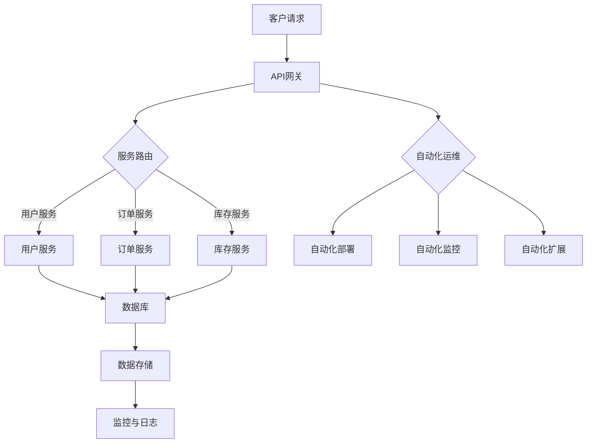

                 

关键词：云原生，架构，业务创新，创业公司，微服务，容器化，持续交付，DevOps

> 摘要：本文旨在探讨创业公司在采用云原生架构进行应用开发和部署时，如何通过微服务、容器化、持续交付和DevOps等关键技术实现业务创新。文章首先介绍了云原生架构的核心概念，随后详细分析了创业公司采用云原生架构的优势和实践方法，最后对未来的发展趋势和挑战进行了展望。

## 1. 背景介绍

在数字化转型的浪潮下，创业公司面临着日益激烈的市场竞争和技术变革。如何快速响应市场需求，实现业务创新，成为了创业公司成功的关键因素。云原生（Cloud Native）作为一种新兴的软件开发和部署范式，正逐渐成为企业数字化转型的重要工具。云原生架构的核心思想是将应用程序构建为微服务，采用容器化技术，实现持续交付和自动化运维，从而提高开发效率、增强业务敏捷性和可扩展性。

## 2. 核心概念与联系

### 2.1 云原生架构

云原生架构（Cloud Native Architecture）是一种利用和扩展云计算优势的软件开发和运行方式。其核心特征包括：

- **微服务**：将应用程序划分为独立的、细粒度的服务，每个服务负责一个特定的业务功能。
- **容器化**：使用容器（如Docker）对应用程序及其运行环境进行封装，实现应用程序的轻量级、可移植性和高效运行。
- **持续交付**：通过自动化工具实现应用程序的持续集成、测试和部署，缩短开发周期，提高交付质量。
- **DevOps**：结合开发和运维的流程，实现快速迭代和高效协作。

### 2.2 核心概念原理与架构

下面是一个简化的云原生架构流程图，展示了各个核心概念之间的联系。



### 2.3 云原生架构的优势

- **敏捷性**：通过微服务和容器化，实现快速迭代和部署，提高业务响应速度。
- **可扩展性**：基于容器和自动化工具，实现横向扩展和弹性伸缩，满足业务需求。
- **高可用性**：通过分布式架构和自动化运维，提高系统的可靠性和容错能力。
- **成本效益**：优化资源利用率，降低基础设施成本。

## 3. 核心算法原理 & 具体操作步骤

### 3.1 算法原理概述

在云原生架构中，核心算法主要包括服务发现、负载均衡、自动扩展等。以下是这些算法的基本原理：

- **服务发现**：当应用程序启动时，需要发现并连接到其他服务。服务发现算法通过注册表或配置文件实现服务的自动发现和注册。
- **负载均衡**：在多实例环境中，负载均衡算法根据当前负载情况将请求分配到不同的实例上，实现资源的合理利用。
- **自动扩展**：根据系统负载和性能指标，自动增加或减少实例数量，实现系统的动态扩展。

### 3.2 算法步骤详解

以下是云原生架构中核心算法的具体操作步骤：

#### 3.2.1 服务发现

1. 应用程序启动时，向服务注册中心注册自身信息。
2. 服务注册中心维护一个服务列表，供其他应用程序查询。
3. 应用程序通过服务注册中心查询所需的服务地址。

#### 3.2.2 负载均衡

1. 负载均衡器接收来自客户端的请求。
2. 根据当前负载情况，选择一个实例进行处理。
3. 将请求转发到所选实例。

#### 3.2.3 自动扩展

1. 监控系统性能指标（如CPU使用率、内存使用率、响应时间）。
2. 根据预设条件（如CPU使用率高于80%），启动自动扩展流程。
3. 创建新的实例，并将其加入负载均衡器。

### 3.3 算法优缺点

#### 3.3.1 服务发现

- **优点**：提高服务之间的可发现性和可访问性，降低开发难度。
- **缺点**：需要额外维护服务注册中心，可能增加系统复杂度。

#### 3.3.2 负载均衡

- **优点**：优化资源利用，提高系统性能。
- **缺点**：可能引入网络延迟，增加系统复杂度。

#### 3.3.3 自动扩展

- **优点**：提高系统弹性，满足业务需求。
- **缺点**：需要额外维护监控和自动化工具，可能增加系统成本。

### 3.4 算法应用领域

- **Web应用**：实现高性能、高可用性的分布式架构。
- **微服务**：优化服务之间的通信和资源利用。
- **容器编排**：实现容器集群的管理和调度。

## 4. 数学模型和公式 & 详细讲解 & 举例说明

### 4.1 数学模型构建

在云原生架构中，数学模型主要用于描述系统的性能指标和负载情况。以下是一个简化的数学模型：

$$
P = \frac{CPU_{使用率}}{CPU_{总量}} \times \frac{内存_{使用率}}{内存_{总量}} \times \frac{网络_{吞吐量}}{网络_{带宽}}
$$

其中，$P$ 表示系统的综合性能指标，$CPU_{使用率}$、$内存_{使用率}$ 和 $网络_{吞吐量}$ 分别表示 CPU、内存和网络的使用情况，$CPU_{总量}$、$内存_{总量}$ 和 $网络_{带宽}$ 分别表示系统资源的总量。

### 4.2 公式推导过程

$$
P = \frac{CPU_{使用率}}{CPU_{总量}} \times \frac{内存_{使用率}}{内存_{总量}} \times \frac{网络_{吞吐量}}{网络_{带宽}}
$$

1. CPU 使用率：表示 CPU 的使用程度，取值范围为 [0, 1]。
2. 内存使用率：表示内存的使用程度，取值范围为 [0, 1]。
3. 网络吞吐量：表示网络传输速率，单位为字节/秒。
4. 网络带宽：表示网络的最大传输速率，单位为字节/秒。

### 4.3 案例分析与讲解

假设一个系统有 4 个 CPU 核心、8GB 内存和 1Gbps 网络带宽。在某时刻，CPU 使用率为 80%，内存使用率为 60%，网络吞吐量为 800Mbps。根据上述公式，计算系统的综合性能指标：

$$
P = \frac{0.8}{4} \times \frac{0.6}{8} \times \frac{800}{1000} = 0.06
$$

系统的综合性能指标为 0.06，表示系统当前性能较好。

## 5. 项目实践：代码实例和详细解释说明

### 5.1 开发环境搭建

1. 安装 Docker：在系统中安装 Docker 引擎，用于容器化应用程序。
2. 安装 Kubernetes：安装 Kubernetes 集群，用于容器编排和管理。
3. 安装 istio：安装 Istio 服务网格，用于服务发现、负载均衡和监控。

### 5.2 源代码详细实现

以下是一个简单的微服务项目示例，包括用户服务、订单服务和库存服务。

#### 用户服务（User Service）

```java
@RestController
@RequestMapping("/users")
public class UserService {
    
    @Autowired
    private UserRepository userRepository;
    
    @GetMapping("/{id}")
    public User getUser(@PathVariable Long id) {
        return userRepository.findById(id).orElseThrow(() -> new ResourceNotFoundException("User not found"));
    }
    
    @PostMapping("/")
    public User createUser(@RequestBody User user) {
        return userRepository.save(user);
    }
    
}
```

#### 订单服务（Order Service）

```java
@RestController
@RequestMapping("/orders")
public class OrderService {
    
    @Autowired
    private OrderRepository orderRepository;
    
    @PostMapping("/")
    public Order createOrder(@RequestBody Order order) {
        return orderRepository.save(order);
    }
    
    @GetMapping("/{id}")
    public Order getOrder(@PathVariable Long id) {
        return orderRepository.findById(id).orElseThrow(() -> new ResourceNotFoundException("Order not found"));
    }
    
}
```

#### 库存服务（Inventory Service）

```java
@RestController
@RequestMapping("/inventory")
public class InventoryService {
    
    @Autowired
    private InventoryRepository inventoryRepository;
    
    @GetMapping("/{productId}")
    public Integer getInventory(@PathVariable Long productId) {
        return inventoryRepository.findById(productId).orElseThrow(() -> new ResourceNotFoundException("Product not found")).getQuantity();
    }
    
    @PostMapping("/{productId}")
    public void updateInventory(@PathVariable Long productId, @RequestBody Integer quantity) {
        Inventory inventory = inventoryRepository.findById(productId).orElseThrow(() -> new ResourceNotFoundException("Product not found"));
        inventory.setQuantity(quantity);
        inventoryRepository.save(inventory);
    }
    
}
```

### 5.3 代码解读与分析

以上代码展示了三个简单的微服务，分别实现了用户管理、订单管理和库存管理功能。每个服务都使用 Spring Boot 框架进行开发，并通过 RESTful API 提供服务接口。

### 5.4 运行结果展示

1. 启动用户服务：`./start-user-service.sh`
2. 启动订单服务：`./start-order-service.sh`
3. 启动库存服务：`./start-inventory-service.sh`
4. 使用 API 进行测试：

```
# 获取用户信息
GET http://localhost:8080/users/1

# 创建订单
POST http://localhost:8080/orders
Content-Type: application/json

{
  "userId": 1,
  "productId": 1,
  "quantity": 2
}

# 查看库存
GET http://localhost:8080/inventory/1
```

## 6. 实际应用场景

### 6.1 在线购物平台

云原生架构使得在线购物平台能够实现快速迭代和高效扩展。例如，微服务架构可以实现商品管理、订单管理、用户管理等功能模块的独立开发、部署和扩展，提高系统的可维护性和可扩展性。

### 6.2 金融交易平台

金融交易平台对系统的性能和可靠性要求极高，云原生架构通过容器化和自动化运维，可以实现快速部署、弹性扩展和高可用性。例如，订单处理、交易匹配、风险控制等功能模块可以独立部署，提高系统的可靠性和可扩展性。

### 6.3 大数据处理

大数据处理通常涉及海量数据的存储、计算和传输，云原生架构可以实现数据的分布式存储和计算，提高系统的性能和可扩展性。例如，数据采集、数据清洗、数据存储等功能模块可以独立部署，实现高效的分布式数据处理。

## 7. 工具和资源推荐

### 7.1 学习资源推荐

1. 《云原生应用架构实战》
2. 《容器化与云原生应用实战》
3. 《Kubernetes实战》

### 7.2 开发工具推荐

1. Docker
2. Kubernetes
3. Istio

### 7.3 相关论文推荐

1. “Cloud Native Computing: Design and Implementation”
2. “Microservices: Designing Fine-Grained Systems”
3. “Containerization and Container-Optimized OS: What’s Next for Modern Applications?”

## 8. 总结：未来发展趋势与挑战

### 8.1 研究成果总结

云原生架构在创业公司中的应用取得了显著的成果，实现了业务敏捷性、可扩展性和高可用性。随着技术的不断发展，云原生架构将进一步提升创业公司的竞争力。

### 8.2 未来发展趋势

1. **服务网格技术**：服务网格（如 Istio）将逐渐成为云原生架构的核心组件，实现服务的安全、监控和流量管理。
2. **无服务器架构**：无服务器架构（如 AWS Lambda）将逐渐取代传统的容器化架构，实现更高效的资源利用和部署。
3. **多云和混合云**：企业将更加关注多云和混合云环境，实现资源的灵活调度和优化。

### 8.3 面临的挑战

1. **技术复杂性**：云原生架构涉及多个技术和组件，企业需要投入更多时间和精力进行学习和部署。
2. **安全性**：云原生架构在安全方面面临新的挑战，需要加强网络安全、数据保护和权限控制。
3. **人才短缺**：云原生架构对开发者和运维人员提出了更高的要求，人才短缺将是一个长期问题。

### 8.4 研究展望

未来，云原生架构将继续向高性能、高可用性和安全性方向发展，为创业公司提供更强大的技术支持。同时，开源社区和企业将加大对云原生技术的投入和研发，推动技术的不断创新和进步。

## 9. 附录：常见问题与解答

### 9.1 什么是云原生？

云原生（Cloud Native）是指一种软件开发和部署范式，它利用云计算的优势，通过微服务、容器化、持续交付和自动化运维等技术，实现应用程序的高效开发和部署。

### 9.2 云原生架构的核心概念是什么？

云原生架构的核心概念包括微服务、容器化、持续交付和DevOps。微服务将应用程序划分为独立的、细粒度的服务，容器化通过Docker等工具实现应用程序的轻量级和可移植性，持续交付通过自动化工具实现应用程序的持续集成、测试和部署，DevOps则结合开发和运维的流程，实现快速迭代和高效协作。

### 9.3 云原生架构的优势是什么？

云原生架构的优势包括敏捷性、可扩展性、高可用性和成本效益。通过微服务和容器化，实现快速迭代和部署，提高业务响应速度；通过分布式架构和自动化运维，实现资源的合理利用和系统的可靠性；通过优化资源利用率，降低基础设施成本。

### 9.4 如何在创业公司中实施云原生架构？

在创业公司中实施云原生架构，首先需要了解并选择适合的云原生技术，如Docker、Kubernetes、Istio等。然后，制定详细的实施计划，包括技术选型、环境搭建、服务拆分、部署和运维等。此外，还需要培养相关的技术人才，推动企业文化和组织结构的变革。

### 9.5 云原生架构是否适用于所有企业？

云原生架构适用于需要快速迭代、可扩展性和高可用性的企业，如互联网公司、金融公司、医疗公司等。对于传统企业，如果业务需求和技术基础不支持云原生架构，可以考虑逐步转型或采用其他技术方案。

### 9.6 云原生架构的安全性问题如何解决？

云原生架构的安全性主要涉及网络安全、数据保护和权限控制等方面。企业可以通过以下措施加强安全性：

1. **网络安全**：使用服务网格（如Istio）实现服务间的安全通信，采用TLS加密协议保护数据传输。
2. **数据保护**：使用加密技术保护敏感数据，定期备份数据，确保数据安全。
3. **权限控制**：采用基于角色的访问控制（RBAC）和细粒度的权限管理，限制对系统和数据的访问。

### 9.7 云原生架构的发展趋势是什么？

云原生架构的发展趋势包括：

1. **服务网格技术**：服务网格将逐渐成为云原生架构的核心组件，实现服务的安全、监控和流量管理。
2. **无服务器架构**：无服务器架构将逐渐取代传统的容器化架构，实现更高效的资源利用和部署。
3. **多云和混合云**：企业将更加关注多云和混合云环境，实现资源的灵活调度和优化。

## 作者署名

作者：禅与计算机程序设计艺术 / Zen and the Art of Computer Programming

