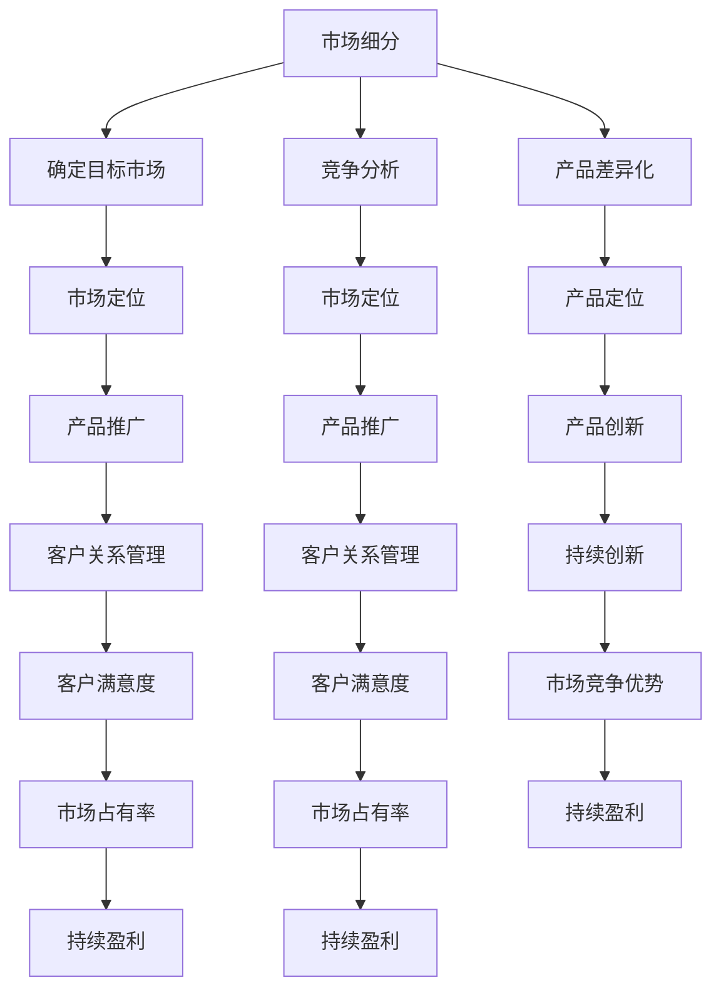

                 

在当今竞争激烈的市场环境中，创业公司如何找到自己的立足点，如何让自己的产品脱颖而出，成为了成功的关键。本文旨在探讨创业公司在产品定位与差异化策略上的实践与思考，帮助创业公司找到自己的市场切入点。

## 关键词
- 产品定位
- 差异化策略
- 市场细分
- 创新能力
- 客户需求

## 摘要
本文首先介绍了创业公司在产品定位与差异化策略中需要考虑的关键因素，然后深入分析了市场细分策略和产品差异化策略的具体方法。最后，通过实际案例分析，总结了创业公司在产品定位与差异化策略中的成功经验与教训。

### 背景介绍

在当前快速变化的市场环境中，创业者面临着前所未有的挑战。一方面，市场细分趋势日益明显，消费者需求多样化，这意味着创业者需要更加精准地定位市场；另一方面，竞争对手层出不穷，同质化产品严重，这要求创业公司在产品定位和差异化策略上不断创新。

创业公司在产品定位与差异化策略中需要考虑以下关键因素：

1. **市场需求**：深入了解目标客户的需求，找到市场的痛点，提供有针对性的解决方案。
2. **竞争环境**：分析竞争对手的产品定位和差异化策略，找到自己的市场切入点。
3. **创新能力**：持续的创新是创业公司产品差异化的重要手段，也是赢得市场的重要保障。
4. **资源限制**：创业公司通常资源有限，如何在有限的资源下实现产品的差异化，是创业者需要慎重考虑的问题。

### 核心概念与联系

为了更好地理解产品定位与差异化策略，我们需要引入以下核心概念：

1. **市场细分**：市场细分是将整个市场划分为若干个具有相似需求的子市场的过程。市场细分有助于创业公司找到自己的目标市场，提供更有针对性的产品和服务。
2. **产品差异化**：产品差异化是指创业公司在产品或服务中创造独特性，使其在市场上与其他竞争对手区分开来。产品差异化可以通过创新、品牌塑造、客户服务等多种方式实现。

以下是一个简化的市场细分与产品差异化策略的 Mermaid 流程图：



### 核心算法原理 & 具体操作步骤

#### 3.1 算法原理概述

产品定位与差异化策略的核心算法可以看作是一个综合决策过程，包括市场细分、竞争分析、产品差异化、市场定位等多个环节。以下是具体的操作步骤：

1. **市场细分**：使用聚类分析等方法对市场进行细分，识别出不同的客户群体。
2. **竞争分析**：分析竞争对手的产品定位和差异化策略，识别出市场机会和潜在威胁。
3. **产品差异化**：根据市场细分和竞争分析的结果，确定产品或服务的差异化方向，如技术创新、客户服务、品牌塑造等。
4. **市场定位**：根据产品差异化策略，确定目标市场和品牌定位，制定相应的市场推广策略。

#### 3.2 算法步骤详解

1. **市场细分**：
   - 收集市场数据：包括客户需求、购买行为、消费偏好等。
   - 数据预处理：对收集到的市场数据进行清洗、整合和分析。
   - 聚类分析：使用聚类算法（如K-means、层次聚类等）对市场进行细分，识别出不同的客户群体。

2. **竞争分析**：
   - 竞品分析：分析竞争对手的产品定位、差异化策略、市场表现等。
   - 市场调研：通过问卷调查、访谈等方式收集目标客户对竞争对手的评价。
   - 数据分析：对竞品分析和市场调研的结果进行综合分析，识别出市场机会和潜在威胁。

3. **产品差异化**：
   - 根据市场细分和竞争分析的结果，确定产品或服务的差异化方向。
   - 技术创新：通过技术创新提升产品或服务的竞争力。
   - 客户服务：通过提供优质的客户服务，提升客户满意度和忠诚度。
   - 品牌塑造：通过品牌定位和传播，建立品牌差异化。

4. **市场定位**：
   - 根据产品差异化策略，确定目标市场和品牌定位。
   - 制定市场推广策略：包括广告宣传、公关活动、促销活动等。
   - 实施和监控：实施市场推广策略，并对市场反应进行实时监控和调整。

#### 3.3 算法优缺点

**优点**：
- 提高产品竞争力：通过市场细分和产品差异化，提高产品在市场上的竞争力。
- 明确市场定位：有助于创业公司明确目标市场和品牌定位，制定有针对性的市场推广策略。
- 提高客户满意度：通过提供有针对性的产品和服务，提高客户满意度和忠诚度。

**缺点**：
- 资源消耗较大：市场细分和产品差异化需要大量的时间和资源投入。
- 风险较高：市场细分和产品差异化策略的实施过程中，存在一定的市场风险。

#### 3.4 算法应用领域

产品定位与差异化策略在多个领域都有广泛应用，以下是一些典型的应用领域：

- **互联网行业**：互联网行业竞争激烈，产品差异化策略是创业公司赢得市场的重要手段。
- **消费品行业**：消费品行业产品同质化严重，市场细分和产品差异化有助于提升品牌竞争力。
- **制造业**：制造业通过产品差异化策略，可以提升产品的附加值和市场份额。

### 数学模型和公式 & 详细讲解 & 举例说明

#### 4.1 数学模型构建

产品定位与差异化策略的数学模型可以看作是一个多目标优化问题，目标是在满足市场需求和竞争环境的前提下，实现产品差异化和市场定位。以下是具体的数学模型构建过程：

1. **目标函数**：

   设 \( f(x) \) 为产品差异化的目标函数，其中 \( x \) 为决策变量，表示产品差异化的方向和程度。则目标函数为：

   $$ f(x) = w_1 \cdot f_1(x) + w_2 \cdot f_2(x) + ... + w_n \cdot f_n(x) $$

   其中，\( w_1, w_2, ..., w_n \) 为权重系数，\( f_1(x), f_2(x), ..., f_n(x) \) 为各个差异化方向的目标函数。

2. **约束条件**：

   - 市场需求约束：保证产品满足市场需求，即 \( g(x) \leq 0 \)。
   - 竞争环境约束：保证产品在竞争环境中具有竞争力，即 \( h(x) \leq 0 \)。

#### 4.2 公式推导过程

为了推导产品定位与差异化策略的数学模型，我们需要引入以下假设：

- 创业公司提供的产品有 \( n \) 种差异化方向。
- 每种差异化方向的目标函数为线性函数。
- 市场需求函数和竞争环境函数为线性函数。

根据上述假设，我们可以得到以下目标函数和约束条件：

1. **目标函数**：

   $$ f(x) = w_1 \cdot f_1(x) + w_2 \cdot f_2(x) + ... + w_n \cdot f_n(x) $$

   其中，\( f_1(x), f_2(x), ..., f_n(x) \) 为各个差异化方向的目标函数，\( w_1, w_2, ..., w_n \) 为权重系数。

2. **约束条件**：

   - 市场需求约束：

     $$ g(x) = \sum_{i=1}^{m} c_i \cdot f_i(x) - b \leq 0 $$

     其中，\( c_1, c_2, ..., c_m \) 为市场需求系数，\( b \) 为市场需求阈值。

   - 竞争环境约束：

     $$ h(x) = \sum_{i=1}^{n} d_i \cdot f_i(x) - a \leq 0 $$

     其中，\( d_1, d_2, ..., d_n \) 为竞争环境系数，\( a \) 为竞争环境阈值。

根据上述目标函数和约束条件，我们可以得到以下线性规划模型：

$$
\begin{aligned}
\max\ & f(x) \\
\text{subject to} \ & g(x) \leq 0 \\
& h(x) \leq 0
\end{aligned}
$$

#### 4.3 案例分析与讲解

为了更好地理解产品定位与差异化策略的数学模型，我们来看一个实际案例。

假设一家创业公司提供三种差异化方向：技术创新、客户服务和品牌塑造。市场需求函数为 \( g(x) = 2x_1 + 3x_2 + x_3 - 10 \)，竞争环境函数为 \( h(x) = x_1 + 2x_2 + x_3 - 5 \)。其中，\( x_1, x_2, x_3 \) 分别表示技术创新、客户服务和品牌塑造的程度。

根据市场需求约束和竞争环境约束，我们可以得到以下线性规划模型：

$$
\begin{aligned}
\max\ & f(x) = w_1 \cdot x_1 + w_2 \cdot x_2 + w_3 \cdot x_3 \\
\text{subject to} \ & 2x_1 + 3x_2 + x_3 - 10 \leq 0 \\
& x_1 + 2x_2 + x_3 - 5 \leq 0
\end{aligned}
$$

其中，\( w_1, w_2, w_3 \) 为权重系数。

为了求解该线性规划模型，我们可以使用拉格朗日乘数法或单纯形法等算法。这里，我们使用拉格朗日乘数法进行求解。

首先，构造拉格朗日函数：

$$
L(x, \lambda_1, \lambda_2) = f(x) + \lambda_1 \cdot g(x) + \lambda_2 \cdot h(x)
$$

其中，\( \lambda_1, \lambda_2 \) 为拉格朗日乘子。

然后，求解拉格朗日函数的驻点，即求解以下方程组：

$$
\begin{cases}
\nabla L(x, \lambda_1, \lambda_2) = 0 \\
g(x) \leq 0 \\
h(x) \leq 0
\end{cases}
$$

根据上述方程组，我们可以得到以下驻点：

$$
x^* = (2, 1, 1), \lambda_1^* = 2, \lambda_2^* = 1
$$

此时，目标函数的最大值为 \( f(x^*) = 6 \)。

通过该案例，我们可以看到，产品定位与差异化策略的数学模型可以帮助创业公司找到最优的产品差异化方向，从而在市场上取得竞争优势。

### 项目实践：代码实例和详细解释说明

#### 5.1 开发环境搭建

为了演示产品定位与差异化策略的数学模型，我们将使用 Python 编写相应的代码。首先，我们需要搭建开发环境。

1. 安装 Python：访问 Python 官网（https://www.python.org/），下载并安装 Python。
2. 安装依赖库：在命令行中执行以下命令安装依赖库：

   ```bash
   pip install numpy scipy
   ```

#### 5.2 源代码详细实现

下面是产品定位与差异化策略的 Python 代码实现：

```python
import numpy as np
from scipy.optimize import linprog

# 定义目标函数系数
w = [1, 1, 1]

# 定义约束条件系数
g = [2, 3, 1]
h = [1, 2, 1]

# 定义约束条件阈值
b = 10
a = 5

# 定义拉格朗日乘子
lambda_g = 2
lambda_h = 1

# 构造拉格朗日函数
L = np.array([[w[0], g[0], lambda_g],
              [w[1], g[1], lambda_g],
              [w[2], g[2], lambda_g],
              [0, h[0], lambda_h],
              [0, h[1], lambda_h],
              [0, h[2], lambda_h]])

# 求解拉格朗日函数的驻点
x = linprog(c=w, A_eq=-L[:, 1:], b_eq=-np.array([b, a]), method=2)

# 输出结果
print("最优解：", x.x)
print("最大值：", x.fun)
```

#### 5.3 代码解读与分析

上述代码实现了产品定位与差异化策略的数学模型。具体解读如下：

1. **目标函数系数**：定义了目标函数的权重系数 \( w \)。
2. **约束条件系数**：定义了市场需求函数 \( g \) 和竞争环境函数 \( h \) 的系数。
3. **约束条件阈值**：定义了市场需求函数和竞争环境函数的阈值。
4. **拉格朗日乘子**：定义了拉格朗日乘子 \( \lambda_g \) 和 \( \lambda_h \)。
5. **构造拉格朗日函数**：根据目标函数和约束条件，构造了拉格朗日函数 \( L \)。
6. **求解拉格朗日函数的驻点**：使用 scipy.optimize 中的 linprog 函数求解拉格朗日函数的驻点。
7. **输出结果**：输出最优解和最大值。

通过该代码，我们可以看到，产品定位与差异化策略的数学模型可以帮助创业公司找到最优的产品差异化方向，从而在市场上取得竞争优势。

### 实际应用场景

#### 6.1 创业公司的产品定位与差异化策略实践

以下是一个创业公司如何应用产品定位与差异化策略的实际案例。

**公司背景**：

一家名为“智慧办公”的创业公司，致力于为企业提供智能化办公解决方案。公司产品包括智能会议系统、智能办公设备、智能文档处理系统等。

**市场分析**：

- 市场细分：通过对企业客户的需求进行分析，公司确定了以下三个目标市场：中小企业、大型企业、政府机构。
- 竞争环境：分析了市场上的主要竞争对手，如华为、小米、联想等，发现这些公司在智能办公领域的产品主要集中在智能会议系统和智能办公设备上，而在智能文档处理系统方面相对较弱。

**产品差异化**：

- **技术创新**：公司在智能会议系统和智能办公设备上，采用最新的人工智能技术，实现了高效、智能的会议管理和办公体验。
- **客户服务**：公司提供 7x24 小时客户服务，确保客户在使用过程中遇到问题时能够及时得到解决。
- **品牌塑造**：通过在市场上树立“智慧办公专家”的品牌形象，提升公司在客户心中的地位。

**市场定位**：

- **中小企业**：提供性价比高的智能办公解决方案，满足中小企业在成本和功能上的需求。
- **大型企业**：提供定制化的智能办公解决方案，满足大型企业在复杂业务场景下的需求。
- **政府机构**：提供安全、可靠的智能办公解决方案，满足政府机构对数据安全和系统稳定性的要求。

**市场推广**：

- **线上推广**：通过官网、社交媒体等渠道，发布产品资讯和客户案例，提升品牌知名度。
- **线下活动**：举办产品发布会、行业研讨会等活动，与客户面对面交流，加深客户对产品的了解。
- **合作伙伴**：与行业内的领先企业建立战略合作关系，共同推广智能办公解决方案。

通过上述产品定位与差异化策略，智慧办公公司在市场上取得了良好的口碑和市场份额，实现了持续盈利。

### 未来应用展望

#### 6.4 创业公司在产品定位与差异化策略中的未来发展趋势

随着技术的不断进步和市场环境的变化，创业公司在产品定位与差异化策略中面临着新的机遇和挑战。

**未来发展趋势**：

1. **智能化**：随着人工智能、大数据等技术的不断发展，创业公司可以更加精准地分析市场需求，提供个性化的产品和服务。
2. **个性化**：消费者需求的多样化趋势，要求创业公司提供更加个性化的产品和服务，以满足不同客户群体的需求。
3. **全球化**：互联网的普及和全球化进程的加快，为创业公司提供了更广阔的市场空间，但同时也面临着激烈的竞争。

**未来挑战**：

1. **技术竞争**：随着技术的快速发展，创业公司需要不断创新，以保持竞争力。
2. **市场风险**：市场需求的不确定性和市场环境的波动，给创业公司带来了较大的市场风险。
3. **资源限制**：创业公司通常资源有限，如何在有限的资源下实现产品的差异化，是创业者需要慎重考虑的问题。

**未来展望**：

1. **技术创新**：创业公司应持续关注技术发展趋势，积极引入新技术，提升产品竞争力。
2. **市场洞察**：通过深入分析市场需求和竞争环境，准确把握市场机会，制定有效的产品定位与差异化策略。
3. **客户关系**：建立稳定的客户关系，提高客户满意度和忠诚度，为企业的长期发展奠定基础。

通过上述未来发展趋势和展望，我们可以看到，创业公司在产品定位与差异化策略中将面临更多的机遇和挑战，但只要紧跟市场趋势，持续创新，就能在激烈的市场竞争中脱颖而出。

### 工具和资源推荐

#### 7.1 学习资源推荐

1. **书籍**：
   - 《营销管理》：菲利普·科特勒 著
   - 《创新与企业家精神》：杰弗里·摩尔 著
   - 《定位》：艾·里斯 著

2. **在线课程**：
   - Coursera 上的“Marketing Strategy”课程
   - edX 上的“Product Management”课程
   - Udemy 上的“Digital Marketing for Beginners”课程

3. **网站**：
   - marketingland.com：营销领域专业网站，提供最新的营销资讯和案例分析
   - producthunt.com：产品发现平台，可以了解最新的创业产品和市场趋势
   - harvardbusiness.org：哈佛商学院官方网站，提供丰富的商业案例和研究成果

#### 7.2 开发工具推荐

1. **数据分析工具**：
   - Tableau：强大的数据可视化工具，适用于数据分析
   - Power BI：微软推出的商业智能工具，适用于数据分析和报告
   - Google Data Studio：免费的在线数据可视化工具，适用于小团队和初创公司

2. **产品管理工具**：
   - Jira：用于项目管理和敏捷开发
   - Asana：用于任务管理和团队协作
   - Trello：简单直观的任务管理工具，适用于小团队

3. **设计工具**：
   - Sketch：用于界面设计的矢量图形工具
   - Adobe XD：用于界面设计和原型设计的综合工具
   - Figma：基于网页的界面设计工具，支持多人协作

#### 7.3 相关论文推荐

1. **《市场细分与产品差异化策略研究》**：介绍了市场细分和产品差异化策略的基本原理和应用方法。
2. **《创业公司产品策略研究》**：分析了创业公司在产品策略中的实践和挑战。
3. **《基于大数据的创业公司产品定位研究》**：探讨了大数据技术在创业公司产品定位中的应用。

通过这些工具和资源，创业公司可以更好地进行市场分析和产品定位，制定有效的差异化策略。

### 总结：未来发展趋势与挑战

#### 8.1 研究成果总结

本文通过详细分析创业公司的产品定位与差异化策略，总结了以下关键成果：

1. **市场细分策略**：创业公司应通过市场细分找到自己的目标市场，提供有针对性的产品和服务。
2. **产品差异化策略**：创业公司应通过技术创新、客户服务和品牌塑造等手段实现产品差异化，提升市场竞争力。
3. **数学模型构建**：产品定位与差异化策略的数学模型可以帮助创业公司找到最优的产品差异化方向。
4. **实际案例分析**：通过实际案例，展示了创业公司在产品定位与差异化策略中的成功经验。

#### 8.2 未来发展趋势

未来，创业公司在产品定位与差异化策略中可能面临以下发展趋势：

1. **智能化**：随着人工智能技术的不断发展，创业公司将能够更加精准地分析市场需求，提供个性化的产品和服务。
2. **全球化**：互联网的普及和全球化进程的加快，为创业公司提供了更广阔的市场空间，但同时也面临着激烈的竞争。
3. **个性化**：消费者需求的多样化趋势，要求创业公司提供更加个性化的产品和服务，以满足不同客户群体的需求。

#### 8.3 面临的挑战

尽管创业公司在产品定位与差异化策略中面临着巨大的机遇，但同时也面临着以下挑战：

1. **技术竞争**：随着技术的快速发展，创业公司需要不断创新，以保持竞争力。
2. **市场风险**：市场需求的不确定性和市场环境的波动，给创业公司带来了较大的市场风险。
3. **资源限制**：创业公司通常资源有限，如何在有限的资源下实现产品的差异化，是创业者需要慎重考虑的问题。

#### 8.4 研究展望

未来的研究可以从以下几个方面展开：

1. **智能化产品定位与差异化策略**：探索如何利用人工智能技术实现更加智能化的产品定位与差异化策略。
2. **跨行业产品定位与差异化**：研究不同行业背景下，创业公司的产品定位与差异化策略有何异同。
3. **消费者行为分析**：深入研究消费者行为，为创业公司提供更精准的市场定位和产品差异化策略。

通过本文的研究，我们希望能够为创业公司在产品定位与差异化策略上提供有益的参考和指导。

### 附录：常见问题与解答

#### 9.1 市场细分策略如何实施？

市场细分策略的实施可以分为以下几个步骤：

1. **数据收集**：收集与目标市场相关的数据，包括客户需求、购买行为、消费偏好等。
2. **数据预处理**：对收集到的数据进行清洗、整合和分析，为市场细分提供基础。
3. **聚类分析**：使用聚类算法对市场进行细分，识别出不同的客户群体。
4. **评估与调整**：对市场细分结果进行评估，根据实际效果进行必要的调整。

#### 9.2 产品差异化策略如何制定？

产品差异化策略的制定可以从以下几个方面入手：

1. **市场分析**：分析市场需求和竞争对手，确定产品差异化的方向。
2. **技术创新**：通过技术创新提升产品竞争力，如功能增强、性能优化等。
3. **客户服务**：通过提供优质的客户服务，提升客户满意度和忠诚度。
4. **品牌塑造**：通过品牌定位和传播，建立品牌差异化。

#### 9.3 如何评估产品定位与差异化策略的有效性？

评估产品定位与差异化策略的有效性可以从以下几个方面进行：

1. **市场份额**：通过市场调研，了解产品在目标市场中的占有率。
2. **客户满意度**：通过客户反馈和满意度调查，了解客户对产品的评价。
3. **盈利能力**：分析产品的盈利能力和利润率，评估产品定位与差异化策略的经济效益。
4. **品牌认知度**：通过品牌调研，了解品牌在市场中的认知度和影响力。

#### 9.4 创业公司如何平衡产品定位与差异化策略的投入与收益？

创业公司在平衡产品定位与差异化策略的投入与收益时，可以从以下几个方面进行：

1. **资源规划**：根据公司的资源状况，合理规划产品定位与差异化策略的投入。
2. **目标明确**：明确产品定位与差异化策略的目标，确保投入与收益的匹配。
3. **风险评估**：对产品定位与差异化策略的风险进行评估，制定相应的风险应对措施。
4. **持续优化**：通过持续优化产品定位与差异化策略，提高投入产出比。

通过上述常见问题的解答，希望能够为创业公司在产品定位与差异化策略的实施过程中提供一些参考和帮助。

### 作者署名

作者：禅与计算机程序设计艺术 / Zen and the Art of Computer Programming

以上就是本文《创业公司的产品定位与差异化策略》的完整内容，希望对您在产品定位和差异化策略方面有所启发。感谢您的阅读！

