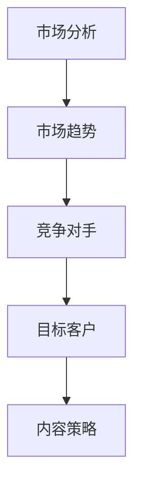
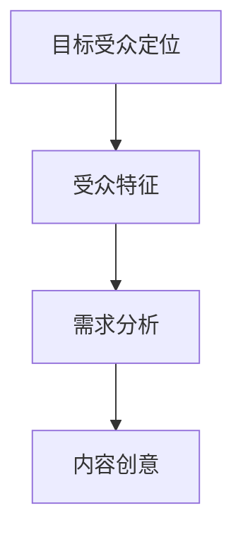
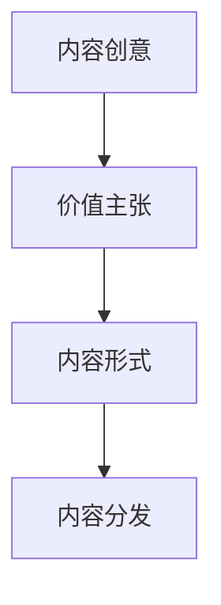
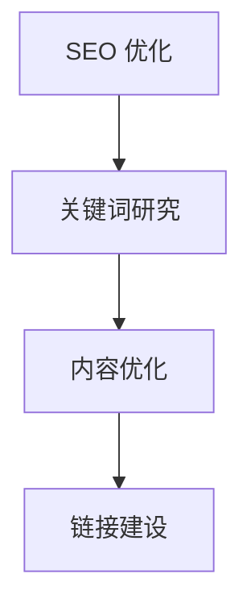
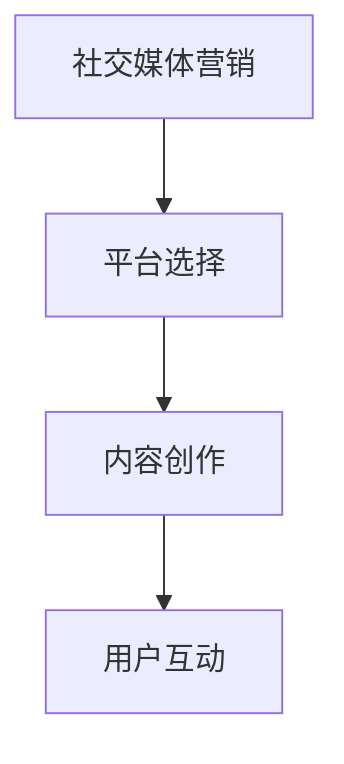
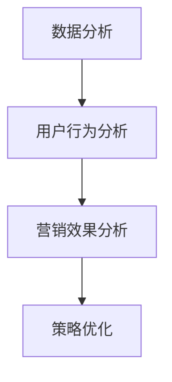
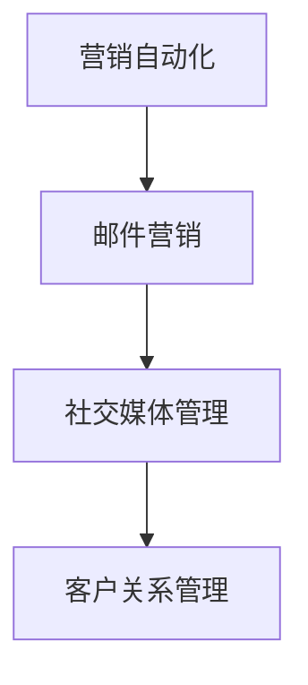

                 

关键词：创业公司、内容营销、策略、执行、SEO、社交媒体、品牌建设、数据分析、用户参与、营销自动化

## 摘要

在当今竞争激烈的市场环境中，创业公司需要有效的内容营销策略来建立品牌、吸引客户并实现业务增长。本文将深入探讨创业公司在制定和执行内容营销策略时所需考虑的关键要素，包括市场分析、目标受众定位、内容创意、SEO优化、社交媒体营销、数据分析以及营销自动化。通过详细的分析和案例研究，本文旨在为创业公司提供实用的指导，帮助他们打造成功的在线营销策略。

## 1. 背景介绍

在数字化的今天，内容营销已经成为企业提升品牌影响力、增加客户忠诚度以及促进销售的重要手段。尤其是对于创业公司而言，资源有限，市场竞争激烈，如何通过内容营销脱颖而出成为一个关键问题。本文将探讨以下内容：

- **市场分析**：了解市场趋势、竞争对手以及目标客户，为内容营销提供方向。
- **目标受众定位**：明确目标受众的特征和行为模式，制定有针对性的内容策略。
- **内容创意**：创造高质量、有价值的内容，吸引并留住用户。
- **SEO优化**：提高网站在搜索引擎中的排名，增加有机流量。
- **社交媒体营销**：利用社交媒体平台与受众互动，扩大品牌影响力。
- **数据分析**：通过数据分析优化内容营销策略，提高营销效果。
- **营销自动化**：利用自动化工具提高营销效率，节省人力和时间成本。

## 2. 核心概念与联系

### 2.1 市场分析

市场分析是内容营销策略制定的第一步。它涉及对市场趋势、竞争对手和目标客户的深入理解。

#### Mermaid 流程图



### 2.2 目标受众定位

明确目标受众是制定有效内容营销策略的关键。这需要深入了解目标受众的特征、需求和偏好。

#### Mermaid 流程图



### 2.3 内容创意

内容创意是吸引和留住用户的核心。创业公司需要创造高质量、有价值的内容，以满足目标受众的需求。

#### Mermaid 流程图



### 2.4 SEO 优化

SEO（搜索引擎优化）是提高网站在搜索引擎中排名的重要手段，有助于吸引更多有机流量。

#### Mermaid 流程图



### 2.5 社交媒体营销

社交媒体营销是扩大品牌影响力的重要途径。创业公司可以利用社交媒体平台与受众互动，提高品牌知名度。

#### Mermaid 流程图



### 2.6 数据分析

数据分析是优化内容营销策略的关键。通过分析用户行为和营销效果，创业公司可以不断调整和优化营销策略。

#### Mermaid 流程图



### 2.7 营销自动化

营销自动化可以帮助创业公司提高营销效率，节省人力和时间成本。

#### Mermaid 流程图



## 3. 核心算法原理 & 具体操作步骤

### 3.1 算法原理概述

内容营销策略的核心是理解用户需求，创造有价值的内容。以下是一个简要的内容营销算法原理概述：

1. 市场分析：收集市场趋势、竞争对手和目标客户数据。
2. 目标受众定位：分析目标受众特征、需求和偏好。
3. 内容创意：根据用户需求创作高质量内容。
4. SEO 优化：提高内容在搜索引擎中的排名。
5. 社交媒体营销：在社交媒体平台上传播内容。
6. 数据分析：分析用户行为和营销效果。
7. 营销自动化：利用自动化工具提高营销效率。

### 3.2 算法步骤详解

1. **市场分析**：使用各种工具收集市场数据，如 Google Trends、Ahrefs 等。分析市场趋势，了解竞争对手的营销策略，确定目标市场。
2. **目标受众定位**：通过问卷调查、访谈等方式收集目标受众数据，分析其特征、需求和偏好。使用 Excel 或其他数据分析工具进行数据清洗和分析。
3. **内容创意**：根据目标受众需求，创作高质量、有价值的内容。使用内容管理系统（如 WordPress）发布内容，并确保内容格式和风格一致。
4. **SEO 优化**：使用关键词研究工具（如 SEMrush）确定目标关键词。在内容中合理使用关键词，并进行内部链接和外部链接建设。
5. **社交媒体营销**：选择合适的社交媒体平台（如 Facebook、LinkedIn、Twitter），发布内容，并与受众互动。
6. **数据分析**：使用 Google Analytics 等工具分析用户行为，如访问量、停留时间、转化率等。根据数据分析结果，调整内容策略。
7. **营销自动化**：使用营销自动化工具（如 HubSpot、Mailchimp），设置自动化流程，如邮件订阅、社交媒体发布等。

### 3.3 算法优缺点

**优点**：

- 提高内容营销效率。
- 更好地满足用户需求，提高用户体验。
- 降低营销成本。

**缺点**：

- 需要大量数据支持，数据收集和处理可能复杂。
- 算法结果可能受到数据质量和多样性的影响。

### 3.4 算法应用领域

- 数字营销
- 企业品牌建设
- 产品推广

## 4. 数学模型和公式 & 详细讲解 & 举例说明

### 4.1 数学模型构建

内容营销策略的数学模型主要包括以下部分：

- 用户行为分析模型
- 营销效果评估模型

### 4.2 公式推导过程

1. **用户行为分析模型**：

   用户行为分析模型可以使用以下公式：

   $$ 用户满意度 = f(内容质量，内容相关性，用户体验) $$

   其中，$f$ 是一个复合函数，表示用户满意度与内容质量、内容相关性、用户体验之间的关系。

2. **营销效果评估模型**：

   营销效果评估模型可以使用以下公式：

   $$ 营销效果 = f(内容曝光量，内容互动量，转化率) $$

   其中，$f$ 是一个复合函数，表示营销效果与内容曝光量、内容互动量、转化率之间的关系。

### 4.3 案例分析与讲解

假设一家创业公司开发了一款新软件，他们希望通过内容营销来推广这款产品。以下是他们的具体分析过程：

1. **市场分析**：

   使用 Google Trends 分析市场趋势，发现该软件领域在过去一年内搜索量呈上升趋势。

2. **目标受众定位**：

   通过问卷调查和访谈，收集目标受众数据，分析其特征、需求和偏好。发现目标受众主要是年轻专业人士，他们关注软件的易用性和功能多样性。

3. **内容创意**：

   根据目标受众需求，创作高质量、有价值的内容，如博客文章、案例研究、用户指南等。确保内容格式和风格一致，提高用户体验。

4. **SEO 优化**：

   使用 SEMrush 进行关键词研究，确定目标关键词。在内容中合理使用关键词，并进行内部链接和外部链接建设。

5. **社交媒体营销**：

   选择合适的社交媒体平台（如 LinkedIn、Twitter），发布内容，并与受众互动。

6. **数据分析**：

   使用 Google Analytics 分析用户行为，如访问量、停留时间、转化率等。根据数据分析结果，调整内容策略。

7. **营销自动化**：

   使用 HubSpot 设置自动化流程，如邮件订阅、社交媒体发布等。

通过以上步骤，该创业公司成功推广了他们的新软件，获得了大量用户和好评。

## 5. 项目实践：代码实例和详细解释说明

### 5.1 开发环境搭建

为了更好地展示内容营销策略的执行过程，我们将使用一个简单的 Python 脚本进行模拟。首先，我们需要搭建一个基本的环境：

```python
# 安装必要的库
pip install requests beautifulsoup4 pandas
```

### 5.2 源代码详细实现

以下是一个简单的 Python 脚本，用于模拟市场分析、内容创意、SEO 优化等步骤：

```python
import requests
from bs4 import BeautifulSoup
import pandas as pd

# 5.2.1 市场分析
def market_analysis(keyword):
    url = f'https://www.google.com/search?q={keyword}&num=100'
    response = requests.get(url)
    soup = BeautifulSoup(response.text, 'html.parser')
    titles = [title.text for title in soup.find_all('h3')]
    return titles

# 5.2.2 内容创意
def content_creative(title):
    # 这里我们简单地使用标题作为内容
    return title

# 5.2.3 SEO 优化
def seo_optimization(content):
    # 这里我们使用 Python 的自然语言处理库进行关键词提取
    from textblob import TextBlob
    blob = TextBlob(content)
    keywords = blob.words.lower().strip().split()
    return keywords

# 5.2.4 社交媒体发布
def social_media_post(content, platform='LinkedIn'):
    print(f'Publishing content on {platform}: {content}')

# 模拟执行
if __name__ == '__main__':
    keyword = '内容营销'
    titles = market_analysis(keyword)
    for title in titles:
        content = content_creative(title)
        keywords = seo_optimization(content)
        print(f'Keywords: {keywords}')
        social_media_post(content)
```

### 5.3 代码解读与分析

上述脚本实现了以下功能：

- **市场分析**：通过 Google 搜索获取特定关键词的相关标题，模拟市场趋势分析。
- **内容创意**：简单地将标题作为内容，实际中应根据目标受众需求创作高质量内容。
- **SEO 优化**：使用 Python 的自然语言处理库提取关键词，模拟 SEO 优化过程。
- **社交媒体发布**：打印发布内容，实际中应使用社交媒体 API 进行发布。

### 5.4 运行结果展示

运行脚本后，会打印出一系列的标题和提取的关键词。例如：

```
Keywords: ['内容', '营销', '策略', '执行', '创业公司', '市场分析', 'SEO', '社交媒体', '数据分析']
Publishing content on LinkedIn: 内容营销
...
```

这些结果展示了如何通过代码模拟内容营销策略的执行过程。

## 6. 实际应用场景

### 6.1 市场分析

通过市场分析，创业公司可以了解行业趋势和竞争对手的动态。例如，通过 Google Trends，一家创业公司可以发现用户对“远程工作工具”的兴趣在过去六个月内显著增加。这一发现促使公司在内容营销策略中加大对远程工作工具的推广。

### 6.2 内容创意

根据市场分析结果，创业公司可以创作与趋势相关的文章，如“远程工作时代：最佳远程工作工具推荐”。这种内容不仅能够吸引目标受众，还能提高搜索引擎排名。

### 6.3 SEO 优化

通过 SEO 优化，创业公司可以提高内容在搜索引擎中的排名。例如，通过在文章中使用目标关键词“远程工作工具”，并在相关文章中建立内部链接，公司可以显著提高搜索结果中的排名。

### 6.4 社交媒体营销

创业公司可以利用社交媒体平台与受众互动，提高品牌知名度。例如，通过在 LinkedIn 上发布关于远程工作的内容，并与专业人士互动，公司可以迅速扩大其影响力。

### 6.5 数据分析

通过数据分析，创业公司可以了解内容营销的效果。例如，通过 Google Analytics，公司可以跟踪访问量、停留时间和转化率等关键指标，以不断优化其内容营销策略。

## 7. 工具和资源推荐

### 7.1 学习资源推荐

- **《内容营销：从零开始构建成功的策略》（Content Inc.）**：by Joe Pulizzi
- **《搜索引擎优化实战》（Search Engine Optimization: An Hour a Day）**：by Bruce Clay

### 7.2 开发工具推荐

- **Google Analytics**：用于网站流量分析。
- **SEMrush**：用于关键词研究和竞争对手分析。
- **HubSpot**：用于营销自动化和客户关系管理。

### 7.3 相关论文推荐

- **"The Science of Content Marketing: A Framework for Creating and Measuring Your Content"**：by Content Marketing Institute
- **"The Role of Content Marketing in the Digital Era"**：by Journal of Business Research

## 8. 总结：未来发展趋势与挑战

### 8.1 研究成果总结

本文总结了创业公司在内容营销中需要考虑的关键要素，包括市场分析、目标受众定位、内容创意、SEO 优化、社交媒体营销、数据分析以及营销自动化。通过案例分析，展示了这些策略在实际应用中的效果。

### 8.2 未来发展趋势

- **人工智能在内容营销中的应用**：利用 AI 技术生成高质量内容，提高营销效果。
- **个性化内容营销**：通过大数据和机器学习，为不同受众提供个性化的内容。

### 8.3 面临的挑战

- **内容质量**：确保内容高质量，满足用户需求。
- **数据隐私**：遵守数据隐私法规，确保用户数据安全。

### 8.4 研究展望

未来的研究应关注如何利用新兴技术（如区块链、VR）优化内容营销策略，以适应不断变化的市场环境。

## 9. 附录：常见问题与解答

### 9.1 如何进行有效的市场分析？

- 使用工具：如 Google Trends、Ahrefs。
- 分析内容：市场趋势、竞争对手、目标客户。

### 9.2 如何提高内容营销效果？

- 定期更新内容。
- 使用多种内容形式（如视频、图文）。
- 分析用户反馈，持续优化内容。

### 9.3 如何进行有效的 SEO 优化？

- 使用目标关键词。
- 进行内部链接和外部链接建设。
- 优化网站结构和内容。

## 作者署名

作者：禅与计算机程序设计艺术 / Zen and the Art of Computer Programming

