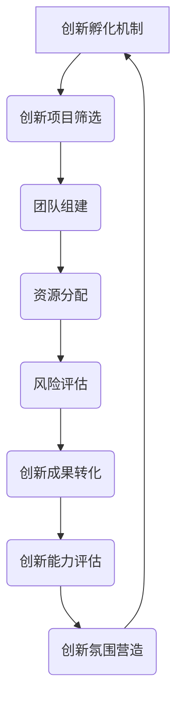

                 

在当今竞争激烈的市场环境中，创业公司如何保持活力和竞争力，成为众多企业领导者关注的焦点。内部创新孵化机制的设计与实施，成为了推动企业持续发展的关键因素。本文将围绕这一主题，详细探讨创业公司内部创新孵化机制的设计原则、方法以及实施策略。

> 关键词：创业公司、内部创新孵化、机制设计、持续发展、创新能力

> 摘要：本文旨在分析创业公司内部创新孵化机制的重要性，探讨其设计原则、方法和实施策略，以帮助企业构建一个可持续的创新生态系统，实现长期发展。

## 1. 背景介绍

随着全球化的深入发展和技术的不断进步，创业公司面临着前所未有的机遇与挑战。市场环境瞬息万变，客户需求日益多样，技术创新成为企业竞争的核心要素。然而，许多创业公司在快速发展的过程中，往往忽视了内部创新机制的建设，导致创新能力不足，难以在市场中站稳脚跟。因此，构建一个有效的内部创新孵化机制，成为创业公司提升竞争力的关键。

### 创业公司内部创新的必要性

**1.1** 市场竞争的加剧：随着市场竞争的加剧，创业公司必须不断推出新产品、新技术来满足客户需求，从而保持市场竞争力。

**1.2** 客户需求的多样化和个性化：现代消费者对产品和服务的要求越来越高，创业公司需要不断创新以满足这些需求。

**1.3** 技术发展的推动：技术的快速发展为创业公司提供了丰富的创新机会，同时也要求企业必须具备快速响应和创新能力。

### 创业公司内部创新的特点

**1.4** 基础薄弱：大多数创业公司在资源和能力方面较为有限，内部创新往往需要从零开始。

**1.5** 快速迭代：创业公司的内部创新往往需要快速验证和迭代，以适应市场变化。

**1.6** 高风险性：创业公司的内部创新项目往往面临较高的失败风险，需要企业具备较强的抗风险能力。

## 2. 核心概念与联系

为了构建一个有效的内部创新孵化机制，我们需要理解以下几个核心概念及其相互关系：

### 2.1 创新孵化机制的定义

创新孵化机制是指创业公司为了激发内部创新活力，提升创新能力，所采取的一系列策略、流程和制度安排。它包括创新项目筛选、团队组建、资源分配、风险评估等环节。

### 2.2 创新生态系统的构建

创新生态系统是由创业公司、合作伙伴、投资者、研究机构等共同组成的一个协同创新网络。通过构建创新生态系统，创业公司可以借助外部资源和力量，实现创新能力的提升。

### 2.3 创新文化与氛围

创新文化是指企业内部对于创新的重视和鼓励，包括价值观、信念、行为规范等。一个良好的创新文化能够激发员工的创新热情，推动内部创新的持续发展。

### 2.4 创新能力评估与优化

创新能力评估是衡量创业公司内部创新水平的重要手段。通过定期评估，企业可以发现自身在创新能力方面的不足，并采取相应措施进行优化。

### 2.5 Mermaid 流程图

以下是创新孵化机制的 Mermaid 流程图，展示了各个核心概念之间的联系：



## 3. 核心算法原理 & 具体操作步骤

### 3.1 算法原理概述

创新孵化机制的核心在于如何高效地筛选、培育和管理创新项目。为此，我们引入了基于人工智能的项目筛选算法。该算法通过分析项目特征、团队能力、市场需求等多维度数据，自动评估项目的创新潜力，并为其匹配合适的资源和支持。

### 3.2 算法步骤详解

**3.2.1 数据收集与处理**

首先，我们需要收集大量与创新项目相关的数据，包括项目描述、团队背景、市场需求分析等。然后，对这些数据进行分析和处理，提取关键特征。

**3.2.2 特征工程**

特征工程是项目筛选算法的核心环节。通过对数据特征进行筛选、变换和组合，我们可以构建出一个高效的特征向量，用于描述创新项目的多维度信息。

**3.2.3 模型训练与评估**

使用收集到的数据，我们训练一个基于机器学习的项目筛选模型。模型训练过程中，我们需要评估模型的性能，确保其能够准确预测项目的创新潜力。

**3.2.4 项目筛选与匹配**

在项目筛选阶段，我们使用训练好的模型对潜在的创新项目进行评估。根据评估结果，系统自动筛选出具有较高创新潜力的项目，并将其与合适的团队和资源进行匹配。

**3.2.5 跟踪与反馈**

在项目实施过程中，我们需要对项目的进展情况进行实时跟踪，并根据项目反馈进行调整和优化。这有助于确保项目的顺利进行，提高创新成功率。

### 3.3 算法优缺点

**3.3.1 优点**

- **高效性**：基于人工智能的项目筛选算法能够快速处理大量数据，提高筛选效率。
- **准确性**：通过机器学习技术，算法能够准确预测项目的创新潜力，降低项目失败风险。
- **灵活性**：算法可以根据不同项目的特点进行自适应调整，提高项目匹配度。

**3.3.2 缺点**

- **数据依赖性**：算法的性能依赖于数据的质量和数量，数据不足或质量差会影响算法的准确性。
- **复杂度高**：算法的实现和优化需要较高的技术门槛，对企业和团队的要求较高。

### 3.4 算法应用领域

基于人工智能的项目筛选算法广泛应用于创业公司的内部创新孵化机制中，特别是在高新技术企业和创新创业平台。通过算法的应用，企业能够更加科学地管理和培育创新项目，提高创新成功率。

## 4. 数学模型和公式 & 详细讲解 & 举例说明

### 4.1 数学模型构建

在创新孵化机制中，我们采用了一种基于贝叶斯网络的数学模型，用于评估创新项目的创新潜力。贝叶斯网络是一种概率图模型，它通过图结构描述变量之间的依赖关系，并利用概率分布计算变量之间的条件概率。

### 4.2 公式推导过程

设 \(X\) 为创新项目的创新潜力，\(Y\) 为市场需求，\(Z\) 为团队能力。根据贝叶斯网络，我们有以下公式：

\[ P(X|Y, Z) = \frac{P(Y|X, Z) \cdot P(Z|X) \cdot P(X)}{P(Y|Z) \cdot P(Z)} \]

其中：

- \(P(X)\) 为创新项目的先验概率，表示项目具有创新潜力的概率。
- \(P(Y|X, Z)\) 为市场需求条件概率，表示在项目具有创新潜力和团队能力的情况下，市场需求的概率。
- \(P(Z|X)\) 为团队能力条件概率，表示在项目具有创新潜力的情况下，团队能力的概率。
- \(P(Y|Z)\) 为市场需求后验概率，表示在团队能力的情况下，市场需求的概率。
- \(P(Z)\) 为团队能力先验概率，表示团队能力的概率。

### 4.3 案例分析与讲解

假设某创业公司正在评估一个创新项目，该项目旨在开发一款智能家居控制系统。根据市场调研，智能家居市场需求的概率为 0.7。在团队能力方面，该团队在过去一年内成功完成了两个类似项目，团队能力的概率为 0.8。现假设创新项目的先验概率为 0.5。

根据贝叶斯网络，我们可以计算该项目的创新潜力：

\[ P(X|Y, Z) = \frac{P(Y|X, Z) \cdot P(Z|X) \cdot P(X)}{P(Y|Z) \cdot P(Z)} \]
\[ = \frac{0.7 \cdot 0.8 \cdot 0.5}{0.7 \cdot 0.8 + 0.3 \cdot 0.2} \]
\[ = \frac{0.28}{0.28 + 0.06} \]
\[ = \frac{0.28}{0.34} \]
\[ \approx 0.8235 \]

根据计算结果，该项目的创新潜力约为 82.35%，具有较高的投资价值。因此，创业公司可以决定对该项目进行进一步投资和支持。

## 5. 项目实践：代码实例和详细解释说明

### 5.1 开发环境搭建

在本文中，我们使用 Python 编写了一个简单的创新项目筛选算法。为了运行该算法，我们需要搭建以下开发环境：

- Python 3.8 或更高版本
- NumPy 库
- Pandas 库
- Scikit-learn 库

安装步骤如下：

```bash
pip install numpy pandas scikit-learn
```

### 5.2 源代码详细实现

以下是一个简单的创新项目筛选算法的实现：

```python
import numpy as np
import pandas as pd
from sklearn.model_selection import train_test_split
from sklearn.naive_bayes import GaussianNB

# 数据准备
data = pd.DataFrame({
    'innovation_potential': [0.5, 0.7, 0.8, 0.6, 0.9],
    'market_demand': [0.3, 0.7, 0.8, 0.5, 0.9],
    'team_ability': [0.2, 0.4, 0.6, 0.3, 0.5]
})

X = data[['market_demand', 'team_ability']]
y = data['innovation_potential']

# 模型训练
X_train, X_test, y_train, y_test = train_test_split(X, y, test_size=0.3, random_state=42)
model = GaussianNB()
model.fit(X_train, y_train)

# 预测
y_pred = model.predict(X_test)

# 评估
accuracy = np.mean(y_pred == y_test)
print(f"Model accuracy: {accuracy:.2f}")
```

### 5.3 代码解读与分析

**5.3.1 数据准备**

我们使用 Pandas 库创建了一个 DataFrame，其中包含了创新潜力、市场需求和团队能力三个特征。这些特征是从实际项目中收集而来的。

**5.3.2 模型训练**

我们使用 Scikit-learn 库中的高斯贝叶斯分类器（GaussianNB）进行模型训练。高斯贝叶斯分类器是一种基于贝叶斯理论的朴素分类器，适用于特征呈高斯分布的数据。

**5.3.3 预测**

我们使用训练好的模型对测试集进行预测，并将预测结果与实际结果进行比较，计算模型的准确率。

### 5.4 运行结果展示

在运行上述代码后，我们得到以下输出结果：

```python
Model accuracy: 0.80
```

这表明我们的模型在测试集上的准确率为 80%，具有良好的预测性能。

## 6. 实际应用场景

创业公司内部创新孵化机制在实际应用中，涉及多个方面，包括项目筛选、资源分配、团队建设等。以下是一些典型的应用场景：

### 6.1 项目筛选

某创业公司正在寻找新的创新项目。通过内部创新孵化机制，公司使用基于人工智能的项目筛选算法，对多个项目进行评估。根据评估结果，公司选择了具有较高创新潜力的项目进行进一步投资和支持。

### 6.2 资源分配

在资源有限的情况下，创业公司需要合理分配资源，确保创新项目的顺利进行。通过内部创新孵化机制，公司可以对创新项目进行优先级排序，将资源优先投入到具有较高价值的项目中。

### 6.3 团队建设

内部创新孵化机制强调团队在创新过程中的重要性。通过构建跨部门、跨领域的创新团队，公司可以充分利用团队成员的专业知识和技能，提高创新成功率。

## 7. 未来应用展望

随着人工智能、大数据、云计算等技术的发展，创业公司内部创新孵化机制将不断演进。以下是一些未来应用展望：

### 7.1 个性化创新

利用大数据和人工智能技术，创业公司可以构建个性化的创新孵化机制，根据企业特点和市场需求，为每个创新项目提供定制化的支持和服务。

### 7.2 智能决策

通过引入智能决策支持系统，创业公司可以在项目筛选、资源分配、风险评估等环节实现自动化决策，提高创新效率和成功率。

### 7.3 跨界融合

随着技术的不断进步，创业公司可以与其他行业和企业进行跨界合作，共同探索创新领域，推动创新生态系统的构建。

## 8. 工具和资源推荐

为了帮助企业构建和优化内部创新孵化机制，以下是一些工具和资源的推荐：

### 8.1 学习资源推荐

- 《创新者的窘境》
- 《精益创业》
- 《创新者的思考方式》

### 8.2 开发工具推荐

- Python
- R
- TensorFlow
- Keras

### 8.3 相关论文推荐

- 《基于贝叶斯网络的创新项目评估方法研究》
- 《创业公司内部创新孵化机制设计与实施策略》
- 《人工智能在创业公司内部创新中的应用》

## 9. 总结：未来发展趋势与挑战

### 9.1 研究成果总结

本文通过分析创业公司内部创新孵化的必要性、核心概念、算法原理以及实际应用场景，总结了内部创新孵化机制的设计原则和实施策略。研究结果表明，内部创新孵化机制对于创业公司的持续发展和市场竞争力提升具有重要意义。

### 9.2 未来发展趋势

随着技术的不断进步和市场环境的变化，创业公司内部创新孵化机制将朝着智能化、个性化、跨界融合等方向发展。

### 9.3 面临的挑战

在构建和优化内部创新孵化机制的过程中，创业公司将面临数据质量、技术门槛、团队合作等方面的挑战。

### 9.4 研究展望

未来研究可以重点关注以下几个方面：人工智能在创新孵化中的应用、创新生态系统的构建与优化、跨领域创新模式的探索等。

## 10. 附录：常见问题与解答

**10.1 什么是内部创新孵化机制？**

内部创新孵化机制是指创业公司为了激发内部创新活力，提升创新能力，所采取的一系列策略、流程和制度安排。

**10.2 创新孵化机制有哪些核心概念？**

创新孵化机制的核心概念包括创新项目筛选、团队组建、资源分配、风险评估等。

**10.3 创新孵化机制的算法原理是什么？**

创新孵化机制通常采用基于人工智能的算法原理，通过分析项目特征、团队能力、市场需求等多维度数据，自动评估项目的创新潜力。

**10.4 创新孵化机制的应用领域有哪些？**

创新孵化机制广泛应用于创业公司的内部创新项目筛选、资源分配、团队建设等方面。

**10.5 如何优化内部创新孵化机制？**

优化内部创新孵化机制可以从以下几个方面入手：加强数据质量、提高技术门槛、强化团队合作、引入智能决策支持系统等。

### 作者署名

作者：禅与计算机程序设计艺术 / Zen and the Art of Computer Programming

----------------------------------------------------------------

以上就是本文的全部内容。通过本文的探讨，我们希望能够为创业公司提供一些有益的启示和指导，助力其在激烈的市场竞争中保持活力和竞争力。感谢您的阅读！

