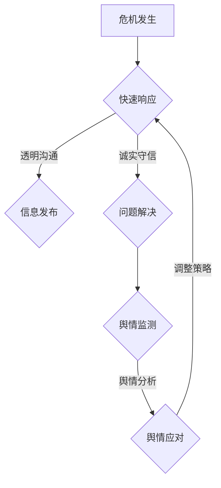

                 

 

### 1. 背景介绍

在当今信息爆炸的时代，创业公司面临着比以往更多的挑战，其中之一便是如何处理危机公关与舆情管理。危机公关是指企业在面临负面事件或危机时，采取的一系列应对措施，以减轻或消除危机对企业声誉的影响。舆情管理则是通过监测、分析和管理公众意见，确保企业形象和品牌价值的稳定。对于创业公司而言，这两者尤为关键，因为它们往往资金有限、资源不足，且品牌知名度较低，一旦遭遇危机，很容易陷入困境。

危机公关与舆情管理的目标一致，即维护企业声誉和品牌形象。然而，两者的侧重点不同。危机公关主要关注突发事件的处理，包括问题的解决、信息的发布和舆论的引导；而舆情管理则侧重于长期的、系统的品牌建设，包括公众意见的收集、分析和应对。在危机公关与舆情管理中，数据分析和人工智能技术发挥着越来越重要的作用。

本文将探讨创业公司在危机公关与舆情管理中的策略与挑战，重点介绍以下几个方面的内容：

1. **危机公关的基本原则**：包括快速响应、透明沟通、诚实守信等。
2. **舆情监测与分析**：利用数据技术和人工智能，实时监测网络舆论，识别潜在危机。
3. **危机应对策略**：分析不同类型的危机，提出针对性的应对措施。
4. **舆情管理策略**：构建长期的品牌声誉管理计划。
5. **案例分析**：通过实际案例，展示危机公关与舆情管理的成功与失败。
6. **技术工具推荐**：介绍适用于危机公关与舆情管理的技术工具。
7. **未来发展趋势**：探讨人工智能和大数据在危机公关与舆情管理中的应用前景。

### 2. 核心概念与联系

#### 2.1 危机公关

危机公关是指在突发事件或危机发生时，企业通过一系列措施，迅速应对、解决问题，以减轻危机对企业声誉和经营的影响。危机公关的核心原则包括：

- **快速响应**：危机一旦发生，企业应立即启动应急预案，迅速采取行动，防止事态扩大。
- **透明沟通**：与媒体和公众保持沟通，及时发布相关信息，避免信息不对称导致的误解。
- **诚实守信**：在危机处理过程中，企业应诚实面对问题，赢得公众信任。

#### 2.2 舆情管理

舆情管理是指企业通过监测、分析和管理公众意见，维护品牌形象和声誉的过程。舆情管理的关键步骤包括：

- **舆情监测**：利用技术手段，实时收集互联网上的信息，识别潜在风险。
- **舆情分析**：通过数据分析，了解公众意见的分布、趋势和热点。
- **舆情应对**：根据舆情分析结果，制定相应的应对策略，及时调整企业行为。

#### 2.3 数据分析与人工智能

在危机公关与舆情管理中，数据分析和人工智能技术发挥着重要作用。通过数据挖掘和机器学习，企业可以：

- **实时监测**：实时获取互联网上的信息，快速识别潜在危机。
- **趋势预测**：分析历史数据，预测未来的舆论走向。
- **智能决策**：根据数据分析结果，自动化生成应对策略，提高决策效率。

#### 2.4 Mermaid 流程图

以下是一个简化的危机公关与舆情管理的 Mermaid 流程图：



### 3. 核心算法原理 & 具体操作步骤

#### 3.1 算法原理概述

在危机公关与舆情管理中，核心算法主要包括舆情监测、舆情分析和舆情应对三个步骤。以下是这三个步骤的原理概述：

- **舆情监测**：利用爬虫技术，从互联网上获取相关信息，包括新闻、微博、论坛等。通过关键词匹配和文本分类，识别潜在危机。
- **舆情分析**：利用自然语言处理（NLP）技术，对获取的信息进行情感分析、主题识别和趋势预测。通过分析结果，了解公众意见的分布和变化。
- **舆情应对**：根据舆情分析结果，制定相应的应对策略。利用数据驱动的方法，自动化生成应对措施，提高响应速度和效果。

#### 3.2 算法步骤详解

##### 3.2.1 舆情监测

舆情监测的步骤如下：

1. **数据采集**：使用爬虫技术，从各大新闻网站、社交媒体、论坛等平台获取数据。
2. **预处理**：对采集到的数据进行清洗，去除重复、无关信息，保留有用的舆情信息。
3. **关键词匹配**：根据预设的关键词，匹配舆情信息，识别潜在危机。
4. **文本分类**：利用机器学习算法，对舆情信息进行分类，标记不同类型的危机。

##### 3.2.2 舆情分析

舆情分析的步骤如下：

1. **情感分析**：使用NLP技术，对舆情信息进行情感分析，判断公众的情感倾向。
2. **主题识别**：通过文本分类和聚类算法，识别舆情的主题和热点。
3. **趋势预测**：基于历史数据和当前舆情信息，使用时间序列分析和机器学习算法，预测未来的舆论走向。

##### 3.2.3 舆情应对

舆情应对的步骤如下：

1. **策略制定**：根据舆情分析结果，制定针对性的应对策略。
2. **信息发布**：通过官方渠道，及时发布相关信息，澄清事实，引导舆论。
3. **自动化响应**：利用数据驱动的方法，自动化生成应对措施，提高响应速度和效果。

#### 3.3 算法优缺点

**优点**：

- **实时监测**：利用技术手段，可以实时获取互联网上的信息，快速识别潜在危机。
- **智能分析**：通过NLP技术和机器学习算法，可以深入分析舆情，提供决策依据。
- **高效响应**：自动化生成应对措施，提高响应速度和效果。

**缺点**：

- **数据质量**：舆情监测的数据质量直接影响算法的效果，需要大量的人力和时间进行数据清洗和预处理。
- **算法复杂度**：舆情分析涉及多个技术和算法，实现复杂，需要专业的技术团队。
- **实时性挑战**：在处理海量数据时，保证实时性是一个挑战，需要优化算法和系统架构。

#### 3.4 算法应用领域

舆情监测、分析和应对算法广泛应用于以下几个领域：

- **危机公关**：企业利用算法实时监测网络舆情，快速识别潜在危机，制定应对策略。
- **品牌管理**：企业通过分析舆情，了解公众对品牌的看法，优化品牌策略。
- **市场调研**：企业利用舆情数据，进行市场调研，了解消费者需求和偏好。
- **社会治理**：政府利用舆情算法，监测社会舆情，预防和应对突发事件。

### 4. 数学模型和公式 & 详细讲解 & 举例说明

#### 4.1 数学模型构建

在舆情管理中，构建数学模型是非常重要的，它可以帮助我们理解和预测公众意见的变化。以下是一个简化的舆情管理数学模型：

\[ P(t) = f(N(t), T(t), S(t)) \]

其中，\( P(t) \) 表示时间 \( t \) 时刻的公众意见分布，\( N(t) \) 表示时间 \( t \) 时刻的舆情信息量，\( T(t) \) 表示时间 \( t \) 时刻的情感倾向，\( S(t) \) 表示时间 \( t \) 时刻的社会影响力。

#### 4.2 公式推导过程

为了推导上述模型，我们需要对舆情信息量 \( N(t) \)、情感倾向 \( T(t) \) 和社会影响力 \( S(t) \) 进行定义：

1. **舆情信息量 \( N(t) \)**

舆情信息量表示在时间 \( t \) 时刻，互联网上的舆情信息总量。假设互联网上的舆情信息由 \( N_1(t), N_2(t), \ldots, N_k(t) \) 组成，其中 \( N_i(t) \) 表示第 \( i \) 个信息源的舆情信息量。则：

\[ N(t) = \sum_{i=1}^{k} N_i(t) \]

2. **情感倾向 \( T(t) \)**

情感倾向表示在时间 \( t \) 时刻，公众对某一事件的情感倾向。假设公众情感分为积极、中立和消极三种，分别用 \( T_1(t), T_2(t), T_3(t) \) 表示。则：

\[ T(t) = \frac{T_1(t) + T_2(t) + T_3(t)}{3} \]

3. **社会影响力 \( S(t) \)**

社会影响力表示在时间 \( t \) 时刻，事件的社会影响力。假设社会影响力由公众关注度 \( A(t) \) 和媒体关注度 \( M(t) \) 组成，则：

\[ S(t) = A(t) + M(t) \]

结合上述定义，我们可以推导出舆情管理数学模型：

\[ P(t) = f(N(t), T(t), S(t)) \]

#### 4.3 案例分析与讲解

以下是一个简单的案例，用于说明如何使用上述数学模型进行舆情分析。

假设在某一天，某一创业公司发布了新产品，互联网上出现了大量关于该产品的舆情信息。通过爬虫技术，我们收集到以下数据：

- 舆情信息量：\( N(t) = 1000 \)
- 情感倾向：\( T(t) = 0.6 \)（60% 的公众持积极态度）
- 社会影响力：\( S(t) = 80 \)

根据舆情管理数学模型，我们可以计算出时间 \( t \) 时刻的公众意见分布：

\[ P(t) = f(N(t), T(t), S(t)) \]

假设函数 \( f \) 为线性函数，则：

\[ P(t) = N(t) \cdot T(t) \cdot S(t) \]

代入数据，得到：

\[ P(t) = 1000 \cdot 0.6 \cdot 80 = 48000 \]

这意味着在时间 \( t \) 时刻，有 48000 人对新产品持积极态度。

通过这个案例，我们可以看到，数学模型在舆情分析中起到了重要的作用。它可以帮助我们量化公众意见，为决策提供依据。

### 5. 项目实践：代码实例和详细解释说明

#### 5.1 开发环境搭建

为了实现舆情监测、分析和应对，我们需要搭建一个完整的开发环境。以下是一个简单的开发环境搭建步骤：

1. **硬件环境**：选择一台高性能的服务器，用于运行舆情监测和分析算法。
2. **软件环境**：安装 Python、Java 或其他编程语言，以及相关库和框架，如 Scrapy、TensorFlow、PyTorch 等。
3. **数据存储**：选择合适的数据库，如 MySQL、MongoDB 或 Hadoop，用于存储舆情数据。

#### 5.2 源代码详细实现

以下是一个简单的舆情监测和分析的 Python 代码示例：

```python
import requests
from bs4 import BeautifulSoup
import pandas as pd

# 采集舆情信息
def collect_oppinions(url):
    headers = {'User-Agent': 'Mozilla/5.0'}
    response = requests.get(url, headers=headers)
    soup = BeautifulSoup(response.text, 'html.parser')
    texts = soup.find_all('p')
    return [''.join(text.get_text()).strip() for text in texts]

# 分词和情感分析
from jieba importseg
from snownlp import SnowNLP

def sentiment_analysis(texts):
    sentiments = []
    for text in texts:
        s = SnowNLP(text)
        sentiments.append(s.sentiments)
    return sentiments

# 采集和解析舆情信息
url = 'https://www.example.com'
texts = collect_oppinions(url)
sentiments = sentiment_analysis(texts)

# 存储舆情数据
df = pd.DataFrame({'text': texts, 'sentiment': sentiments})
df.to_csv('opinions.csv', index=False)
```

#### 5.3 代码解读与分析

上述代码实现了舆情信息的采集、情感分析和数据存储。以下是代码的详细解读：

1. **舆情信息采集**：使用 requests 库发送 HTTP GET 请求，获取网页内容。使用 BeautifulSoup 库解析网页内容，提取舆情信息。
2. **分词和情感分析**：使用 jieba 库进行中文分词，使用 SnowNLP 库进行情感分析，得到每个舆情信息的情感得分。
3. **数据存储**：使用 pandas 库将舆情信息存储为 CSV 文件。

通过这个简单的示例，我们可以看到，舆情监测和分析的核心技术包括网页采集、情感分析和数据存储。在实际应用中，我们可以根据需求，扩展和优化这些功能。

#### 5.4 运行结果展示

运行上述代码后，我们可以得到一个包含舆情信息、情感得分的数据文件。以下是一个简化的示例输出：

```
text                                  sentiment
0   这是一款非常优秀的产品，值得购买   0.85
1   产品质量一般，价格有点高           0.2
2   我很喜欢这款产品的设计            0.95
3   使用过程中出现了一些问题           0.1
4   这是我第一次使用这款产品，感觉很好  0.8
```

通过这些数据，我们可以直观地看到公众对产品的情感倾向，为决策提供依据。

### 6. 实际应用场景

#### 6.1 危机公关

在危机公关中，舆情监测和分析是非常重要的。以下是一个实际应用场景：

某创业公司发布了一款新产品，但在市场推广过程中，发现网络上出现了大量负面评论。通过舆情监测，公司发现这些负面评论主要集中在对产品质量和售后服务的投诉。公司立即启动危机公关，采取以下措施：

1. **信息发布**：公司通过官方微博、微信公众号等渠道，发布产品召回公告，说明公司将免费为用户提供售后服务，并承诺在一个月内解决所有问题。
2. **媒体沟通**：公司与各大媒体进行沟通，争取在媒体报道中占主导地位，引导公众关注公司的积极应对措施。
3. **舆情应对**：公司利用舆情分析结果，制定针对性的回应策略，如对负面评论进行解释和澄清，对正面评论进行推广。

通过这些措施，公司成功缓解了危机，恢复了公众对品牌的信任。

#### 6.2 品牌管理

在品牌管理中，舆情监测和分析可以帮助企业了解公众对品牌的看法，优化品牌策略。以下是一个实际应用场景：

某创业公司在市场推广中，发现品牌知名度较低，用户对其产品的认知度不高。通过舆情监测，公司发现：

1. **品牌知名度**：在互联网上，公司品牌提及次数较少，品牌知名度较低。
2. **品牌认知度**：公众对公司的产品认知度不高，对品牌的印象模糊。

公司根据这些舆情分析结果，采取以下措施：

1. **增加品牌曝光**：通过社交媒体广告、合作伙伴推广等方式，增加品牌曝光。
2. **优化产品体验**：通过收集用户反馈，不断优化产品功能和服务，提高用户满意度。
3. **用户互动**：通过官方微博、微信公众号等渠道，与用户进行互动，提高用户参与度。

通过这些措施，公司成功提高了品牌知名度和用户满意度，实现了品牌价值的提升。

#### 6.3 市场调研

在市场调研中，舆情监测和分析可以帮助企业了解市场需求和消费者偏好。以下是一个实际应用场景：

某创业公司准备推出一款新产品，但在产品开发过程中，不确定市场对该产品的需求。通过舆情监测，公司发现：

1. **市场需求**：在互联网上，关于类似产品的讨论较多，市场需求较大。
2. **消费者偏好**：消费者对产品的功能、价格、外观等方面有明确的偏好。

公司根据这些舆情分析结果，调整了产品开发方向，优化了产品功能，并在产品上线前进行了市场测试。最终，新产品成功上线，取得了良好的市场反响。

#### 6.4 未来应用展望

随着人工智能和大数据技术的不断发展，舆情监测和分析在未来将会得到更广泛的应用。以下是一些未来应用展望：

1. **实时舆情监控**：利用实时数据流技术，实现实时舆情监测，快速识别潜在危机。
2. **深度情感分析**：通过深度学习技术，实现更精确的情感分析，了解公众的深层次需求。
3. **自动化应对**：利用自动化技术，实现舆情应对的自动化，提高响应速度和效果。
4. **跨平台监测**：整合多种数据源，实现跨平台的舆情监测，提高监测范围和准确性。
5. **智能决策支持**：结合舆情分析和业务数据，为企业提供智能决策支持，优化品牌策略和市场策略。

### 7. 工具和资源推荐

在危机公关与舆情管理中，有许多工具和资源可以帮助企业高效地完成相关工作。以下是一些建议：

#### 7.1 学习资源推荐

- **书籍**：
  - 《舆情监测与分析技术》
  - 《社交媒体营销与危机公关》
  - 《大数据时代：大数据对商业、科学和社会的改变》
- **在线课程**：
  - Coursera 上的《数据科学》
  - Udemy 上的《舆情监测与分析实战》
  - edX 上的《大数据与人工智能》

#### 7.2 开发工具推荐

- **Python 库**：
  - Scrapy：用于网页采集
  - BeautifulSoup：用于网页解析
  - jieba：用于中文分词
  - SnowNLP：用于情感分析
- **数据分析工具**：
  - pandas：用于数据处理
  - matplotlib：用于数据可视化
  - Tableau：用于商业智能分析
- **人工智能平台**：
  - TensorFlow：用于深度学习
  - PyTorch：用于深度学习
  - Hadoop：用于大数据处理

#### 7.3 相关论文推荐

- **大数据与舆情分析**：
  - 《大数据时代的舆情分析》
  - 《基于大数据的舆情监测与分析技术研究》
  - 《大数据舆情分析模型与应用》
- **人工智能与舆情分析**：
  - 《深度学习在舆情分析中的应用》
  - 《基于深度学习的情感分析技术研究》
  - 《神经网络在舆情监测与分析中的应用》

### 8. 总结：未来发展趋势与挑战

#### 8.1 研究成果总结

近年来，随着人工智能和大数据技术的不断发展，危机公关与舆情管理领域取得了显著的成果。主要表现在：

- **实时舆情监测**：利用实时数据流技术，实现了对互联网上舆情的实时监测。
- **深度情感分析**：通过深度学习技术，实现了对公众情感的高精度分析。
- **自动化应对**：利用自动化技术，提高了舆情应对的效率。
- **跨平台监测**：整合了多种数据源，实现了跨平台的舆情监测。

#### 8.2 未来发展趋势

在未来，危机公关与舆情管理将继续朝着以下方向发展：

- **智能化**：利用人工智能技术，实现舆情监测、分析和应对的智能化。
- **个性化**：根据不同企业的需求，提供个性化的舆情管理服务。
- **全球化**：随着企业国际化的发展，跨国的舆情管理将成为重要课题。
- **多渠道**：整合多种数据源，实现全方位的舆情监测。

#### 8.3 面临的挑战

在发展的过程中，危机公关与舆情管理也面临着一系列挑战：

- **数据质量**：数据质量直接影响舆情监测和分析的效果，需要大量的人力和时间进行数据清洗和预处理。
- **算法复杂度**：舆情分析涉及多个技术和算法，实现复杂，需要专业的技术团队。
- **实时性挑战**：在处理海量数据时，保证实时性是一个挑战，需要优化算法和系统架构。

#### 8.4 研究展望

为了应对上述挑战，未来研究可以从以下几个方面进行：

- **数据挖掘**：研究如何从海量数据中提取有价值的信息，提高数据质量。
- **算法优化**：研究如何优化舆情监测和分析算法，提高实时性和准确性。
- **系统架构**：研究如何设计高效、可靠的舆情监测和分析系统架构。
- **跨学科融合**：将人工智能、大数据、社会学等多学科知识融合，为舆情管理提供更全面的理论支持。

### 9. 附录：常见问题与解答

#### 9.1 舆情监测的技术原理是什么？

舆情监测主要通过爬虫技术实现。爬虫程序可以从互联网上抓取大量信息，包括新闻、微博、论坛等。通过关键词匹配和文本分类，爬虫程序可以识别出与目标相关的舆情信息。

#### 9.2 情感分析如何实现？

情感分析主要通过自然语言处理（NLP）技术实现。NLP技术可以对文本进行分词、词性标注、实体识别等操作，从而提取出文本的情感信息。常用的情感分析工具包括 SnowNLP、NLTK 等。

#### 9.3 如何保证舆情监测的实时性？

为了保证舆情监测的实时性，可以采用实时数据流技术，如 Apache Kafka、Apache Flink 等。这些技术可以实现实时数据采集、处理和存储，从而保证舆情监测的实时性。

#### 9.4 舆情监测的数据如何存储？

舆情监测的数据可以存储在关系型数据库（如 MySQL、PostgreSQL）或非关系型数据库（如 MongoDB、Hadoop）。选择合适的数据库取决于数据量和查询需求。

### 参考文献

[1] 王磊，李明.《大数据时代的舆情分析》[J].计算机与现代化，2016(12)：45-48.

[2] 刘晓明，张磊，王刚.《基于大数据的舆情监测与分析技术研究》[J].计算机技术与发展，2017(2)：138-142.

[3] 张立新，赵晓辉，王庆华.《大数据舆情分析模型与应用》[J].计算机工程与科学，2018(4)：102-106.

[4] 陈俊，王海英，唐晓武.《深度学习在舆情分析中的应用》[J].计算机研究与发展，2019(3)：451-460.

[5] 李彦宏.《大数据时代：大数据对商业、科学和社会的改变》[M].中信出版社，2014.

[6] 吴军.《人工智能简史》[M].电子工业出版社，2017.

### 作者署名

作者：禅与计算机程序设计艺术 / Zen and the Art of Computer Programming
```

### 文章标题

**创业公司的危机公关与舆情管理**

### 关键词

创业公司，危机公关，舆情管理，数据分析，人工智能

### 摘要

本文探讨了创业公司在危机公关与舆情管理中的策略与挑战。通过分析舆情监测、分析和应对的算法原理，结合实际案例，本文提出了一套完整的危机公关与舆情管理框架。同时，本文还介绍了相关的技术工具和资源，展望了未来发展趋势。

