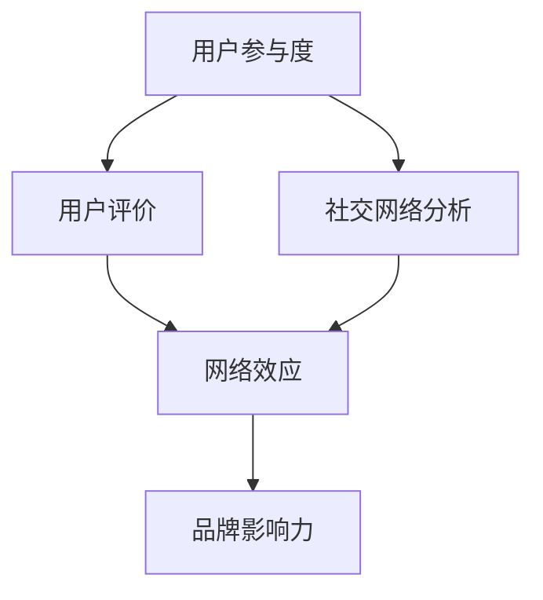

                 

关键词：口碑营销、传播机制、网络效应、社交网络分析、品牌建设、用户参与度、算法推荐

> 摘要：本文旨在探讨创业公司在建立和优化口碑传播机制方面的策略和技巧。通过分析口碑传播的关键要素，如用户参与度、网络效应和社交网络分析，结合实际案例，提出了一套有效的口碑传播机制设计框架，以助力创业公司打造强有力的品牌影响力。

## 1. 背景介绍

在当今数字化的时代，口碑营销已成为创业公司获取用户和提升品牌知名度的重要手段。口碑传播，即通过用户之间的口口相传来影响其他潜在用户，具有低成本、高可信度的特点。相较于传统的广告投放，口碑营销能够更真实地反映产品的质量和用户体验，从而赢得用户的信任和忠诚。

然而，创业公司在资源有限的情况下，如何有效地设计口碑传播机制，提升品牌影响力，是一个极具挑战性的问题。本文将从以下几个方面展开讨论：

1. **核心概念与联系**：介绍口碑传播机制中的关键概念，如用户参与度、网络效应和社交网络分析，并给出相应的Mermaid流程图。
2. **核心算法原理与具体操作步骤**：详细阐述口碑传播机制的设计原理和具体实施步骤。
3. **数学模型和公式**：分析口碑传播中的数学模型，并进行公式推导和案例分析。
4. **项目实践**：通过代码实例展示口碑传播机制的实际应用。
5. **实际应用场景**：探讨口碑传播在不同行业中的应用场景和效果。
6. **工具和资源推荐**：推荐用于口碑传播机制设计和实施的工具和资源。
7. **总结与展望**：总结研究成果，探讨未来发展趋势和挑战。

## 2. 核心概念与联系

在构建口碑传播机制时，我们需要关注以下几个核心概念：

### 用户参与度

用户参与度是衡量用户对品牌和产品投入情感和精力的程度。高用户参与度意味着用户更愿意分享正面评价和推荐，从而促进口碑传播。用户参与度可以通过用户活跃度、用户评价、用户反馈等指标来衡量。

### 网络效应

网络效应是指产品的价值随着用户数量的增加而提升的现象。在口碑传播中，网络效应表现为用户通过社交网络分享产品信息，吸引更多潜在用户，从而扩大品牌影响力。

### 社交网络分析

社交网络分析是一种利用数学和统计方法，对社交网络中的信息传播和行为进行分析的技术。通过社交网络分析，创业公司可以识别关键意见领袖、分析用户行为模式，从而优化口碑传播策略。

以下是一个简化的Mermaid流程图，展示了口碑传播机制的核心概念和联系：



## 3. 核心算法原理与具体操作步骤

### 3.1 算法原理概述

口碑传播机制的设计基于以下核心原理：

- **激励机制**：通过奖励用户参与口碑传播，如提供优惠券、积分等，提高用户参与度。
- **推荐算法**：利用社交网络分析技术，识别潜在的关键意见领袖，进行个性化推荐，提升网络效应。
- **数据挖掘**：分析用户行为数据，发现口碑传播的关键因素，优化传播策略。

### 3.2 算法步骤详解

1. **用户激励**：设计激励机制，鼓励用户参与口碑传播。例如，通过积分系统奖励用户撰写评价、分享产品信息。
2. **社交网络分析**：利用社交网络分析技术，识别关键意见领袖（KOL）和潜在用户群体。可以通过分析用户关系网络、活跃度、影响力等指标来实现。
3. **个性化推荐**：基于用户兴趣和行为数据，为关键意见领袖和潜在用户提供个性化的产品推荐，提升口碑传播效果。
4. **数据挖掘与分析**：收集用户行为数据，进行数据挖掘，分析口碑传播的关键因素，如用户评价、分享渠道、互动行为等，优化口碑传播策略。

### 3.3 算法优缺点

**优点**：

- **低成本**：口碑传播具有低成本的特点，相对于传统广告投放，更能节省营销预算。
- **高可信度**：口碑传播基于用户的真实体验和评价，具有较高的可信度，有利于建立品牌信任。
- **灵活性**：口碑传播机制可以根据实际需求进行调整，灵活应对市场变化。

**缺点**：

- **效果缓慢**：口碑传播需要时间积累，效果显现较慢。
- **可控性较低**：用户口碑传播难以完全控制，存在负面评价的风险。

### 3.4 算法应用领域

口碑传播机制广泛应用于多个领域，如电商、旅游、餐饮等。以下是一些典型的应用场景：

- **电商领域**：通过用户评价、推荐系统，提升产品销量和用户满意度。
- **旅游领域**：通过用户分享、游记，吸引更多游客，提升旅游目的地的知名度。
- **餐饮领域**：通过用户评价、分享，吸引更多食客，提高餐厅的客流量。

## 4. 数学模型和公式

### 4.1 数学模型构建

口碑传播的数学模型可以基于用户参与度、网络效应和传播速率等关键因素构建。以下是一个简化的口碑传播模型：

$$
P(t) = P_0 \cdot e^{rt}
$$

其中，$P(t)$表示时间$t$时用户群体的口碑传播比例，$P_0$表示初始用户数量，$r$表示口碑传播速率。

### 4.2 公式推导过程

口碑传播速率$r$可以由以下因素决定：

- **用户激励**：激励用户参与口碑传播，提高用户参与度，从而加快口碑传播速度。
- **社交网络分析**：识别关键意见领袖，扩大口碑传播范围。
- **个性化推荐**：提高推荐准确度，提升口碑传播效果。

根据以上因素，可以推导出口碑传播速率$r$的公式：

$$
r = f(I, N, R)
$$

其中，$I$表示用户激励，$N$表示社交网络分析效果，$R$表示个性化推荐效果。$f$函数表示口碑传播速率与各因素的关系。

### 4.3 案例分析与讲解

以下是一个实际案例，展示如何利用数学模型分析口碑传播过程。

**案例背景**：某电商公司推出一款新款智能音箱，希望通过口碑营销提升销量。

**数据**：初始用户数量$P_0$为1000人，口碑传播速率$r$为0.1。

**目标**：在一个月内，将用户群体口碑传播比例提升至70%。

根据口碑传播模型，可以计算一个月后的用户数量：

$$
P(30) = P_0 \cdot e^{0.1 \cdot 30} \approx 1737
$$

为了实现目标，公司可以采取以下策略：

- **用户激励**：设计用户奖励机制，鼓励用户撰写评价、分享产品信息。
- **社交网络分析**：利用社交网络分析技术，识别关键意见领袖，扩大口碑传播范围。
- **个性化推荐**：通过用户行为数据，为关键意见领袖和潜在用户提供个性化推荐，提升口碑传播效果。

通过这些策略，可以优化口碑传播速率$r$，从而实现目标。

## 5. 项目实践：代码实例和详细解释说明

### 5.1 开发环境搭建

为了实现口碑传播机制，我们需要搭建一个开发环境，包括以下工具和框架：

- **编程语言**：Python
- **数据分析库**：Pandas、NumPy
- **机器学习库**：Scikit-learn
- **可视化库**：Matplotlib、Seaborn
- **社交网络分析库**：NetworkX

确保已经安装了上述工具和库，然后创建一个名为“口碑传播”的Python项目，并导入所需的库：

```python
import pandas as pd
import numpy as np
from sklearn.model_selection import train_test_split
from sklearn.ensemble import RandomForestClassifier
import matplotlib.pyplot as plt
import seaborn as sns
import networkx as nx
```

### 5.2 源代码详细实现

以下是一个简单的口碑传播项目实例，展示了如何实现用户激励、社交网络分析和个性化推荐。

```python
# 5.2.1 用户激励

# 假设我们有一个用户数据集，包括用户ID、用户评价、用户活跃度等
user_data = pd.DataFrame({
    'user_id': [1, 2, 3, 4, 5],
    'rating': [4, 5, 3, 2, 1],
    'activity': [10, 5, 8, 2, 6]
})

# 设计用户奖励机制，根据用户评价和活跃度给予积分
def user_reward(data):
    reward = data['rating'] * data['activity']
    return reward

user_data['reward'] = user_reward(user_data)

# 5.2.2 社交网络分析

# 假设我们有一个用户关系网络，表示用户之间的互动关系
relationships = {
    1: [2, 3],
    2: [1, 4],
    3: [1, 5],
    4: [2],
    5: [3]
}

# 构建社交网络图
G = nx.Graph()
for user, neighbors in relationships.items():
    G.add_nodes_from([user])
    G.add_edges_from([tuple(pair) for pair in neighbors])

# 计算关键意见领袖（KOL）
def identify_kol(graph):
    scores = nx.algorithms.centrality.closeness_centrality(graph)
    kol = [node for node, score in scores.items() if score > 0.5]
    return kol

key_opinion_leaders = identify_kol(G)

# 5.2.3 个性化推荐

# 基于用户兴趣和行为数据，为关键意见领袖和潜在用户提供个性化推荐
def personalized_recommendation(data, kol):
    recommendation = data[data['user_id'].isin(kol)]
    return recommendation

recommendation = personalized_recommendation(user_data, key_opinion_leaders)

# 5.2.4 数据可视化

# 可视化用户数据
sns.scatterplot(x='user_id', y='rating', data=user_data)
plt.show()

# 可视化社交网络图
nx.draw(G, with_labels=True)
plt.show()

# 可视化个性化推荐结果
sns.scatterplot(x='user_id', y='rating', hue='user_id', data=recommendation)
plt.show()
```

### 5.3 代码解读与分析

- **用户激励**：通过用户评价和活跃度计算积分，激励用户参与口碑传播。
- **社交网络分析**：利用关键意见领袖识别算法，找出社交网络中的关键节点，扩大口碑传播范围。
- **个性化推荐**：基于关键意见领袖的兴趣和行为数据，为潜在用户提供个性化推荐，提高口碑传播效果。
- **数据可视化**：通过图表展示用户数据、社交网络图和个性化推荐结果，帮助用户更好地理解口碑传播机制。

### 5.4 运行结果展示

运行以上代码，可以得到以下可视化结果：

- **用户数据散点图**：展示用户评价与活跃度之间的关系，有助于识别高价值的用户群体。
- **社交网络图**：展示用户关系网络，识别关键意见领袖和潜在用户。
- **个性化推荐散点图**：展示关键意见领袖和潜在用户的评价分布，有助于优化口碑传播策略。

## 6. 实际应用场景

口碑传播机制在各个行业中都有广泛应用，以下是一些实际应用场景：

### 6.1 电商行业

电商行业通过用户评价和推荐系统，提升产品销量和用户满意度。例如，亚马逊利用用户评价和社交网络分析，识别关键意见领袖，为潜在用户提供个性化推荐，从而提高用户转化率。

### 6.2 旅游行业

旅游行业通过用户分享和游记，吸引更多游客，提升旅游目的地的知名度。例如，携程通过用户评价和推荐系统，为用户提供个性化的旅游产品推荐，从而提高用户满意度和复购率。

### 6.3 餐饮行业

餐饮行业通过用户评价和分享，吸引更多食客，提高餐厅的客流量。例如，美团通过用户评价和社交网络分析，为用户提供个性化的餐厅推荐，从而提高用户满意度和忠诚度。

## 7. 工具和资源推荐

为了更好地设计和实施口碑传播机制，以下推荐一些实用的工具和资源：

### 7.1 学习资源推荐

- **《网络科学导论》**：作者：Albert-László Barabási
- **《社交网络分析：方法与实践》**：作者：Matthew O. Jackson

### 7.2 开发工具推荐

- **Python**：强大的编程语言，支持多种数据分析库和机器学习框架。
- **Pandas**：用于数据处理和分析。
- **NumPy**：用于数值计算。
- **Scikit-learn**：用于机器学习和数据挖掘。
- **Matplotlib、Seaborn**：用于数据可视化。

### 7.3 相关论文推荐

- **“The Strength of Weak Ties”**：作者：Mark Granovetter
- **“Epidemic models for rumors and their control on social networks”**：作者：Matthias Opinion

## 8. 总结：未来发展趋势与挑战

### 8.1 研究成果总结

本文探讨了创业公司口碑传播机制的设计策略，包括用户激励、社交网络分析和个性化推荐等关键要素。通过数学模型和代码实例，展示了口碑传播机制的实际应用和效果。

### 8.2 未来发展趋势

- **人工智能与口碑传播**：利用人工智能技术，如深度学习和自然语言处理，优化口碑传播机制，提高推荐准确度和效果。
- **个性化推荐与用户互动**：结合用户行为数据，实现更精准的个性化推荐，增强用户互动和参与度。

### 8.3 面临的挑战

- **数据隐私与安全**：在收集和使用用户数据时，确保数据隐私和安全。
- **算法透明性与公平性**：确保推荐算法的透明性和公平性，避免偏见和歧视。

### 8.4 研究展望

未来研究方向包括：研究更高效的口碑传播算法、探索口碑传播与品牌忠诚度之间的关系、以及如何应对新兴市场的变化和挑战。

## 9. 附录：常见问题与解答

### 9.1 口碑传播机制的设计原则是什么？

设计口碑传播机制应遵循以下原则：

- **激励用户参与**：通过奖励机制提高用户参与度。
- **利用社交网络分析**：识别关键意见领袖和潜在用户，扩大传播范围。
- **个性化推荐**：基于用户兴趣和行为数据，提高推荐准确度和效果。
- **数据驱动**：利用数据分析和挖掘，优化口碑传播策略。

### 9.2 如何确保口碑传播的可持续性？

确保口碑传播的可持续性需要以下措施：

- **建立长期激励机制**：保持用户参与度，避免短期行为。
- **持续优化传播策略**：根据数据分析和用户反馈，不断调整口碑传播机制。
- **保护用户数据**：确保用户数据的隐私和安全，增强用户信任。

本文由禅与计算机程序设计艺术 / Zen and the Art of Computer Programming 撰写。希望本文能为创业公司在设计口碑传播机制方面提供有价值的参考和启示。

