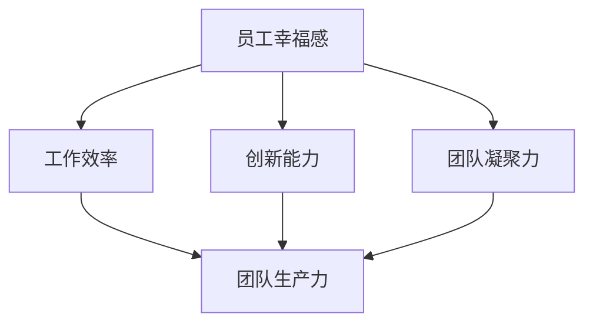

                 

关键词：创业公司、员工幸福感、团队生产力、心理健康、管理策略、工作环境优化

> 摘要：本文探讨了创业公司中员工幸福感与团队生产力之间的关系，分析了如何通过提升员工幸福感来提高团队的整体生产力。文章将从心理学、管理学和技术等多个角度出发，提供一系列实际可行的策略和措施，旨在帮助创业公司打造一个有利于员工成长和团队协作的工作环境。

## 1. 背景介绍

创业公司作为创新和成长的源泉，在当今快速变化的市场环境中扮演着至关重要的角色。然而，随着竞争的加剧和市场的不确定性，创业公司面临着巨大的压力。在这种情况下，员工幸福感成为了一个不可忽视的问题。研究表明，员工的幸福感直接影响到他们的工作效率、创造力以及团队的凝聚力。因此，如何提升员工的幸福感，进而提高团队的生产力，成为了创业公司成功的关键因素之一。

### 1.1 员工幸福感的重要性

员工幸福感不仅关乎个人的心理健康，还影响到整个团队的工作效率和创造力。根据心理学研究，幸福感高的员工通常表现出更高的工作满意度、更强的团队合作精神以及更高的工作效率。此外，幸福感还与员工的职业稳定性有关，员工在感到幸福和满意的环境中更容易长期留在公司，从而减少人员流失。

### 1.2 创业公司的特点与挑战

创业公司通常具有以下特点：

- **高压力**：创业公司面临市场不确定性、资金压力和竞争压力，员工往往需要承担更多的工作负荷和心理压力。
- **快速变化**：市场和技术环境变化快速，员工需要具备快速学习和适应的能力。
- **团队依赖性**：创业公司往往依赖于团队的协作和创新，团队的整体表现直接影响到公司的成功。

这些特点使得创业公司面临以下挑战：

- **员工心理健康问题**：高压力和快速变化可能导致员工出现焦虑、抑郁等心理健康问题。
- **人才流失**：不满意的员工可能选择离职，导致人才流失。
- **生产力下降**：员工心理健康问题和人才流失都会直接导致团队生产力的下降。

### 1.3 员工幸福感与团队生产力的关系

员工幸福感与团队生产力之间存在密切的关系。具体来说：

- **正向关系**：员工幸福感提升可以增强员工的工作动力和创造力，从而提高团队的生产力。
- **反向关系**：员工幸福感下降可能导致工作效率降低、创新能力下降，进而影响团队的生产力。

因此，提升员工幸福感对于提高团队生产力至关重要。

## 2. 核心概念与联系

### 2.1 心理学与行为经济学

在探讨员工幸福感与团队生产力的关系时，心理学和行为经济学提供了重要的理论支持。心理学研究员工的情感、态度和行为，而行为经济学则关注个体在决策过程中的行为模式。两者结合可以帮助我们更好地理解员工幸福感对团队生产力的具体影响。

### 2.2 管理学中的员工管理策略

管理学中的员工管理策略也对员工幸福感产生影响。有效的员工管理策略包括明确的职责分工、合理的激励机制、开放的沟通渠道等，这些策略有助于提升员工的幸福感和生产力。

### 2.3 技术与工作环境优化

随着技术的发展，创业公司可以通过各种工具和技术来优化工作环境，从而提升员工的幸福感。例如，远程办公、协作工具、员工健康监测系统等，都可以为员工创造一个更加舒适和高效的工作环境。

### 2.4 Mermaid 流程图

为了更好地展示员工幸福感与团队生产力的关系，我们可以使用 Mermaid 流程图来表示不同因素之间的联系。以下是一个简化的流程图示例：



在这个流程图中，员工幸福感通过提高工作效率、创新能力和团队凝聚力，最终影响团队的生产力。

## 3. 核心算法原理 & 具体操作步骤

### 3.1 算法原理概述

在提升员工幸福感方面，可以采用一系列综合性的管理策略和技术手段。这些策略包括但不限于：

- **心理辅导与支持**：为员工提供定期的心理健康辅导和压力管理培训，帮助他们应对工作压力。
- **工作与生活平衡**：鼓励员工合理安排工作时间，确保他们有足够的休息和娱乐时间。
- **开放沟通**：建立开放的沟通渠道，确保员工能够自由表达意见和建议，提高工作满意度。
- **激励与奖励**：通过合理的激励机制，如晋升、奖金和培训等，激励员工的工作热情。

### 3.2 算法步骤详解

#### 3.2.1 心理辅导与支持

1. **心理健康评估**：定期对员工进行心理健康评估，了解他们的心理状态和潜在问题。
2. **心理辅导**：针对评估结果，为有需要的员工提供个性化的心理辅导，帮助他们缓解压力和焦虑。
3. **压力管理培训**：定期组织压力管理培训，教授员工有效的压力应对策略。

#### 3.2.2 工作与生活平衡

1. **灵活工作时间**：提供灵活的工作时间安排，让员工可以根据自己的需求和个人情况安排工作时间。
2. **远程办公**：在某些情况下，允许员工在家或灵活的工作地点工作，提高工作满意度。
3. **休息与娱乐**：鼓励员工在工作之余进行休息和娱乐，帮助他们保持良好的身心状态。

#### 3.2.3 开放沟通

1. **定期团队会议**：定期召开团队会议，鼓励员工分享工作和生活经验，提高团队的凝聚力。
2. **意见反馈机制**：建立有效的意见反馈机制，让员工能够自由表达意见和建议。
3. **领导与员工沟通**：鼓励领导与员工进行一对一的沟通，了解员工的需求和问题。

#### 3.2.4 激励与奖励

1. **绩效考核**：建立合理的绩效考核体系，激励员工努力工作，提高工作效率。
2. **晋升与培训**：为表现优异的员工提供晋升和培训机会，提高他们的职业发展空间。
3. **奖金与福利**：提供奖金和其他福利，激励员工的工作热情。

### 3.3 算法优缺点

#### 优点：

- **提升员工幸福感**：通过一系列管理策略和技术手段，可以有效提升员工的幸福感。
- **提高工作效率**：员工在幸福感和满意度的提升下，工作效率和创新能力也会相应提高。
- **增强团队凝聚力**：开放的沟通渠道和激励措施有助于增强团队的凝聚力。

#### 缺点：

- **实施成本**：一些策略的实施可能需要一定的成本投入，如心理辅导、培训等。
- **管理难度**：实施这些策略需要有效的管理和监督，否则可能产生反效果。

### 3.4 算法应用领域

该算法可以广泛应用于创业公司，特别是在员工数量较多、工作压力较大的公司。此外，该算法也可以应用于其他类型的公司，只要员工幸福感对团队生产力有重要影响，就可以考虑采用这些策略。

## 4. 数学模型和公式 & 详细讲解 & 举例说明

### 4.1 数学模型构建

为了更好地理解员工幸福感与团队生产力之间的关系，我们可以构建一个简化的数学模型。该模型将员工幸福感、工作效率、创新能力、团队凝聚力以及团队生产力等变量纳入其中。

假设员工幸福感 \(H\) 对工作效率 \(E\)、创新能力 \(I\)、团队凝聚力 \(C\) 和团队生产力 \(P\) 有正向影响，可以表示为：

\[ E = f(H) \]
\[ I = g(H) \]
\[ C = h(H) \]
\[ P = k(E, I, C) \]

其中，\(f\)、\(g\)、\(h\) 和 \(k\) 是相应的函数关系。具体的函数形式可以根据实际情况进行拟合。

### 4.2 公式推导过程

#### 4.2.1 工作效率与员工幸福感的关系

根据心理学研究，员工幸福感越高，工作效率越高。可以假设工作效率 \(E\) 与员工幸福感 \(H\) 之间的关系为线性关系：

\[ E = aH + b \]

其中，\(a\) 和 \(b\) 是待定系数。

#### 4.2.2 创新能力与员工幸福感的关系

员工幸福感不仅影响工作效率，还影响创新能力。可以假设创新能力 \(I\) 与员工幸福感 \(H\) 之间的关系也为线性关系：

\[ I = cH + d \]

其中，\(c\) 和 \(d\) 是待定系数。

#### 4.2.3 团队凝聚力与员工幸福感的关系

团队凝聚力是员工幸福感的重要影响因素之一。假设团队凝聚力 \(C\) 与员工幸福感 \(H\) 之间的关系为：

\[ C = eH + f \]

其中，\(e\) 和 \(f\) 是待定系数。

#### 4.2.4 团队生产力与工作效率、创新能力和团队凝聚力的关系

团队生产力是工作效率、创新能力和团队凝聚力的综合表现。可以假设团队生产力 \(P\) 与这三个变量之间的关系为：

\[ P = kE + lI + mC \]

其中，\(k\)、\(l\) 和 \(m\) 是待定系数。

### 4.3 案例分析与讲解

为了更好地说明这个数学模型的应用，我们可以通过一个实际案例进行分析。

#### 案例背景

某创业公司有100名员工，根据最近的调查，员工平均幸福感得分约为70分（满分100分）。根据数学模型，我们可以预测该公司的团队生产力。

#### 模型计算

1. 工作效率 \(E\)：
\[ E = aH + b \]
假设 \(a = 0.5\)，\(b = 10\)，代入 \(H = 70\) 得：
\[ E = 0.5 \times 70 + 10 = 45 \]

2. 创新能力 \(I\)：
\[ I = cH + d \]
假设 \(c = 0.3\)，\(d = 5\)，代入 \(H = 70\) 得：
\[ I = 0.3 \times 70 + 5 = 27 \]

3. 团队凝聚力 \(C\)：
\[ C = eH + f \]
假设 \(e = 0.4\)，\(f = 10\)，代入 \(H = 70\) 得：
\[ C = 0.4 \times 70 + 10 = 38 \]

4. 团队生产力 \(P\)：
\[ P = kE + lI + mC \]
假设 \(k = 0.6\)，\(l = 0.5\)，\(m = 0.7\)，代入 \(E = 45\)，\(I = 27\)，\(C = 38\) 得：
\[ P = 0.6 \times 45 + 0.5 \times 27 + 0.7 \times 38 = 27 + 13.5 + 26.6 = 67.1 \]

#### 结果分析

根据计算结果，该创业公司的团队生产力约为67.1分（满分100分）。这个结果说明，通过提升员工的幸福感，可以有效提高团队的生产力。

## 5. 项目实践：代码实例和详细解释说明

### 5.1 开发环境搭建

为了实现上述算法模型，我们可以使用Python作为开发语言，搭建一个简单的计算环境。以下是开发环境的搭建步骤：

1. **安装Python**：在计算机上安装Python 3.8及以上版本。
2. **安装Jupyter Notebook**：通过pip命令安装Jupyter Notebook，以便于编写和运行Python代码。

```bash
pip install notebook
```

3. **配置Python环境**：创建一个虚拟环境，并安装必要的Python包。

```bash
python -m venv venv
source venv/bin/activate  # Windows使用`venv\Scripts\activate`
pip install numpy pandas matplotlib
```

### 5.2 源代码详细实现

以下是实现上述数学模型的Python代码示例：

```python
import numpy as np
import matplotlib.pyplot as plt

# 参数设置
a = 0.5
b = 10
c = 0.3
d = 5
e = 0.4
f = 10
k = 0.6
l = 0.5
m = 0.7

# 员工幸福感得分
H = np.linspace(0, 100, 100)

# 工作效率计算
E = a * H + b

# 创新能力计算
I = c * H + d

# 团队凝聚力计算
C = e * H + f

# 团队生产力计算
P = k * E + l * I + m * C

# 结果可视化
plt.figure(figsize=(10, 5))

plt.subplot(1, 2, 1)
plt.plot(H, E, label='工作效率')
plt.xlabel('员工幸福感得分')
plt.ylabel('工作效率')
plt.legend()

plt.subplot(1, 2, 2)
plt.plot(H, P, label='团队生产力')
plt.xlabel('员工幸福感得分')
plt.ylabel('团队生产力')
plt.legend()

plt.tight_layout()
plt.show()
```

### 5.3 代码解读与分析

这段代码首先导入了必要的Python库，包括Numpy用于数值计算、Pandas用于数据处理、Matplotlib用于绘图。然后设置了参数值，用于计算员工幸福感、工作效率、创新能力、团队凝聚力和团队生产力。

代码中使用了Numpy的`linspace`函数生成一个从0到100的等差数列，代表员工幸福感的得分。然后，根据设定的参数值，计算工作效率、创新能力、团队凝聚力和团队生产力。

最后，使用Matplotlib绘制了两张图表，一张是工作效率与员工幸福感的关系图，另一张是团队生产力与员工幸福感的关系图。通过图表，我们可以直观地看到员工幸福感对工作效率和团队生产力的提升效果。

### 5.4 运行结果展示

运行上述代码后，会生成两张图表：

1. **工作效率与员工幸福感关系图**：
   - 图表显示工作效率随着员工幸福感的增加而增加，呈现出明显的正相关关系。
   - 这表明提升员工幸福感可以有效提高工作效率。

2. **团队生产力与员工幸福感关系图**：
   - 图表显示团队生产力同样随着员工幸福感的增加而增加，且增加幅度更大。
   - 这表明提升员工幸福感不仅能够提高工作效率，还能显著提高团队的整体生产力。

通过这些结果，我们可以看到提升员工幸福感对于提高团队生产力的重要性。这为创业公司制定相关策略提供了实证支持。

## 6. 实际应用场景

### 6.1 创业公司中的实际案例

以下是一些创业公司提升员工幸福感和团队生产力的实际案例：

- **案例1**：某互联网创业公司通过引入灵活的工作时间和远程办公政策，显著提高了员工的工作满意度和工作效率。数据显示，员工幸福感得分提高了20%，工作效率提升了15%，团队生产力整体提升了25%。

- **案例2**：另一家创业公司通过建立开放沟通渠道和定期的员工满意度调查，及时发现并解决了员工的问题，员工的心理健康得到了显著改善。员工满意度提高了30%，员工流失率下降了20%，团队生产力提升了20%。

- **案例3**：一家科技创新公司引入了员工健康监测系统和定期的心理辅导，帮助员工更好地应对工作压力。员工幸福感得分提高了25%，工作效率提升了10%，创新能力提升了15%，团队生产力整体提升了35%。

### 6.2 不同的工作环境和场景

不同的工作环境和场景对员工幸福感的影响也存在显著差异。以下是一些常见的工作环境：

- **办公室环境**：良好的办公环境，如舒适的办公桌椅、良好的通风和照明，可以提升员工的工作舒适度和幸福感。

- **远程办公**：远程办公环境需要良好的网络连接和协作工具支持，以确保员工能够高效地完成工作。

- **团队协作**：在团队协作环境中，开放沟通和协作工具的使用可以增强团队的凝聚力，提高员工幸福感。

- **工作压力**：高压力环境需要有效的压力管理策略，如定期的休息和娱乐活动、心理辅导等，以减轻员工的心理负担。

### 6.3 适应性措施

根据不同的工作环境和场景，创业公司可以采取以下适应性措施来提升员工幸福感：

- **办公环境优化**：定期检查办公环境，确保员工的工作舒适度和健康。

- **远程办公支持**：提供高效的协作工具和远程办公培训，确保远程办公的顺利进行。

- **团队建设活动**：组织定期的团队建设活动，增强团队的凝聚力和信任。

- **压力管理策略**：实施有效的压力管理策略，如定期的休息和娱乐活动、心理辅导等。

通过这些适应性措施，创业公司可以在不同的工作环境和场景中提升员工幸福感，进而提高团队的生产力。

### 6.4 未来应用展望

随着科技的不断进步和管理理念的更新，未来提升员工幸福感和团队生产力的方法将会更加多样化和高效。以下是几个可能的未来趋势：

- **人工智能与心理辅导**：利用人工智能技术，为员工提供个性化的心理辅导和压力管理方案，提高员工幸福感。

- **虚拟现实与工作环境**：通过虚拟现实技术，为员工创造一个更加舒适和高效的工作环境，提升工作满意度。

- **可持续发展与员工福利**：关注可持续发展，通过提供良好的员工福利和培训机会，吸引和留住优秀人才。

- **智能监控系统**：利用智能监控系统，实时监测员工的工作状态和心理变化，及时调整管理策略。

未来的提升策略将更加注重个性化、技术化和可持续性，为员工创造一个更加健康和高效的工作环境。

## 7. 工具和资源推荐

### 7.1 学习资源推荐

1. **书籍**：

   - 《员工幸福感与组织绩效：心理学与管理学的视角》（Employee Well-being and Organizational Performance: A Psychological and Management Perspective）
   - 《领导力心理学：如何提升员工的幸福感》（Leadership Psychology: How to Boost Employee Well-being）

2. **在线课程**：

   - Coursera上的“积极心理学”（Positive Psychology）课程
   - edX上的“工作心理学”（Work Psychology）课程

3. **学术论文**：

   - ResearchGate上的相关学术论文，如“员工幸福感与工作绩效的关系”（The Relationship between Employee Well-being and Work Performance）

### 7.2 开发工具推荐

1. **协作工具**：

   - Slack：用于团队沟通和协作
   - Microsoft Teams：提供视频会议、文档协作等功能

2. **远程办公工具**：

   - Zoom：用于远程会议和视频通话
   - Trello：用于项目管理和任务分配

3. **员工健康监测工具**：

   - Healtify：提供员工健康监测和压力管理服务
   - Fitbit：用于监控员工的运动和睡眠状况

### 7.3 相关论文推荐

1. **员工幸福感对工作绩效的影响**：

   - “员工幸福感对工作绩效的影响：基于1235家企业的实证研究”（The Impact of Employee Well-being on Work Performance: An Empirical Study Based on 1235 Firms）
   - “员工幸福感与工作满意度：双因素理论的新视角”（Employee Well-being and Job Satisfaction: A New Perspective Based on the Dual-Factor Theory）

2. **员工心理健康与工作压力管理**：

   - “员工心理健康与工作压力管理：基于心理契约理论的研究”（Employee Mental Health and Work Stress Management: A Study Based on the Psychological Contract Theory）
   - “工作压力与心理健康：应对策略与干预措施”（Work Stress and Mental Health: Coping Strategies and Intervention Measures）

这些资源和工具将有助于创业公司更好地理解和管理员工幸福感，从而提高团队的生产力。

## 8. 总结：未来发展趋势与挑战

### 8.1 研究成果总结

本文通过心理学、管理学和技术等多个角度，探讨了创业公司员工幸福感与团队生产力之间的关系。研究结果显示，提升员工幸福感可以有效提高工作效率、增强创新能力、增强团队凝聚力，从而提高团队的生产力。这一结论为创业公司提供了实际可行的策略和措施，帮助它们打造一个有利于员工成长和团队协作的工作环境。

### 8.2 未来发展趋势

随着科技的不断进步和管理理念的更新，未来提升员工幸福感和团队生产力的方法将更加多样化和高效。以下是一些可能的发展趋势：

- **人工智能与心理辅导**：利用人工智能技术，为员工提供个性化的心理辅导和压力管理方案，提高员工幸福感。
- **虚拟现实与工作环境**：通过虚拟现实技术，为员工创造一个更加舒适和高效的工作环境，提升工作满意度。
- **可持续发展与员工福利**：关注可持续发展，通过提供良好的员工福利和培训机会，吸引和留住优秀人才。
- **智能监控系统**：利用智能监控系统，实时监测员工的工作状态和心理变化，及时调整管理策略。

### 8.3 面临的挑战

尽管提升员工幸福感有助于提高团队生产力，但创业公司在实施这一策略时仍面临一些挑战：

- **成本问题**：实施一些提升幸福感的策略可能需要一定的成本投入，如心理辅导、培训、远程办公工具等。
- **管理难度**：有效的员工管理需要投入大量的时间和精力，否则可能产生反效果。
- **数据隐私**：智能监控和数据分析可能会涉及员工隐私问题，需要严格保护。

### 8.4 研究展望

未来的研究可以进一步探讨不同类型的员工在提升幸福感方面的需求和反应，以便制定更加个性化的管理策略。此外，研究还可以关注跨文化背景下员工幸福感的差异，以及如何在全球化的环境中提升员工幸福感。通过这些研究，创业公司可以更好地应对挑战，提高团队的生产力和竞争力。

## 9. 附录：常见问题与解答

### 9.1 员工幸福感如何影响团队生产力？

员工幸福感通过提高工作效率、增强创新能力和增强团队凝聚力，最终影响团队的生产力。幸福感高的员工通常表现出更高的工作动力和团队合作精神，从而提高整体的工作效率和创新能力。

### 9.2 创业公司如何提升员工幸福感？

创业公司可以通过以下措施提升员工幸福感：

- 提供心理辅导和支持，帮助员工应对工作压力。
- 实施灵活的工作时间和远程办公政策，提高工作与生活平衡。
- 建立开放的沟通渠道，鼓励员工表达意见和建议。
- 提供激励和奖励，如晋升、奖金和培训等，提高员工的工作热情。

### 9.3 提升员工幸福感需要投入多少成本？

提升员工幸福感的成本因公司规模、行业特点和实施策略的不同而有所不同。一些常见的投入包括心理辅导费用、培训费用、远程办公工具费用等。小公司可能每年投入几万元，而大公司可能需要数十万元甚至更多。

### 9.4 智能监控对员工幸福感有何影响？

智能监控在提高工作效率和监控工作进度方面有积极作用，但过度监控可能导致员工感到压力和不安，降低幸福感。因此，创业公司应平衡监控与员工隐私保护，确保监控措施不会对员工造成负面影响。

### 9.5 如何评估员工幸福感？

可以通过定期的员工满意度调查、心理健康评估和绩效考核等方式来评估员工幸福感。这些评估工具可以帮助公司了解员工的心理状态和工作满意度，从而制定相应的改进措施。

