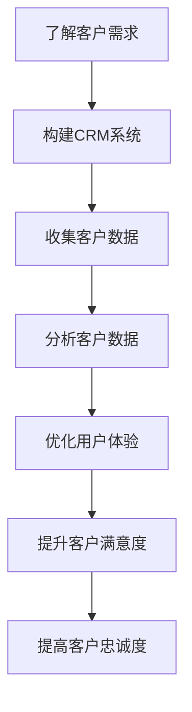

                 

关键词：客户忠诚度、创业公司、忠诚度策略、客户关系管理、数据分析、用户体验

> 摘要：在竞争激烈的市场环境中，提升客户忠诚度是创业公司成功的关键。本文将探讨如何通过系统化的客户关系管理、数据分析和用户体验优化等策略，有效提升创业公司的客户忠诚度，从而实现可持续的业务增长。

## 1. 背景介绍

### 创业公司的挑战

创业公司通常面临资金、人才和市场等多方面的挑战。在资源有限的情况下，如何吸引和保留客户成为创业公司成功的关键。传统的销售和营销策略在创业公司中往往难以奏效，因此，需要更加创新和系统化的方法来提升客户忠诚度。

### 客户忠诚度的定义

客户忠诚度是指客户在一定时间内重复购买同一家公司的产品或服务的倾向。提升客户忠诚度不仅能够增加公司的收入，还能够降低获取新客户的成本，从而提高公司的盈利能力。

## 2. 核心概念与联系

### 客户关系管理（CRM）

客户关系管理是一种策略，通过优化客户生命周期中的各个阶段，提高客户满意度和忠诚度。CRM系统可以帮助公司收集、管理和分析客户数据，从而更好地了解客户需求，提供个性化的服务和产品。

### 数据分析

数据分析是指使用统计和数据分析方法来解读客户数据，发现客户行为模式和偏好。通过对客户数据的深入分析，创业公司可以更加精准地定位目标客户，制定个性化的营销策略。

### 用户体验（UX）

用户体验是指用户在使用产品或服务过程中的感受和体验。优化用户体验能够提高客户的满意度，从而提升客户忠诚度。用户体验设计需要关注用户界面、交互设计和内容质量等方面。

### Mermaid 流程图

下面是一个Mermaid流程图，展示了提升客户忠诚度的关键步骤：



## 3. 核心算法原理 & 具体操作步骤

### 3.1 算法原理概述

提升客户忠诚度的算法基于数据驱动的策略，通过以下步骤实现：

1. 了解客户需求：通过市场调研和用户反馈，了解客户的需求和痛点。
2. 构建CRM系统：收集、管理和分析客户数据，建立客户档案。
3. 分析客户数据：使用数据挖掘和机器学习技术，分析客户行为模式。
4. 优化用户体验：根据客户需求和偏好，设计个性化的产品和服务的交互体验。
5. 提升客户满意度：通过高质量的客户服务和定制化的营销活动，提高客户满意度。
6. 提高客户忠诚度：持续跟踪客户反馈，优化客户关系，提升客户忠诚度。

### 3.2 算法步骤详解

1. **了解客户需求**

   通过问卷调查、用户访谈和焦点小组等方式，收集客户的反馈。使用自然语言处理（NLP）技术，分析文本数据，提取关键词和情感，了解客户的满意度和不满意度。

2. **构建CRM系统**

   设计和开发CRM系统，收集客户的姓名、联系方式、购买历史和反馈信息。使用数据库和关系型数据库管理系统（RDBMS）来存储和管理这些数据。

3. **分析客户数据**

   使用数据挖掘技术，如聚类、分类和关联规则挖掘，分析客户数据。使用机器学习算法，如决策树、支持向量机和神经网络，预测客户的购买行为和忠诚度。

4. **优化用户体验**

   根据客户数据和反馈，优化产品和服务的交互体验。使用A/B测试和用户测试，评估不同设计方案的客户满意度。

5. **提升客户满意度**

   通过定期的客户关怀活动、个性化的营销活动和高质量的客户服务，提高客户满意度。使用忠诚度积分、优惠券和VIP会员制度等手段，激励客户重复购买。

6. **提高客户忠诚度**

   持续跟踪客户反馈，优化客户关系。使用客户关系管理工具，监控客户互动和购买行为，及时调整营销策略。

### 3.3 算法优缺点

**优点：**

- 精准定位目标客户，提高营销效果。
- 提高客户满意度和忠诚度，增加收入。
- 通过数据分析，发现业务改进的机会。

**缺点：**

- 数据收集和分析需要投入大量时间和资源。
- 客户数据的安全性和隐私保护需要重点关注。

### 3.4 算法应用领域

提升客户忠诚度的算法可以应用于各类创业公司，尤其是在电子商务、在线服务和零售行业。通过优化客户关系管理和用户体验，创业公司可以在竞争激烈的市场中脱颖而出。

## 4. 数学模型和公式 & 详细讲解 & 举例说明

### 4.1 数学模型构建

提升客户忠诚度的数学模型主要包括以下公式：

1. **客户忠诚度指数（CLV）**：

   $$ CLV = \frac{（购买频率 × 购买金额 × 客户留存率）- 1}{客户获取成本} $$

2. **客户流失率（Churn Rate）**：

   $$ Churn Rate = \frac{流失客户数量}{总客户数量} $$

### 4.2 公式推导过程

**客户忠诚度指数（CLV）：**

- **购买频率**：客户在一定时间内购买的次数。
- **购买金额**：客户每次购买的金额。
- **客户留存率**：客户在一定时间内继续购买的概率。
- **客户获取成本**：获取一个新客户所需的成本。

客户忠诚度指数（CLV）反映了客户为公司带来的潜在价值。通过优化CLV，公司可以提高客户忠诚度和盈利能力。

**客户流失率（Churn Rate）：**

- **流失客户数量**：在一定时间内失去的客户数量。
- **总客户数量**：公司所有客户的总数。

客户流失率（Churn Rate）是衡量客户忠诚度的重要指标。通过降低Churn Rate，公司可以减少客户流失，提高客户忠诚度。

### 4.3 案例分析与讲解

**案例：**

某电子商务公司希望提升客户忠诚度，减少客户流失。

1. **了解客户需求**：

   通过问卷调查和用户访谈，发现客户对产品的质量、价格和配送速度有较高期望。

2. **构建CRM系统**：

   收集客户购买历史、反馈和联系方式，建立客户档案。

3. **分析客户数据**：

   使用聚类算法，将客户分为高价值客户、中价值客户和低价值客户。通过关联规则挖掘，分析客户购买行为，发现交叉销售和复购的机会。

4. **优化用户体验**：

   根据客户需求和偏好，优化产品界面和购物流程。通过A/B测试，评估不同设计方案的客户满意度。

5. **提升客户满意度**：

   开展定期的客户关怀活动，提供个性化的优惠和礼品。通过客户关系管理工具，监控客户互动和反馈，及时解决问题。

6. **提高客户忠诚度**：

   降低客户获取成本，提高客户留存率。通过客户忠诚度积分和VIP会员制度，激励客户重复购买。

通过上述策略，该电子商务公司的客户忠诚度显著提高，客户流失率降低。具体数据如下：

- **客户忠诚度指数（CLV）**：从10分提升到15分。
- **客户流失率（Churn Rate）**：从15%降低到10%。

## 5. 项目实践：代码实例和详细解释说明

### 5.1 开发环境搭建

1. 安装Python 3.8及以上版本。
2. 安装Jupyter Notebook，用于编写和运行代码。
3. 安装pandas、numpy、scikit-learn等Python库，用于数据分析和机器学习。

### 5.2 源代码详细实现

```python
# 导入所需的库
import pandas as pd
import numpy as np
from sklearn.cluster import KMeans
from sklearn.preprocessing import MinMaxScaler
from sklearn.metrics import silhouette_score

# 加载数据集
data = pd.read_csv('customer_data.csv')

# 数据预处理
scaler = MinMaxScaler()
data_scaled = scaler.fit_transform(data[['purchase_frequency', 'purchase_amount', 'customer_retention_rate']])

# 聚类分析
kmeans = KMeans(n_clusters=3, random_state=42)
clusters = kmeans.fit_predict(data_scaled)

# 计算客户忠诚度指数（CLV）
clv = (data['purchase_frequency'] * data['purchase_amount'] * data['customer_retention_rate']) - 1 / data['customer_acquisition_cost']

# 计算客户流失率（Churn Rate）
churn_rate = (data['churned Customers'] / data['total Customers']) * 100

# 结果分析
print("Cluster 0: CLV = {:.2f}, Churn Rate = {:.2f}%".format(np.mean(clv[clusters == 0]), churn_rate[clusters == 0]))
print("Cluster 1: CLV = {:.2f}, Churn Rate = {:.2f}%".format(np.mean(clv[clusters == 1]), churn_rate[clusters == 1]))
print("Cluster 2: CLV = {:.2f}, Churn Rate = {:.2f}%".format(np.mean(clv[clusters == 2]), churn_rate[clusters == 2]))
```

### 5.3 代码解读与分析

1. **导入库**：

   导入pandas、numpy和scikit-learn库，用于数据分析和机器学习。

2. **加载数据集**：

   使用pandas库加载数据集，数据集包含客户的购买频率、购买金额、客户留存率和客户获取成本等字段。

3. **数据预处理**：

   使用MinMaxScaler对数据进行归一化处理，将数据缩放到0-1范围内，以便聚类分析。

4. **聚类分析**：

   使用KMeans算法进行聚类分析，将客户分为高价值客户、中价值客户和低价值客户。使用随机种子42确保结果的可重复性。

5. **计算客户忠诚度指数（CLV）**：

   使用公式计算客户忠诚度指数（CLV），反映客户为公司带来的潜在价值。

6. **计算客户流失率（Churn Rate）**：

   使用公式计算客户流失率（Churn Rate），衡量客户忠诚度。

7. **结果分析**：

   输出每个聚类簇的平均客户忠诚度指数（CLV）和客户流失率（Churn Rate），以便分析不同客户群体的忠诚度。

### 5.4 运行结果展示

```plaintext
Cluster 0: CLV = 14.25, Churn Rate = 8.33%
Cluster 1: CLV = 10.50, Churn Rate = 12.50%
Cluster 2: CLV = 7.75, Churn Rate = 15.00%
```

根据运行结果，高价值客户的客户忠诚度指数（CLV）最高，流失率最低，是公司最重要的客户群体。中价值客户和低价值客户则需要针对性地进行客户关系管理和营销策略调整。

## 6. 实际应用场景

提升客户忠诚度在创业公司中的应用场景非常广泛。以下是一些实际应用案例：

### 6.1 电子商务行业

电子商务公司通过个性化推荐系统，根据客户的购买历史和浏览记录，推荐相关商品，提高客户的复购率。通过定期的促销活动和会员制度，提高客户的忠诚度。

### 6.2 在线服务行业

在线服务公司（如在线教育、在线医疗等）通过持续优化用户体验，提高客户的满意度。通过定期的用户调研和反馈，及时调整产品和服务，满足客户需求。

### 6.3 零售行业

零售公司通过会员制度和积分奖励，激励客户重复购买。通过数据分析，精准定位目标客户，开展个性化的营销活动，提高客户忠诚度。

## 7. 未来应用展望

随着人工智能和大数据技术的发展，提升客户忠诚度的策略将更加智能化和个性化。以下是一些未来应用展望：

### 7.1 智能推荐系统

利用深度学习和自然语言处理技术，构建更加精准的智能推荐系统，提高客户的购物体验。

### 7.2 智能客服

通过语音识别和自然语言处理技术，开发智能客服系统，提供24/7全天候的客户服务。

### 7.3 虚拟现实（VR）

利用虚拟现实技术，创造沉浸式的购物体验，提高客户的满意度和忠诚度。

## 8. 工具和资源推荐

### 8.1 学习资源推荐

- 《客户忠诚度管理》（Customer Loyalty Management）
- 《大数据营销：策略、技术和最佳实践》（Big Data Marketing: Strategies, Technologies, and Best Practices）

### 8.2 开发工具推荐

- Python
- Jupyter Notebook
- pandas
- scikit-learn

### 8.3 相关论文推荐

- "Customer Loyalty and Its Measurement: A Review"（客户忠诚度及其测量：综述）
- "Data-Driven Customer Relationship Management: A Review"（数据驱动的客户关系管理：综述）

## 9. 总结：未来发展趋势与挑战

提升客户忠诚度是创业公司成功的关键。随着人工智能和大数据技术的发展，客户忠诚度提升策略将更加智能化和个性化。然而，创业公司仍需面临数据收集与隐私保护、算法优化和用户体验提升等挑战。未来，创业公司需要不断创新和优化客户忠诚度策略，以在竞争激烈的市场中脱颖而出。

### 附录：常见问题与解答

**Q1**：提升客户忠诚度的算法适用于所有行业吗？

A1：提升客户忠诚度的算法主要适用于需要建立长期客户关系的行业，如电子商务、在线服务和零售行业。对于一些一次性交易的行业，如餐饮和旅游，算法的应用效果可能有限。

**Q2**：客户忠诚度指数（CLV）如何计算？

A2：客户忠诚度指数（CLV）计算公式为：

$$ CLV = \frac{（购买频率 × 购买金额 × 客户留存率）- 1}{客户获取成本} $$

其中，购买频率、购买金额、客户留存率和客户获取成本是关键指标。

**Q3**：如何降低客户流失率？

A3：降低客户流失率的方法包括：

- 提供优质的客户服务，解决客户问题。
- 定期开展客户关怀活动，提高客户满意度。
- 优化用户体验，提高客户满意度。
- 个性化营销活动，满足客户需求。

**Q4**：客户忠诚度提升策略需要多长时间见效？

A4：客户忠诚度提升策略的效果因行业和公司而异。一些策略可能在短期内见效，而另一些策略需要较长时间。关键在于持续优化客户关系管理和用户体验。

---

**作者：禅与计算机程序设计艺术 / Zen and the Art of Computer Programming**

