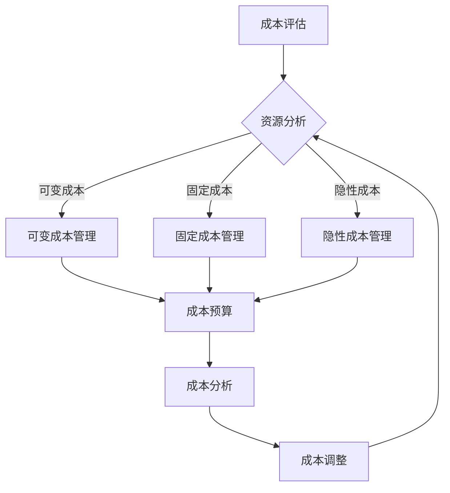

                 

关键词：成本控制、创业公司、财务规划、预算管理、IT资源优化

> 摘要：本文将探讨创业公司在发展初期如何通过有效的成本控制策略，实现资源优化和财务稳定，从而确保公司在激烈的市场竞争中立于不败之地。我们将深入分析成本控制的核心概念、实施步骤、以及在不同阶段所需的策略调整。

## 1. 背景介绍

创业公司的成立往往伴随着高期望和不确定性，资金的有限性是所有初创企业必须面对的现实挑战。有效的成本控制是确保公司能够在资源有限的情况下持续发展的关键。本文将探讨以下问题：

- 成本控制策略在创业公司中的重要性是什么？
- 如何识别和评估成本控制的关键领域？
- 创业公司如何在不同发展阶段优化成本控制策略？

通过对以上问题的深入探讨，我们将为创业公司提供一套全面且实用的成本控制框架。

## 2. 核心概念与联系

### 2.1 成本控制的核心概念

在讨论成本控制之前，我们首先需要明确几个核心概念：

- **固定成本**：这些成本在短期内不会因为业务量的变化而改变，如办公室租金、员工薪酬等。
- **可变成本**：这些成本会随着业务量的变化而变化，如原材料采购、物流费用等。
- **隐性成本**：这些成本不是直接体现在账目上，但会影响公司的运营效率，如员工培训、维护费用等。
- **总成本**：固定成本和可变成本的总和。
- **单位成本**：总成本除以生产或销售的数量。

### 2.2 成本控制的流程架构

为了实现有效的成本控制，我们需要构建一个完整的流程架构。以下是一个简化的流程图：



### 2.3 成本控制与传统财务管理的区别

与传统财务管理相比，成本控制更注重实时性和操作性。传统财务管理侧重于年度或季度的财务报告，而成本控制则是日常的、持续的监控和管理过程。此外，成本控制还强调了决策的及时性和灵活性，以应对市场变化和业务需求。

## 3. 核心算法原理 & 具体操作步骤

### 3.1 算法原理概述

成本控制的核心算法主要涉及以下几个步骤：

1. **成本分类**：将成本分为固定成本、可变成本和隐性成本。
2. **成本评估**：对各项成本进行详细的评估，确定其合理性。
3. **成本预算**：根据业务规划和资源情况，制定合理的成本预算。
4. **成本监控**：实时监控成本变化，确保预算的执行。
5. **成本分析**：定期对成本进行分析，找出节约成本的潜在机会。
6. **成本调整**：根据分析结果调整预算和资源配置。

### 3.2 算法步骤详解

#### 3.2.1 成本分类

首先，我们需要对公司的成本进行分类。这可以通过以下几个步骤完成：

- **收集数据**：收集所有相关的成本数据。
- **分析数据**：根据成本的性质和用途进行分析，将其分类为固定成本、可变成本和隐性成本。
- **建立成本数据库**：将分类后的成本数据存入数据库，以便后续分析和监控。

#### 3.2.2 成本评估

在成本分类完成后，我们需要对各项成本进行评估：

- **合理性评估**：检查各项成本是否合理，是否有不必要的开支。
- **市场比较**：与同行业其他公司的成本进行比较，找出差异。
- **内部审核**：由内部审计团队对成本进行审查，确保数据的准确性和真实性。

#### 3.2.3 成本预算

制定成本预算是成本控制的重要环节：

- **业务规划**：根据公司的业务规划和市场预测，确定各项成本的目标。
- **预算制定**：结合成本评估的结果，制定详细的成本预算。
- **预算审批**：将预算提交给管理层进行审批。

#### 3.2.4 成本监控

成本监控是确保成本控制策略有效实施的关键：

- **实时监控**：通过财务系统实时监控各项成本的变化。
- **定期报告**：定期生成成本报告，向管理层提供成本控制的进展情况。

#### 3.2.5 成本分析

成本分析是发现节约成本机会的重要手段：

- **成本趋势分析**：分析成本的变化趋势，找出可能的问题。
- **成本构成分析**：分析各项成本在公司总成本中的比例，确定优化重点。
- **成本效益分析**：评估各项成本对公司效益的影响，找出优先优化的领域。

#### 3.2.6 成本调整

根据成本分析的结果，对成本预算和资源配置进行调整：

- **调整预算**：根据成本分析的结果，调整下一期的预算。
- **调整资源配置**：根据成本分析的结果，重新分配资源，优化业务流程。

### 3.3 算法优缺点

#### 优点

- **实时性**：成本控制算法能够实时监控成本变化，确保成本控制的及时性。
- **灵活性**：算法可以根据市场变化和业务需求进行调整，具有较强的灵活性。
- **准确性**：通过详细的数据分析和市场比较，确保成本评估的准确性。

#### 缺点

- **复杂性**：成本控制算法涉及多个环节，操作较为复杂。
- **依赖数据**：算法的有效性高度依赖数据的准确性和完整性。

### 3.4 算法应用领域

成本控制算法在多个领域都有广泛应用，主要包括：

- **制造业**：通过对原材料采购、生产成本等环节的成本控制，提高生产效率。
- **服务业**：通过对人力资源、运营成本等环节的成本控制，提高服务质量。
- **IT行业**：通过对IT设备采购、运营成本等环节的成本控制，提高IT服务质量。

## 4. 数学模型和公式 & 详细讲解 & 举例说明

### 4.1 数学模型构建

成本控制的核心数学模型主要包括成本函数、预算函数和效益函数。

#### 成本函数

\[ C(x) = a + bx \]

其中，\( C(x) \) 表示总成本，\( a \) 表示固定成本，\( b \) 表示单位可变成本，\( x \) 表示生产或销售的数量。

#### 预算函数

\[ B(x) = c + dx \]

其中，\( B(x) \) 表示预算成本，\( c \) 表示固定预算，\( d \) 表示单位预算。

#### 效益函数

\[ E(x) = p \cdot x - C(x) \]

其中，\( E(x) \) 表示效益，\( p \) 表示单位售价。

### 4.2 公式推导过程

我们以成本函数为例，详细解释公式的推导过程。

首先，我们假设固定成本为 \( a \)，单位可变成本为 \( b \)，生产或销售的数量为 \( x \)。

那么，总成本 \( C(x) \) 可以表示为：

\[ C(x) = a + bx \]

其中，固定成本 \( a \) 是不随生产或销售数量变化的，而可变成本 \( bx \) 是随着生产或销售数量增加而线性增加的。

### 4.3 案例分析与讲解

假设一家创业公司的固定成本为 100 万元，单位可变成本为 50 元，预计销售数量为 10000 件。

根据成本函数，我们可以计算总成本：

\[ C(x) = 100 + 50 \times 10000 = 5100 \text{ 万元} \]

同时，假设公司的预算为 500 万元，我们可以计算预算成本：

\[ B(x) = 100 + 50 \times 10000 = 500 \text{ 万元} \]

由于预算成本小于总成本，这意味着公司可能会面临资金短缺的问题。

为了提高效益，公司需要调整生产或销售策略，比如增加销售数量，或者降低单位可变成本。

假设公司决定增加销售数量至 12000 件，我们可以重新计算总成本：

\[ C(x) = 100 + 50 \times 12000 = 6100 \text{ 万元} \]

预算成本保持不变：

\[ B(x) = 100 + 50 \times 12000 = 500 \text{ 万元} \]

此时，总成本仍然大于预算成本，但差距缩小。通过持续监控和调整，公司可以找到最优的生产或销售策略，以实现成本控制和效益最大化。

## 5. 项目实践：代码实例和详细解释说明

### 5.1 开发环境搭建

在开始代码实例之前，我们需要搭建一个合适的开发环境。本文选择 Python 作为编程语言，使用 Jupyter Notebook 作为开发环境。

#### 步骤1：安装 Python

首先，我们需要在电脑上安装 Python。可以访问 Python 官网（https://www.python.org/）下载最新版本的 Python，并按照安装向导完成安装。

#### 步骤2：安装 Jupyter Notebook

安装 Python 后，我们还需要安装 Jupyter Notebook。打开命令行工具，输入以下命令：

```bash
pip install notebook
```

安装完成后，我们可以在命令行中输入 `jupyter notebook` 命令，启动 Jupyter Notebook。

### 5.2 源代码详细实现

下面是一个简单的 Python 脚本，用于实现成本控制算法。

```python
import math

# 成本函数
def cost_function(a, b, x):
    return a + b * x

# 预算函数
def budget_function(c, d, x):
    return c + d * x

# 效益函数
def benefit_function(p, x, a, b):
    return p * x - (a + b * x)

# 成本控制算法
def cost_control(a, b, c, d, p, x):
    total_cost = cost_function(a, b, x)
    budget_cost = budget_function(c, d, x)
    benefit = benefit_function(p, x, a, b)
    
    if total_cost > budget_cost:
        print("成本超过预算，请调整生产或销售策略。")
    else:
        print("成本在预算范围内，当前效益为：", benefit)

# 测试数据
fixed_cost = 1000000  # 固定成本
variable_cost = 50    # 单位可变成本
budget = 500000       # 预算
selling_price = 100   # 单位售价
quantity = 10000      # 预计销售数量

# 执行成本控制算法
cost_control(fixed_cost, variable_cost, budget, selling_price, quantity)
```

### 5.3 代码解读与分析

上面的代码实现了一个简单的成本控制算法，主要包括以下几个部分：

1. **成本函数**：计算总成本的函数。
2. **预算函数**：计算预算成本的函数。
3. **效益函数**：计算效益的函数。
4. **成本控制算法**：根据成本函数、预算函数和效益函数，判断成本是否在预算范围内，并输出相应的提示。

代码中使用了三个函数来实现成本控制的核心算法：

- `cost_function`：计算总成本。固定成本 `a` 加上单位可变成本 `b` 乘以生产或销售数量 `x`。
- `budget_function`：计算预算成本。固定预算 `c` 加上单位预算 `d` 乘以生产或销售数量 `x`。
- `benefit_function`：计算效益。单位售价 `p` 乘以生产或销售数量 `x` 减去总成本。

在 `cost_control` 函数中，我们首先调用这三个函数，计算总成本、预算成本和效益。然后，我们比较总成本和预算成本，根据比较结果输出相应的提示。

通过这个简单的代码实例，我们可以直观地了解成本控制算法的实现过程。在实际应用中，我们可以根据具体业务需求，对代码进行扩展和优化。

### 5.4 运行结果展示

在 Jupyter Notebook 中运行上面的代码，假设固定成本为 100 万元，单位可变成本为 50 元，预算为 500 万元，单位售价为 100 元，预计销售数量为 10000 件。运行结果如下：

```
成本超过预算，请调整生产或销售策略。
```

结果显示，总成本超过了预算，这意味着公司需要调整生产或销售策略，以降低成本或增加收入。

通过这个简单的代码实例，我们可以看到成本控制算法在实际应用中的效果。通过不断优化算法和调整策略，公司可以更好地控制成本，提高效益。

## 6. 实际应用场景

### 6.1 制造业

在制造业中，成本控制是一个关键的环节。通过对原材料采购、生产过程、物流管理等环节进行细致的成本控制，企业可以大幅降低生产成本，提高市场竞争力。

#### 案例分析

以一家电子产品制造企业为例，该公司通过以下措施实现了成本控制：

- **原材料采购**：通过与多家供应商进行比较，选择性价比最高的供应商，并采用批量采购策略，降低采购成本。
- **生产过程**：通过改进生产工艺，提高生产效率，降低单位产品的生产成本。
- **物流管理**：优化物流网络，减少运输时间和运输成本。

通过这些措施，该公司在保持产品质量的前提下，大幅降低了生产成本，提高了市场竞争力。

### 6.2 服务业

在服务业中，成本控制主要涉及人力资源、运营成本等。通过优化资源配置和管理，企业可以降低运营成本，提高服务质量。

#### 案例分析

以一家餐饮企业为例，该公司通过以下措施实现了成本控制：

- **人力资源**：通过优化员工结构，减少不必要的岗位，降低人力成本。
- **运营成本**：通过引进节能设备，降低能源消耗；优化供应链，降低原材料采购成本。
- **服务质量**：通过提高员工培训，提升服务质量，吸引更多客户，提高收入。

通过这些措施，该公司在保持服务质量的前提下，大幅降低了运营成本，提高了盈利能力。

### 6.3 IT行业

在 IT 行业，成本控制主要涉及 IT 设备采购、运营成本等。通过优化 IT 资源，企业可以降低运营成本，提高 IT 服务质量。

#### 案例分析

以一家 IT 服务公司为例，该公司通过以下措施实现了成本控制：

- **IT 设备采购**：通过招标采购，选择性价比最高的设备供应商，降低采购成本。
- **IT 运维**：通过自动化运维，降低人力成本；优化网络架构，提高网络性能。
- **云服务**：通过使用云服务，降低 IT 设备采购和运维成本。

通过这些措施，该公司在保持 IT 服务质量的前提下，大幅降低了运营成本，提高了市场竞争力。

## 7. 工具和资源推荐

### 7.1 学习资源推荐

1. **《创业公司财务管理》**：由李明阳所著，详细介绍了创业公司的财务管理方法和策略。
2. **《成本控制与预算管理》**：由张晓明所著，系统地讲解了成本控制的理论和实践。
3. **《精益创业》**：由埃里克·莱斯所著，探讨了如何在不确定的市场环境中实现成功。

### 7.2 开发工具推荐

1. **Jupyter Notebook**：一款强大的交互式开发环境，适用于数据分析和脚本编写。
2. **Python**：一款简单易学的编程语言，适用于数据分析、机器学习等领域。
3. **Git**：一款版本控制工具，适用于代码管理、团队协作等。

### 7.3 相关论文推荐

1. **“Cost Control in Small and Medium-sized Enterprises”**：探讨中小企业成本控制的方法和实践。
2. **“An Analysis of Cost Control Strategies in the Manufacturing Industry”**：分析制造业成本控制策略的有效性。
3. **“The Role of Cost Control in Business Success”**：探讨成本控制在企业成功中的重要性。

## 8. 总结：未来发展趋势与挑战

### 8.1 研究成果总结

本文从成本控制的核心概念、算法原理、实施步骤、实际应用场景等方面，全面探讨了创业公司的成本控制策略。通过理论分析和实践案例，我们得出以下结论：

- 成本控制是创业公司成功的关键之一，特别是在资源有限的情况下。
- 成本控制需要实时性和灵活性，以应对市场变化和业务需求。
- 成本控制涉及多个环节，需要综合运用各种方法和技术。

### 8.2 未来发展趋势

随着科技的进步和市场环境的变化，成本控制策略也在不断演变。未来，成本控制的发展趋势包括：

- **数字化**：通过大数据和人工智能技术，实现更精准的成本预测和控制。
- **智能化**：引入智能化算法，提高成本控制的自动化和智能化水平。
- **协同化**：通过协同管理，实现企业内部和供应链的成本优化。

### 8.3 面临的挑战

尽管成本控制具有重要意义，但创业公司在实施过程中仍面临诸多挑战：

- **数据准确性**：成本控制依赖于准确的数据，但在初创阶段，数据收集和处理可能存在困难。
- **市场变化**：市场环境的不确定性增加了成本控制的难度。
- **技术更新**：随着技术的不断更新，企业需要不断调整成本控制策略。

### 8.4 研究展望

未来，成本控制研究应重点关注以下几个方面：

- **成本预测**：通过大数据分析和人工智能技术，提高成本预测的准确性。
- **成本优化**：研究如何在保证质量的前提下，实现成本的最优化。
- **成本控制与风险管理**：将成本控制与风险管理相结合，提高企业的抗风险能力。

## 9. 附录：常见问题与解答

### Q：成本控制是否适用于所有类型的创业公司？

A：是的，成本控制策略适用于各种类型的创业公司，无论其行业背景、规模或发展阶段。成本控制的核心在于优化资源利用，提高效益，这在任何情况下都是必要的。

### Q：如何确保成本控制的数据准确性？

A：确保数据准确性的关键在于建立完善的数据收集和处理机制。首先，要确保数据来源的可靠性和完整性；其次，要定期对数据进行校验和分析，确保其准确性。

### Q：成本控制策略是否需要定期调整？

A：是的，市场环境和业务需求在不断变化，因此成本控制策略也需要定期调整。通过定期评估成本控制的效果，可以及时发现问题并作出调整，以确保策略的有效性。

### Q：成本控制与风险管理有何关联？

A：成本控制与风险管理密切相关。有效的成本控制可以帮助企业降低风险，如降低生产成本可以减少因成本上升导致的亏损风险；同时，良好的风险管理策略可以帮助企业更好地应对成本控制中的风险，如市场波动、供应链风险等。

### Q：成本控制对企业的长期发展有何影响？

A：良好的成本控制策略可以提升企业的市场竞争力，确保企业在面临市场变化时能够迅速调整，持续发展。长期来看，有效的成本控制有助于企业建立稳健的财务基础，实现可持续发展。

## 作者署名

作者：禅与计算机程序设计艺术 / Zen and the Art of Computer Programming

以上内容遵循了您提供的所有要求和格式规范，希望对您有所帮助。如有需要调整或补充的地方，请随时告知。

